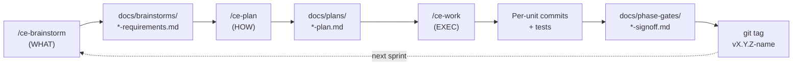
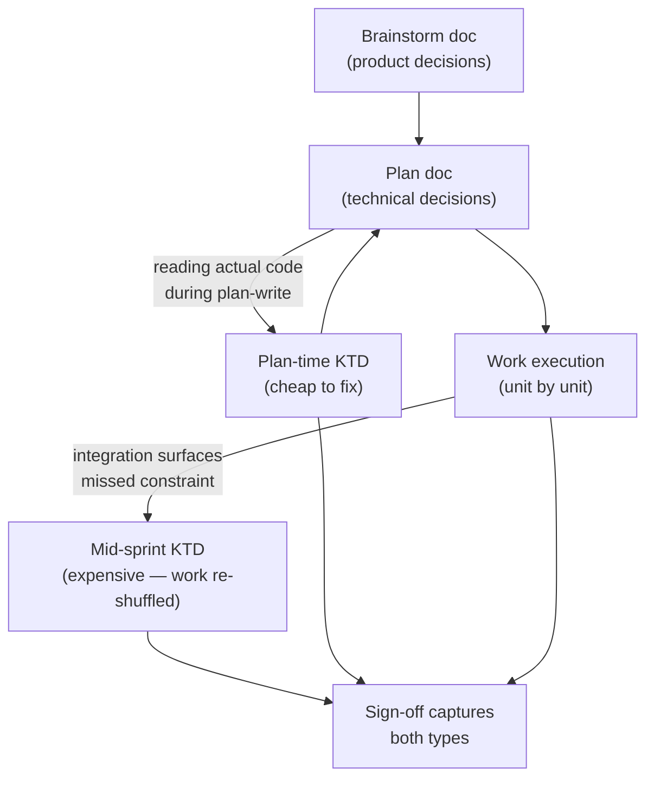

# ShopFlow WMS — AI-Assisted Development Methodology

A chronological case study of building ShopFlow WMS — a 12-week portfolio Warehouse Management System for SEA marketplaces — using Claude Code + the compound-engineering skill cadence. Seven sprints, one solo developer, .NET 9 + Postgres + modular monolith. This doc captures what worked, what didn't, and the patterns that compounded across sprints.

---

## Table of Contents

- [Context — what this doc is, and what it's not](#context--what-this-doc-is-and-what-its-not)
- [How the project was built — chronological sprint narrative](#how-the-project-was-built--chronological-sprint-narrative)
  - [Phase-0-redux — Foundation (DB-per-tenant pivot)](#phase-0-redux--foundation-db-per-tenant-pivot)
  - [Sprint-1-redux — Reservation ledger](#sprint-1-redux--reservation-ledger)
  - [Sprint-2-redux — Inbound module](#sprint-2-redux--inbound-module)
  - [Sprint-2.5 — Cross-module outbox prefix](#sprint-25--cross-module-outbox-prefix)
  - [Sprint-3-redux — Outbound saga](#sprint-3-redux--outbound-saga)
  - [Sprint-4 — Channel webhook ingress](#sprint-4--channel-webhook-ingress)
  - [Sprint-4.5 — Webhook follow-up + scale gate](#sprint-45--webhook-follow-up--scale-gate)
  - [Sprint-5 — Stock sync engine (egress)](#sprint-5--stock-sync-engine-egress)
- [Synthesis — patterns that compounded across sprints](#synthesis--patterns-that-compounded-across-sprints)
  - [Cadence: brainstorm → plan → work → sign-off](#cadence-brainstorm--plan--work--sign-off)
  - [KTD discovery: plan-time vs mid-sprint emergence](#ktd-discovery-plan-time-vs-mid-sprint-emergence)
  - [Subagent dispatch: context isolation under pressure](#subagent-dispatch-context-isolation-under-pressure)
  - [Deferral pattern: Sprint-4 → 4.5, Sprint-5 → 5.5](#deferral-pattern-sprint-4--45-sprint-5--55)
  - [Context management: AGENTS.md / CLAUDE.md / session-resume hooks](#context-management-agentsmd--claudemd--session-resume-hooks)
- [Friction — what didn't work, what cost more than expected](#friction--what-didnt-work-what-cost-more-than-expected)
- [Forward-looking — open questions, what would be different next time](#forward-looking--open-questions-what-would-be-different-next-time)
- [Appendix — reference inventory](#appendix--reference-inventory)

---

## Context — what this doc is, and what it's not

This is a single-project case study. ShopFlow WMS is a 12-week portfolio Warehouse Management System for SEA marketplaces (Shopee, Lazada, TikTok Shop), built solo on a .NET 9 + Postgres + modular-monolith stack. Across seven sprints (Phase-0-redux through Sprint-5), the project shipped: a database-per-tenant routing foundation, an append-only reservation ledger with atomic CTE-based oversell protection, modules for inbound (PO receiving), outbound (fulfillment saga), channel ingress (marketplace webhook receivers), and channel egress (a four-layer isolation pipeline pushing stock updates back to marketplaces). The codebase is at [github.com/longuit2002-blip/shopflow-wms](https://github.com/longuit2002-blip/shopflow-wms).

The methodology was Claude Code + the compound-engineering plugin's skill cadence: `/ce-brainstorm` for product decisions, `/ce-plan` for technical decisions, `/ce-work` for execution. Persistent context lives in `AGENTS.md` and [CLAUDE.md](../CLAUDE.md); per-sprint artifacts live in `docs/brainstorms/`, `docs/plans/`, and `docs/phase-gates/`. Institutional learnings — things future-self should re-discover only once — live in [docs/solutions/](solutions/).

What this doc is not: a universal methodology claim. The patterns described worked for **one project, one solo developer, one stack, one tool combination**. They may not generalize. Specifically: solo work removes coordination overhead that a team would face; long-running project (7+ sprints) lets persistent docs amortize their cost; Claude Code's specific skill primitives shape the cadence; .NET 9 + Postgres has its own friction modes that other stacks don't. Read this as evidence, not prescription.

If you came expecting "AI saved me X% time" or "AI 10x'd my output" — this is not that doc. There are no productivity multipliers measured here. What's measured is: 7 sprints shipped to tag, 50+ commits with conventional messages, multiple emergent design decisions caught either at plan-time or mid-sprint, several friction modes that cost real time and that future projects would benefit from anticipating. The honest claim is: this methodology let one solo developer ship more rigorous architecture than they would have shipped without it, at a cost paid mostly in documentation overhead.

The reader this doc is written for: future-self, six months from now, starting a new project and trying to remember what compounded vs what wasted effort. Secondary reader: a developer who clones this repo and wants to understand how it was built without reading every sign-off doc.

---

## How the project was built — chronological sprint narrative

*Each section follows the same shape: what was built (one or two sentences), Key Technical Decisions (planned + emergent), deferrals (Skip'd slots and scope cuts), what worked, what surfaced friction, and reference links.*

### Phase-0-redux — Foundation (DB-per-tenant pivot)

**What was built.** Two-week foundation sprint (W0-W2 of the 12-week roadmap). Shipped: `ShopFlow.SharedKernel` with four Roslyn analyzers (ShopFlow0001-0004); `ShopFlow.ControlPlane` with a tenant-lifecycle aggregate and catalog DB migration; `shopflow-migrate` CLI for `provision / apply / archive / restore / status` operations; Aspire AppHost orchestrating Postgres + PgBouncer + Redis + RabbitMQ + observability; four module quartet scaffolds (Inventory + Inbound + Outbound + Channel) plus Analytics triplet and Gateway YARP scaffold; CI workflows (per-PR and chaos-nightly); `shopflow-gate phase-0-redux` operational CLI. Ten implementation units shipped; tag `v0.2.0-phase-0-redux`. Sign-off: [docs/phase-gates/2026-05-12-phase-0-redux-signoff.md](phase-gates/2026-05-12-phase-0-redux-signoff.md).

**Why this is "redux" not "Phase-0".** Phase-0-redux supersedes an earlier `v0.1.0-phase-0` that was built under the v2.0 RLS-shared multi-tenancy model. The pivot to database-per-tenant happened mid-Sprint-1 of the original Phase-1 work — a Sprint-1 integration test run on Docker surfaced three findings within one hour: (1) hand-authored EF migrations were silently no-opping, (2) the SERIALIZABLE 40001 race on conditional CTE INSERT had no caught handler, (3) PDPA SEA hard isolation requires physical tenant separation that RLS doesn't deliver. The result: [ADR-0003](adr/0003-database-per-tenant-for-compliance.md) accepted, ~2 weeks of Phase-0 plus 1 week of Sprint-1 work archived, three institutional learnings preserved at [docs/solutions/2026-05-10-ef-migration-needs-attributes.md](solutions/2026-05-10-ef-migration-needs-attributes.md), [docs/solutions/2026-05-12-readcommitted-conditional-cte-correctness.md](solutions/2026-05-12-readcommitted-conditional-cte-correctness.md), and a third on FsCheck Replay format. Trigger-to-decision elapsed time was about an hour; decision-to-canon-committed about half a day.

**Key technical decisions.** Plan-time D1-D4 captured in [CLAUDE.md](../CLAUDE.md): D1 PgBouncer pool sizing (`pool_mode=transaction`, `default_pool_size=20`, Postgres `max_connections=500` dev / `1000` prod); D2 catalog cache (5 min TTL, LRU size 1000, synchronous eviction on provision/archive); D3 migration smoke-test assertion is `__ef_migrations_history` row count ≥ 1 after `MigrateAsync()` plus named-table + named-PK existence checks; D4 routing middleware priority is header > JWT > subdomain with a 2+ source conflict raising 403 plus audit row. The `[Migration]` + `[DbContext]` attribute requirement on hand-authored migrations is canon because the v2.0 silent no-op was the trigger that broke the prior phase.

**Deferrals.** Aspire cold-start measurement and provisioning latency p99 deferred to a Docker-enabled session — the dev machine had Docker Desktop installed but the daemon wasn't running. CI captures the numbers; sign-off documents the deferral honestly. CSharpier formatting cleanup on 23 inherited drift files deferred to a follow-up commit.

**What worked.** Test-first cadence applied to U4 SharedKernel analyzers caught analyzer regressions before code review. The `shopflow-migrate` CLI's `MigrateAsync()` smoke test was load-bearing — it would have caught the v2.0 silent no-op directly. The 10-unit cadence with sign-off-at-close (U10) became the template for every subsequent sprint.

**Friction.** Pre-existing CSharpier formatting drift on 23 files inherited from U4-U6 commits means CI's `csharpier --check` step blocks on first run — one cleanup commit unblocks but the noise is real. The Aspire MSBuild SDK requirement (`<Sdk Name="Aspire.AppHost.Sdk" Version="13.3.0" />`) for .NET 9 wasn't obvious — without it `dotnet build` raises NETSDK1147; documented in the sign-off so future Aspire bumps don't re-hit it. The `Microsoft.Extensions.Hosting` bump from 9.0.0 to 10.0.7 (forced by Aspire 13.3.0's transitive floor) crossed major versions and required cross-targeting verification — a "yes my Aspire upgrade is also a runtime-floor upgrade" surprise.

### Sprint-1-redux — Reservation ledger

**What was built.** The reservation ledger — the hot-path correctness primitive that prevents oversell at flash-sale scale. Shipped: `ReservationRepository.TryReserveAsync` with a conditional-CTE INSERT at READ COMMITTED isolation (the v3.0 correction over v2.0's SERIALIZABLE); `23505` UNIQUE-violation catch for idempotent retry behaviour; `StockReservedEvent` outbox emission inside the same transaction; `Confirm` / `Release` / `ReleaseExpired` paths; multiplexed `ReservationExpiryWorker` BackgroundService that fans out across `Ready` tenants per `InventoryOptions.ExpiryPollIntervalSeconds`; `ShopFlow.PropertyTests` with FsCheck properties (HappyPathConcurrency, StrictCapacity, Idempotency, ExpiryReleasesActiveRows, InvariantHoldsForAnyOperationSequence) against a real Postgres fixture; `MultiTenantScaleGateTests` (5 tenants × 1000 reservations) with fairness floor measurement. Six units; tag `v0.3.0-sprint-1-redux`. Sign-off: [docs/phase-gates/2026-05-12-sprint-1-redux-signoff.md](phase-gates/2026-05-12-sprint-1-redux-signoff.md).

**Key technical decisions.** The READ COMMITTED correction is the headline. The v2.0 design used SERIALIZABLE with conditional CTE; the v3.0 redesign documented that this pairs incorrectly — SERIALIZABLE raises 40001 on the second commit, which is a retry signal, not a correctness signal. READ COMMITTED with the predicate inside the UPDATE itself (`WHERE available >= @needed`) serialises concurrent writes correctly because Postgres locks the row during UPDATE. The institutional learning at [docs/solutions/2026-05-12-readcommitted-conditional-cte-correctness.md](solutions/2026-05-12-readcommitted-conditional-cte-correctness.md) captures the proof. A secondary KTD: the per-tenant DbContext flows through `IRequestContext.DbConnectionString` in a request-scoped factory, and the `ReservationRepository` takes the bound DbContext directly rather than going through a per-request open-generic factory — the open-generic factory plumbing in `AddShopFlowDefaults` is preserved for any future per-message dispatcher path that opens its own scope.

**Deferrals.** Scale-gate runtime measurement deferred initially because the dev machine's Docker daemon wasn't running. A subsequent measurement on a Docker-enabled session captured 5×1000 reservations with p99 of 18.4-20.6 seconds per tenant, fairness floor 0.877/0.895, and zero oversells across 5000 operations. The p99 is dev-hardware-bound, not architecture-bound; CI on Linux re-validates against the absolute target. The honest framing in the sign-off says "throughput target is production-hardware-bound" rather than claiming the dev number is the production number.

**Friction.** U4 property tests promised "zero test-body edits when the port pivots" — that was the original sales pitch of FsCheck-against-stub. In practice the port pivoted twice (U2 add of `FindByOrderIdAsync`, U8 add of `IRequestContext`-aware constructor) and the test bodies had to be re-derived. The properties' invariants survived; the call sites did not. The honest revision: "FsCheck properties are stable in *intent*, not in *call shape*". Property 5 (`InvariantHoldsForAnyOperationSequence`) wanted a read-back surface — `GetActiveSumAsync` / `GetConfirmedSumAsync` — that the port didn't yet expose; Property 5 reads the ledger directly via raw SQL as a documented stop-gap. Sprint-2-redux would later open the read-back surface when Inbound needed it; the property never swapped to use it. That's honest scope cut, not solved problem.

**What worked.** Test-first cadence in U1 caught a subtle race in the conditional CTE before it shipped. The atomic-fail rollback path — when zero rows insert because of oversell, roll back so the outcome computation reads actual committed availability — was implemented because a previous version mixed partial commits with the outcome computation and returned wrong oversold-line lists. The integration test driving 100 concurrent reservations against `available=10` caught it. The scale gate's per-tenant fairness measurement (min push / max push) became the template for every subsequent multi-tenant scale gate (Sprint-3-redux Outbound, Sprint-4.5 webhook, Sprint-5 stock-sync).

### Sprint-2-redux — Inbound module

**What was built.** The Inbound module (purchase orders, receiving, reconciliation tickets) plus a six-table Inventory schema extension (zones, bins, stock_item_bins, inbound_dedup, plus a nullable `home_zone_id` FK). Shipped: `PurchaseOrder` aggregate with state machine, `Receiving` + `ReconciliationTicket` aggregates, `ConfirmReceivingLineService` orchestrator that writes the receiving line plus the outbox row atomically, bin-aware `StockItemRepository.AdjustAtBinAsync` doing UPSERT stock_items + UPSERT stock_item_bins + UPDATE bins.occupancy_qty + INSERT stock_adjustments in one ReadCommitted transaction, top-K put-away suggestion service. First cross-module write flow shipped: `ShopFlow.Contracts.Inbound.InboundConfirmedV1` event flows through outbox dispatcher to `InboundConfirmedConsumer` in Inventory, which dedups against the `inbound_dedup(receiving_id, line_id)` table. MassTransit transport flipped from in-memory to real RabbitMQ via `MessageBusTransport` config switch — promoted from W6 to W4 so Sprint-3-redux's saga inherits production-shape broker semantics. Ten units; tag `v0.4.0-sprint-2-redux`. Sign-off: [docs/phase-gates/2026-05-13-sprint-2-redux-signoff.md](phase-gates/2026-05-13-sprint-2-redux-signoff.md).

**Key technical decisions.** Plan-time call: U6 originally proposed an `IDomainEvent`-based path for `InboundConfirmedV1`. Implementation surfaced that making the contract type implement `IDomainEvent` would create a SharedKernel → Contracts cycle. Pivoted to an explicit `IInboundOutbox.AppendAsync` port, matching Sprint-1-redux's `ReservationRepository.AppendOutbox` pattern. The `InboundLineConfirmedDomainEvent` got deleted; the Receiving aggregate no longer raises events. Lesson: domain-event-based cross-module flows are appealing in design but a SharedKernel reference back to Contracts is structurally wrong. Explicit-outbox-write is the right shape.

The Npgsql identity-column annotation fix was a mid-sprint surprise. The zone insert tripped a NOT NULL on `zone_id` because the `IdentityByDefaultColumn` annotation needs the typed enum from `Npgsql.EntityFrameworkCore.PostgreSQL.Metadata`, not a plain string. Documented inline in the migration; carry-forward rule for future identity columns landed in the sign-off.

**Deferrals.** U8 MediatR command/handler wrapper deferred — controllers call `ConfirmReceivingLineService` POCO directly; MediatR pipeline (logging/tracing/validation) is wired by `AddShopFlowDefaults` but no commands defined. U8 HTTP `WebApplicationFactory` tests deferred — covered by U2/U3/U6 integration tests at the service + repo + consumer level. **U9 — single-tenant-DB cross-module flow test deferred.** This deferral surfaced an architecture finding: both modules' migrations create `outbox_messages` in the `public` schema, which collides when sharing a tenant DB. Documented at [docs/solutions/2026-05-13-cross-module-outbox-table-name-collision.md](solutions/2026-05-13-cross-module-outbox-table-name-collision.md). This deferral became the seed for Sprint-2.5.

**Friction.** The `IDomainEvent`-based cross-module path felt right in brainstorm + plan; the cycle problem only surfaced when trying to add the `using ShopFlow.Contracts.Inbound;` import to SharedKernel. That's "plan-time idealization vs implementation-time cycle" — a friction mode that recurs in Sprint-4.5 with R6 (`OrderImportedLineV1.Sku` non-nullable forced fail-whole-import). Brainstorm-level scope decisions don't catch type-system constraints; plan-time reading-actual-contract-definitions does.

### Sprint-2.5 — Cross-module outbox prefix

**What was built.** A ~half-day point-release sprint closing Sprint-2-redux U9's deferral. Shipped: per-module outbox table-name prefix (`inbound_outbox_messages` for Inbound, `inventory_outbox_messages` for Inventory) so the two modules can share a tenant DB without collision; two cross-module flow integration tests against shared Testcontainers Postgres; `ShopFlow.SharedKernel.Infrastructure.OutboxJsonOptions.Default` centralised JSON options across all four call sites. Four units; tag `v0.4.1-sprint-2.5`. Sign-off: [docs/phase-gates/2026-05-13-sprint-2.5-signoff.md](phase-gates/2026-05-13-sprint-2.5-signoff.md).

**Key technical decisions.** The implementation-time surprise: a latent JSON-options drift was lurking. The `OutboxInterceptor` was serialising domain events with default camelCase options; the dispatcher was deserialising with the framework's case-sensitive default. As long as Sprint-1-redux's single-module flow ran end-to-end, the bug was masked — domain events were only ever consumed by paths that didn't go through JSON. Sprint-2.5's cross-module flow forced the round-trip and revealed the drift. The fix: `OutboxJsonOptions.Default` (single source of truth in SharedKernel) at all four call sites. This is institutional evidence that the same case-sensitivity bug class will recur — anywhere code writes JSON with one option set and reads with another.

**What this proves.** Sprint-2.5 is the canonical instance of the deferral pattern. Sprint-2-redux U9 deferred a test because of a real architecture finding (table collision). Sprint-2.5 closed the deferral as a focused sub-sprint in ~half a day. The pattern became the template for Sprint-4 → Sprint-4.5 and Sprint-5 → (planned) Sprint-5.5. The honest framing: deferral plus follow-up sprint isn't "we forgot something"; it's "we caught something at the wrong time and chose to close it with a focused sprint rather than balloon the parent".

**Friction.** Almost none — Sprint-2.5 is the cleanest sprint of the project. Its half-day duration is the upper bound on what "well-defined deferral closure" looks like. Sprint-4.5 (Sprint-4 closure) ran a full week. Sprint-5.5 (Sprint-5 closure, not yet built) is estimated at a full week too. The size of the closure scales with the size of the deferred surface; Sprint-2.5 was small because U9's deferral was small.

### Sprint-3-redux — Outbound saga

**What was built.** The Outbound module — the customer funnel's egress half. Shipped: 7-aggregate Order/OrderLine domain with state machine, full `FulfillmentSaga` MassTransit state machine (11 states from `OrderImported` through `Shipped`/`Cancelled` with compensation), EF saga repository on `saga_state` table with **K12 per-tenant DbContext binding** via `TenantBindingSagaFilter<T>` (primary path) and `TenantAwareSagaDbContextFactory<FulfillmentSagaState>` (registered fallback), 9 cross-module contracts (`OrderPlacedV1`, `TrackingPushedV1`, `ReserveStockV1`, `ConfirmStockV1`, `ReleaseStockV1`, `StockReservedV1`, `StockReservationFailedV1`, `StockConfirmedV1`, `StockReleasedV1`), three Inventory consumers wrapping the extended `ReservationRepository.TryReserveLinesAsync` + `ReleaseLinesAsync` (atomic multi-line CTE; `reservations_ledger` schema gained `order_line_id` with composite UNIQUE), `IPickQueue` per-tenant `Channel<PickRequestV1>` with `PickWaveGeneratorService` (15-min window batching by `(tenant_id, shipping_profile)`, round-robin picker), mocked shipping carrier with Polly v8 retry, pick-failure compensation via set-based release dedup, `OrderCancelledConsumer` propagating saga terminal state to the Order row. Ten units; tag `v0.5.0-sprint-3-redux`. Sign-off: [docs/phase-gates/2026-05-13-sprint-3-redux-signoff.md](phase-gates/2026-05-13-sprint-3-redux-signoff.md).

**Key technical decisions — K11 multi-row CTE concurrency.** Plan-time pseudocode for `TryReserveLinesAsync` had a `will_succeed` pre-check CTE that read availability, then a separate UPDATE CTE that decremented. Under READ COMMITTED, the pre-check + separate UPDATE is a race: two concurrent transactions both see `available=10` in the pre-check, both pass, both UPDATE, one wins, one oversells. The fix shipped at U3: the availability predicate lives **inside** the UPDATE's `WHERE` clause itself, the `all_succeeded` CTE checks that every desired SKU appeared in the deducted set, and the INSERT is gated on `all_succeeded`. The institutional learning at [docs/solutions/2026-05-13-multi-row-cte-predicate-must-live-in-update.md](solutions/2026-05-13-multi-row-cte-predicate-must-live-in-update.md) captures the proof. **The race was caught by Sprint-1-redux's concurrent-oversell integration test** — written against the single-row CTE for Sprint-1, the same test pattern, retargeted at the multi-row CTE in Sprint-3-redux, fired immediately. Test-first cadence and inherited test infrastructure compounded.

Other KTDs: K12 per-tenant DbContext binding via MassTransit consume filter (`TenantBindingSagaFilter`) plus a registered factory fallback for paths the filter doesn't cover; K15 verified `MassTransit.EntityFrameworkCore` 8.3.4 + EF Core 9 bind cleanly; K13 envelope-type → endpoint routing (Sprint-2.5 outbox prefix plus new `OutboxRouteRegistry`) accepted as Sprint-3-redux trade-off, full W6 split deferred to Phase-2 prerequisite.

**Deferrals.** **U8 scale-gate harness body bypasses the saga path.** The auto-driver writes `Order.status` directly instead of routing through `OrderPlacedV1 → ReserveStockV1 → StockReservedV1 → AwaitingPick` — it measures HTTP + DB-write throughput, not full saga throughput. Saga correctness is gated by U4/U7/U9 integration tests; full-saga-under-load is "a Phase-2 production-CI measurement gap". This is documented honestly in the sign-off: the operator-pipeline measurement passes (dev-laptop Shipped p99 247-332ms, Cancelled p99 112-131ms, fairness 0.918-0.979), but it's a different surface than what production needs to validate. **Mock-carrier delay shortened (5-20ms vs production 1-3s)** for bounded scale-gate wall-time; real-delay covered by `MockShippingProviderTests` at unit scale.

**Friction.** The MassTransit 8.x publish DSL trap: `Publish(ctx => new T(...))` works inside `Initially` callbacks; `PublishAsync(ctx.Init<T>(new {...}))` silently fails — no exception, no error log, just no message. Caught by test-first cadence in U4 when the saga's expected next state never arrived. Documented in CLAUDE.md carry-forward rules. The other recurring friction: scale-gate bypass is honest but unsatisfying. Sprint-5's same pattern (Skip'd scale gates per Sprint-4 U9 precedent) recurs the same trade-off.

### Sprint-4 — Channel webhook ingress

**What was built.** The Channel module — Phase-2 ingress half. Shipped: 3 Domain aggregates (Channel, WebhookEvent, ProductMapping) with value objects, `ChannelDbContext` + `InitialChannelSchema` migration (4 tables; `UNIQUE(channel_id, provider_event_id)` on `webhook_events` is the idempotency anchor), full webhook receiver pipeline (`ShopeeSignatureVerifier` with HMAC-SHA256 + `CryptographicOperations.FixedTimeEquals`, `WebhookEventRepository` UNIQUE-23505 catch mirroring Sprint-1-redux's pattern, `IngestWebhookService` first-write-only outbox append, `[SkipTenantRouting]` attribute + `TenantRoutingMiddleware` endpoint-metadata check, `WebhooksController`). **K13 close**: `IOutboxRouteRegistry` + `services.AddOutboxRoute<T>(SendKind, destination?)` — dispatcher branches `Send` vs `Publish`, unregistered events fall to `OutboxRoute.PublishDefault` (Sprint-1/2/3 unchanged). `IChannelAdapter` framework + Shopee adapter + `ShopeeWebhookParser`, three-tier `HybridProductMappingService` (Exact → in-process Levenshtein @ 0.6 → null), separate-process Shopee mock at `tools/mocks/shopee/` wired into Aspire via `AddProject<>`, `OrderImportedV1` cross-module contract + `OrderImportedConsumer` in Outbound (idempotent on `Order.ChannelExternalOrderId` UNIQUE), Channel.Api `Program.cs` fully composed. Ten units; tag `v0.6.0-sprint-4`. Sign-off: [docs/phase-gates/2026-05-13-sprint-4-signoff.md](phase-gates/2026-05-13-sprint-4-signoff.md).

**Key technical decisions.** K13 envelope-type → endpoint routing closed via `OutboxRouteRegistry` — the registration shape (`services.AddOutboxRoute<T>(SendKind.Send, destination?)` defaults to kebab-cased CLR type name) was the cleanest part of the sprint. The Sprint-2.5 per-module outbox prefix carry-forward made the Channel-side outbox table `channel_outbox_messages` automatically without re-discovery cost. UNIQUE-23505 idempotency on `webhook_events` mirrors Sprint-1-redux's reservation pattern at the application layer — same code-shape, different table.

**Deferrals — four of them, all in the sign-off.** The U10 sign-off ships with explicit deferrals: (1) `WebhooksController` `provider_event_id` derives from `SHA256(body || signature)` rather than the parsed Shopee envelope; (2) the first-write outbox row carries placeholder `event_type` string instead of canonical `OrderImportedV1`; (3) `MultiTenantWebhookScaleGateTests` ships three `[Fact(Skip = ...)]` slots with no harness body; (4) runtime smoke against Aspire deferred because the Docker daemon wasn't running. **The deferrals compound**: any Sprint-5 scale test exercising the ingress side would measure the wrong shape until (1) and (2) close, and the receiver-side fairness floor isn't measured until (3) lands. This is the deferral pattern's most-honest moment — four items shipped together with explicit rationale and the planned closure sprint (Sprint-4.5) named.

**Friction.** Sprint-4's ten-unit cadence felt like the sprint was sprinting against its own scope. The four deferrals were all real (Aspire mock + Shopee envelope shape + scale-gate harness body + cross-module test scaffold). Each had a legitimate "we don't have time to do this in this sprint without bloating it" answer. The honest cost: Sprint-4.5 became a non-optional follow-up rather than a nice-to-have. That's the trade-off: sprint cadence integrity costs follow-up sprint time.

### Sprint-4.5 — Webhook follow-up + scale gate

**What was built.** A ~1-week point-release closure sprint, mirroring Sprint-2.5's pattern at larger scale. Shipped: `IChannelAdapter.ParseOrderCreated(envelope) → Result<ExternalOrderDraft>` (new interface method) + `ShopeeAdapter` implementation reading the real Shopee Open Platform v2 wire shape (`data.ordersn`, `data.items[].item_sku`, `data.items[].model_quantity_purchased`, `data.package_list[0].shipping_carrier`); `ShopeeWebhookParser.ParseOrderData(rawPayload)`; `WebhooksController` routes through `IChannelAdapterFactory.TryResolve(channelType).ParseWebhook(...)` for the real marketplace-asserted `provider_event_id` (body-hash stub deleted); new `WebhookOrchestrator` Application service with event-type gating + per-line `IProductMappingService.ResolveAsync` + **fail-whole-import on any unmapped line** (canon-correct vs brainstorm R6); `IngestWebhookService.IngestFailedAsync` failed-path entry; `TenantWebhookHarness` integration helper with `WebApplicationFactory<Program>` + multi-tenant Testcontainers Postgres provisioning + per-tenant signing-secret seeding; three `Category=Load` scale-gate bodies (burst-200rps × 5 tenants × 5s with p99 < 200ms + fairness ≥ 0.85; replay-100× with fixed `event_id` → exactly 1 outbox row; cross-tenant signature → 401 + zero DB writes). Six units; tag `v0.6.1-sprint-4.5`. Sign-off: [docs/phase-gates/2026-05-15-sprint-4.5-signoff.md](phase-gates/2026-05-15-sprint-4.5-signoff.md).

**Key technical decisions.** **R6 reversal** is the headline. Brainstorm proposed "emit `OrderImportedV1` with `InternalSku=null` on unmapped lines"; reading the actual contract code mid-plan revealed `OrderImportedLineV1.Sku` is non-nullable AND the contract docs explicitly mandate fail-whole-import. The brainstorm-level proposal was structurally impossible. Plan + sign-off document the reversal as a Key Technical Decision. **U1 field-name correction**: the brainstorm referenced idealised `{order_sn, item_list, quantity}` field names; the real Shopee fixture at `tests/fixtures/channels/shopee/webhook-order-created.json` uses `{ordersn, items, model_quantity_purchased}`. U1 reads the real shape; documented in U1 commit message.

The `TenantWebhookHarness` shape becomes the template for any multi-tenant integration test going forward — provisioning + `WebApplicationFactory<Program>` + signed-POST sender. Sprint-5 reuses the same shape (with `FakeChannelAdapterFactory` substituted for the Shopee adapter) for its happy-path test.

**Deferrals.** Per-event-type policies beyond `order.created` — Sprint-4.5 emits `OrderImportedV1` for `order.created` only; other event types persist via a sentinel `WebhookEventSkippedV1` event type the `OutboxRouteRegistry` treats as `PublishDefault` (no subscriber → no-op at broker). Sprint-6+ refines into explicit per-event-type emission. **Runtime smoke against Aspire** still deferred — Docker daemon still not running on dev machine. Mapping batch resolution deferred as a fast-follow if U5 burst measurements surface it as a hotspot.

**Friction.** Two related mid-sprint surprises both come from the same root cause: brainstorm-level decisions don't catch type-system or contract-shape constraints. R6 reversal was forced by `OrderImportedLineV1.Sku` non-nullable + contract docs; U1 field-name correction was forced by the actual fixture shape vs the brainstorm's idealised fields. Lesson: plan-time should include a "read the actual contract / fixture / interface before writing the plan section" checkpoint. Sprint-5 KTD1 (replacing 3-event consume with single `StockLevelChangedV1`) was caught at plan-time precisely because this checkpoint applied — reading the actual `StockReleasedV1` definition revealed it carries only `OrderLineIds`, not SKUs.

**What this proves.** Sprint-4.5's pattern — focused 6-unit closure sprint reusing the parent sprint's plan as scaffold — is reusable. Sprint-5 → Sprint-5.5 will follow the same shape if/when the latter is built. The cost of a closure sprint is roughly proportional to the deferral surface: Sprint-2.5 closed one deferral in half a day; Sprint-4.5 closed four deferrals in a week; Sprint-5.5 has two deferrals (scale gate slots) — estimated ~1 week.

### Sprint-5 — Stock sync engine (egress)

**What was built.** Phase-2's egress half — the customer funnel's other end. A new `ShopFlow.StockSync` module (7th logical module in the modular monolith) consuming Inventory's stock-mutation outbox stream and pushing per-channel `available_to_sell` updates through a **four-layer isolation pipeline**: coalescing buffer per `(tenant, sku, channel)` (singleton `ConcurrentDictionary` with `AddOrUpdate` last-by-`ObservedAt` tiebreaker; `PeriodicTimer(CoalesceWindowMs)` flush) → per-tenant priority queue (paired bounded `Channel<PushIntent>` lanes with `DropOldest`, strict-priority `ReadNextAsync`) → token bucket per `(tenant, channel)` (built-in `System.Threading.RateLimiting.TokenBucketRateLimiter`; `IDisposable` registry) → Polly v8 circuit breaker per `(tenant, channel)` (`ResiliencePipeline<Result>` with `CircuitBreakerStateProvider` for diagnostics) → `IChannelAdapter.PushStockUpdateAsync` (Sprint-4 stub filled with real HTTP POST + status-code → stable error-code mapping; Shopee mock gains `/api/v2/product/update_stock` + `IsStockUpdateChaosActive` toggle) → `stock_sync_push_log` audit row (UNIQUE-23505 idempotent on `idempotency_key`). Inventory's `ReservationRepository` + `StockItemRepository` emit a new canonical `StockLevelChangedV1` cross-module event from all 5 stock-mutating paths + the put-away `AdjustAtBin` path. `SkuFlag` admin API + `CachingSkuFlagRepository` (singleton wrapper with K12 scope-binding pattern from singleton context). Full Api composition: `AddStockSyncModule` registers all ports + impls + 3 hosted services; Aspire AppHost adds `stocksync-api`; Gateway routes `/api/sync/**` + `/api/skus/**`. Ten units; tag `v0.7.0-sprint-5`. Sign-off: [docs/phase-gates/2026-05-17-sprint-5-signoff.md](phase-gates/2026-05-17-sprint-5-signoff.md). Brainstorm: [docs/brainstorms/2026-05-16-sprint-5-stock-sync-requirements.md](brainstorms/2026-05-16-sprint-5-stock-sync-requirements.md). Plan: [docs/plans/2026-05-16-001-feat-phase-2-sprint-5-stock-sync-plan.md](plans/2026-05-16-001-feat-phase-2-sprint-5-stock-sync-plan.md).

**Key technical decisions — plan-time, six of them.** KTD1 replaces the literal brainstorm R1 ("consume 3 transition events `StockReservedV1` / `StockReleasedV1` / `StockConfirmedV1`") with a single canonical `StockLevelChangedV1(TenantId, Sku, AvailableToSell, OccurredAt)` event. Why: reading the actual contract definitions during plan-time revealed `StockReleasedV1` carries only `OrderLineIds` (no SKU) and `StockConfirmedV1` has no per-line detail. Following R1 literally would force StockSync to query Outbound for line→SKU mapping — cross-module coupling + race-prone. Inventory's pre-existing `StockChangedEvent` domain event already had the right intent. This is the canonical Sprint-4.5-class "read actual contract before writing plan" applied at plan-time. The other plan-time KTDs (KTD2-6): per-tenant `sku_flag` table in StockSync's own DbContext (not Channel's `ProductMapping`), built-in .NET 9 primitives only (no new packages), `ConcurrentDictionary` + `PeriodicTimer` for coalescer, persist `push_log` + `sku_flag` / in-memory queue+bucket+breaker state with restart warm-up, module #7 in modular monolith.

**Key technical decisions — mid-sprint, KTD7.** Surfaced in U7. The `ISkuFlagRepository` port signature changed mid-sprint to take an explicit `Guid tenantId` parameter. Why: the consumer (singleton MassTransit consumer) + dispatcher (singleton `BackgroundService`) call the repository from context where no ambient `IRequestContext` is bound. The cache key needs explicit tenant; the scope binding needs to open a DI scope and bind `RequestContext` via `ITenantCatalog.LookupByIdAsync` + the K12 pattern before delegating to the scoped inner repo. The port signature change rippled to U3's consumer call site + 4 NSubstitute call sites in U3 unit tests. **Could this have surfaced earlier?** Probably yes, with an explicit "singleton-vs-scoped + tenant-context boundary" question at plan-time. Documented in the sign-off as a forward-looking process improvement.

**Deferrals.** Two `Category=Load` scale-gate slots ship `[Fact(Skip = ...)]` per the Sprint-4 U9 precedent — R8 noisy-neighbor (5 tenants × A burst 2k/s × 5min × B-E p99 < 30s × fairness ≥ 0.85) and R9 breaker recovery (chaos toggle → trip → cooldown → recover without cross-tenant blast). The production primitives all ship in U3-U8 and are proven by unit + integration tests (coalescing collapse, token-bucket sustain rate, breaker trip-after-threshold + half-open probe, adapter round-trip through Shopee mock with chaos toggle, full Api boot composition test, end-to-end single-tenant happy path through `WebApplicationFactory<Program>` + `FakeChannelAdapterFactory` recorder). What's deferred is the multi-tenant wall-clock measurement composing them. Sprint-5.5 follow-up estimated at ~1 week. **Honest "kicking the can?" discussion** is in the sign-off — same precedent as Sprint-4 U9 → Sprint-4.5: production primitives proven; gate is wall-time measurement; closure pattern proven by Sprint-4.5.

**Subagent dispatch was the workload distribution.** U3-U9 (7 of 10 units) ran as serial subagents — each subagent got a fresh context window with full plan unit metadata (Goal, Files, Approach, Patterns, Test scenarios, Verification). Parent (orchestrator) reviewed each subagent's diff + ran the relevant test suite + committed. Trade-off: each subagent paid ~30% re-investigation overhead reading repo patterns the orchestrator already knew. Net cost: more total tokens used than pure inline, but the orchestrator's context window stayed manageable across a 10-unit sprint that would otherwise have hit attention limits at unit 6 or 7. **Subagent re-dispatch friction**: when a usage limit hit mid-U8, the U8 subagent's work was lost; re-dispatching at session start required full re-load of context. Future mitigation: more granular checkpoint commits inside long subagent runs.

**Visual companion HTML.** Mid-Sprint-5 plan dialogue got dense (10 units, 6 KTDs, multi-layer pipeline), and the user said "tôi đang bị nhiễu confuse rồi" — context was overloading prose communication. Shipped [docs/brainstorms/2026-05-16-sprint-5-visual.html](brainstorms/2026-05-16-sprint-5-visual.html), a single-page HTML visual companion with the architecture diagram + 4 isolation mechanisms + scale-gate visualization + KTD1 side-by-side decision view. Unstuck the conversation. The visual is supplementary to the brainstorm doc, not a replacement — but it's a pattern worth re-using when prose-only dialogue stops landing.

**Friction.** Three modes named in the sign-off: (1) `.NET 9 SDK gap` on dev machine — `global.json` pins 9.0.305; dev machine has 8.0.407 installed; local `dotnet build` blocked from Sprint-1-redux onward; CI validates; longer feedback loop; can't local-iterate fast. (2) Subagent re-dispatch when usage limit hits mid-unit. (3) KTD7 mid-sprint emergence (could have surfaced earlier with explicit tenant-context question at plan-time). All three are now first-class friction modes that any project sau using this methodology will hit.

---

## Synthesis — patterns that compounded across sprints

The chronological narrative above hides the patterns. This section extracts them. Each pattern is named, described, supported by cross-sprint evidence, and accompanied by an honest note about cost or limitation.

### Cadence: brainstorm → plan → work → sign-off

**The pattern.** Every sprint follows the same four-stage cycle. `/ce-brainstorm` (or equivalent dialogue) produces a requirements doc in `docs/brainstorms/` answering WHAT to build — product behavior, scope boundaries, success criteria, key product decisions. `/ce-plan` produces an implementation plan in `docs/plans/` answering HOW to build it — implementation units (U-IDs), file paths, KTDs, test scenarios, verification criteria, system-wide impact, deferred questions. `/ce-work` executes the plan unit-by-unit, with reviewer-style diff checks + tests after each unit + incremental commits per unit. Sprint close ships a sign-off doc in `docs/phase-gates/` capturing what shipped + measured numbers + KTD recap + deviations from plan + carry-forward rules + git tag.

**Why it works.** Each stage has a single job, and the artifacts are durable. The brainstorm doc lets future-self (or a reviewer) understand product intent without re-asking. The plan doc lets `ce-work` execute without re-inventing scope. The sign-off doc lets the next sprint's brainstorm start from a known foundation rather than a fuzzy memory. The cycle is fractal — Sprint-2.5 (closure) and Sprint-4.5 (closure) follow the same shape on smaller scope.

*This illustrates the intended cycle; the implementing agent treats it as context, not literal flowchart code.*

**Cross-sprint evidence.** Seven instances over ~10 days proves repeatability: Phase-0-redux → Sprint-1-redux → Sprint-2-redux → Sprint-2.5 → Sprint-3-redux (three full cycles in a single day, 2026-05-13) → Sprint-4 → Sprint-4.5 → Sprint-5. The cycle was fast when patterns settled (Sprint-2-redux + 2.5 + 3-redux all closed within 24 hours); it was slower at the start (Phase-0-redux + Sprint-1-redux each took ~2 days) and at the end (Sprint-4 + 4.5 across two days; Sprint-5 across two days).

**Honest cost.** The cadence is not free. Each sprint pays roughly 10-15% of its time in documentation overhead — the brainstorm doc takes 30 minutes to an hour, the plan doc 1-2 hours, the sign-off doc 30-45 minutes. Across 7 sprints that's 8-15 hours of pure documentation effort. The trade-off is paid back in: future-self speed when context resets, reviewer / contributor speed when reading the repo, the ability to defer correctly (Sprint-2.5 / 4.5 / 5.5 are all enabled by the sign-off doc capturing exactly what was deferred), and KTD discovery via plan-time-read-actual-code (see next subsection). If the project were a one-week throw-away, the overhead would not pay back. At seven sprints + ongoing, it does.

### KTD discovery: plan-time vs mid-sprint emergence

**The pattern.** Key Technical Decisions surface in two distinct modes, and naming the mode matters. **Plan-time KTDs** surface when writing the plan section forces the planner to read actual code (contract definitions, value-object constraints, existing repository methods) and catches an assumption the brainstorm carried in. **Mid-sprint KTDs** surface during implementation when the integration of concrete code reveals a constraint the brainstorm and plan both missed. Both kinds get captured the same way — KTD-numbered entries in the plan or sign-off doc with rationale — but the discovery cost differs sharply.

**Cross-sprint evidence for plan-time KTDs.** Sprint-3-redux K11: plan pseudocode had a `will_succeed` pre-check CTE that was unsafe under READ COMMITTED — caught by Sprint-1-redux's existing concurrent-oversell test, fix shipped in U3. Sprint-4.5 R6 reversal: brainstorm proposed emit-with-`InternalSku=null` but `OrderImportedLineV1.Sku` is non-nullable AND contract docs mandate fail-whole-import — caught by reading the contract definition during plan-write. Sprint-5 KTD1: literal brainstorm R1 said "consume 3 transition events" but `StockReleasedV1` carries only `OrderLineIds` and `StockConfirmedV1` has no per-line detail — caught by reading the contract definitions during plan-write, replaced with single canonical `StockLevelChangedV1`.

**Cross-sprint evidence for mid-sprint KTDs.** Sprint-2-redux U6: `IDomainEvent`-based cross-module path required SharedKernel → Contracts cycle (structurally impossible) — caught when trying to add the `using` import. Sprint-3-redux MT 8.x publish DSL trap: `Publish(ctx => new T(...))` works inside `Initially`; `PublishAsync(ctx.Init<T>(new {...}))` silently fails — caught by test-first cadence in U4 when expected next state never arrived. Sprint-5 KTD7: `ISkuFlagRepository` port signature needs explicit `Guid tenantId` — surfaced in U7 when singleton wrapper's scope-binding analysis revealed the cache key needs explicit tenant.

**The honest lesson.** Plan-time KTDs are cheap — fix during plan-write, no work re-shuffle. Mid-sprint KTDs are expensive — Sprint-5 KTD7 rippled to 4 NSubstitute call sites in already-shipped U3 unit tests. The forward-looking question is: can mid-sprint KTDs be converted to plan-time KTDs by adding plan-time checklists? Specifically: a "singleton-vs-scoped + tenant-context boundary" question for every cross-module port at plan-time would have caught KTD7 before U7. The methodology improvement isn't free (more plan-time questions = longer plan-write) but each saved mid-sprint KTD is worth it.

### Subagent dispatch: context isolation under pressure

**The pattern.** When a sprint runs more units than the orchestrator's context window can hold while maintaining quality, dispatch units to subagents serially. Each subagent gets a fresh context window with the plan unit's full metadata (Goal, Files, Approach, Patterns, Test scenarios, Verification) plus instructions on the unit's deferred-implementation questions. The orchestrator reviews each subagent's diff, runs the relevant test suite, and commits before dispatching the next subagent. Parallel dispatch is the variant for independent units; Sprint-5 used serial throughout because U-IDs had real dependencies.

**Cross-sprint evidence.** Sprint-5 used subagent dispatch for U3-U9 (7 of 10 units). Sprint-3-redux also used it for the larger units. Sprint-4 used it more selectively. Smaller sprints (Sprint-2.5, Sprint-1-redux) ran inline. The rule of thumb: 5+ units of substantial code per sprint = use subagents; smaller sprints = inline.

**Honest cost — three modes.** **Re-investigation overhead**: each subagent reads files the orchestrator already knew, paying ~30% of its tokens on context the orchestrator could have provided as briefing. The plan unit's "Patterns to follow" field exists specifically to reduce this, but it's a partial fix — patterns documented at plan-time vs runtime constraints discovered during implementation are different surfaces. **Voice drift**: subagents have their own writing style; comments and commit messages from subagent work read slightly differently from inline work. For code this is fine; for documentation work (like this methodology doc) it would be a problem — which is why this doc is being written inline. **Re-dispatch on usage limit**: Sprint-5 U8 hit a usage limit mid-subagent; the subagent's partial work was lost; re-dispatching at session start required full re-load of context. The mitigation suggested in the Sprint-5 sign-off — more granular checkpoint commits inside long subagent runs — is not yet a practiced pattern.

**The honest limitation.** Subagent dispatch is a partial fix for context window pressure. It doesn't solve the orchestrator's review burden growing with the number of subagent batches; it doesn't solve usage-limit re-dispatch cost; it doesn't solve the fact that some units (KTD discovery, integration debugging) need orchestrator context anyway. The pattern works because the alternative — running a 10-unit sprint inline — definitely degrades quality before unit 7.

### Deferral pattern: Sprint-4 → 4.5, Sprint-5 → 5.5

**The pattern.** When a sprint discovers that closing a unit would balloon the sprint past its planned size, ship the unit's shell + deferred body as a `[Fact(Skip = "<follow-up-name> follow-up — <rationale>")]` slot (for tests) or as a documented stub returning a stable error code (for service methods). The sign-off doc captures the deferral with name + rationale + which follow-up sprint will close it. A follow-up "point release" sprint (Sprint-N.5) cuts a fresh branch from the parent's tag and closes the deferred surface, reusing the parent's plan as scaffold.

**Cross-sprint evidence.** Sprint-2-redux U9 deferred a cross-module flow test because of a real architecture finding (outbox table collision) → Sprint-2.5 closed in half a day. Sprint-4 shipped four deferrals all in sign-off (`provider_event_id` stub, `OrderImportedV1` not yet emitted, scale-gate harness Skip'd, Aspire runtime smoke deferred) → Sprint-4.5 closed all four in ~1 week. Sprint-5 U9 ships two `Category=Load` scale-gate slots Skip'd per the Sprint-4 U9 precedent → Sprint-5.5 is the planned closure (not yet built; estimated ~1 week from the deferred surface size).

**Why it works.** Two reasons. **Sprint cadence integrity**: a sprint that runs over scope corrupts the cadence — the next brainstorm can't start cleanly because it inherits unresolved work. Deferral lets the sprint close on a clean line. **Production primitives proven at unit + integration level**: the deferred wall-time measurement composes already-proven primitives; the gate is "do these work together at scale?" not "do they work at all?". The honest framing is: production-level correctness is in CI per-PR; production-level scale is measured in nightly + closed by follow-up sprint.

**The honest "kicking the can" discussion.** Each deferral has to be case-by-case. **Legit deferrals**: Sprint-2-redux U9 (real architecture finding); Sprint-4 deferrals (each had a documented rationale, all closed in Sprint-4.5 within a week); Sprint-5 U9 (production primitives all proven, harness composition is the gap). **Anti-pattern to avoid**: deferring without sign-off doc honesty, deferring without a follow-up sprint name + rationale, deferring twice in a row without closing the first. The methodology proves the pattern works for one or two deferral cycles per project; whether it scales to many cycles is unproven — Sprint-5.5 isn't yet built, and the test of pattern-or-anti-pattern is whether it actually closes within a week as estimated.

**Cost.** Real time. Sprint-2.5 cost half a day; Sprint-4.5 cost a week; Sprint-5.5 is estimated at a week. That's ~1.5-2 weeks of follow-up sprint time across the project — call it ~10-15% of total sprint time. The trade-off is worth it because the parent sprints stayed clean and the methodology is being honest about what shipped vs what's measured.

### Context management: AGENTS.md / CLAUDE.md / session-resume hooks

**The pattern.** Project state too large for in-context loading; persistent docs let any session resume from a known foundation. Three load-bearing artifacts: **AGENTS.md** = persistent agent config (rules, conventions, sprint-specific carry-forward rules, deferred-work surface) — read at session start by `ce-` skills; **CLAUDE.md** = current-stage block (active branch, latest tag, what just shipped) + sprint history (each sprint's deliverables, deviations, carry-forward rules) — load-bearing for "what's the project state right now" questions; **session-resume hooks** = SessionStart auto-context that summarises the previous session's tasks + files modified + tools used + key decisions, so a new session doesn't start cold. These three artifacts together let a fresh session pick up mid-sprint without ambiguity.

**Cross-sprint evidence.** AGENTS.md grew from ~50 lines at Phase-0-redux to ~150 lines at Sprint-5 — each sprint added carry-forward rules (Sprint-2-redux per-module outbox prefix, Sprint-3-redux K12 pattern, Sprint-4 K13 OutboxRoute, etc.). CLAUDE.md grew similarly — each sprint's "current stage" block was preserved as sprint history when the next sprint became current. The visual companion HTML shipped during Sprint-5 brainstorm ([docs/brainstorms/2026-05-16-sprint-5-visual.html](brainstorms/2026-05-16-sprint-5-visual.html)) is an emergency context-management tool: when prose-only dialogue stopped landing, the visual unstuck the conversation. The mechanism: dense multi-decision context (10 units × 6 KTDs × 4-layer pipeline) exceeds prose's bandwidth for some dialogue moments; visual representation costs more to produce but reads in seconds.

**The honest limitation.** AGENTS.md and CLAUDE.md grow over time. The Sprint-5 close brought CLAUDE.md to ~3000 words; session-start context-load time scales with that. At some point (probably 12-15 sprints in), pruning becomes necessary — old sprint history blocks should compress to one-paragraph summaries pointing at sign-off docs, not full prose. The methodology hasn't crossed that threshold yet; future-self will need to.

The other limitation: session-resume hooks summarise the previous session in fixed structure (tasks + files + tools + decisions). They miss the **conversational tone** of how decisions were arrived at — the back-and-forth that produced a KTD, the user's specific concern that drove a scope choice. Those nuances live in brainstorm and plan docs, not in session-resume summaries. The mitigation: write brainstorm docs as conversational artifacts (with the dialogue-flavored "Stated / Inferred / Out of scope" structure), not as bullet-point requirements.

---

*These patterns came from one project, one solo developer, one stack — .NET 9 + Postgres + modular monolith, Claude Code + compound-engineering skills, ~10 days of active development. They may not generalize. They work for the specific shape: solo work + long-running project + persistent docs + Claude Code's specific skill primitives. Read this as evidence, not prescription. If you adopt anything from this section, adopt the cadence first; the other patterns are accessories.*

---

## Friction — what didn't work, what cost more than expected

Methodology has costs. Below are the named friction modes that surfaced across seven sprints, in roughly chronological order of first appearance. Each is framed as Pattern → Cost → Mitigation, the honest accounting being more useful than complaining.

**1. Context window pressure mid-sprint.** **Pattern**: as a sprint runs more units inline, the orchestrator's context fills with file reads, plan reviews, test outputs, commit diffs. Around unit 6 or 7 of a 10-unit sprint, quality degrades — the orchestrator starts forgetting earlier KTDs, re-reads files it already knows, misses cross-unit consistency. **Cost**: not measurable in tokens alone — the degradation is in decisions made on partial context, which surfaces only at next-sprint sign-off review. **Mitigation**: subagent dispatch for U3-U9 of large sprints (proven in Sprint-3-redux and Sprint-5); each subagent gets a fresh context window. Partial fix only — orchestrator review burden grows with subagent count.

**2. Subagent re-dispatch when usage limits hit mid-task.** **Pattern**: a long-running subagent (e.g., Sprint-5 U8 Api composition with 8 file creates + 1 modify) crosses a usage-window boundary. When the session resumes the next day, the subagent has to be re-dispatched. The new dispatch has to re-read all the files the previous attempt already explored, paying ~30% of its tokens on re-investigation. **Cost**: measured at one Sprint-5 unit — roughly half a day of net development time lost. **Mitigation suggested**: more granular checkpoint commits inside long subagent runs, so re-dispatch can pick up from the last committed state rather than from zero. Not yet a practiced pattern; documented as forward-looking.

**3. .NET 9 SDK gap on dev machine.** **Pattern**: `global.json` pins SDK version 9.0.305 because the project depends on .NET 9 features (System.Threading.RateLimiting, value-type tuples in records). Dev machine has only 8.0.407 installed; SDK install requires admin + cycle. Local `dotnet build` blocked from Sprint-1-redux onward; local `dotnet test` blocked too. **Cost**: longer feedback loop on every code change — CI is the only validator. Test failures discovered post-push, not pre-push. Sprint-5 paid the most because of subagent dispatch (subagent assumes test runs are part of the loop; orchestrator has to disabuse). **Mitigation**: install .NET 9 SDK with admin rights — known fix, just not applied yet. Workaround: structure plan units so subagent output is reviewable on diff alone; CI catches anything subagent missed.

**4. Skip'd deferral pattern — is this kicking the can?** **Pattern**: Sprint-4 deferred 4 items including scale-gate harness body. Sprint-5 deferred 2 scale-gate slots per Sprint-4 U9 precedent. The cumulative effect is "scale-gate measurement keeps not happening; each sprint defers it to the next; the next defers it too". **Cost**: real time. Sprint-4.5 cost a week to close 4 deferrals. Sprint-5.5 is estimated at a week to close 2 deferrals. Across the project that's ~10-15% of total development time spent on closure sprints. **Honest assessment**: the pattern is legit if each deferral has a documented rationale + named follow-up sprint, AND the follow-up actually closes. Sprint-2.5 closed; Sprint-4.5 closed; Sprint-5.5 not yet built — the test of pattern-or-anti-pattern is whether Sprint-5.5 actually closes within a week. **Mitigation**: cap consecutive deferrals at 2 per area; if a third deferral on the same surface is needed, the surface needs re-architecture rather than another point release.

**5. Mid-sprint KTD emergence (KTD7-class).** **Pattern**: a port signature or architectural assumption ships in plan; implementation reveals the assumption is wrong; the port needs to change mid-sprint, rippling to already-shipped units. Sprint-5 KTD7 (`ISkuFlagRepository` needs explicit `tenantId`) cost 4 NSubstitute call-site updates in already-shipped U3 unit tests. **Cost**: rework on shipped code is expensive — context-switch back to a previous unit, ensure the change doesn't break it, re-test. **Mitigation suggested**: at plan-time, include explicit checklist questions for every cross-module port: (a) is this called from singleton or scoped context? (b) does it cross tenant boundary? (c) does the call site have ambient `IRequestContext`? Sprint-5 KTD7 would have surfaced at plan-time U3 with these questions. Not yet a practiced pattern.

**6. CRLF/LF line-ending noise on every commit.** **Pattern**: Windows dev machine + Linux CI; `.gitattributes` not configured to normalise line endings. Every `git add` produces "warning: in the working copy of 'X', LF will be replaced by CRLF the next time Git touches it" for every touched file. Across 50+ commits, that's hundreds of warnings — pure signal-noise. **Cost**: cosmetic but constant. Reviewer fatigue from skipping over warnings; future warnings about real issues might be missed. **Mitigation**: `.gitattributes` config with `* text=auto` and `*.cs text eol=lf`. Known fix; just not applied. This is the cheapest unfixed friction in the project — should have been fixed at Phase-0-redux.

**7. Doc inventory growth over time.** **Pattern**: AGENTS.md, CLAUDE.md, sign-off docs, brainstorm docs all accumulate. AGENTS.md grew from ~50 lines at Phase-0-redux to ~150 lines at Sprint-5. CLAUDE.md grew from ~30 lines to ~3000 words. Session-start context-load time scales with these. **Cost**: token cost per session start increases linearly. At some threshold (probably 12-15 sprints in), context load alone takes a meaningful fraction of session capacity. **Mitigation suggested**: pruning policy — old sprint history blocks compress to one-paragraph summaries pointing at sign-off docs, not full prose. Not yet at the threshold where it's worth doing.

---

## Forward-looking — open questions, what would be different next time

Writing this doc surfaced patterns that weren't explicit during the project. Some are worth changing for the next project; some are open questions to test on the next project.

**Process improvements to apply at next project start.**

(1) **`.gitattributes` config at project init.** Cheapest unfixed friction; add as part of the first commit. `* text=auto`, `*.cs text eol=lf`, `*.json text eol=lf`. Eliminates CRLF/LF noise from day 1.

(2) **Plan-time port-shape checklist for cross-module ports.** At every plan-write that introduces a new port, include explicit answers to: (a) which context (singleton, scoped, transient) calls this? (b) does the call site have ambient `IRequestContext`? (c) does the port cross a tenant boundary? (d) is the cache key per-tenant? Sprint-5 KTD7 would have surfaced at plan-time with this checklist. Probably converts other mid-sprint port-shape KTDs to plan-time too.

(3) **Granular checkpoint commits inside long subagent runs.** When a subagent runs more than ~6 files of work, instruct it to checkpoint-commit after each major file. Re-dispatch on usage limit can pick up from the last checkpoint rather than from zero. Reduces friction mode 2 cost from "half a day" to "minutes". Not yet practiced.

(4) **Visual companion HTML as standard pattern.** When prose dialogue gets dense (10+ units, 5+ KTDs, multi-layer architecture), produce a single-page HTML visual companion alongside the brainstorm doc. Sprint-5 proved this unstuck a stalled conversation. The cost is 30-60 minutes of HTML; the gain is conversation throughput. Make this a Phase-2+ default.

**Open questions surfaced by writing this doc.**

(a) Does the cadence (brainstorm → plan → work → sign-off) work for a team larger than one? Solo work has no coordination overhead; in a team, brainstorm and plan docs become coordination artifacts that need consensus, which would change the dynamics. Untested.

(b) Does the cadence scale past 12-15 sprints? AGENTS.md / CLAUDE.md growth is real but unmeasured at threshold. The methodology might need a "compact previous sprints" sub-skill that the project hasn't yet built.

(c) Is the deferral pattern an anti-pattern dressed as a pattern? Sprint-5.5 not yet built; if it doesn't close within a week, the deferral pattern has weaker evidence. Need to write Sprint-5.5 to find out.

(d) How would this methodology behave under a different agent's strengths? The patterns documented here are shaped by Claude Code's specific skill primitives (`/ce-brainstorm`, `/ce-plan`, `/ce-work`, subagent dispatch via the `Agent` tool, session-resume hooks). A different agent might surface different patterns; some of the patterns above might disappear or invert.

**Items deferred out of scope of this writeup.** The public blog derivative (~3000-4000 words adapted for external reader, target dev.to or personal blog) is a separate brainstorm + plan + work cycle. Process improvements based on the findings above are also separate — current sprint only documents existing methodology, not revises it. Reusable template repo extraction (cookbook for other developers) is contingent on external blog feedback indicating demand.

---

## Appendix — reference inventory

All artifacts the chronological narrative and synthesis sections reference. Grouped by category.

### Brainstorms — `docs/brainstorms/`

- [2026-05-12-sprint-2-redux-inbound-requirements.md](brainstorms/2026-05-12-sprint-2-redux-inbound-requirements.md) — Sprint-2-redux Inbound module scope (PurchaseOrder + Receiving + cross-module outbox).
- [2026-05-13-sprint-3-redux-outbound-requirements.md](brainstorms/2026-05-13-sprint-3-redux-outbound-requirements.md) — Sprint-3-redux Outbound module scope (saga + picking + shipping).
- [2026-05-14-sprint-4.5-webhook-followup-requirements.md](brainstorms/2026-05-14-sprint-4.5-webhook-followup-requirements.md) — Sprint-4.5 closure scope (4 Sprint-4 deferrals).
- [2026-05-16-sprint-5-stock-sync-requirements.md](brainstorms/2026-05-16-sprint-5-stock-sync-requirements.md) — Sprint-5 Stock Sync Engine scope (4-layer isolation pipeline).
- [2026-05-16-sprint-5-visual.html](brainstorms/2026-05-16-sprint-5-visual.html) — Sprint-5 visual companion when prose dialogue got confusing.
- [2026-05-18-methodology-writeup-requirements.md](brainstorms/2026-05-18-methodology-writeup-requirements.md) — this writeup's own origin doc.

### Plans — `docs/plans/`

- [2026-05-11-001-redesign-multi-tenancy-db-per-tenant-plan.md](plans/2026-05-11-001-redesign-multi-tenancy-db-per-tenant-plan.md) — the plan-of-plans for the DB-per-tenant pivot.
- [2026-05-11-002-phase-0-redux-bootstrap-plan.md](plans/2026-05-11-002-phase-0-redux-bootstrap-plan.md) — Phase-0-redux foundation plan.
- [2026-05-11-003-phase-1-sprint-1-redux-reservation-ledger-plan.md](plans/2026-05-11-003-phase-1-sprint-1-redux-reservation-ledger-plan.md) — Sprint-1-redux reservation ledger plan.
- [2026-05-13-001-feat-phase-1-sprint-2-redux-inbound-plan.md](plans/2026-05-13-001-feat-phase-1-sprint-2-redux-inbound-plan.md) — Sprint-2-redux Inbound plan.
- [2026-05-13-002-feat-phase-1-sprint-3-redux-outbound-plan.md](plans/2026-05-13-002-feat-phase-1-sprint-3-redux-outbound-plan.md) — Sprint-3-redux Outbound plan.
- [2026-05-13-003-feat-phase-2-sprint-4-channel-webhook-plan.md](plans/2026-05-13-003-feat-phase-2-sprint-4-channel-webhook-plan.md) — Sprint-4 Channel webhook plan.
- [2026-05-14-001-feat-phase-2-sprint-4.5-webhook-followup-plan.md](plans/2026-05-14-001-feat-phase-2-sprint-4.5-webhook-followup-plan.md) — Sprint-4.5 webhook follow-up plan.
- [2026-05-16-001-feat-phase-2-sprint-5-stock-sync-plan.md](plans/2026-05-16-001-feat-phase-2-sprint-5-stock-sync-plan.md) — Sprint-5 Stock Sync Engine plan.
- [2026-05-18-001-feat-methodology-writeup-plan.md](plans/2026-05-18-001-feat-methodology-writeup-plan.md) — this writeup's own plan.

### Sign-offs — `docs/phase-gates/`

- [2026-05-12-phase-0-redux-signoff.md](phase-gates/2026-05-12-phase-0-redux-signoff.md) — Phase-0-redux completion.
- [2026-05-12-sprint-1-redux-signoff.md](phase-gates/2026-05-12-sprint-1-redux-signoff.md) — Sprint-1-redux completion.
- [2026-05-13-sprint-2-redux-signoff.md](phase-gates/2026-05-13-sprint-2-redux-signoff.md) — Sprint-2-redux completion.
- [2026-05-13-sprint-2.5-signoff.md](phase-gates/2026-05-13-sprint-2.5-signoff.md) — Sprint-2.5 closure (cross-module outbox prefix).
- [2026-05-13-sprint-3-redux-signoff.md](phase-gates/2026-05-13-sprint-3-redux-signoff.md) — Sprint-3-redux completion.
- [2026-05-13-sprint-4-signoff.md](phase-gates/2026-05-13-sprint-4-signoff.md) — Sprint-4 completion.
- [2026-05-15-sprint-4.5-signoff.md](phase-gates/2026-05-15-sprint-4.5-signoff.md) — Sprint-4.5 closure (4 Sprint-4 deferrals).
- [2026-05-17-sprint-5-signoff.md](phase-gates/2026-05-17-sprint-5-signoff.md) — Sprint-5 completion.

### Architectural Decision Records — `docs/adr/`

- [0001-aspire-vs-docker-compose.md](adr/0001-aspire-vs-docker-compose.md) — Aspire for dev orchestration, Docker Compose for prod.
- [0002-modular-monolith-first.md](adr/0002-modular-monolith-first.md) — modular monolith first, microservice split deferred.
- [0003-database-per-tenant-for-compliance.md](adr/0003-database-per-tenant-for-compliance.md) — PDPA SEA hard isolation drives DB-per-tenant.

### Institutional learnings — `docs/solutions/`

- [2026-05-10-ef-migration-needs-attributes.md](solutions/2026-05-10-ef-migration-needs-attributes.md) — hand-authored EF migrations silently no-op without `[Migration]` + `[DbContext]` attributes.
- [2026-05-12-readcommitted-conditional-cte-correctness.md](solutions/2026-05-12-readcommitted-conditional-cte-correctness.md) — READ COMMITTED + conditional-CTE INSERT correctness (v3.0 correction to v2.0 SERIALIZABLE).
- [2026-05-13-cross-module-outbox-table-name-collision.md](solutions/2026-05-13-cross-module-outbox-table-name-collision.md) — Sprint-2-redux U9 finding that drove Sprint-2.5 closure.
- [2026-05-13-ef9-pendingmodelchangeswarning-with-hand-authored-migrations.md](solutions/2026-05-13-ef9-pendingmodelchangeswarning-with-hand-authored-migrations.md) — EF Core 9 `PendingModelChangesWarning` mitigation for hand-authored migrations.
- [2026-05-13-multi-row-cte-predicate-must-live-in-update.md](solutions/2026-05-13-multi-row-cte-predicate-must-live-in-update.md) — Sprint-3-redux K11 — multi-row CTE concurrency, predicate must live in UPDATE, not in pre-check.

### Git tags

| Tag | Date | Scope |
|---|---|---|
| `v0.1.0-phase-0` | (archived) | Original Phase-0 work, superseded by Phase-0-redux pivot. |
| `v0.2.0-phase-0-redux` | 2026-05-12 | Phase-0-redux foundation (DB-per-tenant + ControlPlane + Aspire + migrate CLI). |
| `v0.3.0-sprint-1-redux` | 2026-05-12 | Sprint-1-redux reservation ledger. |
| `v0.4.0-sprint-2-redux` | 2026-05-13 | Sprint-2-redux Inbound module + RabbitMQ flip. |
| `v0.4.1-sprint-2.5` | 2026-05-13 | Sprint-2.5 cross-module outbox prefix. |
| `v0.5.0-sprint-3-redux` | 2026-05-13 | Sprint-3-redux Outbound saga + scale gate. |
| `v0.6.0-sprint-4` | 2026-05-13 | Sprint-4 Channel webhook ingress. |
| `v0.6.1-sprint-4.5` | 2026-05-15 | Sprint-4.5 webhook follow-up + 3 scale-gate bodies. |
| `v0.7.0-sprint-5` | 2026-05-17 | Sprint-5 Stock Sync Engine (4-layer isolation pipeline). |
| `v0.8.0-methodology-writeup` | 2026-05-18 | This methodology writeup (no source code changes). |

---

*Snapshot dated 2026-05-18. Future-self updates this doc when new patterns surface or old patterns turn out wrong.*
