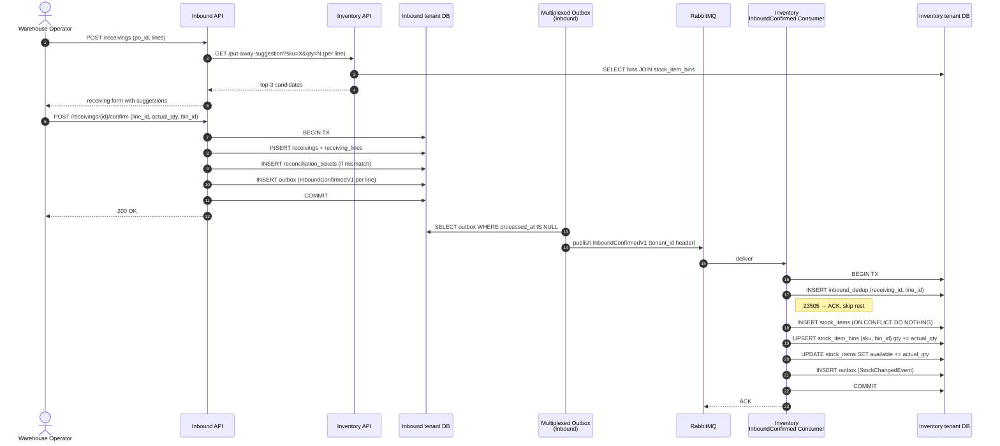
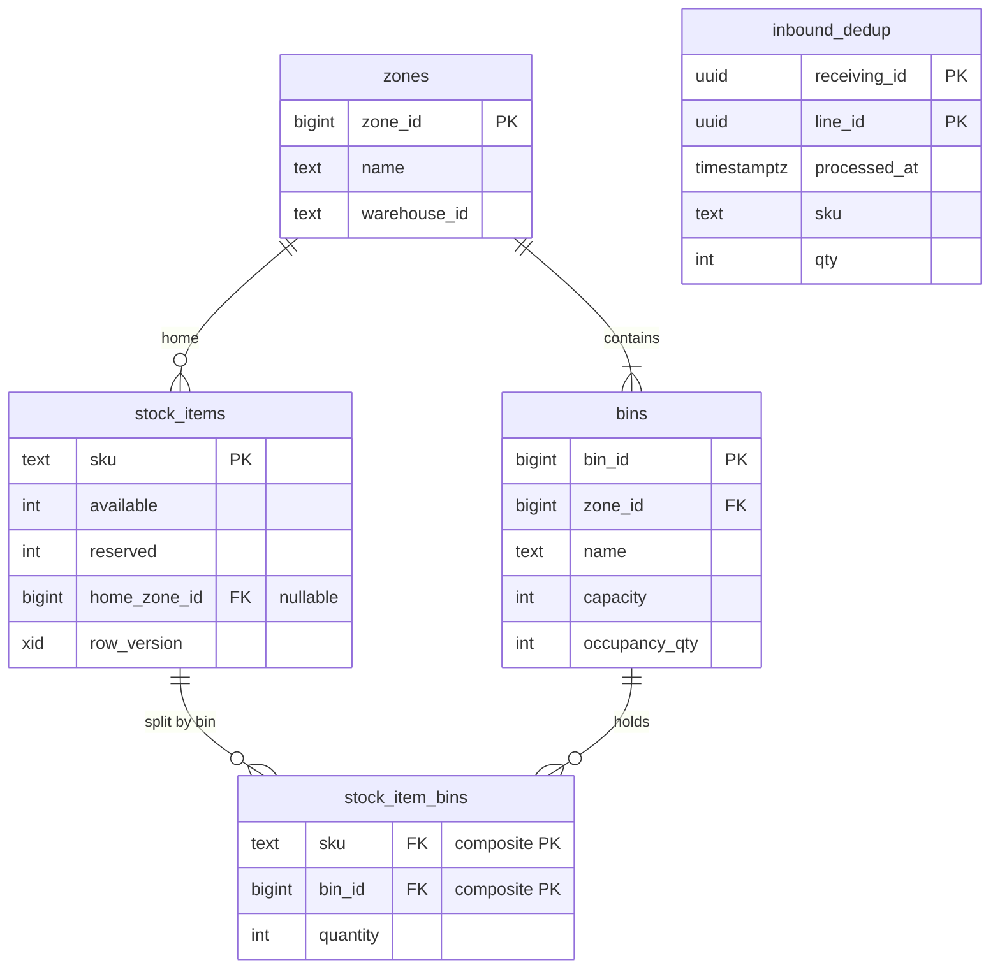

# feat: Phase-1 Sprint-2-redux — Inbound module + Inventory bin/zone extension + real RabbitMQ

## Summary

Ship the Inbound module (PO + per-line receiving + reconciliation tickets), extend the Inventory schema with zones / bins / per-bin stock + a put-away suggestion service, and wire the first real cross-module flow (`InboundConfirmed` event from Inbound → MassTransit on RabbitMQ → Inventory consumer applies stock to a bin). Promote the MassTransit transport flip from W6 to W4 so Sprint-3-redux's fulfillment saga inherits a production-shape broker.

---

## Problem Frame

The Phase-0-redux foundation + Sprint-1-redux reservation ledger ship a system that can hold and reserve stock under flash-sale load, but stock arrives in the warehouse via a path that today is entirely manual — direct INSERTs into `stock_items` from seed scripts and tests. The warehouse operator persona (Product Plan §3.1) has no first-class flow for receiving an inbound shipment against a known PO, recording what physically arrived, identifying mismatches, or being told where to put the units. Without this flow, the system cannot operate a real warehouse — Sprint-1-redux's reservation correctness has nothing to reserve against beyond test data.

Architecturally, all inter-module communication so far has used MassTransit's in-memory transport (per ADR-0002 W1-W5 stance). Sprint-2-redux is the first cross-module write flow (Inbound → Inventory) and in-memory transport does not exercise the failure modes — network partitions, broker downtime, message redelivery, consumer crash mid-handle — that Sprint-3's fulfillment saga will absolutely depend on. Shipping real RabbitMQ in this sprint means Sprint-3 inherits a tested transport rather than discovering its sharp edges during saga work.

---

## Requirements Trace

All 20 requirements from the [origin brainstorm doc](../brainstorms/2026-05-12-sprint-2-redux-inbound-requirements.md) carry forward. Reproduced here for tracking; full prose lives in origin.

**PO lifecycle and persistence**
- **R1.** PO has states `Draft → Open → PartiallyReceived → Closed`, plus `Cancelled` as alternate terminal from `Draft` or `Open`. One-way transitions.
- **R2.** PO carries supplier ref, expected delivery date, N line items each with SKU + expected_qty + running received_qty.
- **R3.** PO + lines live in Inbound's per-tenant DB; no `tenant_id` column.

**Receiving and per-line confirmation**
- **R4.** Receiving is per-line; multiple receiving sessions per PO supported (partial delivery).
- **R5.** Each line confirmation captures `(actual_qty, suggested_bin_id, actual_bin_id, operator_id, occurred_at UTC)`.
- **R6.** Idempotency anchor: composite `UNIQUE(receiving_id, line_id)`.
- **R7.** Operator may override the suggested bin with any active bin in the same warehouse; override recorded but not blocked.
- **R8.** PO transitions to `PartiallyReceived` when any line has received_qty > 0 and at least one line has received_qty < expected_qty; transitions to `Closed` when every line has received_qty == expected_qty (overage counts as Closed; surplus captured via reconciliation ticket per R9).

**Discrepancy handling**
- **R9.** Quantity mismatch (`actual_qty != expected_qty`) writes an append-only `reconciliation_tickets` row with `Open` status carrying `(po_id, line_id, receiving_id, expected_qty, actual_qty, occurred_at)`. Receiving succeeds regardless of direction; resolution workflow deferred.

**Cross-module event contract**
- **R10.** One `InboundConfirmed` event per confirmed line. Payload: `(po_id, line_id, receiving_id, sku, actual_qty, bin_id, tenant_id, occurred_at)`. Outbox row INSERTed in the same Inbound DB transaction as the `receiving_line` row.
- **R11.** Inventory consumer is idempotent across redelivery via persisted dedup key on `(receiving_id, line_id)`.
- **R12.** MassTransit transport is **real RabbitMQ**. ADR-0002's W6 transport flip promoted to W4 with a postscript on that ADR.

**Inventory schema extension**
- **R13.** Inventory gains tables: `zones (zone_id PK, name, warehouse_id)`, `bins (bin_id PK, zone_id FK, name, capacity, occupancy_qty)`, `stock_item_bins (sku FK, bin_id FK, quantity, composite PK)`, plus `stock_items.home_zone_id` nullable FK.
- **R14.** `stock_items.available` stays the per-SKU aggregate. `stock_item_bins.quantity` is the per-bin breakdown. Invariant: `SUM(stock_item_bins.quantity WHERE sku=X) == stock_items.available + stock_items.reserved` for any X with at least one bin row. Reservation flow continues to operate against the aggregate; bin-level inventory does not change Sprint-1-redux reservation semantics.
- **R15.** Inventory consumer auto-creates `stock_items` row (`available=0, reserved=0, home_zone_id=NULL`) on first `InboundConfirmed` for an unknown SKU, idempotently (`INSERT … ON CONFLICT (sku) DO NOTHING`).

**Put-away suggestion**
- **R16.** Inventory exposes a synchronous read endpoint that returns top-3 bin candidates for a SKU+qty, ranked by `(zone_priority, available_capacity DESC, current_occupancy ASC)` where `available_capacity = bin.capacity - bin.occupancy_qty`. Tiebreaker: bin name lex order ASC.
- **R17.** Put-away suggestion queried synchronously by Inbound's API during the receiving flow (in-process call in modular monolith; same endpoint works when W6 splits the host).

**Tests and gates**
- **R18.** Unit tests cover Domain state machines for PO, Receiving, ReceivingLine + reconciliation ticket creation rule.
- **R19.** Integration tests use Testcontainers Postgres + Testcontainers RabbitMQ. Tagged `Category=Integration`. Covers happy path, partial delivery, discrepancy ticket, operator bin override, Inventory auto-create, consumer redelivery idempotency, put-away ranking.
- **R20.** Cross-module flow test exercises Inbound → RabbitMQ → Inventory end-to-end and asserts `StockChangedEvent` lands in Inventory's outbox.

---

## Scope Boundaries

Carried verbatim from origin's Scope Boundaries:

- Reconciliation ticket **resolution** workflow → Sprint-2.5 or Phase-2.
- "Add SKU" admin endpoint → Phase-2 admin surfaces.
- Velocity-based / ABC slotting algorithms → Phase-3+.
- Multi-warehouse / multi-zone-per-tenant geography → Phase-3+.
- Returns inflow (return-restock back to bins) → Phase-2 Sprint-4 with channel adapters.
- PO import from CSV / external API → Phase-3 or never within 12-week scope.
- Configurable discrepancy thresholds → Phase-2 if needed.
- Kafka transport switch → rejected against RabbitMQ for this workload (RabbitMQ-vs-Kafka comparison preserved in origin's Key Decisions).
- CDC / Debezium event log replay → Phase-3+ infrastructure.
- StockItemRepository remaining stubs (`FindBySkuAsync`, non-bin `AdjustAsync`) → Sprint-3-redux for Outbound's picking flow.

### Deferred to Follow-Up Work

- **Real wall-time integration runtime measurement on production hardware.** Dev laptop numbers captured in Sprint-1-redux sign-off; CI on Linux re-validates.
- **CSharpier formatting cleanup** carried over from prior sprints — one consolidating commit lands when Husky/pre-commit is installed.
- **W6 host split** (modular monolith → 6 process-per-module). The cross-module flow ships HTTP-shaped now (Inbound calls Inventory put-away endpoint) so the W6 split is mechanical.

---

## Key Technical Decisions

Resolved during planning from the origin doc's Deferred-to-Planning list + plan-time inferences:

- **Event namespace**: `ShopFlow.Contracts.Inbound.InboundConfirmedV1`. Integration events live in `ShopFlow.Contracts` per AGENTS.md §10. Versioned suffix (`V1`) allows the contract to evolve via parallel `V2` without breaking consumers.
- **RabbitMQ connection string source**: `IConfiguration.GetConnectionString("rabbitmq")` — Aspire's default convention for the AppHost-injected resource. Production reads from environment variable in docker-compose; tests inject Testcontainers-provided connection string into `IConfiguration` via `ConfigurationBuilder.AddInMemoryCollection`.
- **MassTransit transport switch**: `ShopFlowDefaultsOptions.MessageBusTransport` enum (`InMemory` | `RabbitMq`). Default `RabbitMq`. Tests that don't need a broker set `InMemory` explicitly in the options callback when calling `AddShopFlowDefaults`.
- **PO aggregate boundary**: `PurchaseOrder` is the aggregate root; `PurchaseOrderLine` is part of the aggregate (no independent repository, no independent lifecycle). Line state derives from PO state machine plus `received_qty` per line.
- **Receiving aggregate boundary**: `Receiving` is the aggregate root; `ReceivingLine` is part of the aggregate. `ReconciliationTicket` is a separate aggregate — append-only log, no parent reference inside the receive transaction beyond capturing identifiers.
- **Migration ordering**: Inbound's `InitialInboundSchema` migration creates all five Inbound tables (`purchase_orders`, `purchase_order_lines`, `receivings`, `receiving_lines`, `reconciliation_tickets`) in one migration — mirrors the U8 "schema-only blessed reference" shape. Inventory's `AddBinsAndZonesAndInboundDedup` is a separate migration on the Inventory DbContext, applied after `InitialInventorySchema`. Both carry `[Migration]` + `[DbContext]` attributes.
- **Inventory consumer idempotency table**: `inbound_dedup (receiving_id, line_id, processed_at, sku, qty)` with composite PK `(receiving_id, line_id)`. Consumer INSERTs the dedup row first (catches `23505` UniqueViolation on redelivery → ACK without re-processing); then applies the stock changes; finally commits the transaction.
- **Put-away suggestion is sync HTTP call** from Inbound API to Inventory's read endpoint. In the W1-W5 modular monolith both modules are in one host — call goes through `HttpClient` against `http://localhost:<port>/api/inventory/put-away-suggestion`. Same endpoint shape works when W6 splits the host.
- **Put-away tiebreaker**: bin name lex order ASC when `available_capacity` + `current_occupancy` tie. Deterministic, simple, surfaces stable to operators.
- **Testcontainers RabbitMQ image**: `rabbitmq:3-management-alpine` per AGENTS.md §8.56. Expected ~3-5s container startup; shared across the test collection via fixture. Sprint-1-redux integration suite is ~6s; adding RabbitMQ container brings total to ~10-12s — within per-PR budget.
- **Inbound's outbox dispatcher**: new instantiation `MultiplexedOutboxDispatcher<InboundDbContext>` registered as a hosted service in Inbound's `AddInboundModule` extension. The dispatcher code itself reused from SharedKernel.

---

## High-Level Technical Design

> *Directional guidance — see per-unit Approach fields for the canonical wiring. Implementation should use this as context, not as code to reproduce.*

### Cross-module flow

### Inventory bin schema

---

## Implementation Units

### U1. Inbound module quartet scaffold + initial schema migration

**Goal:** Stand up the Inbound module's four `.csproj` (Domain / Application / Infrastructure / Api) following the AGENTS.md §11.76-79 shape. Ship the `InitialInboundSchema` migration that creates all five Inbound tables. Wire `AddInboundModule` to the kernel composition root. No behavior beyond the migration applying cleanly.

**Requirements:** R3 (table layout), R18 (CI smoke test coverage), structural prereq for U2-U5.

**Files:**
- Create: `src/Services/Inbound/ShopFlow.Inbound.Domain/ShopFlow.Inbound.Domain.csproj`
- Create: `src/Services/Inbound/ShopFlow.Inbound.Application/ShopFlow.Inbound.Application.csproj`
- Create: `src/Services/Inbound/ShopFlow.Inbound.Infrastructure/ShopFlow.Inbound.Infrastructure.csproj` (replace the U9 stub)
- Create: `src/Services/Inbound/ShopFlow.Inbound.Api/ShopFlow.Inbound.Api.csproj`
- Create: `src/Services/Inbound/ShopFlow.Inbound.Infrastructure/InboundDbContext.cs` (5 DbSets, applies entity configs)
- Create: `src/Services/Inbound/ShopFlow.Inbound.Infrastructure/Migrations/20260513000001_InitialInboundSchema.cs` (with `[Migration]` + `[DbContext]` attributes)
- Create: `src/Services/Inbound/ShopFlow.Inbound.Infrastructure/InboundServiceCollectionExtensions.cs` (`AddInboundModule(IConfiguration)`)
- Create: `src/Services/Inbound/ShopFlow.Inbound.Api/Program.cs` (calls `AddShopFlowDefaults` then `AddInboundModule`)
- Modify: `src/Services/Inbound/AGENTS.md` (delta-only; replace U9 stub state with Sprint-2-redux notes)
- Modify: `ShopFlow.sln` — add the four new csproj
- Modify: `tests/ShopFlow.SharedKernel.IntegrationTests/MigrationSmokeTests.cs` — add `InboundMigration_AppliesAndLeavesNamedObjects` test asserting the 5 tables, PKs, and `UNIQUE(receiving_id, line_id)` on `receiving_lines`

**Approach:**
- Tables: `purchase_orders (id PK, supplier_ref, expected_delivery_at, status, created_at, updated_at, cancelled_at?)`, `purchase_order_lines (id PK, po_id FK, sku, expected_qty, received_qty)`, `receivings (id PK, po_id FK, operator_id, occurred_at, created_at)`, `receiving_lines (id PK, receiving_id FK, line_id FK to purchase_order_lines, actual_qty, suggested_bin_id, actual_bin_id, created_at, UNIQUE(receiving_id, line_id))`, `reconciliation_tickets (id PK, po_id, line_id, receiving_id, expected_qty, actual_qty, status, created_at)`.
- Add `outbox_messages` table (same shape as Inventory's per-tenant outbox).
- Override `OnConfiguring` in `InboundDbContext` to suppress `RelationalEventId.PendingModelChangesWarning` per [docs/solutions/2026-05-13-ef9-pendingmodelchangeswarning-with-hand-authored-migrations.md](../solutions/2026-05-13-ef9-pendingmodelchangeswarning-with-hand-authored-migrations.md).
- `Program.cs` registers MapControllers but ships no controllers in U1; controllers land in U8.

**Patterns to follow:**
- Phase-0-redux U8 (`ShopFlow.Inventory.Infrastructure`) for migration shape + DbContext + composition root.
- Phase-0-redux U9 stub state in `src/Services/Inbound/AGENTS.md` for delta-only style.

**Test scenarios:**
- `InboundMigration_AppliesAndLeavesNamedObjects` against Testcontainers Postgres: assert `__EFMigrationsHistory` ≥ 1 row, named tables exist, `UNIQUE(receiving_id, line_id)` index exists, FKs `fk_po_lines_purchase_orders` + `fk_receivings_purchase_orders` exist.
- Module shape smoke: `tests/ShopFlow.Inbound.UnitTests/ModuleShapeSmokeTests.cs` updated from U9 stub to assert `InboundServiceCollectionExtensions.ModuleName == "Inbound"` and `AddInboundModule` registers `InboundDbContext` + an outbox dispatcher hosted service.

**Verification:** `dotnet build` clean; migration smoke + module shape smoke pass; ShopFlow0001-0004 clean.

---

### U2. PO aggregate + repository + handlers

**Goal:** `PurchaseOrder` + `PurchaseOrderLine` aggregate with state-machine transitions per R1. Repository writes; MediatR handlers for `CreatePurchaseOrder` / `TransitionPurchaseOrderState` / `GetPurchaseOrder` / `ListOpenPurchaseOrders`.

**Requirements:** R1, R2, R3, R18.

**Dependencies:** U1.

**Files:**
- Create: `src/Services/Inbound/ShopFlow.Inbound.Domain/PurchaseOrder.cs`
- Create: `src/Services/Inbound/ShopFlow.Inbound.Domain/PurchaseOrderLine.cs`
- Create: `src/Services/Inbound/ShopFlow.Inbound.Domain/PurchaseOrderStatus.cs`
- Create: `src/Services/Inbound/ShopFlow.Inbound.Application/Ports/IPurchaseOrderRepository.cs`
- Create: `src/Services/Inbound/ShopFlow.Inbound.Infrastructure/EntityConfigurations/PurchaseOrderConfiguration.cs`
- Create: `src/Services/Inbound/ShopFlow.Inbound.Infrastructure/EntityConfigurations/PurchaseOrderLineConfiguration.cs`
- Create: `src/Services/Inbound/ShopFlow.Inbound.Infrastructure/Repositories/PurchaseOrderRepository.cs`
- Create: `src/Services/Inbound/ShopFlow.Inbound.Application/Commands/CreatePurchaseOrderCommand.cs` + `CreatePurchaseOrderHandler.cs`
- Create: `src/Services/Inbound/ShopFlow.Inbound.Application/Commands/TransitionPurchaseOrderStateCommand.cs` + handler
- Test: `tests/ShopFlow.Inbound.UnitTests/Domain/PurchaseOrderTests.cs` (state machine)
- Test: `tests/ShopFlow.Inbound.IntegrationTests/PurchaseOrderRepositoryTests.cs`

**Approach:**
- `PurchaseOrder.Create(supplierRef, expectedDeliveryAt, lines)` returns `Result<PurchaseOrder>` in `Draft`.
- State transitions: `Open()`, `MarkPartiallyReceived()`, `Close()`, `Cancel(reason)`. Each returns `Result` rejecting illegal transitions.
- `PurchaseOrderLine.RecordReceipt(qty)` mutates `received_qty` and is called only by Receiving flow (U3); not exposed publicly.
- Repository methods: `AddAsync`, `FindByIdAsync` (eager-loads lines), `ListOpenAsync`, `SaveChangesAsync` via `IUnitOfWork`.

**Patterns to follow:**
- `ShopFlow.ControlPlane.Domain/Tenant.cs` for the state-machine + `Result<T>` shape.
- `ShopFlow.Inventory.Infrastructure/Repositories/ReservationRepository.cs` for the repository ↔ DbContext binding.

**Test scenarios:**
- **Happy path**: Create PO with 2 lines → Draft state, 0 received qty per line, returns Success.
- **Edge — empty lines**: Create PO with empty lines list → Result.Failure with code `po.no_lines`.
- **State machine — Draft → Open**: PO.Open() on Draft → Success, status = Open. Covers AE1 (precondition).
- **State machine — Draft → Cancelled**: PO.Cancel("reason") on Draft → Success, status = Cancelled.
- **State machine — illegal**: PO.Open() on Cancelled → Result.Failure with code `po.invalid_state`.
- **State machine — Closed**: PO.Close() on PartiallyReceived (when all lines fully received) → Success. PO.Close() on Open with received_qty=0 → Failure `po.not_fully_received`.
- **Integration — round-trip**: AddAsync + FindByIdAsync returns the PO with all lines populated.

**Verification:** Domain tests + repository integration tests pass; `dotnet build` clean.

---

### U3. Receiving aggregate + reconciliation tickets + handler

**Goal:** `Receiving` + `ReceivingLine` aggregate; `ReconciliationTicket` aggregate (append-only). Handler `ConfirmReceivingLineCommand` writes the line, calls `PurchaseOrderLine.RecordReceipt`, transitions PO state per R8, writes reconciliation ticket if mismatch, INSERTs outbox row for `InboundConfirmedV1`. All in one transaction.

**Requirements:** R4, R5, R6, R8, R9, R10 (outbox shape).

**Dependencies:** U2 (calls into `PurchaseOrderLine.RecordReceipt`); does NOT depend on U7's contracts project yet — the outbox row stores the event payload as JSON, type lookup happens at dispatch time.

**Execution note:** Test-first against the per-line confirmation handler — the state machine for receiving + reconciliation has enough branches (mismatch direction, overage close vs underage partial, idempotent retry on `(receiving_id, line_id)`) that exercising the spec via test scenarios first will catch state-machine drift early.

**Files:**
- Create: `src/Services/Inbound/ShopFlow.Inbound.Domain/Receiving.cs`
- Create: `src/Services/Inbound/ShopFlow.Inbound.Domain/ReceivingLine.cs`
- Create: `src/Services/Inbound/ShopFlow.Inbound.Domain/ReconciliationTicket.cs`
- Create: `src/Services/Inbound/ShopFlow.Inbound.Domain/Events/InboundLineConfirmedDomainEvent.cs` (Domain-event-buffer entry that the outbox interceptor harvests into the per-tenant outbox)
- Create: `src/Services/Inbound/ShopFlow.Inbound.Application/Ports/IReceivingRepository.cs`
- Create: `src/Services/Inbound/ShopFlow.Inbound.Application/Ports/IReconciliationTicketRepository.cs`
- Create: `src/Services/Inbound/ShopFlow.Inbound.Infrastructure/EntityConfigurations/ReceivingConfiguration.cs` + `ReceivingLineConfiguration.cs` + `ReconciliationTicketConfiguration.cs`
- Create: `src/Services/Inbound/ShopFlow.Inbound.Infrastructure/Repositories/ReceivingRepository.cs` + `ReconciliationTicketRepository.cs`
- Create: `src/Services/Inbound/ShopFlow.Inbound.Application/Commands/ConfirmReceivingLineCommand.cs` + `ConfirmReceivingLineHandler.cs`
- Test: `tests/ShopFlow.Inbound.UnitTests/Domain/ReceivingTests.cs`
- Test: `tests/ShopFlow.Inbound.IntegrationTests/ConfirmReceivingLineTests.cs`

**Approach:**
- `Receiving.Create(poId, operatorId)` opens a session; lines are added via `Receiving.AddConfirmedLine(lineId, actualQty, suggestedBinId, actualBinId)` per call.
- Each `AddConfirmedLine` consults the parent PO (passed in) for the line's expected_qty, calls `PurchaseOrderLine.RecordReceipt(actualQty)`, decides ticket creation (`actualQty != expectedQty`), raises `InboundLineConfirmedDomainEvent`.
- Handler runs everything in one transaction via `IUnitOfWork.SaveChangesAsync`. EF Core's `OutboxInterceptor` (SharedKernel) harvests the domain event into the outbox row atomically.
- Idempotency: `UNIQUE(receiving_id, line_id)` on `receiving_lines` plus `INSERT … ON CONFLICT DO NOTHING` semantics in handler. Duplicate confirm returns Success without writing.
- Operator id captured from `IRequestContext.UserId` (nullable; OK if anon — anonymous receiving captured as null).

**Patterns to follow:**
- `ShopFlow.Inventory.Infrastructure/Repositories/ReservationRepository.cs` for the "raw idempotent INSERT inside a transaction + outbox in the same SaveChanges" pattern.
- Sprint-1-redux's `Reservation.Confirm` state machine for `Result<T>` failure modes.

**Test scenarios:**
- **Happy path (Covers AE1)**: PO with one line `(SKU-A, expected=100)` in Open state. Confirm receiving with `actual=60, bin=B-7` → returns Success; `receiving_lines` has 1 row; PO line `received_qty=60`; PO state = `PartiallyReceived`; no reconciliation ticket (qty matches the partial expectation? actually no — actual=60 != expected=100, ticket DOES write per R9 — re-reading AE1 it's just about state transition, AE2 covers the ticket).
- **Edge — exact match no ticket**: Confirm `actual=expected_qty` → no ticket, PO line `received_qty == expected_qty`, PO state recalculates per R8.
- **Edge — underage with ticket (Covers AE2)**: expected=100, actual=95 → ticket written with `expected_qty=100, actual_qty=95`, receiving still succeeds, PO state = PartiallyReceived.
- **Edge — overage with ticket (Covers AE3)**: expected=100, actual=110 → ticket written, line treated as fully received (`received_qty=110`), PO can transition to Closed if no other lines remain open.
- **Error — invalid PO state**: Receiving against a Cancelled PO → Result.Failure with code `receiving.invalid_po_state`.
- **Idempotency**: Confirm same `(receiving_id, line_id)` twice → first writes, second returns Success without writing (one row in DB).
- **Outbox emission**: After successful confirm, exactly one `outbox_messages` row exists with event_type matching `InboundConfirmed` payload encoding.
- **State transition — close on full**: PO with one line expected=50, confirm actual=50 → PO state = `Closed`.
- **State transition — partial across two lines**: PO with two lines, confirm only one → PO = `PartiallyReceived`. Confirm the second to fullfilment → PO = `Closed`.

**Verification:** All scenarios pass. ShopFlow0001-0004 clean.

---

### U4. Inventory schema extension — zones / bins / stock_item_bins / inbound_dedup

**Goal:** Migration that adds the four-table bin/zone extension to the Inventory tenant DB plus the `inbound_dedup` idempotency-anchor table, plus the `home_zone_id` column on `stock_items`. Entity configurations + `IBinRepository` + `IStockItemBinRepository` ports.

**Requirements:** R13, R14 (invariant locked at schema level via FKs + CHECK), R15 (dedup table).

**Dependencies:** U1 (the cross-module flow expects the Inventory side ready before U6 wires the consumer). Independent from U2/U3 for parallel work.

**Files:**
- Create: `src/Services/Inventory/ShopFlow.Inventory.Domain/Bin.cs` + `Zone.cs` + `StockItemBin.cs`
- Modify: `src/Services/Inventory/ShopFlow.Inventory.Domain/StockItem.cs` — add `Zone? HomeZoneId { get; private set; }` nullable FK and a `SetHomeZone(Zone)` method
- Create: `src/Services/Inventory/ShopFlow.Inventory.Application/Ports/IBinRepository.cs` (read-only: `ListByZoneAsync`, `FindByIdAsync`)
- Create: `src/Services/Inventory/ShopFlow.Inventory.Application/Ports/IStockItemBinRepository.cs` (`FindBySkuBinAsync`, `UpsertQuantityAsync`)
- Create: `src/Services/Inventory/ShopFlow.Inventory.Application/Ports/IInboundDedupRepository.cs` (`TryRecordAsync(receivingId, lineId)` returns true if new, false if duplicate)
- Create: `src/Services/Inventory/ShopFlow.Inventory.Infrastructure/EntityConfigurations/BinConfiguration.cs` + `ZoneConfiguration.cs` + `StockItemBinConfiguration.cs` + `InboundDedupConfiguration.cs`
- Modify: `src/Services/Inventory/ShopFlow.Inventory.Infrastructure/EntityConfigurations/StockItemConfiguration.cs` — wire `HomeZoneId` FK to `zones.zone_id`
- Modify: `src/Services/Inventory/ShopFlow.Inventory.Infrastructure/InventoryDbContext.cs` — add DbSets for Bin, Zone, StockItemBin, InboundDedup; apply 4 new configs
- Create: `src/Services/Inventory/ShopFlow.Inventory.Infrastructure/Migrations/20260513000001_AddBinsAndZonesAndInboundDedup.cs` with `[Migration]` + `[DbContext]` attributes
- Create: `src/Services/Inventory/ShopFlow.Inventory.Infrastructure/Repositories/BinRepository.cs` + `StockItemBinRepository.cs` + `InboundDedupRepository.cs`
- Modify: `tests/ShopFlow.SharedKernel.IntegrationTests/MigrationSmokeTests.cs` — extend Inventory assertion with the 4 new tables + named FKs + `home_zone_id` column existence
- Test: `tests/ShopFlow.Inventory.IntegrationTests/BinSchemaTests.cs` (CRUD smoke against real Postgres)

**Approach:**
- `zones` and `bins` are reference data — operator-seeded; no domain state machine for this sprint (Phase-2 may add zone capacity rules).
- `stock_item_bins`: PK `(sku, bin_id)`, FK cascade behavior on delete is `Restrict` (operator must zero out before dropping a bin).
- `inbound_dedup`: PK `(receiving_id, line_id)`. Composite PK serves as the dedupe anchor. Auxiliary columns (`processed_at, sku, qty`) for audit; not load-bearing.
- `stock_items.home_zone_id` is nullable so existing rows are unaffected.

**Patterns to follow:**
- `ShopFlow.Inventory.Infrastructure/Migrations/20260512000001_InitialInventorySchema.cs` for the migration shape.
- `ShopFlow.Inventory.Infrastructure/EntityConfigurations/StockItemConfiguration.cs` for HasKey / Property / HasIndex idioms.

**Test scenarios:**
- **Migration smoke**: 4 new tables exist after `MigrateAsync()`; `home_zone_id` column exists on `stock_items`; named PKs/FKs exist (`pk_bins`, `pk_zones`, `pk_stock_item_bins`, `pk_inbound_dedup`, `fk_bins_zones`, `fk_stock_item_bins_stock_items`, `fk_stock_item_bins_bins`, `fk_stock_items_zones`).
- **Bin CRUD**: insert zone + bin; `BinRepository.ListByZoneAsync` returns the bin.
- **StockItemBin upsert**: first call inserts row (sku, bin, qty=10); second call updates row (sku, bin, qty+=5); read back qty=15.
- **InboundDedup uniqueness**: first `TryRecordAsync(r1, l1)` returns true; second `TryRecordAsync(r1, l1)` returns false; assert `inbound_dedup` has exactly 1 row.

**Verification:** All scenarios pass; `dotnet build` clean; migration smoke detects all new objects.

---

### U5. Bin-aware `AdjustAsync` + `IPutAwaySuggestionService` + put-away controller

**Goal:** Fill in `StockItemRepository.AdjustAsync` such that it accepts a `bin_id` parameter and updates both `stock_items.available` AND `stock_item_bins.quantity` atomically. Add `PutAwaySuggestionService` returning top-3 bin candidates. Add Inventory controller endpoint `GET /api/inventory/put-away-suggestion?sku=X&qty=N`.

**Requirements:** R16 (suggestion algorithm), R17 (sync HTTP endpoint).

**Dependencies:** U4.

**Files:**
- Modify: `src/Services/Inventory/ShopFlow.Inventory.Application/Ports/IStockItemRepository.cs` — replace `AdjustAsync` signature to take `bin_id`. (Note: this is the bin-aware variant; the non-bin variant from U8 stays NIE; Sprint-3-redux closes it for Outbound)
- Modify: `src/Services/Inventory/ShopFlow.Inventory.Infrastructure/Repositories/StockItemRepository.cs` — implement bin-aware `AdjustAsync`
- Create: `src/Services/Inventory/ShopFlow.Inventory.Application/Ports/IPutAwaySuggestionService.cs`
- Create: `src/Services/Inventory/ShopFlow.Inventory.Application/Services/PutAwaySuggestionService.cs`
- Modify: `src/Services/Inventory/ShopFlow.Inventory.Api/Controllers/InventoryController.cs` (or create a new `PutAwayController.cs`) — add `GET /put-away-suggestion`
- Test: `tests/ShopFlow.Inventory.IntegrationTests/PutAwaySuggestionTests.cs`
- Test: `tests/ShopFlow.Inventory.IntegrationTests/StockItemRepositoryAdjustTests.cs`

**Approach:**
- `AdjustAsync(sku, binId, delta, reason, note, ct)` runs in a single ReadCommitted transaction:
  - UPDATE `stock_item_bins` SET quantity = quantity + delta WHERE sku = @sku AND bin_id = @bin_id (UPSERT if no row exists)
  - UPDATE `stock_items` SET available = available + delta WHERE sku = @sku
  - INSERT `stock_adjustments` row with reason
  - Emit `StockChangedEvent` to outbox
- Negative delta with insufficient bin qty → Result.Failure `stock.bin_underflow`.
- `IPutAwaySuggestionService.GetTopCandidatesAsync(sku, requestedQty)` queries:
  - SELECT bins LEFT JOIN stock_item_bins (sku) — get `available_capacity = bin.capacity - bin.occupancy_qty`
  - Filter `available_capacity >= requestedQty`
  - Order by `(stock_items.home_zone_id matches bin.zone_id DESC, available_capacity DESC, current_occupancy ASC, bin.name ASC)`
  - Take 3
- Controller validates `sku` not empty + `qty > 0` → returns 400 ProblemDetails; otherwise returns JSON array of `{ bin_id, bin_name, zone_id, zone_name, available_capacity, current_occupancy }`.

**Patterns to follow:**
- `ShopFlow.Inventory.Infrastructure/Repositories/ReservationRepository.cs` for the raw-SQL-inside-EF-transaction pattern.

**Test scenarios:**
- **AdjustAsync — bin upsert new SKU**: SKU not yet in `stock_item_bins`. Adjust(sku, bin, +10, Receipt). Read back: `stock_item_bins.quantity=10`, `stock_items.available=10`, `stock_adjustments` has 1 row, outbox `StockChangedEvent` emitted.
- **AdjustAsync — bin upsert existing**: SKU+bin already at qty=5. Adjust(sku, bin, +3, Receipt). Read back: `stock_item_bins.quantity=8`, `stock_items.available=8`.
- **AdjustAsync — negative underflow**: SKU+bin at qty=5. Adjust(sku, bin, -10, Damage) → Result.Failure `stock.bin_underflow`. No row changes.
- **Put-away ranking (Covers AE5)**: 3 bins same home_zone — capacities (100, 80), (100, 20), (100, 50). Suggestion for qty=30 returns `(100, 20)` first (avail=80), `(100, 50)` second (avail=50), `(100, 80)` third (avail=20).
- **Put-away home-zone priority**: Two bins same available_capacity but different zones — bin in `stock_items.home_zone_id` ranks first.
- **Put-away tiebreaker — bin name lex order**: Two bins identical capacity + occupancy → returned in lex order by name.
- **Put-away controller — 400 on invalid input**: `GET /put-away-suggestion?sku=&qty=0` → 400 ProblemDetails.
- **Put-away controller — happy path**: seed 3 bins, query → 200 JSON with 3 entries.

**Verification:** All scenarios pass; controller round-trip via `WebApplicationFactory` works; ShopFlow0001-0004 clean.

---

### U6. ShopFlow.Contracts.Inbound.InboundConfirmedV1 + Inbound outbox dispatcher + Inventory consumer

**Goal:** Define the cross-module integration event in `ShopFlow.Contracts`. Wire Inbound's outbox dispatcher to publish it. Build the Inventory consumer that consumes it, applies stock changes via `StockItemRepository.AdjustAsync`, and stamps `inbound_dedup`.

**Requirements:** R10 (event shape), R11 (consumer idempotency), R15 (auto-create stock_items).

**Dependencies:** U3 (Inbound's outbox has the event); U5 (Inventory's `AdjustAsync` bin-aware impl).

**Files:**
- Create: `src/Shared/ShopFlow.Contracts/Inbound/InboundConfirmedV1.cs` — record type with `(Guid PurchaseOrderId, Guid LineId, Guid ReceivingId, string Sku, int ActualQuantity, long BinId, Guid TenantId, DateTime OccurredAt)`
- Modify: `src/Services/Inbound/ShopFlow.Inbound.Infrastructure/InboundServiceCollectionExtensions.cs` — register `MultiplexedOutboxDispatcher<InboundDbContext>` as hosted service
- Create: `src/Services/Inventory/ShopFlow.Inventory.Infrastructure/Consumers/InboundConfirmedConsumer.cs`
- Modify: `src/Services/Inventory/ShopFlow.Inventory.Infrastructure/InventoryServiceCollectionExtensions.cs` — register the consumer (via `AddMassTransit`'s `AddConsumer<T>`)
- Test: `tests/ShopFlow.Inventory.IntegrationTests/InboundConfirmedConsumerTests.cs` (uses `MassTransit.TestHarness`)
- Test: `tests/ShopFlow.Inbound.IntegrationTests/OutboxPublishTests.cs` (asserts dispatcher publishes after receiving confirm)

**Approach:**
- `ShopFlow.Contracts.Inbound.InboundConfirmedV1` is a `public sealed record`. AGENTS.md §10 says cross-module contracts live in `ShopFlow.Contracts`.
- Inbound's `ConfirmReceivingLineHandler` raises a domain event `InboundLineConfirmedDomainEvent` (per U3). The SharedKernel `OutboxInterceptor` harvests it into the outbox row. The interceptor's serialization needs to map the domain event to the `InboundConfirmedV1` contract; either via convention (matching public properties) or via an explicit mapping in the interceptor (preferred: explicit). Decision deferred to implementation since the SharedKernel interceptor today serializes the event type's assembly-qualified name. **Implementation-time question (carried below)**: should domain events map 1:1 to integration events at the interceptor level, or should the Application handler emit the integration event directly into the outbox? Pick the cheaper pattern; cite the choice in the implementation commit.
- `InboundConfirmedConsumer` in Inventory:
  1. Read `tenant_id` from message header; bind `RequestContext` via consumer middleware (already shipped in SharedKernel pattern via `ConsumeContext.Headers`).
  2. Resolve `IInboundDedupRepository`. `TryRecordAsync(receivingId, lineId)` returns false → ACK and return.
  3. Resolve `IStockItemRepository`. Call `AdjustAsync(sku, binId, +actualQty, StockAdjustmentReason.Receipt, note: $"PO {poId} line {lineId}", ct)`.
  4. The `AdjustAsync` already handles auto-create-if-missing (UPSERT on `stock_items` + UPSERT on `stock_item_bins`).
  5. Commit; MassTransit ACKs.

**Patterns to follow:**
- `ShopFlow.SharedKernel.Infrastructure/MultiplexedOutboxDispatcher.cs` — already publishes any event type via `IPublishEndpoint.Publish(payload, eventType, ...)` with `tenant_id` header.
- The consumer's `Consume(ConsumeContext<InboundConfirmedV1>)` method reads `context.Headers.Get<string>("tenant_id")` and binds the RequestContext before resolving the repository.

**Test scenarios:**
- **Dispatcher publish (Inbound side)**: Confirm receiving → outbox row exists. Tick dispatcher → message arrives in MassTransit in-memory test harness. Assert `tenant_id` header on the envelope matches the tenant.
- **Consumer happy path (Covers AE4 first half)**: Send `InboundConfirmedV1` for `SKU-NEW` to consumer. After processing: `stock_items` has row (sku=SKU-NEW, available=actual_qty), `stock_item_bins` has row, `inbound_dedup` has row, outbox `StockChangedEvent` emitted.
- **Consumer idempotency (Covers AE4 second half)**: Send same message twice (same `receiving_id, line_id`). First call applies; second call ACKs without further writes (read back `stock_items.available` unchanged after second).
- **Consumer cross-tenant routing**: Send a message with `tenant_id` header set to tenant-A's id. Verify writes land in tenant-A's DB and nowhere in tenant-B's DB.
- **Consumer failure path**: Inject a broken `IStockItemRepository` (throws). MassTransit retries (default 5x with backoff). Final retry fails → message lands in DLQ; `inbound_dedup` row should be ROLLED BACK so a manual replay can succeed.

**Verification:** All scenarios pass; MassTransit `TestHarness` correctly delivers; ShopFlow0001-0004 clean.

---

### U7. MassTransit RabbitMQ transport flip + ShopFlowDefaultsOptions config + ADR-0002 postscript

**Goal:** Add `MessageBusTransport` config knob to `AddShopFlowDefaults`. Default to `RabbitMq`. Wire Aspire AppHost so RabbitMQ container becomes load-bearing for `task up`. ADR-0002 postscript notes the W6 → W4 promotion.

**Requirements:** R12.

**Dependencies:** U6 (broker carries the InboundConfirmedV1 message).

**Files:**
- Modify: `src/Shared/ShopFlow.SharedKernel/Infrastructure/AddShopFlowDefaults.cs` — replace the `bus.UsingInMemory(...)` block with a config-driven branch: read `ShopFlowDefaultsOptions.MessageBusTransport`; if `RabbitMq` call `bus.UsingRabbitMq(...)` with connection string from `configuration.GetConnectionString("rabbitmq")`; if `InMemory` keep the existing path.
- Modify: `src/AppHost/ShopFlow.AppHost/Program.cs` — `WithReference(messageBus)` on each module's API resource so Aspire injects the RabbitMQ connection string as `ConnectionStrings__rabbitmq` env var
- Modify: `infrastructure/docker-compose.yml` — confirm `rabbitmq:3-management-alpine` service block is wired with healthcheck (carried from Phase-0-redux U7; verify still aligned)
- Modify: `src/Services/Inbound/ShopFlow.Inbound.Api/Program.cs` + `src/Services/Inventory/ShopFlow.Inventory.Api/Program.cs` — already use `AddShopFlowDefaults`; ensure the consumer assembly is scanned so `AddConsumers(asm)` registers the new consumer
- Modify: `docs/adr/0002-…md` — postscript section noting W6 → W4 promotion + rationale
- Test: existing unit tests (which use in-memory transport) keep passing — explicit `options.MessageBusTransport = InMemory` in test setup
- Test: U9's cross-module integration test runs against RabbitMQ Testcontainers (the canonical validation)

**Approach:**
- `ShopFlowDefaultsOptions` gains `public MessageBusTransport MessageBusTransport { get; set; } = MessageBusTransport.RabbitMq;` and an enum `public enum MessageBusTransport { InMemory, RabbitMq }`.
- Configuration override: if `configuration.GetValue<string>("MessageBus:Transport")` is `"InMemory"`, override the default. This allows runtime selection without code change.
- RabbitMQ config block uses `cfg.Host(connStr)` and `cfg.ConfigureEndpoints(context)`.
- Unit tests (e.g., `ShopFlow.SharedKernel.UnitTests` that exercise MediatR + MassTransit) pass `configure: opt => opt.MessageBusTransport = MessageBusTransport.InMemory` explicitly.

**Patterns to follow:**
- Existing `AddShopFlowDefaults` `bus.UsingInMemory` block — same shape, just behind a switch.

**Test scenarios:**
- **Config override**: `appsettings.Test.json` with `"MessageBus": { "Transport": "InMemory" }` → in-memory used. Without the config, RabbitMq used.
- **Existing unit tests pass**: SharedKernel + ControlPlane + Inventory unit tests all keep passing with explicit InMemory override (or via test config).
- **Aspire AppHost cold-start**: `task up` brings up RabbitMQ container; Inventory.Api and Inbound.Api receive `ConnectionStrings__rabbitmq` env var; `GET /health` on each API returns 200 with broker connectivity reported.

**Verification:**
- Build clean, all non-integration tests still pass.
- ADR-0002 has the postscript with rationale linking to this plan.

---

### U8. Inbound API endpoints

**Goal:** Inbound's API controllers expose the operator-facing surface for PO + receiving: `POST /api/inbound/purchase-orders`, `PATCH /api/inbound/purchase-orders/{id}/state`, `GET /api/inbound/purchase-orders/{id}`, `GET /api/inbound/purchase-orders?status=Open`, `POST /api/inbound/purchase-orders/{id}/receivings`, `POST /api/inbound/receivings/{id}/lines`. Each calls a MediatR handler from U2/U3.

**Requirements:** R1-R10 (everything operator-facing).

**Dependencies:** U2 (PO handlers), U3 (receiving handler), U5 (sync put-away call for the receiving line POST).

**Files:**
- Create: `src/Services/Inbound/ShopFlow.Inbound.Api/Controllers/PurchaseOrdersController.cs`
- Create: `src/Services/Inbound/ShopFlow.Inbound.Api/Controllers/ReceivingsController.cs`
- Create: `src/Services/Inbound/ShopFlow.Inbound.Api/Contracts/*.cs` — request/response DTOs (`CreatePoRequest`, `PoResponse`, `ConfirmReceivingLineRequest`, etc.)
- Test: `tests/ShopFlow.Inbound.IntegrationTests/InboundApiTests.cs` (uses `WebApplicationFactory<Program>`)

**Approach:**
- Controllers are thin: validate input → send MediatR command → map Result to HTTP (200 / 201 / 400 / 404 / 409).
- `POST /receivings/{id}/lines` accepts `(line_id, actual_qty, actual_bin_id)` — does NOT call put-away inside this endpoint. Operator-facing UI fetches put-away suggestions via the Inventory endpoint before showing the form. The Inbound endpoint just records what the operator confirmed.
- All controllers run within the TenantRoutingMiddleware-bound scope (RequestContext.TenantId populated). No tenant context in the request body.
- Problem-details mapping: `Result.Failure` → 400 ProblemDetails with error code as `extensions.errorCode`.

**Patterns to follow:**
- `ShopFlow.Inventory.Api/Controllers/InventoryController.cs` for the thin-controller + MediatR shape.

**Test scenarios:**
- **POST /purchase-orders happy path**: Create PO with 2 lines → 201 with PO id; subsequent GET returns the PO with lines.
- **PATCH /purchase-orders/{id}/state to Open**: 200; subsequent GET shows Open.
- **POST /receivings happy path**: Create receiving for an Open PO → 201 with receiving id.
- **POST /receivings/{id}/lines** (Covers AE1, AE6): Confirm with actual=60, actual_bin=B-7 → 201; reading the PO shows received_qty updated; receiving_lines has the row with both suggested_bin_id and actual_bin_id captured (if suggested was sent in body).
- **POST /receivings/{id}/lines mismatch (Covers AE2)**: actual=95 vs expected=100 → 201 (no block); reconciliation_tickets table has 1 new Open row.
- **POST /receivings/{id}/lines on Cancelled PO**: 400 with code `receiving.invalid_po_state`.
- **Idempotency**: POST same `(receiving_id, line_id)` twice → both return 200 with the same response (no duplicate row).
- **Cross-tenant**: POST with tenant-A header lands in tenant-A's DB; tenant-B is empty. (Covered by existing CrossTenantRoutingTests pattern extended for Inbound.)

**Verification:** All scenarios pass via `WebApplicationFactory`; ShopFlow0001-0004 clean.

---

### U9. Cross-module flow integration tests with real RabbitMQ + Postgres Testcontainers

**Goal:** A small integration suite proving the full Inbound → MassTransit/RabbitMQ → Inventory chain works end-to-end against real Postgres + real RabbitMQ. Validates U6 + U7 + U8 together.

**Requirements:** R19, R20.

**Dependencies:** U6, U7, U8.

**Files:**
- Create: `tests/ShopFlow.Inbound.IntegrationTests/ShopFlow.Inbound.IntegrationTests.csproj`
- Create: `tests/ShopFlow.Inbound.IntegrationTests/InboundTenantFixture.cs` (peer of `InventoryTenantFixture` — provisions tenant DB + applies migration)
- Create: `tests/ShopFlow.CrossModule.IntegrationTests/ShopFlow.CrossModule.IntegrationTests.csproj` (third new project so neither module pulls the other's deps)
- Create: `tests/ShopFlow.CrossModule.IntegrationTests/RabbitMqFixture.cs` (Testcontainers `rabbitmq:3-management-alpine`)
- Create: `tests/ShopFlow.CrossModule.IntegrationTests/InboundToInventoryFlowTests.cs`
- Modify: `ShopFlow.sln` — add the two new test csproj
- Modify: `tests/ShopFlow.Inbound.UnitTests/` to coexist with the new Inbound.IntegrationTests project

**Approach:**
- `RabbitMqFixture` is an `IAsyncLifetime` that starts a Testcontainers RabbitMQ + exposes the connection string. The flow test combines `InboundTenantFixture` + `InventoryTenantFixture` + `RabbitMqFixture` into a single test class.
- The test boots a `WebApplicationFactory` for each module with the Testcontainers-provided connection strings (Postgres + RabbitMQ) injected via `IConfiguration`.
- Test flow:
  1. Create PO on Inbound's API.
  2. Transition to Open.
  3. POST receiving + line with actual_qty + bin_id.
  4. Wait (poll) for Inventory's `stock_items.available` to reflect the new stock — proves outbox dispatcher → RabbitMQ → consumer chain.
  5. Assert: `inbound_dedup` row exists, `stock_item_bins` row exists with correct qty, `stock_items.available` updated, Inventory's outbox has `StockChangedEvent`.
- Wait helper: poll Inventory's stock state with timeout (10s) — enough for dispatcher tick (500ms) + RabbitMQ publish + consumer processing.

**Patterns to follow:**
- `tests/ShopFlow.Inventory.IntegrationTests/InventoryTenantFixture.cs` for the per-tenant DB provisioning shape.
- The Sprint-1-redux fix work: `__EFMigrationsHistory` (default), `ConfigureWarnings(w => w.Ignore(PendingModelChangesWarning))` (handled by DbContext OnConfiguring).

**Test scenarios:**
- **End-to-end happy path (Covers AE1, AE4)**: Create PO → Open → confirm line → wait → stock landed in correct tenant DB + correct bin. Total round-trip < 5s on dev hardware.
- **End-to-end with discrepancy (Covers AE2)**: Confirm with mismatch → reconciliation_tickets row in Inbound DB; stock still applied to Inventory side.
- **End-to-end cross-tenant isolation**: Run the same flow against tenant-A and tenant-B in parallel; assert tenant-A's outbox/stock has only tenant-A data and vice versa.
- **End-to-end with operator override (Covers AE6)**: Confirm with `actual_bin_id != suggested_bin_id` → stock lands in actual_bin; receiving_lines audit row has both ids.
- **Consumer redelivery resilience**: Force-redeliver the same message twice (via MassTransit's `Send` to the same queue) → only one stock change observed.

**Verification:** All scenarios pass; wall-time captured for the sign-off doc; ShopFlow0001-0004 clean.

---

### U10. Sprint-2-redux sign-off + tag v0.4.0-sprint-2-redux

**Goal:** Wrap Sprint-2-redux. Run all gates, write sign-off doc, tag, update README + CLAUDE current-stage section + CHANGELOG.

**Requirements:** all R-IDs (verification only).

**Dependencies:** U1-U9.

**Files:**
- Create: `docs/phase-gates/2026-05-DD-sprint-2-redux-signoff.md`
- Modify: `README.md` current-stage line.
- Modify: `CLAUDE.md` current-stage section.
- Modify: `docs/CHANGELOG.md` — Sprint-2-redux entry.
- Tag: `v0.4.0-sprint-2-redux` annotated.

**Approach:**
- Run `dotnet build --configuration Release --warnaserror` — expect 0/0.
- Run `dotnet test --filter "Category!=Integration&Category!=Load"` — expect all unit + smoke + module-shape tests passing.
- Run `dotnet test --filter "Category=Integration"` against Docker — capture wall-time + integration suite duration.
- Run the cross-module flow test specifically — capture end-to-end RabbitMQ round-trip latency.
- Author sign-off doc following the shape of `docs/phase-gates/2026-05-12-sprint-1-redux-signoff.md`.
- Document any deviations from the plan file list (expected: U3's domain-event-to-integration-event mapping choice; whichever way it lands gets documented).

**Verification:**
- Sign-off doc has measured wall-time per suite + RabbitMQ round-trip latency.
- Tag pushed.
- README + CLAUDE current-stage lines point at sign-off doc.
- Plan status flipped `pending → completed`.

---

## Risks & Dependencies

| Risk | Likelihood | Impact | Mitigation |
|---|---|---|---|
| MassTransit RabbitMQ + Aspire wiring doesn't pick up the connection string cleanly | Medium | High | U7 ships test scenarios that exercise both transports; if Aspire injection breaks, fall back to explicit `configuration.GetConnectionString("rabbitmq")` from `appsettings.json`. |
| Domain-event-to-integration-event mapping at the interceptor layer drifts from the `ShopFlow.Contracts.Inbound.InboundConfirmedV1` shape | Medium | Med | U3 + U6 surface this as a Deferred-to-Implementation question; the SharedKernel outbox interceptor today writes the assembly-qualified type name verbatim, so a 1:1 record-shape between the domain event and the contract is the cheapest path. Pin the choice in the implementation commit. |
| Testcontainers RabbitMQ adds ~5s per test class causing per-PR CI budget overrun | Low | Low | Single shared `RabbitMqFixture` per assembly; expected total integration runtime ~15s with RabbitMQ included. Per-PR CI budget per AGENTS.md §8.61 is "fast"; falls within. |
| Bin-level inventory diverges from `stock_items.available` over time | Medium | High | R14 invariant + a property test (Phase-2) that asserts `SUM(bin.qty) == available + reserved` after any sequence of receivings + reservations. Sprint-2-redux ships the invariant as an integration-test assertion; full property coverage Phase-2. |
| Operator chooses a bin from a different zone than `home_zone_id` repeatedly, polluting the put-away suggestion algorithm | Low | Low | R7 says override is allowed and recorded; no algorithm change. Slotting optimization is Phase-3+ scope. |
| Inventory consumer fails after `inbound_dedup` write but before stock update → dedup row blocks legitimate retry | Low | High | The entire consumer transaction is one DB transaction (all writes commit or roll back together); if mid-transaction failure, dedup row rolls back too. U6 test scenario covers this explicitly. |
| Cross-module HTTP call (Inbound → Inventory put-away) doesn't propagate `tenant_id` correctly in the W1-W5 modular monolith | Medium | High | Both modules run in the same host with shared `IRequestContext`; in-process HTTP call (or direct service injection) keeps the binding. Test scenario for U5 + U8 covers cross-tenant routing through the put-away endpoint. |
| Inbound outbox dispatcher and Inventory outbox dispatcher (Sprint-1-redux) interfere on a single RabbitMQ broker | Low | Low | Each dispatcher is per-DbContext-type; they iterate independent outbox tables. MassTransit queue endpoints derived from event type; no shared queue. |
| Real RabbitMQ usage surfaces transient broker failures the in-memory transport never showed | Med | Med | This is the whole point of W6→W4 promotion. The failure modes get exercised here; we document any patterns that emerge as docs/solutions/ entries. |

---

## Documentation / Operational Notes

- Sprint-2-redux sign-off doc follows Sprint-1-redux shape (measured numbers + deviations + bug catalogue if any surface).
- ADR-0002 postscript noting the W6 → W4 transport flip — minor edit, not a new ADR.
- Expected new `docs/solutions/` entries:
  - If domain-event-to-integration-event mapping requires non-trivial code (interceptor changes), capture the pattern.
  - If RabbitMQ Testcontainers stability issues appear, capture the workaround.
- README + CLAUDE current-stage update on Sprint-2-redux close.
- Tag `v0.4.0-sprint-2-redux`.

---

## Sources & References

- Origin brainstorm: [docs/brainstorms/2026-05-12-sprint-2-redux-inbound-requirements.md](../brainstorms/2026-05-12-sprint-2-redux-inbound-requirements.md)
- Foundation plan: [docs/plans/2026-05-11-003-phase-1-sprint-1-redux-reservation-ledger-plan.md](2026-05-11-003-phase-1-sprint-1-redux-reservation-ledger-plan.md)
- Tech design v3.0: [docs/redesign/02-technical-design-document.md](../redesign/02-technical-design-document.md) §11.3 (Inbound module), §11.2 (Inventory), §5 (Outbox)
- Product plan v3.0: [docs/redesign/01-product-development-plan.md](../redesign/01-product-development-plan.md) §3.1 (Warehouse Operator), §9.3 (Sprint 2 scope)
- ADR-0002: messaging transport (gets a postscript in this sprint)
- ADR-0003: database-per-tenant (foundation)
- Sprint-1-redux sign-off: [docs/phase-gates/2026-05-12-sprint-1-redux-signoff.md](../phase-gates/2026-05-12-sprint-1-redux-signoff.md) — bug fixes carried forward (EF 9 warning, byte[] vs xid, LINQ value-object, NpgsqlConnection disposal, history table naming)
- Solutions:
  - [docs/solutions/2026-05-10-ef-migration-needs-attributes.md](../solutions/2026-05-10-ef-migration-needs-attributes.md)
  - [docs/solutions/2026-05-13-ef9-pendingmodelchangeswarning-with-hand-authored-migrations.md](../solutions/2026-05-13-ef9-pendingmodelchangeswarning-with-hand-authored-migrations.md)
  - [docs/solutions/2026-05-12-readcommitted-conditional-cte-correctness.md](../solutions/2026-05-12-readcommitted-conditional-cte-correctness.md)
