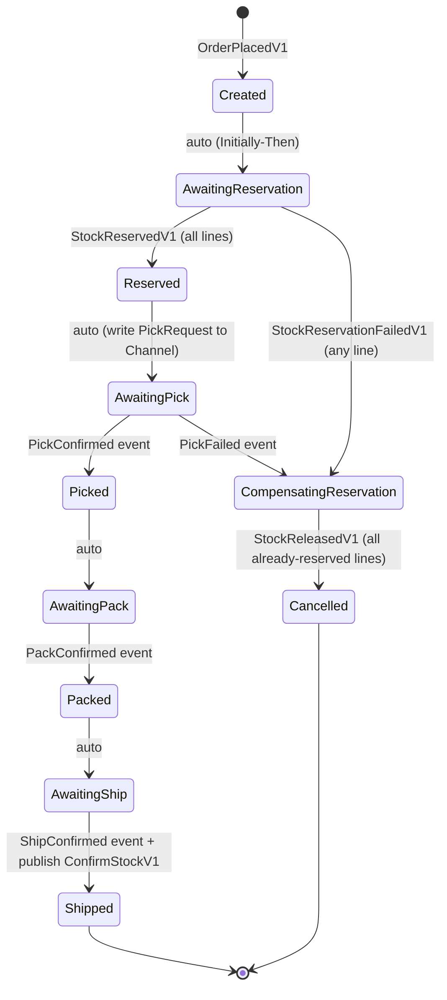
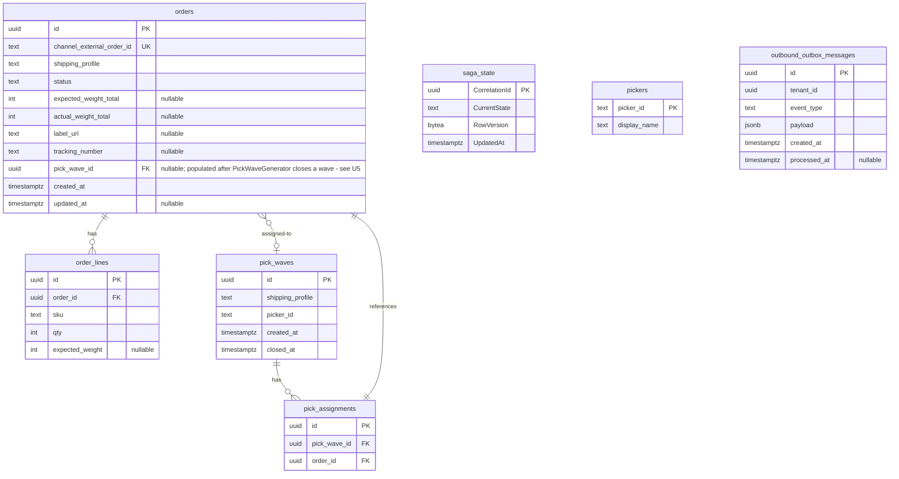

# feat: Phase-1 Sprint-3-redux — Outbound module + fulfillment saga + mocked carrier

## Summary

Ship the Outbound module: Order aggregate + MassTransit state-machine fulfillment saga (9 states with pick-failure compensation), per-tenant bounded `Channel<T>` pick-wave generator with 15-min window batching by `(tenant_id, shipping_profile)`, weight-check pack endpoint, ship endpoint with mocked carrier (Polly v8 retry + label + tracking pushback). Inventory gains 3 new MassTransit consumers wrapping Sprint-1-redux's `ReservationRepository`. Closes Phase-1 by completing the customer funnel — Inventory holds stock, Inbound fills, Outbound drains.

---

## Problem Frame

Sprint-1-redux ships the reservation ledger but nothing reserves against it from a real order. Sprint-2-redux ships Inbound so stock physically lands in bins, but no order flow consumes it. The system today can reserve and accept stock, but cannot answer the load-bearing question: "what happens to one order from arrival to ship?" Until Outbound + fulfillment saga land, the reservation ledger and bin tracking are correct primitives without an end-to-end customer outcome.

Architecturally this is also the first cross-module flow in **both directions**. Sprint-2-redux's Inbound → Inventory was one-way. The fulfillment saga must reserve (Outbound → Inventory), wait for confirmation (Inventory → Outbound), confirm on ship (Outbound → Inventory), and compensate on pick failure (Outbound → Inventory). That's the canonical request/response cross-module pattern Phase-2 channel adapters and Phase-3 analytics will inherit. The saga, the pick-wave Channel pipeline, and the contract-by-event-origin namespacing all become reference shapes.

Third pain: the v3.0 plan calls for 2,000 orders/tenant × 3 tenants in 1 min, all packed within 5 min p99 (per Product Plan §9.3). Sprint-1-redux's W3 scale gate measured reservation correctness under contention; this W5 gate measures **end-to-end fulfillment latency under load** — the first time the system has anything to measure end-to-end.

---

## Requirements Trace

All 18 requirements + 7 Acceptance Examples + 4 Key Flows + 7 Actors from the [origin brainstorm doc](../brainstorms/2026-05-13-sprint-3-redux-outbound-requirements.md) carry forward. Reproduced here briefly; full prose lives in origin.

**Order lifecycle and persistence**
- **R1.** `UNIQUE(channel_external_order_id)` idempotency anchor per tenant DB.
- **R2.** Outbound tenant DB schema: `orders`, `order_lines`, `pick_waves`, `pick_assignments`, `pickers`, `saga_state` (MassTransit; `(CorrelationId uuid PK, CurrentState text, RowVersion bytea, UpdatedAt timestamptz)`), `outbound_outbox_messages` (Sprint-2.5 per-module prefix). **Inventory schema extension**: `reservations_ledger` gains `order_line_id text NOT NULL`; UNIQUE moves from `(order_id)` to `(order_id, order_line_id)` — see U3.
- **R3.** Order status mirrors saga state; controller-driven endpoints update the Order row + publish the saga's in-process event in the controller's DbContext; the saga's own state transition commits in MassTransit's separate saga-repository transaction. The two commits are sequential, not one transaction — eventual-consistency window is bounded by next saga middleware tick (sub-second). See K12 below.

**Saga state machine**
- **R4.** 11 saga states (9 transient + 2 terminal): `Created → AwaitingReservation → Reserved → AwaitingPick → Picked → AwaitingPack → Packed → AwaitingShip → Shipped` (terminal) / `CompensatingReservation → Cancelled` (terminal). MassTransit EF saga repository on `saga_state` table. Per-tenant DbContext binding via custom `ISagaDbContextFactory` — K12 below.
- **R5.** Saga correlated by `order_id` (Outbound PK). Pessimistic concurrency.

**Cross-module reservation contracts**
- **R6.** Contracts in `ShopFlow.Contracts.Inventory.*` + `ShopFlow.Contracts.Outbound.*`. 9 new contracts total (1 saga-start + 1 tracking + 3 commands + 4 result events). Per-order command shape with `IReadOnlyList<LineX>` payloads — one publish per saga state transition, not one per line. See K1 below.
- **R7.** 3 Inventory consumers (`ReserveStockConsumer`, `ConfirmStockConsumer`, `ReleaseStockConsumer`) wrap Sprint-1-redux's `ReservationRepository`, **extended with new `TryReserveLinesAsync` (atomic multi-row CTE INSERT) and `ReleaseLinesAsync` per-line port methods** — see K10 + U3 — and emit result events via `inventory_outbox_messages`.
- **R8.** Saga listens for result events. Any-failure on ReserveStock triggers compensation for already-reserved lines (tracked in saga state as `ReservedLineSkus`).

**Pick wave pipeline**
- **R9.** One bounded `Channel<PickRequestV1>` per tenant via `IPickQueue`. Capacity 1000 with `BoundedChannelFullMode.Wait`.
- **R10.** `PickWaveGeneratorService` hosted service drains per-tenant channels with 15-min sliding-window batching grouped by `(tenant_id, shipping_profile)`. Closes window on time elapse OR `max_wave_size=50` orders. Round-robin picker assignment.

**Operator endpoints**
- **R11.** 6 HTTP endpoints: `POST /api/outbound/orders`, `GET /api/outbound/orders/{id}`, `POST /api/outbound/orders/{id}/confirm-pick`, `POST /api/outbound/orders/{id}/mark-pick-failed`, `POST /api/outbound/orders/{id}/confirm-pack`, `POST /api/outbound/orders/{id}/confirm-ship`.

**Mocked shipping carrier**
- **R12.** `IMockShippingProvider.CreateLabelAsync` — 1-3s random delay, 5% transient-fail injection, Polly v8 `ResiliencePipelineBuilder` retry (3 retries × 200ms backoff). Final exhaust → 503 ProblemDetails.
- **R13.** `TrackingPushedV1` event published to stub `ChannelTrackingConsumer` post-ship.

**Cross-module stock confirmation on ship**
- **R14.** `confirm-ship` publishes `ConfirmStockV1` per line via Outbound outbox; Inventory consumer calls `ReservationRepository.ConfirmAsync`.

**Tests and gates**
- **R15.** Unit tests cover saga state machine (MassTransit `InMemoryTestHarness`) + Order/PickWave aggregates.
- **R16.** Integration tests use Testcontainers Postgres + in-memory MassTransit (Sprint-2-redux pattern). Coverage: happy-path saga, pick-failure compensation, pick-wave batching, mocked-carrier success + retry-exhaust, idempotency on duplicate POST.
- **R17.** W5 scale gate (`Category=Load`): 2,000×3 orders in 1 min, packed within 5 min p99/tenant; 5% pick-failure variant releases within 60s p99/tenant; fairness floor ≥ 0.85.
- **R18.** Cross-module reservation flow integration test (lands in U9 as `CrossModuleReservationFlowTests.cs`) against single Testcontainers Postgres hosting both modules' migrations (enabled by Sprint-2.5 outbox rename).

---

## Scope Boundaries

Carried verbatim from origin's Scope Boundaries:

- **Mock channel webhook order ingestion** → Phase-2 Sprint-4.
- **Customer-initiated order cancel** → Phase-2.
- **Saga timeout-based compensation** → Phase-2 (needs MassTransit scheduler).
- **Zone-aware pick optimization within a wave** → Phase-3+ slotting.
- **Smart picker assignment** (skill / workload) → Phase-3+; round-robin in Sprint-3-redux.
- **Real carrier API integration** → Phase-2 Sprint-4.
- **Multi-line partial fulfillment** → Phase-2+; Sprint-3-redux treats pick-fail as whole-order.
- **Tenant-configurable pick-wave window** → Phase-2; hardcoded 15 min in Sprint-3-redux.
- **`Channel<T>` backpressure tuning** → default `(capacity: 1000, FullMode=Wait)`; tune if scale gate binds.
- **SignalR push of saga state changes** → Phase-3 Sprint-7.
- **Analytics views over order/saga state** → Phase-3 Sprint-8.
- **Saga rehydration / replay tooling** — assumed not needed at MVP; MassTransit's saga repository handles redelivery natively.

### Deferred to Follow-Up Work

- **Stock-confirmation reconciliation flow**: Sprint-3-redux assumes `ConfirmAsync` never fails after `TryReserveAsync` succeeded. Mismatches log + Phase-2 reconciliation flow resolves.
- **Per-tenant carrier configuration** — single global mock for Sprint-3-redux; tenant-level config Phase-2.
- **CSharpier formatting cleanup** carries forward.

---

## Key Technical Decisions

Resolved during planning from the origin doc's 8 deferred-to-planning questions plus 6 additional decisions surfaced by feasibility review.

**Origin-deferred resolutions (K1-K9):**

- **K1 Contract field shape: one command per order with `IReadOnlyList<LineReservation>` payload** (not one per line). Simpler saga state, single point of compensation, one publish per state transition. The result events mirror with `IReadOnlyList<LineOutcome>`. The consumer translates the N-line payload into a single atomic call against the extended ReservationRepository (K10/K11) — N rows inserted in one CTE, not N sequential `TryReserveAsync` calls. AE2's brainstorm phrasing "when both ReserveStockV1 commands are published" is superseded by this decision: one `ReserveStockV1` envelope, two `LineReservation` entries inside.
- **K2 MassTransit `CorrelateById` works on `Guid OrderId` directly** per the v8.x API. Saga state class derives from `SagaStateMachineInstance` with mandatory `Guid CorrelationId`. On the `OrderPlaced` initial event, `CorrelationId` is set to `Message.OrderId`. All subsequent events correlate via `context.Message.OrderId`.
- **K3 `IPickQueue` impl**: `ConcurrentDictionary<Guid, Channel<PickRequestV1>>` keyed by tenant id, `GetOrAdd` factory creates the per-tenant `Channel.CreateBounded<T>` lazily on first writer/reader access.
- **K4 15-min sliding-window batching impl**: `PeriodicTimer(TimeSpan.FromSeconds(30))` in `PickWaveGeneratorService`; each tick drains tenant channels into per-tenant in-memory buffers keyed by `(tenant_id, shipping_profile)`; emits a wave when the oldest item in the group ages past 15 min OR the group reaches `max_wave_size=50`. Simpler than ChannelReader timestamp comparison; covers both time and size triggers in one loop. **Scale-gate note**: under W5's 6000 orders/min ingestion, the 50-cap dominates — wave generation is not the bottleneck (see K14).
- **K5 Polly v8 with `ResiliencePipelineBuilder`** for the mocked carrier retry. Pin `Polly` 8.4.x in `Directory.Packages.props`. Built pipeline injected as singleton via DI.
- **K6 Load-test generator concurrency**: `Task.WhenAll` with controlled parallelism mirroring Sprint-1-redux `TenantHarness`. 100 parallel tasks emitting 20 orders/min/task × 3 tenants ≈ 6000 orders. Driver workers (N=20 parallel per tenant) progress orders through pick → pack → ship endpoints — see U8.
- **K7 Confirm/Release consumer transaction shape**: single `_db.SaveChangesAsync` boundary commits the outbox row + the state change together. Same shape as Sprint-2-redux `InboundConfirmedConsumer`. No `TransactionScope` needed — the OutboxInterceptor + repository call are already in one EF transaction. The new multi-line port methods (K11) preserve this property: one repository call = one EF transaction = one outbox-append.
- **K8 `TrackingPushedV1` namespace**: `ShopFlow.Contracts.Outbound.*` per the contract-by-event-origin convention (Outbound emits it; Phase-2 Channel module will *consume* it but does not own it).
- **K9 Stub `ChannelTrackingConsumer` lives in `ShopFlow.Outbound.Infrastructure/Consumers/`** for Sprint-3-redux. Phase-2 Sprint-4 channel adapter moves it to `ShopFlow.Channel.Infrastructure/Consumers/`.

**Feasibility-driven decisions (K10-K15):**

- **K10 Inventory schema extension for multi-line reservations** (resolves Will-Block from feasibility review): The Sprint-1-redux `reservations_ledger` has `UNIQUE(order_id)` — a single row per order. Sprint-3-redux multi-line orders need N rows per order. Migration `20260513000010_AddOrderLineIdToReservationsLedger` in `ShopFlow.Inventory.Infrastructure/Migrations/` adds `order_line_id TEXT NOT NULL` (defaulting existing rows to `'_default'`) and switches UNIQUE from `(order_id)` to `(order_id, order_line_id)`. Single-line callers (Sprint-1-redux's existing `TryReserveAsync` callers + property tests) keep working: the repository internally passes `order_line_id='_default'` so the composite UNIQUE still anchors idempotency. Multi-line callers (Sprint-3-redux `ReserveStockConsumer`) pass each line's Outbound `order_lines.id` value (text). Property 5's raw-SQL ledger read updates to include the new column.
- **K11 New port methods on `IReservationRepository`** (resolves Will-Block from feasibility review):
  - `TryReserveLinesAsync(string orderId, IReadOnlyList<LineReservation> lines, TimeSpan ttl, CancellationToken ct) -> Result<IReadOnlyList<Reservation>>`. **Atomic multi-row CTE**: one SQL statement that (a) decrements `stock_items.available` for each requested sku-qty pair via a conditional CTE that aborts if any line oversells, (b) INSERTs N rows into `reservations_ledger` with shared `order_id`, distinct `order_line_id`. Failure is all-or-nothing — no partial state. Idempotency on redelivery: existing rows from a prior successful call surface as 23505 on the composite UNIQUE; repository catches + re-reads + returns the prior rows (same shape as Sprint-1-redux's single-line idempotency).
  - `ReleaseLinesAsync(string orderId, IReadOnlyList<string> orderLineIds, CancellationToken ct) -> Result`. **Partial-set release** for saga compensation: when only some lines successfully reserved before the failure event, the saga's `ReservedLineSkus` tracks which lines to release. Single multi-row UPDATE with `WHERE order_id = X AND order_line_id = ANY(@ids) AND status = 'Pending'`. Existing per-order `ReleaseAsync(orderId)` keeps working for the full-order case.
  - Existing `TryReserveAsync(sku, orderId, qty, ttl)` is retained but routes internally to `TryReserveLinesAsync` with one item using `order_line_id='_default'` — backwards-compatible.
  - Existing `ConfirmAsync(orderId)` / `ReleaseAsync(orderId)` keep working unchanged — their `WHERE order_id = X` already operates on all matching ledger rows, which is now N rows for multi-line orders.
- **K12 Saga DbContext per-tenant binding** (resolves Will-Hurt from feasibility review): MassTransit's `EntityFrameworkRepository<FulfillmentSagaState>` binds a singleton `DbContextOptions<OutboundDbContext>` at startup, but Sprint-3-redux requires the **tenant's** connection string at message-receive time. **Strategy**: register a custom `ISagaDbContextFactory<OutboundDbContext>` via MassTransit's `.ExistingDbContext(...)` extension point. The factory resolves `IRequestContext` from `ConsumeContext.GetPayload<IServiceProvider>()` inside the message scope; binds tenant from envelope header; constructs `OutboundDbContext` via `PerRequestDbContextFactory` (Sprint-2-redux pattern). U4 includes a test that dispatches a `OrderPlacedV1` with tenant-A header and asserts the saga_state row materializes in tenant-A's database (NOT tenant-B's). If MassTransit's extension point doesn't expose `ConsumeContext`-scoped DI as required, fall back to a custom `IFilter<SagaConsumeContext>` that binds `RequestContext` before the saga repository runs — same outcome via a slightly different MT extension surface.
- **K13 `OutboxDispatcher` uses `Publish` for all envelopes — Sprint-3-redux accepts this trade-off, defers W6 split**: MassTransit's canonical pattern is `Send` to a specific endpoint for commands and `Publish` for events. Today's dispatcher (Sprint-2-redux `OutboxDispatcher.cs`) publishes everything. Because all consumers co-host in one process (Sprint-2-redux W6 → W4 transport flip), a `Publish` of `ReserveStockV1` reaches the one registered `IConsumer<ReserveStockV1>` and the difference is invisible. W6 mechanical split needs envelope-type-aware Send-to-endpoint routing — Sprint-3-redux explicitly defers that to W6. New risk row tracks this. Tech Design §10 reference call-out: "Phase-2 W6 split must add envelope-type → endpoint routing in OutboxDispatcher".
- **K14 PickWaveGenerator + auto-driver throughput analysis** (resolves Will-Hurt from feasibility review): W5's 6000 orders / 5 min p99 implies ~25 orders/sec sustained through pick + pack + ship steps after reservation. Bottleneck analysis: (a) reservation = single CTE + outbox write ≈ 10ms × 6000 = 60s total at 1-thread; scale-gate's 6000 reservations land in 60s ingestion window, so reservation throughput is fine. (b) Wave generation = 50-cap dominates — 6000 / 50 = 120 waves over 1 min ≈ 2 waves/sec, generator's 30s tick comfortably ahead. (c) Auto-driver = N=20 parallel "operator worker" tasks per tenant POSTing pick/pack/ship endpoints; 60 workers × ~3s wall-time per order (1-3s carrier delay dominates) = 20 orders/sec sustained — matches the 25-orders/sec target with 4-min headroom. (d) Mock-carrier Polly retry worst-case = 1×initial + 3×200ms = 4 retry attempts × 3s = 12.6s wall-time per call; under 5% transient-fail rate this rarely binds. **If gate binds anyway**: U8 captures which leg bottlenecked — auto-driver parallelism, saga middleware throughput, or DB write contention — as input for Phase-2 tuning. No hard correctness assertion on throughput itself; the assertion is "all 95% reach Packed within 5 min p99".
- **K15 MassTransit.EntityFrameworkCore 8.3.4 + EF Core 9 compatibility verification** (resolves Will-Hurt from feasibility review): MT 8.3.4 ships targeting EF Core 8; some EF9 transitive lifts work, some don't. **U1 includes a smoke build** that adds `MassTransit.EntityFrameworkCore` to `Directory.Packages.props` + `Outbound.Infrastructure.csproj`, applies the U1 migration with `saga_state.RowVersion bytea`, runs `dotnet build --warnaserror` + Outbound migration smoke test. If the build is clean and migration applies, U4 proceeds. **Fallback if MT8.3.4 + EF9 binding fails** (e.g., saga's `byte[] RowVersion` triggers `PendingModelChangesWarning` despite our `OnConfiguring` suppress, or the saga repository's internal model snapshot fights hand-authored migrations): capture as a new `docs/solutions/2026-05-13-massTransit-efcore9-saga-repo-gotcha.md` entry and switch saga persistence to MassTransit's `Redis` saga repository (still ships in MT8; tenant scoping via key prefix `{tenant_id}:{order_id}`). Redis is already in the Aspire AppHost stack, so the fallback adds no infra. Risk row in the table reflects this.

**Additional plan-time decisions:**

- **Outbound outbox table name**: `outbound_outbox_messages` per the Sprint-2.5 per-module prefix convention.
- **Saga state table name**: `saga_state` (MassTransit default name pattern; one table holds all state-machine instance rows).
- **Pickers table**: `pickers (picker_id PK, tenant_id implicit-via-DB, display_name)` — operator-seeded; Sprint-3-redux load tests seed 5 pickers per tenant. Phase-3+ adds workload tracking columns.
- **`PickRequestV1` envelope shape** (in-process Channel item, NOT a MassTransit contract): `(OrderId, TenantId, ShippingProfile, EnqueuedAt, LineCount)`. Internal to Outbound — not in `ShopFlow.Contracts`.
- **`expected_weight_total` derivation**: sum of `order_lines.expected_weight` (nullable per line; if any line lacks expected_weight, total is null and weight-check is skipped). Operator entered on POST /orders.
- **AddOutboundModule composition root** mirrors `AddInboundModule` shape (DbContext registration + repositories + `MultiplexedOutboxDispatcher<OutboundDbContext>` hosted service + saga state machine + saga repository + custom `ISagaDbContextFactory` per K12).
- **Saga's `LinesAwaitingRelease` dedup** (Watch-For 8 from feasibility review): track which line skus have already produced a `StockReleasedV1` in a `HashSet<string> ReleasedLineSkus` on the saga state. Decrement counter only on first sight per sku — protects against MassTransit at-least-once redelivery driving the counter negative.

---

## High-Level Technical Design

> *Directional guidance — see per-unit Approach fields for canonical wiring. Implementation should treat this as context, not code to reproduce.*

### Cross-module fulfillment flow

```mermaid
sequenceDiagram
    autonumber
    actor Op as Operator
    participant OutApi as Outbound API
    participant Saga as Fulfillment Saga
    participant OutDb as Outbound DB
    participant OutDisp as Outbound Outbox Dispatcher
    participant Rabbit as MassTransit Bus
    participant InvCons as Inventory Consumer<br/>(Reserve/Confirm/Release)
    participant InvDb as Inventory DB (same physical tenant DB)
    participant Carrier as IMockShippingProvider

    Op->>OutApi: POST /orders {lines, shipping_profile}
    OutApi->>OutDb: INSERT orders + order_lines + saga_state (Created)
    OutApi->>OutDb: INSERT outbox(OrderPlacedV1) [same tx]
    OutDisp->>Rabbit: publish OrderPlacedV1
    Rabbit->>Saga: route via CorrelateById(OrderId)
    Saga->>OutDb: state=AwaitingReservation, publish ReserveStockV1
    OutDisp->>Rabbit: publish ReserveStockV1
    Rabbit->>InvCons: ReserveStockConsumer
    InvCons->>InvDb: ReservationRepository.TryReserveAsync per line
    InvCons->>InvDb: INSERT outbox(StockReservedV1 OR StockReservationFailedV1)
    Note over Rabbit,Saga: Inventory dispatcher publishes; saga consumes
    Saga->>OutDb: state=Reserved, write PickRequest to in-process Channel
    Saga-->>Op: (background) await operator pick-confirm

    Op->>OutApi: POST /orders/{id}/confirm-pick
    OutApi->>Saga: PickConfirmed event
    Saga->>OutDb: state=Picked → AwaitingPack
    Op->>OutApi: POST /orders/{id}/confirm-pack {actual_weight}
    OutApi->>Saga: PackConfirmed event
    Saga->>OutDb: state=Packed → AwaitingShip
    Op->>OutApi: POST /orders/{id}/confirm-ship
    OutApi->>Carrier: CreateLabelAsync (1-3s delay, Polly retry on 5% transient fail)
    Carrier-->>OutApi: (LabelUrl, TrackingNumber)
    OutApi->>Saga: ShipConfirmed event
    Saga->>OutDb: state=Shipped, publish ConfirmStockV1 + TrackingPushedV1
    OutDisp->>Rabbit: publish both
    Rabbit->>InvCons: ConfirmStockConsumer
    InvCons->>InvDb: ReservationRepository.ConfirmAsync (stock_items.reserved -= qty)
    InvCons->>InvDb: INSERT outbox(StockConfirmedV1)
```

### Saga state machine



### Inventory tenant DB schema extension (one column added)

Sprint-3-redux adds **one column** to `reservations_ledger` to support multi-line orders (K10):
- `order_line_id TEXT NOT NULL` (defaults `'_default'` for legacy single-line rows)
- UNIQUE constraint moves from `(order_id)` to `(order_id, order_line_id)`
- New migration: `20260513000010_AddOrderLineIdToReservationsLedger.cs`
- Sprint-1-redux Property 5's raw-SQL ledger read (the stop-gap awaiting a real read-back port) updates to include the new column

No new tables. The 3 new consumers use the extended schema:
- `ReserveStockConsumer` → `reservations_ledger` (extended), `stock_items` via `TryReserveLinesAsync` (K11)
- `ConfirmStockConsumer` → same via existing `ConfirmAsync(orderId)` (now matches N rows for multi-line orders)
- `ReleaseStockConsumer` → same via `ReleaseAsync(orderId)` for full release OR new `ReleaseLinesAsync(orderId, lineIds)` for partial compensation
- All result events flow through `inventory_outbox_messages` (Sprint-2.5)

### Outbound tenant DB schema (new)



---

## Implementation Units

### U1. Outbound module quartet scaffold + initial schema migration + MT.EFCore smoke build

**Goal:** Stand up Outbound's four `.csproj` (Domain / Application / Infrastructure / Api). Replace the U9-Phase-0-redux Outbound stubs with the real shape. Ship the `InitialOutboundSchema` migration that creates 7 tables (orders, order_lines, pick_waves, pick_assignments, saga_state, pickers, outbound_outbox_messages). Wire `AddOutboundModule` composition root. Add `MassTransit.EntityFrameworkCore` 8.3.4 to CPM + Outbound.Infrastructure csproj and prove the build is clean before U4 starts (K15 compatibility verification). No behavior beyond migration apply.

**Requirements:** R2 (table layout), R15-R18 (CI smoke + foundation for later units), K15 (MT.EFCore smoke).

**Files:**
- Replace U9 stubs in `src/Services/Outbound/ShopFlow.Outbound.Domain/`, `.Application/`, `.Infrastructure/`, `.Api/`
- Create: `src/Services/Outbound/ShopFlow.Outbound.Infrastructure/OutboundDbContext.cs` (7 DbSets, applies entity configs)
- Create: `src/Services/Outbound/ShopFlow.Outbound.Infrastructure/Migrations/20260513000001_InitialOutboundSchema.cs` (with `[Migration]` + `[DbContext]` attributes)
- Create: `src/Services/Outbound/ShopFlow.Outbound.Infrastructure/OutboundServiceCollectionExtensions.cs` (`AddOutboundModule(IConfiguration)`)
- Create stub entities (skeleton): `Order.cs`, `OrderLine.cs`, `OrderStatus.cs`, `PickWave.cs`, `PickAssignment.cs`, `Picker.cs` in `Domain/`
- Create entity configurations: `OrderConfiguration.cs`, `OrderLineConfiguration.cs`, `PickWaveConfiguration.cs`, `PickAssignmentConfiguration.cs`, `PickerConfiguration.cs`, `OutboxMessageConfiguration.cs` (with `inbound`-style per-module prefix → `outbound_outbox_messages`)
- Create: `src/Services/Outbound/ShopFlow.Outbound.Api/Program.cs` (calls `AddShopFlowDefaults` then `AddOutboundModule` — pattern from Sprint-2-redux U7)
- Modify: `Directory.Packages.props` — add `MassTransit.EntityFrameworkCore` 8.3.4 (paired with existing `MassTransit` 8.3.4)
- Modify: `src/Services/Outbound/ShopFlow.Outbound.Infrastructure/ShopFlow.Outbound.Infrastructure.csproj` — add `<PackageReference Include="MassTransit.EntityFrameworkCore" />`
- Modify: `src/Services/Outbound/AGENTS.md` (delta-only; replace U9 stub state with Sprint-3-redux notes)
- Modify: `ShopFlow.sln` — add any new csproj if needed
- Test: `tests/ShopFlow.SharedKernel.IntegrationTests/MigrationSmokeTests.cs` — add `OutboundMigration_AppliesAndLeavesNamedObjects` asserting 7 tables, PKs, FK to pick_waves on orders, `UNIQUE(channel_external_order_id)` on orders, `outbound_outbox_messages` named correctly, `saga_state` with all 4 expected columns

**Approach:**
- `OutboundDbContext` derives from `DbContext`; override `OnConfiguring` to suppress EF Core 9's `PendingModelChangesWarning` per the Sprint-1-redux pattern (`docs/solutions/2026-05-13-ef9-pendingmodelchangeswarning-with-hand-authored-migrations.md`). The saga state DbSet shares the same suppression.
- Saga state table managed by MassTransit's EF saga repository in U4; for U1, declare the table shape in migration as `(CorrelationId uuid PK, CurrentState text, RowVersion bytea, UpdatedAt timestamptz)`. U4 wires MassTransit to point at it.
- Picker table is reference data; load tests seed via raw SQL.
- Outbound API ships a stub `OrdersController` returning 501 in U1; U2 fills it in.
- **K15 smoke build sequence**: (1) add the package to CPM + csproj; (2) `dotnet restore`; (3) `dotnet build --warnaserror`; (4) run U1's `OutboundMigration_AppliesAndLeavesNamedObjects` against Testcontainers Postgres. Any of these failing means the MT.EFCore 8.3.4 + EF Core 9 combo doesn't bind cleanly — capture in a new `docs/solutions/` entry and switch saga persistence to Redis (K15 fallback) before U4 starts. Document the outcome in U1's commit message.

**Patterns to follow:**
- Sprint-2-redux U1 (`src/Services/Inbound/`) — same scaffold shape, same migration pattern, same per-module outbox prefix.
- Sprint-2.5 lesson: identity columns need `NpgsqlValueGenerationStrategy.IdentityByDefaultColumn` enum (not string). Apply to picker_id if it ends up a `bigserial` (or use text id seeded by tests — likely simpler).

**Test scenarios:**
- `OutboundMigration_AppliesAndLeavesNamedObjects` against Testcontainers Postgres: assert `__EFMigrationsHistory` ≥ 1 row, 7 named tables, named PKs/FKs, `UNIQUE(channel_external_order_id)` index, `saga_state` table with correct columns.
- Module shape smoke: `tests/ShopFlow.Outbound.UnitTests/ModuleShapeSmokeTests.cs` updated from U9 stub to assert `OutboundServiceCollectionExtensions.ModuleName == "Outbound"` and `AddOutboundModule` registers `OutboundDbContext` + outbox dispatcher hosted service.

**Verification:** `dotnet build` clean; migration smoke + module shape smoke pass; ShopFlow0001-0004 analyzers clean.

---

### U2. Order aggregate + repository + manual create + read endpoints

**Goal:** `Order` + `OrderLine` aggregate (skeleton from U1 → real behavior). Repository writes + reads. `POST /api/outbound/orders` (manual create with idempotent `channel_external_order_id`). `GET /api/outbound/orders/{id}`. Status mirrors saga state but saga starts in U4 — U2 manually seeds `status="Created"` until saga wires up.

**Requirements:** R1, R2, R3, R11 (manual + read endpoints).

**Dependencies:** U1.

**Files:**
- Modify: `src/Services/Outbound/ShopFlow.Outbound.Domain/Order.cs` (state machine: `Created → AwaitingReservation → ... → Shipped/Cancelled`; mirrors saga states per R3)
- Modify: `src/Services/Outbound/ShopFlow.Outbound.Domain/OrderLine.cs`
- Create: `src/Services/Outbound/ShopFlow.Outbound.Application/Ports/IOrderRepository.cs` (`AddAsync`, `FindByIdAsync` eager-loads lines, `FindByExternalIdAsync` for idempotency)
- Create: `src/Services/Outbound/ShopFlow.Outbound.Application/Ports/IUnitOfWork.cs`
- Create: `src/Services/Outbound/ShopFlow.Outbound.Infrastructure/Repositories/OrderRepository.cs`
- Create: `src/Services/Outbound/ShopFlow.Outbound.Infrastructure/Repositories/OutboundUnitOfWork.cs`
- Create: `src/Services/Outbound/ShopFlow.Outbound.Api/Controllers/OrdersController.cs` (POST + GET; remaining endpoints in U6/U7)
- Create: `src/Services/Outbound/ShopFlow.Outbound.Api/Contracts/OrderDtos.cs` (request/response DTOs)
- Test: `tests/ShopFlow.Outbound.UnitTests/Domain/OrderTests.cs` (state machine in isolation)
- Test: `tests/ShopFlow.Outbound.IntegrationTests/OrderRepositoryTests.cs` (round-trip + idempotency)

**Approach:**
- `Order.Create(channelExternalOrderId, shippingProfile, lines)` returns `Result<Order>`; rejects empty lines, blank refs, non-positive qty.
- State transitions exposed as public methods (`MarkAwaitingReservation`, `MarkReserved`, `MarkAwaitingPick`, ...) that the saga's domain-events handler invokes. Defensive `Result.Failure` on illegal transitions per Sprint-2-redux precedent.
- `POST /orders` idempotency: `_orderRepo.FindByExternalIdAsync(req.ChannelExternalOrderId)` short-circuit returns 200 with existing order on duplicate.
- `expected_weight_total` computed at Create time from sum of nullable per-line weights; null when any line lacks weight.
- U2 publishes `OrderPlacedV1` to the **outbox** (not direct to bus) so it commits atomically with the order INSERT; Outbound's dispatcher (registered in U1) drains and publishes in U4 once the saga listens for it.

**Patterns to follow:**
- Sprint-2-redux U2 (`src/Services/Inbound/ShopFlow.Inbound.Domain/PurchaseOrder.cs`) — state machine + Result pattern.
- Sprint-2-redux U3 `IInboundOutbox` for the outbox-write port; Outbound gets its own `IOutboundOutbox` peer.

**Test scenarios:**
- **Happy create**: POST with 2 lines → 201 + Location header, GET returns order with status="Created", lines persist.
- **Idempotency (Covers AE1)**: POST same `channel_external_order_id` twice → both return 200 with same order_id; orders table has 1 row.
- **Empty lines**: POST with empty lines → 400 with code `order.no_lines`.
- **Non-positive qty**: POST line with qty=0 → 400 code `order_line.qty_non_positive`.
- **Blank external id**: POST with blank → 400 code `order.external_id_required`.
- **Unknown id GET**: GET non-existent → 404 ProblemDetails.
- **Round-trip persistence**: AddAsync + FindByIdAsync returns order with lines eagerly loaded.
- **State transitions** (Domain unit tests): each public state-transition method accepts only its valid pre-state; rejects with `order.invalid_state` from any other.

**Verification:** Domain + integration tests pass; ShopFlow0001-0004 clean.

---

### U3. Inventory schema extension + new ports + cross-module contracts + Inventory consumers

**Goal:** Three coupled pieces of work that must ship together:
1. **Inventory schema migration** (K10) — add `order_line_id` column + composite UNIQUE to `reservations_ledger`.
2. **`IReservationRepository` port extension** (K11) — add `TryReserveLinesAsync` + `ReleaseLinesAsync`; keep existing single-line port as a backwards-compat wrapper.
3. **9 cross-module contracts + 3 Inventory consumers** — consumers use the new multi-line ports so multi-line orders reserve / confirm / release atomically.

**Requirements:** R2 (Inventory schema extension), R6 (contracts), R7 (consumers), R8 (compensation entry), R14 (Confirm path), K10/K11 (port + schema).

**Dependencies:** U1 (Outbound exists for the publish side); independent of U2/U4 for parallel work but must ship before U4 because the saga relies on consumers being up.

**Execution note:** Inventory consumers must use `OutboxJsonOptions.Default` from Sprint-2.5 for any payload serialization; the existing `MultiplexedOutboxDispatcher<InventoryDbContext>` (Sprint-1-redux) drains `inventory_outbox_messages` so result events flow back to the saga without extra wiring. Property 5's raw-SQL ledger read in `tests/ShopFlow.PropertyTests/` updates as part of this unit to include the new column — keep the property invariants intact.

**Files:**

*Schema migration + port:*
- Create: `src/Services/Inventory/ShopFlow.Inventory.Infrastructure/Migrations/20260513000010_AddOrderLineIdToReservationsLedger.cs` (with `[Migration]` + `[DbContext]` attributes; `ALTER TABLE reservations_ledger ADD COLUMN order_line_id text NOT NULL DEFAULT '_default';` + drop old UNIQUE + add composite UNIQUE `ux_reservations_order_id_line` on `(order_id, order_line_id)`)
- Modify: `src/Services/Inventory/ShopFlow.Inventory.Application/Ports/IReservationRepository.cs` — add `TryReserveLinesAsync` + `ReleaseLinesAsync` signatures
- Modify: `src/Services/Inventory/ShopFlow.Inventory.Application/LineReservation.cs` (new record: `(Sku Sku, string OrderLineId, Quantity Quantity)`)
- Modify: `src/Services/Inventory/ShopFlow.Inventory.Domain/Reservation.cs` — add `string OrderLineId { get; }` property; constructor takes it
- Modify: `src/Services/Inventory/ShopFlow.Inventory.Infrastructure/EntityConfigurations/ReservationConfiguration.cs` — map `order_line_id` column, drop old UNIQUE index config, add composite UNIQUE
- Modify: `src/Services/Inventory/ShopFlow.Inventory.Infrastructure/Repositories/ReservationRepository.cs`:
  - Implement `TryReserveLinesAsync` as a single multi-row CTE that is **all-or-nothing**. **CRITICAL** — the availability predicate MUST live inside the UPDATE's WHERE clause (under the row-level lock), NOT in a pre-check CTE. See [docs/solutions/2026-05-13-multi-row-cte-predicate-must-live-in-update.md](../solutions/2026-05-13-multi-row-cte-predicate-must-live-in-update.md) for the full incident write-up; an earlier draft of this section had a `will_succeed` pre-check CTE that allowed oversell under READ COMMITTED concurrency. Corrected shape:
    ```sql
    WITH desired(sku, order_line_id, qty, reservation_id) AS (VALUES (@sku1,@lid1,@qty1,@rid1), ...),
    desired_per_sku AS (
      SELECT sku, SUM(qty)::int AS total_qty
        FROM desired
       GROUP BY sku
    ),
    deducted AS (
      UPDATE stock_items si
         SET available  = si.available - dps.total_qty,
             reserved   = si.reserved + dps.total_qty,
             updated_at = @p_now
        FROM desired_per_sku dps
       WHERE si.sku = dps.sku
         AND si.available >= dps.total_qty            -- predicate INSIDE the UPDATE
      RETURNING si.sku
    ),
    all_succeeded AS (
      SELECT 1 AS ok
       WHERE NOT EXISTS (                              -- every requested sku must be in `deducted`
         SELECT 1 FROM desired_per_sku dps
          WHERE NOT EXISTS (SELECT 1 FROM deducted d WHERE d.sku = dps.sku)
       )
    ),
    inserted AS (
      INSERT INTO reservations_ledger (id, sku, order_id, order_line_id, quantity, status, expires_at, created_at)
      SELECT d.reservation_id, d.sku, @p_order, d.order_line_id, d.qty, 'Pending', @p_expires, @p_now
        FROM desired d
       WHERE EXISTS (SELECT 1 FROM all_succeeded)    -- atomic gate
      RETURNING id, sku, order_line_id, quantity
    )
    SELECT id, sku, order_line_id, quantity FROM inserted;
    ```
    Key properties:
    - **Predicate in UPDATE**: the UPDATE acquires row locks, evaluates `available >= total_qty` against the post-lock committed snapshot. Concurrent transactions queue on the lock and re-evaluate under the prior commit. Standard READ COMMITTED row-level serialization (matches Sprint-1-redux single-line pattern).
    - **`desired_per_sku` aggregation** handles same-sku-multi-line orders (e.g. kit purchases): predicate checks combined qty.
    - **`all_succeeded` NOT-EXISTS gate**: even if `deducted` returns partial rows (some skus passed, others didn't), the INSERT is skipped. Caller transaction explicit-rollbacks → partial UPDATEs unwind via Postgres MVCC.
    - **0-row return path**: repository explicit-rollbacks the transaction (cleanly unwinds partial UPDATEs), then opens a fresh connection to compute per-line `LineOutcome` (PASS / OVERSOLD) for the failure result. Consumer emits `StockReservationFailedV1` (which carries the diagnostic outcomes — saga compensation treats them as informational).
    - **Idempotency** via composite UNIQUE: 23505 on `(order_id, order_line_id)` → catch → re-read existing rows for `order_id` ordered by `order_line_id` → return as success. Redelivery is a no-op.
  - Implement `ReleaseLinesAsync` as `UPDATE reservations_ledger SET status='Released', released_at=@now WHERE order_id=@order_id AND order_line_id = ANY(@line_ids) AND status='Pending' RETURNING ...` + per-row `stock_items.available += qty` (single SQL with CTE) + `AppendOutbox(StockReleasedV1 per line)`.
  - Modify `TryReserveAsync(sku, orderId, qty, ttl)`: delegate to `TryReserveLinesAsync(orderId, [new LineReservation(sku, "_default", qty)], ttl, ct)` and return the single `Reservation`. Pure forwarding wrapper.
  - Existing `ConfirmAsync(orderId)` and `ReleaseAsync(orderId)` unchanged — their `WHERE order_id = X` correctly matches N rows.
- Modify: `src/Services/Inventory/ShopFlow.Inventory.Infrastructure/Repositories/ReservationRepository.cs` — `AppendOutbox` already supports multi-event-per-call; emit one outbox row per line outcome.
- Modify: `tests/ShopFlow.SharedKernel.IntegrationTests/MigrationSmokeTests.cs` — extend `InventoryMigration_AppliesAndLeavesNamedObjects` to assert `order_line_id` column exists and composite UNIQUE `ux_reservations_order_id_line` exists; drop the old `ux_reservations_order_id` assertion.
- Modify: `tests/ShopFlow.PropertyTests/Properties/Reservation_*` — Property 5 raw-SQL read updates to `SELECT sum(quantity) FROM reservations_ledger WHERE order_id = @oid AND order_line_id = @lid AND status IN ('Pending','Confirmed')` or equivalent; invariants unchanged.

*Contracts:*
- Create: `src/Shared/ShopFlow.Contracts/Outbound/OrderPlacedV1.cs` (saga start trigger; payload: `OrderId`, `TenantId`, `ChannelExternalOrderId`, `ShippingProfile`, `IReadOnlyList<LineDto>` with `(OrderLineId, Sku, Qty, ExpectedWeight?)`, `OccurredAt`)
- Create: `src/Shared/ShopFlow.Contracts/Outbound/TrackingPushedV1.cs` (post-ship; payload: `OrderId`, `TenantId`, `TrackingNumber`, `LabelUrl`, `ChannelId` placeholder, `OccurredAt`)
- Create: `src/Shared/ShopFlow.Contracts/Inventory/ReserveStockV1.cs` (command; payload: `OrderId`, `TenantId`, `IReadOnlyList<LineReservation>` with `(OrderLineId, Sku, Qty)`, `Ttl`)
- Create: `src/Shared/ShopFlow.Contracts/Inventory/ConfirmStockV1.cs` (command; payload: `OrderId`, `TenantId`)
- Create: `src/Shared/ShopFlow.Contracts/Inventory/ReleaseStockV1.cs` (command; payload: `OrderId`, `TenantId`, `IReadOnlyList<string> OrderLineIds` for partial-set release; empty list ⇒ release all)
- Create: `src/Shared/ShopFlow.Contracts/Inventory/StockReservedV1.cs` (event; payload: `OrderId`, `TenantId`, `IReadOnlyList<LineOutcome>` with `(OrderLineId, Sku, ReservationId, Status)`)
- Create: `src/Shared/ShopFlow.Contracts/Inventory/StockReservationFailedV1.cs` (event; payload: `OrderId`, `TenantId`, `IReadOnlyList<LineOutcome>` carrying per-line success/failure detail so saga knows which lines reserved for partial-set release)
- Create: `src/Shared/ShopFlow.Contracts/Inventory/StockConfirmedV1.cs` (event)
- Create: `src/Shared/ShopFlow.Contracts/Inventory/StockReleasedV1.cs` (event; payload: `OrderId`, `TenantId`, `IReadOnlyList<string> OrderLineIds` actually released — supports saga's `ReleasedLineSkus` Set-based dedup)

*Consumers:*
- Create: `src/Services/Inventory/ShopFlow.Inventory.Infrastructure/Consumers/ReserveStockConsumer.cs`
- Create: `src/Services/Inventory/ShopFlow.Inventory.Infrastructure/Consumers/ConfirmStockConsumer.cs`
- Create: `src/Services/Inventory/ShopFlow.Inventory.Infrastructure/Consumers/ReleaseStockConsumer.cs`
- Modify: `src/Services/Inventory/ShopFlow.Inventory.Infrastructure/InventoryServiceCollectionExtensions.cs` — consumers auto-discovered via `AddShopFlowDefaults`'s `AddConsumers(asm)` scan (Sprint-2-redux U7 wired this); verify nothing else needed

*Tests:*
- Test: `tests/ShopFlow.Inventory.IntegrationTests/ReservationRepositoryMultiLineTests.cs` — direct port tests: `TryReserveLinesAsync` happy (N=2), atomic-failure (N=2, line 2 oversells, both stock_items reverted, 0 ledger rows), idempotency (same orderId redeliver), `ReleaseLinesAsync` happy + partial-set, single-line wrapper still works.
- Test: `tests/ShopFlow.Inventory.IntegrationTests/ReserveStockConsumerTests.cs` (3 tests: happy / oversold / idempotent redelivery)
- Test: `tests/ShopFlow.Inventory.IntegrationTests/ConfirmStockConsumerTests.cs` (happy + already-confirmed = ALREADY_CONFIRMED error code, both treated as success)
- Test: `tests/ShopFlow.Inventory.IntegrationTests/ReleaseStockConsumerTests.cs` (full-release + partial-set + already-released)

**Approach:**
- Each consumer reads tenant_id from envelope header via `RequestContext` binding (Sprint-2-redux pattern).
- `ReserveStockConsumer.Consume`: single call to `ReservationRepository.TryReserveLinesAsync(orderId, lines, ttl, ct)`. On `Result.Success` → emit `StockReservedV1` with all line outcomes. On atomic-failure → emit `StockReservationFailedV1` carrying which lines *would* have reserved (computed by the repository's check pass — exposed in the failure payload so saga's compensation knows which lines need release; for an atomic-CTE failure no rows actually inserted, so the LineOutcome list shows what was attempted with per-line PASS/OVERSOLD status). One publish, not N.
- `ConfirmStockConsumer.Consume`: single call to `ReservationRepository.ConfirmAsync(orderId, ct)` which updates all N ledger rows for the order in one SQL — emits `StockConfirmedV1`.
- `ReleaseStockConsumer.Consume`: if `OrderLineIds` is empty → call `ReservationRepository.ReleaseAsync(orderId)` (full release); else → call `ReleaseLinesAsync(orderId, orderLineIds)`. Emits `StockReleasedV1` with the actually-released line ids.
- Outbox write piggybacks on the repository's existing `AppendOutbox` (Sprint-1-redux) so result event commits atomically with state change inside the same EF transaction.
- Idempotency: `TryReserveLinesAsync` is idempotent via composite UNIQUE `(order_id, order_line_id)` — redelivery hits 23505, repository re-reads + returns existing rows. `ConfirmAsync`/`ReleaseAsync` are idempotent via state-machine guards (ALREADY_CONFIRMED / ALREADY_RELEASED codes treated as success on redelivery — saga sees the result event either way).

**Patterns to follow:**
- Sprint-2-redux U6 `InboundConfirmedConsumer.cs` — `RequestContext` binding from header, tenant-mismatch defense-in-depth, structured logging.
- Sprint-1-redux `ReservationRepository.TryReserveAsync` — the existing conditional-CTE INSERT shape is the model for `TryReserveLinesAsync`; extend the CTE to multi-row.
- Sprint-1-redux `ReservationRepository.AppendOutbox` — outbox-write inside the repository's transaction.

**Test scenarios:**

*Repository-level (new — direct port):*
- **Multi-line happy path**: Seed `stock_items` SkuA available=50 + SkuB available=30; call `TryReserveLinesAsync(orderId="O1", [(SkuA,"L1",10),(SkuB,"L2",5)], ttl)` → 2 ledger rows inserted, stock_items.available becomes 40 + 25.
- **Multi-line atomic failure**: Seed SkuA=50, SkuB=2; call `TryReserveLinesAsync(orderId="O2", [(SkuA,"L1",10),(SkuB,"L2",5)], ttl)` → Result.Failure with code `reservation.oversold` + LineOutcome list `[SkuA:Pass, SkuB:Oversold]`. Assert: 0 rows in `reservations_ledger` for orderId="O2", stock_items.available unchanged (50 + 2).
- **Multi-line idempotency**: Run the happy-path twice with same orderId/lines → second call returns same Reservation list, no extra rows, stock_items unchanged on second call.
- **Multi-line redelivery with different line set** (defensive): Call with orderId="O3" lines=[L1,L2] → success. Re-deliver with orderId="O3" lines=[L1,L3] → 23505 on L1 composite UNIQUE; repository returns the existing 2 rows for O3 (L1, L2). The consumer caller is expected not to do this in normal flow; assert behavior is "return existing rows, ignore new ones".
- **`ReleaseLinesAsync` partial set**: Pre-Reserve order O4 with L1+L2. Call `ReleaseLinesAsync("O4", ["L1"])` → only L1 row to Released, L2 still Pending. `stock_items.available` for SkuA restored, SkuB unchanged.
- **Single-line wrapper backwards-compat**: `TryReserveAsync(sku, "O5", qty, ttl)` → ledger row has `order_line_id='_default'`; same row visible via either single-line or multi-line read.

*Consumer-level:*
- **ReserveStock happy path (Covers AE2 — superseded phrasing)**: Send `ReserveStockV1` with one envelope carrying 2 lines (SkuA qty=10, SkuB qty=5). Consumer emits ONE `StockReservedV1` with `LineOutcomes=[L1:Reserved, L2:Reserved]`.
- **ReserveStock oversold atomic failure (Covers AE3 first half)**: Lines [SkuA qty=10, SkuB qty=999] against available SkuA=50 SkuB=10. Consumer emits ONE `StockReservationFailedV1` with `LineOutcomes=[L1:Pass, L2:Oversold]`. Reservation table has 0 rows for that order_id (atomic rollback). Saga compensation will Release-the-empty-set (no-op release).
- **ReserveStock idempotency**: Same envelope delivered twice; second emit also publishes `StockReservedV1` with same outcomes; saga's CorrelateById prevents double-progression.
- **ConfirmStock happy path (Covers AE5)**: Pre-Reserved 2-line order. Consumer calls `ConfirmAsync`; both rows transition Confirmed; `stock_items.reserved` decreases by sum. Emits `StockConfirmedV1`.
- **ConfirmStock on already-confirmed**: Re-delivery after consume. `ConfirmAsync` returns `ALREADY_CONFIRMED`; consumer treats as success + emits `StockConfirmedV1` again.
- **ReleaseStock full release (Covers AE3 second half)**: Pre-Reserved 2-line order, ReleaseStockV1 with empty `OrderLineIds`. Both rows to Released. Emits `StockReleasedV1` with both line ids.
- **ReleaseStock partial set**: Pre-Reserved 2-line order, ReleaseStockV1 with `OrderLineIds=["L1"]`. L1 released, L2 still Pending. Emits `StockReleasedV1` with `["L1"]` only.
- **Tenant-mismatch header vs payload**: Sprint-2-redux pattern — consumer rejects if envelope `tenant_id` header disagrees with payload `TenantId`. Throws → DLQ.

**Verification:** Repository tests + consumer tests pass against Testcontainers Postgres + in-memory MassTransit test harness; ShopFlow0001-0004 clean; Sprint-1-redux property tests still green after Property 5 raw-SQL update.

---

### U4. Saga state machine + EF saga repository

**Goal:** Define `FulfillmentSaga` MassTransit state machine with 9 states. Configure EF Core saga repository against `saga_state` table. Saga consumes `OrderPlacedV1`, publishes `ReserveStockV1`, listens for `StockReservedV1` / `StockReservationFailedV1`, transitions accordingly.

**Requirements:** R4, R5, R8 (saga compensation entry point).

**Dependencies:** U1 (saga_state table), U2 (OrderPlacedV1 emission), U3 (contracts + Inventory consumers).

**Execution note:** Saga is the highest-risk piece in this sprint (first state machine in codebase, learning curve). Test-first: write a saga happy-path test using MassTransit's `InMemoryTestHarness` before implementing transitions.

**Files:**
- Create: `src/Services/Outbound/ShopFlow.Outbound.Application/Sagas/FulfillmentSagaState.cs` (instance class deriving from `SagaStateMachineInstance`)
- Create: `src/Services/Outbound/ShopFlow.Outbound.Application/Sagas/FulfillmentSaga.cs` (state-machine class deriving from `MassTransitStateMachine<FulfillmentSagaState>`)
- Create: `src/Services/Outbound/ShopFlow.Outbound.Application/Sagas/Events/PickConfirmed.cs`, `PickFailed.cs`, `PackConfirmed.cs`, `ShipConfirmed.cs` (in-process saga events — not MassTransit contracts; these are how the HTTP controllers nudge the saga)
- Create: `src/Services/Outbound/ShopFlow.Outbound.Infrastructure/Sagas/TenantAwareSagaDbContextFactory.cs` (K12 — implements `ISagaDbContextFactory<OutboundDbContext>`; resolves tenant from `IRequestContext` per message; constructs DbContext from `PerRequestDbContextFactory` for the right tenant DB)
- Create: `src/Services/Outbound/ShopFlow.Outbound.Infrastructure/Sagas/TenantBindingSagaFilter.cs` (fallback strategy per K12: pipeline filter that runs before the saga repository to bind `RequestContext` from the message envelope's tenant_id header)
- Create: `src/Services/Outbound/ShopFlow.Outbound.Infrastructure/EntityConfigurations/FulfillmentSagaStateConfiguration.cs`
- Modify: `src/Services/Outbound/ShopFlow.Outbound.Infrastructure/OutboundServiceCollectionExtensions.cs` — register the state machine via `AddSagaStateMachine<FulfillmentSaga, FulfillmentSagaState>().EntityFrameworkRepository(r => { r.ExistingDbContext<OutboundDbContext>(); r.UsePostgres(); r.LockStatementProvider = new PostgresLockStatementProvider(); })` (pessimistic concurrency); wire `TenantAwareSagaDbContextFactory` + (if needed) `TenantBindingSagaFilter` into the saga pipeline
- Modify: `src/Services/Outbound/ShopFlow.Outbound.Infrastructure/OutboundDbContext.cs` — apply `FulfillmentSagaStateConfiguration` (saga state class is a DbSet so EF can manage rows)
- Test: `tests/ShopFlow.Outbound.UnitTests/Sagas/FulfillmentSagaTests.cs` (MassTransit InMemoryTestHarness — happy path through all states)
- Test: `tests/ShopFlow.Outbound.IntegrationTests/FulfillmentSagaPersistenceTests.cs` (real Postgres saga_state row materializes)
- Test: `tests/ShopFlow.Outbound.IntegrationTests/SagaPerTenantBindingTests.cs` (K12 verification — dispatch saga events for tenant-A and tenant-B against two physical tenant DBs; assert each saga_state row lands in the correct tenant's DB)

> Note: `MassTransit.EntityFrameworkCore` + package reference already added in U1's K15 smoke build, so no further CPM/csproj edits required here.

**Approach:**
- Saga state class has `Guid CorrelationId`, `string CurrentState`, `byte[] RowVersion`, `DateTime UpdatedAt`, plus per-state context fields (`ShippingProfile`, `LineCount`, `ReservedLineSkus` as comma-separated string for tracking which lines need release on compensation, `ReleasedLineSkus` as comma-separated string for the Set-based dedup per K15+supplementary decision, `LinesAwaitingRelease` int counter).
- State machine `InstanceState(x => x.CurrentState)` maps to string column. 11 named states (9 transient + 2 terminal `Shipped` / `Cancelled`): `Created`, `AwaitingReservation`, `Reserved`, `AwaitingPick`, `Picked`, `AwaitingPack`, `Packed`, `AwaitingShip`, `Shipped`, `CompensatingReservation`, `Cancelled`.
- `Initially(When(OrderPlaced).Then(ctx => ctx.Saga.CorrelationId = ctx.Message.OrderId).TransitionTo(AwaitingReservation).ThenAsync(PublishReserveStockCommand))`.
- Each state defines `Event<T>` mappings via `CorrelateById(context => context.Message.OrderId)`.
- **Per-tenant DbContext binding (K12)**: `TenantAwareSagaDbContextFactory` is the primary path — implements `ISagaDbContextFactory<OutboundDbContext>.Create(ConsumeContext)` to:
  1. Resolve `IRequestContext` from `context.GetPayload<IServiceProvider>()` (message scope, not root scope).
  2. Read `tenant_id` header from `context.Headers` and bind via `_requestContext.Bind(tenantInfo, correlationId, userId: null)`.
  3. Construct `OutboundDbContext` via `PerRequestDbContextFactory` (Sprint-2-redux pattern) so the right per-tenant `DbConnectionString` is used.
  4. Return the context for the saga repository's pessimistic-locking SELECT FOR UPDATE.
  - If the MT8.3.4 extension surface doesn't expose `ConsumeContext` to the factory (the alternative shape is `IServiceProvider`-only), fall back to `TenantBindingSagaFilter` — an `IFilter<ConsumeContext>` registered before the saga middleware that binds `RequestContext` for the consume scope. The saga repository then resolves its DbContext through the standard DI path, which will pick up the just-bound tenant.
  - Document the chosen path in U4's commit message and reference `docs/redesign/02-technical-design-document.md §10` for the cross-module tenant-header convention.
- Compensation: on `StockReservationFailedV1` from `AwaitingReservation`, transition to `CompensatingReservation` and publish `ReleaseStockV1` for the lines that DID reserve (carried in saga state); on `StockReleasedV1` arrival, decrement counter; when counter hits zero transition to `Cancelled`.
- The compensation logic is the most complex; U7 ships it in detail.

**Patterns to follow:**
- MassTransit official docs: [State Machine Saga](https://masstransit.io/documentation/patterns/saga/state-machine).
- Reservation-state-machine pattern from `ShopFlow.ControlPlane.Domain.Tenant` (Phase-0-redux U5) — similar pre-condition guards, Result-style failure handling.

**Test scenarios:**
- **Happy path saga**: Drive `OrderPlacedV1` through `InMemoryTestHarness` with stubbed Inventory consumer (returns `StockReservedV1`); push PickConfirmed → PackConfirmed → ShipConfirmed events; assert state progression Created → AwaitingReservation → Reserved → AwaitingPick → Picked → AwaitingPack → Packed → AwaitingShip → Shipped.
- **Saga persists state on transition**: After `OrderPlacedV1`, query `saga_state` table directly; row exists with CurrentState="AwaitingReservation" and CorrelationId=OrderId.
- **Saga rehydrates from DB**: Insert saga_state row manually (CurrentState="AwaitingPick") then send `PickConfirmed` event; saga loads state, transitions to `Picked`.
- **CorrelationId mapping**: Send `OrderPlacedV1` with `OrderId=X`; saga state row has `CorrelationId=X`.
- **Pessimistic concurrency**: Two concurrent state-transition events on same CorrelationId — MassTransit's EF saga repository serializes via `SELECT FOR UPDATE`; second transition observes new state.
- **State guard rejection**: Send `PackConfirmed` to a saga in `AwaitingReservation` state — saga ignores (no transition; logged as out-of-band event per MassTransit defaults).
- **Per-tenant DbContext binding (K12)**: Provision tenant-A DB + tenant-B DB. Dispatch `OrderPlacedV1` with `tenant_id` header pointing at tenant-A and a different `OrderPlacedV1` with header pointing at tenant-B. After saga middleware runs, assert tenant-A's `saga_state` table has exactly tenant-A's order-id row + tenant-B's has only tenant-B's row. Each tenant's DB is isolated; no cross-contamination.

**Verification:** Saga tests pass; saga_state column types correct (string CurrentState, not int); MassTransit's pessimistic concurrency observed in test; per-tenant binding test (K12) shows tenant isolation.

---

### U5. PickQueue + PickWaveGeneratorService

**Goal:** `IPickQueue` per-tenant Channel registry (`ConcurrentDictionary<Guid, Channel<PickRequestV1>>`). `PickWaveGeneratorService` hosted service drains channels with 15-min sliding-window batching by `(tenant_id, shipping_profile)`, emits `PickWave` aggregates with round-robin picker assignment.

**Requirements:** R9, R10.

**Dependencies:** U1 (pick_waves + pick_assignments + pickers tables), U4 (saga writes PickRequest on Reserved transition).

**Files:**
- Create: `src/Services/Outbound/ShopFlow.Outbound.Application/Ports/IPickQueue.cs` (`ChannelWriter<PickRequestV1> GetWriter(Guid tenantId)`, `ChannelReader<PickRequestV1> GetReader(Guid tenantId)`)
- Create: `src/Services/Outbound/ShopFlow.Outbound.Infrastructure/PickQueue/PickQueue.cs` (ConcurrentDictionary impl)
- Create: `src/Services/Outbound/ShopFlow.Outbound.Application/PickRequestV1.cs` (in-process envelope; payload: `(OrderId, TenantId, ShippingProfile, EnqueuedAt, LineCount)`)
- Create: `src/Services/Outbound/ShopFlow.Outbound.Application/Ports/IPickWaveRepository.cs` (`AddAsync`, `FindByIdAsync`)
- Create: `src/Services/Outbound/ShopFlow.Outbound.Application/Ports/IPickerRepository.cs` (`ListByTenantAsync` for round-robin)
- Create: `src/Services/Outbound/ShopFlow.Outbound.Infrastructure/Repositories/PickWaveRepository.cs` + `PickerRepository.cs`
- Create: `src/Services/Outbound/ShopFlow.Outbound.Infrastructure/Workers/PickWaveGeneratorService.cs` (BackgroundService)
- Create: `src/Services/Outbound/ShopFlow.Outbound.Domain/PickWave.cs` + `PickAssignment.cs` (real bodies — U1 shipped skeletons)
- Modify: Saga's Reserved-state Then handler writes PickRequest to `IPickQueue.GetWriter(tenantId)` (cross-references U4)
- Modify: `OutboundServiceCollectionExtensions.cs` register `IPickQueue` singleton + `PickWaveGeneratorService` hosted service
- Test: `tests/ShopFlow.Outbound.UnitTests/PickWaveGeneratorTests.cs` (window-close logic, round-robin assignment, group-by shipping_profile)
- Test: `tests/ShopFlow.Outbound.IntegrationTests/PickWaveGenerationFlowTests.cs` (write 50 items to queue + wait → PickWave row materializes with correct picker)

**Approach:**
- `PickWaveGeneratorService.ExecuteAsync` runs a `PeriodicTimer(TimeSpan.FromSeconds(30))` loop. Each tick:
  - For each known tenant id, drain its ChannelReader with `TryRead` until empty, accumulating items in a per-tenant in-memory buffer keyed by `(tenant_id, shipping_profile)`.
  - For each group, check if the oldest item's `EnqueuedAt` is older than 15 min OR the group has ≥ `max_wave_size` (50) items. If yes, emit a wave.
  - Emit: open scope, resolve `IPickWaveRepository` + `IPickerRepository`, create `PickWave` with round-robin picker (modulo over picker pool ordered by picker_id), add `PickAssignment` per order, save changes (which also writes a `PickWaveAssignedV1` event to outbox if subscribers exist later — Phase-3+; stub for now).
  - Update each order's `pick_wave_id` via repository.
- `IPickQueue.GetWriter/GetReader` use `GetOrAdd` factory: `Channel.CreateBounded<PickRequestV1>(new BoundedChannelOptions(1000) { FullMode = BoundedChannelFullMode.Wait, SingleReader = true, SingleWriter = false })`.
- Tenant ids known to the service: read from `ITenantCatalog.GetReadyTenantsAsync` once per tick. New tenants added by the catalog get picked up on next tick.
- Per-tenant exception isolation: each tenant's drain/emit wrapped in try/catch; failure on tenant A doesn't block tenant B.

**Patterns to follow:**
- Sprint-1-redux U3 `ReservationExpiryWorker` — multiplexed-across-tenants BackgroundService with PeriodicTimer + per-tenant scope per tick. Same shape.
- AGENTS.md §5.36 `Random.Shared` for the picker round-robin's pool ordering (no `new Random()`).
- Sprint-1-redux's catalog-tenant-enumeration pattern.

**Test scenarios:**
- **Window-close by time**: Write 5 items to a tenant's queue with `EnqueuedAt` set to NOW − 16 min. Run one tick. Assert `pick_waves` table has 1 new row with picker assigned and 5 `pick_assignments`.
- **Window-close by size**: Write 50 items (max_wave_size) all with current `EnqueuedAt`. Run one tick. Wave closes immediately by size.
- **Group-by shipping_profile (Covers AE4)**: Write 30 items with shipping_profile="standard" + 20 with "express", all over 15 min old. One tick produces 2 waves: one with 30 standard, one with 20 express.
- **Round-robin picker assignment**: Seed 3 pickers (picker-1, picker-2, picker-3). Emit 3 consecutive waves. Each wave gets the next picker in order.
- **Per-tenant isolation**: Two tenants, tenant A's queue has 1 item, tenant B's queue throws on drain (mock test). After tick, tenant A's wave emits successfully; tenant B's failure logged but doesn't crash the service.
- **No-op tick**: Empty channels → no wave rows written, no errors.
- **Channel backpressure**: Fill channel to 1000 items + write 1001st → `WriteAsync` blocks (test with `Task.Delay(100)` cancellation token; assert WriteAsync didn't complete).

**Verification:** Tests pass; PickWaveGeneratorService runs cleanly under `Aspire AppHost`'s host (smoke check); no DateTime.Now usages (analyzer enforces). **Throughput sanity-check (K14)**: under W5 scale-gate ingestion (6000 orders / 1 min × 3 tenants), the 50-cap window-close dominates — each tenant produces ~2 waves/sec, generator's 30s tick comfortably ahead. The 5-min p99 budget is gated by the auto-driver + mock-carrier path (U6/U8), not wave generation. If U8's measurement disagrees with this analysis, U8 documents which leg actually bottlenecked.

---

### U6. Pack + ship endpoints + IMockShippingProvider + Polly retry

**Goal:** `POST /confirm-pack` with weight check, `POST /confirm-ship` triggers mocked carrier call, transitions saga to Shipped, publishes `ConfirmStockV1` + `TrackingPushedV1`. Mocked carrier ships `IMockShippingProvider` with Polly v8 `ResiliencePipelineBuilder` retry pipeline.

**Requirements:** R11 (pack+ship endpoints), R12 (mock carrier shape), R13 (TrackingPushedV1), R14 (cross-module Confirm).

**Dependencies:** U2 (Order aggregate + controller), U3 (ConfirmStockV1 + TrackingPushedV1 contracts), U4 (saga handles ShipConfirmed event).

**Files:**
- Create: `src/Services/Outbound/ShopFlow.Outbound.Application/Ports/IMockShippingProvider.cs` (one method: `Task<ShippingLabel> CreateLabelAsync(Order, CancellationToken)`)
- Create: `src/Services/Outbound/ShopFlow.Outbound.Application/ShippingLabel.cs` (record: `(string LabelUrl, string TrackingNumber)`)
- Create: `src/Services/Outbound/ShopFlow.Outbound.Infrastructure/Shipping/MockShippingProvider.cs` (impl with 1-3s delay + 5% transient-fail + Polly v8 retry)
- Create: `src/Services/Outbound/ShopFlow.Outbound.Infrastructure/Consumers/ChannelTrackingConsumer.cs` (stub — logs TrackingPushedV1; moves to Channel module Phase-2)
- Modify: `src/Services/Outbound/ShopFlow.Outbound.Api/Controllers/OrdersController.cs` — add `confirm-pack` + `confirm-ship` actions
- Modify: `OutboundServiceCollectionExtensions.cs` — register `IMockShippingProvider` as singleton with Polly pipeline; `ChannelTrackingConsumer` auto-registered via `AddConsumers(asm)`
- Modify: `Directory.Packages.props` — add `Polly` 8.4.x (paired with MassTransit.EFCore from U1)
- Modify: `src/Services/Outbound/ShopFlow.Outbound.Infrastructure/ShopFlow.Outbound.Infrastructure.csproj` — add Polly package reference
- Test: `tests/ShopFlow.Outbound.IntegrationTests/PackShipEndpointTests.cs` (HTTP-driven through WebApplicationFactory; covers weight warning, ship-success, ship-retry-then-success, ship-retry-exhaust)
- Test: `tests/ShopFlow.Outbound.UnitTests/Shipping/MockShippingProviderTests.cs` (configurable flake rate + Polly behavior)

**Approach:**
- `MockShippingProvider` constructor takes `ResiliencePipeline` (built once via `ResiliencePipelineBuilder().AddRetry(new RetryStrategyOptions { MaxRetryAttempts = 3, Delay = TimeSpan.FromMilliseconds(200), BackoffType = DelayBackoffType.Constant, ShouldHandle = new PredicateBuilder().Handle<TransientShippingException>() }).Build()`).
- Inner call: `Task.Delay(Random.Shared.Next(1000, 3001))`; `if (Random.Shared.NextDouble() < FlakeRate) throw new TransientShippingException();` Else return new label with `tracking_number = "TRK-" + Guid.NewGuid().ToString("N")[..16]` and `label_url = $"https://mock-carrier.example/labels/{tracking_number}.pdf"`.
- For test ergonomics: `MockShippingProvider` exposes `WithFlakeRate(double)` builder so tests can force-fail (5/5 = always-fail) or force-succeed (0).
- `confirm-pack` endpoint:
  1. Load order, check status="AwaitingPack"; reject otherwise (400 invalid_state).
  2. Compute `weight_warning` if `expected_weight_total is not null` and `|actual - expected| / expected > 0.10`.
  3. Update order: `actual_weight_total`, status="Packed". Persist the order via `OutboundDbContext.SaveChangesAsync` (commits the order row + the outbox-row for any control events). **Saga commit is separate** (R3 / K12 clarification): publish the in-process `PackConfirmed` event via `IPublishEndpoint.Publish` — MassTransit's saga middleware picks it up on the next dispatch tick and commits the saga's `state=AwaitingShip` transition in MassTransit's own EF transaction (not the controller's). The two commits are sequential, not atomic; the saga's eventual-consistency window is bounded by message-bus dispatch latency (sub-second under in-process transport). If the second commit fails (DB blip), MassTransit redelivers the in-process event; saga's pessimistic concurrency handles re-entry.
  4. Response includes `weight_warning` flag.
- `confirm-ship` endpoint:
  1. Load order, check status="AwaitingShip".
  2. Call `IMockShippingProvider.CreateLabelAsync(order, ct)` — Polly handles retries internally.
  3. On final failure (Polly exhausted): return 503 ProblemDetails with code `shipping.carrier_unavailable`; order stays in AwaitingShip; no ConfirmStockV1 published.
  4. On success: update order with `label_url` + `tracking_number` (saved in controller's DbContext via `SaveChangesAsync`); publish `ConfirmStockV1` + `TrackingPushedV1` to outbox in the same SaveChanges (Sprint-2-redux outbox-interceptor pattern). Publish the in-process `ShipConfirmed` event so the saga transitions to Shipped — again, the saga commit is separate (same R3 caveat as confirm-pack).

**Patterns to follow:**
- Polly v8 docs: [ResiliencePipelineBuilder](https://www.pollydocs.org/).
- Sprint-2-redux U6 `IInboundOutbox` for the outbox-write seam.
- Sprint-2-redux U8 thin-controller pattern for endpoint shape.

**Test scenarios:**
- **Pack happy path**: AwaitingPack order, POST confirm-pack with actual_weight=100, expected_weight=100 → 200 with weight_warning=false; order status="Packed".
- **Pack weight warning**: expected=100, actual=85 (15% diff) → 200 with weight_warning=true, weight_variance_pct=-15.0; status still transitions to Packed.
- **Pack on wrong state**: status="Created" → 400 with code `order.invalid_state`.
- **Pack idempotency (planning-time question)**: POST confirm-pack twice with same actual_weight on already-Packed order. Plan-time decision: second call returns 200 with same response (treats as idempotent re-confirmation). Reject on different actual_weight to avoid silent overwrite.
- **Ship success first try (Covers AE5)**: AwaitingShip order, mocked carrier set to never-fail. POST confirm-ship → 200 with label_url + tracking_number; order status="Shipped"; ConfirmStockV1 + TrackingPushedV1 in outbound_outbox_messages.
- **Ship retry-then-success (Covers AE6)**: Mocked carrier set to fail twice then succeed. POST confirm-ship → 200 with label_url after ~2×200ms backoff + 3×(1-3s delay). Wall time ≥ 3s + 400ms.
- **Ship retry-exhaust (Covers AE7)**: Mocked carrier set to always-fail. POST confirm-ship → 503 ProblemDetails after 4 attempts (1 initial + 3 retries); order status="AwaitingShip" unchanged; NO ConfirmStockV1 published.
- **TrackingPushedV1 consumed by stub**: Ship success → TrackingPushedV1 outbox row → dispatcher → ChannelTrackingConsumer logs + ACKs.
- **Carrier delay measurement**: Mocked carrier with FlakeRate=0 + delay 1-3s. POST confirm-ship completes between 1s and 3s wall-time.

**Verification:** All pack/ship tests pass; Polly retry observable in test logs; Tenant context propagates through carrier call (verify via `RequestContext` access inside the provider — though provider doesn't strictly need it for Sprint-3-redux).

---

### U7. Pick-failure compensation path

**Goal:** `POST /mark-pick-failed` triggers saga compensation: saga publishes `ReleaseStockV1` per reserved line, transitions through `CompensatingReservation` → `Cancelled` when all `StockReleasedV1` events arrive.

**Requirements:** R7 (Release consumer was U3; here we wire the saga side), R8 (compensation entry).

**Dependencies:** U3 (ReleaseStockV1 contract + consumer), U4 (saga base state machine).

**Files:**
- Modify: `src/Services/Outbound/ShopFlow.Outbound.Application/Sagas/FulfillmentSaga.cs` — add `When(PickFailed).TransitionTo(CompensatingReservation).ThenAsync(PublishReleaseStockCommand)` + `When(StockReleased).Then(set-based dedup decrement).If(LinesAwaitingRelease == 0, TransitionTo(Cancelled))`
- Modify: `FulfillmentSagaState.cs` — add `int LinesAwaitingRelease` counter + `string ReservedLineSkus` (comma-separated set of `order_line_id` values awaiting release) + `string ReleasedLineSkus` (comma-separated set of already-acknowledged release line ids — supports redelivery dedup)
- Modify: `src/Services/Outbound/ShopFlow.Outbound.Api/Controllers/OrdersController.cs` — add `mark-pick-failed` endpoint
- Test: `tests/ShopFlow.Outbound.UnitTests/Sagas/FulfillmentSagaCompensationTests.cs` (compensation path through InMemoryTestHarness)
- Test: `tests/ShopFlow.Outbound.IntegrationTests/PickFailureCompensationTests.cs` (end-to-end via real Postgres + in-memory MassTransit)

**Approach:**
- `mark-pick-failed` endpoint loads order, asserts status is in AwaitingPick state (else 400 invalid_state), records pick_failed_reason, publishes saga's `PickFailed` event via `IPublishEndpoint.Publish` (the in-process event the saga listens for).
- Saga's `CompensatingReservation` state activates: publishes ONE `ReleaseStockV1` envelope with `OrderLineIds` set from `ReservedLineSkus`. The Inventory `ReleaseStockConsumer` (U3) calls `ReleaseLinesAsync(orderId, lineIds)` — single multi-row UPDATE — and emits ONE `StockReleasedV1` carrying the actually-released line ids.
- Set-based dedup on `StockReleasedV1`: for each line id in the event payload, check `ReleasedLineSkus` contains it. If NOT contained: add to `ReleasedLineSkus` + decrement `LinesAwaitingRelease`. If already contained: skip (redelivery — already credited). When `LinesAwaitingRelease == 0` → transition to Cancelled. This guards against MassTransit at-least-once redelivery driving the counter negative.
- Edge case: saga in `Reserved` state when `StockReservationFailedV1` arrives (concurrent oversold while still processing other lines). Same path: state transitions to CompensatingReservation, releases the lines that did reserve. The U3 failure event carries `LineOutcomes` with per-line PASS/OVERSOLD detail — for atomic-CTE failure this is the "would-have-reserved" set, all zero rows actually inserted; for the saga, no release commands needed (release-the-empty-set is a no-op transition straight to Cancelled).

**Patterns to follow:**
- Saga compensation example in MassTransit docs.
- Sprint-1-redux's idempotent `ReleaseAsync` — saga can re-deliver ReleaseStockV1 on retry without double-state-change (state machine guards in `Reservation.Release()`).

**Test scenarios:**
- **Pick failure happy path (Covers F2, AE3 second half)**: Saga in AwaitingPick with 2 reserved lines (L1+L2). POST mark-pick-failed → saga publishes ONE ReleaseStockV1 with `OrderLineIds=["L1","L2"]`. Stub Inventory consumer emits ONE StockReleasedV1 with `["L1","L2"]`. Saga: dedup-add both, counter 2 → 0, transitions to Cancelled. Order status=Cancelled. Reservation rows in Inventory at Released state.
- **Reservation-failed-atomic (all-or-nothing)**: Saga in AwaitingReservation. Receive StockReservationFailedV1 with `LineOutcomes` showing line 1 PASS + line 2 OVERSOLD (atomic-CTE failure — 0 ledger rows inserted). `ReservedLineSkus` is empty. Saga transitions directly to Cancelled (release-the-empty-set is a no-op). Verifies the atomic-failure path doesn't try to release lines that never reserved.
- **Mark-pick-failed on wrong state**: Order in Created state → 400 invalid_state. No saga state change.
- **Race: multiple pick-failed events**: MassTransit's pessimistic concurrency on the saga state serializes. Second mark-pick-failed POST on already-CompensatingReservation order → saga's state guard ignores; endpoint returns 409 conflict.
- **Counter dedup on redelivery (defends Watch-For 8)**: Saga in CompensatingReservation, `LinesAwaitingRelease=2`. Deliver `StockReleasedV1 ["L1","L2"]` twice (RabbitMQ at-least-once). First delivery: counter 2 → 0, ReleasedLineSkus="L1,L2", transition to Cancelled. Second delivery: dedup sees both L1+L2 already in ReleasedLineSkus, no decrement, counter stays at 0, no double-transition. Saga remains Cancelled exactly once.
- **All release events delivered**: Counter reaches 0; saga transitions to Cancelled exactly once; idempotent on duplicate StockReleasedV1 via the Set-based dedup above.

**Verification:** Compensation tests pass; saga state transitions observable in DB.

---

### U8. W5 scale-gate test + LoadTestOrderGenerator

**Goal:** `MultiTenantOutboundScaleGateTests` — 2,000 orders/tenant × 3 tenants in 1 min; assert: all reach Packed within 5 min p99 per tenant; 5% pick-failure variant releases within 60s p99 per tenant; fairness floor ≥ 0.85.

**Requirements:** R17 (scale gate); inherits Sprint-1-redux W3 fairness floor discipline.

**Dependencies:** U2, U4, U5, U6, U7.

**Files:**
- Create: `tests/ShopFlow.Outbound.IntegrationTests/ScaleGate/LoadTestOrderGenerator.cs` (helper class — emits N orders/min via `Task.WhenAll` controlled-parallelism)
- Create: `tests/ShopFlow.Outbound.IntegrationTests/ScaleGate/TenantHarness.cs` (mirror Sprint-1-redux pattern — per-tenant timing capture)
- Create: `tests/ShopFlow.Outbound.IntegrationTests/MultiTenantOutboundScaleGateTests.cs` (2 tests: happy + 5%-pick-failure variant)
- Modify: `tests/ShopFlow.Outbound.IntegrationTests/OutboundTenantFixture.cs` (new — peer of Inbound + Inventory tenant fixtures)

**Approach:**
- Test traits: `Category=Integration` + `Category=Load`. CI nightly runs them.
- Per-tenant Postgres database via Testcontainers; both Outbound + Inventory migrations applied (Sprint-2.5 unblocked).
- LoadTestOrderGenerator: 100 parallel `Task.Run` workers each emitting 20 orders × 3 tenants. Per-order: random shipping_profile from {"standard", "express"}, 1-3 lines per order with random SKU from a seeded pool of 20 SKUs. Each tenant pre-seeded with stock_items (available=10000 per SKU) so reservation always succeeds in the happy variant.
- Auto-driver: after order placement, a background poller drives the saga forward by polling `GET /orders/{id}` for state="AwaitingPick" → POST confirm-pick → poll for AwaitingPack → POST confirm-pack with actual_weight=expected_weight → poll for AwaitingShip → POST confirm-ship. The 5-min p99 measures from POST /orders → status="Packed".
- 5%-pick-failure variant: same flow, but the driver rolls a 5% dice on each order at AwaitingPick state — if hit, POST mark-pick-failed instead of confirm-pick. Measures POST /orders → status="Cancelled" or "Packed" — failure subset's release latency.
- Fairness floor: same calculation as Sprint-1-redux W3 — `min(p99_per_tenant) / max(p99_per_tenant)`.
- Output xunit traits: log per-tenant p99, fairness floor, total throughput.

**Patterns to follow:**
- Sprint-1-redux `MultiTenantScaleGateTests.cs` — relaxed-correctness-invariant pattern. Throughput target documented as production-hardware-bound; dev hardware captures what it captures.
- Sprint-1-redux Windows-TCP-TIME_WAIT retry pattern for post-harness assertions.

**Test scenarios:**
- **Happy path scale gate**:
  - 6000 orders × 3 tenants in 1 min via LoadTestOrderGenerator
  - Auto-driver progresses each through Reserve → Pick → Pack → Ship
  - Assertions:
    - All 6000 reach Shipped or Packed state within 5 min p99 per tenant
    - 0 oversells (load test seeded with plenty of stock so this is structurally impossible — the assertion is that the saga doesn't crash)
    - Fairness floor `min(p99) / max(p99)` ≥ 0.85
    - Per-tenant p99 captured to test output (target < 5 min; relax-on-dev-hardware caveat documented)
- **5% pick-failure variant**:
  - Same throughput but driver injects 5% pick-failure
  - Assertions:
    - All 5%-failed orders reach Cancelled state within 60s p99 per tenant
    - Reservation rows for failed orders in Inventory at Released state
    - 95% success orders reach Shipped within 5 min p99
    - No oversell
- **Repeatability**: Re-run scale gate twice. Numbers within ±10%.

**Verification:** Scale gate runs to completion against Testcontainers Postgres + in-memory MassTransit; per-tenant numbers in test output; tests pass on production-hardware Linux CI (dev laptop captures what it captures with documented caveat).

---

### U9. Per-PR integration tests (saga happy path + compensation + cross-module)

**Goal:** Integration tests that run on every PR (`Category=Integration` only, no `Category=Load`). Cover the canonical saga flows + the cross-module flow against a single-shared-tenant Postgres database (enabled by Sprint-2.5).

**Requirements:** R16, R18.

**Dependencies:** U2, U3, U4, U5, U6, U7.

**Files:**
- Create: `tests/ShopFlow.Outbound.IntegrationTests/SagaHappyPathTests.cs` (full Created → Shipped saga flow)
- Create: `tests/ShopFlow.Outbound.IntegrationTests/SagaCompensationFlowTests.cs` (Created → CompensatingReservation → Cancelled)
- Create: `tests/ShopFlow.Outbound.IntegrationTests/CrossModuleReservationFlowTests.cs` (Outbound → Inventory → Outbound round-trip through both modules' schemas on one DB)
- Create: `tests/ShopFlow.Outbound.IntegrationTests/PickWaveBatchingFlowTests.cs` (drive 50 orders through Reserved → PickRequest → wave; covers AE4)
- Test: extends `tests/ShopFlow.SharedKernel.IntegrationTests/MigrationSmokeTests.cs` — `OutboundMigration_AppliesAndLeavesNamedObjects` already in U1; cross-module flow test joins per-PR lane

**Approach:**
- Single Testcontainers Postgres per test class collection; provision one tenant DB per test class; apply Outbound + Inventory + Inbound migrations to that DB (Sprint-2.5 unblocked).
- In-memory MassTransit test harness wires saga + 3 Inventory consumers + stub ChannelTrackingConsumer.
- `LoadTestOrderGenerator` reused for per-PR tests at lower scale (10 orders, no parallelism).
- Cross-module reservation flow test:
  1. POST `/orders` with 2 lines → saga starts → publishes ReserveStockV1
  2. Inventory consumer reserves → emits StockReservedV1
  3. Saga transitions to Reserved → writes PickRequest → PickWaveGeneratorService picks it up → assigns picker
  4. Driver POSTs confirm-pick → saga to Picked → AwaitingPack
  5. POST confirm-pack → Packed → AwaitingShip
  6. POST confirm-ship → MockShippingProvider returns label → saga to Shipped → publishes ConfirmStockV1
  7. Inventory consumer confirms → emits StockConfirmedV1
  8. Assert: order at Shipped state with label_url + tracking_number; stock_items.reserved decreased; reservation rows at Confirmed state

**Patterns to follow:**
- Sprint-2.5 U3 `InboundToInventoryFlowTests.cs` — shared-DB cross-module test pattern.
- Sprint-2-redux `InboundConfirmedConsumerTests.cs` — TestHarness setup.

**Test scenarios:**
- **Saga happy path**: POST /orders → drive through all transitions → Shipped. Order has label_url + tracking. Inventory's stock_items.reserved decreased.
- **Saga compensation**: POST /orders → Reserved → mark-pick-failed → wait for Cancelled. Inventory's reservation at Released state.
- **Pick wave batching (Covers AE4)**: POST 50 orders mixed shipping_profile ("standard": 30, "express": 20). Drive each to Reserved state. Wait for PickWaveGeneratorService tick. Assert 2 PickWave rows, one per profile, with 30 + 20 assignments.
- **Cross-module flow with discrepancy**: POST order with line qty=500 against stock=100. Inventory's TryReserveAsync returns oversold. StockReservationFailedV1 emits. Saga compensates immediately to Cancelled (no other lines to release in this simple case).
- **Idempotency on duplicate order POST**: Same channel_external_order_id twice → both return 200 with same order_id; saga starts only once.
- **Outbox dispatching across both modules**: After saga emits ConfirmStockV1, verify outbound_outbox_messages has the row, Inventory's MultiplexedOutboxDispatcher tick picks it up, Inventory consumer processes, inventory_outbox_messages has StockConfirmedV1.

**Verification:** All integration tests pass; runs against Docker-enabled session; the cross-module flow exercises the full request/response saga path.

---

### U10. Sprint-3-redux sign-off + tag v0.5.0-sprint-3-redux

**Goal:** Wrap Sprint-3-redux. Run all gates, write sign-off doc, tag, update README + CLAUDE + CHANGELOG.

**Requirements:** all R-IDs (verification only).

**Dependencies:** U1-U9.

**Files:**
- Create: `docs/phase-gates/2026-05-DD-sprint-3-redux-signoff.md`
- Modify: `README.md` current-stage line.
- Modify: `CLAUDE.md` current-stage section.
- Modify: `docs/CHANGELOG.md` — Sprint-3-redux entry.
- Tag: `v0.5.0-sprint-3-redux` annotated.

**Approach:**
- Run `dotnet build --configuration Release --warnaserror` — expect 0/0.
- Run `dotnet test --filter "Category!=Integration&Category!=Load"` — non-integration unit tests.
- Run `dotnet test --filter "Category=Integration&Category!=Load"` against Docker — capture per-PR integration suite duration.
- Run `dotnet test --filter "Category=Load"` — capture W5 scale-gate p99 numbers per tenant + fairness floor + total suite duration. Hardware caveat documented.
- Author sign-off doc following Sprint-2-redux + Sprint-2.5 shape (measured numbers + deviations + bug catalogue if any).
- Document closure of Phase-1's customer funnel: Inventory (Sprint-1-redux) + Inbound (Sprint-2-redux) + Outbound (Sprint-3-redux).

**Verification:**
- Sign-off doc has measured p99 per tenant + fairness floor + compensation latency.
- Tag pushed.
- README + CLAUDE current-stage lines point at sign-off doc.
- Plan status flipped `pending → completed`.

---

## Risks & Dependencies

| Risk | Likelihood | Impact | Mitigation |
|---|---|---|---|
| MassTransit saga learning curve blocks U4 | Medium | High | AGENTS.md §6.44 risk row already flagged; fallback is in-process state machine in Outbound's domain model. U4's test-first execution note catches misunderstandings early. |
| MassTransit.EntityFrameworkCore 8.3.4 + EF Core 9 binding fails (K15) | Medium | High | U1's smoke build is the gate. If the combo doesn't compile/migrate cleanly, switch saga persistence to MT's Redis saga repository (Redis already in Aspire stack — zero infra cost). Risk row carried because Sprint-1-redux already hit one EF9 hand-authored-migration gotcha. |
| Saga's DbContext binds to wrong tenant DB at message-receive time (K12) | Medium | High | U4 ships `TenantAwareSagaDbContextFactory` (primary) + `TenantBindingSagaFilter` (fallback); both paths verified by `SagaPerTenantBindingTests` asserting tenant-A saga_state never lands in tenant-B's DB. If both paths fail, saga is unshipable — surface to user, do not paper-over. |
| Per-line schema migration breaks Sprint-1-redux property tests | Medium | Med | Property 5's raw-SQL read is the only place that touches the ledger directly; U3 updates it to include `order_line_id` with sentinel `'_default'` for legacy single-line rows. Property invariants don't change. Other 4 properties go through ports — unaffected. |
| Saga state column-type drift (CurrentState as int vs string) | Medium | Med | U4 test "Saga persists state on transition" asserts string column. Mismatch surfaces as deserialization failure on rehydrate. |
| Pick-wave window logic introduces timer-related flakiness in tests | Medium | Med | U5 unit tests inject a `FakeTimeProvider` so window-close logic is deterministic. Integration test uses real timer with short windows (30s in test config). |
| Polly v8 API surface differs significantly from v7 | Low | Low | Pin v8.4.x explicitly; reference v8 docs in U6 plan; first impl exercise catches API drift. |
| Cross-module reservation flow round-trip exceeds saga timeout under load | Medium | Med | Default MassTransit message timeout is 30s; ReserveStock + StockReserved round-trip should be < 100ms even on dev hardware. Scale gate measures + documents. If timeout binds, MassTransit's retry policy is the lever. |
| Saga compensation race (mark-pick-failed mid-reservation) | Low | Med | Pessimistic concurrency on saga repository serializes; U7 test "race: multiple pick-failed events" verifies. |
| `IPickQueue` per-tenant Channel leaks memory if tenants come/go | Low | Low | ConcurrentDictionary's GetOrAdd doesn't auto-cleanup; channel-per-tenant is bounded by 1000 items × number of tenants. Sprint-3-redux assumes tenant set is stable; Phase-2 multi-instance leader election will need cleanup. |
| Scale gate exceeds 5-min p99 on dev laptop | High | Low | Documented hardware caveat; production-CI re-validates. Same posture as Sprint-1-redux W3 gate. K14 throughput analysis predicts ~20 orders/sec sustained — within budget; U8 confirms or surfaces the actual bottleneck. |
| Mock carrier delay (1-3s × Polly 3-retry) exceeds 30s saga timeout under retry-exhaust | Low | Low | Worst case: 1×carrier-call + 3×carrier-retry × 3s = 12s + 3×200ms = 12.6s. Well within 30s. |
| AddShopFlowDefaults consumer-discovery picks up Outbound's stub ChannelTrackingConsumer in unexpected modules | Low | Low | Each module's Program.cs passes specific assembliesToScan; ChannelTrackingConsumer lives in Outbound.Infrastructure, only scanned by Outbound.Api. |
| Saga's compensation counter (`LinesAwaitingRelease`) drifts under redelivery | Low | High | Set-based dedup via `ReleasedLineSkus` in saga state (K15 supplementary decision + U7 test "Counter dedup on redelivery"). MassTransit's correlation-by-OrderId + saga concurrency further prevent double-progression. Idempotent `ReleaseLinesAsync` guards the underlying repository. |
| `OutboxDispatcher.Publish`-for-commands breaks at W6 split (K13) | Low (now) / High (W6) | Med | Sprint-3-redux explicitly defers — see K13. W6 mechanical-split planning must add envelope-type → endpoint routing in `OutboxDispatcher`. Sign-off doc references K13 so the W6 roadmap inherits it. |
| Saga + controller commit eventual-consistency window (R3 clarification) | Low | Low | Order row and saga state commit in different transactions; window is bounded by next saga-middleware dispatch tick (sub-second under in-process bus). If a downstream consumer reads the order's `status` between the two commits, it sees the prior status. Acceptable: API doesn't expose saga state directly; operator endpoints poll after their own POST. Documented in Documentation/Operational Notes. |

---

## Documentation / Operational Notes

- Sprint-3-redux sign-off doc follows Sprint-2-redux + Sprint-2.5 shape.
- AGENTS.md §6.44 saga risk row stays as canon; sign-off references whether the saga risk panned out or required the in-process fallback / Redis saga repo (K15).
- **R3 eventual-consistency note**: order status + saga state commit in two separate transactions (controller → DbContext + saga middleware → MT's saga-repository DbContext). Window is sub-second under in-process bus. Document in operator-facing UX caveats (Phase-3 Sprint-7 UI work): "status reflects last persisted state; saga may be progressing in the background — re-poll on transient state mismatch."
- **K13 W6 deferral**: `OutboxDispatcher` uses `Publish` for all envelopes today. W6 mechanical-split planning must add envelope-type → endpoint routing. Sign-off doc references K13 explicitly so the W6 roadmap inherits the constraint.
- Expected new `docs/solutions/` entries:
  - If MassTransit saga + EF saga repository have non-trivial gotchas during U4 (esp. tenant-binding extension surface — K12), capture as a learning.
  - If U1's MT.EFCore 8.3.4 + EF9 smoke build catches a binding failure that needs the Redis saga-repo fallback (K15), capture.
  - If Polly v8 ResiliencePipelineBuilder has version-pinning surprises, capture.
  - If scale gate finds a new hardware-bound number worth documenting alongside Sprint-1-redux's W3 gate.
- README + CLAUDE current-stage update on Sprint-3-redux close.
- Tag `v0.5.0-sprint-3-redux` — minor version bump (closes Phase-1).

---

## Sources & References

- Origin brainstorm: [docs/brainstorms/2026-05-13-sprint-3-redux-outbound-requirements.md](../brainstorms/2026-05-13-sprint-3-redux-outbound-requirements.md)
- Foundation plan: [docs/plans/2026-05-13-001-feat-phase-1-sprint-2-redux-inbound-plan.md](2026-05-13-001-feat-phase-1-sprint-2-redux-inbound-plan.md)
- Tech design v3.0: [docs/redesign/02-technical-design-document.md](../redesign/02-technical-design-document.md) §10 (saga), §11.4 (Outbound), §12 (pick-wave pipeline), §1032 (Outbound schema)
- Product plan v3.0: [docs/redesign/01-product-development-plan.md](../redesign/01-product-development-plan.md) §3.3 + §3.4 (pick + pack + ship stories), §9.3 (Sprint 3 scope + scale gate)
- Sprint-2-redux sign-off: [docs/phase-gates/2026-05-13-sprint-2-redux-signoff.md](../phase-gates/2026-05-13-sprint-2-redux-signoff.md)
- Sprint-2.5 sign-off: [docs/phase-gates/2026-05-13-sprint-2.5-signoff.md](../phase-gates/2026-05-13-sprint-2.5-signoff.md)
- ADR-0002 (modular monolith + MassTransit) + Sprint-2-redux U7 postscript (W6 → W4 transport flip)
- ADR-0003 (DB-per-tenant) — single physical tenant DB hosts all modules' schemas
- Solutions:
  - [docs/solutions/2026-05-12-readcommitted-conditional-cte-correctness.md](../solutions/2026-05-12-readcommitted-conditional-cte-correctness.md)
  - [docs/solutions/2026-05-13-ef9-pendingmodelchangeswarning-with-hand-authored-migrations.md](../solutions/2026-05-13-ef9-pendingmodelchangeswarning-with-hand-authored-migrations.md)
  - [docs/solutions/2026-05-13-cross-module-outbox-table-name-collision.md](../solutions/2026-05-13-cross-module-outbox-table-name-collision.md) (resolved)
- MassTransit docs: [State Machine Saga](https://masstransit.io/documentation/patterns/saga/state-machine), [EF Saga Repository](https://masstransit.io/documentation/patterns/saga/repository)
- Polly v8 docs: [ResiliencePipelineBuilder](https://www.pollydocs.org/)
