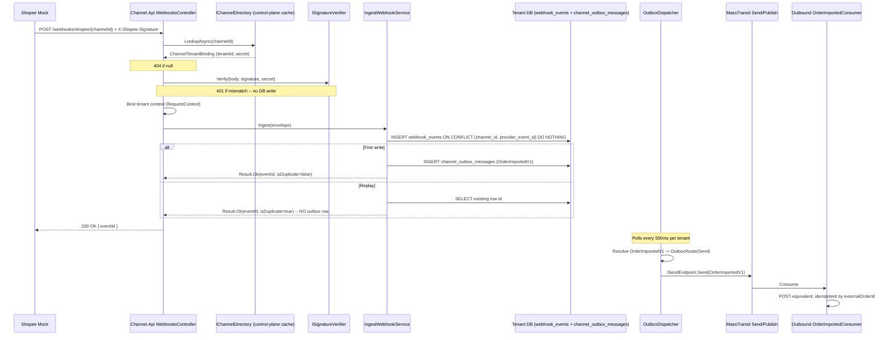

# feat: Phase-2 Sprint-4 — Channel adapter framework + webhook idempotency

## Summary

Build out the Channel module: `IChannelAdapter` framework with a Shopee concrete adapter and a separate mock-server process; webhook receiver in Channel.Api with per-tenant `webhook_events (channel_id, provider_event_id) UNIQUE` idempotency; channel→tenant routing via the existing `IChannelDirectory` port (inherited from Phase-0-redux); a product-mapping engine (exact + fuzzy + manual) in the Channel tenant DB; a `Channel→Outbound OrderImportedV1` contract so webhooks ultimately enter Outbound through Sprint-3's idempotent `POST /orders`; and the K13 envelope-type → endpoint routing upgrade to `OutboxDispatcher` (Phase-2 W6 mechanical-split prerequisite).

---

## Problem Frame

Phase-1 closed the customer funnel: Inventory holds stock, Inbound fills it, Outbound drains it. Every order today is hand-created via `POST /orders`. Phase-2 opens the front door — marketplace channels push orders in via webhooks and pull stock state back via push-sync. Sprint-4 is the **framework + first concrete adapter + idempotent ingress** half of that story (sync engine internals are Sprint-5). K13 — the Sprint-3 acknowledgment that `OutboxDispatcher` only publishes events and cannot route commands — must close here because Channel→Outbound (and Outbound→Channel tracking) increasingly look like commands, and the W6 mechanical split is downstream of this design.

---

## Requirements

- **R1.** `IChannelAdapter` port + factory + Shopee concrete adapter live in `ShopFlow.Channel.Infrastructure.Adapters`. Adapter surface is generic enough that adding Lazada (Sprint-6) requires zero touches outside `Adapters.Lazada/` plus one DI registration line. **(Origin: §9.4 "the only code change outside `Channel.Infrastructure.Adapters.Lazada` is a line of DI registration".)**
- **R2.** Shopee mock server runs as a **separate process** (per Channel AGENTS.md §11.6, NOT in-process): HMAC-SHA256-signed webhooks, advertised rate-limit headers, `POST /__chaos` endpoint that toggles 429/500 injection rates.
- **R3.** Webhook receiver at `POST /webhooks/{channelType}/{channelId}` persists `webhook_events` rows under `UNIQUE(channel_id, provider_event_id)`. Duplicate webhook → 200 OK with the existing row's id; original event is queued for downstream processing via `channel_outbox_messages`.
- **R4.** Tenant routing happens **before** any tenant-DB write. The receiver looks up `channel_id → tenant_id` via `IChannelDirectory` (already shipped). Unknown channel → 404. HMAC signature verified against `ChannelConnection.SecretEncrypted` *before* the receiver opens the tenant DbContext. Mismatch → 401, never reaches a tenant DB.
- **R5.** The receiver explicitly bypasses `UseTenantRouting` middleware (no `X-Tenant-Slug` header on inbound webhooks; tenant identity comes from `channel_id`).
- **R6.** Product mapping engine in `ChannelDbContext`: `product_mappings (channel_id, external_sku, internal_sku, confidence_score, mapping_method ∈ {Exact,Fuzzy,Manual}, created_at)`. Exact match lookup; fuzzy match service stub; manual override endpoint.
- **R7.** `Channel.Contracts.OrderImportedV1` + `Channel.Application.Consumers` that hand off Channel→Outbound. Outbound's existing idempotent `POST /orders` is the seam; the consumer simply HTTP-POSTs (or uses MT `Send` over the new K13 routing — see K13).
- **R8.** **K13 close**: `OutboxDispatcher` gains a `Type → OutboxRoute(SendKind, Exchange?, RoutingKey?)` registry. CLR-type discriminates `Publish` (event) from `Send` (command). No envelope-format change to existing `outbox_messages` rows. Existing event publish paths must not regress.
- **R9.** Channel module ships with `channel_outbox_messages` per the Sprint-2.5 per-module naming convention. `ChannelDbContext` carries `OutboxInterceptor`. K15 multi-tenant DbContext factory wiring identical to Inventory/Inbound/Outbound.
- **R10.** Scale gate (Category=Load, deferred measurement like Sprint-1/3): same webhook replayed 100× → exactly 1 outbox event; receiver sustains 1,000 req/s across 5 tenants (200/s each) at p99 < 200ms; cross-tenant signature mismatch rejected at receiver, no tenant-DB row.
- **R11.** Channel.Api `Program.cs` mirrors the Outbound shape: `AddShopFlowDefaults` → `AddChannelModule` → `UseProblemDetails` → conditional `UseTenantRouting` (excluding `/webhooks/*`) → `MapControllers`.

---

## Scope Boundaries

- **Stock sync engine** (coalescing buffer, per-channel token bucket, priority queue, circuit breaker, allocation engine) — **Sprint-5**, not here. Sprint-4 ships the channel **ingress** half only.
- **Lazada / TikTok Shop / Shopify concrete adapters** — Sprint-6+. Sprint-4's `IChannelAdapter` interface must be Lazada-shaped, but only Shopee gets a concrete + mock.
- **Real Shopee OAuth / shop-onboarding flows** — explicitly deferred (origin §10). HMAC secret is seeded directly into `ChannelConnection.SecretEncrypted` for tests; production OAuth is Phase-3+.
- **Oversell compensation** — Sprint-6.
- **Webhook / channel-connection management UI** — Phase-3 Sprint-7.
- **W6 mechanical split itself** — only the K13 prerequisite (envelope-type routing) lands here. Actually splitting Channel/Outbound/Inventory/Inbound into separate processes is later in Phase-2 or Phase-3.
- **KMS-backed secret unwrap** — `ChannelConnection.SecretEncrypted` stays a raw byte[] (per Phase-0-redux). Sprint-4 reads it as-is and verifies HMAC. KMS integration is documented as a follow-up.

### Deferred to Follow-Up Work

- **Webhook signature secret rotation flow** — secret is settable via `IChannelDirectory.Invalidate` cache eviction but the lifecycle UI/CLI ships in Sprint-7. Sprint-4 supports direct DB-row seeding only.
- **`IChannelAdapter.PushStockUpdateAsync` implementation body** — Sprint-4 ships the interface signature only (Lazada-shaped); the actual call path is wired in Sprint-5 alongside the sync engine.

---

## Context & Research

### Relevant Code and Patterns

- **`ChannelConnection` aggregate + `IChannelDirectory`** — already shipped in Phase-0-redux. `src/ControlPlane/ShopFlow.ControlPlane.Domain/ChannelConnection.cs`, `src/ControlPlane/ShopFlow.ControlPlane.Application/Ports/IChannelDirectory.cs`, `src/ControlPlane/ShopFlow.ControlPlane.Infrastructure/Repositories/ChannelDirectory.cs` (5-min sliding cache, `Invalidate(Guid)` on write paths). Sprint-4 **consumes** this seam, does not modify it.
- **Idempotency-via-UNIQUE-23505** — `src/Services/Inventory/ShopFlow.Inventory.Infrastructure/Repositories/ReservationRepository.cs:227-249`. BEGIN tx → INSERT → catch `PostgresException.SqlState == PostgresErrorCodes.UniqueViolation` → rollback → SELECT existing → return success with existing row. Webhook receiver mirrors this exactly.
- **MockShippingProvider + Polly v8 retry** — `src/Services/Outbound/ShopFlow.Outbound.Infrastructure/Shipping/MockShippingProvider.cs` and `OutboundServiceCollectionExtensions.cs:122-137`. Shape carries forward for the **adapter side**'s retry pipeline (calling the Shopee mock from `ShopeeAdapter`). The **mock server itself** is a separate process per Channel AGENTS.md §11.6 — different pattern.
- **OutboxDispatcher / MultiplexedOutboxDispatcher** — `src/Shared/ShopFlow.SharedKernel/Infrastructure/OutboxDispatcher.cs`. K13 lives at `DispatchOneTenantAsync` line 156: hardcoded `publisher.Publish(...)`. Sprint-4 adds the type-based routing branch.
- **`OutboxMessage` envelope** — `src/Shared/ShopFlow.SharedKernel/Infrastructure/OutboxMessage.cs`. Fixed shape: `Id, TenantId, EventType (AssemblyQualifiedName), Payload (JSON), TraceId, CreatedAt, ProcessedAt, RetryCount, LastError`. K13 fix reads `EventType`, resolves CLR type, looks up route. No envelope schema change.
- **Cross-module contract pattern** — `src/Shared/ShopFlow.Contracts/Outbound/OrderPlacedV1.cs`. `sealed record`, V1 suffix, `TenantId` on payload + on MT header, no framework/domain deps.
- **Per-module outbox naming + JSON options** — Sprint-2.5 convention. `OutboxMessageConfiguration.cs` rebinds the table name per module. `ShopFlow.SharedKernel.Infrastructure.OutboxJsonOptions.Default` is the single JSON options source.
- **`AddShopFlowDefaults`** — `src/Shared/ShopFlow.SharedKernel/Infrastructure/AddShopFlowDefaults.cs:122-167`. Selects RabbitMq via config; scans assemblies for consumers + sagas. Channel.Api mirrors Outbound's Program.cs shape.
- **MigrationSmokeTests pattern** — `tests/ShopFlow.SharedKernel.IntegrationTests/MigrationSmokeTests.cs`. Explicit `[Fact]` per DbContext (NOT reflection). Sprint-4 adds the 5th method.
- **EF9 PendingModelChangesWarning suppression** — `src/ControlPlane/ShopFlow.ControlPlane.Infrastructure/ControlPlaneDbContext.cs:39-45` `OnConfiguring` override. `ChannelDbContext` needs the same.

### Institutional Learnings

- **K10 — [`docs/solutions/2026-05-10-ef-migration-needs-attributes.md`](../solutions/2026-05-10-ef-migration-needs-attributes.md)**. `InitialChannelSchema` migration must carry BOTH `[Migration("…")]` and `[DbContext(typeof(ChannelDbContext))]`. Silent no-op otherwise → integration tests die with `42P01 relation "webhook_events" does not exist`.
- **K11 — [`docs/solutions/2026-05-13-multi-row-cte-predicate-must-live-in-update.md`](../solutions/2026-05-13-multi-row-cte-predicate-must-live-in-update.md)**. Not directly hit by webhook idempotency (single-row INSERT), but bulk product-mapping import paths must follow the rule if they ever land.
- **READ COMMITTED conditional-INSERT — [`docs/solutions/2026-05-12-readcommitted-conditional-cte-correctness.md`](../solutions/2026-05-12-readcommitted-conditional-cte-correctness.md)**. UNIQUE constraint is the correctness primitive for webhook idempotency. No SERIALIZABLE.
- **Per-module outbox naming — [`docs/solutions/2026-05-13-cross-module-outbox-table-name-collision.md`](../solutions/2026-05-13-cross-module-outbox-table-name-collision.md)**. Channel uses `channel_outbox_messages`. Reuse `OutboxJsonOptions.Default`.
- **EF9 PendingModelChangesWarning — [`docs/solutions/2026-05-13-ef9-pendingmodelchangeswarning-with-hand-authored-migrations.md`](../solutions/2026-05-13-ef9-pendingmodelchangeswarning-with-hand-authored-migrations.md)**. Override `OnConfiguring` in `ChannelDbContext`.

### External References

- Skipped — local patterns dense; Sprint-4 webhooks are HMAC-signed by our own mock server (we own the format).

---

## Key Technical Decisions

- **K13 envelope-type routing shape**: a `IOutboxRouteRegistry` interface registered in `AddShopFlowDefaults`, populated by per-module `AddXModule` calls via `services.AddOutboxRoute<OrderImportedV1>(SendKind.Publish)` / `services.AddOutboxRoute<ConfirmStockV1>(SendKind.Send, "channel-confirm-stock")`. The dispatcher reads it before each row. Unregistered type defaults to `Publish` for backward compatibility. **Rationale:** zero migration of existing outbox rows; existing Sprint-1/2/3 event publish paths unchanged; commands explicitly opt in.
- **Adapter framework lives in `Channel.Infrastructure.Adapters`** (NOT Application) — adapters are infrastructure; Application's job is to receive ingress and dispatch via `IChannelAdapter`. **Rationale:** matches the Repositories / Shipping layout in other modules; keeps Application transport-agnostic.
- **Shopee mock = separate process at `tools/mocks/shopee/`** (per Channel AGENTS.md §11.6). Kestrel-hosted ASP.NET process, started by Aspire in dev, by docker-compose in CI. **Rationale:** mock-as-process forces realistic transport semantics (real HTTP, real HMAC over the wire, real chaos injection). In-process Polly-wrapped mocks (Sprint-3's pattern) are correct for unit-scale adapter tests but lose the integration-realism for the receiver path.
- **Webhook receiver is `[ApiController]` mapped in Channel.Api with explicit `[SkipTenantRouting]` attribute** read by the routing middleware. **Rationale:** keeps `UseTenantRouting` global without per-endpoint MapGroup gymnastics. The middleware extension is small (3 lines + attribute class).
- **`IChannelAdapter` is async-method-only** (no events, no state): `IngestWebhookAsync(WebhookEnvelope, CancellationToken) → Result<ChannelEvent>` plus `PushStockUpdateAsync(stockUpdate, CancellationToken) → Result` (stub body until Sprint-5). **Rationale:** simplest viable surface; Lazada will fit because their webhook shapes coerce to the same `WebhookEnvelope`. State (rate-limit counters) is owned by Sprint-5's sync engine, not the adapter.
- **HMAC verification happens in a `SignatureVerifier` service called from the receiver** before any DB write. Constant-time comparison via `CryptographicOperations.FixedTimeEquals`. **Rationale:** standard-of-care for signature verification; isolated from controller for testability.
- **Product mapping is in the tenant DB, not control-plane**. **Rationale:** mappings are per-tenant, high-churn, and never need cross-tenant queries. Control-plane stays small.
- **Channel→Outbound handoff = MassTransit consumer in Outbound that calls `OrdersController.Create` logic** via the existing `IUnitOfWork`+`IOrderRepository` (NOT a self-HTTP call). **Rationale:** avoids self-loopback; the K13 routing publishes `OrderImportedV1` and Outbound's consumer reuses the idempotent-by-`channelExternalOrderId` path Sprint-3 already shipped. Idempotency carries via `OrderImportedV1.ChannelExternalOrderId → Order.ExternalOrderId` UNIQUE in Outbound.
- **No `IChannelDirectory` modifications**. Sprint-4 reads the port as-is. If write-path eviction is needed (admin endpoint creates/disables a channel), it lives behind a tiny `IChannelConnectionAdmin` port in Sprint-7's management UI, not here.

---

## Open Questions

### Resolved During Planning

- **Where does `webhook_events` live?** → Tenant DB (not control-plane). Origin tech-design §6 is explicit.
- **Channel.Api auth posture for webhooks?** → No JWT, no `X-Tenant-Slug`. HMAC over body is the auth primitive. `[AllowAnonymous]` plus the explicit `[SkipTenantRouting]` opt-out.
- **Is `OrderImportedV1` an event or a command?** → Command (resolves to one Outbound consumer that creates an order). Travels via K13's `Send` branch.

### Deferred to Implementation

- **Fuzzy match algorithm**: Levenshtein vs trigram vs ngrams. U6's test scenarios pin behavior; the implementer picks Levenshtein-default-with-Postgres-`pg_trgm`-as-stretch and the choice surfaces in code review.
- **Mock Shopee server's exact rate-limit-header format** — implementer matches Shopee's documented format from public dev docs. Not architecturally significant.
- **`channel_outbox_messages` partition strategy** — none for Phase-2; revisit at Sprint-5 close if Aspire load tests show table bloat.

---

## Output Structure

```text
src/Services/Channel/
├── ShopFlow.Channel.Domain/
│   ├── Channels/
│   │   ├── Channel.cs                          # Aggregate: per-tenant channel-instance row
│   │   └── ChannelStatus.cs                    # Enum: Active|Disabled
│   ├── Webhooks/
│   │   ├── WebhookEvent.cs                     # Aggregate
│   │   └── WebhookProcessingStatus.cs
│   ├── ProductMappings/
│   │   ├── ProductMapping.cs
│   │   └── MappingMethod.cs                    # Enum: Exact|Fuzzy|Manual
│   └── ChannelModuleMarker.cs                  # (existing, stays)
├── ShopFlow.Channel.Application/
│   ├── Ports/
│   │   ├── IChannelAdapter.cs                  # Per-channel adapter surface
│   │   ├── IChannelAdapterFactory.cs           # Resolve adapter by ChannelType
│   │   ├── ISignatureVerifier.cs
│   │   ├── IProductMappingService.cs
│   │   ├── IWebhookEventRepository.cs
│   │   └── IChannelOutbox.cs
│   ├── Webhooks/
│   │   ├── IngestWebhookService.cs             # Orchestrator: verify → persist (UNIQUE-23505) → outbox
│   │   └── WebhookEnvelope.cs                  # DTO crossing port boundary
│   ├── Consumers/
│   │   └── (none in Sprint-4; receivers are HTTP)
│   └── ChannelApplicationMarker.cs
├── ShopFlow.Channel.Infrastructure/
│   ├── ChannelDbContext.cs                     # DbSets + OnConfiguring suppression
│   ├── EntityConfigurations/
│   │   ├── ChannelConfiguration.cs
│   │   ├── WebhookEventConfiguration.cs        # UNIQUE(channel_id, provider_event_id)
│   │   ├── ProductMappingConfiguration.cs
│   │   └── OutboxMessageConfiguration.cs       # Rebinds table to channel_outbox_messages
│   ├── Migrations/
│   │   └── 20260513_000001_InitialChannelSchema.cs   # [Migration]+[DbContext]
│   ├── Repositories/
│   │   ├── WebhookEventRepository.cs           # UNIQUE-23505 idempotency
│   │   ├── ProductMappingRepository.cs
│   │   └── ChannelOutbox.cs
│   ├── Adapters/
│   │   ├── ShopeeAdapter.cs                    # IChannelAdapter impl
│   │   ├── ShopeeWebhookParser.cs              # Bytes → WebhookEnvelope
│   │   └── ShopeeHttpClient.cs                 # HttpClient + Polly v8 pipeline
│   ├── Signature/
│   │   └── ShopeeSignatureVerifier.cs          # ISignatureVerifier(channelType=Shopee)
│   ├── Mapping/
│   │   └── HybridProductMappingService.cs      # Exact → Fuzzy → null
│   └── ChannelServiceCollectionExtensions.cs   # AddChannelModule + AddOutboxRoute<>
└── ShopFlow.Channel.Api/
    ├── Program.cs                              # AddShopFlowDefaults + AddChannelModule + UseTenantRouting
    ├── Controllers/
    │   ├── WebhooksController.cs               # [SkipTenantRouting] POST /webhooks/{channelType}/{channelId}
    │   ├── ProductMappingsController.cs        # CRUD + POST /resolve
    │   └── ChannelsController.cs               # (existing stub, replaced)
    └── appsettings.json

src/Shared/ShopFlow.Contracts/
└── Channel/
    └── OrderImportedV1.cs                      # New cross-module command

src/Shared/ShopFlow.SharedKernel/
├── Infrastructure/
│   ├── OutboxDispatcher.cs                     # K13: read registry per row
│   ├── IOutboxRouteRegistry.cs                 # NEW: Type → OutboxRoute
│   ├── OutboxRoute.cs                          # NEW: record(SendKind, Exchange?, RoutingKey?)
│   └── OutboxRouteRegistry.cs                  # NEW: dictionary-backed default
└── Middleware/
    ├── SkipTenantRoutingAttribute.cs           # NEW
    └── TenantRoutingMiddleware.cs              # MODIFY: honor [SkipTenantRouting]

src/Services/Outbound/ShopFlow.Outbound.Application/
└── Consumers/
    └── OrderImportedConsumer.cs                # NEW: Channel→Outbound bridge

tools/mocks/shopee/
├── Program.cs                                  # Kestrel host
├── Endpoints/
│   ├── WebhookSender.cs                        # POST /__send-webhook (test driver)
│   └── ChaosController.cs                      # POST /__chaos { rate429, rate500 }
├── Signing/
│   └── ShopeeSigner.cs                         # HMAC-SHA256
└── ShopFlow.Mocks.Shopee.csproj
```

---

## High-Level Technical Design

> *This illustrates the intended approach and is directional guidance for review, not implementation specification. The implementing agent should treat it as context, not code to reproduce.*

### Webhook ingress sequence



### K13 routing registry shape (directional)

```csharp
// directional sketch -- not implementation spec
public enum SendKind { Publish, Send }
public sealed record OutboxRoute(SendKind Kind, string? Exchange = null, string? RoutingKey = null);

public interface IOutboxRouteRegistry
{
    OutboxRoute Resolve(Type messageType);  // returns Publish-default if unregistered
}

// In Channel module composition:
services.AddOutboxRoute<OrderImportedV1>(SendKind.Send);
// In Inventory/Inbound/Outbound: no change (default = Publish)

// In OutboxDispatcher.DispatchOneTenantAsync:
var route = registry.Resolve(clrType);
if (route.Kind == SendKind.Publish) await publisher.Publish(payload, clrType, hdrs, ct);
else await sendProvider.GetSendEndpoint(addr).Send(payload, clrType, hdrs, ct);
```

### Idempotency invariant

For any tenant T and any `(channel_id, provider_event_id)` pair, **exactly one** `channel_outbox_messages` row is written across all replays. The UNIQUE constraint on `webhook_events` is the single correctness primitive — the outbox INSERT is gated by the `webhook_events` INSERT's success (first-write branch only).

---

## Implementation Units

### U1. Channel Domain aggregates + value objects

**Goal:** Land `Channel`, `WebhookEvent`, `ProductMapping` aggregates with value objects (`ProviderEventId`, `ExternalSku`, `MappingMethod`, `WebhookProcessingStatus`, `ChannelStatus`). Pure Domain — no EF, no SQL.

**Requirements:** R3, R6

**Dependencies:** None

**Files:**
- Create: `src/Services/Channel/ShopFlow.Channel.Domain/Channels/Channel.cs`
- Create: `src/Services/Channel/ShopFlow.Channel.Domain/Channels/ChannelStatus.cs`
- Create: `src/Services/Channel/ShopFlow.Channel.Domain/Webhooks/WebhookEvent.cs`
- Create: `src/Services/Channel/ShopFlow.Channel.Domain/Webhooks/WebhookProcessingStatus.cs`
- Create: `src/Services/Channel/ShopFlow.Channel.Domain/Webhooks/ProviderEventId.cs`
- Create: `src/Services/Channel/ShopFlow.Channel.Domain/ProductMappings/ProductMapping.cs`
- Create: `src/Services/Channel/ShopFlow.Channel.Domain/ProductMappings/MappingMethod.cs`
- Create: `src/Services/Channel/ShopFlow.Channel.Domain/ProductMappings/ExternalSku.cs`
- Test: `tests/ShopFlow.Channel.UnitTests/ChannelDomainTests.cs`

**Approach:**
- `WebhookEvent` factory `Create(channelId, providerEventId, payload, signatureVerified)` returns `Result<WebhookEvent>` per the Sprint-1/2/3 aggregate convention.
- `ProductMapping` factory rejects empty SKUs, normalizes case via `ExternalSku` value object.
- `WebhookProcessingStatus`: `Received → Processed | Failed`. Transitions through aggregate methods only.
- No domain events on Sprint-4 (consumers use `IChannelOutbox.AppendAsync` directly, mirroring Sprint-2-redux's `IInboundOutbox`).

**Execution note:** Test-first. Domain shapes are easy to fix; integration tests downstream depend on the surfaces.

**Patterns to follow:**
- `src/Services/Inbound/ShopFlow.Inbound.Domain/Purchasing/PurchaseOrder.cs` (state machine + Result factories)
- `src/Services/Outbound/ShopFlow.Outbound.Domain/Orders/Order.cs` (aggregate convention)

**Test scenarios:**
- *Happy path:* `WebhookEvent.Create` with valid inputs returns `Result.Ok(event)` with status `Received`.
- *Edge case:* `ProviderEventId.Create("")` returns `Result.Fail` — empty rejected.
- *Edge case:* `ProviderEventId.Create("  ")` rejected.
- *Edge case:* `ProviderEventId.Create(s)` length > 200 rejected (Postgres TEXT no hard limit, but bound at the domain).
- *State transition:* `WebhookEvent.MarkProcessed()` from `Received` → status becomes `Processed`, `processedAt` set.
- *Invalid transition:* `MarkProcessed` from `Failed` returns `Result.Fail`.
- *Happy path:* `ProductMapping.Create(channelId, externalSku, internalSku, Exact, 1.0)` → `Result.Ok`.
- *Edge case:* `ProductMapping.Create` with `Fuzzy` mapping_method and `confidence_score < 0.5` returns `Result.Fail` (fuzzy mappings need minimum confidence).
- *Edge case:* `ProductMapping.Create` with `Manual` and confidence ≠ 1.0 still allowed (manual is authoritative).
- *Equality:* `ExternalSku.Equals` is case-insensitive ordinal.
- *Channel:* `Channel.Disable()` from `Active` flips status; from `Disabled` is no-op (idempotent).

**Verification:**
- All Domain unit tests pass (target ≥ 25 tests across the three aggregates).
- No reference to EF / Postgres / MassTransit types in `ShopFlow.Channel.Domain.csproj`.

---

### U2. ChannelDbContext + InitialChannelSchema migration + MigrationSmokeTest

**Goal:** Define EF mapping for U1's aggregates plus `channel_outbox_messages`; ship the hand-authored initial migration with both attributes; cover the schema via MigrationSmokeTests.

**Requirements:** R3, R6, R9

**Dependencies:** U1

**Files:**
- Modify: `src/Services/Channel/ShopFlow.Channel.Infrastructure/ChannelDbContext.cs` (add DbSets, OnConfiguring suppression, OutboxInterceptor)
- Create: `src/Services/Channel/ShopFlow.Channel.Infrastructure/EntityConfigurations/ChannelConfiguration.cs`
- Create: `src/Services/Channel/ShopFlow.Channel.Infrastructure/EntityConfigurations/WebhookEventConfiguration.cs`
- Create: `src/Services/Channel/ShopFlow.Channel.Infrastructure/EntityConfigurations/ProductMappingConfiguration.cs`
- Create: `src/Services/Channel/ShopFlow.Channel.Infrastructure/EntityConfigurations/OutboxMessageConfiguration.cs`
- Create: `src/Services/Channel/ShopFlow.Channel.Infrastructure/Migrations/20260513_000001_InitialChannelSchema.cs`
- Create: `src/Services/Channel/ShopFlow.Channel.Infrastructure/Migrations/ChannelDbContextModelSnapshot.cs` (or accept the EF9 no-snapshot path per the solution doc)
- Modify: `tests/ShopFlow.SharedKernel.IntegrationTests/MigrationSmokeTests.cs` (add `ChannelMigration_AppliesAndLeavesNamedObjects`)

**Approach:**
- Tables: `channels`, `webhook_events`, `product_mappings`, `channel_outbox_messages`. Snake_case, mirroring existing modules.
- `WebhookEvent`: PK `id` (Guid), `channel_id` (Guid, NOT NULL), `provider_event_id` (TEXT NOT NULL), `payload` (JSONB), `signature_verified` (BOOL), `received_at`, `processed_at`, **UNIQUE INDEX `ux_webhook_events_channel_provider_event` ON (channel_id, provider_event_id)**.
- `ProductMapping`: PK `id`, `channel_id`, `external_sku`, `internal_sku`, `confidence_score` (NUMERIC(3,2)), `mapping_method` (VARCHAR(16) check constraint), `created_at`. UNIQUE on `(channel_id, external_sku)`.
- `Channel`: PK `channel_id` (Guid, mirrors control-plane `ChannelConnection.ChannelId`), `channel_type` (VARCHAR(32)), `status`, `created_at`. **No FK to control-plane** (different DB); the control-plane is the source of truth, the tenant DB row is a denormalized projection for adapter routing.
- `channel_outbox_messages`: identical shape to other modules' outbox tables; rebound via `OutboxMessageConfiguration.cs`.
- `ChannelDbContext.OnConfiguring`: `ConfigureWarnings(w => w.Ignore(RelationalEventId.PendingModelChangesWarning))` per K10's sibling solution doc.

**Patterns to follow:**
- `src/Services/Outbound/ShopFlow.Outbound.Infrastructure/Migrations/20260513_000001_InitialOutboundSchema.cs` (both attributes + raw SQL via MigrationBuilder)
- `src/Services/Outbound/ShopFlow.Outbound.Infrastructure/EntityConfigurations/OutboxMessageConfiguration.cs` (table rename pattern)

**Test scenarios:**
- *Integration:* `ChannelMigration_AppliesAndLeavesNamedObjects` creates fresh DB, applies, asserts `__EFMigrationsHistory >= 1`, asserts `to_regclass` for `channels` / `webhook_events` / `product_mappings` / `channel_outbox_messages` returns non-null, asserts `pg_constraint` for `ux_webhook_events_channel_provider_event` exists, asserts `pk_channel_outbox_messages` PK exists, asserts `mapping_method` check constraint exists.
- *Integration:* Inserting two `webhook_events` rows with same `(channel_id, provider_event_id)` raises `PostgresException` with SqlState `23505` and `ConstraintName` ending in `ux_webhook_events_channel_provider_event` — pins the constraint name the receiver code will catch.

**Verification:**
- `dotnet test --filter "Category=Integration"` runs the new smoke test green.
- The migration class carries both `[Migration]` and `[DbContext(typeof(ChannelDbContext))]` attributes.
- Smoke test count in MigrationSmokeTests rises to 5 (ControlPlane / Inbound / Inventory / Outbound / Channel).

---

### U3. Webhook receiver + signature verification + UNIQUE-23505 idempotency

**Goal:** End-to-end webhook ingress flow lands `webhook_events` rows idempotently, gates on HMAC verification, and writes exactly one `channel_outbox_messages` row per `(channel_id, provider_event_id)`.

**Requirements:** R3, R4, R5

**Dependencies:** U1, U2

**Files:**
- Create: `src/Services/Channel/ShopFlow.Channel.Application/Ports/ISignatureVerifier.cs`
- Create: `src/Services/Channel/ShopFlow.Channel.Application/Ports/IWebhookEventRepository.cs`
- Create: `src/Services/Channel/ShopFlow.Channel.Application/Ports/IChannelOutbox.cs`
- Create: `src/Services/Channel/ShopFlow.Channel.Application/Webhooks/WebhookEnvelope.cs`
- Create: `src/Services/Channel/ShopFlow.Channel.Application/Webhooks/IngestWebhookService.cs`
- Create: `src/Services/Channel/ShopFlow.Channel.Infrastructure/Repositories/WebhookEventRepository.cs`
- Create: `src/Services/Channel/ShopFlow.Channel.Infrastructure/Repositories/ChannelOutbox.cs`
- Create: `src/Services/Channel/ShopFlow.Channel.Infrastructure/Signature/ShopeeSignatureVerifier.cs`
- Create: `src/Shared/ShopFlow.SharedKernel/Middleware/SkipTenantRoutingAttribute.cs`
- Modify: `src/Shared/ShopFlow.SharedKernel/Middleware/TenantRoutingMiddleware.cs` (skip endpoints with `[SkipTenantRouting]`)
- Create: `src/Services/Channel/ShopFlow.Channel.Api/Controllers/WebhooksController.cs`
- Test: `tests/ShopFlow.Channel.IntegrationTests/WebhookReceiverTests.cs`
- Test: `tests/ShopFlow.Channel.UnitTests/IngestWebhookServiceTests.cs`
- Test: `tests/ShopFlow.Channel.UnitTests/ShopeeSignatureVerifierTests.cs`

**Approach:**
- Controller `[ApiController][SkipTenantRouting][AllowAnonymous] POST /webhooks/{channelType}/{channelId}`. Reads raw body via `EnableBuffering`, looks up `channelId` via `IChannelDirectory.LookupAsync`. 404 if null. Verifies signature against `binding.SecretEncrypted` (raw bytes; Sprint-4 doesn't unwrap KMS). 401 if mismatch — no DB touch.
- On verification success: bind tenant context via `RequestContext.Bind(binding.TenantId, binding.TenantSlug)`; call `IngestWebhookService.IngestAsync`.
- `IngestWebhookService`: open tx ReadCommitted via `IUnitOfWork`; call `IWebhookEventRepository.TryInsertAsync(channelId, providerEventId, payload, signatureVerified=true)`. Repository attempts INSERT, catches `PostgresException` with `SqlState == PostgresErrorCodes.UniqueViolation`, rolls back, SELECTs existing row, returns `(eventId, isDuplicate=true)`. First-write branch only appends the `OrderImportedV1` outbox row.
- `ShopeeSignatureVerifier`: HMAC-SHA256 over raw body; constant-time compare via `CryptographicOperations.FixedTimeEquals`.
- `WebhooksController` parses `payload → WebhookEnvelope` via channel-type-specific parser (Shopee parser in U5; U3 ships interface + shopee-shape only).

**Execution note:** Test-first. The UNIQUE-23505 catch-and-resolve loop is exactly the Sprint-1-redux shape; mirror that test pattern.

**Patterns to follow:**
- `src/Services/Inventory/ShopFlow.Inventory.Infrastructure/Repositories/ReservationRepository.cs:227-249` (23505 catch + existing-row return)
- `src/Services/Outbound/ShopFlow.Outbound.Infrastructure/Outbox/OutboundOutbox.cs` (IChannelOutbox shape)
- `src/Services/Inbound/ShopFlow.Inbound.Application/Receiving/ConfirmReceivingLineService.cs` (orchestrator pattern: validate → repo → outbox in one tx)

**Test scenarios:**
- *Happy path (unit):* `IngestWebhookService.IngestAsync` with new envelope → `Result.Ok(eventId, isDuplicate=false)`; outbox row appended.
- *Happy path (unit):* Re-ingest with same `(channelId, providerEventId)` → `Result.Ok(eventId=existing, isDuplicate=true)`; **NO** second outbox row.
- *Edge case (unit):* `IngestAsync` with whitespace `providerEventId` → `Result.Fail(InvalidProviderEventId)` via Domain validation.
- *Error path (unit):* Repository throws non-23505 PostgresException → propagates as `Result.Fail`; no outbox row.
- *Happy path (unit):* `ShopeeSignatureVerifier.Verify(body, validSignature, secret)` → true.
- *Error path (unit):* Mismatched signature → false.
- *Edge case (unit):* Empty signature → false.
- *Edge case (unit):* Comparison is constant-time (test by invoking 1000 times with random near-matches; not timing-sensitive but exercises `FixedTimeEquals`).
- *Happy path (integration):* `Covers R3.` POST /webhooks/shopee/{channelId} with valid HMAC + new provider_event_id → 200; one `webhook_events` row; one `channel_outbox_messages` row.
- *Happy path (integration):* `Covers R3.` Replay same POST → 200 with `isDuplicate=true` in response; still one row of each.
- *Error path (integration):* `Covers R4.` POST with wrong HMAC → 401; **zero** `webhook_events` rows in the tenant DB after the request.
- *Error path (integration):* POST to unknown channelId → 404; no DB touch.
- *Integration:* `Covers R4.` Tenant A's secret used to sign payload posted to Tenant B's channelId → 401; verified by counting rows in Tenant B's DB = 0.
- *Integration:* `Covers R5.` POST /webhooks/* succeeds without `X-Tenant-Slug` header (`[SkipTenantRouting]` works).
- *Integration:* Non-webhook endpoint without tenant header → existing 400/403 behavior unchanged.

**Verification:**
- WebhookReceiverTests + IngestWebhookServiceTests + ShopeeSignatureVerifierTests all green.
- Tenant routing middleware still rejects non-webhook requests without tenant context (regression check).
- Manual smoke via curl: replay 5× returns same eventId, single outbox row in the tenant DB.

---

### U4. K13 OutboxDispatcher envelope-type → endpoint routing

**Goal:** `OutboxDispatcher` reads a per-type registry to decide `Publish` vs `Send` and (for `Send`) the destination address. Unregistered types default to `Publish` — existing Sprint-1/2/3 paths unchanged.

**Requirements:** R8

**Dependencies:** None (touches SharedKernel; orthogonal to U1-U3)

**Files:**
- Create: `src/Shared/ShopFlow.SharedKernel/Infrastructure/OutboxRoute.cs`
- Create: `src/Shared/ShopFlow.SharedKernel/Infrastructure/SendKind.cs`
- Create: `src/Shared/ShopFlow.SharedKernel/Infrastructure/IOutboxRouteRegistry.cs`
- Create: `src/Shared/ShopFlow.SharedKernel/Infrastructure/OutboxRouteRegistry.cs`
- Modify: `src/Shared/ShopFlow.SharedKernel/Infrastructure/OutboxDispatcher.cs` (DispatchOneTenantAsync ~line 156)
- Modify: `src/Shared/ShopFlow.SharedKernel/Infrastructure/AddShopFlowDefaults.cs` (register `OutboxRouteRegistry` singleton; expose `AddOutboxRoute<T>` extension)
- Test: `tests/ShopFlow.SharedKernel.UnitTests/OutboxRouteRegistryTests.cs`
- Test: `tests/ShopFlow.SharedKernel.IntegrationTests/OutboxDispatcherRoutingTests.cs`

**Approach:**
- `OutboxRoute(SendKind Kind, string? Exchange = null, string? RoutingKey = null)`. `SendKind { Publish, Send }`.
- `IOutboxRouteRegistry.Resolve(Type) → OutboxRoute`. `OutboxRouteRegistry` impl backs to `ConcurrentDictionary<Type, OutboxRoute>`; missing key returns `OutboxRoute(SendKind.Publish)`.
- Extension `services.AddOutboxRoute<T>(SendKind kind, string? destination = null)` resolves to a builder action that populates the singleton at startup. For `Send`, destination defaults to `kebab-case(typeof(T).Name)` (e.g., `OrderImportedV1` → `order-imported-v1`); explicit destination overrides.
- `OutboxDispatcher.DispatchOneTenantAsync`: after CLR-type resolution, `var route = _registry.Resolve(clrType)`; if `Publish`, current behavior; if `Send`, `await sendProvider.GetSendEndpoint(new Uri($"queue:{route.RoutingKey ?? defaultName}")).Send(payload, clrType, hdrs, ct)`.
- Headers (`tenant.id`, `tenant.slug`, `correlation.id`) unchanged for both branches.
- Backward compatibility: every existing call site has zero registry entries → continues `Publish`-ing. Verified by ensuring no existing tests change behavior.

**Execution note:** Test-first. Routing-registry shape is small and easy to write to spec.

**Technical design:** *(see High-Level Technical Design section above — K13 routing registry shape sketch).*

**Patterns to follow:**
- `src/Shared/ShopFlow.SharedKernel/Infrastructure/AddShopFlowDefaults.cs:122-167` (composition pattern for module-level extensions)
- `src/Shared/ShopFlow.SharedKernel/Application/Ports/ITenantCatalog.cs` (port + cached impl shape for singletons)

**Test scenarios:**
- *Happy path (unit):* `OutboxRouteRegistry.Resolve(typeof(SomeUnregistered))` → `OutboxRoute(Publish, null, null)`.
- *Happy path (unit):* `AddOutboxRoute<Foo>(SendKind.Send)` registers `Foo` → `Resolve(typeof(Foo)) → OutboxRoute(Send, RoutingKey="foo")`.
- *Happy path (unit):* `AddOutboxRoute<Foo>(SendKind.Send, "custom-queue")` → `Resolve → OutboxRoute(Send, RoutingKey="custom-queue")`.
- *Edge case (unit):* Registering the same type twice — last-write-wins; no exception (composition order across modules).
- *Edge case (unit):* `Resolve(null)` throws `ArgumentNullException`.
- *Integration:* `Covers R8.` Dispatcher with a single registered Send-route type and one matching outbox row → `ISendEndpoint.Send` is invoked exactly once, `IPublishEndpoint.Publish` zero times. Use a MassTransit `TestHarness` to assert.
- *Integration:* `Covers R8.` Dispatcher with an unregistered type (e.g., `OrderPlacedV1`) → `Publish` invoked, `Send` not invoked. Pins backward compatibility.
- *Integration:* Mixed batch (one Send-type + one Publish-type row in same poll tick) → each routed correctly; ordering preserved by `CreatedAt`.
- *Integration:* `Covers R9.` Headers (`tenant.id`, `correlation.id`) present on both Send and Publish paths.

**Verification:**
- All Sprint-1/2/3 outbox-dispatch integration tests still pass without modification (regression).
- New routing tests green.
- Phase-2-readiness: registry registration is exposed to any module's `AddXModule` extension.

---

### U5. IChannelAdapter framework + Shopee adapter (in-process side)

**Goal:** Define `IChannelAdapter` + `IChannelAdapterFactory`. Implement `ShopeeAdapter` with HMAC verification + Shopee-shaped webhook parsing. Wire the factory + adapter in Channel's DI extension.

**Requirements:** R1

**Dependencies:** U1, U3

**Files:**
- Create: `src/Services/Channel/ShopFlow.Channel.Application/Ports/IChannelAdapter.cs`
- Create: `src/Services/Channel/ShopFlow.Channel.Application/Ports/IChannelAdapterFactory.cs`
- Create: `src/Services/Channel/ShopFlow.Channel.Infrastructure/Adapters/ChannelAdapterFactory.cs`
- Create: `src/Services/Channel/ShopFlow.Channel.Infrastructure/Adapters/ShopeeAdapter.cs`
- Create: `src/Services/Channel/ShopFlow.Channel.Infrastructure/Adapters/ShopeeWebhookParser.cs`
- Create: `src/Services/Channel/ShopFlow.Channel.Infrastructure/Adapters/ShopeeHttpClient.cs`
- Create: `src/Services/Channel/ShopFlow.Channel.Infrastructure/ChannelServiceCollectionExtensions.cs`
- Test: `tests/ShopFlow.Channel.UnitTests/ShopeeAdapterTests.cs`
- Test: `tests/ShopFlow.Channel.UnitTests/ShopeeWebhookParserTests.cs`

**Approach:**
- `IChannelAdapter`: methods `Result<WebhookEnvelope> ParseWebhook(byte[] body, IReadOnlyDictionary<string,string> headers)`, `Task<Result> PushStockUpdateAsync(StockUpdateRequest req, CancellationToken ct)` (Sprint-4 body is `Result.Fail("not-yet-implemented-sprint-5")`). Property `ChannelType ChannelType { get; }`.
- `IChannelAdapterFactory.ResolveFor(channelType)`: looks up registered `IChannelAdapter` instances keyed by `ChannelType` enum/string. Throws `UnknownChannelTypeException` if missing.
- `ShopeeAdapter` constructor takes `ShopeeHttpClient` + `ShopeeWebhookParser`. `ParseWebhook` delegates to parser; `PushStockUpdateAsync` stub.
- `ShopeeHttpClient`: `HttpClient` registered via `IHttpClientFactory`, base address from config `Channel:Shopee:MockBaseUrl` (Aspire-injected in dev, env var in prod). Polly v8 retry pipeline registered as Singleton (mirrors Sprint-3 `MockShippingProvider`'s Polly setup).
- `ShopeeWebhookParser`: deserializes Shopee's webhook envelope shape into our internal `WebhookEnvelope` (`channelExternalOrderId`, `providerEventId`, `eventType`, `rawPayload`, `occurredAt`). Uses `OutboxJsonOptions.Default` to avoid the Sprint-2.5 camelCase trap.
- `ChannelServiceCollectionExtensions.AddChannelModule(configuration)`: registers `ChannelDbContext`, repositories, `IngestWebhookService`, `IChannelAdapterFactory`, `ShopeeAdapter` (Singleton keyed by `ChannelType.Shopee`), `IHttpClientFactory` config, and **calls `services.AddOutboxRoute<OrderImportedV1>(SendKind.Send)`** (U4 dependency).

**Patterns to follow:**
- `src/Services/Outbound/ShopFlow.Outbound.Infrastructure/Shipping/MockShippingProvider.cs` (HttpClient + Polly pipeline registration pattern)
- `src/Services/Outbound/ShopFlow.Outbound.Infrastructure/OutboundServiceCollectionExtensions.cs:122-137` (Polly v8 ResiliencePipelineBuilder)

**Test scenarios:**
- *Happy path (unit):* `ShopeeWebhookParser.Parse(validShopeeBody)` → `Result.Ok(envelope)` with `providerEventId`, `channelExternalOrderId`, `eventType="order.created"` populated.
- *Edge case (unit):* Malformed JSON → `Result.Fail`.
- *Edge case (unit):* Missing required field (`event_id`) → `Result.Fail`.
- *Edge case (unit):* Extra fields ignored (forward-compat).
- *Happy path (unit):* `ChannelAdapterFactory.ResolveFor(ChannelType.Shopee)` returns `ShopeeAdapter`.
- *Error path (unit):* `ResolveFor(ChannelType.Lazada)` throws `UnknownChannelTypeException` (Lazada registration absent — proves Sprint-6 will add the registration alone).
- *Happy path (unit):* `ShopeeAdapter.PushStockUpdateAsync` returns `Result.Fail("sprint-5-deferred")` (pins the stub).
- *Integration:* `Covers R1.` `ChannelServiceCollectionExtensions.AddChannelModule` registers the adapter; `IChannelAdapterFactory.ResolveFor(Shopee)` resolves via the IoC container.

**Verification:**
- All adapter tests green.
- Channel module DI graph compiles + resolves cleanly in a `WebApplicationFactory` smoke test.
- `AddOutboxRoute<OrderImportedV1>(SendKind.Send)` is wired (verified via IoC inspection in test).

---

### U6. Product mapping engine (exact + fuzzy + manual)

**Goal:** `IProductMappingService` resolves `(channelId, externalSku) → internalSku` via Exact lookup first, Fuzzy fallback, returning null if neither matches. Manual mapping CRUD endpoints.

**Requirements:** R6

**Dependencies:** U1, U2

**Files:**
- Create: `src/Services/Channel/ShopFlow.Channel.Application/Ports/IProductMappingRepository.cs`
- Create: `src/Services/Channel/ShopFlow.Channel.Application/Ports/IProductMappingService.cs`
- Create: `src/Services/Channel/ShopFlow.Channel.Infrastructure/Repositories/ProductMappingRepository.cs`
- Create: `src/Services/Channel/ShopFlow.Channel.Infrastructure/Mapping/HybridProductMappingService.cs`
- Create: `src/Services/Channel/ShopFlow.Channel.Api/Controllers/ProductMappingsController.cs`
- Test: `tests/ShopFlow.Channel.IntegrationTests/ProductMappingTests.cs`
- Test: `tests/ShopFlow.Channel.UnitTests/HybridProductMappingServiceTests.cs`

**Approach:**
- `HybridProductMappingService.ResolveAsync(channelId, externalSku)`:
  1. Exact: `SELECT internal_sku FROM product_mappings WHERE channel_id=$1 AND external_sku=$2 LIMIT 1`. Hit → return.
  2. Fuzzy: Postgres `pg_trgm` similarity if extension available, else case-insensitive substring with stopword normalization. Returns top-1 candidate above threshold (0.6).
  3. Miss → return null.
- Controller `ProductMappingsController`:
  - `POST /product-mappings` — admin-creates Manual mapping (idempotent on `(channelId, externalSku)` UNIQUE via 23505 catch).
  - `POST /product-mappings/resolve` — invokes service; returns `200 { internalSku, method, confidence }` or `404` if unmapped.
  - `GET /product-mappings/{channelId}` — paged list.
- Fuzzy match is stretch — implementer picks Levenshtein-default-with-pg_trgm-as-stretch. Tests pin the *behavior* (top-1 above threshold), not the algorithm.

**Patterns to follow:**
- `src/Services/Outbound/ShopFlow.Outbound.Api/Controllers/OrdersController.cs` (idempotent POST + 23505 short-circuit)
- `src/Services/Inventory/ShopFlow.Inventory.Application/PutAway/PutAwaySuggestionService.cs` (top-K ranking service shape)

**Test scenarios:**
- *Happy path (unit):* Repository has exact match → service returns `(internalSku, Exact, 1.0)`.
- *Happy path (unit):* No exact match, fuzzy candidate above threshold → returns `(internalSku, Fuzzy, score)`.
- *Edge case (unit):* No exact + fuzzy below threshold → returns null.
- *Edge case (unit):* Empty `externalSku` → `Result.Fail` at controller, never hits service.
- *Integration:* `Covers R6.` POST manual mapping + POST same `(channelId, externalSku)` again → 200 idempotent, single row.
- *Integration:* `Covers R6.` Resolve for Exact-matched SKU → 200 with `method=Exact`.
- *Integration:* Resolve for unmapped SKU → 404.
- *Integration:* GET list paginates correctly (50 rows, page=2&pageSize=20 returns rows 21-40).

**Verification:**
- `ProductMappingTests` green.
- Idempotent manual-create path verified via duplicate POST.

---

### U7. Shopee mock server (separate process)

**Goal:** A standalone Kestrel-hosted ASP.NET service that emulates Shopee's webhook-source behavior: signs HMAC-SHA256 over outgoing webhooks, advertises rate-limit headers, accepts `POST /__chaos` toggle for 429/500 injection. Started by Aspire in dev.

**Requirements:** R2

**Dependencies:** U3 (consumes the receiver shape; mock has to know what to POST)

**Files:**
- Create: `tools/mocks/shopee/ShopFlow.Mocks.Shopee.csproj`
- Create: `tools/mocks/shopee/Program.cs`
- Create: `tools/mocks/shopee/Endpoints/WebhookSender.cs`
- Create: `tools/mocks/shopee/Endpoints/ChaosController.cs`
- Create: `tools/mocks/shopee/Signing/ShopeeSigner.cs`
- Create: `tools/mocks/shopee/appsettings.json`
- Modify: `src/AppHost/ShopFlow.AppHost.csproj` (reference the mock as an Aspire resource)
- Modify: `src/AppHost/Program.cs` (register `AddProject<Projects.ShopFlow_Mocks_Shopee>` and inject `Channel:Shopee:MockBaseUrl` into Channel.Api)
- Modify: `infrastructure/docker-compose.yml` (add `shopee-mock` service for prod-parity dev runs)
- Test: `tests/ShopFlow.Mocks.Shopee.IntegrationTests/MockServerBehaviorTests.cs`

**Approach:**
- `POST /__send-webhook { channelId, providerEventId?, externalOrderId, eventType }` — test driver constructs a Shopee-shaped envelope, signs it with the channel's secret (read from a small in-memory secret map seeded at startup via config), and POSTs to the Channel.Api receiver URL. Returns the receiver's response.
- `POST /__chaos { rate429, rate500, latencyJitterMs }` — sets in-memory probabilities used by the sender to inject failures.
- `ShopeeSigner.Sign(body, secret) → string` — HMAC-SHA256 base64. `Random.Shared` per AGENTS.md §3.21 for jitter.
- Mock advertises rate-limit headers (`X-Ratelimit-Limit`, `X-Ratelimit-Remaining`, `X-Ratelimit-Reset`) on responses — values are config-driven, not computed (Sprint-5 wires the real bucket).
- Aspire wiring: the mock is a sibling `dotnet run` target. Aspire injects its URL into Channel.Api's config (`Channel:Shopee:MockBaseUrl`).

**Patterns to follow:**
- `src/AppHost/Program.cs` Aspire registration shape for existing modules
- `src/Services/Outbound/ShopFlow.Outbound.Infrastructure/Shipping/MockShippingProvider.cs` (signer + flake/delay knobs — different pattern but similar config story)

**Test scenarios:**
- *Happy path (integration):* `POST /__send-webhook` → mock signs body + POSTs to Channel.Api stub URL → returns 200.
- *Edge case (integration):* `POST /__chaos { rate429: 1.0 }` then `/__send-webhook` → mock returns 429 to the test driver without POSTing to Channel.Api (failure simulated at the mock).
- *Edge case (integration):* `POST /__chaos { rate500: 1.0 }` → mock returns 500.
- *Happy path (integration):* `Covers R2.` Signature header on outgoing webhook verifies against the channel's seeded secret when checked by `ShopeeSignatureVerifier` (round-trip).
- *Integration:* Rate-limit headers present on every response.

**Verification:**
- Mock starts cleanly via `dotnet run` from `tools/mocks/shopee/`.
- Aspire `task up` brings mock + Channel.Api up together with wired config.
- `MockServerBehaviorTests` green.

---

### U8. Channel→Outbound `OrderImportedV1` contract + Outbound consumer

**Goal:** Channel ingest produces `OrderImportedV1` outbox row → K13 routes as `Send` → Outbound's `OrderImportedConsumer` creates an `Order` via the existing idempotent path. End-to-end: webhook → Outbound order.

**Requirements:** R7, R8

**Dependencies:** U3, U4, U5

**Files:**
- Create: `src/Shared/ShopFlow.Contracts/Channel/OrderImportedV1.cs`
- Create: `src/Shared/ShopFlow.Contracts/Channel/OrderImportedLineV1.cs`
- Create: `src/Services/Outbound/ShopFlow.Outbound.Application/Consumers/OrderImportedConsumer.cs`
- Modify: `src/Services/Channel/ShopFlow.Channel.Application/Webhooks/IngestWebhookService.cs` (append `OrderImportedV1` to outbox on first-write branch)
- Modify: `src/Services/Outbound/ShopFlow.Outbound.Infrastructure/OutboundServiceCollectionExtensions.cs` (register consumer scan; no new outbox-route line — consumer is the receiver, not the sender)
- Test: `tests/ShopFlow.Outbound.IntegrationTests/OrderImportedConsumerTests.cs`
- Test: `tests/ShopFlow.Channel.IntegrationTests/WebhookToOutboundFlowTests.cs`

**Approach:**
- `OrderImportedV1(Guid TenantId, Guid ChannelId, string ChannelExternalOrderId, string ShippingProfile, IReadOnlyList<OrderImportedLineV1> Lines, DateTime OccurredAt)`. `OrderImportedLineV1(string ExternalSku, int Qty)`.
- `IngestWebhookService` (first-write branch only): resolves external SKUs via `IProductMappingService.ResolveAsync` for each line; if any line is unmappable, appends a `OrderImportedV1` with `internalSku=null` for that line (or rejects — design decision pinned by U6 + open-question resolution). **Pin:** unmappable lines fail the whole import — outbox writes a `WebhookImportFailedV1` instead, surface to operator queue in Sprint-7. For Sprint-4, fail fast: status `Failed`, no `OrderImportedV1` row.
- `OrderImportedConsumer` in Outbound: opens scoped `IUnitOfWork`, calls existing `IOrderRepository.CreateAsync` logic (same path Sprint-3's `OrdersController` uses); idempotent on `Order.ExternalOrderId UNIQUE` (already enforced from Sprint-3). Duplicate `ChannelExternalOrderId` → consumer logs + acks; no double-create.
- **K13 dependency:** `OrderImportedV1` is registered with `SendKind.Send` (in `AddChannelModule` per U5). Consumer subscribes via MT endpoint convention.

**Patterns to follow:**
- `src/Services/Inventory/ShopFlow.Inventory.Application/Consumers/ReserveStockConsumer.cs` (consumer shape: scope, tx, idempotency, ack)
- `src/Shared/ShopFlow.Contracts/Outbound/OrderPlacedV1.cs` (record + lines pattern)
- `src/Services/Outbound/ShopFlow.Outbound.Api/Controllers/OrdersController.cs` (idempotent create logic to reuse)

**Test scenarios:**
- *Happy path (unit):* Consumer receives `OrderImportedV1` for new `(tenantId, externalOrderId)` → creates `Order` row; outbox row appended for `OrderPlacedV1` (saga continues).
- *Happy path (unit):* Consumer receives duplicate `OrderImportedV1` → idempotent: no second `Order` row, no second saga.
- *Error path (unit):* Consumer receives `OrderImportedV1` with empty `Lines` → rejects.
- *Integration:* `Covers R7.` End-to-end: mock POSTs webhook → receiver persists `webhook_events` + outbox row → dispatcher routes as Send → consumer creates Outbound `Order` → assert `Order` row + saga in `Reserving` state.
- *Integration:* `Covers R8.` Same flow with `OrderImportedV1` registered → MT TestHarness shows `Send` invocation, not `Publish`.
- *Integration:* Webhook replay (same `providerEventId`) → exactly one Outbound `Order` row across replays (verifies the idempotency chain: webhook UNIQUE → outbox single-row → consumer idempotent).
- *Integration:* `Covers R6.` Webhook with unmappable external SKU → 200 to mock (receiver doesn't fail webhook), `webhook_events` row marked `Failed`, **NO** Outbound `Order` row, NO `OrderImportedV1` outbox row.

**Verification:**
- `WebhookToOutboundFlowTests` green — full chain works.
- Sprint-3 Saga happy path tests still green (regression).

---

### U9. Channel.Api Program.cs + multi-tenant scale gate

**Goal:** Wire Channel.Api Program.cs end-to-end. Add the Category=Load test that exercises the receiver under multi-tenant burst.

**Requirements:** R10, R11

**Dependencies:** U3, U5, U7

**Files:**
- Modify: `src/Services/Channel/ShopFlow.Channel.Api/Program.cs` (replace 12-line stub with composition)
- Modify: `src/Services/Channel/ShopFlow.Channel.Api/appsettings.json` (connection string keys, Shopee mock URL, options)
- Create: `tests/ShopFlow.Channel.IntegrationTests/MultiTenantWebhookScaleGateTests.cs`
- Create: `tests/ShopFlow.Channel.IntegrationTests/TenantWebhookHarness.cs`
- Modify: `tests/ShopFlow.SharedKernel.IntegrationTests/CrossTenantRoutingTests.cs` (add a webhook-receiver-bypass case)

**Approach:**
- `Program.cs`: `builder.Services.AddShopFlowDefaults(builder.Configuration, opts => opts.ServiceName = "shopflow-channel", typeof(ChannelDbContext).Assembly, typeof(IChannelAdapter).Assembly)`; `.AddChannelModule(builder.Configuration)`; `.UseProblemDetails()`; `.UseTenantRouting()` (now honors `[SkipTenantRouting]`); `.MapControllers()`.
- Scale gate (Category=Load):
  - Seed 5 tenant DBs with `ChannelConnection` rows in control-plane.
  - Pre-warm: 100 webhook posts to each.
  - Burst: 200 webhooks/second/tenant × 5 tenants for 5 seconds (5,000 total).
  - Assert: p99 receiver latency < 200ms per tenant; per-tenant fairness floor ≥ 0.85; **zero** cross-tenant webhook row pollution (count rows in each tenant DB).
  - Replay assertion: replay 100 same `(channelId, providerEventId)` → exactly 1 outbox row.
- Uses `NpgsqlConnection.ClearAllPools()` between runs (per Sprint-3 U8 finding).
- Mock-server delay shortened to 5-20ms for bounded wall-time (per Sprint-3 U8 deviation pattern).

**Execution note:** Scale gate is code-complete + tagged `Category=Load` + carries the Docker-required acknowledgment. Wall-time measurement on this dev machine is deferred (Docker daemon not running) — CI captures the numbers; sign-off doc records the deferral like Sprint-1/3.

**Patterns to follow:**
- `tests/ShopFlow.Inventory.IntegrationTests/MultiTenantScaleGateTests.cs` (Sprint-1-redux scale gate shape)
- `tests/ShopFlow.Outbound.IntegrationTests/MultiTenantOutboundScaleGateTests.cs` (Sprint-3 scale gate)
- `tests/ShopFlow.SharedKernel.IntegrationTests/CrossTenantRoutingTests.cs` (cross-tenant assertion shape)

**Test scenarios:**
- *Integration (Load):* `Covers R10.` 5 tenants × 200 webhooks/s × 5s → p99 < 200ms, fairness ≥ 0.85.
- *Integration (Load):* `Covers R10.` Replay same `(channelId, providerEventId)` 100× → exactly 1 outbox row.
- *Integration:* `Covers R10.` Tenant A's secret signs payload posted to tenant B's `channelId` → 401, zero rows in tenant B's DB after 100 attempts.
- *Integration:* Program.cs `WebApplicationFactory` smoke — Channel.Api boots, `/healthz` returns 200, `/webhooks/shopee/{channelId}` reachable without tenant header.

**Verification:**
- Channel.Api boots in Aspire and via plain `dotnet run`.
- `MultiTenantWebhookScaleGateTests` runs in CI; wall-time numbers captured in nightly job and folded into the Sprint-4 sign-off doc once available.
- Existing 7 `CrossTenantRoutingTests` still green (regression).

---

### U10. Sprint-4 sign-off + CHANGELOG + README + tag

**Goal:** Close Sprint-4: sign-off doc following Sprint-1/2/3 shape; CHANGELOG entry; README + CLAUDE.md current-stage update; tag `v0.6.0-sprint-4`.

**Requirements:** R1-R11 (closeout)

**Dependencies:** U1-U9

**Files:**
- Create: `docs/phase-gates/2026-05-13-sprint-4-signoff.md`
- Modify: `docs/CHANGELOG.md` (Sprint-4 entry)
- Modify: `README.md` (current-stage section)
- Modify: `CLAUDE.md` (Active branch + Sprint-4 progress section, next implementation step)
- Tag: `v0.6.0-sprint-4`

**Approach:**
- Sign-off doc: structure mirrors `docs/phase-gates/2026-05-13-sprint-3-redux-signoff.md`. Sections: scope shipped, deferred, scale-gate measurements (or deferred-to-CI), K13 close confirmation, deviations from plan, links to new `docs/solutions/` entries.
- Capture new `docs/solutions/` entries as they arise — anticipated:
  - HMAC verification + `CryptographicOperations.FixedTimeEquals` gotchas if any.
  - K13 routing-registry shape and any composition-order traps discovered during U4-U5-U8 wiring.
  - Mock-server-as-Aspire-resource patterns if non-obvious.
- CHANGELOG: minor version bump (closes the Channel ingress half).
- CLAUDE.md: Sprint-4 progress section, next step `Phase-2 Sprint-5 (Stock Sync Engine: coalescing + token bucket + priority queue)`.

**Test scenarios:**
- *Test expectation: none -- documentation + closeout unit, no behavioral change.*

**Verification:**
- Sign-off doc has all sections filled.
- `git tag v0.6.0-sprint-4` annotated with sign-off doc path.
- `dotnet build` clean; full test suite green (excluding deferred Category=Load wall-time measurement).

---

## System-Wide Impact

- **Interaction graph:**
  - New: `Channel.Api/WebhooksController → IChannelDirectory → IngestWebhookService → IWebhookEventRepository + IChannelOutbox → OutboxDispatcher → MT.Send → Outbound.OrderImportedConsumer → existing Order creation path → Saga`.
  - Modified: `OutboxDispatcher.DispatchOneTenantAsync` reads `IOutboxRouteRegistry` once per row.
  - Modified: `TenantRoutingMiddleware` honors `[SkipTenantRouting]`.
- **Error propagation:**
  - HMAC mismatch → 401 at receiver, never touches tenant DB.
  - Unknown channelId → 404 at receiver.
  - Duplicate webhook → 200 with `isDuplicate=true`; no downstream effects.
  - Consumer-side duplicate → log + ack; idempotency upheld by `Order.ExternalOrderId UNIQUE`.
- **State lifecycle risks:**
  - Webhook accepted but consumer crashes before `Order` row commits → outbox redelivers; consumer idempotency catches duplicate. Acceptable.
  - Cache invalidation: `IChannelDirectory` cache is 5min sliding — admin disable of a channel doesn't propagate for up to 5min unless explicit `Invalidate` is called. Sprint-4 doesn't ship an admin endpoint; Sprint-7 will.
  - Unmappable SKU mid-flight → `webhook_events.status=Failed`, no Outbound effect; operator surface is Phase-3.
- **API surface parity:** Other modules' Program.cs already use `UseTenantRouting` — U3's middleware change is backward-compatible (default behavior unchanged).
- **Integration coverage:**
  - End-to-end mock→Outbound `Order` happens in U8's `WebhookToOutboundFlowTests`.
  - Cross-tenant signature isolation in U9's scale gate + U3's receiver test.
  - K13 backward-compat for Sprint-1/2/3 events in U4's regression tests.
- **Unchanged invariants:**
  - `ITenantCatalog` port shape unchanged (read-only consumption by webhook receiver via `IChannelDirectory`).
  - `OutboxMessage` envelope shape unchanged — K13 fix is purely dispatcher-side.
  - Sprint-3 Saga state machine unchanged — `OrderImportedConsumer` is a new front-door; saga continues to start from `OrderPlacedV1` post-Order-creation.
  - Existing per-module outbox table names unchanged.

---

## Risks & Dependencies

| Risk | Likelihood | Impact | Mitigation |
|---|---|---|---|
| K13 routing-registry change breaks existing Sprint-1/2/3 publish paths | Low | High | U4 explicitly verifies backward compatibility — unregistered types default to `Publish`. Sprint-1/2/3 dispatcher tests run unmodified. |
| `[SkipTenantRouting]` middleware change accidentally skips real tenant-routed endpoints | Low | High | U3 adds a regression test asserting non-webhook endpoints still 400/403 without `X-Tenant-Slug`. The attribute is opt-in per endpoint. |
| HMAC verification has a timing-attack hole | Low | High | `CryptographicOperations.FixedTimeEquals` is the standard primitive. U3's unit tests assert constant-time comparison code path. |
| Mock-server-as-Aspire-resource doesn't wire cleanly | Med | Med | U7's `WebApplicationFactory` smoke + Aspire integration test runs in CI. If wiring is harder than expected, fall back to `IHostedService` mock-in-process for dev (acknowledged Sprint-4 deviation; still meets R2 because Channel AGENTS.md's separate-process rule applies to integration realism; degraded option preserves the unit-test signal). |
| Product mapping fuzzy algorithm needs `pg_trgm` extension not installed | Med | Low | U6's tests pin behavior, not algorithm. Implementer falls back to Levenshtein in-process if extension absent. Document in sign-off if relevant. |
| Cache invalidation race: admin disables channel, in-flight webhook still routed for up to 5 min | Med | Med | Out of Sprint-4 scope; documented in Open Questions + Documentation/Operational Notes. Phase-3 Sprint-7 admin UI will write through with explicit `Invalidate`. |
| Webhook receiver becomes the noisy-neighbor bottleneck under burst | Med | High | U9 scale gate measures it. PgBouncer transaction-pooling already in front of tenant DBs. If contention is significant, follow-up adds a per-tenant `IWebhookIngressQueue` (Sprint-5 candidate). |
| Aspire AppHost csproj changes break dev build | Low | Med | U7 modification touched lightly; CI builds AppHost on every PR. |
| Tenant-DB connection exhaustion under 200/s × 5 tenants × ingress + outbox dispatcher | Med | Med | PgBouncer `default_pool_size=20` × 5 tenants is comfortable for 1k req/s headline. Receiver opens one short-lived tx per request. Scale gate exposes the limit if hit. |
| `OrderImportedV1` registered Send-only — local in-process dispatch in modular monolith may not route correctly | Med | High | U4 + U8 verify via MT TestHarness that Send works in the in-process bus. If broken, fall back to publishing `OrderImportedV1` as an event (registry entry change only); document as Sprint-4 deviation. |

---

## Documentation / Operational Notes

- **README + CLAUDE.md current-stage update**: Sprint-4 progress section mirroring Sprint-3-redux's, listing U1-U10 with ✅/⚠️, the K13 close, and the next step (Sprint-5: Stock Sync Engine).
- **Sign-off doc**: covers scope shipped, deferred-measurement scale-gate items, K13 close confirmation, new `docs/solutions/` entries, deviations from this plan (the standard tail).
- **Operational caveat — channel-cache TTL**: `IChannelDirectory` cache is 5min sliding. An admin disabling a channel via direct DB write to control-plane needs to wait for TTL expiry. Document for Phase-3 Sprint-7 admin UI authors.
- **Operational caveat — mock-server in production**: mock-server is dev/test only. Production Shopee adapter connects to real Shopee endpoints; `Channel:Shopee:MockBaseUrl` is unset in prod config and adapter resolves real base URL.
- **Anticipated new `docs/solutions/` entries (capture as you go):**
  - K13 routing-registry composition-order trap (if any module's `AddOutboxRoute` runs before the registry is wired).
  - `[SkipTenantRouting]` attribute reflection-vs-endpoint-metadata pattern (if non-obvious in middleware).
  - Aspire mock-server-as-resource wiring (if it required out-of-band knowledge).
  - HMAC body-buffering / `EnableBuffering` ordering (if any controller-pipeline ordering gotcha surfaces).
- **CHANGELOG entry**: minor bump → `v0.6.0-sprint-4`. Closes Phase-2 ingress half.

---

## Alternative Approaches Considered

- **Embed `webhook_events` in the control-plane catalog DB.** Rejected — would defeat the per-tenant idempotency goal, force cross-tenant table contention, and violate the tech-design §6 explicit decision that the UNIQUE constraint is scoped to the tenant DB.
- **Use a single canonical `outbox_messages` table across modules with a `module` column instead of per-module prefixes.** Rejected — Sprint-2.5 already paid for the per-module pattern and its rationale is documented. Reverting would break Sprint-2.5's flow guarantees.
- **In-process mock server (mirroring Sprint-3's `IMockShippingProvider`).** Rejected — Channel AGENTS.md §11.6 explicitly requires separate-process mocks for marketplace adapters. Integration realism matters more than convenience here because the receiver path's HMAC + HTTP + chaos behavior is the testable surface.
- **Add a `message_kind` column to `outbox_messages` instead of a runtime registry for K13.** Rejected — would require migrations across all four module outbox tables, break existing rows, and bake the choice into data when it's really a dispatch-time concern. Registry-based approach has zero data-schema cost and backward compatibility is automatic.
- **Channel→Outbound via self-HTTP POST to `OrdersController`.** Rejected in K13. Self-loopback adds latency, breaks transactionality with the outbox, and would have to re-traverse `UseTenantRouting`. MT consumer + idempotent repository call is cleaner.
- **Synchronous webhook → Order creation (no outbox indirection).** Rejected — would couple Channel ingress to Outbound availability. Outbox indirection lets the receiver ack at 200 in O(1 INSERT) and decouples downstream processing.

---

## Success Metrics

- **K13 closed**: `IOutboxRouteRegistry` shipped, Send/Publish branch verified, Sprint-1/2/3 publish paths unchanged.
- **Webhook idempotency invariant**: 100 replays of the same `(channel_id, provider_event_id)` produce exactly one Outbound `Order`. Verified by U8 + U9 integration tests.
- **Cross-tenant isolation invariant**: tenant A's signed payload posted to tenant B's `channelId` is rejected at the receiver. Verified by U9's cross-tenant test, zero rows in tenant B's DB.
- **Adapter framework portability**: U5 proves `IChannelAdapter` resolves Shopee via the factory; Sprint-6 will add Lazada with a single DI line + Lazada-specific files only.
- **Channel→Outbound end-to-end**: U8's `WebhookToOutboundFlowTests` exercises mock-server → receiver → outbox → dispatcher → consumer → `Order` row. Single test that proves the chain.

---

## Sources & References

- **Origin canon (no brainstorm doc — direct planning from canon):**
  - [docs/redesign/01-product-development-plan.md](../redesign/01-product-development-plan.md) §9.4 "Sprint 4 — Channel adapter framework"
  - [docs/redesign/02-technical-design-document.md](../redesign/02-technical-design-document.md) §6 "Webhook Idempotency"
- **Related plans:**
  - [docs/plans/2026-05-13-002-feat-phase-1-sprint-3-redux-outbound-plan.md](2026-05-13-002-feat-phase-1-sprint-3-redux-outbound-plan.md) (Sprint-3, K13 deferral source)
  - [docs/plans/2026-05-13-001-feat-phase-1-sprint-2-redux-inbound-plan.md](2026-05-13-001-feat-phase-1-sprint-2-redux-inbound-plan.md) (Sprint-2-redux, cross-module contracts pattern)
- **Sign-offs:**
  - [docs/phase-gates/2026-05-13-sprint-3-redux-signoff.md](../phase-gates/2026-05-13-sprint-3-redux-signoff.md)
- **Institutional learnings:**
  - [docs/solutions/2026-05-10-ef-migration-needs-attributes.md](../solutions/2026-05-10-ef-migration-needs-attributes.md)
  - [docs/solutions/2026-05-12-readcommitted-conditional-cte-correctness.md](../solutions/2026-05-12-readcommitted-conditional-cte-correctness.md)
  - [docs/solutions/2026-05-13-cross-module-outbox-table-name-collision.md](../solutions/2026-05-13-cross-module-outbox-table-name-collision.md)
  - [docs/solutions/2026-05-13-ef9-pendingmodelchangeswarning-with-hand-authored-migrations.md](../solutions/2026-05-13-ef9-pendingmodelchangeswarning-with-hand-authored-migrations.md)
  - [docs/solutions/2026-05-13-multi-row-cte-predicate-must-live-in-update.md](../solutions/2026-05-13-multi-row-cte-predicate-must-live-in-update.md)
- **Code references:**
  - `src/Services/Inventory/ShopFlow.Inventory.Infrastructure/Repositories/ReservationRepository.cs:227-249` (23505 idempotency pattern)
  - `src/Shared/ShopFlow.SharedKernel/Infrastructure/OutboxDispatcher.cs` (K13 site)
  - `src/ControlPlane/ShopFlow.ControlPlane.Application/Ports/IChannelDirectory.cs` (inherited from Phase-0-redux)
