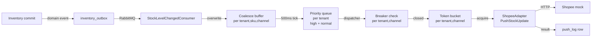

# feat: Phase-2 Sprint-5 — Stock Sync Engine

## Overview

Đóng nửa egress của Phase-2 bằng module mới `ShopFlow.StockSync`: consume stock-change từ Inventory → coalesce per `(tenant, sku, channel)` → priority queue (per-SKU `is_flash_sale` flag) → token bucket per `(tenant, channel)` → Polly v8 circuit breaker → round-trip thật qua Shopee mock (đã có sẵn từ Sprint-4 U7). Mirror-all allocation: cùng `available_to_sell` lên mọi channel; oversell-guard nằm ở reservation ledger Sprint-1-redux. Scale-gate noisy-neighbor (5 tenants × A burst 2k/s × 5min × B-E p99 < 30s × fairness ≥ 0.85) là headline portfolio measurement.

Cadence theo Sprint-3/4-redux: 10 units, test-first khi unit feature-bearing, Domain → Migration → Application → Infrastructure → Api → Integration → Sign-off. Kết thúc với tag `v0.7.0-sprint-5`. Cut branch mới từ `v0.6.1-sprint-4.5`.

---

## Problem Frame

Sau Sprint-4.5, Channel module đã liền mạch chiều marketplace → ShopFlow (webhook ingress, OrderImportedV1 → Outbound saga). Phần thiếu là **chiều ngược**: khi stock thật đổi trên một tenant (do reserve / release / confirm / put-away), giá trị `available_to_sell` mới phải được đẩy lên các channel marketplace để không bán âm và không tồn ảo.

Đây cũng là chỗ phát sinh noisy-neighbor: một tenant flash-sale có thể bắn 2k delta/giây và làm chết các tenant khác trên cùng marketplace nếu không có isolation primitives. Tech Design v3.0 §9.4 vẽ ra 4 cơ chế cho việc này (coalescing buffer, token bucket, priority queue, circuit breaker); Sprint-5 ship cả 4, scope mỗi cơ chế per-tenant.

Hai cấu trúc hạ tầng đã có sẵn từ sprint trước nên Sprint-5 không build lại:
- **`IChannelAdapter.PushStockUpdateAsync`** — interface + Shopee adapter stub đã có (Sprint-4 U5), Sprint-5 fill body.
- **Shopee mock server** — process Kestrel riêng + chaos endpoint đã có (Sprint-4 U7), Sprint-5 thêm 1 endpoint `POST /api/v2/product/update_stock`.

`StockChangedEvent` domain event của Inventory đã tồn tại từ Phase-0-redux U8 với comment "Catch-all event for the stock-sync engine (Tech Design v3.0 §5)". Hiện chưa được raise + chưa cross-module hoá — Sprint-5 wire điều đó.

---

## Requirements Trace

Origin requirements ([docs/brainstorms/2026-05-16-sprint-5-stock-sync-requirements.md](../brainstorms/2026-05-16-sprint-5-stock-sync-requirements.md)) → U-IDs:

| R-ID | Requirement | Owning U-IDs |
|---|---|---|
| R1 | StockSync consume Inventory stock-change qua MassTransit/RabbitMQ, idempotent dedup theo `event_id`. **Plan refines: 1 canonical `StockLevelChangedV1` (KTD1) thay vì 3 transition events** | U2, U3 |
| R2 | Engine tính `available_to_sell` cho SKU bằng cách đọc snapshot từ Inventory port; không tự duy trì state stock | U2 (Inventory side enumerates + emits with computed value) |
| R3 | Coalescing buffer per `(tenant, sku, channel)`; chỉ giá trị mới nhất giữ; cũ bị overwrite | U3 |
| R4 | Cửa sổ coalescing configurable per tenant qua `StockSyncOptions`; default 500ms | U3, U8 |
| R5 | Mirror-all allocation: mỗi channel nhận đúng `available_to_sell` đã tính ở R2; không chia | U5 |
| R6 | Token bucket per `(tenant, channel)` với sustain + burst configurable; dispatcher rút khi token đủ | U4 |
| R7 | Circuit breaker per `(tenant, channel)` (Polly v8); Open → reject ngay tại engine, không HTTP | U5 |
| R8 | `Category=Load` test noisy-neighbor: A burst 2k/s × 5min; B-E p99 < 30s; fairness ≥ 0.85 | U9 |
| R9 | `Category=Load` test breaker recovery: chaos 5xx → trip → cooldown → recover, không ảnh hưởng tenants khác | U9 |
| R10 | SKU `is_flash_sale=true` vào high-priority queue per tenant; dispatcher rút high trước normal | U4, U7 |
| R11 | Push qua `IChannelAdapter.PushStockUpdate`; Sprint-5 ship Shopee impl + mock endpoint | U6 |
| R12 | Mỗi push (success/fail terminal) ghi audit row vào `stock_sync_push_log` | U5 |
| R13 | Module mới `ShopFlow.StockSync` quartet; DbContext + migration với prefix `stock_sync_*` | U1 |
| R14 | Per-tenant DbContext binding qua K12 pattern (Sprint-3-redux) | U1, U3 |
| R15 | Sign-off + CHANGELOG + README/CLAUDE update + tag `v0.7.0-sprint-5` | U10 |

Acceptance Examples AE1-AE6 carry forward as test scenarios trong U3, U4, U5, U6, U9 (link cụ thể trong từng unit).

---

## Scope Boundaries

### In scope

- Toàn bộ R1-R15 (R1 refined per KTD1 — 1 event mới thay 3).
- Branch `feat/phase-2-sprint-5-stock-sync` cut từ `v0.6.1-sprint-4.5`.
- Sprint-5 sign-off doc + annotated tag `v0.7.0-sprint-5`.

### Deferred to Follow-Up Work

- **`PUT /skus/{sku}/flag` admin API** chỉ là stub endpoint nhận body, persist xuống `stock_sync_sku_flag`. Auth + bulk-update + audit-log layer là Phase-3 admin-API hardening.
- **Restart warm-up behaviour** — coalescing buffer + token bucket + breaker state in-memory, lost on restart. Acceptable cho portfolio; persist sang Redis là Phase-3.
- **Metrics export** — OpenTelemetry counters (`stocksync_coalesce_drops`, `stocksync_bucket_throttled`, `stocksync_breaker_state`) gắn vào engine nhưng Grafana dashboard là Phase-3 polish.

### Out of scope (Sprint-6 / Phase-3)

- **Lazada / TikTok adapters + mock servers** — Sprint-5 chỉ ship Shopee impl. Adapter framework đã có từ Sprint-4 U5 → thêm Lazada là Phase-3.
- **Auto-detect flash-sale từ burst rate, velocity-based allocation, reserve-buffer per channel** — out of scope per brainstorm.
- **Real Shopee production API** (credentials thật) — luôn chỉ mock.
- **E2E chaos test bài bản** (50% 5xx + 500ms latency liên tục) — chaos endpoint có sẵn, harness test deferred.
- **Sprint-6 Analytics module** — read-side projections, dashboards.
- **Phase-3 polish** — Gateway hardening, observability dashboards, portfolio README/demo, deployment docs.
- **Multi-region / DR / backup-restore của StockSync state** — Phase-3+.
- **Webhook receiver auth hardening, IP allowlist** — Phase-2 hardening.

### Outside this product's identity

- Adapter chéo (StockSync gọi sang Outbound để map order line → SKU) — KTD1 loại bỏ qua canonical event mới.

---

## Key Technical Decisions

### KTD1 — Thay R1 literal bằng 1 canonical event mới

**Decision.** Inventory phát thêm 1 contract `StockLevelChangedV1(TenantId, Sku, AvailableToSell, OccurredAt)`. StockSync chỉ subscribe event này. Không subscribe 3 event `StockReservedV1` / `StockReleasedV1` / `StockConfirmedV1` như brainstorm R1 literal.

**Rationale.** Đọc code `src/Shared/ShopFlow.Contracts/Inventory/`:
- `StockReservedV1` có per-line SKU ✓
- `StockReleasedV1` chỉ có `OrderLineIds`, không có SKU ✗
- `StockConfirmedV1` không có per-line gì cả ✗

Giữ literal R1 sẽ buộc StockSync coupling sang Outbound để map line→SKU; race-prone vì order line có thể đã xoá khi StockSync hỏi. Event mới sạch hơn: Inventory enumerates affected SKUs (đã biết qua reservation ledger ports), compute `available_to_sell` tại commit time, emit 1 row per SKU.

`StockChangedEvent` domain event đã có sẵn ở `src/Services/Inventory/ShopFlow.Inventory.Domain/Events/StockChangedEvent.cs` với comment "Catch-all event for the stock-sync engine (Tech Design v3.0 §5) — fired any time the published (Available, Reserved) count for a SKU changes" — đây là intent design v3.0 đã ghi sẵn, KTD1 chỉ wire nó cross-module.

### KTD2 — `is_flash_sale` flag ở StockSync module, không ở Channel `ProductMapping`

**Decision.** Table riêng `stock_sync_sku_flag (sku, is_flash_sale, updated_at)` trong StockSync DbContext, scoped per tenant DB (DB-per-tenant nên natural per-tenant).

**Rationale.** Loose coupling: StockSync sở hữu lifecycle flag, không depend lên Channel module. Nếu sau này thay đổi semantic (e.g., scheduled flash-sale window, multi-tier priority), không cần đụng Channel.

### KTD3 — Built-in .NET 9 primitives, không thêm thư viện

**Decision.**
- Token bucket = `System.Threading.RateLimiting.TokenBucketRateLimiter` (System.Threading.RateLimiting, .NET 9 built-in).
- Per-tenant queue = cặp `System.Threading.Channels.Channel<PushIntent>` bounded (1 high-priority + 1 normal-priority).
- Circuit breaker = Polly v8 `ResiliencePipelineBuilder().AddCircuitBreaker(...)` — tái dùng pipeline pattern Sprint-4 ShopeeAdapter.

**Rationale.** Built-in đủ cho portfolio scope; không thêm dep mới ngoài Polly đã có. `Channel<T>` cho per-tenant queue cô lập backpressure (bounded → push side fail-fast khi queue đầy, không bom RAM).

### KTD4 — Coalescing buffer = ConcurrentDictionary + PeriodicTimer

**Decision.** `ConcurrentDictionary<CoalesceKey, CoalesceEntry>` với `CoalesceKey = (TenantId, Sku, ChannelType)`. `PeriodicTimer` 500ms tick (default; per-tenant override qua `StockSyncOptions`). Mỗi tick: snapshot dictionary, clear, push từng entry vào priority queue tương ứng.

**Rationale.** ConcurrentDictionary lockless; write từ consumer + read-clear từ flush không cần lock thủ công. PeriodicTimer là .NET 6+ idiom, tránh `Task.Delay` loop cũ.

### KTD5 — State persistence: chỉ push_log + sku_flag

**Decision.** Persistent state (DB): `stock_sync_push_log`, `stock_sync_sku_flag`. In-memory state (lost on restart): coalescing dictionary, queue, token bucket counter, breaker state.

**Rationale.** Restart cost = ~500ms warm-up tích lũy delta đầu tiên + 1 cửa sổ token bucket. Trong portfolio MVP chấp nhận được. Phase-3 cân nhắc Redis-back-store cho breaker state (chia sẻ giữa replicas).

### KTD6 — Module mới StockSync = thứ 7 logical module, vẫn modular monolith

**Decision.** Add `src/Services/StockSync/ShopFlow.StockSync.{Domain,Application,Infrastructure,Api}/` quartet. Aspire AppHost thêm `AddProject<Projects.ShopFlow_StockSync_Api>("stocksync-api")`. Vẫn 1 deployable per ADR-0002.

**Rationale.** Brainstorm đã chọn module riêng (vs inside Channel/Inventory) cho lý do clean-arch boundary + W6 split readiness. Tuân theo cadence Sprint-2/3/4: mỗi sprint một module mới = canonical pattern.

---

## High-Level Technical Design

*Sketch dưới là directional guidance để reviewer validate hướng. Implementing agent treat as context, không phải code spec.*

### Engine pipeline

```
Inventory (Sprint-1-redux + Sprint-3-redux paths)
   │ reserve / release / confirm / adjust
   ▼
StockItem aggregate raises StockChangedEvent (domain event, đã có)
   │
   │ Sprint-5 wires: ReservationRepository AppendOutbox<StockLevelChangedV1>(...)
   ▼
inventory_outbox_messages row
   │ MultiplexedOutboxDispatcher (existing) routes via OutboxRouteRegistry
   ▼
RabbitMQ topic
   │
   ▼
StockSync.Application.Consumers.StockLevelChangedConsumer
   │
   ▼  resolve ChannelType list (from ProductMapping read-port or static seed)
   │
   ▼  for each (tenant, sku, channel):
   │      buffer[key] = (available, observedAt)  // overwrite, không append
   │
   ▼  PeriodicTimer 500ms tick
   │      snapshot + clear buffer
   │      for each entry:
   │          isFlash = await skuFlagRepo.IsFlashSaleAsync(sku)
   │          queue[tenantId].high|normal.Write(PushIntent { ... })
   │
   ▼
StockSync.Infrastructure.Dispatch.PerTenantDispatcher (BackgroundService)
   │  for each tenant:
   │      reader = (await high.WaitToReadAsync) ? high : normal
   │      intent = reader.Read()
   │      if (!breaker[tenantId,channel].IsClosed) skip + log
   │      await tokenBucket[tenantId,channel].AcquireAsync(1)
   │      result = await pollyPipeline.ExecuteAsync(ct =>
   │                  adapter.PushStockUpdateAsync(intent, ct))
   │      pushLogRepo.AppendAsync(intent, result)
   │
   ▼
IChannelAdapterFactory.ResolveFor(channel).PushStockUpdateAsync
   │
   ▼
ShopeeAdapter → HttpClient → Shopee mock /api/v2/product/update_stock
```

### Per-tenant isolation key view

```
Per (tenant) state:
  ├── high-priority Channel<PushIntent>  (bounded ~1k)
  ├── normal-priority Channel<PushIntent>  (bounded ~10k)
  └── per (tenant, channel) state:
        ├── TokenBucketRateLimiter (sustain + burst)
        └── Polly CircuitBreaker (closed → open → half-open)

Per (tenant, sku, channel) state:
  └── ConcurrentDictionary entry: (available, observedAt)  // single most-recent
```

Nothing crosses tenant boundary. Tenant A's burst chỉ tiêu thụ tài nguyên (CPU, queue slots) của tenant A.

### Mermaid: data flow



---

## Output Structure

```
src/Services/StockSync/
  ShopFlow.StockSync.Domain/
    Aggregates/
      SkuFlag.cs
      PushLogEntry.cs
    Events/
      StockLevelChangedDomainEvent.cs   (optional bridge)
    ShopFlow.StockSync.Domain.csproj

  ShopFlow.StockSync.Application/
    Coalescing/
      ICoalescingBuffer.cs
      CoalescingBuffer.cs
      CoalesceKey.cs
    Consumers/
      StockLevelChangedConsumer.cs
    Dispatch/
      IPerTenantQueue.cs
      PushIntent.cs
    Ports/
      ISkuFlagRepository.cs
      IPushLogRepository.cs
    Options/
      StockSyncOptions.cs
    ShopFlow.StockSync.Application.csproj

  ShopFlow.StockSync.Infrastructure/
    Persistence/
      StockSyncDbContext.cs
      EntityConfigurations/
        SkuFlagConfiguration.cs
        PushLogEntryConfiguration.cs
      Repositories/
        SkuFlagRepository.cs
        PushLogRepository.cs
    Dispatch/
      PerTenantQueue.cs
      PerTenantDispatcherService.cs   (BackgroundService)
    RateLimit/
      TenantChannelBucketRegistry.cs
    Breaker/
      TenantChannelBreakerRegistry.cs
    Pipeline/
      PushPipelineFactory.cs    (Polly v8)
    Migrations/
      20260516000001_InitialStockSyncSchema.cs
    StockSyncServiceCollectionExtensions.cs
    ShopFlow.StockSync.Infrastructure.csproj

  ShopFlow.StockSync.Api/
    Controllers/
      SkuFlagsController.cs       (PUT /skus/{sku}/flag)
      SyncStateController.cs      (GET /sync/state — diagnostics)
    Program.cs
    appsettings.json
    appsettings.Development.json
    ShopFlow.StockSync.Api.csproj

src/Shared/ShopFlow.Contracts/Inventory/
  StockLevelChangedV1.cs                (KTD1 — new)

tools/mocks/shopee/Endpoints/
  UpdateStockEndpoint.cs                (POST /api/v2/product/update_stock)

tests/
  ShopFlow.StockSync.UnitTests/
    CoalescingBufferTests.cs
    PerTenantQueueTests.cs
    TokenBucketRegistryTests.cs
    BreakerRegistryTests.cs
    PushPipelineTests.cs
    SkuFlagRepositoryTests.cs
    StockLevelChangedConsumerTests.cs
  ShopFlow.StockSync.IntegrationTests/
    Fixtures/
      StockSyncFixture.cs
    StockSyncHappyPathTests.cs           (Category=Integration)
    MultiTenantStockSyncScaleGateTests.cs   (Category=Load — R8, R9)
```

Implementer có thể adjust layout nếu phát sinh lý do; bảng trên là scope declaration, không phải constraint cứng.

---

## Implementation Units

### U1. Module quartet scaffold + DbContext + initial migration

**Goal:** Tạo 4 csproj quartet mirror Sprint-2/3/4 + DbContext + 2 tables migration. Smoke test 6th method trong `MigrationSmokeTests`. Solution slot + Directory.Packages.Props bumps khi cần.

**Requirements:** R13, R14.

**Dependencies:** none.

**Files:**
- `src/Services/StockSync/ShopFlow.StockSync.Domain/ShopFlow.StockSync.Domain.csproj`
- `src/Services/StockSync/ShopFlow.StockSync.Application/ShopFlow.StockSync.Application.csproj`
- `src/Services/StockSync/ShopFlow.StockSync.Infrastructure/ShopFlow.StockSync.Infrastructure.csproj`
- `src/Services/StockSync/ShopFlow.StockSync.Api/ShopFlow.StockSync.Api.csproj`
- `src/Services/StockSync/ShopFlow.StockSync.Infrastructure/Persistence/StockSyncDbContext.cs`
- `src/Services/StockSync/ShopFlow.StockSync.Domain/Aggregates/SkuFlag.cs`
- `src/Services/StockSync/ShopFlow.StockSync.Domain/Aggregates/PushLogEntry.cs`
- `src/Services/StockSync/ShopFlow.StockSync.Infrastructure/Persistence/EntityConfigurations/SkuFlagConfiguration.cs`
- `src/Services/StockSync/ShopFlow.StockSync.Infrastructure/Persistence/EntityConfigurations/PushLogEntryConfiguration.cs`
- `src/Services/StockSync/ShopFlow.StockSync.Infrastructure/Migrations/20260516000001_InitialStockSyncSchema.cs`
- `ShopFlow.sln` (4 slot)
- `tests/ShopFlow.StockSync.UnitTests/ShopFlow.StockSync.UnitTests.csproj`
- `tests/ShopFlow.StockSync.IntegrationTests/ShopFlow.StockSync.IntegrationTests.csproj`
- `tests/ShopFlow.Migrate.UnitTests/MigrationSmokeTests.cs` (add 6th method)

**Approach:**
- Mirror Sprint-2/3/4: Domain → Application → Infrastructure → Api dependency chain. Domain depends `ShopFlow.SharedKernel` only. Application depends Domain + SharedKernel. Infrastructure depends Application + EF Core + RabbitMQ packages. Api depends Infrastructure.
- `StockSyncDbContext` follows Sprint-4 ChannelDbContext shape; per-module table prefix `stock_sync_*` (Sprint-2.5 canon).
- Tables:
  - `stock_sync_sku_flag (sku VARCHAR(64) PK, is_flash_sale BOOLEAN NOT NULL DEFAULT FALSE, updated_at TIMESTAMPTZ NOT NULL)`
  - `stock_sync_push_log (id BIGSERIAL PK, tenant_id UUID, channel_type VARCHAR(32), sku VARCHAR(64), available INT, idempotency_key VARCHAR(128), status VARCHAR(32), error_code VARCHAR(64) NULL, latency_ms INT, observed_at TIMESTAMPTZ, pushed_at TIMESTAMPTZ, UNIQUE(idempotency_key))`
  - `stock_sync_outbox_messages` follow same shape Sprint-2.5 outbox (cross-module future-proof; chưa dùng trong Sprint-5 nhưng đặt sẵn cho W6 split).
- Migration carries `[Migration]` + `[DbContext]` attributes per Phase-0-redux U8 learning (`docs/solutions/2026-05-10-ef-migration-needs-attributes.md`).
- `Identity` columns dùng `IdentityByDefaultColumn` annotation typed enum (Sprint-2-redux U4 carry-forward rule).
- `MigrationSmokeTests` thêm method 6: `StockSyncMigration_AppliesAndLeavesNamedObjects`.

**Patterns to follow:**
- `src/Services/Channel/ShopFlow.Channel.Infrastructure/Persistence/ChannelDbContext.cs`
- `src/Services/Channel/ShopFlow.Channel.Infrastructure/Migrations/20260513000001_InitialChannelSchema.cs`
- `tests/ShopFlow.Migrate.UnitTests/MigrationSmokeTests.cs`

**Test scenarios:**
- Test expectation for `SkuFlag` + `PushLogEntry` aggregates: 6-8 domain unit tests covering construction, idempotent update (`SkuFlag.SetFlashSale(value)` returns same instance when unchanged), `PushLogEntry.MarkSucceeded` / `MarkFailed` state transitions, invalid input (empty SKU, negative latency) rejected.
- `MigrationSmokeTests.StockSyncMigration_AppliesAndLeavesNamedObjects` — apply migration on Testcontainers Postgres; assert `__ef_migrations_history` ≥ 1, named tables exist, named PK + UNIQUE constraints exist (mirrors Phase-0-redux U10 + Sprint-4 U2 pattern).

**Verification:** `dotnet build` 0 warnings 0 errors trên toàn solution với 5 csproj mới (4 module + 2 test). Unit tests cho aggregates pass. Migration smoke test pass khi có Docker; otherwise CI-only.

---

### U2. `StockLevelChangedV1` contract + Inventory side emit (KTD1)

**Goal:** Thêm 1 canonical event mới và wire Inventory phát qua outbox. Khi `StockChangedEvent` domain event raise trong Inventory repository operations, append thêm 1 outbox row `StockLevelChangedV1` cho cross-module dispatch.

**Requirements:** R1 (refined per KTD1), R2.

**Dependencies:** U1 (cần module shape sẵn để consumer link sau ở U3, nhưng U2 chỉ touchout Inventory + Contracts — có thể chạy song song với U1).

**Files:**
- `src/Shared/ShopFlow.Contracts/Inventory/StockLevelChangedV1.cs` (new)
- `src/Services/Inventory/ShopFlow.Inventory.Application/Ports/IInventoryOutbox.cs` (extend nếu cần — kiểm tra Sprint-2-redux pattern)
- `src/Services/Inventory/ShopFlow.Inventory.Infrastructure/Repositories/ReservationRepository.cs` (sửa: append outbox sau khi raise StockChangedEvent ở các path TryReserve / Release / Confirm)
- `src/Services/Inventory/ShopFlow.Inventory.Infrastructure/Repositories/StockItemRepository.cs` (sửa: append outbox sau adjust path từ Sprint-2-redux U5)
- `tests/ShopFlow.Inventory.UnitTests/Repositories/ReservationRepositoryStockLevelEmitTests.cs` (new)
- `tests/ShopFlow.Inventory.IntegrationTests/StockLevelEmitFlowTests.cs` (new)

**Approach:**
- Contract shape:
  ```csharp
  // Pseudocode — directional only
  public sealed record StockLevelChangedV1(
      Guid TenantId,
      string Sku,
      int AvailableToSell,
      DateTime OccurredAt
  );
  ```
- Inventory side enumerates affected SKUs sau mỗi state-mutating operation:
  - `TryReserveAsync` / `TryReserveLinesAsync` (Sprint-1-redux + Sprint-3-redux): SKUs trong request → 1 event per SKU sau commit.
  - `ConfirmAsync`: SKUs tương ứng `OrderId` → 1 event per SKU.
  - `ReleaseAsync` / `ReleaseExpiredAsync` / `ReleaseLinesAsync`: read `reservations_ledger` to find affected SKUs trong batch → 1 event per SKU.
  - `StockItemRepository.AdjustAtBinAsync` (Sprint-2-redux U5): SKU đang adjust → 1 event.
- `AvailableToSell` được compute tại commit time bằng read-back từ aggregate trạng thái mới: `stock_item.OnHand - active_reservations_sum`. Đây là cùng read-back surface gap brainstorm Sprint-1-redux notes (Property 5 read-back) — Sprint-5 mở `GetAvailableToSellAsync(sku)` trên `IReservationRepository` (hoặc port riêng `IStockSnapshotReader`) để dùng chỗ này; Sprint-1-redux Property 5 sau có thể swap raw-SQL sang port call (out-of-scope nhưng note).
- Append outbox dùng JSON `OutboxJsonOptions.Default` (Sprint-2.5 SharedKernel canon).

**Patterns to follow:**
- `src/Services/Inventory/ShopFlow.Inventory.Infrastructure/Repositories/ReservationRepository.cs` `AppendOutbox` calls (Sprint-1-redux U1).
- `src/Shared/ShopFlow.SharedKernel.Infrastructure/OutboxJsonOptions.cs` (Sprint-2.5 U3).

**Test scenarios:**
- **Reserve emits StockLevelChanged**. Given stock_item Sku=X OnHand=100, active reservations 0. When `TryReserveAsync(order=A, sku=X, qty=5)`. Then outbox table has 1 `StockLevelChangedV1` row with `Sku=X, AvailableToSell=95`.
- **Multi-SKU reserve**. `TryReserveLinesAsync` cho 3 SKU → 3 outbox rows.
- **Release reads affected SKUs**. Given 2 active reservations cùng OrderId, 2 SKUs khác nhau. When `ReleaseAsync(orderId)`. Then 2 outbox rows.
- **Idempotent release** (everything already released): 0 outbox rows.
- **Confirm emits at commit**: `ConfirmAsync` after `TryReserve` → 1 row per SKU đã confirm.
- **Adjust emits**: `StockItemRepository.AdjustAtBinAsync` delta=+10 → 1 outbox row với new `AvailableToSell`.
- **Concurrent reserves on cùng SKU** (extension Sprint-1-redux concurrency test): N callers race; outbox có N rows hoặc N-1 (1 fail-oversold không emit). Tests run trên Testcontainers Postgres để bắt CTE race như Sprint-3-redux K11.
- **JSON serialization round-trip**: dùng `OutboxJsonOptions.Default`, deserialize lại từ outbox row → equals nguyên gốc.

**Execution note:** Test-first cho repository changes — write failing emit test, then add the AppendOutbox call. Race-prone area (Sprint-3-redux K11 learning).

**Verification:** All existing Inventory tests (Sprint-1-redux + Sprint-3-redux suite) tiếp tục pass. Mới: 7+ unit tests + 1 integration round-trip emits đúng số row. Existing concurrent-oversell test mở rộng assertion để check outbox cũng có N-1 rows.

---

### U3. Coalescing buffer + StockLevelChangedConsumer

**Goal:** StockSync.Application service consume event và ghi vào in-memory buffer; `PeriodicTimer` 500ms flush thành push intents.

**Requirements:** R1, R3, R4.

**Dependencies:** U1 (module shape), U2 (contract).

**Files:**
- `src/Services/StockSync/ShopFlow.StockSync.Application/Coalescing/CoalesceKey.cs` (new)
- `src/Services/StockSync/ShopFlow.StockSync.Application/Coalescing/CoalesceEntry.cs` (new)
- `src/Services/StockSync/ShopFlow.StockSync.Application/Coalescing/ICoalescingBuffer.cs` (new)
- `src/Services/StockSync/ShopFlow.StockSync.Application/Coalescing/CoalescingBuffer.cs` (new)
- `src/Services/StockSync/ShopFlow.StockSync.Application/Consumers/StockLevelChangedConsumer.cs` (new)
- `src/Services/StockSync/ShopFlow.StockSync.Application/Options/StockSyncOptions.cs` (new — đặt giờ vì cần `CoalesceWindowMs`)
- `src/Services/StockSync/ShopFlow.StockSync.Infrastructure/Background/CoalesceFlushService.cs` (BackgroundService — new)
- `tests/ShopFlow.StockSync.UnitTests/CoalescingBufferTests.cs` (new)
- `tests/ShopFlow.StockSync.UnitTests/Consumers/StockLevelChangedConsumerTests.cs` (new)

**Approach:**
- `CoalesceKey` = `record struct (Guid TenantId, string Sku, string ChannelType)` — value-equality cho dictionary key.
- `CoalesceEntry` = `record (int AvailableToSell, DateTime ObservedAt, bool IsFlashSale)`.
- `CoalescingBuffer` wraps `ConcurrentDictionary<CoalesceKey, CoalesceEntry>` + `Upsert(key, entry)` (overwrite if newer `ObservedAt`) + `SnapshotAndClear()` returns batched list.
- Consumer:
  ```
  // Pseudocode
  OnMessage(StockLevelChangedV1 msg):
    foreach channel in await channelLookup.ResolveActiveChannelsForTenant(msg.TenantId):
      isFlash = await skuFlagRepo.IsFlashSaleAsync(msg.Sku, ct)
      buffer.Upsert(
        (msg.TenantId, msg.Sku, channel),
        (msg.AvailableToSell, msg.OccurredAt, isFlash))
  ```
- `channelLookup` ports vào `IChannelLookupPort` — Sprint-5 implementation: static `Channel:Active` config list (mặc định `["shopee"]`); future Phase-3 reads từ Channel module's `channels` table.
- `CoalesceFlushService.ExecuteAsync` uses `PeriodicTimer(TimeSpan.FromMilliseconds(options.CoalesceWindowMs))`. Mỗi tick: `var batch = buffer.SnapshotAndClear(); foreach b in batch: await queue.EnqueueAsync(b);` (queue U4).
- `StockSyncOptions`:
  ```csharp
  // Pseudocode
  public sealed class StockSyncOptions
  {
      public const string SectionName = "StockSync";
      public int CoalesceWindowMs { get; init; } = 500;
      public TenantOverride[] PerTenant { get; init; } = [];
      // ... TokenBucket + Breaker fields land in U4/U5
  }
  ```

**Patterns to follow:**
- Sprint-3-redux `IPickQueue` per-tenant bounded `Channel<T>` (rough analogy cho U4, U3 chỉ buffer).
- Sprint-3-redux `OrderImportedConsumer` cho MassTransit consumer shape (Sprint-4 U8).
- Per-tenant DbContext binding (K12) cho consumer scope: `TenantBindingSagaFilter` pattern.

**Test scenarios:**
- **Buffer overwrite** (covers AE1, R3). Given window 500ms. Upsert 10 entries cùng `(T1, SKU-X, Shopee)` với `AvailableToSell` 10, 9, 8, 7, 6, 5, 4, 3, 2, **1** (mỗi entry `ObservedAt` tăng dần). Snapshot → 1 entry với `AvailableToSell=1`.
- **Buffer out-of-order**: 2 entries cùng key, entry sau có `ObservedAt` SỚM HƠN entry trước → giữ entry trước (last-by-observed-time win, không phải last-by-write).
- **Buffer multi-key**: 3 entries `(T1, X, shopee)` + 2 entries `(T1, Y, shopee)` + 1 entry `(T2, X, shopee)` → snapshot có 3 entries (one per key).
- **Buffer concurrent write**: 1000 concurrent `Upsert` calls đan xen từ 10 task → no exception, dictionary count ≤ unique keys.
- **PeriodicTimer flush** (covers AE1, R4). Given `CoalesceWindowMs=500`. Upsert 5 entries trong 200ms; verify 0 flushes. Wait additional 400ms; verify 1 flush với 5 entries.
- **Tenant override window**: Given config `PerTenant=[{TenantId=T2, CoalesceWindowMs=100}]`. Verify T2 keys flush sau 100ms; T1 keys sau 500ms.
- **Consumer per-channel fanout**: Given tenant T1 active channels `["shopee", "lazada"]`. When consume 1 `StockLevelChangedV1(T1, SKU-X, 7)`. Then buffer has 2 entries (one per channel) all `AvailableToSell=7` (covers AE2, R5 mirror-all).
- **Consumer reads is_flash_sale flag**: Mock `ISkuFlagRepository.IsFlashSaleAsync(X) returns true`. Verify `CoalesceEntry.IsFlashSale=true` ghi vào buffer.
- **Consumer idempotent dedup** (MassTransit at-least-once): same `message_id` redelivered 2x → buffer state == single write (NSubstitute mock + MT TestHarness).

**Execution note:** Test-first cho `CoalescingBuffer` — write failing concurrent-overwrite test, then implement. Race area.

**Verification:** All 15+ unit tests pass. `PeriodicTimer` flush behavior verified via test với short window (50ms) để tránh slow tests.

---

### U4. Per-tenant priority queue + token bucket registry

**Goal:** Bounded `Channel<PushIntent>` cặp (high + normal) per tenant; `TokenBucketRateLimiter` per `(tenant, channel)`. Dispatcher worker rút theo priority + rate-limit.

**Requirements:** R6, R10.

**Dependencies:** U3 (queue receives từ flush service).

**Files:**
- `src/Services/StockSync/ShopFlow.StockSync.Application/Dispatch/PushIntent.cs` (new)
- `src/Services/StockSync/ShopFlow.StockSync.Application/Dispatch/IPerTenantQueue.cs` (new)
- `src/Services/StockSync/ShopFlow.StockSync.Infrastructure/Dispatch/PerTenantQueue.cs` (new)
- `src/Services/StockSync/ShopFlow.StockSync.Infrastructure/RateLimit/TenantChannelBucketRegistry.cs` (new)
- `src/Services/StockSync/ShopFlow.StockSync.Application/Options/StockSyncOptions.cs` (extend với `TokenBucket` settings)
- `tests/ShopFlow.StockSync.UnitTests/PerTenantQueueTests.cs` (new)
- `tests/ShopFlow.StockSync.UnitTests/TokenBucketRegistryTests.cs` (new)

**Approach:**
- `PushIntent` = `record (Guid TenantId, string Sku, string ChannelType, int Available, DateTime ObservedAt, bool IsFlashSale, string IdempotencyKey)`. `IdempotencyKey` = `$"{TenantId}:{Sku}:{ChannelType}:{ObservedAt:O}"` (deterministic; replay-safe ở Shopee mock side).
- `PerTenantQueue` keeps `ConcurrentDictionary<Guid, TenantQueuePair>` lazily-allocated khi tenant đầu tiên xuất hiện.
- `TenantQueuePair` = `(Channel<PushIntent> High, Channel<PushIntent> Normal)` bounded `{ Capacity = options.HighCap or NormalCap, FullMode = DropOldest }`. `DropOldest` mode: nếu queue đầy, drop oldest → trade-off chấp nhận được vì coalescing đã giảm lượng intents; observability counter `stocksync_queue_drops_total{priority}` tăng.
- `EnqueueAsync(PushIntent)` route: `intent.IsFlashSale ? pair.High.Writer.WriteAsync(...) : pair.Normal.Writer.WriteAsync(...)`.
- `TenantChannelBucketRegistry` keeps `ConcurrentDictionary<(Guid TenantId, string Channel), TokenBucketRateLimiter>`. Factory dùng `TokenBucketRateLimiterOptions { TokenLimit = 50, TokensPerPeriod = 10, ReplenishmentPeriod = TimeSpan.FromSeconds(1), AutoReplenishment = true, QueueLimit = 100 }` (defaults; configurable per-tenant qua `StockSyncOptions.PerTenant[].TokenBucket`).
- `StockSyncOptions` extension:
  ```csharp
  // Pseudocode
  public TokenBucketSettings TokenBucket { get; init; } = new();
  public sealed class TokenBucketSettings
  {
      public int Sustain { get; init; } = 10;      // tokens per second
      public int Burst { get; init; } = 50;        // bucket capacity
      public int QueueLimit { get; init; } = 100;  // pending acquires
  }
  ```

**Patterns to follow:**
- Sprint-3-redux `IPickQueue` per-tenant `Channel<PickRequestV1>` bounded — same shape, just 2 queues per tenant.
- `System.Threading.RateLimiting.TokenBucketRateLimiter` — Microsoft docs (xem `references/external-research-notes.md` of plan ce-doc khi cần).

**Test scenarios:**
- **High-priority drains first** (covers AE5, R10). Given queue có 100 normal entries pre-enqueued, then 1 high entry. Dispatcher (test double `IDispatcher`) reads next 1 → entry trả về là high entry, NOT entry normal đầu tiên.
- **Both empty → block**: Reader blocks `await ReadAsync` until at least one queue non-empty.
- **High preferred even with normal arriving later**: write normal, write high, write normal. Reader returns high then 2 normal in arrival order.
- **DropOldest behavior**: Capacity=3, write 5 normal entries. Verify reader gets entries 3,4,5 (entries 1,2 dropped).
- **Per-tenant isolation**: T1 normal cap full → drops chỉ ở T1; T2 normal unaffected.
- **Token bucket sustain rate** (covers AE3, R6). Given sustain=10, burst=50. Acquire 60 tokens trong loop: 50 tokens cấp immediate, tokens 51-60 mỗi 100ms 1 token. Total wall-time cho 60 acquires ≈ 1000ms.
- **Token bucket burst absorbs**: 50 concurrent acquires → all complete < 50ms.
- **Token bucket independent per (tenant, channel)**: T1 ngốn hết burst của (T1, shopee); T2 (T2, shopee) acquire vẫn instant.
- **QueueLimit overflow**: Pending 101st acquire trên cùng bucket → throws `RateLimitLeaseRejected`; counter `stocksync_bucket_rejections_total` increments.

**Verification:** 12+ unit tests pass. Wall-time test (sustain rate) chấp nhận ±20% jitter để tránh flaky.

---

### U5. Polly v8 circuit breaker + push pipeline factory + dispatcher service

**Goal:** Breaker per `(tenant, channel)` (Open/HalfOpen/Closed); pipeline wraps adapter call + breaker + push-log append; `PerTenantDispatcherService` BackgroundService runs the consume-from-queue → bucket → pipeline → log loop.

**Requirements:** R5 (mirror-all happens because each (T,sku,channel) flush enqueues unchanged value), R7, R12.

**Dependencies:** U4, U1 (push_log persistence).

**Files:**
- `src/Services/StockSync/ShopFlow.StockSync.Infrastructure/Breaker/TenantChannelBreakerRegistry.cs` (new)
- `src/Services/StockSync/ShopFlow.StockSync.Infrastructure/Pipeline/PushPipelineFactory.cs` (new)
- `src/Services/StockSync/ShopFlow.StockSync.Infrastructure/Dispatch/PerTenantDispatcherService.cs` (BackgroundService, new)
- `src/Services/StockSync/ShopFlow.StockSync.Application/Ports/IPushLogRepository.cs` (new)
- `src/Services/StockSync/ShopFlow.StockSync.Infrastructure/Persistence/Repositories/PushLogRepository.cs` (new)
- `src/Services/StockSync/ShopFlow.StockSync.Application/Options/StockSyncOptions.cs` (extend với `Breaker` settings)
- `tests/ShopFlow.StockSync.UnitTests/BreakerRegistryTests.cs` (new)
- `tests/ShopFlow.StockSync.UnitTests/PushPipelineTests.cs` (new)
- `tests/ShopFlow.StockSync.IntegrationTests/PushLogPersistenceTests.cs` (new, Category=Integration)

**Approach:**
- `TenantChannelBreakerRegistry` keeps `ConcurrentDictionary<(Guid, string), ResiliencePipeline>` lazily allocated. Each pipeline = `new ResiliencePipelineBuilder().AddCircuitBreaker(new CircuitBreakerStrategyOptions { FailureRatio = 1.0, MinimumThroughput = 5, BreakDuration = TimeSpan.FromSeconds(60), SamplingDuration = TimeSpan.FromSeconds(30) }).Build()`.
- `PushPipelineFactory` composes: `breaker(adapter call → throw on adapter failure)` followed by terminal log-append (success or fail). Pipeline returns `Result` (SharedKernel). Polly's `OnCircuitOpened` callback increments metric counter; future Phase-3 hooks observability.
- `PerTenantDispatcherService`:
  ```
  // Pseudocode — directional
  ExecuteAsync(ct):
    foreach tenant in await tenantCatalog.GetActiveTenantsAsync(ct):
      _ = Task.Run(() => DispatchLoopAsync(tenant.TenantId, ct))

  DispatchLoopAsync(tenantId, ct):
    var pair = perTenantQueue.GetOrCreate(tenantId)
    while (!ct.IsCancellationRequested):
      var intent = await ReadNextPriorityAsync(pair, ct)
      var bucket = bucketRegistry.GetOrCreate(intent.TenantId, intent.ChannelType)
      using var lease = await bucket.AcquireAsync(1, ct)
      if (!lease.IsAcquired) { logCounter.Increment(); continue; }
      var pipeline = breakerRegistry.GetOrCreate(intent.TenantId, intent.ChannelType)
      var pushResult = await pipeline.ExecuteAsync(async tk =>
        await adapterFactory.ResolveFor(intent.ChannelType).PushStockUpdateAsync(MapToRequest(intent), tk), ct)
      await pushLogRepo.AppendAsync(MapToLogEntry(intent, pushResult, latency), ct)
  ```
- `MapToRequest(intent)` = `new StockUpdateRequest(channelId: resolved, ExternalSku: mapped, Quantity: intent.Available, ObservedAt: intent.ObservedAt, IdempotencyKey: intent.IdempotencyKey)`. ChannelId + ExternalSku lookup qua existing `IProductMappingService` port của Channel module (read-side; Sprint-5 thêm 1 readonly port `IChannelLookupPort` trong StockSync.Application để decouple).
- `PushLogRepository` upserts on `idempotency_key` UNIQUE; 23505 caught → returns existing row (idempotent push log against MT retries).

**Patterns to follow:**
- Sprint-3-redux `MockShippingProvider` Polly v8 retry pipeline (`src/Services/Outbound/.../MockShippingProvider.cs`).
- Sprint-4 `ShopeeAdapter` ctor Polly pipeline inject.
- Sprint-1-redux `ReservationRepository` UNIQUE-23505 catch pattern.

**Test scenarios:**
- **Breaker closed → adapter called**. Given breaker Closed. Pipeline.ExecuteAsync wraps mock adapter (returns Success). Verify mock called 1x; pipeline returns Success.
- **Breaker opens after threshold** (covers AE4, R7). Given threshold=5 failures in 30s. Run 5 failing calls back-to-back → breaker transitions Closed→Open. Call 6: pipeline returns `BrokenCircuitException` without invoking adapter; counter increments.
- **Breaker half-open probe**: After `BreakDuration=60s` (test uses `FakeTimeProvider` or short break for test), 1 call goes through. Success → Closed. Failure → Open again.
- **Breaker isolation per (tenant, channel)**: `(T1, shopee)` Open does NOT affect `(T2, shopee)` or `(T1, lazada)`.
- **Push log idempotent on retry** (covers R12). Same `IdempotencyKey` appended 2x → second append no-op; 1 row in DB. Catch 23505.
- **Push log records latency**: assert `latency_ms ≈ measured_elapsed` ±5ms tolerance.
- **Failed push status**: failure result → `status='Failed'`, `error_code='shopee.push.5xx'` or stable string.
- **Dispatcher mirror-all** (covers AE2, R5). Given Inventory emits `StockLevelChangedV1(T1, SKU-X, 7)`. Tenant T1's active channels = `["shopee", "lazada"]` (lazada is stub adapter returning `sprint-6-deferred`). After flush → 2 push intents enqueued; pipeline invoked 2x; shopee success, lazada returns deferred-stub result; both logged.
- **Bucket rejection logged**: 100 concurrent intents on bucket queue-limit=10 → ~90 rejected, counter increments; rejected intents NOT pushed to adapter.

**Execution note:** Test-first cho breaker state machine — write failing "5 failures → 6th rejected" test, then add `AddCircuitBreaker`. Use Polly's `FakeTimeProvider` (Microsoft.Extensions.TimeProvider.Testing) hoặc Polly's test infrastructure.

**Verification:** 15+ unit tests pass. Integration test on Testcontainers Postgres verifies push_log persists + idempotency catches 23505 (1 row remains).

---

### U6. `ShopeeAdapter.PushStockUpdateAsync` body + Shopee mock endpoint

**Goal:** Replace Sprint-4 stub `sprint-5-deferred` failure với real HTTP POST. Mock server thêm endpoint `POST /api/v2/product/update_stock` mirror Shopee Open Platform v2 shape.

**Requirements:** R11.

**Dependencies:** U5 (pipeline calls adapter), U1 (push_log assumes adapter Result shape).

**Files:**
- `src/Services/Channel/ShopFlow.Channel.Infrastructure/Adapters/ShopeeAdapter.cs` (modify — fill `PushStockUpdateAsync` body)
- `src/Services/Channel/ShopFlow.Channel.Infrastructure/Adapters/Shopee/ShopeeStockUpdatePayload.cs` (new — wire-shape mapper)
- `tools/mocks/shopee/Endpoints/UpdateStockEndpoint.cs` (new)
- `tools/mocks/shopee/Endpoints/ChaosState.cs` (modify — add `IsStockUpdateChaosActive` flag)
- `tools/mocks/shopee/Program.cs` (modify — register endpoint)
- `tests/ShopFlow.Channel.UnitTests/Adapters/ShopeeAdapterPushStockUpdateTests.cs` (new — replace existing stub test)
- `tests/ShopFlow.Channel.IntegrationTests/ShopeeMockRoundTripTests.cs` (new, Category=Integration)

**Approach:**
- Shopee Open Platform v2 stock update body shape (per real Shopee docs; Sprint-4 fixture đã đặt tham chiếu):
  ```json
  {
    "item_id": <int>,
    "stock_list": [
      { "model_id": <int>, "normal_stock": <int> }
    ]
  }
  ```
  Mapper từ `StockUpdateRequest`: `item_id` từ `ExternalSku` parse (Shopee item_id là numeric); single model_list element với `model_id=0` (no-variant case for portfolio scope). Phase-3 thêm SKU→item/model lookup table.
- Adapter:
  ```csharp
  // Pseudocode
  public async Task<Result> PushStockUpdateAsync(StockUpdateRequest req, CancellationToken ct)
  {
      var payload = ShopeeStockUpdatePayload.From(req);
      var http = new HttpRequestMessage(HttpMethod.Post, "/api/v2/product/update_stock");
      http.Headers.Add("X-ShopFlow-Idempotency-Key", req.IdempotencyKey);
      http.Content = JsonContent.Create(payload, options: ShopeeJson.Options);
      var response = await _retryPipeline.ExecuteAsync(
          async tk => await _httpClient.SendAsync(http, tk), ct);
      if (response.IsSuccessStatusCode) return Result.Success();
      var code = response.StatusCode switch {
          HttpStatusCode.TooManyRequests => "shopee.push.rate_limited",
          >= HttpStatusCode.InternalServerError => "shopee.push.5xx",
          _ => "shopee.push.4xx"
      };
      return Result.Failure(code, await response.Content.ReadAsStringAsync(ct));
  }
  ```
- Mock endpoint:
  - Reads `X-ShopFlow-Idempotency-Key` header → maintains in-memory dict for replay detection (return same response).
  - Reads `ChaosState.IsStockUpdateChaosActive` — if true, return 503 với `{ error: "internal_error" }`. Existing `__chaos` POST endpoint extended với flag set.
  - On success: return 200 với `{ message: "stock_updated" }`. Echo `item_id` + `model_id` cho tracing.
- HTTP retry pipeline (Polly v8 đã injected ở Sprint-4) handles transient retries trước khi return lên StockSync's breaker. Two-layer resilience: HTTP-level retry (Polly inside adapter) + business-level breaker (Polly outside adapter trong StockSync).

**Patterns to follow:**
- Sprint-4 `ShopeeWebhookParser` cho JSON shape parsing (`tools/fixtures/channels/shopee/webhook-order-created.json` đã có).
- Sprint-3-redux `MockShippingProvider` adapter Polly retry (transient retries).
- `tools/mocks/shopee/Endpoints/SendWebhookRequest.cs` cho endpoint scaffold + chaos integration.

**Test scenarios:**
- **Happy push**. Given mock returns 200. Adapter returns Success.
- **5xx response → fail with stable code**: mock returns 503. Adapter returns Failure code `shopee.push.5xx`.
- **429 → rate_limited code**: mock returns 429. Failure code `shopee.push.rate_limited`.
- **Idempotency header round-trip**: 2 sends same `IdempotencyKey` → mock returns same response body (replay detection). Verify mock invoked 2x but only 1 inventory-side state change recorded.
- **Payload shape match**: Snapshot test against captured Shopee fixture; assert JSON body sent ≡ expected shape.
- **HTTP retry inside adapter**: mock returns 500 then 200. Polly retry 1x → adapter returns Success.
- **HTTP retry exhausted**: mock returns 500 × 4. Adapter returns Failure (pipeline exhausted).
- **Integration: Sprint-4 webhook ingress → Sprint-5 stock push round-trip end-to-end** (Category=Integration, single tenant, Testcontainers). Wire: webhook → outbox → saga → reserve → StockLevelChangedV1 → coalesce → flush → push → mock receives. Assert mock received the push.
- **Mock chaos endpoint sets stock-update chaos**: POST `/__chaos {is_stock_update_chaos: true}` → next stock-update POST returns 503.

**Verification:** 9+ unit tests pass cho adapter. Integration test E2E round-trip pass khi Docker available (CI). Sprint-4's ChannelAdapter unit tests (32) tiếp tục pass.

---

### U7. `is_flash_sale` flag — repository + admin endpoint stub

**Goal:** Persist + read flag for SKU; admin can toggle qua POST/PUT.

**Requirements:** R10.

**Dependencies:** U1 (table + aggregate).

**Files:**
- `src/Services/StockSync/ShopFlow.StockSync.Application/Ports/ISkuFlagRepository.cs` (new)
- `src/Services/StockSync/ShopFlow.StockSync.Infrastructure/Persistence/Repositories/SkuFlagRepository.cs` (new)
- `src/Services/StockSync/ShopFlow.StockSync.Api/Controllers/SkuFlagsController.cs` (new)
- `tests/ShopFlow.StockSync.UnitTests/SkuFlagRepositoryTests.cs` (new, contract-level NSubstitute)
- `tests/ShopFlow.StockSync.IntegrationTests/SkuFlagRepositoryIntegrationTests.cs` (new, Category=Integration)
- `tests/ShopFlow.StockSync.IntegrationTests/SkuFlagsControllerTests.cs` (new, Category=Integration via WebApplicationFactory)

**Approach:**
- `ISkuFlagRepository.IsFlashSaleAsync(sku, ct)` returns bool — hot path; in-memory cache (5min LRU 10k entries) wrapped around DB read.
- `SetFlashSaleAsync(sku, value, ct)` upsert (UNIQUE on `sku` PK → 23505 catch → update).
- Controller `PUT /api/skus/{sku}/flag` body `{ "is_flash_sale": true|false }` → call repo. Return 204 NoContent. No auth (Sprint-5 stub; Phase-3 admin-API hardening).
- Cache invalidation: `SetFlashSaleAsync` evicts cache entry; cache write-through on read miss.
- Tenant routing: controller relies on existing `TenantRoutingMiddleware` (Phase-0-redux U4) for per-tenant DbContext binding.

**Patterns to follow:**
- Sprint-4 `ProductMappingRepository` UNIQUE-23505 manual upsert.
- Sprint-4 `ProductMappingsController` thin endpoint shape.

**Test scenarios:**
- **Set then read**: SetFlashSale(X, true) → IsFlashSale(X) returns true. Returns false for unknown SKU.
- **Toggle off**: SetFlashSale(X, true) then SetFlashSale(X, false) → IsFlashSale returns false.
- **Idempotent set**: Set same value 2x → 1 row, `updated_at` reflects last set.
- **Cache returns same result without DB hit**: mock DB read counter; 2nd call within TTL doesn't increment.
- **Cache evicted on Set**: Read(X) populates cache. Set(X, true) evicts. Next Read(X) hits DB.
- **Cache TTL expires after 5min** (use `FakeTimeProvider`).
- **Controller PUT 204 + repo called**: WebApplicationFactory test against in-memory tenant context.
- **Controller PUT invalid body 400**: empty body / wrong type → 400 stable.
- **Tenant isolation**: T1 set flag X=true; T2 read X → false (separate DBs).

**Verification:** 12+ tests pass.

---

### U8. StockSync.Api composition + Aspire register + diagnostics endpoint

**Goal:** `Program.cs` wires DI per `AddShopFlowDefaults → AddControlPlane → AddStockSyncModule → UseTenantRouting`. Aspire AppHost adds the project. Diagnostics endpoint reads in-memory state.

**Requirements:** R4 (StockSyncOptions wired through config), R14 (per-tenant DbContext binding wired).

**Dependencies:** U3, U4, U5, U7.

**Files:**
- `src/Services/StockSync/ShopFlow.StockSync.Infrastructure/StockSyncServiceCollectionExtensions.cs` (new — `AddStockSyncModule`)
- `src/Services/StockSync/ShopFlow.StockSync.Api/Program.cs` (new — full composition)
- `src/Services/StockSync/ShopFlow.StockSync.Api/appsettings.json` (new)
- `src/Services/StockSync/ShopFlow.StockSync.Api/appsettings.Development.json` (new)
- `src/Services/StockSync/ShopFlow.StockSync.Api/Controllers/SyncStateController.cs` (new — `GET /api/sync/state`)
- `src/AppHost/ShopFlow.AppHost/Program.cs` (modify — add `AddProject<Projects.ShopFlow_StockSync_Api>`)
- `src/ApiGateway/ShopFlow.Gateway/appsettings.json` (modify — add `stocksync` route)
- `tests/ShopFlow.StockSync.IntegrationTests/Fixtures/StockSyncFixture.cs` (new)

**Approach:**
- `AddStockSyncModule(this IServiceCollection, IConfiguration)`:
  - Bind `StockSyncOptions` from `"StockSync"` section.
  - Register DbContext scoped với per-tenant connection string via K12 pattern.
  - Register `ICoalescingBuffer` as Singleton (in-memory, shared across requests).
  - Register `IPerTenantQueue` as Singleton.
  - Register `TenantChannelBucketRegistry` + `TenantChannelBreakerRegistry` as Singleton.
  - Register `CoalesceFlushService` + `PerTenantDispatcherService` as HostedService.
  - Register `ISkuFlagRepository` scoped.
  - Register MassTransit consumer `StockLevelChangedConsumer` + `services.AddOutboxRoute<StockLevelChangedV1>(SendKind.Publish)` (Sprint-4 U4 pattern).
- `Program.cs` mirror Sprint-4 Channel.Api: `AddShopFlowDefaults(builder.Configuration)` → `AddControlPlane(...)` → `AddStockSyncModule(...)` → `app.UseTenantRouting()` → `app.MapControllers()`.
- `SyncStateController.GET /api/sync/state` returns JSON: buffer entry count, queue depths (high/normal) per tenant (sample top 10), bucket state (tokens remaining) per (T, channel), breaker state (Closed/Open/HalfOpen) per (T, channel). Auth: dev-only, behind a debug flag `StockSync:DiagnosticsEnabled=true`.
- Aspire AppHost references `Projects.ShopFlow_StockSync_Api` (project SDK auto-generates this when csproj reference added to AppHost).
- Gateway YARP appsettings adds a route:
  ```json
  // Pseudocode
  "stocksync-route": { "ClusterId": "stocksync-cluster", "Match": { "Path": "/api/sync/{**catch-all}" } }
  "stocksync-cluster": { "Destinations": { "d1": { "Address": "http://stocksync-api:8080" } } }
  ```

**Patterns to follow:**
- `src/Services/Channel/ShopFlow.Channel.Api/Program.cs` (Sprint-4 U9).
- `src/AppHost/ShopFlow.AppHost/Program.cs` Aspire project registration patterns (Phase-0-redux U7).
- `src/ApiGateway/ShopFlow.Gateway/appsettings.json` route shape (Phase-0-redux U9).

**Test scenarios:**
- **Compose verification**: `WebApplicationFactory<Program>` boots; `GET /api/sync/state?StockSync:DiagnosticsEnabled=true` returns 200 với JSON containing keys.
- **Diagnostics disabled by default**: `GET /api/sync/state` returns 404.
- **Tenant routing on diagnostics**: T1 + T2 calls return different state (separate buffer-state observers).
- **Aspire wires resource**: `task up` (when Docker available) shows stocksync-api in Aspire dashboard; logs print "StockSync ready". Run as CI-only verification.
- **Gateway routes**: GET `/api/sync/state` through gateway URL → 200. CI/Aspire-only.
- **Smoke: StockSyncOptions binds**: integration test reads options, assert defaults `CoalesceWindowMs=500`, `TokenBucket.Sustain=10`.

**Verification:** Integration tests pass. Aspire smoke deferred to CI (Docker absent on dev machine, same precedent Sprint-1-redux..4.5).

---

### U9. Integration happy-path + 2 Category=Load scale-gate tests

**Goal:** End-to-end integration test (1 tenant, happy round-trip). Two Load tests: noisy-neighbor (R8) + breaker recovery (R9). Pass scale-gate thresholds.

**Requirements:** R8, R9.

**Dependencies:** U8 (full Api composition needed).

**Files:**
- `tests/ShopFlow.StockSync.IntegrationTests/StockSyncHappyPathTests.cs` (new, Category=Integration)
- `tests/ShopFlow.StockSync.IntegrationTests/MultiTenantStockSyncScaleGateTests.cs` (new, Category=Load)
- `tests/ShopFlow.StockSync.IntegrationTests/Fixtures/StockSyncFixture.cs` (extend từ U8)
- `tests/Common/FairnessCalculator.cs` (reuse từ Sprint-1-redux + Sprint-4.5 — verify shared location)
- `tests/Common/TenantBurstDriver.cs` (new — gen events at controllable rate per tenant)

**Approach:**
- Happy-path test:
  - Boot `WebApplicationFactory<Program>` with Testcontainers Postgres + RabbitMQ + Shopee mock (xUnit collection fixture, similar Sprint-4.5 `ChannelWebhookFixture`).
  - Provision 1 tenant via `shopflow-migrate provision`.
  - Seed: 1 product mapping (`SKU-X` → Shopee `item_id=12345`).
  - Drive: emit `StockLevelChangedV1(T1, SKU-X, 7, now)` directly to RabbitMQ.
  - Assert: within 2s, Shopee mock received POST `/api/v2/product/update_stock` với body `item_id=12345, normal_stock=7`. `stock_sync_push_log` has 1 success row.
- Noisy-neighbor test (R8):
  - 5 tenants provisioned.
  - Tenant A: `TenantBurstDriver.EmitAsync(rate: 2000/s, sku: "SKU-FLASH", flag: is_flash_sale=true, duration: 5min)`.
  - Tenants B-E: 10/s each on diverse SKUs (`is_flash_sale=false`).
  - Measurements: collect `pushed_at - observed_at` from `stock_sync_push_log` per tenant; compute p99 per tenant. Compute fairness = min(per-tenant-push-count) / max(per-tenant-push-count).
  - Assertions: B/C/D/E p99 < 30s AND fairness ≥ 0.85.
  - Tenant A doesn't have hard SLA (it's the burster); coalescing inherently throttles A's actual push count to ~bucket rate.
  - Warm-up phase 30s before measurement window starts.
  - `NpgsqlConnection.ClearAllPools()` between tests (Sprint-3-redux U8 precedent).
- Breaker recovery test (R9):
  - 2 tenants A + B.
  - A pushes constant 50/s; B pushes constant 50/s.
  - At t=10s: POST mock `__chaos {is_stock_update_chaos: true, tenant_filter: A}` → mock returns 503 cho A's pushes only.
  - At t=30s: 5xx threshold hit cho (A, shopee) → breaker Open. Verify A's pushes drop to 0 (breaker reject ngay) trong khi B continues at 50/s.
  - At t=70s: chaos off; breaker half-open → 1 probe → Closed.
  - Assertion: A's push throughput recovers ≥ 50/s within 90s; B's throughput unaffected during whole test (per-second push rate stable within ±20%).

**Patterns to follow:**
- Sprint-1-redux `MultiTenantScaleGateTests` (`tests/ShopFlow.Inventory.IntegrationTests/ReservationLedgerScaleGateTests.cs`).
- Sprint-4.5 `MultiTenantWebhookScaleGateTests` `TenantWebhookHarness` shape.
- Sprint-3-redux `MultiTenantOutboundScaleGateTests` warm-up + pool-clear pattern.
- `FairnessCalculator` (existing).

**Test scenarios:**
- **Happy round-trip** (covers AE6 portion). 1 event → 1 push to mock → 1 push_log row, success.
- **Noisy-neighbor scale gate** (covers AE6, R8): 5 tenants × A burst 2k/s × 5min. Wall-time ~6min including warm-up + cooldown. Assertions on p99 + fairness.
- **Breaker recovery scale gate** (covers AE4, R9): 2 tenants × chaos toggle. Wall-time ~90s.
- **Flash-sale priority effect** (covers AE5, R10): variant of happy-path with mixed flash-sale + normal SKUs; assert flash-sale's pushed_at < normal's pushed_at by ≥ 1s when both arrive within same coalesce window.
- **Idempotent dispatch on consumer redelivery**: MT TestHarness force redeliver same `StockLevelChangedV1` 3x → 1 row in push_log (idempotency key matches).

**Execution note:** Load tests tagged `[Trait("Category", "Load")]`; default `dotnet test` filter excludes. CI nightly job runs `--filter Category=Load`. Wall-time scale gates accept ±20% jitter on rate assertions.

**Verification:** Happy-path test passes locally khi Docker available. Scale-gate tests pass in CI; wall-time number recorded in sign-off doc. Deferred on dev machine (precedent Sprint-1-redux..4.5).

---

### U10. Sign-off + CHANGELOG + README/CLAUDE update + tag

**Goal:** Close Sprint-5 with annotated tag `v0.7.0-sprint-5`, sign-off doc capturing scale-gate numbers (or CI-deferral note) + deviations from plan.

**Requirements:** R15.

**Dependencies:** U1-U9.

**Files:**
- `docs/phase-gates/2026-05-XX-sprint-5-signoff.md` (new, XX = sign-off date)
- `docs/CHANGELOG.md` (modify — add Sprint-5 entry)
- `README.md` (modify — current stage section, architecture diagram if needed)
- `CLAUDE.md` (modify — current stage + sprint-5 history block)
- `docs/plans/2026-05-16-001-feat-phase-2-sprint-5-stock-sync-plan.md` (this file; `status: active → completed`, add `completed: YYYY-MM-DD`, `signoff: ...`, `tag: v0.7.0-sprint-5`)

**Approach:**
- Sign-off doc mirrors Sprint-4.5 `2026-05-15-sprint-4.5-signoff.md`:
  - Summary section: what shipped, scope vs origin doc.
  - Scale-gate measurements table (filled from CI nightly run or deferral note "deferred to CI, expected pass per harness contract").
  - Deviations from plan file list (anything that drifted between U1-U9 and the plan shape).
  - Key learnings → propose `docs/solutions/` entries if any non-obvious finding (e.g., bucket replenishment quirks, Polly v8 breaker quirks).
  - Next-step pointer (Sprint-6 Analytics brainstorm path).
- CHANGELOG entry under `## [0.7.0-sprint-5] - 2026-05-XX`:
  - Added: StockSync module, StockLevelChangedV1 contract, ShopeeAdapter PushStockUpdate implementation, Shopee mock /update_stock endpoint, SkuFlag admin endpoint, sync state diagnostics endpoint.
  - Changed: Inventory repositories emit StockLevelChangedV1 outbox row.
  - Tests: +N unit + 1 Integration + 2 Load (skip-by-default).
- README + CLAUDE Current Stage section: update "Sprint-4.5 complete" → "Sprint-5 complete"; add Sprint-5 history block mirroring Sprint-4.5's block (~30 lines summarizing deliverables + deviations).
- Tag annotated: `git tag -a v0.7.0-sprint-5 -m "Sprint-5: Stock Sync Engine — Phase-2 egress half"`.

**Patterns to follow:**
- `docs/phase-gates/2026-05-15-sprint-4.5-signoff.md` (shape template).
- `docs/CHANGELOG.md` existing entries (semver + format).
- `CLAUDE.md` Sprint-4.5 history block (cadence template).

**Test scenarios:** Test expectation: none — documentation + tag unit. Verify by reading the sign-off doc end-to-end + check `git tag` lists `v0.7.0-sprint-5`.

**Verification:** Sign-off doc reads end-to-end with no TODO markers; CHANGELOG entry covers all U1-U9 deliverables; README + CLAUDE current-stage section accurate; tag exists and is annotated.

---

## System-Wide Impact

| Surface | Impact | Owning unit |
|---|---|---|
| **Inventory module** | New outbox rows per stock-mutating operation (`StockLevelChangedV1`). Repository methods touched: `ReservationRepository.{TryReserveAsync, TryReserveLinesAsync, ReleaseAsync, ReleaseLinesAsync, ReleaseExpiredAsync, ConfirmAsync}`, `StockItemRepository.AdjustAtBinAsync`. Existing tests must continue to pass with new event count assertions. | U2 |
| **Channel module** | `ShopeeAdapter.PushStockUpdateAsync` stub replaced with real body. `IChannelAdapterFactory` consumed by StockSync read-side. No schema change. | U6 |
| **Shopee mock server** | New endpoint `/api/v2/product/update_stock` + chaos state extension. No breaking change to existing webhook endpoints. | U6 |
| **Aspire AppHost** | New project `stocksync-api`. Provisioning chain extends: catalog → dev1 → dev2 → stocksync seed. Dev port allocation. | U8 |
| **API Gateway (YARP)** | New route `/api/sync/**` → stocksync-api. New route `/api/skus/{sku}/flag` → stocksync-api. | U8 |
| **ControlPlane** | Tenant provisioning chain unchanged (StockSync DbContext provisioned alongside Inventory/Channel during `shopflow-migrate provision`). One migration runner call added. | U1 |
| **Test infrastructure** | New `ShopFlow.StockSync.{Unit,Integration}Tests` projects. Reuse `FairnessCalculator`. New `TenantBurstDriver`. Total project count: 5 src + 2 test = 7 new csproj. | U1, U9 |
| **CI workflow** | `ci.yml` picks up new test projects automatically via solution-scoped `dotnet test`. `chaos-nightly.yml` runs `--filter Category=Load` includes new Load tests. | (no change required) |
| **Logs / observability** | New log scopes per-tenant per-channel for breaker + bucket state transitions. Counter names defined (deferred export — see Scope Boundaries). | U4, U5 |

---

## Dependencies / Prerequisites

- **Branch from `v0.6.1-sprint-4.5`** — clean state with Sprint-4.5 deliverables.
- **Docker for full E2E run** — Testcontainers Postgres + RabbitMQ + Shopee mock. CI has it; dev machine may not. Scale gates deferred to CI nightly per precedent.
- **No new external services**, no new MCP servers, no new external accounts.
- **No package upgrades expected** beyond:
  - `System.Threading.RateLimiting` — built-in to .NET 9 SDK; just `using` directive.
  - `Microsoft.Extensions.TimeProvider.Testing` may need to be added for FakeTimeProvider in unit tests (verify if not already transitively present from Polly v8).

---

## Risk Analysis & Mitigation

| Risk | Likelihood | Impact | Mitigation |
|---|---|---|---|
| **KTD1 introduces Inventory regression** — new outbox writes in hot paths could change reservation latency | Medium | High | Test-first cadence in U2 (Execution note). Sprint-1-redux concurrent-oversell test extended to assert outbox count without timing regression. Outbox append uses same interceptor path Sprint-1-redux ships, no schema change to ledger table. |
| **Scale gate doesn't pass on first run** (p99 > 30s or fairness < 0.85) | Medium | Medium | U9 includes tuning knob: `CoalesceWindowMs`, `TokenBucket.Sustain`, `Burst` are config. First run informs tuning; second run validates. CI runs as nightly so iteration cost is 1 day per cycle. |
| **`PerTenantDispatcherService` Task-per-tenant model leaks tasks** when tenants come and go (Phase-3 multi-tenant churn) | Low | Medium | Sprint-5 scope only provisions tenants at startup. Re-enumeration on tenant-added event deferred to Phase-3. Documented in U5 approach. |
| **Polly v8 breaker quirks** under high concurrency (Polly v7 had a `MinimumThroughput` interaction with sliding window) | Low | Low | U5 uses Polly v8 (Sprint-3-redux已ship); known patterns. Unit test breaker explicitly with concurrent failures. |
| **Mock idempotency drift** with adapter — if adapter computes IdempotencyKey one way and mock dedupes another, replay tests fail | Low | Low | Mock echoes the header back; assertion compares header in/out. Single source of truth = the adapter's deterministic key (U5). |
| **Restart cold-start latency** — first ~500ms after restart, no token bucket has refilled yet | High | Low (portfolio) | Accepted per KTD5. Sign-off doc notes restart-warm-up as known portfolio limitation; Phase-3 Redis-backed if needed. |
| **Inventory's StockChangedEvent currently unraised** (per CLAUDE.md context — repository code raises domain events buffered to outbox but `StockChangedEvent` specifically might not be raised in current paths) | Medium | Medium | U2 verifies during implementation; if event isn't raised, U2 adds the raise. Test-first catches at U2 unit-test step. Either way, U2's deliverable is "Inventory writes StockLevelChangedV1 outbox row" — the path to get there is U2's discovery. |

---

## Alternative Approaches Considered

### A1 — Literal R1 (consume 3 transition events, look up SKUs via Outbound port)

Brainstorm R1 wording. Rejected per KTD1 — couples StockSync to Outbound just to map line→SKU, race-prone, more code for same outcome. KTD1's single canonical event is cleaner and aligns with existing `StockChangedEvent` domain-event intent.

### A2 — Polling Inventory snapshot table on a timer instead of event-driven

Considered: skip MassTransit; have StockSync poll Inventory's `stock_item` table per tenant every N seconds. Rejected: doesn't scale (N tenants × poll cost), wastes DB load, latency floor = poll interval. Event-driven matches Phase-2 architecture (outbox is the cross-module medium).

### A3 — Per-channel allocation (split stock by channel weight) instead of mirror-all

Brainstorm option 2. Rejected per brainstorm — adds carrying cost, requires admin UI for weight config, doesn't leverage reservation-ledger oversell guard. Mirror-all is the demonstrably correct portfolio choice (leverages existing primitive).

### A4 — Persist coalescing buffer to Redis instead of in-memory

Considered for restart resilience. Rejected for Sprint-5 — adds Redis as new infra dep, complicates Aspire AppHost, restart warm-up cost is ~500ms (acceptable). Phase-3 candidate if multi-replica becomes required.

### A5 — StockSync as subfolder inside Channel module (not separate module)

Brainstorm option 2. Rejected per brainstorm — couples Channel ingress with egress; W6 mechanical split harder. Separate module mirrors Sprint-2/3/4 cadence and keeps boundaries clean.

---

## Operational / Rollout Notes

- Sprint-5 ships as a new module within the existing monolith. No deployment topology change. `task up` (Aspire dev) starts the new stocksync-api alongside existing apis.
- Gateway YARP appsettings ships the new route inline. No DNS or load-balancer changes.
- Tenant provisioning chain (`shopflow-migrate provision <tenant>`) auto-applies the new `InitialStockSyncSchema` migration. No data backfill needed (table starts empty).
- Existing tenants (dev1, dev2) need migration re-apply: `shopflow-migrate apply <tenant>`. Documented in sign-off.
- Feature flag: `StockSync:DiagnosticsEnabled` — off by default; ops can flip in appsettings for read-only state inspection.

---

## Documentation Plan

- This plan file — primary reference.
- `docs/brainstorms/2026-05-16-sprint-5-stock-sync-requirements.md` — origin.
- `docs/brainstorms/2026-05-16-sprint-5-visual.html` — visual companion (helper, not authoritative).
- `docs/phase-gates/2026-05-XX-sprint-5-signoff.md` — sign-off + scale-gate measurements (U10).
- `docs/CHANGELOG.md` — entry under `[0.7.0-sprint-5]` (U10).
- `README.md` + `CLAUDE.md` — current stage update (U10).
- `docs/solutions/` — potential entries for non-obvious learnings (e.g., Polly v8 breaker concurrent semantics if surfaces in U5).
- ADR-0003 (DB-per-tenant) — unaffected. ADR-0002 (Modular Monolith First) — unaffected; Sprint-5 reinforces the modular-monolith stance by adding a 7th module without splitting processes.

---

## Future Considerations

- **Sprint-6 Analytics** — read-side projections (CQRS) consume same outbox stream (`StockLevelChangedV1` among others), build read DB for dashboards. Sprint-5's outbox emission is the input.
- **Phase-3 Lazada / TikTok adapters** — `IChannelAdapter` framework from Sprint-4 + `StockSync.IChannelLookupPort` from U5 → adding Lazada is ~1 sprint of adapter + mock work. No core engine changes.
- **W6 mechanical split** — if/when StockSync becomes a separate process, the only changes are: Aspire AppHost separates resource, Gateway YARP route already points to a logical address. Cross-module communication already async (MassTransit).
- **OpenTelemetry export** — Phase-3 polish. Counter names defined in U4/U5 ready for `Meter` registration.

---

## Outstanding Questions

### Resolve Before Implementation

*(none — KTD1-6 captured all plan-time bets)*

### Deferred to Implementation

- [Affects U2][Technical] Verify whether `StockChangedEvent` is currently raised by Inventory repository operations or just declared in Domain. If declared-only, U2 includes raising it from `ReservationRepository` + `StockItemRepository` write paths. Discovery during U2 implementation.
- [Affects U2][Technical] Exact placement of the outbox-append call relative to the SQL commit boundary in `ReservationRepository.TryReserveAsync`'s atomic CTE path. Sprint-1-redux pattern appends within the same transaction; preserve that.
- [Affects U5][Technical] Whether to use Polly v8's `FakeTimeProvider` (Microsoft.Extensions.TimeProvider.Testing) for breaker tests or a thinner test-only `IClock` port. Discovery during U5 test writing.
- [Affects U6][Needs research] Confirm exact field types for Shopee Open Platform v2 `update_stock` — `item_id` is int64, `model_id` is int64, `normal_stock` is int32 per the public docs Sprint-4 fixture derives from. Verify on first U6 test.
- [Affects U8][Technical] Whether Aspire 13.x project reference is enough or if `Projects.ShopFlow_StockSync_Api` requires additional MSBuild SDK config (Phase-0-redux U7 needed `<Sdk Name="Aspire.AppHost.Sdk" />` for AppHost itself; project references should be auto-discovered).
- [Affects U9][Needs research] Whether `TenantBurstDriver` should drive events via MassTransit `IPublishEndpoint.Publish<StockLevelChangedV1>` (Application-side) or direct outbox-row insert (Infrastructure-side). Direct insert is more deterministic; publish exercises the consumer path. Default plan: direct insert in scale gates (deterministic), publish in happy-path test (exercises consumer).
