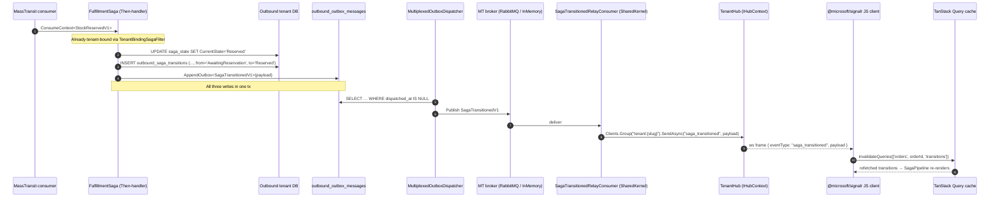

# feat: Sprint-7 Orders saga visualisation + SignalR push (Second Vertical Slice)

## Summary

Sprint-7 ships ShopFlow WMS's **second frontend vertical slice** — an Orders saga-visualisation surface — across **14 units in 5 phases**. Outbound gains a per-tenant `outbound_saga_transitions` audit table written by the existing `FulfillmentSaga`'s `Then`-handlers and emits a new `SagaTransitionedV1` integration event per transition. SharedKernel gains a SignalR `TenantHub` + two relay consumers that subscribe to `StockLevelChangedV1` and `SagaTransitionedV1` and push to tenant-scoped groups. Frontend adds `/orders` list + `/orders/$orderId` detail routes with a horizontal `SagaPipeline` (reusing existing `.saga-step` tokens.css classes), `TransitionsLog` feed, and reuses Sprint-6's `<LedgerDrawer>` for line-item drilldown. Closes Sprint-6 trade-off #9 (polling → SignalR push); polling stays as disconnect fallback.

Branch: `feat/sprint-7-orders-saga-visualisation` cut from `v0.9.0-frontend-vertical-slice`.

---

## Problem Frame

Sprint-6 left the fulfillment saga from Sprint-3-redux invisible at the UI layer — the 11-state MassTransit state machine is only observable via test code or SQL today. Sprint-6 trade-off #9 (2-s polling, no SignalR push) is fine for slow-moving stock levels but skips saga transitions visually because Reserved → AwaitingPick can complete within ~50 ms of each other. Sprint-7 closes both gaps in one slice. Full pain narrative and motivation: see [origin requirements](../brainstorms/2026-05-19-sprint-7-orders-saga-visualisation-requirements.md).

---

## Requirements

- R1. Orders list route at `/orders` replaces Sprint-6's `outbound` ComingSoon. KPI strip (active orders, awaiting pick, awaiting ship, failed today). Filter strip (status, channel, date range, search by external order id).
- R2. Orders table — columns: external order id, channel display, line count, current saga state pill, age, last-transition timestamp.
- R3. Orders detail route at `/orders/$orderId` (full route) — pipeline at top, line items table mid, transitions log bottom.
- R4. `<SagaPipeline>` component — horizontal pipeline with one node per saga state in canonical order. Current node lit; elapsed-time badge per completed segment; failure nodes render in error tokens.
- R5. `<TransitionsLog>` component — append-only feed with timestamp + from-state + to-state + elapsed-since-previous, newest at top.
- R6. Line items row reuses Sprint-6's `<LedgerDrawer>` — clicking a line item opens drawer with that SKU's reservation ledger entries.
- R7. Failure state visualisation — saga in `Cancelled`/`CompensatingReservation`: pipeline highlights failure node + transitions log shows causing event. No UI actions to recover.
- R8. Real Shopee webhook path (Sprint-4/4.5 receiver → Channel.OrderImportedV1 → Outbound.OrderImportedConsumer → OrderPlacedV1 → saga start) is exercised end-to-end and surfaces in Orders list within ~1 s.
- R9. Developer seed endpoint — dev-mode only. Spawns synthetic Order with N test line items and starts the saga.
- R10. SignalR Hub registered via `AddShopFlowDefaults`. Tenant-scoped groups; JWT auth via access-token query parameter. Hub is shared infrastructure (single `/hub` URL).
- R11. SignalR event contracts — `stock_changed` (Inventory) and `saga_transitioned` (Outbound; new). Envelopes carry `tenant_id`, `correlation_id`, `occurred_at` per AGENTS.md rule 42.
- R12. Frontend SignalR client — connection management + exponential-backoff reconnection + tenant-scoped subscription. On hub events, invalidates TanStack Query keys.
- R13. Inventory polling stays as fallback — Sprint-6 polling code is not deleted. Client receives SignalR (preferred) or falls back to 2-s polling when hub disconnected. Hook signatures unchanged per Sprint-6 KTD5.
- R14. New per-tenant `outbound_saga_transitions` audit table in Outbound. Saga writes a row on every state transition via a `Then`-handler.
- R15. Backend query — list transitions for one order, ordered by `occurred_at`.
- R16. Wire shape stays PascalCase (Sprint-6 KTD4 unchanged).
- R17. A11y axe-smoke harness extended to cover new Orders surfaces (list, detail, SagaPipeline, TransitionsLog).
- R18. New endpoints inherit Sprint-6's auth + tenant routing — JWT bearer in `Authorization`, tenant_slug echoed in `X-Tenant-Slug`, `Idempotency-Key` on writes.
- R19. CI frontend job (Sprint-6 baseline) covers new tests by default. No CI changes needed unless surface warrants.
- R20. Sign-off doc + tag `v0.10.0-sprint-7-orders` ship at sprint close; CHANGELOG + README + CLAUDE.md updated.

**Origin actors:** A1 Owner, A2 Shopee webhook, A3 Developer seed endpoint, A4 MassTransit fulfillment saga, A5 SignalR Hub, A6 Sprint-7.5+ developer.
**Origin flows:** F1 Owner navigates to /orders, F2 Shopee webhook arrival, F3 Seed endpoint arrival, F4 Owner clicks order row, F5 Saga transitions live update, F6 SignalR disconnect → polling fallback, F7 Saga fail → failure visualisation, F8 Line item → ledger drilldown.
**Origin acceptance examples:** AE1 (R1,R2,R8,R11,R12), AE2 (R3,R4,R5,R14,R15), AE3 (R4,R11), AE4 (R7), AE5 (R6), AE6 (R12,R13), AE7 (R9), AE8 (R17).

---

## Scope Boundaries

### Deferred for later

*(Carried from origin — product/version sequencing.)*

- Compensation actions in UI (`mark-pick-failed`, `cancel-order`, retry buttons) — Sprint-7.5 candidate.
- Real auth module (password hashing, refresh tokens, role claims, MFA placeholder) — Sprint-8 candidate.
- Cosmetic SKU schema expansion (Sprint-6 trade-off #1) — Sprint-7.5.
- camelCase wire normalisation (Sprint-6 trade-off #6) — Sprint-7.5.
- Flash-sale dual-write (Sprint-6 trade-off #10) — Sprint-7.5.
- URL-search-params persistence (Sprint-6 trade-off #4) — Sprint-7.5+.
- Reservation ledger cursor pagination (Sprint-6 trade-off #5) — Sprint-8+.
- Multi-role auth (separate picker / packer / ops surfaces) — Sprint-8+.
- Operator role functionality + 768 px breakpoint — Sprint-8+.
- Inbound module UI — Sprint-9+.
- Cross-module joins beyond what `Order` already stores — architectural review later.
- Sprint-5.5 scale-gate harness closure — pre-existing parallel-track follow-up.

### Outside this product's identity

*(Carried from origin — positioning rejections.)*

- End-customer-facing screens (order tracking, returns portal) — ShopFlow is a WMS, not a storefront.
- Mobile UI for Owner role — design canon enforces 1024 px floor for non-Operator roles.
- Alternative saga widget shapes (vertical state list, transitions-log-only, pipeline+log combo) — rejected in brainstorm dialogue.
- Alternative detail layouts (wider drawer, two-pane, hybrid drawer+route) — rejected.
- Dark mode — Phase-3.
- PDF exports — Phase-3.
- Sub-orders / partial shipments / RMA flow — out of v1 scope.

### Deferred to Follow-Up Work

*(Plan-local implementation splits.)*

- **Open-generic `SignalRRelayConsumer<TEvent>` registry** — two specific consumers in U6 are cheaper; defer abstraction until a third hub event lands.
- **`Microsoft.AspNetCore.SignalR.Client` backend NuGet** — backend-to-backend client not needed this sprint; in-box server SDK sufficient.
- **MediatR retrofit of existing `OrdersController` POST endpoints** (POST /, POST /{id}/confirm-pick, etc.) — Sprint-7 adds READ via MediatR but leaves existing POSTs unchanged.
- **Migrating Sprint-6 KTD9-12 from sign-off into `docs/solutions/`** — institutional knowledge capture; flagged by learnings researcher. Optional U14 micro-task if time permits.
- **K12 / KTD7 generalised "singleton-binds-tenant-context" solution doc** — capture via `/ce-compound` after R10/R11 land; not a Sprint-7 deliverable.

---

## Context & Research

### Relevant Code and Patterns

**Frontend (Sprint-6 primitives to reuse)** at [web/src/](../../web/src):
- Primitives: [Drawer.tsx](../../web/src/components/primitives/Drawer.tsx), [Modal.tsx](../../web/src/components/primitives/Modal.tsx) (KTD9 capture-phase Esc), [Toast.tsx](../../web/src/components/primitives/Toast.tsx), [Toggle.tsx](../../web/src/components/primitives/Toggle.tsx), [Button.tsx](../../web/src/components/primitives/Button.tsx), [Pill.tsx](../../web/src/components/primitives/Pill.tsx).
- Inventory pattern (Orders mirrors this shape): [KpiStrip.tsx](../../web/src/components/inventory/KpiStrip.tsx), [FilterStrip.tsx](../../web/src/components/inventory/FilterStrip.tsx), [SkuTable.tsx](../../web/src/components/inventory/SkuTable.tsx) (KTD11 nested-interactive fix), [LedgerDrawer.tsx](../../web/src/components/inventory/LedgerDrawer.tsx) — R6 reuse target.
- Hooks: [useInventoryQuery.ts](../../web/src/hooks/useInventoryQuery.ts) (`POLL_MS = 2000`), [useInventoryMutations.ts](../../web/src/hooks/useInventoryMutations.ts) (canonical per-call ULID + invalidate-three-keys + toast pattern — verbatim shape for `useOrderMutations`).
- HTTP + auth: [httpClient.ts](../../web/src/api/httpClient.ts), [useAuth.ts](../../web/src/hooks/useAuth.ts), [ulid.ts](../../web/src/lib/ulid.ts), [jwt.ts](../../web/src/lib/jwt.ts).
- Routing + shell: [__root.tsx](../../web/src/routes/__root.tsx), [_auth.tsx](../../web/src/routes/_auth.tsx) (auth guard), [_auth/outbound.tsx](../../web/src/routes/_auth/outbound.tsx) (replace), [Sidebar.tsx](../../web/src/components/shell/Sidebar.tsx), [screenPaths.ts](../../web/src/components/shell/screenPaths.ts).
- Design tokens: [tokens.css](../../web/src/tokens/tokens.css) — **already ships `.saga-step` / `.saga-line` / `.dot` / `.pending` / `.active` / `.fail` classes** (lines 610-630). `SagaPipeline` (U11) is composition over these, not new tokens.
- Test harness: [vitest.config.ts](../../web/vitest.config.ts), [vitest.setup.ts](../../web/vitest.setup.ts), [vitest-axe.d.ts](../../web/src/types/vitest-axe.d.ts) (KTD12 shim), [a11y.smoke.test.tsx](../../web/src/a11y.smoke.test.tsx). Test pattern: raw `fetch` mock via `vi.stubGlobal`, not MSW.

**Backend Outbound** at [src/Services/Outbound/](../../src/Services/Outbound/):
- Aggregate: [Order.cs](../../src/Services/Outbound/ShopFlow.Outbound.Domain/Order.cs) (state transitions return `Result`; no `ChannelType` column → R2 parses prefix), [OrderLine.cs](../../src/Services/Outbound/ShopFlow.Outbound.Domain/OrderLine.cs), [OrderStatus.cs](../../src/Services/Outbound/ShopFlow.Outbound.Domain/OrderStatus.cs) (11-value enum).
- Saga: [FulfillmentSaga.cs](../../src/Services/Outbound/ShopFlow.Outbound.Application/Sagas/FulfillmentSaga.cs) (10 named states + Initial; `Then`-handler pattern; **MT 8.x publish trap: `.Publish(ctx => new T(...))` works, `PublishAsync(ctx.Init<T>(...))` silently fails**), [FulfillmentSagaState.cs](../../src/Services/Outbound/ShopFlow.Outbound.Application/Sagas/FulfillmentSagaState.cs) (single-row current state only — no history; R14 introduces history).
- Ports: [IOrderRepository.cs](../../src/Services/Outbound/ShopFlow.Outbound.Application/Ports/IOrderRepository.cs) — extend for `ListAsync(filter)`.
- Controllers: [OrdersController.cs](../../src/Services/Outbound/ShopFlow.Outbound.Api/Controllers/OrdersController.cs) (route prefix `api/outbound/orders`; existing POST/GET shape — Sprint-7 extends with MediatR-backed read endpoints).
- DbContext: [OutboundDbContext.cs](../../src/Services/Outbound/ShopFlow.Outbound.Infrastructure/OutboundDbContext.cs) (already suppresses `PendingModelChangesWarning` per Sprint-3-redux), [OutboundServiceCollectionExtensions.cs](../../src/Services/Outbound/ShopFlow.Outbound.Infrastructure/OutboundServiceCollectionExtensions.cs).
- Tenant binding: [TenantBindingSagaFilter.cs](../../src/Services/Outbound/ShopFlow.Outbound.Infrastructure/Sagas/TenantBindingSagaFilter.cs) — K12 saga filter; mirror for the U5 `IHubFilter`.

**SharedKernel canon** at [src/Shared/ShopFlow.SharedKernel/](../../src/Shared/ShopFlow.SharedKernel):
- Composition: [AddShopFlowDefaults.cs](../../src/Shared/ShopFlow.SharedKernel/Infrastructure/AddShopFlowDefaults.cs) — registers `MassTransit`, `MediatR`, `OutboxInterceptor`, `OutboxRouteRegistry`, `IDbContextFactory<>`; new `services.AddSignalR()` lands here in U5.
- Tenant routing: [TenantRoutingMiddleware.cs](../../src/Shared/ShopFlow.SharedKernel/Infrastructure/TenantRoutingMiddleware.cs) (header `X-ShopFlow-Tenant` > JWT `tenant_slug` claim > subdomain; honors `[SkipTenantRouting]` via endpoint metadata), [SkipTenantRoutingAttribute.cs](../../src/Shared/ShopFlow.SharedKernel/Infrastructure/SkipTenantRoutingAttribute.cs).
- Per-request DbContext: [PerRequestDbContextFactory.cs](../../src/Shared/ShopFlow.SharedKernel/Infrastructure/PerRequestDbContextFactory.cs) (AGENTS.md §3.17 canonical factory).
- Outbox: [OutboxInterceptor.cs](../../src/Shared/ShopFlow.SharedKernel/Infrastructure/OutboxInterceptor.cs), [OutboxDispatcher.cs](../../src/Shared/ShopFlow.SharedKernel/Infrastructure/OutboxDispatcher.cs), [IOutboxRouteRegistry.cs](../../src/Shared/ShopFlow.SharedKernel/Infrastructure/IOutboxRouteRegistry.cs). K13 — `services.AddOutboxRoute<SagaTransitionedV1>(SendKind.Publish)` in U2.
- Request context: [IRequestContext.cs](../../src/Shared/ShopFlow.SharedKernel/Application/IRequestContext.cs), [RequestContext.cs](../../src/Shared/ShopFlow.SharedKernel/Application/RequestContext.cs).
- Tenant catalog: [ITenantCatalog.cs](../../src/Shared/ShopFlow.SharedKernel/Application/Ports/ITenantCatalog.cs) (5-min LRU; size 1000).

**Singleton scope-binding canon** at [CachingSkuFlagRepository.cs](../../src/Services/StockSync/ShopFlow.StockSync.Infrastructure/Persistence/Repositories/CachingSkuFlagRepository.cs) — KTD7 `WithTenantScopeAsync<T>` helper. Pattern for the U5 `IHubFilter` and any U6 consumer that needs scoped DbContext access.

**`[SkipTenantRouting]` precedent** at [WebhooksController.cs](../../src/Services/Channel/ShopFlow.Channel.Api/Controllers/WebhooksController.cs) line 35 — the Hub class in U5 carries the same attribute; tenant resolves via JWT claim inside the hub filter.

**Cross-module contracts** at [src/Shared/ShopFlow.Contracts/](../../src/Shared/ShopFlow.Contracts/): [OrderPlacedV1.cs](../../src/Shared/ShopFlow.Contracts/Outbound/OrderPlacedV1.cs), [OrderImportedV1.cs](../../src/Shared/ShopFlow.Contracts/Channel/OrderImportedV1.cs), [StockLevelChangedV1.cs](../../src/Shared/ShopFlow.Contracts/Inventory/StockLevelChangedV1.cs) — U6 relay subscribes to the third one. U2 adds `SagaTransitionedV1.cs` adjacent to `OrderPlacedV1.cs`.

**Backend test patterns** at [tests/ShopFlow.Outbound.IntegrationTests/](../../tests/ShopFlow.Outbound.IntegrationTests/): [OutboundTenantFixture.cs](../../tests/ShopFlow.Outbound.IntegrationTests/OutboundTenantFixture.cs) (Testcontainers postgres:16), [SagaHappyPathTests.cs](../../tests/ShopFlow.Outbound.IntegrationTests/SagaHappyPathTests.cs), [CrossModuleReservationFlowTests.cs](../../tests/ShopFlow.Outbound.IntegrationTests/CrossModuleReservationFlowTests.cs). `WebApplicationFactory<Program>` precedent exists (Inventory.Api); confirm Outbound.Api has `public partial class Program;` declaration in U4 (add if missing).

### Institutional Learnings

- **[2026-05-10-ef-migration-needs-attributes.md](../solutions/2026-05-10-ef-migration-needs-attributes.md)** — U1's new migration MUST carry both `[Migration("20260519_..._AddOrderTransitions")]` and `[DbContext(typeof(OutboundDbContext))]`. Missing either makes `MigrateAsync()` a silent no-op.
- **[2026-05-13-ef9-pendingmodelchangeswarning-with-hand-authored-migrations.md](../solutions/2026-05-13-ef9-pendingmodelchangeswarning-with-hand-authored-migrations.md)** — OutboundDbContext already suppresses this warning per Sprint-3-redux U1; verify before U1 begins (no action expected, but the failure mode is silent).
- **[2026-05-13-cross-module-outbox-table-name-collision.md](../solutions/2026-05-13-cross-module-outbox-table-name-collision.md)** — Sprint-2.5 prefix convention. R14 table name is **`outbound_saga_transitions`** (not `saga_transitions`) so it never collides if a future module ships an identically-named concept.
- **[2026-05-12-readcommitted-conditional-cte-correctness.md](../solutions/2026-05-12-readcommitted-conditional-cte-correctness.md)** — Context only. R14 audit table is append-only single-row INSERTs; no CTE shape needed. Layered idempotency rule applies if the audit row gains a UNIQUE constraint on `(order_id, occurred_at)` for replay safety.
- **[2026-05-13-multi-row-cte-predicate-must-live-in-update.md](../solutions/2026-05-13-multi-row-cte-predicate-must-live-in-update.md)** — Not material to Sprint-7. Flag if a future unit introduces batched audit-flush.

### External References

External research skipped per Phase 1.2 — SignalR is well-documented in-box Microsoft framework; the in-repo K12/KTD7 patterns plus Sprint-6's hook-signature stability fully cover the integration surface. If a reviewer wants the upstream link: [SignalR Hubs](https://learn.microsoft.com/aspnet/core/signalr/hubs), [SignalR auth](https://learn.microsoft.com/aspnet/core/signalr/authn-and-authz), [@microsoft/signalr JS client](https://learn.microsoft.com/aspnet/core/signalr/javascript-client).

---

## Key Technical Decisions

- **Single shared `/hub` URL** (not per-module hubs). Registered via `AddShopFlowDefaults`; client manages one connection. Tenant-scoped groups (`tenant:{slug}`) isolate fan-out. Matches K13 single-registry shape; avoids URL fragmentation across the future 6-microservice split.
- **Saga `Then`-handler is the audit-write mechanism** for R14. Co-transactional with the saga state row via existing K12 `TenantBindingSagaFilter` (saga consume scope is already tenant-bound). The handler also calls `AppendOutbox<SagaTransitionedV1>` so the cross-module integration event is durable. Direct `IHubContext.SendAsync` from inside `Then` is rejected — push goes through outbox → relay consumer (R10/R11) for parity with `stock_changed`.
- **Two specific relay consumers** in `SharedKernel.Infrastructure.SignalR/`: `StockChangedRelayConsumer : IConsumer<StockLevelChangedV1>` and `SagaTransitionedRelayConsumer : IConsumer<SagaTransitionedV1>`. Each calls `IHubContext<TenantHub>.Clients.Group($"tenant:{slug}").SendAsync("stock_changed" | "saga_transitioned", payload)`. Open-generic registry deferred to follow-up work.
- **`outbound_saga_transitions` table** (module-prefix per Sprint-2.5). Columns: `id uuid PK`, `order_id uuid NOT NULL`, `from_state text NOT NULL`, `to_state text NOT NULL`, `occurred_at timestamptz NOT NULL`, `event_type text NOT NULL`. Index `(order_id, occurred_at DESC)` for R15. No `tenant_id` column per AGENTS.md rule 14.
- **`TenantHub`** carries `[SkipTenantRouting]` at class level. A custom `TenantBindingHubFilter : IHubFilter` reads `tenant_slug` from `HubInvocationContext.Context.User.FindFirst("tenant_slug")`, calls `ITenantCatalog.LookupBySlugAsync`, binds the scoped `RequestContext`, and joins the connection to `tenant:{slug}` group before invoking the hub method. Mirrors `TenantBindingSagaFilter` exactly.
- **MediatR query handlers on the new read endpoints** (consistency with Sprint-6's `SkusController` + `InventoryController` pattern). Existing `OrdersController` POST endpoints stay POCO-driven — Sprint-7 does not retrofit them.
- **Channel display parses `Order.ChannelExternalOrderId` prefix** (e.g., `SHOPEE_...` → "Shopee"; unknown → "Direct"). No new `ChannelType` migration. Defers a second schema delta in line with Sprint-6 trade-off #1 cadence.
- **Seed endpoint dual-gated**: backend reads `IWebHostEnvironment.IsDevelopment()` and returns 404 in non-Development; frontend "Seed test order" affordance shows only when `import.meta.env.DEV` is truthy. Both gates fail closed.
- **Existing `.saga-step` / `.saga-line` tokens in `tokens.css`** already define the pipeline visual language. `SagaPipeline` (U11) is pure composition; only addition is the failure-state class wiring if missing.
- **Test-first execution posture** on U7 (`useSignalR` — reconnection logic warrants TDD per Sprint-6 `useInventoryMutations` precedent) and U8 (`useOrderMutations` for the seed call).
- **Route rename**: `web/src/routes/_auth/outbound.tsx` → `web/src/routes/_auth/orders/index.tsx` + `web/src/routes/_auth/orders/$orderId.tsx`. `screenPaths.ts` maps `orders: '/orders'`; `Sidebar.tsx` updates the nav item key + label.
- **PascalCase wire** (Sprint-6 KTD4) — new DTOs serialise PascalCase. Frontend types mirror exactly.
- **Tag**: `v0.10.0-sprint-7-orders`.
- **W3C TraceContext propagation** through SignalR — `correlation_id` field on hub payloads echoes `Activity.Current?.Id` per AGENTS.md rule 43.

---

## Open Questions

### Resolved During Planning

- **Hub URL convention** (origin OQ #1) → Single shared `/hub`. Rationale above.
- **Reconnection backoff parameters** (origin OQ #2) → Use `@microsoft/signalr`'s default `withAutomaticReconnect()` policy (0s / 2s / 10s / 30s pre-built schedule). Custom `IRetryPolicy` not warranted this sprint.
- **Seed dev-mode flag mechanism** (origin OQ #3) → `IWebHostEnvironment.IsDevelopment()` (backend) + `import.meta.env.DEV` (frontend). No new config keys.
- **Transitions audit-write mechanism** (origin OQ #4) → Saga `Then`-handler (simplest; co-transactional with saga state).
- **Channel display** (origin OQ #5) → Parse `ChannelExternalOrderId` prefix. No new migration.
- **TenantRoutingMiddleware + SignalR `/negotiate`** (origin OQ #6) → `[SkipTenantRouting]` on the Hub class; tenant resolved by the custom `TenantBindingHubFilter` after JWT bearer auth completes (the existing `AddJwtBearer` config from Inventory.Api Program.cs applies). The hub filter joins the connection to a tenant-scoped group.
- **Failure-event surfacing** (origin OQ #7) → The `event_type` audit column stores the MT event CLR-name that triggered the transition (e.g., `StockReservationFailedV1`). `TransitionsLog` displays it as-is. Pretty-print is a Sprint-7.5 polish.
- **Tag naming** (origin OQ #8) → `v0.10.0-sprint-7-orders`. v1.0.0 reserved for the next phase gate.

### Deferred to Implementation

- Exact column name for the audit row's triggering-event field (`event_type` vs `triggered_by` vs `cause`) — settle when writing U1's entity config; not load-bearing.
- Whether `TenantBindingHubFilter` rejects the connection vs throws on missing/invalid `tenant_slug` claim — MT-side throws; SignalR-side may want a cleaner 401-style close. Settle in U5 against `@microsoft/signalr` client error-handling semantics.
- Group-name format: `tenant:{slug}` vs `tenant-{slug}` vs raw slug — cosmetic; pick whichever the client subscription path reads cleanest.
- Whether to surface the `OrderTransition.OccurredAt` from `ctx.GetPayload<ConsumeContext>().SentTime` or `DateTime.UtcNow` — implementer's call; `SentTime` is slightly more accurate but `UtcNow` is simpler.
- `OrdersTable` row-action shape — click → navigate vs click → drawer-then-navigate. Settle in U10 against TanStack Router's `<Link>` ergonomics.

---

## Output Structure

```
src/
  Services/Outbound/
    ShopFlow.Outbound.Domain/
      OrderTransition.cs                          (NEW — U1)
    ShopFlow.Outbound.Application/
      Ports/IOrderTransitionRepository.cs         (NEW — U1)
      Queries/
        ListOrdersQuery.cs                        (NEW — U3)
        ListOrdersHandler.cs                      (NEW — U3)
        GetOrderDetailQuery.cs                    (NEW — U3)
        GetOrderDetailHandler.cs                  (NEW — U3)
        GetOrderTransitionsQuery.cs               (NEW — U3)
        GetOrderTransitionsHandler.cs             (NEW — U3)
    ShopFlow.Outbound.Infrastructure/
      EntityConfigurations/OrderTransitionConfiguration.cs   (NEW — U1)
      Repositories/OrderTransitionRepository.cs   (NEW — U1)
      Migrations/20260519100001_AddOrderTransitions.cs       (NEW — U1)
  Services/Inventory/                             (no new files; hook into existing emit path — U6)
  Shared/
    ShopFlow.Contracts/Outbound/
      SagaTransitionedV1.cs                       (NEW — U2)
    ShopFlow.SharedKernel/Infrastructure/SignalR/
      TenantHub.cs                                (NEW — U5)
      TenantBindingHubFilter.cs                   (NEW — U5)
      SignalRRoutingExtensions.cs                 (NEW — U5)
      HubEventPayloads.cs                         (NEW — U6)
      StockChangedRelayConsumer.cs                (NEW — U6)
      SagaTransitionedRelayConsumer.cs            (NEW — U6)

web/
  src/
    api/
      orders.ts                                   (NEW — U8)
    components/orders/
      OrdersKpiStrip.tsx                          (NEW — U10)
      OrdersFilterStrip.tsx                       (NEW — U10)
      OrdersTable.tsx                             (NEW — U10)
      SagaPipeline.tsx                            (NEW — U11)
      TransitionsLog.tsx                          (NEW — U12)
      OrderLineItems.tsx                          (NEW — U13)
      SeedTestOrderButton.tsx                     (NEW — U13)
    hooks/
      useSignalR.ts                               (NEW — U7)
      useOrdersQuery.ts                           (NEW — U8)
      useOrderMutations.ts                        (NEW — U8)
    lib/
      signalr.ts                                  (NEW — U7)
    routes/_auth/orders/
      index.tsx                                   (NEW — U10, replaces _auth/outbound.tsx)
      $orderId.tsx                                (NEW — U13)

tests/
  ShopFlow.Outbound.UnitTests/
    Sagas/SagaTransitionAuditTests.cs             (NEW — U2)
    Queries/{ListOrders,GetOrderDetail,GetOrderTransitions}HandlerTests.cs   (NEW — U3)
  ShopFlow.Outbound.IntegrationTests/
    Persistence/OrderTransitionRepositoryTests.cs (NEW — U1)
    Sagas/SagaTransitionsAuditFlowTests.cs        (NEW — U2)
    Sagas/SagaTransitionsEndToEndSignalRTests.cs  (NEW — U6)
    OrdersListAndDetailEndpointTests.cs           (NEW — U4)
    OrdersSeedEndpointTests.cs                    (NEW — U4)
  ShopFlow.SharedKernel.UnitTests/
    SignalR/TenantBindingHubFilterTests.cs        (NEW — U5)
    SignalR/StockChangedRelayConsumerTests.cs     (NEW — U6)
    SignalR/SagaTransitionedRelayConsumerTests.cs (NEW — U6)

docs/phase-gates/
  2026-MM-DD-sprint-7-signoff.md                  (NEW — U14)
```

---

## High-Level Technical Design

> *This illustrates the intended approach and is directional guidance for review, not implementation specification. The implementing agent should treat it as context, not code to reproduce.*

End-to-end data flow from a saga transition to the frontend pipeline update:



Same shape applies for the `stock_changed` path: Inventory's existing `StockLevelChangedV1` emit (Sprint-5 U2) drives `StockChangedRelayConsumer` → hub → `stock_changed` event → frontend invalidates `['inventory', 'skus' | 'summary']`. No new emit code in Inventory; only the new relay consumer.

**Frontend `useSignalR` hook lifecycle** (directional):

```
┌────────────────┐    JWT present     ┌─────────────────┐  open ws  ┌──────────────┐
│  app boots     │ ─────────────────► │ build connection │ ────────► │  connected   │
│  (auth ready)  │                    │  + handlers map  │           │              │
└────────────────┘                    └─────────────────┘           └──────┬───────┘
                                                                            │
                              hub disconnect (e.g., wifi drop)               │ event
                                                                            │
                          ┌──────────────────────────────────┐               ▼
                          │ withAutomaticReconnect schedule  │       ┌──────────────┐
                          │ 0s / 2s / 10s / 30s              │ ◄──── │ invalidate    │
                          └─────────────────┬────────────────┘       │ TanStack keys │
                                            │                        └──────────────┘
                                            ▼
                                  ┌──────────────────┐
                                  │  reconnected     │
                                  │  resubscribe     │
                                  └──────────────────┘
                          (during disconnect, polling resumes per R13)
```

---

## Implementation Units

### U1. Outbound `outbound_saga_transitions` audit table + entity + repository

**Goal:** Ship the per-tenant audit table that holds the saga history. Schema, entity, EF config, repository, migration, and migration smoke test.

**Requirements:** R14, R15.

**Dependencies:** None.

**Files:**
- Create: `src/Services/Outbound/ShopFlow.Outbound.Domain/OrderTransition.cs`
- Create: `src/Services/Outbound/ShopFlow.Outbound.Application/Ports/IOrderTransitionRepository.cs`
- Create: `src/Services/Outbound/ShopFlow.Outbound.Infrastructure/EntityConfigurations/OrderTransitionConfiguration.cs`
- Create: `src/Services/Outbound/ShopFlow.Outbound.Infrastructure/Repositories/OrderTransitionRepository.cs`
- Create: `src/Services/Outbound/ShopFlow.Outbound.Infrastructure/Migrations/20260519100001_AddOrderTransitions.cs`
- Modify: `src/Services/Outbound/ShopFlow.Outbound.Infrastructure/OutboundDbContext.cs` (add `DbSet<OrderTransition> OrderTransitions` + `ApplyConfiguration`)
- Modify: `src/Services/Outbound/ShopFlow.Outbound.Infrastructure/OutboundServiceCollectionExtensions.cs` (register `IOrderTransitionRepository` scoped)
- Modify: `tests/ShopFlow.Outbound.IntegrationTests/Migrations/MigrationSmokeTests.cs` (assert new `outbound_saga_transitions` named table + PK + `(order_id, occurred_at)` index after `MigrateAsync()`)
- Test: `tests/ShopFlow.Outbound.IntegrationTests/Persistence/OrderTransitionRepositoryTests.cs`

**Approach:**
- `OrderTransition` inherits `BaseEntity` (matches `Order` precedent). Fields: `OrderId` (Guid), `FromState` (string), `ToState` (string), `OccurredAt` (DateTime UTC), `EventType` (string). Constructor `OrderTransition.Create(orderId, fromState, toState, occurredAt, eventType)` returns the instance (no `Result<T>` — input is internal saga-controlled).
- Migration carries **both** `[Migration("20260519100001_AddOrderTransitions")]` and `[DbContext(typeof(OutboundDbContext))]` attributes per `docs/solutions/2026-05-10-ef-migration-needs-attributes.md`. PK = `id uuid`; `order_id uuid NOT NULL`; `from_state text NOT NULL`; `to_state text NOT NULL`; `occurred_at timestamptz NOT NULL`; `event_type text NOT NULL`. Index `idx_outbound_saga_transitions_order_occurred` on `(order_id, occurred_at DESC)`.
- Repository exposes `AppendAsync(OrderTransition transition, CancellationToken ct)` and `ListByOrderIdAsync(Guid orderId, CancellationToken ct)`. Both use the scoped `OutboundDbContext` (per-request connection string via `PerRequestDbContextFactory<OutboundDbContext>`).
- No foreign key to `orders.id` — keeps the audit table independent of order-row deletion (defensive; orders are not deleted today, but the audit row is the source of truth).

**Patterns to follow:**
- `OrderRepository` shape for ctor + `Include` patterns ([OrderRepository.cs](../../src/Services/Outbound/ShopFlow.Outbound.Infrastructure/Repositories/OrderRepository.cs)).
- Migration class attribute order from `InitialOutboundSchema` ([Migrations/20260513000001_InitialOutboundSchema.cs](../../src/Services/Outbound/ShopFlow.Outbound.Infrastructure/Migrations/20260513000001_InitialOutboundSchema.cs)).
- `MigrationSmokeTests` named-table assertion shape — load `__ef_migrations_history` count + `information_schema.tables` for new names.

**Test scenarios:**
- Happy path: append a transition for orderId X → `ListByOrderIdAsync(X)` returns one row with all fields preserved.
- Happy path: append three transitions for orderId X in sequence → list returns three rows in occurred_at ASC order.
- Happy path (multi-order): append for X and Y → list for X returns only X's rows.
- Edge case: appending two transitions with identical `occurred_at` (clock granularity collision) → both rows persist; order is deterministic by PK.
- Integration: applying the migration on a fresh tenant DB produces the `outbound_saga_transitions` table with the PK + named index visible in `information_schema`.

**Verification:**
- Migration applies cleanly against a fresh Testcontainers Postgres tenant DB.
- All five test scenarios green.
- `MigrationSmokeTests` includes the new table name and runs in CI.

---

### U2. `SagaTransitionedV1` contract + FulfillmentSaga `Then`-handler that writes audit + emits integration event

**Goal:** Every state transition in the FulfillmentSaga writes a row to `outbound_saga_transitions` AND appends `SagaTransitionedV1` to the outbox. Co-transactional via the existing K12 saga consume scope.

**Requirements:** R11, R14.

**Dependencies:** U1.

**Files:**
- Create: `src/Shared/ShopFlow.Contracts/Outbound/SagaTransitionedV1.cs`
- Modify: `src/Services/Outbound/ShopFlow.Outbound.Application/Sagas/FulfillmentSaga.cs` (extract a private `RecordTransitionAsync(ctx, from, to, eventType)` helper called from every `Then`-handler chain)
- Modify: `src/Services/Outbound/ShopFlow.Outbound.Infrastructure/OutboundServiceCollectionExtensions.cs` (`services.AddOutboxRoute<SagaTransitionedV1>(SendKind.Publish)`)
- Test: `tests/ShopFlow.Outbound.UnitTests/Sagas/SagaTransitionAuditTests.cs`
- Test: `tests/ShopFlow.Outbound.IntegrationTests/Sagas/SagaTransitionsAuditFlowTests.cs`

**Approach:**
- `SagaTransitionedV1` record: `(Guid TenantId, Guid OrderId, string FromState, string ToState, DateTime OccurredAt, string EventType, string CorrelationId)`. Mirrors `StockLevelChangedV1` envelope shape per AGENTS.md §6.42.
- New helper inside `FulfillmentSaga`:
  ```
  private static async Task RecordTransitionAsync(
      BehaviorContext<FulfillmentSagaState> ctx, string fromState, string toState, string eventType)
  ```
  Resolves the scoped `IOrderTransitionRepository` + the scoped `OutboundDbContext` from `ctx.GetPayload<IServiceProvider>()`. Calls `AppendAsync` + appends `SagaTransitionedV1` via the existing `AppendOutbox<T>` helper on `OutboundDbContext`. Saga's existing UoW flushes the rows when MT commits the saga state.
- Every `.Then` handler chain in the state machine appends a `.ThenAsync(ctx => RecordTransitionAsync(ctx, fromState, toState, "StockReservedV1"))` etc. — explicit per-transition wiring; auto-detection deferred to follow-up.
- **MT 8.x publish trap**: continue using `.Publish(ctx => new T(...))` inside `Initially` and `During`/`WhenEnter`. The audit-write goes through `IOrderTransitionRepository`, not via `Publish` — different channel.

**Technical design** *(directional)*:

```
saga.During(AwaitingReservation,
  When(StockReservedEvent)
    .Then(ctx => { ctx.Saga.UpdatedAt = DateTime.UtcNow; ... })
    .ThenAsync(ctx => RecordTransitionAsync(ctx,
        fromState: "AwaitingReservation",
        toState: "Reserved",
        eventType: nameof(StockReservedV1)))
    .TransitionTo(Reserved)
    .ThenAsync(...existing pick-queue write...)
);
```

**Patterns to follow:**
- Existing `Then(ctx => { ctx.Saga.UpdatedAt = ... })` shape across `FulfillmentSaga.cs`.
- `AppendOutbox<T>` helper precedent in `ReservationRepository` / `StockItemRepository` per Sprint-3-redux.
- `services.AddOutboxRoute<OrderImportedV1>(SendKind.Send)` precedent in Channel ServiceCollectionExtensions (Sprint-4 U4).

**Test scenarios:**
- Happy path (unit, NSubstitute): drive `FulfillmentSaga` through `AwaitingReservation → Reserved` via MT TestHarness; assert `IOrderTransitionRepository.AppendAsync` called once with `from='AwaitingReservation'`, `to='Reserved'`, `eventType='StockReservedV1'`.
- Happy path (unit): drive full happy path (8 transitions) → `AppendAsync` called 8 times, sequence preserved.
- Happy path (unit): drive Cancelled path (compensation) → audit rows include `Reserved → CompensatingReservation → Cancelled` with their respective event types.
- Integration: end-to-end on real Postgres + MT TestHarness — fire the saga from `OrderPlacedV1` → `StockReservedV1` → … → `Shipped` → query `outbound_saga_transitions WHERE order_id = X` returns the full transition chain.
- Integration: outbox table contains N `SagaTransitionedV1` rows after N transitions (one per `RecordTransitionAsync` call). Covers AE2 indirectly (provides the data AE2 reads).
- Edge case: `RecordTransitionAsync` is idempotent under saga retry — if MT re-delivers the consume context, the audit append is duplicate-safe (defer UNIQUE constraint to follow-up; this sprint accepts double-write under retry and notes it).

**Verification:**
- Existing Sprint-3-redux happy-path + compensation tests still green (no behavior regression on the saga state machine itself).
- New unit + integration tests green.
- `SagaTransitionedV1` appears as a registered outbox route in the dispatcher logs after a saga run.

---

### U3. Outbound list / detail / transitions MediatR queries

**Goal:** Read-side handlers that the controllers in U4 consume. Filtered list (status, channel, search, date range), order detail with lines, and transitions for one order.

**Requirements:** R1, R2, R3, R15.

**Dependencies:** U1.

**Files:**
- Create: `src/Services/Outbound/ShopFlow.Outbound.Application/Queries/ListOrdersQuery.cs`
- Create: `src/Services/Outbound/ShopFlow.Outbound.Application/Queries/ListOrdersHandler.cs`
- Create: `src/Services/Outbound/ShopFlow.Outbound.Application/Queries/GetOrderDetailQuery.cs`
- Create: `src/Services/Outbound/ShopFlow.Outbound.Application/Queries/GetOrderDetailHandler.cs`
- Create: `src/Services/Outbound/ShopFlow.Outbound.Application/Queries/GetOrderTransitionsQuery.cs`
- Create: `src/Services/Outbound/ShopFlow.Outbound.Application/Queries/GetOrderTransitionsHandler.cs`
- Modify: `src/Services/Outbound/ShopFlow.Outbound.Application/Ports/IOrderRepository.cs` (add `ListAsync(OrderListFilter filter, int skip, int take)` + nested `OrderListFilter` record)
- Modify: `src/Services/Outbound/ShopFlow.Outbound.Infrastructure/Repositories/OrderRepository.cs` (implement extension)
- Test: `tests/ShopFlow.Outbound.UnitTests/Queries/ListOrdersHandlerTests.cs`
- Test: `tests/ShopFlow.Outbound.UnitTests/Queries/GetOrderDetailHandlerTests.cs`
- Test: `tests/ShopFlow.Outbound.UnitTests/Queries/GetOrderTransitionsHandlerTests.cs`

**Approach:**
- `OrderListFilter` record: `string? Status, string? ChannelPrefix, string? Search, DateTime? Since, DateTime? Until`. Projection done in EF (no in-memory filtering).
- `ListOrdersHandler` returns `OrderListPageResult` with `Items: IReadOnlyList<OrderListItem>` + `TotalCount: int`. `OrderListItem` carries the row fields R2 needs: id, channel external order id, channel display (parsed prefix), line count, current saga state, age, last-transition timestamp. **Last-transition timestamp pulls from `outbound_saga_transitions` (max occurred_at per order)** — single grouped query, not N+1.
- `GetOrderDetailHandler` returns the full `Order` aggregate with lines + the current saga state (read from `FulfillmentSagaState.CurrentState` table via direct query — no aggregate root for saga state). Reuses `OrderRepository.FindByIdAsync(orderId)` with `Include(o => o.Lines)`.
- `GetOrderTransitionsHandler` delegates to `IOrderTransitionRepository.ListByOrderIdAsync`.

**Patterns to follow:**
- Sprint-6 Inventory MediatR query pattern in [src/Services/Inventory/ShopFlow.Inventory.Application/Queries/](../../src/Services/Inventory/ShopFlow.Inventory.Application/Queries/) (search for `SkuListQuery` / `InventorySummaryQuery`).
- `IRequest<T>` + `IRequestHandler<TRequest, TResponse>` MediatR shape.
- Nested record params for filters — matches Inventory's filter DTOs.

**Test scenarios:**
- Happy path (ListOrders): given 5 orders in DB across 2 statuses, filter by status=Reserved → only matching rows returned, count correct.
- Happy path (ListOrders): empty filter returns all + paging respects skip/take.
- Happy path (ListOrders): search by partial `channel_external_order_id` substring → matching rows only.
- Happy path (ListOrders): orders with multiple transitions return latest transition's `occurred_at` as `LastTransitionAt`.
- Happy path (GetOrderDetail): given order with 3 lines → response includes all 3 line items.
- Error path (GetOrderDetail): missing order id → handler returns `Result.Failure("order.not_found", ...)`.
- Happy path (GetOrderTransitions): given 7 transitions → response carries 7 rows in `occurred_at` ASC order.

**Verification:**
- All three handlers have at least one happy-path unit test green.
- `IOrderRepository.ListAsync` query plan inspected (via `EXPLAIN` if useful) — uses the `(order_id, occurred_at)` index for `LastTransitionAt` join.

---

### U4. Outbound controllers — list / detail / transitions / seed endpoints

**Goal:** HTTP layer over U3 handlers + U2's audit-write surface + dev-mode seed endpoint. Wired with JwtBearer auth, tenant routing, and PascalCase wire shape.

**Requirements:** R1, R2, R3, R9, R15, R18.

**Dependencies:** U2, U3.

**Files:**
- Modify: `src/Services/Outbound/ShopFlow.Outbound.Api/Controllers/OrdersController.cs` (add 4 endpoints; preserve existing POST `/`, GET `/{id}`, POST confirm-pick/pack/ship, POST mark-pick-failed)
- Modify: `src/Services/Outbound/ShopFlow.Outbound.Api/Contracts/OrderDtos.cs` (add `OrderListItemDto`, `OrderDetailDto`, `OrderTransitionDto`, `OrderListResponse`, `OrderKpiResponse`, `SeedOrderRequest`)
- Modify: `src/Services/Outbound/ShopFlow.Outbound.Api/Program.cs` (verify JwtBearer + `UseTenantRouting`; add `public partial class Program;` declaration at end of file if absent — enables `WebApplicationFactory<Program>`)
- Test: `tests/ShopFlow.Outbound.IntegrationTests/OrdersListAndDetailEndpointTests.cs`
- Test: `tests/ShopFlow.Outbound.IntegrationTests/OrdersSeedEndpointTests.cs`

**Approach:**
- New endpoints under `api/outbound/orders`:
  - `GET /` — query params: `status`, `channel`, `search`, `since`, `until`, `skip`, `take`. Returns `OrderListResponse`.
  - `GET /kpis` — returns `OrderKpiResponse` with `ActiveOrders`, `AwaitingPick`, `AwaitingShip`, `FailedToday` aggregate counts. Implemented as a thin query that reads from `orders` + `saga_state` + (where needed) `outbound_saga_transitions`.
  - `GET /{id:guid}/transitions` — returns `IReadOnlyList<OrderTransitionDto>` from `GetOrderTransitionsHandler`.
  - `POST /seed` — `[Idempotent]`-style behavior via `Idempotency-Key` header. Returns 404 (`environment_not_dev`) when `!env.IsDevelopment()`. Creates `Order` with N test lines (default 3) using existing `Order.Create`; emits `OrderPlacedV1` via existing outbox path so the saga starts naturally. Returns 201 + created order id + initial state.
- Replace any direct controller-→-repository read calls with MediatR `_mediator.Send(query)` to match Sprint-6 Inventory pattern. Existing POST endpoints stay POCO-driven.
- `OrderListItemDto.Channel` parsed from `ChannelExternalOrderId` prefix via a private helper (`SHOPEE_*` → "Shopee", `LAZADA_*` → "Lazada", `TIKTOK_*` → "TikTok Shop", else "Direct").

**Patterns to follow:**
- Sprint-6 Inventory controller layout in [src/Services/Inventory/ShopFlow.Inventory.Api/Controllers/](../../src/Services/Inventory/ShopFlow.Inventory.Api/Controllers/).
- Existing `OrdersController.CreateAsync` shape for idempotency short-circuit + outbox-driven event emission.
- `[SkipTenantRouting]` is NOT applied — these endpoints flow through `TenantRoutingMiddleware` normally (JWT `tenant_slug` claim resolution).

**Test scenarios:**
- Happy path: `GET /api/outbound/orders` with tenant A JWT returns A's orders only (cross-tenant isolation).
- Happy path: `GET /api/outbound/orders?status=Reserved` filters correctly.
- Happy path: `GET /api/outbound/orders/{id}` returns full order with lines.
- Happy path: `GET /api/outbound/orders/{id}/transitions` returns the audit rows in order.
- Happy path: `POST /api/outbound/orders/seed` in Development env creates an order + returns 201 + emits OrderPlacedV1 (verify via outbox row).
- Error path: `POST /seed` with `ASPNETCORE_ENVIRONMENT=Production` returns 404 + `environment_not_dev` error code.
- Error path: invalid `since`/`until` ISO 8601 strings → 400 with field-level error.
- Integration: `WebApplicationFactory<Program>` boot — verify all 4 new endpoints discoverable + return correct status codes for unauthenticated, missing-tenant, and happy-path cases.
- Covers AE7 (R9 seed flow).

**Verification:**
- All 4 new endpoints documented in Swagger / OpenAPI output.
- Existing `OrdersController` tests still green (no regression on POST endpoints).
- `Program.cs` carries `public partial class Program;` for the test project's `WebApplicationFactory<Program>` use.

---

### U5. SharedKernel SignalR foundation — `TenantHub` + `TenantBindingHubFilter` + DI wiring

**Goal:** SignalR infrastructure: a single tenant-aware hub class, a custom `IHubFilter` that binds `RequestContext` from the JWT `tenant_slug` claim, the DI registration in `AddShopFlowDefaults`, and an extension method that maps the hub from each module's `Program.cs`.

**Requirements:** R10, R18.

**Dependencies:** None (greenfield infrastructure).

**Files:**
- Create: `src/Shared/ShopFlow.SharedKernel/Infrastructure/SignalR/TenantHub.cs`
- Create: `src/Shared/ShopFlow.SharedKernel/Infrastructure/SignalR/TenantBindingHubFilter.cs`
- Create: `src/Shared/ShopFlow.SharedKernel/Infrastructure/SignalR/SignalRRoutingExtensions.cs` (exposes `app.MapShopFlowHubs()`)
- Modify: `src/Shared/ShopFlow.SharedKernel/Infrastructure/AddShopFlowDefaults.cs` (add `services.AddSignalR(o => o.AddFilter<TenantBindingHubFilter>())` plus `ITenantCatalog` + `IRequestContext` resolution dependencies)
- Modify: `src/Services/Outbound/ShopFlow.Outbound.Api/Program.cs` (call `app.MapShopFlowHubs()` after `MapControllers()`)
- Modify: `src/Services/Inventory/ShopFlow.Inventory.Api/Program.cs` (same)
- Modify: `src/Services/StockSync/ShopFlow.StockSync.Api/Program.cs` (same)
- Modify: `src/Services/Channel/ShopFlow.Channel.Api/Program.cs` (same)
- Modify: `src/Services/Inbound/ShopFlow.Inbound.Api/Program.cs` (same)
- Modify: `src/ApiGateway/ShopFlow.Gateway/appsettings.json` (add `/hub` route → primary module API; deferred decision — Sprint-7 maps it to Outbound.Api for now since most traffic terminates there)

> **Auth.Api is intentionally excluded** from `MapShopFlowHubs()` — its `Program.cs` carries a banner ("NOT wired through AddShopFlowDefaults — no MediatR, no MassTransit, no outbox, no DbContext. Keep the surface minimal so Sprint-7 can drop it cleanly.") explaining it skips the kernel. Without `AddShopFlowDefaults` running, `services.AddSignalR()` is not registered, so `MapHub` would throw at startup. Auth.Api also has no MassTransit consumer subscription, so it cannot host a relay consumer; mapping the hub there would be dead infrastructure.
- Test: `tests/ShopFlow.SharedKernel.UnitTests/SignalR/TenantBindingHubFilterTests.cs`

**Approach:**
- `TenantHub : Hub` carries `[Authorize]` + `[SkipTenantRouting]` at class level. Methods are minimal — client subscriptions are implicit via group joins inside the filter; no `[HubMethodName]` invocations needed for Sprint-7's read-only fan-out. Hub class is essentially a typed marker.
- `TenantBindingHubFilter : IHubFilter`:
  - `OnConnectedAsync`: read `tenant_slug` claim from `Context.User.FindFirst("tenant_slug")?.Value`. Reject (close ws) if absent.
  - Resolve `ITenantCatalog.LookupBySlugAsync(slug)` via the singleton-scope binding pattern (open `IServiceScopeFactory.CreateAsyncScope()` for the catalog read; per-call `IRequestContext` binding happens inside hub method invocations).
  - `Context.Groups.AddToGroupAsync(connectionId, $"tenant:{slug}")` — every connected client is in their tenant's group.
  - `InvokeMethodAsync(ctx, next)`: open a DI scope, bind `RequestContext` (same KTD7 pattern), `await next(ctx)` inside the scope.
- `SignalRRoutingExtensions.MapShopFlowHubs(this IEndpointRouteBuilder app)`: `app.MapHub<TenantHub>("/hub", options => { options.Transports = HttpTransportType.WebSockets | HttpTransportType.LongPolling; })`.
- JWT auth via access-token query parameter: `AddShopFlowDefaults` already wires `AddJwtBearer` in each module's Program.cs; the SignalR-specific bit is `JwtBearerOptions.Events.OnMessageReceived` that copies `?access_token=` query param to `context.Token` when the path starts with `/hub`. Add this in `AddShopFlowDefaults` (or in each module's `Program.cs` where JwtBearer is configured — pick the latter to avoid changing the SharedKernel JwtBearer surface).

**Patterns to follow:**
- [TenantBindingSagaFilter.cs](../../src/Services/Outbound/ShopFlow.Outbound.Infrastructure/Sagas/TenantBindingSagaFilter.cs) — mirror the resolve-tenant-from-context + bind-RequestContext shape.
- [CachingSkuFlagRepository.cs](../../src/Services/StockSync/ShopFlow.StockSync.Infrastructure/Persistence/Repositories/CachingSkuFlagRepository.cs) `WithTenantScopeAsync<T>` — singleton opens scope + binds.
- [WebhooksController.cs](../../src/Services/Channel/ShopFlow.Channel.Api/Controllers/WebhooksController.cs) — `[SkipTenantRouting]` precedent.

**Test scenarios:**
- Happy path (unit): `TenantBindingHubFilter.OnConnectedAsync` with a `ClaimsPrincipal` carrying `tenant_slug=yensaokhanhhoa` → mock `ITenantCatalog.LookupBySlugAsync` returns the tenant, `Groups.AddToGroupAsync` called with `"tenant:yensaokhanhhoa"`.
- Edge case (unit): missing `tenant_slug` claim → filter aborts the connection (throws or context.Abort).
- Edge case (unit): unknown slug → `LookupBySlugAsync` returns `null` → filter aborts.
- Edge case (unit): tenant `Status != Ready` → filter aborts (matches `TenantRoutingMiddleware` 503 semantics).
- Happy path (unit): `InvokeMethodAsync` opens a scope and binds `RequestContext` before calling `next(ctx)`.
- Integration (deferred to U6 / U13 since the hub has no real methods to test directly — see U6 for the relay-consumer-to-hub round-trip).

**Verification:**
- Unit tests cover the four happy/edge paths.
- All six module API projects boot successfully with `MapShopFlowHubs()` (no exceptions on startup).
- A `GET /hub/negotiate` against any module API responds with a SignalR negotiation response (verified manually or in U6's integration test).

---

### U6. SignalR relay consumers — `StockChangedRelay` + `SagaTransitionedRelay`

**Goal:** Two MT consumers in SharedKernel that subscribe to the two cross-module integration events and push to the tenant-scoped SignalR group via `IHubContext<TenantHub>`.

**Requirements:** R10, R11.

**Dependencies:** U2 (`SagaTransitionedV1`), U5 (`TenantHub`).

**Files:**
- Create: `src/Shared/ShopFlow.SharedKernel/Infrastructure/SignalR/HubEventPayloads.cs` (typed payload records for the wire: `StockChangedPayload`, `SagaTransitionedPayload` — distinct from the integration event types so we can shape them for the JS client)
- Create: `src/Shared/ShopFlow.SharedKernel/Infrastructure/SignalR/StockChangedRelayConsumer.cs`
- Create: `src/Shared/ShopFlow.SharedKernel/Infrastructure/SignalR/SagaTransitionedRelayConsumer.cs`
- Modify: `src/Shared/ShopFlow.SharedKernel/Infrastructure/AddShopFlowDefaults.cs` (`AddConsumer<StockChangedRelayConsumer>()` + `AddConsumer<SagaTransitionedRelayConsumer>()` inside the existing `services.AddMassTransit(...)` call)
- Test: `tests/ShopFlow.SharedKernel.UnitTests/SignalR/StockChangedRelayConsumerTests.cs`
- Test: `tests/ShopFlow.SharedKernel.UnitTests/SignalR/SagaTransitionedRelayConsumerTests.cs`
- Test: `tests/ShopFlow.Outbound.IntegrationTests/Sagas/SagaTransitionsEndToEndSignalRTests.cs`

**Approach:**
- `StockChangedRelayConsumer : IConsumer<StockLevelChangedV1>`:
  - Resolve tenant slug from the integration event's `TenantId` via `ITenantCatalog.LookupByIdAsync` (singleton-friendly per KTD7 pattern; opens a scope only for the catalog read).
  - Build `StockChangedPayload { TenantId, Sku, AvailableToSell, OccurredAt, CorrelationId }`.
  - `_hubContext.Clients.Group($"tenant:{slug}").SendAsync("stock_changed", payload, ct)`.
  - Failure mode: hub send throws → consumer re-throws → MT retries. Acceptable for read-only push.
- `SagaTransitionedRelayConsumer : IConsumer<SagaTransitionedV1>`: same shape; event name `"saga_transitioned"`; payload includes `OrderId`, `FromState`, `ToState`, `OccurredAt`, `EventType`, `CorrelationId`.
- Consumers live in SharedKernel.Infrastructure (cross-cutting; not module-owned). Each module's `AddShopFlowDefaults` wires them automatically.

**Patterns to follow:**
- `OrderImportedConsumer` shape in [src/Services/Outbound/ShopFlow.Outbound.Application/Consumers/](../../src/Services/Outbound/ShopFlow.Outbound.Application/Consumers/) — same `IConsumer<T>` + ctor injection + handler body shape.
- KTD7 singleton-scope-binding pattern from `CachingSkuFlagRepository`.
- MT 8.x `AddConsumer<T>()` registration syntax inside `AddMassTransit`.

**Test scenarios:**
- Happy path (unit, MT TestHarness): publish `StockLevelChangedV1(tenantId, sku, 10, …)` → mock `IHubContext` receives `SendAsync("stock_changed", payload)` with the right tenant group + payload.
- Happy path (unit): same for `SagaTransitionedV1` → `"saga_transitioned"` event.
- Error path (unit): `ITenantCatalog.LookupByIdAsync` returns null → consumer logs + completes without throwing (don't DLQ on tenant-not-found; that's data-shape pollution, not infrastructure failure).
- Error path (unit): `IHubContext.Clients.Group(...).SendAsync` throws → consumer re-throws (MT retries via its built-in policy).
- Integration (E2E): `tests/ShopFlow.Outbound.IntegrationTests/Sagas/SagaTransitionsEndToEndSignalRTests.cs` boots the saga via `OrderPlacedV1`, drives it through `StockReservedV1` → asserts `outbound_saga_transitions` row written AND the registered `IHubContext` test double received a `SendAsync("saga_transitioned", ...)` call.
- Covers AE3 (R4, R11 — pipeline advances within ~200ms on hub event).

**Verification:**
- Unit tests cover both consumers.
- Integration test confirms the full saga → outbox → relay → hub fan-out path with timing under 1 s on a warm Testcontainers run.

---

### U7. Frontend SignalR client + `useSignalR` hook (test-first)

**Goal:** `@microsoft/signalr` connection management with auth, reconnection, and tenant-scoped subscription. Zustand store for connection state. Hook API surface for downstream components (U9, U10, U13).

**Requirements:** R12, R13.

**Dependencies:** U5 (hub URL discoverable).

**Files:**
- Modify: `web/package.json` (add `@microsoft/signalr` `^8.0.7`; refresh `pnpm-lock.yaml`)
- Create: `web/src/lib/signalr.ts` (`buildConnection({ url, accessTokenFactory, onConnected, onDisconnected, onEvent })`)
- Create: `web/src/hooks/useSignalR.ts` (Zustand store `{ state: 'idle' | 'connecting' | 'connected' | 'reconnecting' | 'disconnected', subscribe(eventName, handler), unsubscribe(handlerId) }`)
- Create: `web/src/hooks/useSignalR.test.tsx`

**Execution note:** Test-first. Reconnection state machine warrants TDD; matches Sprint-6 `useInventoryMutations` precedent.

**Approach:**
- `signalr.ts` exposes a single `buildConnection` function. Args: hub URL (default `/hub` resolved against `import.meta.env.VITE_API_BASE_URL || ''`), `accessTokenFactory: () => string | null` (reads JWT from `useAuth.getState().jwt`), and a callback bag.
- Connection options: `HubConnectionBuilder().withUrl(url, { accessTokenFactory }).withAutomaticReconnect()` (default schedule per origin OQ #2) + `.configureLogging(LogLevel.Warning)`.
- `useSignalR.ts` Zustand singleton (matches `useAuth`, `useToast` pattern). Module-scope subscription map: `Map<eventName, Set<handler>>`. `connection.on(eventName, payload => handlers.forEach(h => h(payload)))` registered once per event name.
- Connection lifecycle:
  - On JWT-present mount → `start()` connection; on success transition `state='connected'`.
  - On `withAutomaticReconnect` events → mirror state.
  - On 401 from negotiate (JWT expired) → call `useAuth.getState().logout()` (same `httpClient` behavior).
- `subscribe(eventName, handler)` returns an unsubscribe function. Idempotent.
- Reset helper `__resetSignalRForTests` (matches `__resetAuthForTests` / `__resetToastsForTests` pattern).

**Patterns to follow:**
- [useAuth.ts](../../web/src/hooks/useAuth.ts) Zustand singleton pattern with reset-for-tests.
- [useInventoryMutations.test.tsx](../../web/src/hooks/useInventoryMutations.test.tsx) — vitest `vi.stubGlobal` pattern for browser globals (here: stub `HubConnectionBuilder` itself or stub the connection mock returned by `buildConnection`).
- [vitest.setup.ts](../../web/vitest.setup.ts) — axe matchers + manual extends.

**Test scenarios:**
- Happy path: mount hook with JWT in `useAuth` store → `buildConnection` called with `accessTokenFactory` returning the JWT → `start()` called → `state` transitions `'idle' → 'connecting' → 'connected'`.
- Happy path: `subscribe('stock_changed', handler)` → emit a fake hub event → `handler` called with payload.
- Happy path: two subscribers to the same event → both fired.
- Happy path: `subscribe` returns unsubscribe function → call it → next event not delivered to that handler.
- Edge case: mount without JWT → connection not started; `state='idle'` until JWT appears.
- Reconnection: connection emits `onreconnecting` → `state='reconnecting'`; emits `onreconnected` → `state='connected'`; emits `onclose` → `state='disconnected'`.
- Error path: `start()` throws → `state='disconnected'` + connection rebuild on next mount tick.
- Auth: 401 from negotiate → `useAuth.getState().logout` called.

**Verification:**
- All scenarios green; reconnection state machine verifiable in isolation.
- Bundle delta from `@microsoft/signalr` measured at sign-off (expected ~50 kB gz).

---

### U8. Frontend Orders API surface + query hooks + mutations

**Goal:** Typed fetch wrappers for Outbound's new endpoints + TanStack Query hooks (list, detail, transitions) + `useOrderMutations` for the seed call. SignalR-driven invalidation wired.

**Requirements:** R1, R2, R3, R9, R12, R15.

**Dependencies:** U4 (backend endpoints), U7 (`useSignalR`).

**Files:**
- Create: `web/src/api/orders.ts` (`fetchOrders(filter)`, `fetchOrderDetail(orderId)`, `fetchOrderTransitions(orderId)`, `seedOrder(payload)`, plus typed response shapes mirroring U4's PascalCase DTOs)
- Create: `web/src/hooks/useOrdersQuery.ts` (`useOrdersListQuery(filter)`, `useOrderKpiQuery()`, `useOrderDetailQuery(orderId)`, `useOrderTransitionsQuery(orderId)`)
- Create: `web/src/hooks/useOrderMutations.ts` (`useSeedOrderMutation()`)
- Create: `web/src/hooks/useOrdersQuery.test.tsx`
- Create: `web/src/hooks/useOrderMutations.test.tsx`

**Execution note:** Test-first on `useOrderMutations` (mirrors Sprint-6 `useInventoryMutations` test-first cadence).

**Approach:**
- TanStack Query key conventions:
  - `['orders', 'list', filter]`
  - `['orders', 'kpi']`
  - `['orders', orderId, 'detail']`
  - `['orders', orderId, 'transitions']`
- `useOrdersQuery.ts` reads `useSignalR` and registers handlers:
  - On `'stock_changed'` → no-op (Inventory hook handles its own invalidation in U9).
  - On `'saga_transitioned'` → `queryClient.invalidateQueries({queryKey: ['orders']})` (broad invalidation; cheap given the small surface).
- Polling fallback: hooks accept `refetchInterval: state === 'connected' ? false : 2000`. When `useSignalR().state` is not `'connected'`, polling resumes (per R13).
- `useSeedOrderMutation` uses the Sprint-6 mutation pattern: per-call ULID `Idempotency-Key`, success toast, error toast with `idempotencyKey + traceId`.
- Channel display: a `formatChannel(externalOrderId)` helper in `web/src/lib/channel.ts` (cheap; reuse in U10's table).

**Patterns to follow:**
- [useInventoryQuery.ts](../../web/src/hooks/useInventoryQuery.ts) — query-key conventions + `POLL_MS` toggle.
- [useInventoryMutations.ts](../../web/src/hooks/useInventoryMutations.ts) — verbatim shape for `useSeedOrderMutation` (per-call ULID, invalidate-keys-on-success, toast shape).
- [useInventoryMutations.test.tsx](../../web/src/hooks/useInventoryMutations.test.tsx) — test harness pattern (`vi.stubGlobal('fetch', vi.fn())`, ULID regex assertion).

**Test scenarios:**
- Happy path: `useOrdersListQuery({ status: 'Reserved' })` → fetch called with the right URL + query params; PascalCase response mapped correctly.
- Happy path: emit fake `saga_transitioned` event via `useSignalR` test helper → `queryClient.invalidateQueries({queryKey: ['orders']})` called.
- Happy path: hub state `disconnected` → polling enabled; hub state `connected` → polling disabled.
- Happy path: `useSeedOrderMutation` fires with body `{LineCount: 3}` → POST `/api/outbound/orders/seed` with `Idempotency-Key` header matching ULID regex.
- Error path: seed returns 500 → error toast displays `idempotencyKey + traceId`.
- Error path: seed returns 404 (env not dev) → mutation fails with clear error.

**Verification:**
- All scenarios green.
- `web/src/types/` aligned with U4 PascalCase DTOs (no field-rename drift).

---

### U9. Inventory `useInventoryQuery` SignalR wire-up

**Goal:** Sprint-6's polling-based `useInventoryQuery` listens to SignalR `stock_changed` events and invalidates the right query keys. Polling stays alive as disconnect fallback.

**Requirements:** R11, R12, R13.

**Dependencies:** U7 (`useSignalR`).

**Files:**
- Modify: `web/src/hooks/useInventoryQuery.ts` (subscribe to `stock_changed` in `useInventoryQuery`; toggle `refetchInterval` based on hub state)
- Modify: `web/src/hooks/useInventoryQuery.test.tsx` (extend existing tests OR create if absent) — verify SignalR-driven invalidation + polling fallback

**Approach:**
- New `useStockChangedSubscription()` internal helper that reads `useSignalR()` + `useQueryClient()` and registers a handler on mount: `(payload) => queryClient.invalidateQueries({queryKey: ['inventory']})` (broad).
- `useInventoryQuery` calls the helper. `refetchInterval` becomes `hubState === 'connected' ? false : POLL_MS`.
- `useInventorySummaryQuery` and `useSkuLedgerQuery` get the same treatment so the entire inventory surface degrades gracefully.

**Patterns to follow:**
- Sprint-6 KTD5 — hook signatures unchanged; callers (`SkuTable`, `InventoryKpiStrip`, etc.) require no changes.

**Test scenarios:**
- Happy path: emit `stock_changed` → `invalidateQueries(['inventory'])` called.
- Happy path: hub state `disconnected` → polling enabled at 2 s.
- Happy path: hub state `connected` → polling disabled.
- Regression: existing inventory tests still green (no behavior regression on polling-only callers).

**Verification:**
- All scenarios green.
- Manual smoke: `pnpm dev` against the running backend, disconnect WiFi → polling resumes; reconnect → SignalR takes over.

---

### U10. Orders list route — `/orders` (replaces Sprint-6 `outbound` ComingSoon)

**Goal:** Live Orders list screen. KPI strip + filter strip + table; SignalR-driven invalidation; click row → navigate to detail route.

**Requirements:** R1, R2, R12, R17.

**Dependencies:** U8 (query hooks).

**Files:**
- Create: `web/src/routes/_auth/orders/index.tsx`
- Create: `web/src/components/orders/OrdersKpiStrip.tsx`
- Create: `web/src/components/orders/OrdersFilterStrip.tsx`
- Create: `web/src/components/orders/OrdersTable.tsx`
- Create: `web/src/components/orders/OrdersTable.test.tsx`
- Modify: `web/src/components/shell/Sidebar.tsx` (label "Outbound" → "Orders"; route target `/orders`)
- Modify: `web/src/components/shell/screenPaths.ts` (rename `outbound: '/outbound'` → `orders: '/orders'`)
- Delete: `web/src/routes/_auth/outbound.tsx`

**Approach:**
- Route component shape mirrors `_auth/inventory.tsx` from Sprint-6.
- `OrdersKpiStrip` consumes `useOrderKpiQuery` — 4 cards (Active, Awaiting Pick, Awaiting Ship, Failed today). Same `<KpiStrip>` primitive composition as Inventory's (consider extracting a generic primitive in follow-up; not this sprint).
- `OrdersFilterStrip` has status select (All / Reserved / AwaitingPick / Picked / AwaitingPack / Packed / AwaitingShip / Shipped / Cancelled), channel select (All / Shopee / Lazada / TikTok / Direct), date range, and search-by-external-order-id input. Local React state (no URL persistence per Sprint-6 trade-off #4).
- `OrdersTable` columns: External Order ID, Channel, Lines, Status pill (color-coded), Age, Last Transition. Click row → `navigate({ to: '/orders/$orderId', params: { orderId } })`. Cell-level button anchors the click to avoid KTD11 nested-interactive (mirrors `SkuTable` refactor).
- Status pill colour mapping follows tokens.css existing pill tokens: success (Shipped), info (Reserved/AwaitingPick/Picked/AwaitingPack/Packed/AwaitingShip), warning (CompensatingReservation), danger (Cancelled), neutral (Created/AwaitingReservation).

**Patterns to follow:**
- [SkuTable.tsx](../../web/src/components/inventory/SkuTable.tsx) — table + cell-button structure (KTD11 fix).
- [_auth/inventory.tsx](../../web/src/routes/_auth/inventory.tsx) — route component shape, query composition.
- [Sidebar.tsx](../../web/src/components/shell/Sidebar.tsx) — nav item shape; check `LiveIndicator` for "signalr conns" health row.

**Test scenarios:**
- Happy path (Vitest, render): given a 3-row response, table renders 3 rows with correct cell content.
- Happy path: clicking a row triggers TanStack Router `navigate` to the detail URL.
- Happy path: status pill colour matches the saga state.
- Happy path: filter strip change → query key changes → fetch re-fires.
- A11y (axe smoke covered in U14): no nested-interactive, no missing form labels.

**Verification:**
- Route renders against `pnpm dev` with seed-spawned orders visible.
- Sidebar Orders nav item highlights when on `/orders`.
- Sprint-6 `outbound` ComingSoon is removed; no broken nav links.

---

### U11. `<SagaPipeline>` component — horizontal pipeline widget

**Goal:** Horizontal pipeline showing 8 canonical saga states; current state lit; elapsed-time badge per completed segment; failure node styled distinctly.

**Requirements:** R4, R7, R17.

**Dependencies:** None (pure presentation component; pulls data from props).

**Files:**
- Create: `web/src/components/orders/SagaPipeline.tsx`
- Create: `web/src/components/orders/SagaPipeline.test.tsx`
- Modify (if missing): `web/src/tokens/tokens.css` (verify `.saga-step.fail` styles cover the failure-node visual; minor token additions only if needed)

**Approach:**
- Component signature (directional):
  ```
  <SagaPipeline
    currentState={OrderStatus}
    transitions={OrderTransitionDto[]}       // for elapsed-time computation
    failureCause?={string}                    // event_type that caused failure, if any
  />
  ```
- Canonical state order (8 visible nodes; Created+AwaitingReservation collapse into "Placed"):
  `Placed → Reserved → AwaitingPick → Picked → AwaitingPack → Packed → AwaitingShip → Shipped`. Cancelled / CompensatingReservation render as a forked terminal node with `.fail` token styling.
- Each node renders as `<div className="saga-step {pending|active|completed|fail}"><span className="dot" /><span className="label">{...}</span><span className="elapsed">{ms or s}</span></div>`.
- Elapsed time = (next transition's `occurred_at` − this transition's `occurred_at`). Format: `< 1s`, `1.2s`, `3m`, `47m`.
- Failure mode: when current state is Cancelled and `failureCause` is provided, render the failure node + a small caption `"Failed at {state} · {cause}"`.

**Patterns to follow:**
- [tokens.css](../../web/src/tokens/tokens.css) lines 610-630 — existing `.saga-step` class taxonomy.
- [LedgerRow.tsx](../../web/src/components/inventory/LedgerRow.tsx) — pure presentation component pattern; no hooks beyond `useLocale` if labels are bilingual.

**Test scenarios:**
- Happy path: given `currentState='Reserved'` + 1 transition (`AwaitingReservation → Reserved`) → first node completed, second node active, rest pending.
- Happy path: given `currentState='Shipped'` + 8 transitions → all nodes completed; elapsed-time badges populated.
- Happy path: elapsed time of 47000ms renders as `"47s"`; 2700000ms renders as `"45m"`.
- Failure: `currentState='Cancelled'`, `failureCause='StockReservationFailedV1'` → failure node styled `.fail`, caption visible.
- Edge case: empty transitions array → all nodes pending (graceful initial state).
- A11y: pipeline carries `aria-label="Saga progress"` + each node `aria-current="step"` for the active one.

**Verification:**
- Component renders against test fixtures; no axe violations (verified in U14 smoke).
- Reduced-motion media query respected (existing `.saga-step.active .dot` rule).

---

### U12. `<TransitionsLog>` component — append-only feed

**Goal:** Vertical feed of transition events newest-first, with timestamp + state-pair + elapsed-since-previous + triggering event type.

**Requirements:** R5, R7, R17.

**Dependencies:** None.

**Files:**
- Create: `web/src/components/orders/TransitionsLog.tsx`
- Create: `web/src/components/orders/TransitionsLog.test.tsx`

**Approach:**
- Signature: `<TransitionsLog transitions={OrderTransitionDto[]} />`.
- Sort descending by `occurred_at`; render each as a row with: timestamp (relative + absolute on hover), arrow icon, `FromState → ToState` (colour-coded by terminal type), elapsed since previous, event type as small monospace.
- For the failure path, last row uses `.bad-soft` background.

**Patterns to follow:**
- [LedgerRow.tsx](../../web/src/components/inventory/LedgerRow.tsx) — row shape pattern, locale-aware date formatting.

**Test scenarios:**
- Happy path: 5 transitions in chronological order → rendered newest-first.
- Happy path: elapsed-since-previous calculated correctly (`(now - prev).toFormat()`).
- Failure: last transition lands in Cancelled → row uses `bad-soft` token background.
- Edge case: empty transitions → "No transitions yet" empty-state copy (bilingual).

**Verification:**
- Component renders cleanly; no axe violations.

---

### U13. Orders detail route — `/orders/$orderId`

**Goal:** The saga-visualisation surface. Composes SagaPipeline + line items table + TransitionsLog + LedgerDrawer reuse + dev-mode SeedTestOrderButton (which actually lives on the list view but ships in this unit to keep the dev affordance grouped).

**Requirements:** R3, R6, R7, R9, R17.

**Dependencies:** U8, U11, U12, U10 (route tree).

**Files:**
- Create: `web/src/routes/_auth/orders/$orderId.tsx`
- Create: `web/src/components/orders/OrderLineItems.tsx`
- Create: `web/src/components/orders/OrderLineItems.test.tsx`
- Create: `web/src/components/orders/SeedTestOrderButton.tsx` (rendered in `_auth/orders/index.tsx` actually; keeping the file here for cohesion)

**Approach:**
- Route component:
  ```
  /orders/$orderId
    ├─ <SagaPipeline ... />
    ├─ <OrderLineItems
    │     lines={orderDetail.Lines}
    │     onLineClick={line => setOpenLedgerSku(line.Sku)}
    │   />
    ├─ <TransitionsLog transitions={transitions} />
    └─ <LedgerDrawer
         sku={openLedgerSku}
         onClose={() => setOpenLedgerSku(null)}
       />
  ```
- `OrderLineItems` is a small table: SKU, Qty, ExpectedWeight, an "ledger" CTA button per row. Button hosts the click (KTD11 — cell-level button, not row-level).
- `SeedTestOrderButton`: button in `_auth/orders/index.tsx` header, rendered only when `import.meta.env.DEV`. Calls `useSeedOrderMutation`. Defaults: `{ lineCount: 3 }`. Success → toast "Seeded test order {id}".
- SignalR subscription scoped to current order id: when `saga_transitioned` payload matches this order, invalidate `['orders', orderId, 'detail']` + `['orders', orderId, 'transitions']`.

**Patterns to follow:**
- [_auth/inventory.tsx](../../web/src/routes/_auth/inventory.tsx) — route + drawer composition pattern.
- KTD9 (Modal-over-Drawer Esc capture phase) — applies if any modal is added; this unit doesn't add new modals.
- KTD11 (nested-interactive) — `OrderLineItems` row hosts no button; cell-level button only.

**Test scenarios:**
- Happy path: route mounts with `orderId` param → 3 queries fire (`detail`, `transitions`, optionally ledger when drawer opens).
- Happy path: SagaPipeline, OrderLineItems, TransitionsLog all render with their props.
- Happy path: click a line item → LedgerDrawer opens with that SKU's ledger entries.
- Happy path: emit `saga_transitioned` for this order id → detail + transitions queries invalidate; pipeline + log update.
- Edge case: emit `saga_transitioned` for a different order id → no invalidation for current view.
- Dev-mode: `SeedTestOrderButton` visible when `import.meta.env.DEV`; hidden otherwise.
- Covers AE2, AE3, AE5, AE7.

**Verification:**
- Route renders against `pnpm dev` with a real seeded order.
- LedgerDrawer reuse verified (no Drawer fork).

---

### U14. A11y smoke extension + sign-off + tag

**Goal:** Extend `a11y.smoke.test.tsx` to cover new Orders surfaces; ship sign-off doc + CHANGELOG + README + CLAUDE.md update; tag `v0.10.0-sprint-7-orders`.

**Requirements:** R17, R20.

**Dependencies:** U1–U13 complete.

**Files:**
- Modify: `web/src/a11y.smoke.test.tsx` (add cases: OrdersList with seeded fixture, OrderDetail with seeded fixture, SagaPipeline isolated, TransitionsLog isolated)
- Create: `docs/phase-gates/2026-MM-DD-sprint-7-signoff.md` (date stamped at sign-off time)
- Modify: `docs/CHANGELOG.md`
- Modify: `README.md` (Current Stage section)
- Modify: `CLAUDE.md` (Current stage section + Sprint-7 deviations / trade-offs)

**Approach:**
- A11y smoke additions use the same `axe(container)` + `toHaveNoViolations()` shape as Sprint-6. Render each surface with minimal fixtures (mock query results) — no live network.
- Sign-off doc follows Sprint-6's template ([2026-05-19-sprint-6-signoff.md](../phase-gates/2026-05-19-sprint-6-signoff.md)): What shipped table (U1-U14 rows), Stack & infrastructure delta, Test count, Key technical decisions, Deviations from plan file list, Trade-offs locked in for downstream sprints, Carried-forward deferrals, Branch + tag + commit chain.
- Tag is annotated: `git tag -a v0.10.0-sprint-7-orders -m "Sprint-7 Orders saga visualisation + SignalR push"`.

**Patterns to follow:**
- [2026-05-19-sprint-6-signoff.md](../phase-gates/2026-05-19-sprint-6-signoff.md) — sign-off shape verbatim.
- [docs/CHANGELOG.md](../CHANGELOG.md) recent entries — Sprint-6 entry shape.

**Test scenarios:**
- A11y smoke: all 4 new surfaces axe-clean.
- Test expectation: `none` for the sign-off / CHANGELOG / README / CLAUDE.md changes — pure documentation.

**Verification:**
- `pnpm test` green across all new test files.
- Sign-off doc reflects what actually shipped (deviation list authentic).
- Tag visible in `git tag -l`.

---

## System-Wide Impact

- **Interaction graph:** New consumer registrations (`StockChangedRelayConsumer`, `SagaTransitionedRelayConsumer`) in `AddShopFlowDefaults` affect every module API (all subscribe automatically once `AddShopFlowDefaults` runs). New `IHubFilter` runs on every SignalR hub method invocation. New `JwtBearerOptions.OnMessageReceived` handler runs on every JWT validation (must be a no-op for non-`/hub` paths).
- **Error propagation:** Hub send failures bubble up to MT consumer → retry policy. Saga `Then`-handler audit-write failures roll back the saga state transition (co-transactional). Frontend `useSignalR` reconnect failures fall back to polling without surfacing user-visible errors.
- **State lifecycle risks:** Double-audit-write if MT re-delivers a consume context after the saga state row commits but before `SaveChangesAsync` finalises. Accepted for Sprint-7; flagged in U2 as a follow-up UNIQUE constraint candidate.
- **API surface parity:** SignalR adds a new contract surface (`stock_changed`, `saga_transitioned` event names + payload shapes). Any future SignalR event must follow the same envelope conventions (R11) — document in AGENTS.md as a Sprint-7 rule addition if reviewer-justified.
- **Integration coverage:** End-to-end test (U6 integration test) verifies saga transition → audit row → outbox → relay consumer → hub send. Polling fallback verified manually (no automated network-flake harness this sprint).
- **Unchanged invariants:**
  - Sprint-6 Inventory polling code paths remain functional (R13) — disabling SignalR globally (e.g., by failing to start the hub) should drop the app back to Sprint-6 behaviour exactly.
  - Existing `OrdersController` POST endpoints unchanged (no MediatR retrofit this sprint).
  - All Sprint-3-redux saga happy-path + compensation integration tests stay green.
  - PascalCase wire shape unchanged (Sprint-6 KTD4).
  - TenantRoutingMiddleware behavior unchanged for HTTP requests; `[SkipTenantRouting]` precedent extended to hub class.
  - AGENTS.md rule count stays under 200 (only adds the SignalR envelope convention if needed).

---

## Risks & Dependencies

| Risk | Mitigation |
|------|------------|
| Double audit-write under MT consumer retry (no UNIQUE on `outbound_saga_transitions`) | Accepted for Sprint-7; flagged in U2; UNIQUE on `(order_id, occurred_at, to_state)` is a Sprint-7.5 follow-up if seen in production |
| SignalR `/negotiate` rejected by `TenantRoutingMiddleware` if `[SkipTenantRouting]` precedent doesn't extend to hubs as expected | U5 integration test verifies the hub class metadata is honored; failure surfaces immediately on first connect |
| `withAutomaticReconnect` default schedule (0/2/10/30s) inadequate during long outages | Polling fallback (R13) keeps the UI usable; custom retry policy is a follow-up if Phase-2 needs it |
| New SharedKernel consumer registration breaks module APIs that lack `IHubContext<TenantHub>` injection | `AddShopFlowDefaults` registers SignalR for ALL module APIs uniformly; relay consumers resolve `IHubContext` from the same DI scope. Verified by booting all 6 module APIs in CI |
| Sprint-7 introduces the first SignalR landing; institutional learnings will surface mid-sprint | Plan budget includes a soft U14 sub-task to capture 2-4 new `docs/solutions/` entries (singleton-scope-binding, hub-auth, tenant-group-naming, reconnect strategy) per the learnings researcher's recommendation |
| WebApplicationFactory<Program> needs `public partial class Program;` in Outbound.Api/Program.cs | U4 verifies presence; adds declaration if absent. Same one-liner Sprint-6 added to Inventory.Api |
| @microsoft/signalr bundle adds ~50 kB gz to frontend chunk | Lazy-import the connection client only when JWT is present (deferred to follow-up if Sprint-7 bundle review flags it) |
| Sprint-2.5 outbox table-name convention not followed for new audit table | U1 names the table `outbound_saga_transitions` (verified by MigrationSmokeTests assertion) |
| Frontend `X-Tenant-Slug` vs backend `X-ShopFlow-Tenant` header mismatch (pre-existing, JWT claim covers) | Sprint-7 does not address — JWT claim resolution is the authoritative path. Sprint-7.5+ can normalise headers if it ever becomes load-bearing |

---

## Documentation / Operational Notes

- **AGENTS.md update**: at sign-off, consider adding a rule under §6 (Outbox, messaging, idempotency) for SignalR envelope conventions if the patterns prove load-bearing. Defer until after U6 lands and the actual shape is set.
- **CHANGELOG**: Sprint-7 entry under "## Unreleased" → tagged at U14.
- **Sign-off doc**: lives at `docs/phase-gates/2026-MM-DD-sprint-7-signoff.md`.
- **Branching**: `feat/sprint-7-orders-saga-visualisation` cut from `v0.9.0-frontend-vertical-slice`. Per AGENTS.md §10, conventional commit messages; commits cite closing U-ID.
- **Deployment posture**: Sprint-7 is dev-mode only at sign-off — same posture as Sprint-6 (no production deploy yet). Compose stack continues to run via Aspire AppHost on the dev machine.
- **Cross-machine workflow**: per CLAUDE.md, all artifacts in-tree. `web/pnpm-lock.yaml` + `Directory.Packages.props` are the only dependency-state files; both committed.

---

## Sources & References

- **Origin document:** [docs/brainstorms/2026-05-19-sprint-7-orders-saga-visualisation-requirements.md](../brainstorms/2026-05-19-sprint-7-orders-saga-visualisation-requirements.md)
- **Follows:** [docs/phase-gates/2026-05-19-sprint-6-signoff.md](../phase-gates/2026-05-19-sprint-6-signoff.md) — Sprint-6 trade-off #9 + deferred Orders slice
- **Architectural anchors:** [docs/adr/0003-database-per-tenant-for-compliance.md](../adr/0003-database-per-tenant-for-compliance.md), [AGENTS.md](../../AGENTS.md) rules 14-23 (tenancy), 38-44 (outbox/messaging), 76-83 (module shape)
- **Related institutional learnings:**
  - [docs/solutions/2026-05-10-ef-migration-needs-attributes.md](../solutions/2026-05-10-ef-migration-needs-attributes.md)
  - [docs/solutions/2026-05-13-ef9-pendingmodelchangeswarning-with-hand-authored-migrations.md](../solutions/2026-05-13-ef9-pendingmodelchangeswarning-with-hand-authored-migrations.md)
  - [docs/solutions/2026-05-13-cross-module-outbox-table-name-collision.md](../solutions/2026-05-13-cross-module-outbox-table-name-collision.md)
- **Prior sprint sign-offs** (for pattern parity):
  - [docs/phase-gates/2026-05-19-sprint-6-signoff.md](../phase-gates/2026-05-19-sprint-6-signoff.md) (frontend cadence)
  - [docs/phase-gates/2026-05-13-sprint-3-redux-signoff.md](../phase-gates/2026-05-13-sprint-3-redux-signoff.md) (saga, K11/K12/K13)
  - [docs/phase-gates/2026-05-17-sprint-5-signoff.md](../phase-gates/2026-05-17-sprint-5-signoff.md) (KTD7 singleton-scope-binding canon)
- **External (informational only — no research dispatched):**
  - [SignalR Hubs](https://learn.microsoft.com/aspnet/core/signalr/hubs)
  - [SignalR authn/authz](https://learn.microsoft.com/aspnet/core/signalr/authn-and-authz)
  - [@microsoft/signalr JS client](https://learn.microsoft.com/aspnet/core/signalr/javascript-client)
