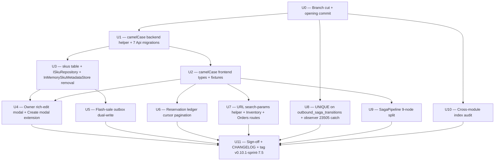
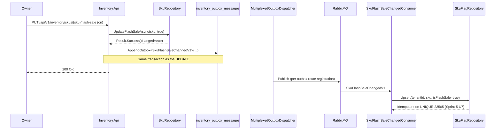
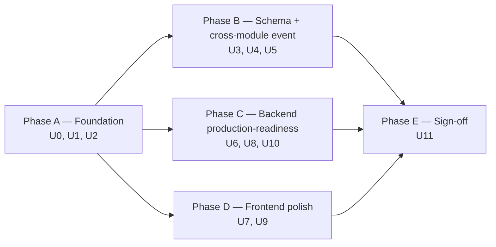

# feat: Sprint-7.5 production-ready trade-off closures bundle

## Summary

Sprint-7.5 closes the seven Sprint-6/7 deferred trade-offs plus a cross-table index audit as **12 implementation units (U0 branch cut + 10 work units + U11 sign-off)** over ~1.5-2 weeks. Production-ready posture is the bar: cursor pagination is mandatory, indexes are baked into every new schema, MT-redelivery defenses ship as constraints not "if observed." Foundational camelCase wire flip lands first (U1+U2 paired) since every later commit reads camelCase shape; the new `skus` table (U3) gates the rich-edit modal (U4) and the flash-sale dual-write (U5); cursor pagination (U6), URL search-params (U7), saga UNIQUE constraint (U8), 9-node SagaPipeline split (U9), and per-module index audit (U10) run as parallel slots after foundations stabilize.

Branch: `feat/sprint-7.5-trade-off-closures` cut from `v0.10.0-sprint-7-orders`. Target tag: `v0.10.1-sprint-7.5`. Matches Sprint-2.5 / Sprint-4.5 point-release cadence.

---

## Problem Frame

Sprint-6 + Sprint-7 collectively named ten trade-offs deferred for vertical-slice delivery. Sprint-7 closed three (#8 JwtBearer kernel-lift, #9 SignalR push, #3 partial via audit table); seven remain — five from Sprint-6 (#1 SKU schema, #4 URL params, #5 cursor pagination, #6 camelCase, #10 flash-sale dual-write) and two from Sprint-7 (#1 UNIQUE constraint, #11 SagaPipeline collapse). With the 12-sprint program goal of "every module backend has a visible frontend surface", another four module-frontend slices (Inbound, Channel, Analytics, Settings) ship between Sprints 8-12. The compounding-cost items (camelCase wire convention, URL-state pattern) protect every one of those slices from re-work — the longer they wait, the more code has to be re-touched.

The project's posture also shifted: **production-ready, not portfolio-grade**, with big-data seed to land later. That reframe makes "low priority" items mandatory — cursor pagination against a million-row reservation ledger isn't optional, and MT redelivery at real volumes will exercise the saga audit double-write window. The eighth unit (cross-module index audit) closes a production-readiness gap that "fix things as you encounter them" would never close.

Sprint-7.5 is the consolidation pass before adding new module surfaces. After it, every new frontend slice inherits camelCase wire + URL-state pattern + cursor-pagination pattern from day one, the SKU catalogue is a real database table (with `is_flash_sale` as a real column, not a singleton entry), and the saga audit + flash-sale flag have production-grade idempotency.

---

## Requirements

All R-IDs carried from origin: [docs/brainstorms/2026-05-19-sprint-7.5-trade-off-closures-requirements.md](../brainstorms/2026-05-19-sprint-7.5-trade-off-closures-requirements.md).

**SKU catalogue model (#1)** — R1, R2, R3, R4
**Wire format normalisation (#2)** — R5, R6
**Flash-sale dual-write (#3)** — R7, R8, R9
**URL search-params persistence (#4)** — R10, R11, R12
**Reservation ledger cursor pagination (#5)** — R13, R14, R15
**Saga audit double-write defense (#6)** — R16, R17
**SagaPipeline operator observability (#7)** — R18, R19
**Index audit on shipped tables** — R20, R21

Acceptance Examples AE1–AE7 from origin are carried into per-unit test scenarios below via `Covers AE<N>` links.

---

## High-Level Technical Design

*This section illustrates the intended approach and is directional guidance for review, not implementation specification. The implementing agent should treat it as context, not code to reproduce.*

### Unit dependency graph



### Flash-sale dual-write sequence (U5)



### Opaque cursor shape (U6)

The cursor is base64-encoded JSON of a two-field record (`occurredAt`, `id`). Encoding and decoding live in a shared helper; the handler validates the cursor before issuing the query. On decode failure the controller returns a stable error code rather than a 500.

```text
{ "occurredAt": "2026-05-18T14:32:17.014Z", "id": 482915 }
  -> base64 (URL-safe, no padding)
  -> handed to client as opaque `nextCursor` string
  -> next request decodes; query WHERE composite (occurred_at, id) < cursor.
```

Page size default 50 (configurable via query param up to a hard ceiling). No infinite scroll; explicit "Load more" UX per origin R14.

### URL search-params shape (U7)

A generic helper hook reads + writes a typed schema to the URL via TanStack Router's `validateSearch` + `useSearch`. The Inventory and Orders routes adopt with route-local schemas; the helper enforces round-trip type safety. Drawer-open state (e.g., `?selected=SKU-001`) is part of the schema, so reload preserves the open drawer and closing the drawer clears the URL param.

```text
Inventory route schema:
  filter?:   "lowStock" | "flashSale" | "all"
  sort?:     "sku" | "availableAsc" | "availableDesc"
  page?:     number
  selected?: string                  // drawer-open SKU; null → drawer closed
  ledger?:   string                  // opaque cursor for the open drawer's ledger
```

---

## Implementation Units

### U0. Branch cut + opening commit

**Goal:** Establish the working branch with the brainstorm + plan + key technical decisions recorded in the opening commit body so subagent dispatch has a single source of truth.

**Requirements:** N/A (procedural)

**Dependencies:** None

**Files:**
- `docs/brainstorms/2026-05-19-sprint-7.5-trade-off-closures-requirements.md` (already exists)
- `docs/plans/2026-05-19-002-feat-sprint-7.5-trade-off-closures-plan.md` (already exists)

**Approach:** Cut `feat/sprint-7.5-trade-off-closures` from `v0.10.0-sprint-7-orders`. Commit body summarises scope, the 9 KTDs below, and the unit ordering. No code changes in this commit.

**Verification:** Branch exists; opening commit present with brainstorm + plan paths referenced; `git log v0.10.0-sprint-7-orders..HEAD --oneline` shows the single commit.

---

### U1. camelCase backend wire flip — centralized helper + 7 Api migrations

**Goal:** All HTTP endpoints serialize and accept JSON in camelCase via one helper, so every later commit (and every future module API) inherits the convention.

**Requirements:** R5

**Dependencies:** U0

**Files:**
- `src/Shared/ShopFlow.SharedKernel/Infrastructure/AddShopFlowControllersExtensions.cs` (new) — extension method bundling `AddControllers + AddJsonOptions(CamelCase)`
- `src/Shared/ShopFlow.SharedKernel/Infrastructure/AddShopFlowDefaults.cs` (modify) — extend the existing `services.AddSignalR(...)` call with `.AddJsonProtocol(opts => opts.PayloadSerializerOptions.PropertyNamingPolicy = JsonNamingPolicy.CamelCase)` for hub event payload camelCase
- `tests/ShopFlow.SharedKernel.UnitTests/Infrastructure/AddShopFlowControllersTests.cs` (new) — serialization + deserialization round-trip assertions (MVC pipeline AND SignalR hub protocol)
- `src/Services/Inventory/ShopFlow.Inventory.Api/Program.cs` (modify) — `AddControllers()` → `AddShopFlowControllers()`
- `src/Services/Inbound/ShopFlow.Inbound.Api/Program.cs` (modify) — same
- `src/Services/Outbound/ShopFlow.Outbound.Api/Program.cs` (modify) — same
- `src/Services/Channel/ShopFlow.Channel.Api/Program.cs` (modify) — same
- `src/Services/StockSync/ShopFlow.StockSync.Api/Program.cs` (modify) — same
- `src/Services/Auth/ShopFlow.Auth.Api/Program.cs` (modify) — same
- `src/Services/Analytics/ShopFlow.Analytics.Api/Program.cs` (modify) — same

**Approach:** New extension method on `IServiceCollection` returns `IMvcBuilder` so existing call-chains continue working. Internally calls `AddControllers().AddJsonOptions(opts => opts.JsonSerializerOptions.PropertyNamingPolicy = JsonNamingPolicy.CamelCase)`. The 7 module Apis migrate to call the helper. **U1 also extends `AddShopFlowDefaults`'s `services.AddSignalR(...)` call with `.AddJsonProtocol(opts => opts.PayloadSerializerOptions.PropertyNamingPolicy = JsonNamingPolicy.CamelCase)`** — SignalR uses an independent serializer pipeline from MVC's `AddJsonOptions`; without this the hub events (`StockChangedPayload`, `SagaTransitionedPayload` in Sprint-7's `HubEventPayloads`) stay PascalCase and produce exactly the mixed-wire-shape failure mode the brainstorm names as the worst outcome. Existing backend integration tests fail until U2 paired-commit lands (frontend types still expect PascalCase wire shape) — that's intentional; both halves of the flip ship as paired commits to maintain green-on-tag invariant.

**Execution note:** Test-first. Write the helper unit tests asserting camelCase round-trip before flipping the 7 Programs.

**Patterns to follow:** Sprint-7 U5 lifted `AddJwtBearer` into `AddShopFlowDefaults` via the same shape (kernel-side helper, per-Api migration); mirror that ergonomics. `OutboxJsonOptions.Default` at `src/Shared/ShopFlow.SharedKernel/Infrastructure/OutboxJsonOptions.cs` already encodes camelCase for the outbox path — reuse the `JsonSerializerOptions` factory if possible.

**Test scenarios:**
- Happy: Given a controller returns a record with PascalCase property names, when serialized through the helper, the JSON output uses camelCase keys.
- Happy: Given a JSON request body with camelCase keys, when bound through the helper, the target record populates correctly.
- Edge: Property with multi-word identifier (e.g., `AvailableToSell`) serializes as `availableToSell`.
- Edge: Property with all-caps acronym at start (e.g., `SKU`) serializes via .NET's default camelCase rule (`sku`).
- Edge: Collection property names also flip (`Allocations` → `allocations`).
- Edge: Nested record properties also flip.
- SignalR: Given the hub publishes a `StockChangedPayload` record to a tenant group, the wire payload uses camelCase keys (verified by capturing the serialized hub frame).
- SignalR: Same for `SagaTransitionedPayload` — confirms `HubEventPayloads` records flip together with the MVC payloads, preventing the mixed-wire-shape failure mode.

**Verification:** Helper unit tests green; the 7 Program.cs files use the helper; running an integration test against any module API returns camelCase JSON (verified in U2 paired tests).

---

### U2. camelCase frontend types + fixtures + component prop access

**Goal:** Frontend types, components, hooks, and Vitest fixtures all flip from PascalCase to camelCase field access; integration tests green at the end of the paired commit.

**Requirements:** R6

**Dependencies:** U1

**Files:**
- `web/src/api/inventory.ts` (modify) — every interface field flips PascalCase → camelCase
- `web/src/api/orders.ts` (modify) — same; 7 DTOs touched
- `web/src/components/inventory/*.tsx` (modify) — every PascalCase prop access on API objects (`item.Sku` → `item.sku`, `item.AvailableToSell` → `item.availableToSell`, etc.)
- `web/src/components/orders/*.tsx` (modify) — same
- `web/src/hooks/useInventoryQuery.ts`, `useInventoryMutations.ts`, `useOrdersQuery.ts`, `useOrderMutations.ts` (modify) — type contracts + any literal field references
- `web/src/components/inventory/*.test.tsx` (modify) — every fixture object's field names
- `web/src/components/orders/*.test.tsx` (modify) — same
- `web/src/hooks/*.test.ts` (modify) — same
- `web/src/a11y.smoke.test.tsx` (modify) — fixture field names

**Approach:** Mechanical rename pass across the `web/src/api/` interface declarations + usages. The TypeScript compiler catches every missed site at build time. Vitest fixtures need manual touch (object-literal field renames). Strategy: rename interfaces first → run `tsc --noEmit` → fix every TS error → run `vitest` → fix every failing fixture.

**Execution note:** Sister commit to U1. The two together restore green-on-tag. Subagent dispatch should treat U1 + U2 as a single coherent unit of work (one round, two commits).

**Patterns to follow:** None new — this is type-rename mechanics across an existing codebase.

**Test scenarios:** No new tests; existing Vitest tests must pass after rename. Test expectation: existing 351 frontend Vitest tests green after rename; existing 42 backend integration tests green after rename.

**Verification:** `tsc --noEmit` clean from `web/`; `vitest run` green from `web/`; all existing backend integration tests against module APIs return camelCase JSON consumed correctly by frontend (Covers AE1).

---

### U3. `skus` table + ISkuRepository + InMemorySkuMetadataStore removal

**Goal:** Replace the in-memory singleton with a real per-tenant `skus` table holding 10 rich product columns and 3 production indexes; expose via repository port.

**Requirements:** R1, R2, R4

**Dependencies:** U1 (camelCase backend helper available for the new controller endpoints). U3 is pure backend — does NOT gate on U2's frontend rename pass; it can run in parallel with U2 to recover ~1 day from the critical path.

**Files:**
- `src/Services/Inventory/ShopFlow.Inventory.Domain/Entities/Sku.cs` (new) — aggregate with the 10 columns + invariants (sku regex, threshold ≥ 0, weight ≥ 0, dimensions jsonb shape)
- `src/Services/Inventory/ShopFlow.Inventory.Domain/ValueObjects/SkuDimensions.cs` (new) — typed wrapper for the `dimensions` jsonb (length/width/height/unit)
- `src/Services/Inventory/ShopFlow.Inventory.Infrastructure/EntityConfigurations/SkuConfiguration.cs` (new) — EF map; PK on `sku`; indexes per R2
- `src/Services/Inventory/ShopFlow.Inventory.Infrastructure/Migrations/20260519000001_AddSkusRichCatalog.cs` (new) — table + indexes
- `src/Services/Inventory/ShopFlow.Inventory.Application/Ports/ISkuRepository.cs` (new) — `GetByIdAsync`, `UpsertAsync`, `ListPagedAsync`, `UpdateFlashSaleAsync`
- `src/Services/Inventory/ShopFlow.Inventory.Infrastructure/Persistence/Repositories/SkuRepository.cs` (new) — EF-backed impl; `UpsertAsync` returns `(Sku, bool changed)` so U5 can decide to emit
- `src/Services/Inventory/ShopFlow.Inventory.Infrastructure/Services/InMemorySkuMetadataStore.cs` (delete)
- `src/Services/Inventory/ShopFlow.Inventory.Infrastructure/InventoryServiceCollectionExtensions.cs` (modify) — `AddScoped<ISkuRepository, SkuRepository>()`; remove singleton registration of `InMemorySkuMetadataStore` + `ISkuMetadataStore`
- `src/Services/Inventory/ShopFlow.Inventory.Application/Services/ISkuMetadataStore.cs` (delete) — port file enumerated explicitly per doc-review (non-standard layout: port + an embedded command handler in the same file; verify the handler is migrated to use `ISkuRepository` before deletion)
- `src/Services/Inventory/ShopFlow.Inventory.Application/Commands/SetThresholdCommandHandler.cs` (modify) — replace `ISkuMetadataStore store` constructor parameter with `ISkuRepository` + adapt handler body to `UpsertAsync` shape
- `src/Services/Inventory/ShopFlow.Inventory.Application/Commands/SetFlashSaleCommand.cs` (modify) — same swap; also the call site that U5 extends with the outbox emit
- Any additional `ISkuMetadataStore` consumers surfaced by `grep -r "ISkuMetadataStore\|InMemorySkuMetadataStore" src/` at U3-start (modify) — migrate to `ISkuRepository` in the same commit. Grep is the load-bearing check; the enumerated list above is the known set at plan-time but may be incomplete.
- `tests/ShopFlow.Inventory.UnitTests/Domain/SkuTests.cs` (new) — aggregate invariant tests
- `tests/ShopFlow.Inventory.IntegrationTests/Repositories/SkuRepositoryTests.cs` (new) — repo tests against Testcontainers Postgres

**Approach:** New aggregate + EF config + migration land first. Repository implements port. Migration is live-safe (new table only — no destructive ALTERs). Every consumer of `InMemorySkuMetadataStore` (grep before delete) migrates to `ISkuRepository`. Singleton deleted in the same commit (no parallel-existence period — see KTD2). Production indexes from R2: btree on `category`, partial btree on `is_flash_sale` where true, partial UNIQUE on `barcode` where not null.

**Execution note:** Test-first for the repository contract — write the `SkuRepositoryTests` integration test first, watch it fail with NotImplementedException, then fill in the impl.

**Patterns to follow:**
- `IReservationRepository` + `ReservationRepository` at `src/Services/Inventory/ShopFlow.Inventory.Application/Ports/IReservationRepository.cs` + `src/Services/Inventory/ShopFlow.Inventory.Infrastructure/Persistence/Repositories/ReservationRepository.cs` (Sprint-1-redux) — port shape + UNIQUE-23505 idempotency on Upsert.
- `ISkuFlagRepository` at `src/Services/StockSync/ShopFlow.StockSync.Application/Ports/ISkuFlagRepository.cs` (Sprint-5 U7) — explicit tenant parameter pattern + UNIQUE-23505 catch.
- Sprint-5 U7 KTD7: tenant context propagation pattern for cache-friendly repos.

**Test scenarios:**
- Sku domain: Factory rejects invalid sku format (not matching `^[A-Z0-9-]+$`); rejects negative threshold; rejects negative weight; accepts null `dimensions` (optional).
- Sku domain: `UpdateFlashSale(true)` flips state, raises domain event (if domain events used here per existing pattern).
- SkuRepository: `GetByIdAsync` hit returns the aggregate; miss returns null.
- SkuRepository: `UpsertAsync(new)` inserts; `UpsertAsync(existing-modified)` updates + returns `changed=true`; `UpsertAsync(existing-unchanged)` returns `changed=false`.
- SkuRepository: Big-data scan — seed 10k rows + filter by `category` returns expected count using the new btree index (verify via EXPLAIN snippet in integration test).
- SkuRepository: Partial UNIQUE on barcode — two rows with NULL barcode both insert; two rows with same non-null barcode → second throws 23505.
- Migration smoke: After `MigrateAsync()`, `skus` table exists; 3 expected indexes present (by name or via `pg_indexes` query).

**Verification:** Repository tests green; migration smoke test green; `grep -r "InMemorySkuMetadataStore" src/` returns no hits after the commit.

---

### U4. Owner rich-edit modal + Create modal extension

**Goal:** Owner can read and write all 10 rich SKU columns via the Inventory frontend.

**Requirements:** R3

**Dependencies:** U3

**Files:**
- `web/src/components/inventory/EditSkuModal.tsx` (new) — full 10-field edit form with validation per Sprint-6 modal pattern
- `web/src/components/inventory/EditSkuModal.test.tsx` (new) — form validation + submit + optimistic update tests
- `web/src/components/inventory/CreateSkuModal.tsx` (modify) — extend with optional rich columns at creation
- `web/src/components/inventory/CreateSkuModal.test.tsx` (modify) — new fixture fields
- `web/src/components/inventory/SkuTable.tsx` (modify) — cell-level button that opens EditSkuModal on click (KTD11 cell-level pattern from Sprint-7)
- `web/src/components/inventory/SkuTable.test.tsx` (modify) — Edit click opens modal
- `web/src/api/inventory.ts` (modify) — `SkuListItem` interface adds 10 fields; new `UpdateSkuPayload` for the edit mutation
- `web/src/hooks/useInventoryMutations.ts` (modify) — `useEditSkuMutation` ULID-per-call Idempotency-Key + optimistic update pattern (Sprint-6 KTD10)
- `web/src/hooks/useInventoryMutations.test.ts` (modify) — new mutation hook tests
- `src/Services/Inventory/ShopFlow.Inventory.Api/Controllers/SkusController.cs` (modify) — new `PUT /api/v1/inventory/skus/{sku}` edit endpoint under existing route prefix; accepts the 10-field payload via `ISkuRepository.UpsertAsync`. Verb is PUT to match the existing Sprint-6 `/threshold` + `/flash-sale` endpoint convention; treat full-record replacement semantics (clients send all 10 fields; nullable cols allowed).

**Approach:** EditSkuModal mirrors Sprint-6's CreateSkuModal structure (Modal-over-Drawer, Esc capture, optimistic update). Form fields: sku (readonly when editing), name, category (free-text input — see Open Questions for the eventual enum/autocomplete decision), threshold, weight_grams, dimensions (length/width/height inputs in mm; SEA marketplace shipping convention; no unit selector in v1), description (textarea), image_url (URL input + preview thumb with onError fallback to a placeholder icon + CSS skeleton during load), barcode, brand, is_flash_sale (passes through to FlashSaleToggle in U5). SkuTable adds an edit affordance per row (KTD11 cell-level button so axe-smoke passes).

**Submit-in-progress UX (post-doc-review D-001):** Save button is disabled + shows a spinner while the mutation is in-flight. On 200 OK the modal closes. On 409 (concurrent edit) the modal stays open with an inline error banner + optimistic UI reverts; fields stay enabled for re-edit. On 422 (validation including barcode-in-use) the modal stays open with field-level errors; barcode UNIQUE conflict surfaces as `code: "barcode_in_use"` inline on the barcode field. On 5xx the modal stays open with a toast + retry-able state.

**Execution note:** Test-first for the new mutation hook (Sprint-6 useInventoryMutations precedent) and the modal validation paths.

**Patterns to follow:**
- `CreateSkuModal` at `web/src/components/inventory/CreateSkuModal.tsx` (Sprint-6 U13) — form structure, validation, Modal-over-Drawer Esc capture (Sprint-6 KTD9).
- `AdjustStockModal` (Sprint-6) — optimistic-update mutation pattern.
- Sprint-6 KTD10 — React 19 set-state-during-render optimistic UI; reuse for the threshold field.
- Sprint-6 KTD11 — cell-level button to satisfy `axe-nested-interactive` (carried into Sprint-7's OrdersTable + OrderLineItems).

**Test scenarios:**
- Validation: sku regex enforced on create; readonly on edit.
- Validation: threshold accepts 0, rejects negatives.
- Validation: weight_grams accepts 0, rejects negatives.
- Validation: dimensions — all-or-nothing (provide all three fields or none); accepts decimal values.
- Validation: image_url — accepts http(s) URL or null; rejects malformed.
- Image preview: broken URL renders placeholder icon (img onError fallback), not the browser's default broken-image glyph.
- Image preview: loading state shows CSS skeleton; replaces with rendered image on load (or placeholder on error).
- Submission: Edit mutation sends 10-field payload; Save button disables + spinner during in-flight window; receives updated row; replaces optimistic UI with server response.
- Failure: 409 conflict (concurrent edit) — modal stays open, inline error banner shown, optimistic UI reverts, fields stay enabled.
- Failure: 422 validation surfaces field-level errors including `code: "barcode_in_use"` rendered inline on the barcode field.
- Failure: 5xx — modal stays open, toast notification, Save button re-enabled for retry.
- Click: SkuTable row's edit button opens EditSkuModal with pre-filled data; Cancel discards (no mutation fired).
- axe-smoke: EditSkuModal opens cleanly; no nested-interactive violations; labels properly tied to inputs; spinner has appropriate aria-busy semantics.

**Verification:** New Vitest tests green; axe-smoke harness extended with EditSkuModal happy path; manual smoke: open modal, edit a field, save, see updated row in list.

---

### U5. Flash-sale dual-write via outbox event

**Goal:** Toggling flash-sale writes to Inventory locally AND publishes a cross-module event that StockSync consumes idempotently into `sku_flags`. Closes Sprint-6 trade-off #10.

**Requirements:** R7, R8, R9

**Dependencies:** U3 (skus.is_flash_sale column must exist)

**Files:**
- `src/Shared/ShopFlow.Contracts/Inventory/SkuFlashSaleChangedV1.cs` (new) — `(TenantId, Sku, IsFlashSale, OccurredAt)` record
- `src/Services/Inventory/ShopFlow.Inventory.Api/Controllers/SkusController.cs` (modify) — PATCH flash-sale endpoint emits outbox event after local write changes state
- `src/Services/Inventory/ShopFlow.Inventory.Infrastructure/Persistence/Repositories/SkuRepository.cs` (modify) — `UpdateFlashSaleAsync` returns `(Sku, bool changed)`; same-transaction outbox append by reusing Sprint-1-redux's private `AppendOutbox<T>` helper pattern (see `ReservationRepository.AppendOutbox<T>(integrationEvent, occurredAt)` for the canonical shape — sync void, scoped to the repo). No new `IInventoryOutbox` port introduced; SkuRepository declares its own private `AppendOutbox<T>` matching the precedent.
- `src/Services/Inventory/ShopFlow.Inventory.Infrastructure/InventoryServiceCollectionExtensions.cs` (modify) — `services.AddOutboxRoute<SkuFlashSaleChangedV1>(SendKind.Publish)`
- `src/Services/StockSync/ShopFlow.StockSync.Application/Consumers/SkuFlashSaleChangedConsumer.cs` (new) — consumes the event; calls `ISkuFlagRepository` upsert
- `src/Services/StockSync/ShopFlow.StockSync.Infrastructure/StockSyncServiceCollectionExtensions.cs` (modify) — `AddConsumer<SkuFlashSaleChangedConsumer>()`
- `src/Services/StockSync/ShopFlow.StockSync.Application/Ports/ISkuFlagRepository.cs` (modify if needed) — confirm `UpsertAsync(tenantId, sku, isFlashSale)` shape matches Sprint-5 U7 KTD7
- `tests/ShopFlow.Inventory.UnitTests/Controllers/SkusFlashSaleEmitTests.cs` (new) — emit-on-change semantics
- `tests/ShopFlow.Inventory.IntegrationTests/Repositories/SkuRepositoryFlashSaleFlowTests.cs` (new) — repo + outbox row in same transaction
- `tests/ShopFlow.StockSync.UnitTests/Consumers/SkuFlashSaleChangedConsumerTests.cs` (new) — consumer logic via MT TestHarness + NSubstitute
- `tests/ShopFlow.StockSync.IntegrationTests/Consumers/SkuFlashSaleChangedFlowTests.cs` (new) — real Postgres + MT redelivery scenario

**Approach:** `UpdateFlashSaleAsync` checks current state; if unchanged, no-op + no emit. If changed, UPDATE + outbox append in same transaction by reusing Sprint-1-redux's private `AppendOutbox<T>` helper pattern (the canonical Inventory-side shape). Outbox dispatcher routes via `AddOutboxRoute<SkuFlashSaleChangedV1>(SendKind.Publish)`; consumer-side wiring per Sprint-5 module-extension pattern. Consumer-side idempotency now combines (a) the existing Sprint-5 UNIQUE-23505 upsert in `SkuFlagRepository.UpsertAsync` for redelivery defense, AND (b) a new OccurredAt-timestamp guard: when an incoming event's `OccurredAt` is older than the stored `sku_flags.occurred_at`, the upsert drops the stale write + logs at Debug. The OccurredAt guard is the load-bearing correctness anchor under consumer parallelism — the `MultiplexedOutboxDispatcher` orders per-tenant only, not per-`(tenant, sku)`, so a flap A→B→A processed out-of-order would otherwise converge on the wrong state. The timestamp guard handles this independently of dispatcher partitioning, which means it stays correct after the W6 split lands.

**Patterns to follow:**
- Sprint-5 `StockLevelChangedV1` contract + emit + consumer at `src/Shared/ShopFlow.Contracts/Inventory/StockLevelChangedV1.cs` and `src/Services/StockSync/ShopFlow.StockSync.Application/Consumers/StockLevelChangedConsumer.cs`.
- Sprint-2.5 `IInboundOutbox.AppendAsync` explicit-write port pattern at `src/Services/Inbound/ShopFlow.Inbound.Application/Ports/IInboundOutbox.cs`.
- Sprint-5 U7 KTD7 `ISkuFlagRepository` UNIQUE-23505 idempotent upsert.
- Sprint-4 K13 `IOutboxRouteRegistry` + `AddOutboxRoute<T>(SendKind, destination?)` at `src/Shared/ShopFlow.SharedKernel/Infrastructure/OutboxRouteRegistry.cs`.

**Test scenarios:**
- Repo: `UpdateFlashSaleAsync(sku, true)` on already-true row → `changed=false`, no outbox row appended.
- Repo: `UpdateFlashSaleAsync(sku, true)` on false row → `changed=true`, UPDATE persisted, outbox row persisted in same transaction (verify by transaction abort test).
- Controller: PATCH endpoint returns 200; emits one outbox row for the state change.
- Consumer: Single consume of new event upserts `sku_flags` row.
- Consumer: Redelivered consume of identical event hits UNIQUE-23505; idempotent — existing row preserved; no double action (Covers AE2).
- Consumer: Flap A→B→A processed IN ORDER produces final `is_flash_sale=A` in `sku_flags`.
- Consumer: Flap A→B→A processed OUT-OF-ORDER (e.g., A arrives after B due to consumer reorder) — OccurredAt guard rejects the stale A; final state stays `is_flash_sale=B` then converges to A only when A's own retry-redelivery has `OccurredAt` newer than B's stored value (correctness-preserving under W6 competing consumers).
- Repository: `SkuFlagRepository.UpsertAsync` with stale OccurredAt → returns dropped + log; row unchanged.
- Repository: `SkuFlagRepository.UpsertAsync` with newer OccurredAt → row updated.
- Integration: End-to-end Inventory → outbox → InMemory MT → consumer → sku_flags row, asserted via `IServiceProvider` resolution.

**Verification:** Unit + integration tests green; manual smoke: toggle in UI → log shows outbox row written → log shows consumer fire → sku_flags row in StockSync DB.

---

### U6. Reservation ledger cursor pagination

**Goal:** `GetSkuLedgerQuery` returns paged results with opaque `nextCursor`; LedgerDrawer displays a "Load more" button when more rows exist; first-page render stays sub-200ms against million-row seeds.

**Requirements:** R13, R14, R15

**Dependencies:** U2 (frontend types in camelCase already)

**Files:**
- `src/Services/Inventory/ShopFlow.Inventory.Application/Queries/GetSkuLedgerQuery.cs` (modify) — add `Cursor` param (nullable string); add `Limit` clamp
- `src/Services/Inventory/ShopFlow.Inventory.Application/Dtos/SkuLedgerDto.cs` (modify) — add `NextCursor` field (nullable)
- `src/Services/Inventory/ShopFlow.Inventory.Infrastructure/Queries/GetSkuLedgerQueryHandler.cs` (modify) — decode cursor, apply composite WHERE; encode next cursor when row count == limit
- `src/Services/Inventory/ShopFlow.Inventory.Infrastructure/Pagination/OpaqueCursor.cs` (new) — encode/decode helpers
- `src/Services/Inventory/ShopFlow.Inventory.Infrastructure/Migrations/20260519000008_AddReservationsLedgerSkuOccurredAtIndex.cs` (new) — composite btree index on `reservations_ledger (sku, occurred_at DESC)` — required for sub-200ms cursor pagination; verified missing from Sprint-1-redux migrations during doc-review
- `tests/ShopFlow.Inventory.UnitTests/Pagination/OpaqueCursorTests.cs` (new) — round-trip + invalid-input tests
- `src/Services/Inventory/ShopFlow.Inventory.Api/Controllers/SkusController.cs` (modify) — ledger endpoint accepts `?cursor=&limit=` query params; maps decode failure to 400 with stable error code
- `web/src/api/inventory.ts` (modify) — `SkuLedger` adds `nextCursor`; `useSkuLedgerQuery` accepts cursor param
- `web/src/hooks/useInventoryQuery.ts` (modify) — paginated query state (`pages` array + `loadMore` action)
- `web/src/hooks/useInventoryQuery.test.ts` (modify) — pagination test cases
- `web/src/components/inventory/LedgerDrawer.tsx` (modify) — "Load more" button + cursor state; appends new rows to existing list
- `web/src/components/inventory/LedgerDrawer.test.tsx` (modify) — multi-page test
- `tests/ShopFlow.Inventory.IntegrationTests/Queries/GetSkuLedgerCursorTests.cs` (new) — real Postgres + 1k rows + cursor advance + EXPLAIN-uses-index assertion

**Approach:** `OpaqueCursor` encodes/decodes `{occurredAt, id}` as URL-safe base64 of UTF-8 JSON. Handler decodes the inbound cursor, applies WHERE `(occurred_at, id) < (cursor.occurredAt, cursor.id)` predicate via tuple comparison (PostgreSQL supports row-value comparison directly), orders DESC, takes Limit+1, and if Limit+1 rows returned, encodes the last as the next cursor and trims to Limit. Page size defaults to 50, clamps to 200. Frontend stores accumulated pages in query state; "Load more" advances cursor and appends.

**LedgerDrawer "Load more" UX states (post-doc-review D-004):** while a next-page fetch is in flight, the button text changes to "Loading…" + disabled + shows a small spinner. On success the new rows append below the existing list and the button re-enables (or hides if `nextCursor` is null). When the final page loads and `nextCursor` is null, the button is replaced by a static "All entries loaded" caption so operators can tell they've seen everything (operator triage workflow requires this end-of-list indicator since R14 forbids infinite scroll). Loading errors surface as a retry-able toast adjacent to the button.

**Patterns to follow:**
- `GetSkuLedgerQueryHandler` at `src/Services/Inventory/ShopFlow.Inventory.Infrastructure/Queries/GetSkuLedgerQueryHandler.cs` (Sprint-6 U7) — existing query shape to extend.
- Sprint-3-redux composite UNIQUE / tuple comparison patterns — Postgres row-value comparison.
- `ListOrdersHandler` at `src/Services/Outbound/ShopFlow.Outbound.Application/Queries/ListOrdersHandler.cs` (Sprint-7 U3) — paginated query with explicit limit.

**Test scenarios:**
- OpaqueCursor: Round-trip — encode `{occurredAt, id}` → decode → equal record.
- OpaqueCursor: Invalid base64 → returns null / error (controller maps to 400).
- OpaqueCursor: Valid base64 but bad JSON → same handling.
- Handler: Empty cursor → returns first page (50 rows) + `nextCursor` if more remain.
- Handler: Valid cursor → returns next page beyond that point.
- Handler: Final page (fewer than 50 rows) → returns rows + `nextCursor=null`.
- Handler: Limit clamping — request limit=500 served as limit=200.
- Integration: 1k-row seed, cursor advances through 20 pages, total rows match seed.
- Integration: EXPLAIN against the cursor query uses the existing `reservations_ledger` index ordered by occurred_at DESC (covered by Sprint-1-redux's existing index); if EXPLAIN reveals a sort-without-index, the index audit (U10) adds the right one.
- Frontend: useSkuLedgerQuery initial fetch loads first page; loadMore advances cursor; existing rows preserved.
- Frontend: Load-more button shows "Loading…" + disabled + spinner while fetching; re-enables on success.
- Frontend: Load-more button replaced by "All entries loaded" caption when nextCursor is null (operator end-of-list indicator).
- Frontend: Load-more failure renders a retry-able toast adjacent to the button.
- Frontend: Drawer reopen with same SKU starts fresh from page 1.
- Frontend: Drawer open against synthetic 1k-row test fixture — first page renders sub-200ms with the index in place (Covers AE4 at Sprint-7.5 scope; full million-row latency benchmark deferred to a benchmarking pass per Success Criteria below).
- axe-smoke: Load more button is keyboard accessible; aria-label present.

**Verification:** Backend + frontend tests green; manual smoke against test fixture with synthetic 1k rows: scroll → click Load more → see next page appended; close + reopen → starts fresh.

---

### U7. URL search-params helper + Inventory + Orders route migration

**Goal:** Filter, sort, page, and drawer-open state lives in URL search params via a generic helper; Inventory and Orders routes adopt; pattern is generalizable to future module list pages.

**Requirements:** R10, R11, R12

**Dependencies:** U2 (frontend types camelCase), U6 (cursor param) — LedgerDrawer cursor state lifts to URL via this helper

**Files:**
- `web/src/hooks/useFilterSearchParams.ts` (new) — generic hook `<TSchema>` reading + writing typed search params
- `web/src/hooks/useFilterSearchParams.test.ts` (new)
- `web/src/routes/_auth/inventory.tsx` (modify) — `validateSearch` schema; route reads filter/sort/page/selected/ledger from URL
- `web/src/components/inventory/FilterStrip.tsx` (modify) — writes via the helper; controlled by URL
- `web/src/components/inventory/SkuTable.tsx` (modify) — sort col change writes URL; row click writes `?selected=`
- `web/src/components/inventory/LedgerDrawer.tsx` (modify) — open state comes from URL; close clears `?selected=` + `?ledger=`
- `web/src/routes/_auth/orders/index.tsx` (modify) — same shape for Orders list route
- `web/src/components/orders/OrdersFilterStrip.tsx` (modify)
- `web/src/components/orders/OrdersTable.tsx` (modify) — sort + page state via URL
- `web/src/components/inventory/FilterStrip.test.tsx` (modify) — URL write assertions
- `web/src/components/orders/OrdersFilterStrip.test.tsx` (modify)
- `web/src/routes/_auth/inventory.test.tsx` (new or modify, depending on existing route test)
- `web/src/routes/_auth/orders/index.test.tsx` (new or modify)

**Approach:** Hook signature: `useFilterSearchParams<TSchema extends Record<string, unknown>>(defaults: TSchema): [TSchema, (updates: Partial<TSchema>) => void]`. Backed by TanStack Router's `Route.useSearch()` for read and `Route.useNavigate()` (or `router.navigate`) for write — preserves type safety. Each route declares its schema via `validateSearch` (zod or hand-typed predicate). Inventory route's schema covers `filter`, `sort`, `page`, `selected`, `ledger` (the last two govern drawer open state + ledger cursor). Orders route covers `filter`, `sort`, `page`. Drawer close = navigate with `selected: undefined, ledger: undefined`. The helper handles default-value omission (defaults aren't written to URL).

**Filter/sort change pagination reset (post-doc-review D-006):** the helper enforces a convention — any update that changes `filter` or `sort` automatically resets `page` to its default (1, omitted from URL) AND clears `ledger` (so the open drawer's cursor resets). The hook wraps the user-supplied update call and applies the reset rule before navigating. This convention propagates to every future module list page automatically.

**Stale deep-link recovery (post-doc-review D-005):** when `?selected=` references a SKU that doesn't exist (404 from `useSkuLedgerQuery`), the drawer opens with an explicit error state ("This SKU could not be found — it may have been deleted or the link is invalid") + a "Close" button. The URL param is NOT auto-cleared (so refresh preserves the error context). Closing the drawer normally clears `?selected=` from URL.

**Patterns to follow:**
- No prior pattern in this repo (grep confirmed: no `validateSearch` / `useSearch` usage yet). External patterns: TanStack Router docs at <https://tanstack.com/router/latest/docs/framework/react/guide/search-params>. Helper shape should be lightweight enough to add to a doc comment so future module slices (Inbound, Channel, Analytics, Settings) adopt without re-deriving conventions.

**Test scenarios:**
- Hook: Read returns defaults when URL is empty.
- Hook: Read parses URL params correctly per schema.
- Hook: Write updates URL without full reload; back button restores previous state.
- Hook: Write with `undefined` for a key removes it from URL (default-value-omission rule).
- Hook: Invalid URL param falls back to default (no crash) — validateSearch catches the error.
- Inventory: FilterStrip change writes filter to URL; reload restores filter.
- Inventory: Click row writes `?selected=SKU-001`; LedgerDrawer opens; close clears `?selected=` (Covers AE3).
- Inventory: Browser back from drawer-open state closes drawer (URL state pops).
- Inventory: Filter change resets `page` to default and clears `ledger` cursor in URL (D-006 convention).
- Inventory: Sort change resets `page` to default and clears `ledger` cursor (same convention).
- Inventory: Deep-link to unknown SKU (`?selected=NONEXISTENT`) opens drawer with error state + Close button; URL param not auto-cleared (D-005 recovery).
- Orders: Same shape — filter/sort/page round-trip through URL.
- Orders: Filter / sort change resets page (same convention applied via the helper).
- Generalization: Helper has a docblock + at least one usage example demonstrating adoption shape (Covers AE7).
- axe-smoke: routes still pass.

**Verification:** New tests green; manual smoke: open Inventory, filter "Low stock", click a SKU, copy URL, open in new tab → same state restored.

---

### U8. UNIQUE on `outbound_saga_transitions` + observer 23505 catch

**Goal:** Composite UNIQUE constraint guards against MT-redelivered double-writes; observer swallows 23505 as idempotent no-op.

**Requirements:** R16, R17

**Dependencies:** U0 (independent of all other units)

**Files:**
- `src/Services/Outbound/ShopFlow.Outbound.Infrastructure/Migrations/20260519000002_AddUniqueOnSagaTransitions.cs` (new) — composite UNIQUE on `(order_id, occurred_at, to_state)`; migration includes pre-check that aborts if existing duplicates exist (defensive)
- `src/Services/Outbound/ShopFlow.Outbound.Infrastructure/EntityConfigurations/OrderTransitionConfiguration.cs` (modify) — declare the index in EF model so it survives any DbContext-snapshot regen
- `src/Services/Outbound/ShopFlow.Outbound.Application/Sagas/SagaTransitionObserver.cs` (modify) — try-catch around `_transitions.AppendAsync` (and/or the saga's `SaveChangesAsync` boundary — see KTD6 + the ADV-001 design note below) with `PostgresException.SqlState == "23505"` swallow; log at Debug level
- `tests/ShopFlow.Outbound.UnitTests/Sagas/SagaTransitionObserverTests.cs` (modify) — add idempotency test
- `tests/ShopFlow.Outbound.IntegrationTests/Sagas/SagaTransitionsRedeliveryFlowTests.cs` (new) — real Postgres + MT TestHarness redelivery → assert no double row

**Approach:** Migration adds composite UNIQUE constraint with a name like `uq_outbound_saga_transitions_order_occurred_state`. Because `IOrderTransitionRepository.AppendAsync` only stages entities via `AddAsync` (no immediate flush), the unique-violation does NOT throw at AppendAsync time — it throws at the saga's `SaveChangesAsync` boundary as `DbUpdateException` with `InnerException` of `PostgresException` carrying `SqlState == "23505"`. The catch lives at that boundary (or via an `ISaveChangesInterceptor`). Two viable shapes — implementer picks during U8: (a) wrap the existing saga MT EF commit call with a try-catch that downgrades 23505 DbUpdateException to no-op + Debug log; (b) register a SaveChangesInterceptor that recognises the violation and swallows it. Either way, the saga state + outbox emit stay committed for the FIRST audit row; the redelivered consume skips silently. Migration includes a pre-check (raw SQL `DO $$ ... RAISE EXCEPTION $$;` block) that aborts cleanly if duplicates already exist in the table.

**Patterns to follow:**
- `ReservationRepository.TryReserveAsync` 23505 catch at `src/Services/Inventory/ShopFlow.Inventory.Infrastructure/Persistence/Repositories/ReservationRepository.cs` (Sprint-1-redux) — same idempotency pattern.
- `WebhookEventRepository` UNIQUE-23505 catch at `src/Services/Channel/ShopFlow.Channel.Infrastructure/Persistence/Repositories/WebhookEventRepository.cs` (Sprint-4).
- `SkuFlagRepository.UpsertAsync` UNIQUE-23505 catch at `src/Services/StockSync/ShopFlow.StockSync.Infrastructure/Persistence/Repositories/SkuFlagRepository.cs` (Sprint-5 U7).

**Test scenarios:**
- Unit: Saga commit interceptor / wrapper receives `DbUpdateException` with inner `PostgresException.SqlState == "23505"` → swallowed; log captured at Debug; saga commit treated as success (Covers AE5).
- Unit: Saga commit interceptor / wrapper receives `DbUpdateException` with inner `PostgresException.SqlState == "23502"` (not_null) → propagates and rolls back the transaction.
- Unit: Saga commit succeeds normally → row recorded; outbox emit fires (existing Sprint-7 path unchanged).
- Integration: Real Postgres + MT redelivery → SagaTransitionedV1 consumed twice → only one row in `outbound_saga_transitions`; only one outbox row for SagaTransitionedV1; no infinite-redelivery loop (assert the second consume completes within the MT default redelivery window).
- Migration smoke: After migrate, UNIQUE constraint named `uq_outbound_saga_transitions_order_occurred_state` exists on the expected columns.
- Migration: Pre-check — if duplicates exist before migrate (`SELECT (order_id, occurred_at, to_state), count(*) FROM outbound_saga_transitions GROUP BY ... HAVING count(*) > 1`), migrate aborts via `RAISE EXCEPTION` with a clear message naming the offending triples.

**Verification:** Tests green; manual: trigger a redelivery via MT TestHarness and verify only one audit row + one outbox emit.

---

### U9. SagaPipeline 9-node split

**Goal:** Display `Created` and `AwaitingReservation` as separate nodes (previously collapsed into "Placed"), so operators see bus-latency vs Inventory-consumer-latency.

**Requirements:** R18, R19

**Dependencies:** U2 (frontend types camelCase, includes any new field names from Outbound queries)

**Files:**
- `web/src/components/orders/SagaPipeline.tsx` (modify) — `PIPELINE_NODES` array adds `Created` + `AwaitingReservation` as nodes 0 and 1; mapping function from saga-state-string to active-node-index updated; `labelsFor` Vi/En translations added
- `web/src/components/orders/SagaPipeline.test.tsx` (modify) — 9-node assertions; aria-current behaviour per saga state
- `web/src/a11y.smoke.test.tsx` (modify) — SagaPipeline cases updated to expect 9 nodes

**Approach:** SagaPipeline at `web/src/components/orders/SagaPipeline.tsx` currently has 8 nodes with `Placed` representing `Created + AwaitingReservation` collapsed (see existing docblock at lines 9-10). Split the single `Placed` label into two distinct nodes (`Created`, `AwaitingReservation`), preserve the other 7 (`Reserved`, `AwaitingPick`, `Picked`, `AwaitingPack`, `Packed`, `AwaitingShip`, `Shipped`). Vi/En labels per existing convention. `aria-current="step"` applies to the single active node; `role="list"` parent unchanged.

**Scope clarification (post-doc-review D-007):** the 9-node expansion is scoped to the SagaPipeline component used on the Order *detail* route (`/orders/$orderId`). The Orders *list* route's `OrdersTable` cell-level state indicator (Sprint-7 KTD11) keeps its existing condensed shape — a chip + state label, not a mini-pipeline. The condensed cell never displayed the per-node breakdown, so the split does not propagate there.

**Patterns to follow:**
- Existing `SagaPipeline.tsx` (Sprint-7 U11) — node array shape + label resolution + aria semantics.
- Sprint-7 doc-review design-lens #8 — `aria-current="step"` inside `role="list"` is correct (do not change).

**Test scenarios:**
- 9 nodes render in DOM order: Created, AwaitingReservation, Reserved, AwaitingPick, Picked, AwaitingPack, Packed, AwaitingShip, Shipped.
- Saga state `Created` → node 0 active, rest pending; `aria-current="step"` on node 0.
- Saga state `AwaitingReservation` → node 0 completed, node 1 active.
- Saga state `Reserved` → nodes 0+1 completed, node 2 active (Covers AE6).
- Saga state `Shipped` → all 9 completed; no aria-current.
- Failure caption (`→ CompensatingReservation` transition) renders as before — unchanged.
- axe-smoke: SagaPipeline happy + failure cases pass with 9-node shape.
- Vi locale: 9 labels rendered correctly in Vietnamese.

**Verification:** 17 existing + new tests green; axe-smoke 4 SagaPipeline cases updated; manual: open `/orders/$orderId` for a saga in different states and visually confirm step progression.

---

### U10. Cross-module index audit

**Goal:** Single migration per affected module adds missing indexes identified via EXPLAIN review on hot-path query patterns; closes the index-readiness production gap.

**Requirements:** R20, R21

**Dependencies:** U0 (independent of all other units; can run parallel to U1-U9)

**Files:**
- `src/Services/Inventory/ShopFlow.Inventory.Infrastructure/Migrations/20260519000003_InventoryIndexAudit.cs` (new) — indexes identified during EXPLAIN review on `reservations_ledger`, `stock_items`, `bins`, `stock_item_bins`
- `src/Services/Outbound/ShopFlow.Outbound.Infrastructure/Migrations/20260519000004_OutboundIndexAudit.cs` (new) — indexes on `outbound_orders`, `outbound_order_lines`, `outbound_saga_transitions` (extra beyond U8's UNIQUE)
- `src/Services/Channel/ShopFlow.Channel.Infrastructure/Migrations/20260519000005_ChannelIndexAudit.cs` (new) — indexes on `webhook_events`, `channels`, `product_mappings`
- `src/Services/Inbound/ShopFlow.Inbound.Infrastructure/Migrations/20260519000006_InboundIndexAudit.cs` (new) — indexes on `purchase_orders`, `receivings`, `reconciliation_tickets`, `inbound_dedup`
- `src/Services/StockSync/ShopFlow.StockSync.Infrastructure/Migrations/20260519000007_StockSyncIndexAudit.cs` (new) — indexes on `sku_flags`, `stock_sync_push_log`
- `tests/ShopFlow.*.IntegrationTests/Migrations/*IndexAuditTests.cs` (new per module) — query-plan assertions: representative big-data query uses the new index (one assertion per added index)

**Approach:** Implementing agent reads existing query patterns per module (controllers + handlers + repos), runs EXPLAIN against representative big-data scenarios on a Testcontainers Postgres seed, and identifies missing indexes. Outbox tables (`*_outbox_messages`) are excluded — dispatcher access is already bounded by claim+ack. The exact indexes added are enumerated in the migration comments and surfaced in the sign-off doc, NOT pre-decided here (see KTD7 — index choice is empirical, EXPLAIN-driven, not template-driven).

Likely candidates by module (planning-time hypothesis only; implementer confirms via EXPLAIN):
- **Inventory**: `reservations_ledger`'s `(sku, occurred_at DESC)` index is added in U6, NOT here (verified missing from existing migrations during doc-review). `stock_items` btree on `(sku)` (PK already) — likely no new index. `bins` + `stock_item_bins` — check join paths.
- **Outbound**: `outbound_orders` filtered/sorted by `(status, created_at)` likely needs a composite index. `outbound_saga_transitions` lookup by `(order_id, occurred_at)` for UI — confirm covered.
- **Channel**: `webhook_events` filter by `(channel_id, received_at)` may need an index. `product_mappings` lookup by `(channel_id, external_sku)` confirmed UNIQUE.
- **Inbound**: `purchase_orders` filter by status; `inbound_dedup` lookup pattern.
- **StockSync**: `sku_flags` UNIQUE on `(tenant, sku)` confirmed Sprint-5. `stock_sync_push_log` lookup by `(tenant, channel_id, occurred_at)` may need an index.

**Patterns to follow:**
- Sprint-1-redux `InitialInventorySchema` migration at `src/Services/Inventory/ShopFlow.Inventory.Infrastructure/Migrations/20260512000001_InitialInventorySchema.cs` — migration shape, index-declaration syntax.
- Sprint-4 `InitialChannelSchema` migration at `src/Services/Channel/ShopFlow.Channel.Infrastructure/Migrations/...` — module-prefix-pattern.

**Test scenarios:**
- Per module: Migration smoke — new indexes present after Migrate (assert by name or via `pg_indexes` query).
- Per module: EXPLAIN on representative big-data query (e.g., for Outbound: `ListOrdersHandler` query with 100k rows) shows index scan, not seq scan.
- Cumulative: All Sprint-1 through Sprint-7 integration tests still green after the audit migrations land.

**Verification:** Tests green; sign-off doc enumerates the exact indexes added per module.

---

### U11. Sprint-7.5 sign-off + CHANGELOG + README + CLAUDE.md update + tag

**Goal:** Close the sprint; produce sign-off doc; update tracking surfaces; annotated tag.

**Requirements:** N/A (procedural)

**Dependencies:** U1-U10 complete; all backend + frontend tests green; subagent dispatch summary captured per round

**Files:**
- `docs/phase-gates/2026-05-19-sprint-7.5-signoff.md` (new) — units shipped, KTDs, deviations, trade-offs, test counts, next-step menu (matching Sprint-7 sign-off shape)
- `docs/CHANGELOG.md` (modify) — entry for `v0.10.1-sprint-7.5`
- `README.md` (modify) — current-state badge + tag link
- `CLAUDE.md` (modify) — current-stage section enumerates Sprint-7.5 units, KTDs, deviations, trade-offs carried forward, next-step menu

**Approach:** Mirror Sprint-7 sign-off doc structure (`docs/phase-gates/2026-05-19-sprint-7-signoff.md`). Test counts captured from final CI run. KTDs enumerated below in this plan body — sign-off transcribes them with any execution-time refinements. Tag annotated with one-paragraph subject line.

**Test scenarios:** None (documentation).

**Verification:** Tag `v0.10.1-sprint-7.5` created and pointing at the U11 commit; sign-off doc complete; CHANGELOG entry under correct version header; CLAUDE.md current-stage section reflects new posture (Sprint-7.5 complete; next-step menu lists Sprint-8 + Phase-3 polish + Sprint-5.5 + new module surfaces).

---

## System-Wide Impact

| Surface | Effect |
|---|---|
| `src/Shared/ShopFlow.SharedKernel/Infrastructure/` | New helper extension method (`AddShopFlowControllers`); used by all 7 module Apis. |
| `src/Shared/ShopFlow.Contracts/` | New cross-module event contract `SkuFlashSaleChangedV1`. |
| `src/Services/Inventory/` | New `Sku` aggregate + repository; `InMemorySkuMetadataStore` deleted; migration adds `skus` table + 3 indexes; flash-sale endpoint emits outbox event; ledger query handler accepts cursor. |
| `src/Services/StockSync/` | New consumer `SkuFlashSaleChangedConsumer`; existing `sku_flags` upsert handles redelivery via Sprint-5 UNIQUE-23505 catch. |
| `src/Services/Outbound/` | New UNIQUE on `outbound_saga_transitions`; `SagaTransitionObserver` adds 23505 catch. |
| All 5 EF-using modules (Inventory, Outbound, Channel, Inbound, StockSync) | New index-audit migration per module. |
| `src/Services/*/Api/Program.cs` (7 files) | All migrate `AddControllers()` → `AddShopFlowControllers()`. |
| `web/src/api/`, `web/src/hooks/`, `web/src/components/` | PascalCase → camelCase field-name flip across all files (largest fan-out unit). |
| `web/src/hooks/useFilterSearchParams.ts` | New generic helper; Inventory + Orders routes adopt. |
| `web/src/components/inventory/EditSkuModal.tsx` | New modal; `CreateSkuModal` extends; `SkuTable` opens via cell-level button. |
| `web/src/components/orders/SagaPipeline.tsx` | 8 → 9 nodes. |
| Gateway `appsettings.json` | No change — no new routes. |

---

## Patterns to Follow

| Pattern source | Where in repo | Sprint-7.5 unit |
|---|---|---|
| `AddJwtBearer` lifted to kernel | `src/Shared/ShopFlow.SharedKernel/Infrastructure/AddShopFlowDefaults.cs` (Sprint-7 U5) | U1 (helper shape) |
| `IReservationRepository` port + impl + 23505 idempotency | `src/Services/Inventory/ShopFlow.Inventory.Application/Ports/IReservationRepository.cs` (Sprint-1-redux) | U3 (`ISkuRepository`) |
| `ISkuFlagRepository` explicit tenant + UNIQUE-23505 upsert | `src/Services/StockSync/ShopFlow.StockSync.Application/Ports/ISkuFlagRepository.cs` (Sprint-5 U7 KTD7) | U5 (consumer side) |
| `StockLevelChangedV1` outbox event + emit + consumer | `src/Shared/ShopFlow.Contracts/Inventory/StockLevelChangedV1.cs` (Sprint-5 KTD1) | U5 (event shape) |
| `IInboundOutbox.AppendAsync` explicit-write port | `src/Services/Inbound/ShopFlow.Inbound.Application/Ports/IInboundOutbox.cs` (Sprint-2.5) | U5 (`IInventoryOutbox` if not yet exists) |
| `AddOutboxRoute<T>(SendKind, destination)` | `src/Shared/ShopFlow.SharedKernel/Infrastructure/OutboxRouteRegistry.cs` (Sprint-4 K13) | U5 (route registration) |
| Composite UNIQUE + 23505 catch in repository | `src/Services/Inventory/ShopFlow.Inventory.Infrastructure/Persistence/Repositories/ReservationRepository.cs` (Sprint-1-redux) | U8 (saga observer) |
| Modal-over-Drawer Esc capture + optimistic update | `web/src/components/inventory/CreateSkuModal.tsx` + `AdjustStockModal.tsx` (Sprint-6 KTD9, KTD10) | U4 (`EditSkuModal`) |
| Cell-level button to satisfy `axe-nested-interactive` | `web/src/components/orders/OrdersTable.tsx` (Sprint-7 KTD11) | U4, U7 |
| ULID-per-call Idempotency-Key on mutations | `web/src/hooks/useInventoryMutations.ts` (Sprint-6) | U4 (`useEditSkuMutation`) |
| Migration `[Migration]` + `[DbContext]` attributes (AGENTS.md §3.23) | Every existing migration | U3, U8, U10 |

---

## Risk Analysis & Mitigation

- **Risk: camelCase fan-out larger than estimated** — actual scope verified during plan-review: ~12 type-driven file edits (TypeScript compiler enforces) + ~14 fixture-object-literal renames (manual). Smaller than the initial "100+" estimate but the fixture-rename half is slower per-file than the type-driven half. **Mitigation:** TypeScript compiler catches every missed type site at build; subagent dispatch does U1+U2 as paired commits with `tsc --noEmit` + `vitest run` as the green-gate. Time-box to ~1.5 days; if it overruns, surface during sign-off as a Sprint-7.5 deviation rather than gating later units.
- **Risk: `InMemorySkuMetadataStore` removal misses a consumer** — silent NPE at runtime. **Mitigation:** Pre-deletion grep across `src/` produces the migration checklist; integration tests in U3 cover every named consumer; explicit smoke step at end of U3 ensures `grep -r "InMemorySkuMetadataStore" src/` is empty.
- **Risk: Flash-sale outbox redelivery causes duplicate StockSync push** — Sprint-5 `sku_flags` UNIQUE-23505 should cover, but the consumer's downstream effect (StockSync's dispatcher emitting a channel push) must also be idempotent. **Mitigation:** U5 integration test asserts second consume of identical event results in zero new `stock_sync_push_log` rows. If a downstream emission is non-idempotent, the consumer adds a per-event-id check before triggering downstream work.
- **Risk: Cursor pagination query plan doesn't use index** — first-page render misses sub-200ms target. **Mitigation:** U6 ships the missing `(sku, occurred_at DESC)` index in its own migration (verified missing from Sprint-1-redux migrations during doc-review); U6 integration test asserts EXPLAIN uses the index.
- **Risk: URL search-params breaks back-button behaviour** — common TanStack Router pitfall. **Mitigation:** U7 explicit back-button test in helper tests; manual smoke on Inventory + Orders routes before commit.
- **Risk: UNIQUE migration on existing table catches a duplicate** — Sprint-7 may have produced a `(order_id, occurred_at, to_state)` triplet that already collides. **Mitigation:** U8 migration includes a pre-check that aborts with a clear message if duplicates exist; backend integration tests in test environments seed clean state.
- **Risk: Index audit takes longer than estimated** — EXPLAIN review across 12+ tables is open-ended. **Mitigation:** Accept variable duration on U10 to honor the "production-ready as the bar" identity — no Sprint-7.6 escape hatch. If review uncovers more than expected, sprint duration extends rather than punting indexes. The audit closes a production-readiness gap; partial closure recreates the "fix things as you encounter them" pattern the brainstorm explicitly rejects.
- **Risk: Dev machine has no Docker daemon** — backend integration tests run only in CI (Sprint-1+ posture). **Mitigation:** Each subagent commit includes a CI status check before declaring its unit done. Backend Property + Scale-gate tests remain `Category=Load` Skip'd locally; CI runs them.
- **Risk: Subagent dispatch shared-directory mode** — `.claude/worktrees/` not yet gitignored; race-condition risk if rounds overlap files. **Mitigation:** Carry forward Sprint-7's parallel-dispatch round shape — each round is a file-disjoint slice; orchestrator commits serially after diff review. Worktree isolation deferred (same posture as Sprint-7).

---

## Phased Delivery



- **Phase A — Foundation (must serialise):** U0 cut, U1+U2 paired (camelCase). Estimated 2-3 days; gates everything.
- **Phase B — Schema + cross-module event:** U3 (skus table) → U4 (UI extension) + U5 (flash-sale dual-write) in parallel. ~3-4 days.
- **Phase C — Backend production-readiness:** U6 cursor pagination, U8 UNIQUE constraint, U10 index audit — parallel slots, file-disjoint. ~2-3 days.
- **Phase D — Frontend polish:** U7 URL search-params, U9 SagaPipeline split — parallel, file-disjoint. ~2 days.
- **Phase E — Sign-off:** U11 procedural close-out. ~0.5 day.

Subagent dispatch shape: expect **5 rounds total**. Round 1 — U0 + U1 (inline orchestrator). Round 2 — U2 (single subagent, gates Phase B start). Round 3 — parallel fire U3, U6, U8, U9, U10 (5 file-disjoint subagents). Round 4 — parallel fire U4, U5, U7 after U3 lands (3 file-disjoint subagents). Round 5 — U11 (inline orchestrator). Orchestrator commits each subagent's diff serially after review. Same shape as Sprint-7 KTD7 ("5 rounds total"); worktree isolation still deferred (Sprint-7 KTD13).

---

## Documentation Plan

- **CHANGELOG.md entry under `[0.10.1] — 2026-05-XX` (or successor date)** — bulleted summary of the 8 closures + index audit; mention all `Closes Sprint-6 trade-off #N` / `Closes Sprint-7 trade-off #N` references.
- **README.md current-state badge + tag link** — point to `v0.10.1-sprint-7.5` and the sign-off doc.
- **CLAUDE.md current-stage section update** — enumerate Sprint-7.5 units, KTDs, deviations, trade-offs carried forward (e.g., `CREATE INDEX CONCURRENTLY` still deferred), next-step menu (Sprint-8 / Phase-3 polish / Sprint-5.5 / new module surfaces / blog post derivative).
- **Sign-off doc at `docs/phase-gates/2026-05-19-sprint-7.5-signoff.md`** — mirrors Sprint-7 sign-off shape (table of units shipped + Stack & infrastructure delta + Test count delta + Trade-offs locked in + Next implementation step).
- **No new ADR yet** — the URL search-params pattern + camelCase wire convention are decisions worth documenting if they recur; ADR can be retroactive in Sprint-8 if a second surface adopts them.
- **No new `docs/solutions/` entry yet** — unless U2's camelCase migration surfaces a non-obvious gotcha worth compounding (e.g., specific JsonOptions config interplay with MVC controllers).

---

## Verification & Test Strategy

- **Per-unit acceptance test scenarios** enumerated above; subagents must write tests test-first where the unit flagged `Execution note: test-first`.
- **No new `Category=Load` tests** — existing Sprint-1-redux multi-tenant scale gate + Sprint-3-redux outbound scale gate + Sprint-4.5 channel webhook scale gate + Sprint-5 stock sync scale gate suffice. Big-data seed itself is later workstream.
- **CI gate** — every subagent commit triggers CI; orchestrator only commits after subagent confirms green locally (or accepts the known-Docker-absent posture and waits for CI).
- **A11y smoke** — `web/src/a11y.smoke.test.tsx` extended for new modal (EditSkuModal) and updated for 9-node SagaPipeline; no axe regression in existing cases.
- **Manual smoke** — at end of U11 and before tag: open `/inventory`, edit a SKU's rich fields, flip flash-sale (observe both Inventory + StockSync write logs), filter + deep-link the URL, open ledger drawer, click Load more, open `/orders`, deep-link a specific order, view 9-node SagaPipeline. Captures the user-felt closure of all 8 items.
- **Test count target** — backend unit ~+25 (Sku domain, SkuRepository, helper extension, cursor encode/decode, observer 23505); backend integration ~+15 (SkuRepository real DB, SkuFlashSale flow, GetSkuLedgerCursor, SagaTransitionsRedelivery, 5× IndexAudit smoke); frontend Vitest ~+30 (EditSkuModal, SkuTable edit click, useEditSkuMutation, useFilterSearchParams, useSkuLedgerQuery pagination, LedgerDrawer Load more, OrdersTable URL state, OrdersFilterStrip URL state, SagaPipeline 9-node).

---

## Scope Boundaries

Carried verbatim from origin requirements doc Scope Boundaries section. Sprint-7.5 deliberately excludes:

- **Real auth module** (password hashing + refresh tokens + role claims + MFA) — Sprint-8.
- **New module frontend surfaces** (Inbound POs / receiving / put-away UI; Channel connections / mapping UI; Analytics dashboards; Settings/Users UI) — Sprints 8-12.
- **Analytics module backend** (W9-W10 Phase-2 deliverable) — not started.
- **Phase-3 polish** (observability dashboards, Gateway rate limiting, demo video, deployment docs).
- **Bulk-seed endpoint mode** (count / batch parameter on `POST /api/outbound/orders/seed`) — current single-order seed unchanged.
- **Backfilling existing `skus` rows with rich product data** — migration sets new columns NULL; production seeding is a later workstream.
- **Per-tenant image hosting / CDN integration** — `image_url` is just a string.
- **Internationalization / multi-language description** — single description text only.
- **GIN tsvector full-text search index on `sku.name`** — defer to search-UI sprint.
- **Real-time SKU updates via SignalR** — Sprint-7's hub is orders-saga-only; Inventory hub push deferred.
- **Audit-table partitioning** (`outbound_saga_transitions`, `reservations_ledger`) — W12+ scale work.
- **Production rollback / blue-green migration procedures** — Phase-3 ops doc.
- **Bulk-edit operations on `skus` from the UI** — single-row edit only via existing modal patterns.
- **Cosmetic SagaPipeline tweaks beyond Created/AwaitingReservation split** — no styling overhaul, no Cancelled / Compensating sub-nodes.
- **Performance benchmarks at million-row scale** — defer to benchmarking pass; Sprint-7.5 only asserts query plans are bounded.
- **`CREATE INDEX CONCURRENTLY`** — standard EF Core migrations sufficient at current scale.

### Deferred to Follow-Up Work

Plan-local sequencing decisions that ce-plan surfaced as nice-but-out-of-scope:

- **ADR for URL search-params pattern + camelCase wire convention** — write retroactively in Sprint-8 if a second module surface adopts them.
- **`docs/solutions/` entry for any non-obvious JsonOptions interplay surfaced during U1** — compound only if it bites.
<!-- Sprint-7.6 surplus-index fallback removed per doc-review P-002: U10 accepts variable duration to honor the production-ready identity; no escape hatch. -->

---

## Key Technical Decisions

- **KTD1: camelCase via centralized `AddShopFlowControllers` helper** in `src/Shared/ShopFlow.SharedKernel/Infrastructure/` — bundles `AddControllers + AddJsonOptions(CamelCase)` so all 7 Apis migrate via the same call; future module Apis inherit by default. Reuses `OutboxJsonOptions.Default` `JsonSerializerOptions` if shape matches; otherwise declares matching standalone options.
- **KTD2: `ISkuRepository` port + `SkuRepository` impl pattern** mirrors Sprint-1-redux's `IReservationRepository` shape; `UpsertAsync` returns `(Sku, bool changed)` so the controller in U5 decides whether to emit; `InMemorySkuMetadataStore` removed in the same commit as `SkuRepository` lands (no parallel-existence period). Pre-deletion grep produces the consumer migration checklist.
- **KTD3: `SkuFlashSaleChangedV1` outbox event shape** mirrors Sprint-5 `StockLevelChangedV1`: `(TenantId Guid, Sku string, IsFlashSale bool, OccurredAt DateTimeOffset)`. Outbox route registered with `SendKind.Publish`; consumer-side via Sprint-5's existing `AddConsumer` pattern. **`OccurredAt` is the load-bearing field for ordering safety.** The existing `MultiplexedOutboxDispatcher` orders per-tenant only, not per-`(tenant, sku)` — so under consumer parallelism a flap A→B→A on a single SKU can arrive out-of-order at the consumer. `SkuFlagRepository.UpsertAsync` extends to reject writes where the incoming `OccurredAt` is older than the stored `OccurredAt` (drop the stale write + log at Debug). This trades the previous in-correct "FIFO-per-(tenant, sku) FIFO" assumption for an explicit timestamp guard, which is correct even under W6's competing-consumer split.
- **KTD4: Opaque base64-JSON cursor for reservation ledger pagination** — encodes `{occurredAt, id}`; URL-safe base64 of UTF-8 JSON; page-size default 50, clamps to 200. Postgres row-value comparison (`(occurred_at, id) < (cursor.occurredAt, cursor.id)`) handles the WHERE; ordered DESC. **U6 adds the `(sku, occurred_at DESC)` btree index to `reservations_ledger`** — this index does NOT exist in Sprint-1-redux migrations today (only `ux_reservations_order_id_line` + `ix_reservations_status_expires_at` ship from earlier sprints). Without it, the cursor query falls back to a seq-scan and AE4's sub-200ms target fails. The index lands in U6's own migration to keep the unit cohesive, not deferred to U10.
- **KTD5: URL search-params via generic `useFilterSearchParams<T>` hook** at `web/src/hooks/useFilterSearchParams.ts`; built on TanStack Router's `validateSearch` + `useSearch` / `useNavigate` primitives. Each route declares its schema. Default-value omission rule: default values are not written to URL. Drawer-open state (selected SKU + ledger cursor) lifts to URL; close clears them.
- **KTD6: Saga observer 23505 catch lives at the MT EF saga-commit boundary, not around `_transitions.AppendAsync`.** `IOrderTransitionRepository.AppendAsync` only stages the entity via `AddAsync`; the unique-violation actually fires at the saga's `SaveChangesAsync` boundary (wrapped as `DbUpdateException` with inner `PostgresException.SqlState == "23505"`). The catch belongs at the saga-commit boundary or via a SaveChanges interceptor — wrapping `AppendAsync` directly would catch nothing and let the redelivery propagate as a transaction rollback, putting the saga into an infinite redelivery loop. Sprint-1-redux `ReservationRepository`, Sprint-4 `WebhookEventRepository`, and Sprint-5 `SkuFlagRepository` precedents are mis-applied to AppendAsync — those repositories execute immediate INSERTs (raw SQL or `SaveChanges`-inside-method), so their 23505 surfaces synchronously. The saga path is structurally different. Composite UNIQUE on `(order_id, occurred_at, to_state)` named `uq_outbound_saga_transitions_order_occurred_state`. Log at Debug on swallow.
- **KTD7: Index audit lands as one migration per affected module** (5 migrations total: Inventory, Outbound, Channel, Inbound, StockSync). Outbox tables excluded (dispatcher access is bounded by claim+ack). Implementing agent identifies specific indexes via EXPLAIN review during U10 rather than pre-deciding here — empirical, not template-driven. Sign-off doc enumerates the exact additions.
- **KTD8: Doc-review pipeline runs after plan-write** (not during plan units) per Sprint-7 precedent — orchestrated separately via the post-handoff menu (option 2 — "Run deeper doc review"). `safe_auto` fixes apply silently; any P1 findings walk through interactively before subagent dispatch starts.
- **KTD9: Subagent dispatch shared-directory mode** continues (Sprint-7 KTD13) — `.claude/worktrees/` still not gitignored. Each round is file-disjoint; orchestrator commits serially after diff review. Expect 4-5 rounds: U0+U1 inline → U2 single → 5-parallel (U3/U6/U8/U9/U10) → 3-parallel (U4/U5/U7) → U11 inline.

---

## Dependencies / Assumptions

- **Parent tag `v0.10.0-sprint-7-orders`** is the branch base; clean tag with all Sprint-7 changes settled.
- **Sprint-5's `sku_flags` table + `SkuFlagRepository` UNIQUE-23505 idempotent upsert** (Sprint-5 U7 KTD7) is the dual-write target for U5; assumed unchanged.
- **Sprint-6's `InMemorySkuMetadataStore`** is the data source being migrated by U3; assumed to hold only `threshold` + `isFlashSale` (Sprint-6 trade-off #1); confirmed by grep before U3 starts.
- **Sprint-7's `SagaTransitionObserver`** is the integration point for U8's idempotent catch; assumed unchanged.
- **Outbox infrastructure** (per-module outbox tables, `MultiplexedOutboxDispatcher`, `OutboxRouteRegistry`) ships unchanged.
- **Big-data seed itself is later work** — Sprint-7.5 makes the schema, queries, and pagination ready for it; does not ship the seeder.
- **Dev machine has no local Docker daemon** (Sprint-1+ posture); backend integration tests run only in CI.
- **Backend SDK pinned to .NET 9** via `global.json`; frontend Vite 5 + React 19 + TypeScript strict unchanged from Sprint-6.
- **No new external dependencies** — TanStack Router's `validateSearch` is already in the existing `@tanstack/react-router` dependency from Sprint-6.

---

## Deferred / Implementation-Time Notes

- **Exact cursor JSON shape** — `{occurredAt, id}` is the planning-time shape; if implementation reveals a tie-breaker need (e.g., two ledger rows with identical `occurred_at` but ordering by `id` alone isn't deterministic enough), extend the cursor at implementation time.
- **`useFilterSearchParams` hook signature** — generic over schema type; final signature determined by TanStack Router's `validateSearch` ergonomics. May involve zod adapter or plain type-guard predicate.
- **EditSkuModal field order + grouping** — UX call at implementation time; Sprint-6 modal precedent guides general shape.
- **Index audit specifics** — exactly which indexes get added per module is empirical (EXPLAIN-driven); the migrations enumerate additions in commit message + sign-off.
- **CHANGELOG entry version number** — `v0.10.1-sprint-7.5` is the working target; final picks at U11 if a Sprint-7 hotfix tag changes the numbering.
- **Doc-review safe_auto fixes** — applied silently in the post-plan-write handoff; any interactive walkthrough findings shape U0's opening commit body.

---

## Outstanding Questions

### Resolve Before Implementation

*(none — synthesis covered every scope-shaping decision)*

### Deferred to Implementation

- `[Affects U3, U4][Design]` Category field interaction type — Sprint-7.5 ships free-text input for v1, but the eventual shape (enum select against fixed values / autocomplete against existing categories / staying free-text) is a UX decision. Free-text produces uncontrolled vocabulary that limits the `btree(category)` index's usefulness for the filter strip. Revisit when Channel module's product mapping work introduces a category taxonomy (Sprint-9+). Documented per doc-review D-002.
- `[Affects U6][Technical]` Page-size hard ceiling — 200 a hypothesis; implementer confirms reasonable upper bound based on row-size at peak.
- `[Affects U7][Technical]` Whether to use zod adapter for `validateSearch` schemas or plain type predicates; depends on TanStack Router version's preferred shape.
- `[Affects U10][Needs research]` Per-module index audit specifics — implementer runs EXPLAIN against representative queries and enumerates additions during the unit.
- `[Affects U4][Design]` EditSkuModal field grouping (single column vs two-column with sections) — UX judgement at implementation time.
- `[Affects U3][Technical]` Whether `Sku.dimensions` jsonb gets a typed C# value object or stays as JsonElement — depends on whether put-away (future Inbound) needs typed access; default to typed value object for forward-safety, downgrade if it bloats the aggregate.
<!-- SignalR camelCase coverage resolved in U1 scope (post-doc-review): AddSignalR().AddJsonProtocol(CamelCase) extended into U1; no longer an Outstanding Question. -->
