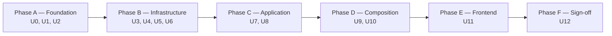

# feat: Sprint-8 real authentication module

## Summary

Sprint-8 retires the dev-mode baked JWT in favor of a real authentication service: per-tenant `users` table + Argon2id password hashing + JWT access tokens (15min) + Redis-stored refresh tokens (7d default; 30d when "remember me" is checked) with rotation + reuse detection + 3 fixed roles (Owner / Picker / Dispatcher) + admin user-management endpoints + Auth.Api as the centralized issuance surface + subdomain-per-tenant routing as the canonical workspace URL pattern. **Backend-focused** — the only frontend change is the login page's subdomain detection + remember-me checkbox + Logout button in the existing Sidebar.

Roughly **12 units** (U0 branch cut + U1–U11 work + U12 sign-off), ~1.5-2 weeks. Foundation layers land first (Domain → Ports → Infrastructure impls for Argon2 + Redis + JWT); Application handlers + Auth.Api endpoints + `shopflow-migrate` bootstrap follow; frontend httpClient + LoginScreen extension lands last; tag `v0.11.0-sprint-8` closes.

Branch: `feat/sprint-8-real-auth` cut from `v0.10.1-sprint-7.5`.

---

## Problem Frame

Sprint-6 shipped the first frontend vertical slice with a deliberate placeholder for auth: a stub `Auth.Api` (4-csproj quartet) that returns a baked JWT for any non-empty (email, password) tuple, hard-coding `tenant_slug = yensaokhanhhoa` and `role = tenant_seller`. This unblocked Sprint-6 to ship the Inventory write surface end-to-end without an upstream auth dependency, captured as Sprint-6 trade-off #8.

Sprint-7 closed that trade-off **in spirit** — `AddJwtBearer` lifted into `AddShopFlowDefaults` (kernel-wide JWT validation; SignalR hub access-token query redaction included) — but the baked-JWT issuance path stayed in place. Tokens validate correctly because the dev-mode JWT is signed with the same kernel secret; nothing yet authenticates a real user.

Sprint-7.5 closed the remaining Sprint-6/7 trade-offs (cosmetic SKU schema, camelCase wire, URL search-params, cursor pagination, flash-sale dual-write, saga UNIQUE, SagaPipeline split) + a cross-module index audit. The system is production-ready, big-data-seed-ready — except for the one remaining gap: there are no real users. The Owner role is the only role the codebase knows about, and even that's the dev-mode `tenant_seller` string.

This blocks every Sprint-9+ feature that needs role-based access (Picker pick-list, Ops Dispatcher orders triage, Settings/Users admin UI) and any portfolio demo that mentions "secure multi-tenant SaaS."

Sprint-8's job: **swap in real auth that's sturdy enough to demo + follows standard security**, without ballooning into MFA + self-service signup + audit log UI + email-verified flows (those land in Sprint-9+). The smallest viable shape that closes the gap and gives Sprint-9+ a real role-gate surface to ship on top of.

The subdomain-per-tenant URL pattern (`<slug>.shopflow.com`) ships in Sprint-8 because the login page is the natural moment to establish "which workspace am I in?" — the Slack / Linear / Notion pattern. **Helpful confirmation found during plan-time recon**: `TenantRoutingMiddleware` already extracts the subdomain (Phase-0-redux work); the Sprint-8 work is making it load-bearing for the new auth-endpoint allow-list (`[SkipTenantRouting]` + in-controller resolution from Host subdomain OR body field), not rewriting the middleware.

---

## Requirements

All R-IDs carried verbatim from origin: [docs/brainstorms/2026-05-20-sprint-8-real-auth-requirements.md](../brainstorms/2026-05-20-sprint-8-real-auth-requirements.md).

**Workspace + login UX** — R1, R2, R3, R4
**Tenant routing** — R5
**Authentication endpoints** — R6, R7, R8, R9, R10, R11
**Admin endpoints (Owner-only)** — R12, R13, R14, R15, R16
**Password storage** — R17, R18
**Refresh token storage** — R19, R20
**Roles** — R21, R22
**Schema** — R23, R24, R25
**Tenant provisioning bootstrap** — R26, R27
**Auth.Api retirement** — R28
**Operational + frontend changes** — R29, R30, R31

Acceptance Examples **AE1–AE7** from origin are carried into per-unit test scenarios below via `Covers AE<N>` links.

Origin actors **A1 (Owner)**, **A2 (Picker)**, **A3 (Dispatcher)**, **A4 (Anonymous)**, **A5 (Auth.Api)**, **A6 (other module APIs)**, **A7 (shopflow-migrate CLI)**, **A8 (TenantRoutingMiddleware)** are preserved as constraints on the implementation units below.

---

## High-Level Technical Design

*The following diagrams illustrate the intended approach and are directional guidance for review, not implementation specification. The implementing agent should treat them as context, not code to reproduce.*

### Component shape

```mermaid
graph LR
    Frontend["Frontend / LoginScreen"]
    Gateway["Gateway (YARP)"]
    AuthApi["Auth.Api"]
    OtherApis["Inventory / Outbound / Channel / Inbound / StockSync / Analytics"]
    SignalR["TenantHub (SignalR)"]
    Redis["Redis (refresh tokens)"]
    Catalog["shopflow_control (catalog DB)"]
    TenantDb["per-tenant DB (users + every other aggregate)"]

    Frontend -->|"<slug>.shopflow.com/api/auth/login"| Gateway
    Gateway -->|/api/auth/*| AuthApi
    Gateway -->|/api/inventory|/api/outbound|/api/channel...| OtherApis
    Gateway -->|/hub| SignalR

    AuthApi -->|"[SkipTenantRouting]; subdomain ?? body → catalog lookup"| Catalog
    AuthApi -->|scoped DbContext per request| TenantDb
    AuthApi -->|refresh tokens hashed + TTL| Redis

    OtherApis -->|"validate JWT (AddShopFlowDefaults Sprint-7 KTD6 unchanged)"| OtherApis
    SignalR -->|"validate JWT (unchanged)"| SignalR
```

### Login flow (subdomain path)

```mermaid
sequenceDiagram
    autonumber
    participant U as User (browser)
    participant FE as Frontend (LoginScreen)
    participant AA as Auth.Api
    participant TC as TenantCatalog
    participant DB as per-tenant users
    participant R as Redis
    participant T as JwtTokenIssuer

    U->>FE: Navigate https://yensaokhanhhoa.shopflow.com/login
    FE->>FE: Detect subdomain from window.location.hostname; hide workspace field
    U->>FE: Submit email + password + remember_me
    FE->>AA: POST /api/auth/login (Host: yensaokhanhhoa.shopflow.com)
    AA->>AA: [SkipTenantRouting] + extract subdomain from Host
    AA->>TC: LookupBySlug("yensaokhanhhoa")
    TC-->>AA: TenantInfo (connection string)
    AA->>DB: SELECT user WHERE lower(email)=lower(?)
    DB-->>AA: User row (or null)
    AA->>AA: Argon2id.Verify(password, user.PasswordHash)
    alt invalid
        AA-->>FE: 401 {code: "auth.invalid_credentials"}
    else valid
        AA->>T: IssueAccessToken(user, tenant_slug)
        T-->>AA: JWT (15-min TTL)
        AA->>R: IssueRefresh(user.Id, tenant_slug, remember_me)
        R-->>AA: opaque refresh hex
        AA->>DB: UPDATE users SET last_login_at = NOW()
        AA-->>FE: 200 {access_token, refresh_token, expires_in, user}
        FE->>FE: Store token pair in localStorage; redirect to /
    end
```

### Refresh + reuse-detection flow (with grace-window tombstone)

```mermaid
sequenceDiagram
    autonumber
    participant FE as Frontend httpClient
    participant AA as Auth.Api
    participant R as Redis

    FE->>AA: POST /api/auth/refresh {refresh_token}
    AA->>R: GET refresh:{tenant}:{user_id}:{hash}
    alt live key found
        R-->>AA: stored payload
        AA->>R: ATOMIC Lua: DEL old key + WRITE tombstone at refresh:rotated:{tenant}:{user_id}:{old_hash} (TTL 60s) pointing at new_hash + SET new key (same TTL bucket as old)
        R-->>AA: new opaque hex
        AA-->>FE: 200 {new access_token, new refresh_token, expires_in}
    else live key missing, tombstone fresh (concurrent retry — multi-tab / fetch retry / network jitter)
        AA->>R: GET refresh:rotated:{tenant}:{user_id}:{hash}
        R-->>AA: {next_hash: ...}
        Note over AA: Legitimate retry of just-rotated token. Return the new pair.
        AA-->>FE: 200 {access_token (from cache or re-issue from new_hash), refresh_token = next_hash, expires_in}
    else live key missing, tombstone missing (stale OR true reuse of long-rotated token)
        AA->>R: null
        Note over AA: Cannot distinguish "expired by TTL" from "stolen-then-replayed-late". Log out THIS session only (don't revoke all — false-positive harm > stale-token harm at this point).
        AA-->>FE: 401 {code: "auth.refresh_stale"}
    else presented hash matches tombstone for a DIFFERENT live session (true reuse)
        Note over AA: This is the stolen-token-replay path. Live session exists with a different hash; tombstone says this hash already rotated.
        AA->>R: SCAN refresh:{tenant}:{user_id}:* + DEL each (revoke all)
        AA-->>FE: 401 {code: "auth.refresh_reused"}
    end
```

### Token storage shape

```text
Redis key   refresh:{tenant_slug}:{user_id_guid}:{sha256_hex_of_token}
Redis value {"userId": "<guid>", "issuedAt": "<iso8601>", "expiresAt": "<iso8601>", "rememberMe": <bool>}
Redis TTL   matches (expiresAt - now); auto-evicts at expiry

JWT access token   HS256-signed
Claims             sub=<user_id_guid>, tenant_slug, role, email,
                   iat, exp (15-min TTL),
                   iss=AuthOptions.Issuer (default "shopflow-dev"),
                   aud=AuthOptions.Audience (default "shopflow-api")
                   — values read from config to match the existing kernel
                   validator defaults in AddShopFlowDefaults. Hardcoding
                   different strings causes total auth bypass at first
                   cross-module call. See KTD5.
```

### Per-tenant `users` schema (decision-level — see U3 for column declarations)

```text
users
  id              GUID PRIMARY KEY
  email           TEXT NOT NULL                          (case-insensitive UNIQUE via lower(email))
  password_hash   TEXT NOT NULL                          (Argon2id PHC string)
  role            TEXT NOT NULL CHECK IN ('Owner','Picker','Dispatcher')
  is_active       BOOLEAN NOT NULL DEFAULT TRUE
  created_at      TIMESTAMPTZ NOT NULL DEFAULT NOW()
  updated_at      TIMESTAMPTZ NOT NULL DEFAULT NOW()
  last_login_at   TIMESTAMPTZ NULL
```

---

## Implementation Units

### U0. Branch cut + opening commit

**Goal:** Establish the working branch with the brainstorm + plan + 10 KTDs recorded in the opening commit body so subsequent units have a single source of truth.

**Requirements:** N/A (procedural)

**Dependencies:** None

**Files:**
- `docs/brainstorms/2026-05-20-sprint-8-real-auth-requirements.md` (already exists)
- `docs/plans/2026-05-20-001-feat-sprint-8-real-auth-plan.md` (already exists)

**Approach:** Cut `feat/sprint-8-real-auth` from `v0.10.1-sprint-7.5`. Commit body summarises scope, the 10 KTDs below, and the unit ordering. No code changes in this commit.

**Verification:** Branch exists; opening commit references brainstorm + plan + sign-off paths; `git log v0.10.1-sprint-7.5..HEAD --oneline` shows the single commit.

---

### U1. Auth.Domain — User aggregate + UserRole enum + domain events

**Goal:** Define the User aggregate, UserRole enum, and 3 domain events (UserCreated, UserPasswordChanged, UserRoleChanged) as the canonical identity primitive for the Auth module.

**Requirements:** R21, R23, R25

**Dependencies:** U0

**Files:**
- `src/Services/Auth/ShopFlow.Auth.Domain/Entities/User.cs` (new)
- `src/Services/Auth/ShopFlow.Auth.Domain/UserRole.cs` (new)
- `src/Services/Auth/ShopFlow.Auth.Domain/Events/UserCreatedEvent.cs` (new)
- `src/Services/Auth/ShopFlow.Auth.Domain/Events/UserPasswordChangedEvent.cs` (new)
- `src/Services/Auth/ShopFlow.Auth.Domain/Events/UserRoleChangedEvent.cs` (new)
- `tests/ShopFlow.Auth.UnitTests/Domain/UserTests.cs` (new)
- `tests/ShopFlow.Auth.UnitTests/Domain/UserRoleTests.cs` (new)

**Approach:** `User` aggregate inherits `BaseEntity` (matches Sprint-1-redux + Sprint-7.5 U3 convention). Fields: `Id`, `Email` (LOWER-normalized on Create), `PasswordHash` (string — Argon2id PHC format; pre-hashed by Application layer before reaching the aggregate), `Role` (`UserRole` enum), `IsActive`, `LastLoginAt` (nullable). `CreatedAt` + `UpdatedAt` inherited from `BaseEntity`. Factory `User.Create(email, passwordHash, role)` validates: email non-empty + matches a simple sanity regex (`.+@.+\..+`), passwordHash non-empty, role is a defined enum value. Methods: `UpdatePassword(newHash)` raises `UserPasswordChangedEvent` + updates `UpdatedAt`; `SetRole(newRole)` no-ops when role matches current, otherwise updates + raises event; `Deactivate()` sets `IsActive = false` + updates `UpdatedAt`; `RecordLogin()` updates `LastLoginAt`. `UserRole` is a string-backed enum (PostgreSQL CHECK constraint mirrors the values).

**Execution note:** Test-first per Sprint-1-redux convention.

**Patterns to follow:**
- Sprint-7.5 U3 `Sku` aggregate at `src/Services/Inventory/ShopFlow.Inventory.Domain/Catalog/Sku.cs` — factory shape + invariant validation + domain event raise pattern
- `BaseEntity` at `src/Shared/ShopFlow.SharedKernel/Domain/BaseEntity.cs` — Id + audit-timestamp inheritance + domain-event buffer

**Test scenarios:**
- Happy: `User.Create("OPERATOR@example.com", "<phc>", UserRole.Owner)` succeeds; resulting `Email` is lowercased; `IsActive` is true; one `UserCreatedEvent` is queued.
- Validation: empty email → rejects with stable error code.
- Validation: malformed email (no @ or no .) → rejects.
- Validation: empty passwordHash → rejects.
- Happy: `UpdatePassword("<new-phc>")` updates `PasswordHash` + `UpdatedAt`; queues `UserPasswordChangedEvent`.
- Happy: `SetRole(UserRole.Picker)` on Owner row updates role + queues `UserRoleChangedEvent`.
- Edge: `SetRole(currentRole)` is no-op; no event queued; `UpdatedAt` unchanged.
- Happy: `Deactivate()` flips `IsActive` to false; updates `UpdatedAt`.
- Happy: `RecordLogin()` sets `LastLoginAt` to current UTC time.
- UserRole enum has exactly Owner / Picker / Dispatcher.

**Verification:** Test count grows by ~12 unit tests; all pass; aggregate has no public setters except via the named methods.

---

### U2. Auth.Application.Ports — interfaces + DTOs

**Goal:** Define the contracts the Application layer + handlers consume — `IUserRepository`, `IPasswordHasher`, `IRefreshTokenStore`, `ITokenIssuer` — plus the request/response DTOs the controllers use.

**Requirements:** R6, R7, R8, R10, R11, R12, R13, R14, R15, R16

**Dependencies:** U1

**Files:**
- `src/Services/Auth/ShopFlow.Auth.Application/Ports/IUserRepository.cs` (new)
- `src/Services/Auth/ShopFlow.Auth.Application/Ports/IPasswordHasher.cs` (new)
- `src/Services/Auth/ShopFlow.Auth.Application/Ports/IRefreshTokenStore.cs` (new)
- `src/Services/Auth/ShopFlow.Auth.Application/Ports/ITokenIssuer.cs` (new)
- `src/Services/Auth/ShopFlow.Auth.Application/Dtos/AuthDtos.cs` (new — `LoginRequest`, `LoginResponse`, `RefreshRequest`, `RefreshResponse`, `LogoutRequest`, `ChangePasswordRequest`)
- `src/Services/Auth/ShopFlow.Auth.Application/Dtos/AdminUserDtos.cs` (new — `CreateUserRequest`, `CreateUserResponse`, `SetRoleRequest`, `ResetPasswordResponse`, `UserSummary`, `ListUsersResponse`)

**Approach:** Pure interfaces + DTOs. No impl. `IUserRepository`: `GetByEmailAsync(email, ct)`, `GetByIdAsync(userId, ct)`, `AddAsync(user, ct)`, `UpdateAsync(user, ct)`, `ListAsync(page, pageSize, ct)`. `IPasswordHasher`: `Hash(plaintext)` returns PHC string; `Verify(plaintext, phc)` returns bool. `IRefreshTokenStore`: `IssueAsync(tenantSlug, userId, rememberMe, ct)` returns opaque token; `RotateAsync(tenantSlug, userId, presentedToken, ct)` returns `RotateResult` (new token | Stale | ReuseDetected); `RevokeAsync(tenantSlug, userId, token, ct)`; `RevokeAllForUserAsync(tenantSlug, userId, ct)`. `ITokenIssuer`: `IssueAccessToken(user, tenantSlug)` returns JWT string + expiry timestamp.

**Test scenarios:** `Test expectation: none -- pure interfaces + DTOs; tests live alongside the implementations in U3-U6.`

**Verification:** All interfaces compile; consumed by handlers in U7+U8.

---

### U3. Auth.Infrastructure — AuthDbContext + UserConfiguration + AddUsers migration + UserRepository

**Goal:** Per-tenant `users` table with the agreed schema + EF mapping + UserRepository implementation + migration safe to apply against any existing tenant DB.

**Requirements:** R23, R24, R25

**Dependencies:** U1, U2

**Files:**
- `src/Services/Auth/ShopFlow.Auth.Infrastructure/AuthDbContext.cs` (new)
- `src/Services/Auth/ShopFlow.Auth.Infrastructure/EntityConfigurations/UserConfiguration.cs` (new)
- `src/Services/Auth/ShopFlow.Auth.Infrastructure/Migrations/20260520000001_AddUsers.cs` (new — `[Migration]` + `[DbContext]` attrs per AGENTS.md §3.23)
- `src/Services/Auth/ShopFlow.Auth.Infrastructure/Repositories/UserRepository.cs` (new)
- `tests/ShopFlow.Auth.IntegrationTests/ShopFlow.Auth.IntegrationTests.csproj` (new — mirror Sprint-5's StockSync.IntegrationTests csproj shape: TargetFramework + refs to Auth.Infrastructure + Auth.Api + Microsoft.AspNetCore.Mvc.Testing + Testcontainers.PostgreSql + xunit + FluentAssertions)
- `tests/ShopFlow.Auth.UnitTests/Domain/UserConfigurationTests.cs` (optional — schema-property assertion, not strictly needed)
- `tests/ShopFlow.Auth.IntegrationTests/Repositories/UserRepositoryTests.cs` (new — Testcontainers Postgres)
- `tests/ShopFlow.Auth.IntegrationTests/Migrations/AddUsersMigrationSmokeTests.cs` (new — asserts table + index + CHECK constraint land)

**Approach:** `AuthDbContext` registered scoped (Sprint-5 U7 K12 pattern — `IRequestContext.DbConnectionString` per-request binding). One `DbSet<User>`. `UserConfiguration` maps to table `users`; PK on `Id`; unique index on `lower(email)` named `ux_users_email_lower`; CHECK constraint `chk_users_role` enumerating `Owner / Picker / Dispatcher`. Migration `AddUsers` creates the table + index + constraint via `mb.Sql` (the unique-on-LOWER expression requires raw SQL). `UserRepository`: `GetByEmailAsync` uses `EF.Functions.ILike` or explicit `LOWER(email) = LOWER(?)` filter; `AddAsync` catches Postgres 23505 (unique violation) + returns a tagged `EmailInUseError` result without throwing; `UpdateAsync` saves changes; `ListAsync` pages with stable ordering by `created_at DESC`, `id DESC` (matches the cursor convention from Sprint-7.5 U6).

**Patterns to follow:**
- Sprint-1-redux migration `20260512000001_InitialInventorySchema` for migration scaffolding + attribute order
- Sprint-7.5 U3 `SkuRepository` (`src/Services/Inventory/ShopFlow.Inventory.Infrastructure/Repositories/SkuRepository.cs`) for `_db` + `IRequestContext` constructor injection + UNIQUE-23505 catch shape
- Sprint-5 U7 K12 pattern in `CachingSkuFlagRepository` for tenant-binding from singleton context (relevant when the auth login path resolves tenant BEFORE opening the scoped DbContext)

**Test scenarios:**
- Repo: `GetByEmailAsync("missing@example.com")` returns null.
- Repo: case-insensitive email match — insert `Owner@Example.COM`, retrieve via `owner@example.com`.
- Repo: `AddAsync` succeeds for a fresh row; row appears in subsequent `GetByEmailAsync`.
- Repo: duplicate email (different case) → `AddAsync` returns an `EmailInUseError` (does not throw).
- Repo: `UpdateAsync` after `user.SetRole(UserRole.Picker)` persists the new role.
- Repo: role outside the enum is rejected by the DB CHECK constraint (raw-SQL insert via test fixture verifies — covered separately below).
- Repo: `ListAsync(page=1, pageSize=2)` returns first 2 ordered DESC by `created_at`.
- Migration smoke: After `MigrateAsync()`, `pg_indexes` shows `ux_users_email_lower`; `pg_constraint` shows `chk_users_role` with the expected expression body.

**Verification:** Integration tests green in CI; migration smoke green.

---

### U4. Auth.Infrastructure — Argon2idPasswordHasher

**Goal:** OWASP-aligned password hashing implementation using `Konscious.Security.Cryptography.Argon2` with PHC modular string encoding.

**Requirements:** R17, R18

**Dependencies:** U2

**Files:**
- `Directory.Packages.props` (modify — add `Konscious.Security.Cryptography.Argon2` PackageVersion)
- `src/Services/Auth/ShopFlow.Auth.Infrastructure/ShopFlow.Auth.Infrastructure.csproj` (modify — PackageReference)
- `src/Services/Auth/ShopFlow.Auth.Infrastructure/Hashing/Argon2idPasswordHasher.cs` (new)
- `src/Services/Auth/ShopFlow.Auth.Infrastructure/Hashing/Argon2Options.cs` (new — bound from `Auth:Argon2` config section)
- `tests/ShopFlow.Auth.UnitTests/Hashing/Argon2idPasswordHasherTests.cs` (new)

**Approach:** `Argon2idPasswordHasher : IPasswordHasher`. `Hash(plaintext)`: generates 16-byte cryptographically-random salt (RNG), runs Argon2id with configured parameters (default OWASP 2026 baseline: `Iterations=4, MemorySize=65536 KB, DegreeOfParallelism=4`), encodes result as PHC modular string `$argon2id$v=19$m=65536,t=4,p=4$<base64-salt>$<base64-hash>`. `Verify(plaintext, hashed)`: parses PHC string to extract params + salt + expected hash, re-runs Argon2 with those exact params, compares result via `CryptographicOperations.FixedTimeEquals`. Parameters persist in the hash so future tuning doesn't break existing hashes (Sprint-9+ can roll new parameters without forcing reset). `Argon2Options` exposes the defaults for runtime tuning via config.

**Patterns to follow:** No existing local pattern — net new. External: OWASP Password Storage Cheat Sheet 2026 + Konscious GitHub README. Document the Konscious version pin in the U4 commit body.

**Test scenarios:**
- Happy: `Hash("password123")` returns non-empty string starting with `$argon2id$v=19$`.
- Round-trip: `Verify(plaintext, Hash(plaintext))` returns true.
- Negative: `Verify("wrong-password", validHash)` returns false.
- Negative: `Verify("password", "$argon2id$broken-malformed")` returns false (does not throw).
- Randomness: two `Hash("samePassword")` calls produce different PHC strings (different salts).
- Round-trip across instances: hash from instance A verifies against instance B with the same options.
- Edge: empty plaintext throws `ArgumentException` (callers should validate upstream).
- Parameter tuning: changing `Argon2Options.Iterations` produces a different hash for the same plaintext + salt.
- Timing: `Verify` against a wrong-length hash uses fixed-time comparison (no early return on length mismatch surfaces a side channel; verified by checking the implementation routes through `FixedTimeEquals`).

**Verification:** All tests green; CPM bump committed; hash format matches OWASP spec.

---

### U5. Auth.Infrastructure — RedisRefreshTokenStore

**Goal:** Refresh token issuance + rotation + reuse detection + revocation against Redis with TTL-based expiry.

**Requirements:** R8, R9, R10, R19, R20

**Dependencies:** U2

**Files:**
- `Directory.Packages.props` (modify — add explicit `StackExchange.Redis` PackageVersion 2.11.0 AND `Testcontainers.Redis` PackageVersion 4.0.0 for the U5 + U9 integration tests; CPM lockdown means a `PackageReference` without a central pin will fail at build)
- `src/Services/Auth/ShopFlow.Auth.Infrastructure/ShopFlow.Auth.Infrastructure.csproj` (modify — PackageReference)
- `src/Services/Auth/ShopFlow.Auth.Infrastructure/Storage/RedisRefreshTokenStore.cs` (new)
- `src/Services/Auth/ShopFlow.Auth.Infrastructure/Storage/RefreshTokenRecord.cs` (new — internal JSON DTO stored in Redis)
- `src/Services/Auth/ShopFlow.Auth.Infrastructure/Storage/RefreshTokenOptions.cs` (new — `RefreshTtlDays = 7`, `RememberMeTtlDays = 30`)
- `tests/ShopFlow.Auth.IntegrationTests/Storage/RedisRefreshTokenStoreTests.cs` (new — Testcontainers Redis)

**Approach:** `RedisRefreshTokenStore : IRefreshTokenStore` injects `IConnectionMultiplexer` (registered singleton in `AddAuthModule`). `IssueAsync`: generates 32-byte cryptographic-random opaque token, SHA-256-hex hashes it, builds key `refresh:{tenantSlug}:{userId}:{hashHex}`, builds JSON value `{userId, issuedAt, expiresAt, rememberMe}`, calls `StringSet` with TTL = `rememberMe ? 30d : 7d`. Returns plaintext token to caller.

`RotateAsync`: uses a Lua script for atomicity — `GET old + DEL old + write a tombstone pointer at refresh:rotated:{tenant}:{userId}:{oldHashHex} with TTL = grace_window_seconds (default 60s) + SET new key with the original TTL bucket`. The tombstone records that the old hash was JUST rotated (not stolen-and-replayed). Decision logic on the next presented refresh:

| Presented hash found at... | Meaning | Action |
|---|---|---|
| `refresh:{tenant}:{user}:{hash}` (live key) | valid token | rotate; emit new pair |
| `refresh:rotated:{tenant}:{user}:{hash}` (tombstone, fresh) | concurrent retry of just-rotated token (browser fetch retry, multi-tab race) | **return the NEW token** that the original rotate already issued — Lua reads the tombstone's `next_hash` pointer to find the new key; treat as success, not reuse |
| neither | unknown token (expired, never issued, or rotated > grace_window ago and tombstone evicted) | return `RotateResult.Stale` — log out current session ONLY (don't revoke all sessions; we can't distinguish "stale due to TTL" from "stolen-then-replayed-late"; defense + convenience converge on "make this session re-login") |
| live key + presented hash matches a DIFFERENT tombstone for same user | true reuse (the legitimate session already rotated past this hash) | reuse-detection: `RevokeAllForUserAsync` + return `RotateResult.ReuseDetected` |

This is the OWASP refresh-token-rotation-with-grace-window pattern. The 60-sec grace handles the concurrent-retry false-positive that's otherwise endemic under flaky-network + multi-tab. `RevokeAsync`: `KeyDelete` on the specific hash key + write tombstone for grace_window. `RevokeAllForUserAsync`: `SCAN` pattern `refresh:{tenant}:{userId}:*` + `DEL` each + a separate `revoked:{tenant}:{userId}` marker with brief TTL so the next /refresh in that grace window sees a deliberate revocation, not a missing key.

**Patterns to follow:**
- No existing Redis usage in the codebase (verified by grep). New pattern.
- StackExchange.Redis singleton-ConnectionMultiplexer best practice — registered once in `AddAuthModule`, never new'd per-request.

**Technical design** (directional, not implementation-spec):

```text
-- Lua: rotate-refresh.lua (atomic)
local old = redis.call('GET', KEYS[1])
if not old then return nil end
redis.call('DEL', KEYS[1])
redis.call('SET', KEYS[2], ARGV[1], 'PX', ARGV[2])
return old
```

**Test scenarios:**
- Happy: `IssueAsync(tenant, user, rememberMe=false)` returns a plaintext token; the matching Redis key exists with TTL ~ 7d (allow 1-min slop).
- Happy: `IssueAsync(... rememberMe=true)` produces 30d TTL.
- Rotation happy: `RotateAsync` with a valid token returns a new token; the old key is deleted; the new key exists.
- Reuse detection: rotate token A → token B; rotate the original A again → returns `ReuseDetected` AND every key for that user_id is deleted (including B).
- Revoke single: `RevokeAsync` deletes the specific key without affecting other sessions for the same user.
- Revoke all: `RevokeAllForUserAsync` deletes every `refresh:{tenant}:{user_id}:*` key; other tenants/users unaffected.
- Race: two parallel `RotateAsync` calls on the same token — exactly one succeeds, the other gets `Stale` (key gone, but token presented is also gone from Redis; treat as reuse).
- TTL bucket carries through rotation: if rememberMe=true on issue, rotated token also has 30d TTL bucket.

**Verification:** Integration tests green against Testcontainers Redis; Lua script bytes committed alongside.

---

### U6. Auth.Infrastructure — JwtTokenIssuer

**Goal:** JWT access-token issuance with the kernel HS256 secret + claim shape that the existing `AddShopFlowDefaults` validator accepts.

**Requirements:** R7

**Dependencies:** U2

**Files:**
- `src/Services/Auth/ShopFlow.Auth.Infrastructure/Tokens/JwtTokenIssuer.cs` (new)
- `src/Services/Auth/ShopFlow.Auth.Infrastructure/Tokens/JwtIssuerOptions.cs` (new — `AccessTokenTtlMinutes = 15`)
- `tests/ShopFlow.Auth.UnitTests/Tokens/JwtTokenIssuerTests.cs` (new)

**Approach:** Implementation uses `Microsoft.IdentityModel.JsonWebTokens.JsonWebTokenHandler` (already used in the Sprint-6 stub — single library, no new deps). `IssueAccessToken(User, tenantSlug)`: builds `SecurityTokenDescriptor` with `Subject` containing claims `sub=user.Id.ToString()`, `tenant_slug`, `role=user.Role.ToString()`, `email`, `iat`, `exp` (now + 15min). `iss` + `aud` are READ FROM `AuthOptions.Issuer` + `AuthOptions.Audience` (config-driven, NOT hardcoded) — values default to `shopflow-dev` / `shopflow-api` to match every existing module's `appsettings.json` + the kernel validator's defaults in `AddShopFlowDefaults`. This is the canonical naming until the W6 split forces a revisit (then rename across all 6 modules + Auth coordinated). Signs with the kernel `Auth:DevSecret` HMAC key (same key the validator in `AddShopFlowDefaults` uses, so tokens round-trip). Returns the JWT string + expiry timestamp.

**Patterns to follow:**
- Sprint-6 stub `AuthController` already builds a JWT via `JsonWebTokenHandler` — its token-building helper is the reference shape, minus the demo claims (`tenant_seller` retires).
- `AddShopFlowDefaults` JwtBearer config at `src/Shared/ShopFlow.SharedKernel/Infrastructure/AddShopFlowDefaults.cs` line 241 — `TokenValidationParameters` already expects `iss="shopflow-wms"` and `aud="shopflow-modules"` (verify; otherwise the issuer needs to match exactly).

**Test scenarios:**
- Happy: `IssueAccessToken(user, "tenant1")` returns a 3-segment dot-separated string.
- Decode: the issued token decodes (via `JsonWebTokenHandler.ReadJsonWebToken`) and the claims include `sub`, `tenant_slug`, `role`, `email`, `iss`, `aud`, `iat`, `exp`.
- Round-trip: the issued token validates against a `TokenValidationParameters` instance built from the same `AuthOptions.DevSecret` (negative test: validates against a different secret returns failure).
- Expiry: exp claim is `iat + 15min`; jitter < 5sec from system clock.
- Different user → different `sub` claim.
- Role enum properly encoded — Owner → string "Owner", not the underlying int.

**Verification:** Tests green; kernel + issuer + validator agree on claim shape.

---

### U7. Auth.Application — Login + Refresh + Logout + ChangePassword handlers

**Goal:** MediatR command handlers for the 4 user-facing auth flows. Each composes ports (`IUserRepository` + `IPasswordHasher` + `IRefreshTokenStore` + `ITokenIssuer`) without touching infrastructure directly.

**Requirements:** R6, R8, R9, R10, R11, F1, F2, F3, F4, F7

**Dependencies:** U2, U4, U5, U6, U3

**Files:**
- `src/Services/Auth/ShopFlow.Auth.Application/Commands/LoginCommand.cs` (new) + `LoginCommandHandler.cs` (new)
- `src/Services/Auth/ShopFlow.Auth.Application/Commands/RefreshTokenCommand.cs` (new) + `RefreshTokenCommandHandler.cs` (new)
- `src/Services/Auth/ShopFlow.Auth.Application/Commands/LogoutCommand.cs` (new) + `LogoutCommandHandler.cs` (new)
- `src/Services/Auth/ShopFlow.Auth.Application/Commands/ChangePasswordCommand.cs` (new) + `ChangePasswordCommandHandler.cs` (new)
- `tests/ShopFlow.Auth.UnitTests/Handlers/LoginCommandHandlerTests.cs` (new)
- `tests/ShopFlow.Auth.UnitTests/Handlers/RefreshTokenCommandHandlerTests.cs` (new)
- `tests/ShopFlow.Auth.UnitTests/Handlers/LogoutCommandHandlerTests.cs` (new)
- `tests/ShopFlow.Auth.UnitTests/Handlers/ChangePasswordCommandHandlerTests.cs` (new)

**Approach:** Each handler returns `Result<T>` (Sprint-1-redux convention) — `Result<LoginResponse>` etc. Login: lookup user by email; if not found OR `!user.IsActive` → return `Failure("auth.invalid_credentials")` (same string for both to prevent enumeration). Verify password via hasher; on mismatch same failure. On success: call `RecordLogin()`, save, issue tokens, return `Success(LoginResponse)`. Refresh: call `IRefreshTokenStore.RotateAsync`; on `ReuseDetected` → return `Failure("auth.refresh_reused")`; on success → issue new access token paired with the new opaque refresh + return. Logout: extract refresh from request body, call `RevokeAsync`, return success. ChangePassword: verify current password, hash new (validate length ≥ 8), update user, save, call `RevokeAllForUserExceptAsync` (a new port method? OR: revoke all + the caller re-issues from controller — see U2 design). All handlers operate within the per-request scoped `AuthDbContext` that the controller's tenant-resolution step has bound.

**Execution note:** Test-first per Sprint-1-redux convention; substitute ports via NSubstitute.

**Patterns to follow:**
- Sprint-3-redux `Outbound.Application` MediatR handlers — `Result<T>` shape + stable error codes
- Sprint-7.5 U4 `UpdateSkuCommandHandler` — same MediatR pattern Sprint-8 mirrors

**Test scenarios (Login):**
- Happy (Covers AE1): valid email + password → returns token pair; `user.LastLoginAt` persisted.
- Failure: missing user → `auth.invalid_credentials` (no enumeration).
- Failure: wrong password → `auth.invalid_credentials`.
- Failure: inactive user → `auth.invalid_credentials`.
- Happy: rememberMe=true → refresh TTL bucket is 30d (verified via `IRefreshTokenStore` substitute spy).

**Test scenarios (Refresh):**
- Happy: valid refresh → new pair.
- Reuse detection (Covers AE3): rotate token, then present the original again → `auth.refresh_reused` + every key for user is revoked.
- Failure: unknown refresh → `auth.invalid_credentials`.
- Failure: expired refresh (Redis already evicted) → same as unknown.

**Test scenarios (Logout):**
- Happy (Covers F4): refresh token revoked; other sessions for same user unaffected.
- Idempotent: logout with already-revoked token returns success (no enumeration).

**Test scenarios (ChangePassword):**
- Happy: current verified → hash updated; all other sessions revoked; current session's refresh stays valid.
- Failure: current wrong → `auth.invalid_credentials`.
- Validation: new password < 8 chars → `auth.password_too_short`.
- Validation: new password equals current → `auth.password_unchanged` (defensive; allow if not enforced).

**Verification:** All 4 handlers' tests pass; substitute interactions match the documented flows; no real Redis / DB needed at unit-test layer.

---

### U8. Auth.Application — admin user-management handlers

**Goal:** Owner-role-gated handlers for tenant user CRUD — Create + ListUsers + SetRole + ResetPassword + Deactivate.

**Requirements:** R12, R13, R14, R15, R16, F5

**Dependencies:** U2, U4, U5, U3

**Files:**
- `src/Services/Auth/ShopFlow.Auth.Application/Commands/CreateUserCommand.cs` + `CreateUserCommandHandler.cs` (new — different input shape + returns temp password → its own command)
- `src/Services/Auth/ShopFlow.Auth.Application/Commands/UpdateUserCommand.cs` + `UpdateUserCommandHandler.cs` (new — **consolidated per post-doc-review SG-003**: single command with operation discriminator enum `{ SetRole, ResetPassword, Deactivate }`. Three controller endpoints map to three different `UpdateUserCommand` shapes; one handler routes the operation via switch. Reduces U8 handler files from 5 to 3 without losing R14/R15/R16 coverage.)
- `src/Services/Auth/ShopFlow.Auth.Application/Queries/ListUsersQuery.cs` + `ListUsersQueryHandler.cs` (new — different output shape → its own query)
- `src/Services/Auth/ShopFlow.Auth.Application/Services/PasswordGenerator.cs` (new — generates a 16-char URL-safe random password)
- `tests/ShopFlow.Auth.UnitTests/Handlers/CreateUserCommandHandlerTests.cs` (new)
- `tests/ShopFlow.Auth.UnitTests/Handlers/UpdateUserCommandHandlerTests.cs` (new — single test file covers all three discriminator branches: SetRole, ResetPassword, Deactivate)
- `tests/ShopFlow.Auth.UnitTests/Handlers/ListUsersQueryHandlerTests.cs` (new)
- `tests/ShopFlow.Auth.UnitTests/Services/PasswordGeneratorTests.cs` (new)

**Approach:** CreateUser: generate password via `PasswordGenerator`, hash, persist via `User.Create` + `IUserRepository.AddAsync`, return `CreateUserResponse(id, email, role, temporaryPassword)`. SetRole: load + `User.SetRole(newRole)` + `UpdateAsync`. ResetPassword: load + generate new password + hash + `User.UpdatePassword(newHash)` + revoke all refresh tokens for the user. Deactivate: load + `User.Deactivate()` + `UpdateAsync` + revoke all. ListUsers: simple pagination. `PasswordGenerator`: 16-char random from a vetted alphabet (alphanumeric + a small symbol set; no ambiguous chars like `0/O`, `1/l/I`).

**Patterns to follow:**
- Sprint-7.5 U4 `UpdateSkuCommandHandler` — Result<T> + repo round-trip
- Sprint-7.5 U5 outbox-emit-on-changed pattern (not applicable here unless admin events ride outbox — for Sprint-8 they don't)

**Test scenarios (CreateUser):**
- Happy (Covers AE5): create with `Picker` role → returns 201-shape response with temporary password ≥ 16 chars; user persisted; can immediately login with the temp password (round-trip test via Login handler + the persisted user).
- Failure: duplicate email → `users.email_in_use` (uses the 23505 catch from U3).
- Validation: invalid email format → `users.email_invalid`.
- Generated password complexity: 16 chars; mixed letters/digits/symbols; no ambiguous chars.

**Test scenarios (SetRole):**
- Happy: change Owner → Picker; row updated; `UserRoleChangedEvent` queued.
- Edge: setting same role is no-op (no event; no `UpdatedAt` bump).
- Failure: user not found → `users.not_found`.

**Test scenarios (ResetPassword):**
- Happy: hash rotated; all refresh tokens for user revoked; response includes new temporary password.
- Failure: user not found → `users.not_found`.

**Test scenarios (DeactivateUser):**
- Happy: `is_active` set false; all refresh tokens for user revoked; subsequent login → `auth.invalid_credentials`.
- Idempotent: deactivating already-inactive user is a no-op.

**Test scenarios (ListUsers):**
- Happy: paginated 2-of-3 returns first 2 ordered DESC by created_at.
- Empty: returns empty page when no users.

**Test scenarios (PasswordGenerator):**
- Length is 16.
- 100 generated passwords are all distinct.
- No ambiguous chars (`0`, `O`, `1`, `l`, `I`) in output.
- Output passes the min-8 validator + contains chars from at least 3 categories.

**Verification:** Test count grows by ~25 unit tests; all pass.

---

### U9. Auth.Api — endpoints + Program.cs rewrite + delete stub controller + `AddAuthModule`

**Goal:** Real `AuthController` (`/api/auth/login|refresh|logout|me/password`) + new `AuthAdminController` (Owner-gated). Auth.Api Program.cs lifted to module-pattern parity (`AddShopFlowDefaults` + `AddAuthModule` + `AddControlPlane`). Delete the Sprint-6 stub demo logic.

**Requirements:** R5, R6, R7, R8, R10, R11, R12, R13, R14, R15, R16, R28

**Dependencies:** U7, U8

**Files:**
- `src/Services/Auth/ShopFlow.Auth.Api/Controllers/AuthController.cs` (REWRITE — delete demo logic; thin controllers dispatch MediatR)
- `src/Services/Auth/ShopFlow.Auth.Api/Controllers/AuthAdminController.cs` (new — `[Authorize(Roles = "Owner")]`)
- `src/Services/Auth/ShopFlow.Auth.Api/Program.cs` (REWRITE — full composition)
- `src/Services/Auth/ShopFlow.Auth.Api/AuthOptions.cs` (REWRITE — drop `DemoRole` + `DemoTenantSlug`; add `Argon2` + `RefreshToken` nested sections)
- `src/Services/Auth/ShopFlow.Auth.Infrastructure/AuthServiceCollectionExtensions.cs` (new — `AddAuthModule` extension)
- `src/Services/Auth/ShopFlow.Auth.Api/appsettings.json` (modify — drop demo defaults; add Argon2 + RefreshToken sections with sane prod defaults)
- `src/ApiGateway/ShopFlow.Gateway/appsettings.json` (modify — change existing `/auth/{**catch-all}` route to `/api/auth/{**catch-all}` to align with other modules' `/api/<module>/...` convention; verified during doc-review that current route is `/auth` without the `/api` prefix)
- `src/Services/Auth/ShopFlow.Auth.Api/Controllers/AuthController.cs` (modify — `[Route("auth")]` → `[Route("api/auth")]`; matches the new gateway route + the other modules' convention)
- `web/src/api/auth.ts` (NEW — see U11 — caller posts to `/api/auth/login` etc.; coordinates with the route attribute change above)
- `web/src/components/auth/LoginScreen.test.tsx` (modify — update URL assertions from `/auth/login` to `/api/auth/login`)
- `src/AppHost/ShopFlow.AppHost/Program.cs` (modify — wire the Aspire `redis` resource into Auth.Api via `WithReference(redis)` AND wire the existing `postgres` resource via `WithReference(postgres)` so Auth.Api can resolve `ControlPlane:ConnectionString` from Aspire env injection — without it `AddControlPlane` throws at startup. Mirrors Sprint-5 StockSync.Api AppHost wiring.)
- `tests/ShopFlow.Auth.IntegrationTests/Controllers/AuthControllerTests.cs` (new — WebApplicationFactory + happy-path login + refresh + logout + change-password)
- `tests/ShopFlow.Auth.IntegrationTests/Controllers/AuthAdminControllerTests.cs` (new — create + list + set-role + reset-password + deactivate)
- `tests/ShopFlow.Auth.IntegrationTests/Controllers/TenantResolutionTests.cs` (new — Covers AE2 / R5)

**Approach:** `AuthController` carries `[SkipTenantRouting]` class-level. Each endpoint either reads tenant from Host subdomain (preferred) or body `tenant_slug` field (fallback). **R5's subdomain-first priority applies only to the auth endpoints because they run before any JWT is validated**; all other endpoints retain the existing `TenantRoutingMiddleware` priority (header > JWT > subdomain — `src/Shared/ShopFlow.SharedKernel/Infrastructure/TenantRoutingMiddleware.cs` line 157 unchanged). The in-controller resolver:

1. **Host-suffix allowlist check** (post-doc-review SEC-004 promotion from Outstanding Question to hard requirement): validate that the Host header ends in one of `{shopflow.com, shopflow.local, localhost}` (configurable via `Auth:TrustedHostSuffixes`). Reject with 400 `host.untrusted` if not — prevents Host-header injection attacks (e.g., `evil.attacker.com` carrying `yensaokhanhhoa.shopflow.com` in a path).
2. **Subdomain extraction** via `TenantRoutingMiddleware.ExtractSubdomain` (shared logic).
3. **Body fallback**: if subdomain absent, read `tenant_slug` from request body.
4. **`ReservedSlugs` check**: extracted slug must not be in the reserved list (post-doc-review ADV-001).
5. Call `ITenantCatalog.LookupBySlugAsync`, open scoped `AuthDbContext` bound to that tenant.
6. Dispatch MediatR command, return DTO.

`AuthAdminController` carries `[Authorize(Roles = "Owner")]` + regular tenant routing (Owner is already authenticated → JWT claim carries tenant).

**Response-body redaction (post-doc-review SEC-003)**: register an `IOtelResponseBodyFilter` (or equivalent OpenTelemetry exporter filter) that strips the `temporary_password` field from any captured span attribute / response-body trace. This is independent of whether observability instrumentation is enabled today — sets the invariant at the code level so a future operator enabling response-body capture doesn't surface plaintext credentials. Same pattern applies to `CreateUserResponse` + `ResetPasswordResponse` DTOs. Verification step in U9 asserts the field doesn't appear in OTLP spans during AuthAdminController tests. `AddAuthModule`: registers `AuthDbContext`, `Argon2idPasswordHasher` (scoped — no state), `RedisRefreshTokenStore` (scoped — uses singleton `IConnectionMultiplexer`), `JwtTokenIssuer`, `UserRepository`, `PasswordGenerator`, and the MediatR handler scan. Singleton `IConnectionMultiplexer` connected via `ConnectionMultiplexer.ConnectAsync(redisConnectionString)` from `AddAuthModule`. AppHost's `redis` Aspire resource gets `WithReference(redis)` on the Auth.Api project so the connection string appears in env. Auth.Api Program.cs reads the connection string via `builder.Configuration.GetConnectionString("redis")` (Aspire convention).

**Patterns to follow:**
- Sprint-2-redux Inbound.Api Program.cs full composition — `AddShopFlowDefaults` → `AddControlPlane` → `AddInboundModule` → `AddShopFlowControllers` → middleware pipeline (`UseProblemDetails` + `UseAuthentication` + `UseAuthorization` + `UseTenantRouting` + `MapControllers`)
- Sprint-7.5 U1 `AddShopFlowControllers` helper — already in Auth.Api Program.cs from Sprint-7.5; preserve
- Sprint-7 `MapShopFlowHubs` skipped — Auth.Api doesn't host the hub
- Sprint-4 webhook controllers' `[SkipTenantRouting]` usage at `src/Services/Channel/ShopFlow.Channel.Api/Controllers/WebhooksController.cs` — the bypass pattern + in-controller tenant resolution

**Endpoint shapes** (directional; final routes confirmed during implementation).

Legend: `(auth req'd)` means the endpoint requires a valid `Authorization: Bearer <access_token>` header — not "any auth shape." Where the endpoint also expects a body field (e.g., logout's `refresh_token`), both the header AND the body field are required and validated by the controller.

```text
POST /api/auth/login            { tenant_slug?, email, password, remember_me? }     → 200 { access_token, refresh_token, expires_in, user }
POST /api/auth/refresh          { refresh_token }                                   → 200 { access_token, refresh_token, expires_in }
POST /api/auth/logout           { refresh_token }                       (auth req'd) → 204
POST /api/auth/me/password      { current_password, new_password }      (auth req'd) → 204
POST /api/auth/admin/users      { email, role }                         (Owner req'd) → 201 { id, email, role, temporary_password }
GET  /api/auth/admin/users      ?page=&pageSize=                         (Owner req'd) → 200 { items, total }
PUT  /api/auth/admin/users/{id}/role          { role }                  (Owner req'd) → 204
POST /api/auth/admin/users/{id}/reset-password                          (Owner req'd) → 200 { temporary_password }
DELETE /api/auth/admin/users/{id}                                       (Owner req'd) → 204
```

**Test scenarios:**
- Login happy via subdomain (Covers AE1): `Host: yensaokhanhhoa.shopflow.com` + body without `tenant_slug` → tenant resolved from Host; token pair returned.
- Login happy via body fallback: body includes `tenant_slug`; no recognized subdomain → tenant resolved from body.
- Login conflict (Covers AE2 / R5): both subdomain and body present, disagree → 400 with code `tenant.source_conflict`.
- Login: nonexistent tenant slug → **401 with code `auth.invalid_credentials`** (post-doc-review ADV-004: same response shape as wrong-user / wrong-password to close the tenant-enumeration side channel). Internal log records the actual cause (`tenant_not_found` vs `user_not_found` vs `password_mismatch`) for forensics.
- Login: invalid creds → 401 with code `auth.invalid_credentials`.
- Refresh: happy round-trip + reuse-detection paths verified end-to-end through the controller.
- Logout: with valid access + refresh → 204; subsequent refresh attempt → 401.
- Change password: works through the auth pipeline.
- Admin create user: Owner can call; Picker call returns 403; new user immediately logs in with the temp password (Covers AE5).
- Admin set role / reset password / deactivate: each enforces Owner-only.
- Stub demo logic deleted (Covers AE7): `grep -r "tenant_seller" src/` returns no hits; `grep -r "DemoTenantSlug\|DemoRole" src/` returns no hits.

**Verification:** Integration tests green; manual smoke: subdomain dev (with hosts entry) → login → call an Inventory endpoint with the new access token → 200.

---

### U10. shopflow-migrate — `provision` owner-seed extension

**Goal:** Tenant-bootstrap one default Owner with a generated password printed once to stdout during `shopflow-migrate provision <slug>`.

**Requirements:** R26, R27, F6

**Dependencies:** U4 (for password hashing)

**Files:**
- `tools/shopflow-migrate/Commands/ProvisionCommand.cs` (modify — add `--owner-email` + `--owner-password` + `--owner-password-from-env` flag handling + slug-reservation check + seed call after `MigrateAsync`)
- `tools/shopflow-migrate/Commands/SeedOwnerCommand.cs` (NEW — `seed-owner <slug>` subcommand for retrofitting Owner into existing tenants; same flag set as Provision)
- `tools/shopflow-migrate/Provisioning/OwnerSeed.cs` (new — delegates to `Auth.Infrastructure.PasswordGenerator` + `Auth.Infrastructure.Argon2idPasswordHasher`; INSERTs row via raw `Npgsql` command. **Sprint-8 doc-review SG-001 / ADV-010 fix**: no longer duplicates hashing logic — the CLI takes a ProjectReference to `Auth.Infrastructure` (mirrors the existing `Inventory.Infrastructure` reference).)
- `tools/shopflow-migrate/ArgParser.cs` (modify — register the three new flags + the `seed-owner` subcommand)
- `tools/shopflow-migrate/ShopFlow.Migrate.csproj` (modify — ProjectReference `..\..\src\Services\Auth\ShopFlow.Auth.Infrastructure\ShopFlow.Auth.Infrastructure.csproj`; remove the standalone `Konscious.Security.Cryptography.Argon2` PackageReference — pulls in transitively via Auth.Infrastructure)
- `tests/ShopFlow.Migrate.UnitTests/Commands/ProvisionCommandTests.cs` (modify — add owner-seed scenarios)
- `tests/ShopFlow.Migrate.UnitTests/Provisioning/OwnerSeedTests.cs` (new)

**Approach:** Add two optional flags + a new `--owner-password-from-env <VAR>` flag (CI can pass a pre-set credential without echoing the generated value to job logs). After the existing `MigrateAsync(tenantConnectionString)` step succeeds, call `OwnerSeed.SeedAsync(tenantConnectionString, ownerEmail, ownerPassword, ownerPasswordWasGenerated, reserved)`. Default `ownerEmail = $"owner@{slug}.local"`. When `--owner-password` is NOT supplied AND `--owner-password-from-env` is NOT supplied, generate 16-char random via `PasswordGenerator` (from `Auth.Infrastructure` — see KTD9 update below; no longer duplicated). Hash via `Argon2idPasswordHasher.Hash` (from `Auth.Infrastructure`). INSERT row via raw `Npgsql` command with the same column shape U3's migration created. After insert, write ONE line to stdout: `"Created owner@<slug>.local — temporary password: <plaintext>"`. Suppress when `--owner-password` or `--owner-password-from-env` was explicitly supplied (don't echo a user-supplied password). **Slug reservation check**: before any provisioning work, validate that `slug` is not in `SharedKernel.Infrastructure.ReservedSlugs` (the same list `TenantRoutingMiddleware.ExtractSubdomain` uses). Reject reserved slugs with `slug.reserved` error before tenant DB creation.

**U10b — `seed-owner <slug>` subcommand (NEW, post-doc-review ADV-003)**: existing tenants (provisioned before Sprint-8) have no `users` row after the AddUsers migration applies, so they become locked out at the same moment U9 hard-cuts the baked JWT. The `seed-owner` subcommand reads `<slug>`, opens the tenant DB connection, runs OwnerSeed only (skipping migration), and supports the same `--owner-email` / `--owner-password` / `--owner-password-from-env` flags. Operators run `shopflow-migrate seed-owner yensaokhanhhoa` against every pre-existing tenant before deploying Sprint-8 to prod. The Sprint-8 sign-off doc + README operational notes list this as the upgrade checklist. Test scenario: empty-`users`-table tenant → seed-owner inserts one Owner row → login via Auth.Api works.

**Patterns to follow:**
- Phase-0-redux `shopflow-migrate provision` existing flow — extension is purely additive; existing logic untouched
- U4's Argon2 PHC encoding — reuse the same format so the seeded user's hash validates via the Auth.Api's `IPasswordHasher.Verify`

**Test scenarios (OwnerSeed):**
- Happy: SeedAsync against an empty Testcontainers Postgres + already-applied migrations → one row in `users` with `role=Owner`, `is_active=true`.
- Generated password 16 chars; alphanumeric+vetted-symbols only.
- Hash verifies against the plaintext via `Argon2idPasswordHasher.Verify`.
- Duplicate seed (running provision twice) — second call is a no-op or returns a clear error.

**Test scenarios (ProvisionCommand):**
- Happy (Covers AE6): `provision newtenant` produces tenant DB + one Owner user + a stdout line matching `^Created owner@newtenant\.local — temporary password: [A-Za-z0-9!@#$%^&*]{16}$`.
- Override happy: `provision newtenant --owner-email custom@example.com --owner-password "Some#Pass1"` uses both overrides; stdout suppresses the password (only `--owner-email` is echoed).
- Override partial: only `--owner-email` supplied → email overridden; password still auto-generated and printed.

**Verification:** Integration test against Testcontainers Postgres; `shopflow-migrate provision yenstest` from a CI step produces a valid Owner; the printed credentials log in via `Auth.Api`'s real login endpoint.

---

### U11. Frontend — httpClient base-URL + 401 refresh interceptor + LoginScreen + Sidebar Logout

**Goal:** Frontend lifts from the single-JWT pattern to the access+refresh pair model, derives baseUrl from hostname, transparently refreshes on 401, and exposes Logout in the Sidebar.

**Requirements:** R2, R3, R4, R29, R30, R31

**Dependencies:** U9 (real endpoints must exist)

**Files:**
- `web/src/api/httpClient.ts` (modify — derive baseUrl from `window.location.hostname` against env allowlist; pending-request lock + 401 refresh interceptor; on second 401 redirect to `/login?reason=session_expired`)
- `web/src/api/httpClient.test.ts` (new or modify — refresh-interceptor tests)
- `web/src/api/auth.ts` (new — `login`, `refresh`, `logout`, `changePassword` API wrappers + DTO types. URL targets `/api/auth/*` per the post-doc-review F-002 route-canon decision)
- `web/src/hooks/useAuth.ts` (modify — switch from single JWT to `{ accessToken, refreshToken, expiresAt }` in localStorage; expose `email`, `role`, `rememberMe`, `tenantSlug`, `logout()`)
- `web/src/hooks/useAuth.test.ts` (modify — token-pair handling)
- `web/src/components/auth/LoginScreen.tsx` (modify — inline subdomain detection (~10-15 lines; per post-doc-review SG-002 not a separate lib); conditional-render of workspace field (NOT CSS-hide; per post-doc-review DL-003); remember-me checkbox below password / above submit (per post-doc-review DL-002); session_expired banner from `?reason=` query param (per post-doc-review DL-005); bind to new auth.login)
- `web/src/components/auth/LoginScreen.test.tsx` (modify — add subdomain + remember-me + session-expired-banner scenarios; update URL assertions to `/api/auth/login`)
- `web/src/components/Sidebar.tsx` (modify — new minimal user-display row showing email + role pill above the Logout button (per post-doc-review DL-007); Logout button is immediate-action, no confirmation; click triggers auth.logout + SignalR cleanup via existing useSignalR teardown + token clear + navigate to /login (per post-doc-review DL-004))

**Approach:** Post-doc-review SG-002 simplification: inline the subdomain-detect logic into `LoginScreen.tsx` (10-15 lines of host parsing); skip the separate `subdomainDetect.ts` library — current consumer count is 1. Add a separate lib later if Sprint-9+ Settings UI needs the same logic.

Hostname detection: configurable allowlist (default `["shopflow.com", "shopflow.local", "localhost"]`). For each suffix, if hostname matches `<slug>.<suffix>` AND slug is not in the shared reserved-slug list (mirror `SharedKernel.Infrastructure.ReservedSlugs` — keep client and server lists in sync via env config), return the slug. LoginScreen calls the detection function on mount; if non-null, **conditionally renders** the workspace input (input + label are absent from the DOM entirely — NOT `display:none` and NOT `aria-hidden`; the latter two would still submit the field with empty value and create a tenant-source conflict at the backend). Workspace field, when shown, lives at the top of the form. **Remember-me checkbox** renders below the password field and above the submit button: native `<input type="checkbox" id={rememberMeId}>` + `<label htmlFor={rememberMeId}>Remember me</label>`; checked state binds to mutation payload.

httpClient base URL: `https://${window.location.hostname}/api` when on a subdomain host; otherwise falls back to `import.meta.env.VITE_API_BASE_URL ?? '/api'`. 401 interceptor: maintains a `pendingRefresh: Promise<TokenPair> | null` module-level singleton. When any request returns 401: if `pendingRefresh` is null → set it to the result of `auth.refresh()`; else await the existing one. Then retry the original request once with the new access token. On second 401 → clear tokens + redirect to `/login?reason=session_expired` so LoginScreen can show a clear banner instead of silently logging the user out. Auth store: localStorage keys `shopflow.accessToken`, `shopflow.refreshToken`, `shopflow.expiresAt`, `shopflow.tenantSlug`.

**Workspace-not-found UI (post-doc-review DL-001)**: when login returns 404 `tenant.not_found` (note: post-doc-review ADV-004 now collapses this to 401 `auth.invalid_credentials` to close the enumeration channel — so the visible error message is the same as wrong-credentials), LoginScreen shows the inline `auth.invalid_credentials` error. The reason-banner from the URL query param `?reason=session_expired` shows above the form when present.

**Logout UX (post-doc-review DL-004)**: clicking the Sidebar Logout button is **immediate** (no confirmation dialog). Sequence: (1) call `auth.logout({ refresh_token })`; (2) the existing `useSignalR` hook observes the auth-state change and terminates the SignalR connection via its existing `cleanup()` path (Sprint-7 KTD); (3) clear localStorage tokens; (4) `navigate('/login')`. No success toast — silent redirect signals success by virtue of the destination. On API failure (network error), proceed with local-cleanup anyway and show an inline error on the login page via the same `?reason=` query-param pattern.

**Sidebar user-display row (post-doc-review DL-007)**: a new minimal row above the Logout button shows `<email>` (truncated with ellipsis if long) + a small role pill (`Owner` / `Picker` / `Dispatcher`). Read from `useAuth()` state. `aria-live="polite"` so role changes (Sprint-9+) announce. Single line, no avatar.

**Patterns to follow:**
- Sprint-6 `useAuth.ts` existing single-JWT shape — extended, not rewritten; minimize churn so existing components that read `tenantSlug` keep working
- Sprint-7.5 U7 `useFilterSearchParams` hook — file location convention + module-level state pattern (the interceptor's pendingRefresh singleton is similar)

**Test scenarios:**
- subdomainDetect: `yensaokhanhhoa.shopflow.com` → `"yensaokhanhhoa"`.
- subdomainDetect: `yensaokhanhhoa.shopflow.local` → `"yensaokhanhhoa"`.
- subdomainDetect: `yensaokhanhhoa.localhost` → `"yensaokhanhhoa"`.
- subdomainDetect: `localhost` → null.
- subdomainDetect: `www.shopflow.com` → null.
- subdomainDetect: `api.shopflow.com` → null.
- subdomainDetect: plain IP address → null.
- LoginScreen on subdomain host (Covers AE1): workspace field is hidden; login submission uses detected slug.
- LoginScreen on `localhost` host: workspace field is required + visible.
- LoginScreen: remember-me checkbox toggles + posted to backend.
- LoginScreen: invalid creds → inline error (`auth.invalid_credentials`).
- httpClient: 401 on a module API call triggers refresh; original request is retried with the new token; only one /refresh in flight even when 3 concurrent module calls 401 at the same time.
- httpClient: second 401 after refresh → bubbles up (no infinite loop).
- httpClient: refresh failure (e.g., 401 from /refresh) → clears tokens + navigates to /login (signal via auth store or hook callback).
- useAuth: stores token pair in localStorage on login; clears on logout.
- Sidebar Logout button: clicks → API call + token clear + redirect.

**Verification:** Vitest suite grows by ~15 tests; tsc --noEmit clean; manual smoke against a running dev stack (with hosts file `yensaokhanhhoa.localhost`).

---

### U12. Sign-off + CHANGELOG + README + CLAUDE.md update + tag v0.11.0-sprint-8

**Goal:** Close Sprint-8; produce sign-off doc; update tracking surfaces; annotated tag.

**Requirements:** N/A (procedural)

**Dependencies:** U1–U11 complete; all unit + integration tests green; CI run green on the branch

**Files:**
- `docs/phase-gates/2026-05-20-sprint-8-signoff.md` (new — mirrors Sprint-7.5 sign-off shape)
- `README.md` (modify — current-stage badge + Sprint-8 paragraph at the top)
- `CLAUDE.md` (modify — current-stage section with U-by-U summary + KTDs + deviations + carried-forward trade-offs)
- `docs/CHANGELOG.md` (NO CHANGE — Sprint-8 doesn't supersede canon; CHANGELOG records ADR-level supersessions only)

**Approach:** Mirror Sprint-7.5 sign-off shape: units table + Stack/infra delta + Trade-offs closed + Trade-offs carried forward + Plan deviations + Test count delta + Push & tag + Next implementation step. Tag annotated `v0.11.0-sprint-8`.

**Test scenarios:** None (documentation).

**Verification:** Tag `v0.11.0-sprint-8` created and pointing at the U12 commit; sign-off doc complete; README + CLAUDE.md updated; `git log v0.10.1-sprint-7.5..HEAD --oneline` shows the full U0–U12 sequence.

---

## System-Wide Impact

| Surface | Effect |
|---|---|
| `src/Services/Auth/ShopFlow.Auth.Domain/` | NEW — User aggregate + UserRole enum + 3 domain events |
| `src/Services/Auth/ShopFlow.Auth.Application/` | NEW — 4 ports + DTOs + 9 MediatR handlers (4 user-flow + 5 admin) + PasswordGenerator service |
| `src/Services/Auth/ShopFlow.Auth.Infrastructure/` | NEW — AuthDbContext + UserConfiguration + AddUsers migration + UserRepository + Argon2idPasswordHasher + RedisRefreshTokenStore + JwtTokenIssuer + AddAuthModule extension |
| `src/Services/Auth/ShopFlow.Auth.Api/` | REWRITE — Auth controllers + Program.cs + AuthOptions retired of demo defaults |
| `src/Shared/ShopFlow.SharedKernel/Infrastructure/` | Modified — new `ReservedSlugs.cs` (~15 reserved subdomain names); `TenantRoutingMiddleware.ExtractSubdomain` consumes the shared list. Auth endpoints still add `[SkipTenantRouting]` + resolve in-controller; the in-controller resolver also references `ReservedSlugs`. |
| `src/ApiGateway/ShopFlow.Gateway/appsettings.json` | Modified — change `/auth/{**catch-all}` route to `/api/auth/{**catch-all}` (align with /api/<module>/... convention). |
| `src/AppHost/ShopFlow.AppHost/Program.cs` | Wire Aspire `redis` resource into Auth.Api via `WithReference(redis)` |
| `Directory.Packages.props` | +2 PackageVersion entries (`Konscious.Security.Cryptography.Argon2` + explicit `StackExchange.Redis 2.11.0`) |
| `tools/shopflow-migrate/` | `ProvisionCommand` + `ArgParser` extended; new `OwnerSeed.cs`; `Konscious.Security.Cryptography.Argon2` PackageReference |
| `web/src/api/` | new `auth.ts`; `httpClient.ts` extended with hostname-based baseUrl + 401 refresh interceptor |
| `web/src/hooks/useAuth.ts` | Switched from single JWT to `{access, refresh}` pair in localStorage |
| `web/src/components/auth/LoginScreen.tsx` | Subdomain detection + remember-me checkbox + workspace-field hide/show |
| `web/src/components/Sidebar.tsx` | Logout button |
| `web/src/lib/subdomainDetect.ts` | NEW — pure hostname → slug helper |
| Existing 5 `[Authorize]` class-level attributes | **UNCHANGED** — Inventory + Outbound + TenantHub still accept any authenticated user. Role-specific gates land in Sprint-9+. |
| Dev-mode baked JWT path | **DELETED** in U9 — hard cut, no parallel-existence period |

---

## Patterns to Follow

| Pattern source | Where in repo | Sprint-8 unit |
|---|---|---|
| User-aggregate factory + invariants + domain events | `src/Services/Inventory/ShopFlow.Inventory.Domain/Catalog/Sku.cs` (Sprint-7.5 U3) | U1 |
| BaseEntity inheritance + audit timestamps | `src/Shared/ShopFlow.SharedKernel/Domain/BaseEntity.cs` | U1 |
| Repository port + scoped EF impl + 23505 idempotency | `src/Services/Inventory/ShopFlow.Inventory.Infrastructure/Repositories/SkuRepository.cs` (Sprint-7.5 U3) + `ReservationRepository` (Sprint-1-redux) | U3 |
| EF migration `[Migration]` + `[DbContext]` attributes + module-prefix table convention (Sprint-2.5) | Every existing migration | U3 |
| Result<T> + stable error codes | Sprint-1-redux Inventory.Application + Sprint-7.5 U4 UpdateSkuCommandHandler | U7, U8 |
| `[SkipTenantRouting]` + in-controller tenant resolution | `src/Services/Channel/ShopFlow.Channel.Api/Controllers/WebhooksController.cs` (Sprint-4) | U9 |
| Module Program.cs composition (`AddShopFlowDefaults → AddControlPlane → Add<Module> → AddShopFlowControllers`) | `src/Services/Inbound/ShopFlow.Inbound.Api/Program.cs` (Sprint-2-redux) | U9 |
| Singleton `IConnectionMultiplexer` for Redis | No prior pattern; new pattern; cite StackExchange.Redis README in commit body | U5 |
| MediatR command/handler + NSubstitute unit tests | Sprint-3-redux Outbound + Sprint-7.5 U4 UpdateSkuCommandHandler | U7, U8 |
| `shopflow-migrate` provision-command extension | Phase-0-redux U6 existing flow | U10 |
| Frontend httpClient interceptor + auth hook | Sprint-6 `useAuth.ts` + `httpClient.ts` | U11 |
| Vitest harness + Testcontainers Postgres + Testcontainers Redis | Sprint-1-redux + Sprint-5 (Redis is new — first repo use) | U3, U5, U10 |

---

## Risk Analysis & Mitigation

- **Risk: Argon2id parameters wrong** (too-slow login or too-easy crack). **Mitigation:** Default to OWASP 2026 baseline (`Iterations=4, Memory=64MB, Parallelism=4`); persist params in the PHC string so future tuning doesn't break existing hashes; add a config knob so production can tune without a code change.
- **Risk: Redis client lifecycle** — wrong-shape registration can cause connection storms. **Mitigation:** Singleton `IConnectionMultiplexer` registered in `AddAuthModule` (StackExchange.Redis best practice); scoped consumers grab an `IDatabase` from the multiplexer per call.
- **Risk: Refresh-token rotation race** — two concurrent /refresh calls on the same token. **Mitigation:** Lua script keeps GET-DEL-SET atomic; one wins, the other gets reuse-detection on the second call. Integration test covers the race.
- **Risk: HS256 secret rotation** — Sprint-7 secret stays; no rotation infra. **Mitigation:** Out of Sprint-8 scope; documented in Outstanding Questions for Sprint-10+. Symmetric kernel-shared secret is acceptable for the single-process modular monolith; W6 split may force RS256 + JWKS later.
- **Risk: Frontend localStorage token theft via XSS** — same as Sprint-6 trade-off. **Mitigation:** Carried-forward; httpOnly cookies + BFF token proxy is Sprint-10+. Sprint-8 ships the same trust posture as Sprint-6/7.
- **Risk: Owner-seed CLI password leak via captured logs** — `shopflow-migrate` prints plaintext to stdout. **Mitigation:** Print only once + only on stdout (not file or stderr); commit message + sign-off doc warn operators to redirect carefully when scripting; `--owner-password` override suppresses the echo for non-interactive flows.
- **Risk: Migration applies against a tenant DB that already has a `users` table from some other tool** (very unlikely but defensive). **Mitigation:** EF migration's CreateTable fails fast (43000-class) if the table exists; the migration is opt-in — must be run against each tenant explicitly via `shopflow-migrate provision` or `apply`.
- **Risk: Hard-cut of the baked JWT breaks development** if no Owner is seeded. **Mitigation:** `shopflow-migrate provision` seeds an Owner automatically; the U12 sign-off doc + README update explicitly call out the new "you must provision a tenant before logging in" developer-onboarding step.
- **Risk: Subdomain detection on local dev requires hosts-file edits** — not all developers enjoy this. **Mitigation:** Body-field fallback path keeps `localhost:5173` + explicit workspace field working without any DNS / hosts setup. Documentation in U11 commit body explains both paths.
- **Risk: 401 refresh interceptor introduces infinite loop** if /refresh itself returns 401. **Mitigation:** Strict single-retry policy in the interceptor; second 401 (from /refresh OR from retry) bubbles up + clears tokens + redirects. Unit tests verify the loop guard.
- **Risk: DB-level CHECK constraint on `role` blocks future role additions** (e.g., adding `Auditor` in Sprint-12). **Mitigation:** Accepted Sprint-8 cost; adding a role is a new migration that ALTER's the constraint. Plan KTD7 documents this as deliberate. Migration cost is small (single ALTER per tenant) when it lands — applied via `shopflow-migrate apply` against every tenant DB; orchestration is the per-tenant rollout work, not the SQL itself.
- **Risk: `Konscious.Security.Cryptography.Argon2` is a less-well-known NuGet** (vs Bcrypt.Net). **Mitigation:** OWASP-cited; >5 years on NuGet; transitively used by ASP.NET Identity Argon2 implementations; pin the version in CPM with a comment.
- **Risk: Tests can't run locally** (dev machine .NET 8 SDK vs repo-pinned .NET 9.0.305) — same Sprint-1+ posture. **Mitigation:** CI runs on every commit; orchestrator commits serially after each unit completes. Frontend `vitest` + `tsc --noEmit` run locally.

---

## Phased Delivery



- **Phase A — Foundation (serial):** U0 cut, U1 domain (test-first), U2 ports + DTOs. ~1-1.5 days; gates everything.
- **Phase B — Infrastructure (3-way parallel after U3):** U3 DbContext + migration + UserRepository must land first (the in-process tests for U4/U5/U6 don't depend on it but U7+U8 do). U4 (Argon2), U5 (Redis), U6 (JWT issuer) are file-disjoint and runnable in parallel after U3 lands. ~2-3 days.
- **Phase C — Application (parallel):** U7 + U8 are file-disjoint (user-flow handlers vs admin handlers). ~1-2 days.
- **Phase D — Composition (serial):** U9 wires controllers + Program.cs + AddAuthModule (depends on every prior backend unit). U10 extends shopflow-migrate (depends on U4 Argon2). ~1-2 days.
- **Phase E — Frontend (single unit):** U11 spans httpClient + login + sidebar + auth store. ~1-2 days.
- **Phase F — Sign-off:** U12 procedural close-out. ~0.5 day.

Execution mode preference: **inline** (Sprint-7.5 user feedback honored); subagent dispatch reserved for genuinely file-disjoint work — likely candidates are U4/U5/U6 (Phase B parallel slot) and possibly U11 (frontend orthogonal from backend). Orchestrator commits each unit after diff review + local verification where shell access permits.

---

## Documentation Plan

- **Sprint-8 sign-off doc** at `docs/phase-gates/2026-05-20-sprint-8-signoff.md` — mirrors Sprint-7.5 shape (units table + Stack/infra delta + trade-offs closed + carried-forward + deviations + test count delta + next steps).
- **README.md current-stage update** — new Sprint-8 paragraph above the Sprint-7.5 paragraph; badge + tag link updated.
- **CLAUDE.md current-stage section update** — U-by-U summary + KTDs + deviations + carried-forward trade-offs + next-step menu.
- **`docs/CHANGELOG.md` — NO CHANGE.** Sprint-8 doesn't supersede canon; CHANGELOG is for ADR-level supersession events only.
- **AuthOptions docblock** — Sprint-8 retires `DemoTenantSlug` + `DemoRole` from the options; the docblock explains the new Argon2 + RefreshToken sub-sections.
- **`shopflow-migrate provision` help text** — extended to document the two new flags + the stdout credential-summary contract.
- **Optional `docs/solutions/` entry** — only if implementation surfaces a non-obvious gotcha (e.g., Konscious version quirk; Lua script error handling). Defer creation until a real lesson lands.

---

## Verification & Test Strategy

- **Per-unit test scenarios** enumerated in each unit section above; subagents (or the orchestrator running inline) write tests test-first where the unit flagged `Execution note: test-first` (U1, U7).
- **No new `Category=Load` tests** — Sprint-1-redux + Sprint-4.5 + Sprint-5 scale gates cover the multi-tenant + auth-adjacent load already.
- **CI gate** — every commit triggers CI; backend tests are CI-only on this dev machine (.NET 8 SDK vs repo-pinned .NET 9.0.305 posture from Sprint-1+).
- **Frontend `tsc --noEmit` + Vitest** — runs locally on the dev machine; gates each frontend commit.
- **A11y smoke** — `web/src/a11y.smoke.test.tsx` extended for the new LoginScreen surface (workspace field hide/show + remember-me checkbox) AND a new Sidebar case covering the Logout button (since Logout lives in `Sidebar.tsx`, not `LoginScreen.tsx`); no axe regression in existing cases.
- **Manual smoke** — before U12 tag: spin up Aspire AppHost; `shopflow-migrate provision yenstest`; verify the Owner credentials print; log in via the frontend at `yenstest.localhost:5173`; verify the Inventory page works with the new tokens; click Logout; refresh-token reuse detection by replaying the original refresh after rotating once.
- **Test count target** — backend unit +30 (User domain ~10 + Argon2 ~8 + JwtIssuer ~6 + PasswordGenerator ~6); backend integration +25 (UserRepository ~8 + RedisRefreshTokenStore ~8 + AuthController ~5 + AuthAdminController ~5 + TenantResolution ~3 + AddUsers migration smoke ~1); handler unit tests +20 (4 user-flow + 5 admin); frontend Vitest +15 (subdomain detect ~7 + LoginScreen ~5 + httpClient interceptor ~3).

---

## Scope Boundaries

Carried verbatim from origin requirements doc + plan-local additions.

- **MFA (TOTP enrollment + verify)** — Sprint-9+.
- **Self-service signup** — Sprint-9+; admin endpoints seed users for now.
- **Email-verified password reset (forgot-password flow)** — Sprint-9+; requires email service.
- **Audit log UI** — Sprint-9+ (auth events surface in OpenTelemetry traces only).
- **Session management UI in Settings** — Sprint-9+.
- **New role-gated UI surfaces** (Settings/Users admin, Picker pick-list, Dispatcher triage) — Sprint-9+. Sprint-8 establishes the role claims + admin API; UI lands later.
- **Email service infrastructure** — passwords are returned in API response / printed to CLI stdout; never emailed.
- **OAuth / SSO / WebAuthn / passkeys** — Sprint-10+ if at all.
- **Account lockout after N failed login attempts** — Sprint-9+.
- **Password complexity beyond min-length** — Sprint-9+.
- **DNS wildcard + TLS wildcard cert provisioning** — operational concern; Sprint-8 ships the code path but ops owns prod DNS + cert.
- **Subdomain typo protection / unknown-tenant rate limiting** — Sprint-9+ (Redis-backed counter pattern).
- **Multi-role-per-user** — single role this sprint; user_roles junction table when a real RBAC matrix surfaces.
- **Cross-tenant admin** — explicitly out of identity model.
- **Enforced first-time password change** — Sprint-8 issues temp passwords + recommends change but doesn't enforce.
- **Backwards-compatible dev-mode JWT escape hatch** — hard cut.
- **`TenantRoutingMiddleware` 4th body-field tenant source** (plan-local consideration; rejected) — `[SkipTenantRouting]` + in-controller resolution is cleaner and matches Sprint-4's existing pattern.
- **RS256 + JWKS** — deferred; HS256 + kernel-shared secret is sufficient for the modular-monolith stage. Revisit at W6 split.
- **httpOnly cookies / BFF token-proxy** — Sprint-10+ if portfolio narrative needs it.

### Deferred to Follow-Up Work

Plan-local sequencing decisions that ce-plan surfaced as nice-but-out-of-scope:

- **ADR for the Auth.Api module shape + role model + token storage** — write retroactively in Sprint-9+ if multi-role-per-user or audit-log requirements surface.
- **`docs/solutions/` entry on Konscious Argon2 quirks** — only if implementation surfaces a non-obvious gotcha worth compounding.
- **Move PasswordGenerator to SharedKernel** if Sprint-9+ admin tooling (e.g., Settings UI) needs to surface the same generator. Sprint-8 keeps it local to Auth.Application + duplicates a small portion in `shopflow-migrate`.

---

## Key Technical Decisions

- **KTD1: Auth.Api as the centralized issuance surface** — module APIs validate via Sprint-7 kernel-lift (unchanged); only Auth.Api issues. After W6 mechanical split, Auth.Api becomes its own process; nothing changes architecturally. Verified during plan-time recon.
- **KTD2: Per-tenant `users` table** matches ADR-0003 (DB-per-tenant for PDPA hard isolation). Right-to-erasure is `DROP DATABASE` — automatic. Login takes explicit `tenant_slug` for local dev; subdomain routing carries it implicitly in production.
- **KTD3: TenantRoutingMiddleware subdomain-blocklist expanded; routing logic itself NOT modified** — verified during plan-time recon that subdomain extraction already works in `src/Shared/ShopFlow.SharedKernel/Infrastructure/TenantRoutingMiddleware.cs` (Phase-0-redux). Auth endpoints add `[SkipTenantRouting]` + resolve in-controller from Host subdomain OR body field. **Doc-review ADV-001 caught**: the current blocklist `{www, api, admin, localhost}` is insufficient now that subdomain is a security boundary. Sprint-8 expands it to `{www, api, admin, localhost, mail, static, cdn, dev, staging, test, app, auth, status, support, blog, docs, help}` AND adds a slug-reservation check in `shopflow-migrate provision` (rejects reserved slugs before tenant DB provisioning). Canonical blocklist lives in `SharedKernel.Infrastructure.ReservedSlugs` (new) so middleware + CLI reference the same list.
- **KTD4: Argon2id password hashing** via `Konscious.Security.Cryptography.Argon2` (OWASP-recommended 2026 default). Parameters tunable via `Auth:Argon2` config section; defaults `Iterations=4, Memory=64MB, Parallelism=4`. PHC modular-string format persists params so future tuning doesn't break existing hashes.
- **KTD5: JWT access (15min, HS256) + opaque-hex refresh tokens (7d default / 30d remember-me)** — refresh tokens are NOT JWTs; just 256-bit random hex stored hashed in Redis. Kernel-shared HMAC secret signs the JWT; `iss` + `aud` claims read from `AuthOptions.Issuer` / `AuthOptions.Audience` (config-driven, default `shopflow-dev` / `shopflow-api` — matches all 6 existing modules' `appsettings.json` + `AddShopFlowDefaults` validator defaults). DO NOT hardcode `shopflow-wms` / `shopflow-modules` in the issuer — the codebase already canonized the `shopflow-dev` / `shopflow-api` strings, and a hardcoded mismatch causes total auth bypass at first cross-module call. Rename to the aspirational `shopflow-wms` / `shopflow-modules` (or any other canon) is a coordinated multi-module migration — out of Sprint-8 scope. RS256 + JWKS deferred per origin Outstanding Question #1 — multi-process W6 split forces revisit later.
- **KTD6: Token rotation per use + reuse-detection with grace-window tombstone** — OWASP refresh-token-rotation pattern (refined from doc-review SEC-002/ADV-002). Atomic Lua script keeps rotate consistent under concurrent calls. On rotate, the old hash is deleted AND a 60-sec tombstone pointer is written naming the new hash. The presented-token-found-in-tombstone case (legitimate concurrent retry: browser fetch retry, multi-tab race, network jitter) returns the just-issued new pair instead of triggering revocation. True reuse — presented hash matches a different-session's tombstone — still revokes all sessions for the user_id. The grace window is the difference between "defense over convenience" (Sprint-8 ships this) and "defense that locks out legitimate users on flaky networks" (the false-positive that was caught in doc-review).
- **KTD7: 3 fixed roles enum** (`Owner` / `Picker` / `Dispatcher`) — single string column on `users.role` with DB-level CHECK constraint. YAGNI on a role-permissions table; revisit when a 5th role lands or RBAC matrix becomes real.
- **KTD8: "Remember me" extends refresh TTL only** — no extended access-token TTL, no separate "long-lived" refresh tier. 7d default → 30d when remember_me=true. Rotation preserves the original TTL bucket across refreshes (stored in the Redis JSON value).
- **KTD9: Admin bootstrap via `shopflow-migrate provision` + new `seed-owner` subcommand** — provisioning a tenant DB also seeds one Owner. CLI prints the temp password ONCE; nothing else logs or stores it. The new `seed-owner <slug>` subcommand (post-doc-review ADV-003 fix) handles retrofitting Owners into already-provisioned tenants — operators run it once per pre-existing tenant before deploying Sprint-8 to prod. The CLI now takes a `ProjectReference` to `Auth.Infrastructure` so `OwnerSeed` delegates to the same `PasswordGenerator` + `Argon2idPasswordHasher` Auth.Api uses (post-doc-review SG-001/ADV-010 fix — eliminates the duplication-drift risk; mirrors the existing CLI → Inventory.Infrastructure reference shape). New `--owner-password-from-env <VAR>` flag lets CI pass a pre-set credential without echoing it to job logs (post-doc-review SEC-005 mitigation).
- **KTD10: The dev-mode baked JWT is hard-cut, not deprecated** — no escape hatch. Local dev uses real Owner credentials from `shopflow-migrate provision`. Developer-onboarding doc in U12 sign-off explicitly calls this out.
- **KTD11: Frontend localStorage stays as token storage** — same as Sprint-6's baked-JWT pattern. httpOnly cookies + BFF token-proxy deferred to Sprint-10+ if portfolio narrative needs it.
- **KTD12: Existing 5 `[Authorize]` class-level attributes UNCHANGED** in Sprint-8 (Inventory + Outbound + TenantHub). They accept any authenticated user — which during Sprint-8 means anyone with a valid tenant JWT (which only Owners exist as until admin creates Pickers / Dispatchers). Role-specific gates land in Sprint-9+ when the first role-gated UI surface ships.

---

## Dependencies / Assumptions

- Parent tag is `v0.10.1-sprint-7.5`; branch cut from there.
- ADR-0003 (DB-per-tenant) stays unchanged; Sprint-8 honors it.
- `AddShopFlowDefaults` JWT validation configuration (Sprint-7 KTD6) stays as-is — Sprint-8 only adds new issuance behavior in `Auth.Api`; validation is unchanged.
- Redis is provisioned in Aspire (Phase-0-redux U7) and reachable from Auth.Api with appropriate connection-string configuration.
- The `shopflow-migrate` CLI (Phase-0-redux U6) extends with one new flag set; no new CLI primitives required.
- `TenantRoutingMiddleware` (Phase-0-redux U4) already extracts subdomain from Host header — verified during plan-time recon. Auth endpoints opt out via `[SkipTenantRouting]`.
- `Konscious.Security.Cryptography.Argon2` is an established .NET NuGet (>5 years, OWASP-cited). No alternative library required.
- Local dev assumes the developer either adds `<slug>.localhost` to the hosts file OR uses the body-tenant fallback path at `localhost:5173`.
- The TLS wildcard cert + DNS wildcard for `*.shopflow.com` are operational concerns; production deploy doc lists them as prerequisites.
- Frontend stays on Vite 5 + React 19 + TypeScript strict + TanStack Router + TanStack Query (Sprint-6/7/7.5 stack unchanged).
- Big-data seed loader (a candidate from Sprint-7.5 sign-off) is independent of Sprint-8; can run in parallel.
- AGENTS.md and CLAUDE.md project-instruction rules apply unchanged (Sprint-2.5 module-prefix convention, AGENTS.md §3.23 EF migration attribute rule, etc.).

---

## Deferred / Implementation-Time Notes

- **HS256 vs RS256 + JWKS** — Sprint-7 used HS256 with the kernel `Auth:DevSecret`. Sprint-8 keeps HS256 for simplicity. RS256 + JWKS would enable token verification by third parties / mobile clients but adds key-management infrastructure. Revisit when the multi-process W6 split forces it (token validators in each module process need access to the verification key).
- **Argon2id parameter tuning under load** — defaults align with OWASP 2026 baseline but production-scale tuning may want different memory / iter / parallelism numbers. The PHC string format means tuned params persist with the hash; rolling new defaults doesn't break existing users.
- **Remember-me bucket preservation across rotation** — refresh-token rotation reads the original `rememberMe` from the stored Redis JSON value + writes the same value on the new key + uses the same TTL. ce-work picks the exact JSON-serialization shape.
- **Subdomain extraction regex / strict-match rule** — the existing `TenantRoutingMiddleware.ExtractSubdomain` uses a simple `host.IndexOf('.')` + blocklist (`www`, `api`, `localhost`, `admin`). Sprint-8's frontend `subdomainDetect` lib uses a similar pattern; pick a consistent shape during U11.
- **Login page redesign vs minimal edit** — Sprint-6's existing LoginScreen layout is small. ce-work picks "extend in place" — add 2 new fields (workspace + remember-me checkbox) + conditionally hide workspace; no rewrite.
- **Pending-refresh request locking** — implementation uses a module-level `Promise<TokenPair> | null` singleton. ce-work picks whether to use a library (`axios-auth-refresh`) or hand-roll — given the rest of the codebase uses fetch directly, hand-roll is likely simpler.
- **`shopflow-migrate provision` JSON output mode** — Sprint-8 keeps stdout-text-only. A `--output-file` or `--json` mode for CI automation is a Sprint-9+ candidate; deliberately don't write plaintext to a JSON log file by default.
- **Konscious Argon2 version pin** — pick the latest stable + verify it compiles on .NET 9.0.305. Document the pin in Directory.Packages.props with a comment naming the OWASP cite + Sprint-8.
- **AuthAdminController route prefix** — likely `/api/auth/admin/users`; ce-work confirms against the gateway's `/api/auth/**` route forwarder.

---

## Outstanding Questions

### Resolve Before Implementation

*(none — synthesis covered every scope-shaping decision)*

### Deferred to Implementation

- `[Affects U4][Operational]` **Argon2id burst-memory benchmark** (post-doc-review ADV-006): add a one-shot test in U4 verification that records peak working-set + wall-time at 10 concurrent verifies. Records a production-sizing baseline; not a blocker. Result goes into U12 sign-off as a measured number future tuning can compare against.

<!-- Outstanding Q#1 RESOLVED in doc-review (post-plan): JwtTokenIssuer reads iss/aud from AuthOptions.Issuer/Audience config (default shopflow-dev/shopflow-api). This matches every existing module's appsettings.json + the kernel validator's defaults. No mismatch; no migration needed. See KTD5. -->
- `[Affects U5][Technical]` Exact Redis Lua script shape for atomic GET-DEL-SET — see the Technical design sketch in U5; implementer finalizes the bytes during U5.
- `[Affects U5][Operational]` Redis connection-string convention via Aspire — `builder.Configuration.GetConnectionString("redis")` per Aspire convention; verify the Aspire AppHost emits the right key.
- `[Affects U11][Frontend]` Whether the LoginScreen needs a "Switch workspace" link when on a subdomain — likely no for Sprint-8 (user navigates to the right `<slug>.shopflow.com` URL); ce-work decides if a "Wrong workspace?" link is worth adding.
- `[Affects U11][Frontend]` Token-pair migration — existing localStorage entries from Sprint-6 may exist; ce-work decides whether to clear them on first load or honor them as legacy. Sprint-8 ships before any prod traffic so cleanup is acceptable.
- `[Affects U9][Technical]` Whether `AuthAdminController` should also carry `[SkipTenantRouting]` — probably NO (Owner is JWT-authenticated, so the tenant claim drives tenant routing normally). ce-work confirms during integration test setup.
- `[Affects U10][Technical]` Whether `shopflow-migrate provision` should respect a `--skip-owner-seed` flag for tooling that pre-seeds elsewhere — likely yes but deferred to first real need.
