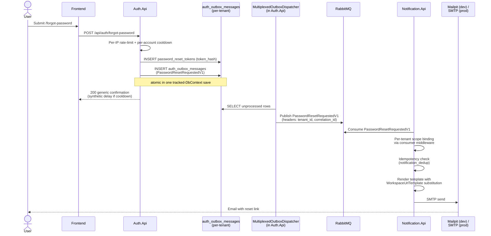
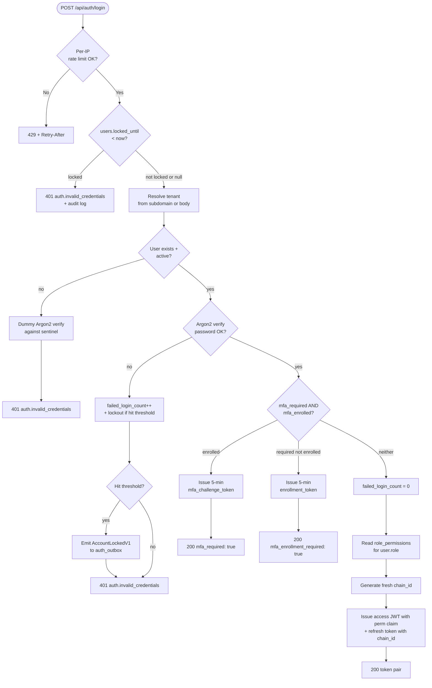
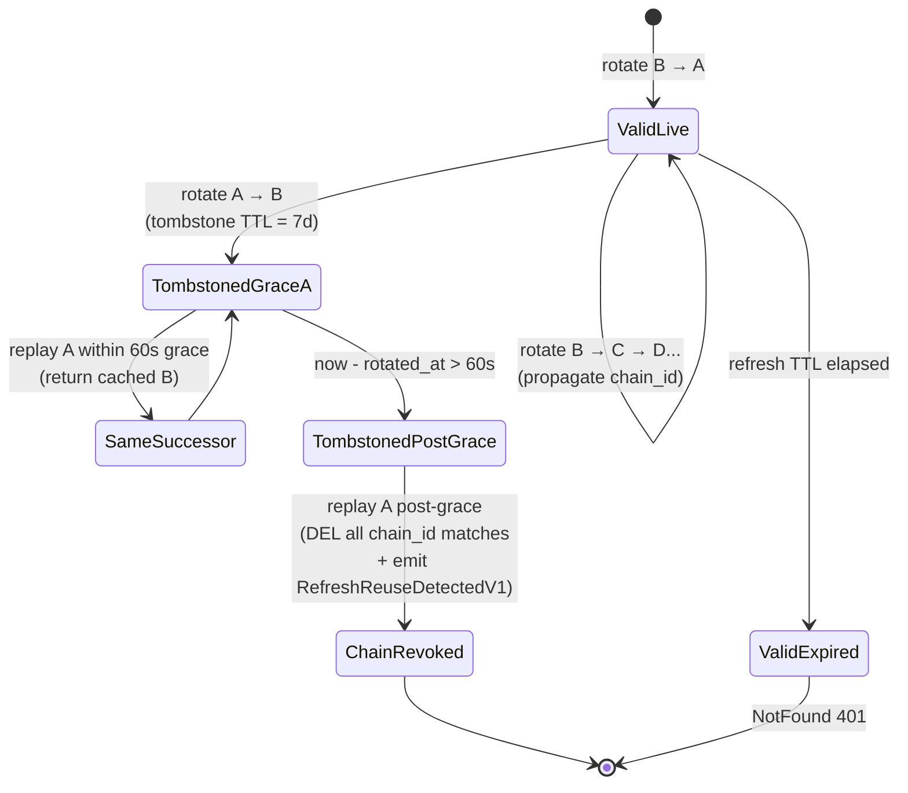

# feat(sprint-9): RBAC + MFA Hardening with ShopFlow.Notification module

## Summary

Sprint-9 extends Sprint-8's Auth module with per-permission RBAC, TOTP MFA, account lockout + per-IP rate limiting, chain-aware refresh-token reuse detection, and self-service password reset — landing alongside a new `ShopFlow.Notification` module (7th business module) that consumes Auth's outbox via MassTransit and renders email via a dev-mode Mailpit container or a prod-mode SMTP provider. 18 implementation units across 5 phases (Auth foundation → backend handlers + composition → Notification module → frontend → cross-tenant + sign-off), executed inline per Sprint-8 cadence after a ce-doc-review pass.

---

## Problem Frame

Origin's Problem Frame establishes the full pain narrative — five Sprint-8 trade-offs cluster as a productionalisation envelope around the Sprint-8 token-pair, with the new Notification module landing as the natural home for transactional email + operator alerts (see origin `docs/brainstorms/2026-05-20-sprint-9-rbac-mfa-hardening-requirements.md`). Plan-side: research surfaced one OWASP canon divergence (affected-user notification on chain-reuse vs origin's Owner-notification choice) — preserved as the user's explicit brainstorm pick with a documented Sprint-10+ stretch to also notify the affected user.

---

## Requirements

All 52 origin R-IDs carry forward. Plan additions are scope-preserving — no new requirements invented. Grouped by phase:

**Auth foundation (Phase A)**
- R1-R7. Per-permission RBAC (UserRole enum preserved + `role_permissions` table + permission catalog + Owner-edit + `perm` claim projection + ASP.NET policies + admin editor + audit event).
- R8-R17. TOTP MFA (encrypted secret + recovery codes + `mfa_required` + `mfa_enrolled` + enrollment + login challenge + recovery-code fallback + forced enrollment + self-service disable + admin reset + Owner invariant).
- R18-R22. Account lockout + per-IP rate limit (failed_login_count + locked_until + 5/15-min lockout + per-IP token bucket + Owner manual unlock + AccountLockedV1 emission).
- R23-R28. Chain-aware refresh-reuse detection (chain_id + 7d tombstone TTL + grace-window preserved + chain-only revoke + RefreshReuseDetectedV1 + Owner email).
- R29-R34. Password-reset email (table + 30-min TTL + R6-silent forgot-password + outbox emit + reset-confirm + per-account cooldown + frontend screens).

**Notification module + audit log (Phase B + audit)**
- R35-R40. ShopFlow.Notification 7th module quartet + MassTransit consumers + IMailerProvider port + dev Mailpit + prod SMTP slot + 4 email templates + per-tenant idempotency + integration tests.
- R41-R43. auth_audit_log table + 15 event types + OTel response-body redaction extension.

**Frontend (Phase C)**
- R44-R49. 5 new routes + MFA enrollment screen + MFA login challenge + profile/security + forgot/reset password + Owner admin (MFA-status + locked-accounts + role-permissions editor) + axe a11y smoke harness extension.

**Validation (Phase D)**
- R50-R52. dotnet build 0/0 + frontend Vitest no new failures + axe smoke clean; KTDs captured ahead of execution; ce-doc-review pass before U0.

**Origin actors:** A1 (Owner), A2 (Picker / Dispatcher), A3 (Anonymous), A4 (Auth.Api), A5 (ShopFlow.Notification — NEW), A6 (Other module APIs), A7 (Frontend client), A8 (shopflow-migrate CLI).

**Origin flows:** F1 (Login without MFA + lockout), F2 (Login with MFA), F3 (First-time Owner forced MFA enrollment), F4 (Self-service password reset), F5 (Chain-reuse detection → revoke-chain + Owner email), F6 (Module endpoint authorization via permission claim).

**Origin acceptance examples:** AE1 (lockout 5/15min), AE2 (Owner mfa_required invariant), AE3 (recovery code single-use), AE4 (post-grace chain replay), AE5 (per-IP rate limit 429 not 401), AE6 (permission missing → 403 not 401), AE7 (forgot-password cooldown).

---

## Scope Boundaries

Origin's Scope Boundaries (Standard tier — single list) carries forward verbatim. Plan adds one new entry under "Deferred to Follow-Up Work" for items split across other sprints. Items already explicitly excluded by origin are not re-stated below — see origin for the full list (OAuth, httpOnly cookies, CORS hardening, per-resource scoping, WebAuthn, SMS 2FA, real SMTP provider sign-up, big-data seed loader, etc.).

### Deferred to Follow-Up Work

- **Affected-user notification email on chain-reuse detection** — OWASP canon prefers notifying the affected user (not just Owner). Sprint-9 preserves origin R28 (Owner notification) per the user's explicit brainstorm choice. Sprint-10+ candidate: emit a second event payload + add an affected-user template + send both emails.
- **Aggregate Owner alerts on auth-failure thresholds** — Sprint-9 ships per-event Owner notifications for chain-reuse + account-locked; OWASP guidance suggests aggregate digests (e.g., >5 reuse detections per tenant per hour) are operator-friendlier. Sprint-10+.
- **Distributed rate-limit store** — Sprint-9 uses ASP.NET RateLimiter's in-memory PartitionedRateLimiter (one process per module today; horizontal scale-out lands Sprint-10+).
- **Eager re-encrypt sweep on TOTP KEK rotation** — Sprint-9 ships the lazy `totp_key_id` column + read-Current-fallback-Previous pattern. The background re-encrypt job that drains Previous-encrypted rows to Current is Sprint-10+ ops work.
- **`auth_audit_log` partitioning + archival** — Sprint-9 ships one unpartitioned table; partitioning is Sprint-10+ ops concern.
- **MailKit prod SMTP integration end-to-end test against a real provider** — Sprint-9 ships the `IMailerProvider` adapter + dev Mailpit + the prod slot with config-driven wiring; real SendGrid/SES/Postmark credentials and the end-to-end test against them are an operational pre-flight outside this sprint.

---

## Context & Research

### Relevant Code and Patterns

**Auth module foundation (Sprint-8)** — Sprint-9 extends, never reinvents:
- `src/Services/Auth/ShopFlow.Auth.Domain/Entities/User.cs` — factory + named mutators + domain events buffer pattern; add 6 new methods (`RegisterFailedLogin`, `ResetFailures`, `Unlock`, `MarkMfaEnrolled`, `MarkMfaDisabled`, `MarkMfaReset`).
- `src/Services/Auth/ShopFlow.Auth.Domain/UserRole.cs` + `chk_users_role` CHECK — preserved verbatim (R1).
- `src/Services/Auth/ShopFlow.Auth.Application/Ports/IPasswordHasher.cs` + `Argon2idPasswordHasher` — reused for password verify AND recovery-code hashing under a new lighter Argon2 profile.
- `src/Services/Auth/ShopFlow.Auth.Application/Ports/ITokenIssuer.cs` + `JwtTokenIssuer` — extend with `perm` claim emission as JSON `string[]` (KTD-load-bearing — see framework research).
- `src/Services/Auth/ShopFlow.Auth.Application/Ports/IRefreshTokenStore.cs` + `RedisRefreshTokenStore` — extend `RefreshTokenRecord` + `RefreshTokenTombstone` payloads with `chain_id`; tombstone TTL 60s → 7d; new `RevokeChainAsync` method; the existing `RefreshRotateOutcome.ReuseDetected` enum case (already shipped Sprint-8, lines 84-86) wired to fire properly.
- `src/Services/Auth/ShopFlow.Auth.Api/Controllers/AuthController.cs` — `[SkipTenantRouting]` + in-controller subdomain resolver reused for forgot-password + reset-password + MFA endpoints.
- `src/Services/Auth/ShopFlow.Auth.Api/Controllers/AuthAdminController.cs` — class-level `[Authorize(Roles = "Owner")]` REPLACED by per-action `[Authorize(Policy = "auth.admin.*")]`.
- `src/Services/Auth/ShopFlow.Auth.Infrastructure/Repositories/UserRepository.cs` lines 68-80 — 23505 → `auth.email_in_use` Result wrap pattern mirrored for `password_reset_tokens (token_hash)` UNIQUE and `user_recovery_codes (user_id, code_hash)` UNIQUE.

**Module-quartet bootstrap precedent (for new Notification module)** — `src/Services/Inbound/` (Sprint-2-redux) + `src/Services/StockSync/` (Sprint-5) supply the 4-csproj + `AddModule` extension + Aspire AppHost wiring + `IModuleMigrationRegistry` registration + per-module AGENTS.md pattern.

**Outbox + cross-module event pattern** — `src/Services/Channel/ShopFlow.Channel.Infrastructure/ChannelServiceCollectionExtensions.cs` line 103 (`AddOutboxRoute<OrderImportedV1>(SendKind.Send)`) and `src/Services/Outbound/ShopFlow.Outbound.Infrastructure/OutboundServiceCollectionExtensions.cs` line 90 (`AddOutboxRoute<SagaTransitionedV1>(SendKind.Publish)`) — Sprint-9 uses Publish variant for all 4 Notification contracts. `IOutboundOutbox.AppendAsync` at `src/Services/Outbound/ShopFlow.Outbound.Infrastructure/Outbox/OutboundOutbox.cs` is the per-module port template — Sprint-9 ships `IAuthOutbox` + `AuthOutbox` mirroring this shape, writing to `auth_outbox_messages` (Sprint-2.5 per-module-prefix convention).

**MassTransit consumer pattern** — `src/Services/Inventory/ShopFlow.Inventory.Infrastructure/Consumers/InboundConfirmedConsumer.cs` shows the canonical scope-bound consumer with K12 per-tenant DbContext binding via consumer middleware (envelope-header → RequestContext binding by kernel middleware) + defensive payload-vs-envelope tenant check + idempotency-anchor first-write pattern. Sprint-9 Notification consumers follow this shape.

**Frontend auth state** — `web/src/hooks/useAuth.ts` Zustand store with `StoredSession` shape carries `accessToken`/`refreshToken`/`accessTokenExpiresAt`/`refreshTokenExpiresAt`; Sprint-9 grafts `permissions: string[]` + `pendingMfa: { challengeToken, expiresAt } | null`. `web/src/api/httpClient.ts` lines 36-71 + 160-167 — 401-refresh-once interceptor + module-scoped `inflightRefresh` lock preserved verbatim; Sprint-9 ADDS a parallel 403-handler that does NOT trigger refresh.

### Institutional Learnings

- `docs/solutions/2026-05-10-ef-migration-needs-attributes.md` — hand-authored migration `[Migration]` + `[DbContext]` attribute pair MANDATORY (mirrored AGENTS.md §3.23). Every new Sprint-9 migration (Auth column adds + 5 new tables + Notification initial schema) carries both attributes.
- `docs/solutions/2026-05-13-ef9-pendingmodelchangeswarning-with-hand-authored-migrations.md` — new `NotificationDbContext` MUST override `OnConfiguring` to `ConfigureWarnings(w => w.Ignore(RelationalEventId.PendingModelChangesWarning))`. Verify `AuthDbContext` already has it (Sprint-8 ships with) before extending.
- `docs/solutions/2026-05-13-cross-module-outbox-table-name-collision.md` — Notification outbox table MUST be named `notification_outbox_messages` (per-module-prefix); same rule applies to the new Auth-side `auth_outbox_messages` (Sprint-8 Auth didn't need an outbox table — Sprint-9 adds it).
- `docs/solutions/2026-05-12-readcommitted-conditional-cte-correctness.md` + `docs/solutions/2026-05-13-multi-row-cte-predicate-must-live-in-update.md` — predicate-in-UPDATE + UNIQUE-pairing pattern applies to password-reset-token consume-once race and the `user_recovery_codes.used_at` consume race.
- `docs/solutions/2026-05-20-microsoft-extensions-timeprovider-testing-cpm.md` — `Microsoft.Extensions.TimeProvider.Testing 9.0.0` already pinned (Sprint-8.5 explicitly anticipated Sprint-9 MFA). All time-sensitive Sprint-9 code (TOTP windows, lockout windows, refresh grace, tombstone expiry, reset-link TTL) takes `TimeProvider` and uses `FakeTimeProvider` in tests.
- `docs/solutions/2026-05-20-contracts-evolution-consumer-test-sweep.md` — git-grep every consumer site before each new Sprint-9 contract lands. Sprint-9 ships 4 new contracts in `ShopFlow.Contracts.Auth/`.
- `docs/solutions/2026-05-20-polly-v8-predicatebuilder-non-generic.md` — Notification's prod `SmtpMailerProvider` wraps `MailKit.Net.Smtp.SmtpClient` calls in a Polly v8 retry pipeline; use non-generic `PredicateBuilder` since MailKit signals failures via exceptions (no `Result` envelope).

### External References

- **OWASP MFA Cheat Sheet** + **OWASP ASVS 5.0 V6** — Sprint-9 picks: ±1-step TOTP drift (RFC 6238 §5.2); recovery codes 10 × 10-char alphanumeric (~52 bits entropy) > ASVS V6.5.4 floor of 20 bits; Argon2id at-rest (lighter profile than passwords); single-use enforced by `used_at IS NULL` consume predicate.
- **OWASP Authentication Cheat Sheet** — per-IP rate limit is **supplementary** only (never primary defense). Per-account lockout is primary. Both required for credential-stuffing defense.
- **OWASP Forgot Password Cheat Sheet** — universal 200 with synthetic delay (constant-time response via dummy Argon2 verify against sentinel hash when email unknown); reset on success revokes all sessions.
- **OWASP Session Management Cheat Sheet + RFC 9700 §4.14** — chain/family revoke on detected reuse (NOT all-user-sessions — 2026 canon divergence from older guidance). 60-sec grace window with idempotent replay returning cached new tokens (Sprint-8 already implements this shape).
- **OWASP Cryptographic Storage Cheat Sheet** — AES-256-GCM (authenticated encryption); env-var KEK acceptable for small SaaS scale; `totp_key_id` column for rotation (preferred over eager re-encrypt sweep).
- **NIST SP 800-63B-4** (Aug 2025) — MFA failures count toward per-authenticator lockout cap (100 SHALL); 5/15-min lockout pattern is canon-compatible; throttling preferred over hard lockout (exponential backoff acceptable).
- **ASP.NET Core 9 docs** — `AddAuthorizationBuilder().AddPolicy(key, p => p.RequireAuthenticatedUser().RequireClaim("perm", key))` matches JSON-array `perm` claims because `JsonWebTokenHandler` flattens `string[]` into N separate Claim objects sharing `Type`. 401 = no identity, 403 = policy fail. `Microsoft.AspNetCore.RateLimiting` ships in App.Ref (no NuGet add); `AddPolicy` with per-request partition resolver gives per-IP keying. `ForwardedHeaders` middleware must wire BEFORE `UseRateLimiter` to honor X-Forwarded-For behind YARP.
- **Otp.NET 1.4.1** (Dec 2025), MIT — RFC 6238 TOTP; `KeyGeneration.GenerateRandomKey(20)` + `Base32Encoding.ToString` + `Totp.VerifyTotp(code, out timeStep, VerificationWindow.RfcSpecifiedNetworkDelay)` (±1 step).
- **QRCoder 1.8.0** (April 2026), MIT — `SvgQRCode` renderer (pure C# string manipulation, no `System.Drawing.Common`). Endpoint MUST send `Cache-Control: no-store`.
- **CommunityToolkit.Aspire.Hosting.MailPit 13.3.0** (May 2026), MIT — exact Aspire 13.3.0 lockstep. `builder.AddMailPit("mailpit")` exposes SMTP + REST API at `/api/v1/messages` for integration tests.

---

## Key Technical Decisions

1. **`perm` claim emitted as JSON `string[]`, NOT space-delimited.** Each permission becomes a separate `Claim` of type `perm` via `JsonWebTokenHandler` array flattening. `RequireClaim("perm", "<key>")` matches the first claim with the requested value. Sprint-8's KTD5 single-source `Auth` config section preserved — issuer + validator stay in lockstep.
2. **Chain-aware reuse-detection revokes chain only** (NOT all-user-sessions). Per RFC 9700 §4.14 + Auth0/Okta 2026 production canon. Sprint-8's collapse-to-single-session was a placeholder. Each login mints `chain_id`; rotation propagates; post-grace replay DELs Redis keys with that chain_id; other devices on other chains keep working.
3. **Tombstone TTL extends from 60sec to 7d** (matches refresh-token TTL). Grace-window check stays the 60-sec `now - rotated_at` threshold compared in code, NOT a Redis TTL — the tombstone payload carries `rotated_at` (existing Sprint-8 field) + new `chain_id` + cached successor plaintext for idempotent grace replay.
4. **Permission policies registered via loop over `PermissionKeys.All`** (static-class reflection-driven enumeration). `services.AddAuthorizationBuilder()` + foreach builder.AddPolicy(key, p => p.RequireAuthenticatedUser().RequireClaim("perm", key)). ~20-30 policies registered once in `AddShopFlowDefaults`.
5. **Per-IP rate limit is supplementary, NEVER replaces per-account lockout.** Two distinct defense layers (OWASP explicit). `[EnableRateLimiting("auth-credentials")]` on Login + Refresh + MFA-verify (10/min token-bucket per IP); separate `[EnableRateLimiting("auth-forgot-password")]` policy on Forgot-Password (5/min per IP). Lockout state lives on `users.locked_until` (per-account).
6. **403 vs 401 frontend split.** Sprint-8's httpClient handles 401 → refresh-once-then-redirect-to-login. Sprint-9 adds parallel 403 branch that does NOT trigger refresh (authorization failure, not authentication failure) — calling code receives `ApiError(403, ...)` to handle with a toast or fallback UI.
7. **`ForwardedHeaders` middleware wired BEFORE `UseRateLimiter` in `AddShopFlowDefaults` with explicit `KnownProxies`/`KnownNetworks` allowlist.** YARP gateway sets `X-Forwarded-For`; without honor, rate-limit partition key would collapse to the gateway IP and every legitimate user shares one bucket. Equally dangerous: empty `KnownProxies` + `KnownNetworks` (dev "trust any source" default) silently disables forwarded-header processing entirely AND allows any direct caller to forge `X-Forwarded-For` and spoof partition keys. Dev defaults = `KnownNetworks = { 127.0.0.0/8 }` + `KnownProxies = { ::1 }`; prod requires explicit gateway IP/CIDR. Startup gate: when `ASPNETCORE_ENVIRONMENT != Development`, assert `KnownProxies` OR `KnownNetworks` is non-empty before bind completes; otherwise throw `ConfigurationException`. Doc-review P0.
8. **TOTP KEK in env-var `Auth:TotpKek` (base64 32-byte), AES-256-GCM, `totp_key_id` column on `user_totp_secrets` for rotation.** Config-based KEK acceptable for small-to-mid SaaS per OWASP Cryptographic Storage. Rotation = bump `Auth:TotpKek:Current`, set `Auth:TotpKek:Previous`, deploy; lazy re-encrypt via read-Current-fallback-Previous. Eager bulk re-encrypt sweep deferred to Sprint-10+. Matches Sprint-8 KTD5 `Auth` section single-source-of-truth shape.
9. **Argon2 dual-profile.** Existing Sprint-8 password profile (OWASP 2026: m=64 MiB, t=4, p=4) unchanged. NEW `RecoveryCode` profile (m=8 MiB, t=2, p=1) — recovery codes carry ~52-bit entropy so password-grade work-factor is excessive and would balloon enrollment cost (10 codes × full-profile = ~5 sec). Both profiles parameter-embedded in PHC string; verify reads embedded params (Sprint-8 KTD4 carried).
10. **TOTP enrollment-secret in Redis short-TTL.** Key `auth:totpenroll:{tenant_slug}:{user_id}:{enrollmentId}` 10-min TTL carrying raw secret + CSRF-bound enrollment_id. NOT in JWT (URL/log leak). NOT in process memory (modular monolith multi-instance under Aspire). DEL on successful verify; auto-expire on abandon.
11. **Email template engine = plain string interpolation** via `SimpleTemplateRenderer` with `{{placeholder}}` substitution. Sprint-9 has 4 templates; engine compilation/parsing overhead unjustified. Templates ship as embedded `.txt` resources (plain) + `.html` resources (HTML alternative) under `src/Services/Notification/ShopFlow.Notification.Application/Templates/`. Fluid/Razor are Sprint-10+ when richer templates land.
12. **Workspace URL in Notification module config** (`Notification:WorkspaceUrlTemplate = "https://{slug}.shopflow.com"`, env-overridable for dev/staging). Event payload carries `tenant_slug`; Notification formats the URL — single source of truth for URL shape per environment.
13. **Owner-critical permissions cannot be stripped from the Owner role.** Server-side guard via `PermissionKeys.OwnerCritical` subset (`auth.admin.users.*`, `auth.admin.role-permissions.*`, `auth.admin.lockout.*`); RolePermissionsHandler rejects with `auth.role_permissions_owner_critical_locked` if the operation would leave Owner missing any.
14. **`forgot-password` synthetic constant-time response.** When email unknown OR cooldown active: still run a dummy Argon2id verify against a fixed sentinel hash to keep wall-time within the same band as the matched-email path. Mirrors Sprint-8 Login enumeration discipline.
15. **OWASP canon divergence on chain-reuse notification target preserved as user choice.** Origin R28 says "Notification module emails Owner role users for that tenant"; OWASP canon prefers "notify the affected user with generic security email". Sprint-9 ships R28 literal (Owner notification). Sprint-10+ stretch: emit a secondary affected-user email so both parties get visibility.
16. **QR endpoint sets `Cache-Control: no-store`.** The `otpauth://` URI in the SVG contains the shared TOTP secret. Any browser/CDN/proxy cache layer would persist a credential. KTD locks the response-header invariant at code level.

---

## Open Questions

### Resolved During Planning

- **TOTP KEK storage** — env-var `Auth:TotpKek:Current` + `Auth:TotpKek:Previous` (base64 32-byte each), bound via `IOptions<TotpKekOptions>`; AES-256-GCM; `totp_key_id` column on `user_totp_secrets` for lazy rotation per KTD8.
- **TOTP enrollment-secret transactional storage** — Redis short-TTL key per KTD10.
- **Mock SMTP container for Aspire** — Mailpit via `CommunityToolkit.Aspire.Hosting.MailPit 13.3.0` (exact Aspire 13.3.0 lockstep per framework research).
- **Email template engine** — plain string interpolation per KTD11.
- **QR code rendering** — server-side `SvgQRCode` from QRCoder 1.8.0 with `Cache-Control: no-store` per KTD16.
- **Per-IP rate-limit storage** — built-in `Microsoft.AspNetCore.RateLimiting` in-memory `PartitionedRateLimiter`. Modular monolith = one process per module = in-memory is sufficient. Distributed store is Sprint-10+ Scope Boundary.
- **Email deep-link host resolution** — Notification config `WorkspaceUrlTemplate` per KTD12.
- **role-permissions admin guard** — `PermissionKeys.OwnerCritical` subset + server-side enforce per KTD13.
- **Permission claim shape** — JSON `string[]` per KTD1.
- **403 vs 401 frontend handling** — split into two branches per KTD6.
- **YARP `X-Forwarded-For` honor** — `ForwardedHeaders` middleware in `AddShopFlowDefaults` per KTD7.
- **Argon2 profile for recovery codes** — lighter dual-profile per KTD9.
- **Synthetic constant-time response on forgot-password** — dummy Argon2id verify per KTD14.
- **Notification target on chain-reuse** — preserve R28 (Owner notification); Sprint-10+ stretch to also notify affected user per KTD15.

### Deferred to Implementation

- **Exact template wording for the 4 email templates** — discoverable during U11 by writing the rendered output + showing a stakeholder review; ce-doc-review/ce-work loops are the right surface, not plan-time prose.
- **Exact ASP.NET RateLimiter `TokensPerPeriod` + `ReplenishmentPeriod` tuning** — KTD5 sets the 10/min target; the precise `TokenLimit=10 / TokensPerPeriod=5 / ReplenishmentPeriod=30s` vs `TokenLimit=10 / TokensPerPeriod=10 / ReplenishmentPeriod=1min` choice can be tuned during U7 once the legitimate-burst pattern is profiled.
- **Recovery-code regenerate-all-on-reveal UX** — R47 says "Generate new recovery codes if low / lost"; the exact threshold (≤3 remaining vs explicit user action only) is a U14 implementation pick.
- **Aspire AppHost Mailpit port collisions** — Mailpit defaults to 1025 (SMTP) + 8025 (UI); if another container on this developer's machine binds those, Aspire's auto-port-assignment handles it. The Mailpit toolkit's `httpPort` + `smtpPort` explicit-port params can be wired during U10 if integration tests need stable URLs.

---

## Output Structure

The new Notification module quartet adds these directories (mirroring `src/Services/Inbound/` shape):

```
src/Services/Notification/
├── AGENTS.md  (NEW; ≤50 lines per AGENTS.md §11.82)
├── ShopFlow.Notification.Domain/
│   ├── ShopFlow.Notification.Domain.csproj
│   └── Aggregates/  (NotificationDedupEntry if any persistent aggregates)
├── ShopFlow.Notification.Application/
│   ├── ShopFlow.Notification.Application.csproj
│   ├── Consumers/
│   │   ├── PasswordResetRequestedConsumer.cs
│   │   ├── RefreshReuseDetectedConsumer.cs
│   │   ├── AccountLockedConsumer.cs
│   │   └── MfaEnrolledConsumer.cs
│   ├── Ports/
│   │   ├── IMailerProvider.cs
│   │   ├── ITemplateRenderer.cs
│   │   └── INotificationDedupRepository.cs
│   └── Templates/
│       ├── password-reset.text.txt + password-reset.html.txt
│       ├── chain-reuse-alert.text.txt + chain-reuse-alert.html.txt
│       ├── account-locked-alert.text.txt + account-locked-alert.html.txt
│       └── mfa-enrolled-confirmation.text.txt + mfa-enrolled-confirmation.html.txt
├── ShopFlow.Notification.Infrastructure/
│   ├── ShopFlow.Notification.Infrastructure.csproj
│   ├── NotificationDbContext.cs
│   ├── EntityConfigurations/
│   ├── Migrations/
│   │   └── 20260601000010_InitialNotificationSchema.cs
│   ├── Mail/
│   │   ├── LoggingMailer.cs       (dev mode)
│   │   ├── MailKitSmtpMailer.cs   (prod adapter slot)
│   │   └── SimpleTemplateRenderer.cs
│   ├── Repositories/NotificationDedupRepository.cs
│   └── NotificationServiceCollectionExtensions.cs
└── ShopFlow.Notification.Api/
    ├── ShopFlow.Notification.Api.csproj
    ├── Program.cs
    ├── NotificationOptions.cs
    └── appsettings.json
```

Plus new contracts under `src/Shared/ShopFlow.Contracts/Auth/`:

```
src/Shared/ShopFlow.Contracts/Auth/
├── PasswordResetRequestedV1.cs
├── RefreshReuseDetectedV1.cs
├── AccountLockedV1.cs
└── MfaEnrolledV1.cs
```

Plus new tests:

```
tests/
├── ShopFlow.Notification.UnitTests/
│   └── ShopFlow.Notification.UnitTests.csproj
└── ShopFlow.Notification.IntegrationTests/
    ├── ShopFlow.Notification.IntegrationTests.csproj
    ├── NotificationTenantFixture.cs
    └── Consumers/
```

This is a scope declaration; the implementer may adjust if implementation reveals a better layout. The per-unit `Files:` sections are authoritative for what each unit creates or modifies.

---

## High-Level Technical Design

> *This illustrates the intended approach and is directional guidance for review, not implementation specification. The implementing agent should treat it as context, not code to reproduce.*

### Cross-module event flow (Auth → Notification)



### Login flow with all Sprint-9 layers



### Refresh chain-reuse detection state machine



---

## Implementation Units

### U0. Branch cut + opening commit

**Goal:** Cut `feat/sprint-9-rbac-mfa-hardening` from tag `v0.11.1-sprint-8.5`. Opening commit captures the brainstorm + this plan + 16 KTDs in the commit body so they're greppable from `git log -p`.

**Requirements:** R51

**Dependencies:** none

**Files:**
- Modify: nothing (branch operation only)

**Approach:**
- `git checkout -b feat/sprint-9-rbac-mfa-hardening v0.11.1-sprint-8.5`
- Verify clean tree before pushing.
- Per user's stored "push before phase switch" preference: push `feat/sprint-8.5-test-sweep-buildfix` + tag `v0.11.1-sprint-8.5` to origin first.

**Patterns to follow:**
- Sprint-8 U0 (`b5b7eec`) and Sprint-8.5 U0 (`21d581f`) opening-commit shape — brainstorm + plan + KTD list quoted verbatim in commit body.

**Test scenarios:**
- Test expectation: none — branch-cut operation; no behavioral change.

**Verification:**
- `git status` clean on the new branch; tag and prior branch pushed to origin.

---

### U1. Auth.Domain extensions + PermissionKeys catalog

**Goal:** Extend the `User` aggregate with 4 new columns + 6 named methods + 3 new domain events. Ship the `PermissionKeys` static catalog + supporting types in SharedKernel.

**Requirements:** R1, R10, R11, R18, R20

**Dependencies:** U0

**Files:**
- Modify: `src/Services/Auth/ShopFlow.Auth.Domain/Entities/User.cs` (add `FailedLoginCount`, `LockedUntil`, `MfaRequired`, `MfaEnrolled` columns + `RegisterFailedLogin(TimeProvider)`, `ResetFailures`, `Unlock`, `MarkMfaEnrolled`, `MarkMfaDisabled`, `MarkMfaReset`, `RequireMfa(bool)` methods)
- Create: `src/Services/Auth/ShopFlow.Auth.Domain/Events/UserLockedEvent.cs`
- Create: `src/Services/Auth/ShopFlow.Auth.Domain/Events/UserMfaEnrolledEvent.cs`
- Create: `src/Services/Auth/ShopFlow.Auth.Domain/Events/UserMfaDisabledEvent.cs`
- Create: `src/Shared/ShopFlow.SharedKernel/Authorization/PermissionKeys.cs` (static-class catalog of ~25 permission keys + `OwnerCritical` subset)
- Test: `tests/ShopFlow.Auth.UnitTests/Domain/UserTests.cs` (extend existing file with Sprint-9 method tests)
- Test: `tests/ShopFlow.SharedKernel.UnitTests/Authorization/PermissionKeysTests.cs` (pin catalog shape + `OwnerCritical` non-empty + `All` enumeration via reflection)

**Approach:**
- Lockout sliding window: `RegisterFailedLogin` accepts `TimeProvider` so the 15-min window is testable via `FakeTimeProvider`. The method returns a `Result<bool>` where `true` means "this attempt triggered the lockout boundary" — caller emits `AccountLockedV1` only on the boundary, not on every failure.
- `PermissionKeys.All` enumerates static fields via `BindingFlags.Public | BindingFlags.Static` reflection.
- `OwnerCritical` is a separate `IReadOnlyList<string>` carrying the subset `auth.admin.users.*`, `auth.admin.role-permissions.*`, `auth.admin.lockout.*` keys (10-12 entries).

**Execution note:** test-first per Sprint-3-redux+ cadence.

**Patterns to follow:**
- Existing `User.UpdatePassword` (Sprint-8 `User.cs`) — factory + named mutators + domain events buffer.
- Sprint-8 `UserPasswordChangedEvent` shape — sealed record domain events.

**Test scenarios:**
- Happy path: `RegisterFailedLogin` increments counter; returns `false` for attempts 1-4, `true` on the 5th within 15 min.
- Edge: `FakeTimeProvider.Advance(TimeSpan.FromMinutes(16))` after 4 failures resets the window — next failure returns `false` (counter reset).
- Edge: `MarkMfaEnrolled` after `MarkMfaDisabled` round-trips with no exception; both events fire.
- Error: `RegisterFailedLogin` on an already-locked user does NOT extend `LockedUntil` (rate-limited at IP layer; no state change here).
- Edge: `PermissionKeys.OwnerCritical` ⊂ `PermissionKeys.All` (subset invariant).

**Verification:**
- `dotnet test --filter "FullyQualifiedName~UserTests"` passes; UserConfiguration FluentAPI extends accept the 4 new columns in U3.

---

### U2. Auth.Application ports + DTOs + Commands skeleton

**Goal:** Add 8 new ports + 2 extended ports + Sprint-9 DTOs + Sprint-9 Command record skeletons. Pure interfaces — no impls.

**Requirements:** R5, R8, R9, R10, R12, R13, R14, R23, R29, R30, R41

**Dependencies:** U1

**Files:**
- Create: `src/Services/Auth/ShopFlow.Auth.Application/Ports/IPasswordResetTokenRepository.cs`
- Create: `src/Services/Auth/ShopFlow.Auth.Application/Ports/ITotpSecretRepository.cs`
- Create: `src/Services/Auth/ShopFlow.Auth.Application/Ports/IRecoveryCodeRepository.cs`
- Create: `src/Services/Auth/ShopFlow.Auth.Application/Ports/IRolePermissionRepository.cs`
- Create: `src/Services/Auth/ShopFlow.Auth.Application/Ports/IAuthAuditLogRepository.cs`
- Create: `src/Services/Auth/ShopFlow.Auth.Application/Ports/ITotpProvider.cs`
- Create: `src/Services/Auth/ShopFlow.Auth.Application/Ports/ITotpSecretCipher.cs`
- Create: `src/Services/Auth/ShopFlow.Auth.Application/Ports/IEnrollmentSecretStore.cs`
- Create: `src/Services/Auth/ShopFlow.Auth.Application/Ports/IAuthOutbox.cs`
- Modify: `src/Services/Auth/ShopFlow.Auth.Application/Ports/ITokenIssuer.cs` (bump `IssueAccessToken` → `IssueAccessTokenAsync(User, string tenantSlug, CancellationToken)` returning `Task<AccessToken>`)
- Modify: `src/Services/Auth/ShopFlow.Auth.Application/Ports/IRefreshTokenStore.cs` (extend `RefreshTokenRecord` + `RefreshTokenTombstone` payloads with `ChainId Guid`; add new `RevokeChainAsync(string tenantSlug, Guid userId, Guid chainId, CancellationToken)` method)
- Modify: `src/Services/Auth/ShopFlow.Auth.Application/Ports/IUserRepository.cs` (add `Task<IReadOnlyList<User>> ListByRoleAsync(UserRole role, CancellationToken ct)` — consumed by U11's `RefreshReuseDetectedConsumer` + `AccountLockedConsumer` for Owner fan-out)
- Modify: `src/Services/Auth/ShopFlow.Auth.Application/Dtos/AuthDtos.cs` (extend `LoginResponse` with optional `MfaRequired?: bool` + `MfaChallengeToken?: string` + `MfaEnrollmentRequired?: bool` + `MfaEnrollmentToken?: string`; new DTOs: `ForgotPasswordRequest`, `ResetPasswordConfirmRequest`, `BeginEnrollMfaResponse`, `VerifyMfaRequest`, `RecoveryCodeView`)
- Create: `src/Services/Auth/ShopFlow.Auth.Application/Commands/ForgotPasswordCommand.cs`
- Create: `src/Services/Auth/ShopFlow.Auth.Application/Commands/ResetPasswordConfirmCommand.cs`
- Create: `src/Services/Auth/ShopFlow.Auth.Application/Commands/BeginEnrollMfaCommand.cs`
- Create: `src/Services/Auth/ShopFlow.Auth.Application/Commands/VerifyEnrollMfaCommand.cs`
- Create: `src/Services/Auth/ShopFlow.Auth.Application/Commands/VerifyMfaCommand.cs`
- Create: `src/Services/Auth/ShopFlow.Auth.Application/Commands/DisableMfaCommand.cs`
- Create: `src/Services/Auth/ShopFlow.Auth.Application/Commands/GenerateRecoveryCodesCommand.cs`
- Create: `src/Services/Auth/ShopFlow.Auth.Application/Commands/AdminMfaResetCommand.cs`
- Create: `src/Services/Auth/ShopFlow.Auth.Application/Commands/AdminUnlockAccountCommand.cs`
- Create: `src/Services/Auth/ShopFlow.Auth.Application/Commands/RolePermissionsCommand.cs` (discriminated: `AddPermission` / `RemovePermission` / `SetAll`)

**Approach:**
- `IAuthOutbox` mirrors `IOutboundOutbox` exactly: `AppendAsync(string eventType, object payload, CancellationToken ct)` writes to `auth_outbox_messages` in the same tracked-DbContext save as the business write.
- `IRefreshTokenStore.RevokeChainAsync` is new; the existing `RevokeAllForUserAsync` stays.
- `ITotpProvider` exposes `GenerateSecret() → byte[]`, `GenerateProvisioningUri(string secret, string email, string issuer) → string`, `VerifyOtp(byte[] secret, string code, out long timeStep, TimeProvider clock) → bool`.
- `ITotpSecretCipher.EncryptAsync(byte[] plaintext) → byte[] ciphertext` / `DecryptAsync(byte[] ciphertext, int keyId) → byte[] plaintext` — KEK rotation via key_id (KTD8).
- `IEnrollmentSecretStore` short-TTL Redis port with `StoreAsync` / `ConsumeAsync` (DEL on consume).
- `IAuthAuditLogRepository.AppendAsync(string eventType, Guid? userId, string sourceIp, string userAgent, string metadataJson, Guid correlationId, CancellationToken)` — fire-and-forget audit writes (non-blocking via async).

**Execution note:** ports + DTOs are pure interface; tests land alongside their concrete impls in U3-U5.

**Patterns to follow:**
- Sprint-8 `IUserRepository` / `IPasswordHasher` / `ITokenIssuer` port shape — explicit `CancellationToken` last param, `Task<Result<T>>` return for failure-prone ops.
- Sprint-8 `IRefreshTokenStore.RefreshRotateOutcome` enum precedent — Sprint-9 may add `ChainRevoked` outcome if needed (decide in U5).
- Sprint-8 `UpdateUserCommand` discriminated-operation shape for `RolePermissionsCommand`.

**Test scenarios:**
- Test expectation: none — port + DTO scaffolding; behavioral tests in dependent units.

**Verification:**
- `dotnet build src/Services/Auth/ShopFlow.Auth.Application/ShopFlow.Auth.Application.csproj` → 0 errors / 0 warnings.

---

### U3. Auth.Infrastructure schema + entity configs + repositories + Argon2 dual-profile

**Goal:** One consolidated migration adds 4 columns to `users` + 5 new tables + `auth_outbox_messages`. Entity configurations + repositories (UNIQUE-23505 catches). Argon2Options gets a `RecoveryCode` profile. AuthDbContext keeps the `PendingModelChangesWarning` suppression Sprint-8 ships with.

**Requirements:** R2, R8, R9, R10, R11, R18, R29, R35, R39, R41, R43

**Dependencies:** U2

**Files:**
- Modify: `src/Services/Auth/ShopFlow.Auth.Infrastructure/AuthDbContext.cs` (verify `OnConfiguring` PendingModelChangesWarning suppression present; add `DbSet<>` properties for the 6 new aggregates + `OutboxMessage`)
- Modify: `src/Services/Auth/ShopFlow.Auth.Infrastructure/EntityConfigurations/UserConfiguration.cs` (map 4 new columns: `failed_login_count`, `locked_until`, `mfa_required`, `mfa_enrolled`)
- Create: `src/Services/Auth/ShopFlow.Auth.Infrastructure/EntityConfigurations/PasswordResetTokenConfiguration.cs`
- Create: `src/Services/Auth/ShopFlow.Auth.Infrastructure/EntityConfigurations/TotpSecretConfiguration.cs`
- Create: `src/Services/Auth/ShopFlow.Auth.Infrastructure/EntityConfigurations/RecoveryCodeConfiguration.cs`
- Create: `src/Services/Auth/ShopFlow.Auth.Infrastructure/EntityConfigurations/RolePermissionConfiguration.cs`
- Create: `src/Services/Auth/ShopFlow.Auth.Infrastructure/EntityConfigurations/AuthAuditLogEntryConfiguration.cs`
- Create: `src/Services/Auth/ShopFlow.Auth.Infrastructure/EntityConfigurations/AuthOutboxMessageConfiguration.cs` (`ToTable("auth_outbox_messages")` per per-module-prefix convention)
- Create: `src/Services/Auth/ShopFlow.Auth.Infrastructure/Migrations/20260601000001_AddSprint9AuthSchema.cs` (consolidated: 4 column adds + 6 new tables; `[Migration]` + `[DbContext]` attributes per AGENTS.md §3.23)
- Create: `src/Services/Auth/ShopFlow.Auth.Infrastructure/Repositories/PasswordResetTokenRepository.cs` (23505 → `auth.token_in_use` Result wrap)
- Create: `src/Services/Auth/ShopFlow.Auth.Infrastructure/Repositories/TotpSecretRepository.cs`
- Create: `src/Services/Auth/ShopFlow.Auth.Infrastructure/Repositories/RecoveryCodeRepository.cs`
- Create: `src/Services/Auth/ShopFlow.Auth.Infrastructure/Repositories/RolePermissionRepository.cs`
- Create: `src/Services/Auth/ShopFlow.Auth.Infrastructure/Repositories/AuthAuditLogRepository.cs`
- Modify: `src/Services/Auth/ShopFlow.Auth.Infrastructure/Hashing/Argon2Options.cs` (add `RecoveryCode` profile section with m=8 MiB / t=2 / p=1; existing `Password` profile section unchanged)
- Modify: `src/Services/Auth/ShopFlow.Auth.Infrastructure/Hashing/Argon2idPasswordHasher.cs` (accept `Argon2Profile` enum on `Hash` and `Verify` paths; default is `Password`)
- Test: `tests/ShopFlow.Auth.IntegrationTests/Migrations/AddSprint9AuthSchemaMigrationSmokeTests.cs`
- Test: `tests/ShopFlow.Auth.IntegrationTests/Repositories/PasswordResetTokenRepositoryTests.cs`
- Test: `tests/ShopFlow.Auth.IntegrationTests/Repositories/TotpSecretRepositoryTests.cs`
- Test: `tests/ShopFlow.Auth.IntegrationTests/Repositories/RecoveryCodeRepositoryTests.cs`
- Test: `tests/ShopFlow.Auth.IntegrationTests/Repositories/RolePermissionRepositoryTests.cs`
- Test: `tests/ShopFlow.Auth.UnitTests/Hashing/Argon2DualProfileTests.cs`

**Approach:**
- Migration table-creation order: `password_reset_tokens` → `user_totp_secrets` → `user_recovery_codes` → `role_permissions` → `auth_audit_log` → `auth_outbox_messages`. Plus 4 column adds on `users` with `DEFAULT 0` / `DEFAULT NULL` / `DEFAULT false` so existing rows backfill correctly.
- `password_reset_tokens.token_hash` PK + UNIQUE; `(user_id, created_at)` index for cooldown queries.
- `user_totp_secrets.user_id` PK + `totp_key_id smallint NOT NULL` per KTD8 (lazy rotation).
- `user_recovery_codes (user_id, code_hash)` composite PK + UNIQUE.
- `role_permissions (role varchar(16), permission_key varchar(64))` composite PK.
- `auth_audit_log.id bigserial` + `event_type` partial-index for filtered queries.
- All tables follow snake_case columns / PascalCase C# props per AGENTS.md §50.
- Argon2 dual-profile: `Argon2idPasswordHasher.Hash(plaintext, Argon2Profile.RecoveryCode)` invokes lighter params; the produced PHC string parameter-embeds them so `Verify` reads embedded values (Sprint-8 KTD4 preserved).

**Execution note:** test-first for the schema smoke + repository tests; the migration body lands after the smoke test pins the expected DDL.

**Patterns to follow:**
- Sprint-8 `Migrations/20260520000001_AddUsers.cs` hand-authored migration shape — `[Migration]` + `[DbContext]` attributes + raw `EnsureSchema` + `CreateTable` + `CreateIndex` invocations.
- Sprint-8 `UserRepository.AddAsync` 23505 catch → Result wrap.
- `docs/solutions/2026-05-13-cross-module-outbox-table-name-collision.md` — table-name-prefix rule for `auth_outbox_messages`.
- `docs/solutions/2026-05-13-ef9-pendingmodelchangeswarning-with-hand-authored-migrations.md` — DbContext warning suppression.

**Test scenarios:**
- Integration / Happy path: migration applies cleanly against a fresh tenant DB; all 6 new tables + 4 new columns exist; PK + UNIQUE + CHECK constraints present.
- Integration / Edge: `PasswordResetTokenRepository.AddAsync` returning `Result.Failure("auth.token_in_use")` when 23505 fires (collision on `token_hash`).
- Integration / Edge: `RecoveryCodeRepository.MarkConsumedAsync` predicate-in-UPDATE shape (`UPDATE ... WHERE used_at IS NULL`) returns `0 rowsAffected` when already consumed — handler treats this as `auth.invalid_credentials` (R6 collapse).
- Integration / Edge: `RolePermissionRepository.GetForRoleAsync(UserRole.Owner)` returns ALL `PermissionKeys.All` after default seed; for Picker/Dispatcher returns empty list.
- Happy path: `Argon2idPasswordHasher.Hash("abc123XYZ!", Argon2Profile.Password)` produces hash whose PHC string contains `m=65536,t=4,p=4`; verify round-trips. `Hash("RECOV-CODE", Argon2Profile.RecoveryCode)` produces hash with `m=8192,t=2,p=1`; verify round-trips.
- Edge: `Verify` with the WRONG profile (password hash verified against RecoveryCode profile) still works — embedded params drive verify.

**Verification:**
- `dotnet test --filter "Category=Integration&FullyQualifiedName~AuthIntegrationTests"` passes against Testcontainers Postgres.
- `dotnet build ShopFlow.sln` → 0/0.

---

### U4. TOTP infrastructure + AES-256-GCM cipher + RedisEnrollmentSecretStore

**Goal:** Land the Otp.NET integration, the AES-256-GCM secret cipher with rotation support, and the Redis short-TTL enrollment-secret store.

**Requirements:** R8, R12

**Dependencies:** U3

**Files:**
- Modify: `Directory.Packages.props` (add `Otp.NET 1.4.1` + `QRCoder 1.8.0`)
- Modify: `src/Services/Auth/ShopFlow.Auth.Infrastructure/ShopFlow.Auth.Infrastructure.csproj` (add `<PackageReference Include="Otp.NET" />`)
- Create: `src/Services/Auth/ShopFlow.Auth.Infrastructure/Mfa/OtpNetTotpProvider.cs` (implements `ITotpProvider`; `KeyGeneration.GenerateRandomKey(20)` + `Totp.VerifyTotp(code, out timeStep, VerificationWindow.RfcSpecifiedNetworkDelay)`)
- Create: `src/Services/Auth/ShopFlow.Auth.Infrastructure/Mfa/AesTotpSecretCipher.cs` (implements `ITotpSecretCipher`; AES-256-GCM via `System.Security.Cryptography.AesGcm`; 12-byte random nonce + 16-byte tag + `AAD = tenant_id::user_id`)
- Create: `src/Services/Auth/ShopFlow.Auth.Infrastructure/Mfa/TotpKekOptions.cs` (`Current` + `Previous` base64 32-byte fields + `CurrentKeyId` smallint)
- Create: `src/Services/Auth/ShopFlow.Auth.Infrastructure/Storage/RedisEnrollmentSecretStore.cs` (implements `IEnrollmentSecretStore`; key `auth:totpenroll:{tenantSlug}:{userId}:{enrollmentId}` with 10-min TTL; `StoreAsync` + `ConsumeAsync` (GET + DEL atomic via Lua mini-script))
- Test: `tests/ShopFlow.Auth.UnitTests/Mfa/OtpNetTotpProviderTests.cs`
- Test: `tests/ShopFlow.Auth.UnitTests/Mfa/AesTotpSecretCipherTests.cs`
- Test: `tests/ShopFlow.Auth.IntegrationTests/Storage/RedisEnrollmentSecretStoreTests.cs`

**Approach:**
- `OtpNetTotpProvider.VerifyOtp` injects `TimeProvider` so the ±1-step drift window (RFC 6238 §5.2) is testable via `FakeTimeProvider`. The wrapper returns `(bool valid, long timeStep)` so handlers can persist `last_used_at` AND prevent within-window replay by storing `last_used_step` per-user.
- `AesTotpSecretCipher.EncryptAsync(plaintext)` reads `Current` key, generates 12-byte nonce via `RandomNumberGenerator.Fill`, produces `[nonce(12)][cipher(N)][tag(16)]` blob. `DecryptAsync(blob, keyId)` selects key based on `keyId == TotpKekOptions.CurrentKeyId` ? `Current` : `Previous`; throws on mismatch.
- `RedisEnrollmentSecretStore.ConsumeAsync` uses a tiny Lua script for atomic GET+DEL — mirrors Sprint-8 `RedisRefreshTokenStore` patterns.

**Execution note:** test-first. The 30-sec TOTP window + 7-day tombstone semantics depend on deterministic clock control.

**Patterns to follow:**
- Sprint-8 `RedisRefreshTokenStore` per-tenant key namespacing + Lua atomic ops.
- Sprint-8 `Argon2idPasswordHasher` PHC-string embedded params pattern; AES cipher mirrors via the `[nonce][cipher][tag]` self-contained blob.

**Test scenarios:**
- Happy path: `OtpNetTotpProvider.GenerateSecret` returns 20-byte (160-bit) cryptographically-random key; `GenerateProvisioningUri` returns valid `otpauth://totp/...` URI parseable by Google Authenticator.
- Happy path: `VerifyOtp` with a code generated at `now` returns `true` + `timeStep = now/30sec`. `VerifyOtp` with a code from `now - 30sec` also returns `true` (drift window). `VerifyOtp` with a code from `now - 60sec` returns `false` (outside ±1-step window).
- Edge: `VerifyOtp` with a malformed 5-digit code or all-zero code returns `false` (never throws).
- Edge: `VerifyOtp` rejects a code with `timeStep == last_used_step` for the same user — prevents within-window replay (handler responsibility, test asserts the surface).
- Happy path: `AesTotpSecretCipher.EncryptAsync(plaintext)` produces N+28 byte blob (12 nonce + 16 tag); `DecryptAsync(blob, CurrentKeyId)` round-trips to plaintext.
- Edge: `DecryptAsync(blob, PreviousKeyId)` for a `Current`-encrypted blob returns null / fails gracefully.
- Edge: `DecryptAsync` of a tampered ciphertext (any byte flipped) throws `AuthenticationTagMismatchException`.
- Integration: `RedisEnrollmentSecretStore.StoreAsync` + `ConsumeAsync` round-trips; double `ConsumeAsync` returns null on the second call (DEL'd).
- Integration: `StoreAsync` with TTL=10min; `FakeTimeProvider.Advance(11 min)` → `ConsumeAsync` returns null (Redis TTL elapsed — note: Testcontainers Redis honors real TTL; test uses `Task.Delay` or `SetExpire(0)` to simulate).

**Verification:**
- All unit tests + integration tests pass; `dotnet build ShopFlow.sln` → 0/0.

---

### U5. Redis chain-aware refresh-token store extension

**Goal:** Extend `RedisRefreshTokenStore` for chain_id propagation + 7-day tombstone TTL + new `RevokeChainAsync`. Preserves the Sprint-8 60-sec grace-window idempotent-replay semantics.

**Requirements:** R23, R24, R25, R26, R27

**Dependencies:** U2

**Files:**
- Modify: `src/Services/Auth/ShopFlow.Auth.Infrastructure/Storage/RedisRefreshTokenStore.cs` (extend `RefreshTokenRecord` + `RefreshTokenTombstone` JSON payloads with `ChainId Guid`; `IssueAsync` mints new chain_id on login; `RotateAsync` propagates chain_id; tombstone TTL parameter goes from `RotationGraceWindowSeconds` (still 60) to a separate `TombstoneTtlSeconds` (now 7*86400); add `RevokeChainAsync(string tenantSlug, Guid userId, Guid chainId, CancellationToken)` method that SCAN-s for live refresh records with matching chain_id + DEL-s them)
- Modify: `src/Services/Auth/ShopFlow.Auth.Infrastructure/Storage/RefreshTokenOptions.cs` (add `TombstoneTtlSeconds = 604800` default, keep `RotationGraceWindowSeconds = 60`)
- Test: `tests/ShopFlow.Auth.IntegrationTests/Storage/RedisRefreshTokenStoreChainAwareTests.cs` (extend existing file)

**Approach:**
- `IssueAsync(userId, rememberMe)` generates fresh `chain_id = Guid.NewGuid()`; persists in record JSON.
- `RotateAsync(presentedRefreshToken)`:
  - Live record exists → mint successor (carrying parent chain_id), write tombstone for predecessor (chain_id + cached successor plaintext + rotated_at), DEL predecessor live record, return `RotateOutcome.Issued`.
  - Live record missing + tombstone exists:
    - `now - tombstone.rotated_at < RotationGraceWindowSeconds (60)` → return `RotateOutcome.GraceReplay` with the cached successor plaintext (idempotent).
    - `now - tombstone.rotated_at >= RotationGraceWindowSeconds` → call `RevokeChainAsync(tombstone.chain_id)` + return `RotateOutcome.ChainRevoked` (new outcome). Handler emits `RefreshReuseDetectedV1` + returns 401.
  - Neither exists → `RotateOutcome.NotFound`.
- `RevokeChainAsync` uses Redis `SCAN MATCH refresh:{tenantSlug}:{userId}:*` + reads each record + DELs ones matching chain_id (chain_id is a record field, not a key segment, so SCAN-then-filter; acceptable cost at refresh-token-count-per-user typically < 10).
- Optional optimization: a secondary index key `refresh:chain:{tenantSlug}:{userId}:{chainId} → SET<tokenHash>` so chain revocation = SMEMBERS + DEL N + DEL the index. Deferred to ce-work judgment (KTD-pre-empted: U5 picks SCAN-then-filter for simplicity; if benchmarks show SCAN cost matters at chain revocation, ce-work upgrades to secondary-index).

**Execution note:** test-first. Chain-aware refresh is the hardest behavior to get right; deterministic clock + Testcontainers Redis lets us pin the state-machine edges.

**Patterns to follow:**
- Sprint-8 `RedisRefreshTokenStore` Lua-scripted atomic rotation precedent — chain-aware extension preserves the Lua atomicity where it matters (rotate-and-tombstone is one Lua call).
- `docs/solutions/2026-05-20-microsoft-extensions-timeprovider-testing-cpm.md` — `FakeTimeProvider` for the 60-sec / 7-day boundaries.

**Test scenarios:**
- Covers AE4. Happy path / chain rotation: `IssueAsync` mints chain_id=X. `RotateAsync(A)` returns Issued + new chain_id=X (propagated). `RotateAsync(B)` returns Issued + chain_id=X.
- Covers AE4. Edge / grace replay: `RotateAsync(A)` rotates to B at time T. `RotateAsync(A)` at T+30sec returns `GraceReplay` with the SAME B plaintext (idempotent). Tombstone TTL is 7 days — the 60-sec check is `now - rotated_at`, not Redis TTL expiry.
- Covers AE4. Edge / post-grace replay: `RotateAsync(A)` at T+61sec returns `ChainRevoked`. `RevokeChainAsync` removes B + C + D (all chain_id=X). Subsequent `RotateAsync(C)` returns `NotFound`.
- Edge / chain isolation: a parallel chain Y for the same user (separate login) is NOT affected by chain X revocation — both have separate chain_id; only chain X records are DEL'd.
- Error: tombstone present + grace expired + chain_id missing on tombstone (legacy Sprint-8 tombstones written before this migration) → fall back to single-session logout (`RevokeAllForUserAsync`) for backward compat during deploy.
- Edge: `RotateAsync` with malformed token plaintext returns `NotFound` (no Redis read).
- Integration: under `FakeTimeProvider.Advance(7.day)`, the live refresh-token records auto-expire via Redis TTL — `RotateAsync` returns `NotFound`.

**Verification:**
- Integration tests pass against Testcontainers Redis; KTD-pinning test asserts chain_id propagation through 5-rotation sequence.

---

### U6. JwtTokenIssuer permission projection (async signature bump)

**Goal:** `IssueAccessTokenAsync` reads `IRolePermissionRepository.GetForRoleAsync(user.Role, ct)` and adds N `Claim("perm", value)` entries to the access token. Existing claims (`sub`, `email`, `role`, `tenant_slug`, `iss`, `aud`, `iat`, `exp`) unchanged.

**Requirements:** R5

**Dependencies:** U2, U3

**Files:**
- Modify: `src/Services/Auth/ShopFlow.Auth.Infrastructure/Tokens/JwtTokenIssuer.cs` (signature: `Task<AccessToken> IssueAccessTokenAsync(User user, string tenantSlug, CancellationToken ct)`; injects `IRolePermissionRepository`; foreach perm: `subject.AddClaim(new Claim("perm", perm))`)
- Modify: `src/Services/Auth/ShopFlow.Auth.Application/Commands/LoginCommandHandler.cs` (await new signature)
- Modify: `src/Services/Auth/ShopFlow.Auth.Application/Commands/RefreshTokenCommandHandler.cs` (await new signature)
- Modify: `src/Services/Auth/ShopFlow.Auth.Application/Commands/ChangePasswordCommandHandler.cs` (await new signature)
- Test: `tests/ShopFlow.Auth.UnitTests/Tokens/JwtTokenIssuerTests.cs` (extend with permission-claim tests)

**Approach:**
- `IRolePermissionRepository.GetForRoleAsync(UserRole, ct)` returns `IReadOnlyList<string>`.
- `JsonWebTokenHandler` serializes the multiple `Claim("perm", "...")` entries as a JSON array under the `perm` claim — verified by round-trip test against the kernel's `TokenValidationParameters` shape.
- CRITICAL: do NOT space-delimit (`new Claim("perm", string.Join(" ", perms))`) — `RequireClaim` would do exact-value-equality match and break.

**Execution note:** test-first. The JSON-array claim shape is the load-bearing contract for the entire RBAC layer.

**Patterns to follow:**
- Sprint-8 `JwtTokenIssuer` ClaimsIdentity build pattern at `Tokens/JwtTokenIssuer.cs` lines 80-87 — extend by appending `perm` claims AFTER existing claims.

**Test scenarios:**
- Happy path: Issuance for Owner user with seed permissions → JWT payload contains `"perm": ["auth.admin.users.create", "inventory.adjust", ...]` JSON array. Round-trip through `JsonWebTokenHandler.ValidateToken` → `ClaimsPrincipal` has N `Claim` objects of type `perm`, each with one value.
- Happy path: Picker user with empty role_permissions seed → JWT has `"perm": []` (empty array, NOT missing claim).
- Edge: `IssueAccessTokenAsync` when `IRolePermissionRepository` returns an unsorted list → JWT preserves order (no guarantee, but assert no exception).
- Edge: 50+ permissions don't blow JWT size past reasonable bounds (assert serialized token < 4 KB for sanity).
- Error: `IRolePermissionRepository` throws → exception propagates; no token issued (acceptable; LoginHandler converts to `auth.invalid_credentials` per R6).
- Covers R5. Integration: Validate a fresh JWT via the kernel JwtBearer middleware and assert `User.FindAll("perm").Select(c => c.Value).ToHashSet()` contains the expected permission keys.

**Verification:**
- `dotnet test --filter "FullyQualifiedName~JwtTokenIssuerTests"` passes; `dotnet build` 0/0.

---

### U7. Permission policy composition + rate limiter + ForwardedHeaders

**Goal:** Wire `services.AddAuthorizationBuilder()` loop over `PermissionKeys.All` + `AddRateLimiter` with 2 named policies + `ForwardedHeaders` middleware. Update business module controllers to use `[Authorize(Policy = "<key>")]`. Replace `AuthAdminController` class-level `[Authorize(Roles = "Owner")]` with per-action policies.

**Requirements:** R6, R20

**Dependencies:** U1, U6

**Files:**
- Create: `src/Shared/ShopFlow.SharedKernel/Authorization/PermissionPolicyExtensions.cs` (extension method `AddShopFlowPermissionPolicies(this IServiceCollection)` that loops `PermissionKeys.All` registering one `RequireAuthenticatedUser().RequireClaim("perm", key)` policy each)
- Modify: `src/Shared/ShopFlow.SharedKernel/Infrastructure/AddShopFlowDefaults.cs` (extend with `services.AddAuthorizationBuilder()` loop + `services.AddRateLimiter(opts => { opts.AddPolicy("auth-credentials", ...) + opts.AddPolicy("auth-forgot-password", ...) + opts.OnRejected = ... })` + `services.Configure<ForwardedHeadersOptions>(o => o.ForwardedHeaders = ForwardedHeaders.XForwardedFor)`; `app.UseForwardedHeaders()` + `app.UseRateLimiter()` wire BEFORE `UseAuthentication` per framework research)
- Modify: `src/Services/Inventory/ShopFlow.Inventory.Api/Controllers/InventoryController.cs` (replace `[Authorize]` with `[Authorize(Policy = PermissionKeys.InventoryRead)]` on GET actions + `[Authorize(Policy = PermissionKeys.InventoryAdjust)]` on POST/PUT)
- Modify: `src/Services/Inventory/ShopFlow.Inventory.Api/Controllers/SkusController.cs` (similar)
- Modify: `src/Services/Inventory/ShopFlow.Inventory.Api/Controllers/AdjustmentsController.cs` (similar)
- Modify: `src/Services/Outbound/ShopFlow.Outbound.Api/Controllers/OrdersController.cs` (`[Authorize(Policy = PermissionKeys.OutboundOrdersRead)]` / `.OutboundOrdersWrite` per action)
- Modify: `src/Services/Auth/ShopFlow.Auth.Api/Controllers/AuthAdminController.cs` (class-level attribute REMOVED; per-action `[Authorize(Policy = PermissionKeys.AuthAdminUsersCreate)]` / `.UsersList` / `.UsersUpdateRole` / `.UsersResetPassword` / `.UsersDeactivate` / `.RolePermissionsRead` / `.RolePermissionsUpdate` / `.LockoutUnlock` / `.MfaReset`)
- Modify: `src/Shared/ShopFlow.SharedKernel/Infrastructure/SignalR/TenantHub.cs` (replace `[Authorize]` with `[Authorize(Policy = PermissionKeys.HubConnect)]`)
- Test: `tests/ShopFlow.SharedKernel.UnitTests/Authorization/PermissionPolicyCompositionTests.cs` (assert `AddShopFlowPermissionPolicies` registers one policy per key in `PermissionKeys.All`)
- Test: `tests/ShopFlow.Auth.IntegrationTests/Controllers/AuthAdminControllerPolicyTests.cs` (assert Owner with full perms → 200; Owner missing `auth.admin.users.create` perm → 403; unauthenticated → 401)
- Test: `tests/ShopFlow.Auth.IntegrationTests/RateLimiting/AuthRateLimitTests.cs` (assert 11th request from same IP within 1 min returns 429 + Retry-After; legitimate user from different IP unaffected)

**Approach:**
- `AddShopFlowPermissionPolicies` extension scans `PermissionKeys.All` via reflection (already implemented in U1) and registers `~25` policies via `AddAuthorizationBuilder()`.
- Rate limiter `OnRejected` writes `Retry-After` header from `MetadataName.RetryAfter` + sets `StatusCode = 429`.
- `[EnableRateLimiting("auth-credentials")]` lands on AuthController's Login + Refresh + Mfa-Verify actions (deferred to U8 endpoint surface).
- `[EnableRateLimiting("auth-forgot-password")]` lands on AuthController's ForgotPassword action (deferred to U8).
- `ForwardedHeadersOptions` dev defaults: `KnownNetworks = { 127.0.0.0/8 }` + `KnownProxies = { ::1 }` (loopback only — sufficient for Aspire-local dev). Prod requires explicit gateway IP or CIDR; the AddShopFlowDefaults composition adds a startup gate (`when ASPNETCORE_ENVIRONMENT != Development, throw ConfigurationException if KnownProxies + KnownNetworks both empty`). Empty `KnownProxies` + `KnownNetworks` (the original Sprint-9 draft "any source" framing) was wrong — it silently disables forwarded-header processing AND allows direct-caller `X-Forwarded-For` spoofing. Doc-review P0 fix.

**Execution note:** test-first for the policy composition test and the rate-limit integration test. The business-module controller updates (Inventory/Outbound/SkusController) are mechanical-mostly find-and-replace + new test fixture asserting endpoint→policy mapping.

**Patterns to follow:**
- Microsoft Learn ASP.NET Core 9 policy-based authorization (framework research cite).
- Sprint-7 KTD6 kernel JwtBearer lift — Sprint-9 RateLimiter + ForwardedHeaders lift mirrors the same composition pattern.

**Test scenarios:**
- Covers R6 / AE6. Integration: authenticated Picker user (no `inventory.adjust` perm) POSTs `/api/inventory/adjust` → 403 (NOT 401, NOT 200).
- Covers R6 / AE6. Integration: unauthenticated POST `/api/inventory/adjust` → 401.
- Covers R6. Integration: authenticated Owner user (all perms) POSTs `/api/inventory/adjust` → 200 OK with normal payload.
- Covers R20 / AE5. Integration: 10 rapid POSTs to `/api/auth/login` from IP X within 1 min → first 10 return 200 or 401 normally; 11th returns 429 with `Retry-After` header.
- Covers R20 / AE5. Integration: 5 POSTs from IP X + 5 POSTs from IP Y within 1 min → all 10 succeed (separate buckets).
- Integration: ForwardedHeaders honors `X-Forwarded-For: 10.0.0.1` when source IP is in `KnownProxies`/`KnownNetworks` allowlist — partition key uses 10.0.0.1, not the gateway IP.
- Integration: ForwardedHeaders REJECTS `X-Forwarded-For: <attacker-IP>` when source IP is NOT in the allowlist — partition key falls back to source IP, NOT the forged value. Forge-resistance test.
- Integration: Startup gate — non-Development environment with empty `KnownProxies` + `KnownNetworks` throws `ConfigurationException` at boot before binding succeeds.
- Happy path: `PermissionPolicyCompositionTests` asserts `services.AddShopFlowPermissionPolicies()` registers exactly `PermissionKeys.All.Count` policies, each with `RequireAuthenticatedUser` + matching `RequireClaim`.

**Verification:**
- All integration tests pass; `dotnet build ShopFlow.sln` → 0/0; manual axe smoke OK.

---

### U8. Auth handlers Sprint-9 (login + refresh + change-password extensions + 10 new handlers)

**Goal:** Extend `LoginCommandHandler` (lockout + MFA branch), `RefreshTokenCommandHandler` (chain-aware revoke + RefreshReuseDetectedV1 emit), `ChangePasswordCommandHandler` (revoke-all + audit log). Ship 10 new handlers covering forgot-password, reset-confirm, MFA enroll begin / verify, MFA verify, MFA disable, recovery-codes generate, admin MFA reset, admin unlock, role-permissions edit.

**Requirements:** R7, R12, R13, R14, R15, R16, R17, R19, R21, R26, R30, R32, R33

**Dependencies:** U3, U4, U5, U6

**Files:**
- Modify: `src/Services/Auth/ShopFlow.Auth.Application/Commands/LoginCommandHandler.cs` (add: lockout check before password verify + per-IP-rate-limit hint via 429 caller; failed-login increment + AccountLockedV1 emit on boundary; mfa_required+mfa_enrolled branch returns mfa_challenge_token; mfa_required+!mfa_enrolled returns mfa_enrollment_token; synthetic Argon2 verify against sentinel hash when email unknown)
- Modify: `src/Services/Auth/ShopFlow.Auth.Application/Commands/RefreshTokenCommandHandler.cs` (handle new `ChainRevoked` outcome → emit `RefreshReuseDetectedV1` to outbox + return `auth.refresh_reused` 401)
- Modify: `src/Services/Auth/ShopFlow.Auth.Application/Commands/ChangePasswordCommandHandler.cs` (after password update: emit `PasswordChangedV1` audit-log entry; revoke-all-sessions on the user)
- Create: `src/Services/Auth/ShopFlow.Auth.Application/Commands/ForgotPasswordCommandHandler.cs` (per-account cooldown check; generate CSPRNG 32-byte token + persist SHA-256 hash + 30-min expiry; construct full reset URL via `WorkspaceUrlTemplate` substituting `tenant_slug` + token; emit `PasswordResetRequestedV1` to outbox with the constructed `ResetLinkUrl`; destroy plaintext local variable before commit; always 200 generic response — doc-review P0 fix)
- Create: `src/Services/Auth/ShopFlow.Auth.Application/Commands/ResetPasswordConfirmCommandHandler.cs` (validate token + reset password via Argon2id; mark token used; revoke ALL refresh tokens; emit `PasswordResetCompletedV1` audit-log)
- Create: `src/Services/Auth/ShopFlow.Auth.Application/Commands/BeginEnrollMfaCommandHandler.cs` (generate secret via `ITotpProvider` + write to enrollment store with 10-min TTL + return provisioning URI + enrollment UUID)
- Create: `src/Services/Auth/ShopFlow.Auth.Application/Commands/VerifyEnrollMfaCommandHandler.cs` (consume enrollment secret; verify first OTP; if match: encrypt secret + persist via cipher + generate 10 recovery codes + persist hashed + set mfa_enrolled=true + emit `MfaEnrolledV1` + return token pair + recovery codes one-time)
- Create: `src/Services/Auth/ShopFlow.Auth.Application/Commands/VerifyMfaCommandHandler.cs` (decode challenge token; accept either 6-digit OTP OR 8-char recovery code; OTP path verifies via `ITotpProvider` with `last_used_step` check; recovery code path predicate-in-UPDATE `WHERE used_at IS NULL` to consume; emit `MfaUsedV1` audit-log; on success return real token pair)
- Create: `src/Services/Auth/ShopFlow.Auth.Application/Commands/DisableMfaCommandHandler.cs` (require password re-verify; only permitted when `mfa_required = false`; deletes secret + codes; emit `MfaDisabledV1` audit-log)
- Create: `src/Services/Auth/ShopFlow.Auth.Application/Commands/GenerateRecoveryCodesCommandHandler.cs` (deletes existing codes; generates 10 fresh codes; persists hashed; returns plaintexts ONCE)
- Create: `src/Services/Auth/ShopFlow.Auth.Application/Commands/AdminMfaResetCommandHandler.cs` (Owner-only; deletes target user's secret + codes; sets `mfa_enrolled = false`; emit `MfaResetByOwnerV1` audit-log)
- Create: `src/Services/Auth/ShopFlow.Auth.Application/Commands/AdminUnlockAccountCommandHandler.cs` (Owner-only; sets `locked_until = NULL` + `failed_login_count = 0`; emit `AccountUnlockedByOwnerV1` audit-log)
- Create: `src/Services/Auth/ShopFlow.Auth.Application/Commands/RolePermissionsCommandHandler.cs` (Owner-only; switch on `RolePermissionsOperation`; KTD13 OwnerCritical guard; emit `RolePermissionsChangedV1` audit-log)
- Test: `tests/ShopFlow.Auth.UnitTests/Handlers/` — extend `LoginCommandHandlerTests.cs` + `RefreshTokenCommandHandlerTests.cs` + `ChangePasswordCommandHandlerTests.cs`; add 10 new handler test files.

**Approach:**
- Every credential-failure leg in every new handler collapses to `auth.invalid_credentials` 401 per R6.
- The per-IP rate limit lives at middleware layer (U7); handlers don't enforce it.
- Per-account cooldown for forgot-password is enforced via a write to a Redis key `auth:pwreset:cooldown:{tenantSlug}:{userId}` with TTL 5min; second request in window finds the key → silently skip event emission but still return 200 + run synthetic delay.
- AccountLockedV1, RefreshReuseDetectedV1, MfaEnrolledV1, PasswordResetRequestedV1 — all written via `IAuthOutbox.AppendAsync` in the same tracked-DbContext save as the business-write commit.
- KTD13 OwnerCritical guard: `RolePermissionsCommandHandler` checks if the operation would leave Owner missing any `PermissionKeys.OwnerCritical` key — if so, returns `Result.Failure("auth.role_permissions_owner_critical_locked")` 422.
- `AdminMfaResetCommandHandler` invariant from R17: rejects if target user is Owner role AND `mfa_required` would flip false; surfaces `auth.mfa_required_invariant_owner` 422.

**Execution note:** test-first for the lockout state-transition and chain-reuse-emission handlers (highest-risk behavioral changes). The 10 new handlers are mechanical CRUD-style.

**Patterns to follow:**
- Sprint-8 `LoginCommandHandler` shape (cancel + verify + result) + R6 enumeration discipline at all failure legs.
- Sprint-8 `ChangePasswordCommandHandler` revoke-all-sessions post-write pattern.
- Sprint-8 `UpdateUserCommand` discriminated-operation switch shape for `RolePermissionsCommand`.

**Test scenarios:**
- Covers AE1. Happy path: LoginHandler increments `failed_login_count` to 5 within 15 min → returns 401 + emits AccountLockedV1 + 6th attempt during lockout returns 401 silently with NO new event emission.
- Covers AE1. Edge: 4 failures + `FakeTimeProvider.Advance(16 min)` + 1 failure → counter reset, not locked.
- Covers AE3. Happy path: VerifyMfaHandler consumes recovery code #1 → response includes `recoveryCodesRemaining: 9`; second use of same plaintext → 401 silent.
- Covers AE2. Edge: AdminMfaResetHandler rejects with 422 `auth.mfa_required_invariant_owner` when target is an Owner-role user.
- Covers AE4. Happy path: RefreshTokenCommandHandler receives `ChainRevoked` from store → emits `RefreshReuseDetectedV1` (verify outbox row written) + returns `auth.refresh_reused` 401.
- Covers AE7. Edge: ForgotPasswordHandler — 1st request emits `PasswordResetRequestedV1`; 2nd request within 5 min returns 200 (R6 silent) + does NOT emit event.
- Happy path: ResetPasswordConfirmHandler — valid token → new password set + ALL refresh tokens revoked + `PasswordResetCompletedV1` audit-log emitted.
- Edge: ResetPasswordConfirmHandler — token already used (`used_at IS NOT NULL`) → 401 silent.
- Edge: VerifyMfaHandler — challenge token expired (>5 min) → 401 silent.
- Error: BeginEnrollMfa called by user with `mfa_enrolled = true` → 409 `auth.mfa_already_enrolled` (NOT silent — this is a distinct error, not enumeration-sensitive).
- Edge: DisableMfaHandler rejects when `mfa_required = true` → 422 `auth.mfa_required_cannot_disable`.
- Edge: RolePermissionsCommandHandler — Owner removing `auth.admin.users.create` from Owner role → 422 `auth.role_permissions_owner_critical_locked`.
- Integration: ChangePasswordHandler emits audit-log + revokes all sessions; subsequent refresh with old refresh token returns 401.

**Verification:**
- All unit + integration tests pass; `dotnet test --filter "FullyQualifiedName~Auth.UnitTests"` clean.

---

### U9. Auth.Api surface (controllers + appsettings + AuthOptions + IAuthOutbox + outbox migration)

**Goal:** Ship the AuthController endpoint additions + AuthAdminController per-action policy attributes + AuthOptions Sprint-9 fields + appsettings.json updates + `IAuthOutbox` infra + `MultiplexedOutboxDispatcher<AuthDbContext>` registration.

**Requirements:** R5, R6, R12, R13, R14, R15, R16, R17, R20, R21, R30, R32

**Dependencies:** U7, U8

**Files:**
- Modify: `src/Services/Auth/ShopFlow.Auth.Api/Controllers/AuthController.cs` (add: `[HttpPost("forgot-password")]` + `[HttpPost("reset-password/confirm")]` + `[HttpPost("mfa/enroll/begin")]` + `[HttpPost("mfa/enroll/verify")]` + `[HttpPost("mfa/verify")]` + `[HttpPost("mfa/disable")]` + `[HttpPost("mfa/recovery-codes")]`; add `[EnableRateLimiting("auth-credentials")]` to login/refresh/mfa-verify; `[EnableRateLimiting("auth-forgot-password")]` to forgot-password)
- Modify: `src/Services/Auth/ShopFlow.Auth.Api/Controllers/AuthAdminController.cs` (REMOVE class-level `[Authorize(Roles = "Owner")]`; ADD per-action policy attributes per U7; ADD new endpoints: `[HttpPost("users/{id}/mfa/reset")]` + `[HttpPost("users/{id}/unlock")]` + `[HttpGet("role-permissions")]` + `[HttpPut("role-permissions")]`)
- Modify: `src/Services/Auth/ShopFlow.Auth.Api/AuthOptions.cs` (add: `Argon2Profiles.Password` + `Argon2Profiles.RecoveryCode` + `Lockout.MaxAttempts` + `.WindowMinutes` + `.DurationMinutes` + `RateLimit.LoginPerMinute` + `.ForgotPasswordPerMinute` + `PasswordReset.CooldownMinutes` + `.TokenTtlMinutes` + `Mfa.DriftSteps` + `.RecoveryCodeCount` + `TotpKek.Current` + `.Previous` + `.CurrentKeyId`)
- Modify: `src/Services/Auth/ShopFlow.Auth.Api/appsettings.json` (mirror AuthOptions; sensible Sprint-9 defaults; secrets in appsettings.Development.json)
- Modify: `src/Services/Auth/ShopFlow.Auth.Api/appsettings.Development.json` (dev `TotpKek` keys + dev `DevSecret` from Sprint-8 preserved)
- Modify: `src/Services/Auth/ShopFlow.Auth.Api/Program.cs` (composition: `services.AddAuthModule()` extension now also calls `AddShopFlowPermissionPolicies()`; `MultiplexedOutboxDispatcher<AuthDbContext>` registered)
- Create: `src/Services/Auth/ShopFlow.Auth.Infrastructure/Outbox/AuthOutbox.cs` (implements `IAuthOutbox`; mirrors `OutboundOutbox` shape)
- Modify: `src/Services/Auth/ShopFlow.Auth.Infrastructure/AuthServiceCollectionExtensions.cs` (register new scoped repos + singleton TimeProvider + scoped IAuthOutbox + register `MultiplexedOutboxDispatcher<AuthDbContext>` hosted-service + `AddOutboxRoute<PasswordResetRequestedV1>(SendKind.Publish)` + similar for the 3 other Sprint-9 contracts)
- Create: `src/Services/Auth/AGENTS.md` (NEW per AGENTS.md §11.82; ≤50 lines; Auth-specific invariants — MFA secrets encrypted, recovery codes single-use, R6 collapse, chain_id propagation, KTD5 single-source Auth config)
- Modify: `src/Services/Gateway/ShopFlow.Gateway.Api/appsettings.json` (no change — `/api/auth/{**catch-all}` route from Sprint-8 already catches Sprint-9 endpoints)
- Modify: `src/AppHost/ShopFlow.AppHost/Program.cs` (auth-api `WithReference(postgres) + WithReference(redis) + WithReference(rabbitmq)` — rabbitmq now needed for outbox dispatcher)
- Test: `tests/ShopFlow.Auth.IntegrationTests/Controllers/AuthControllerSprint9EndpointTests.cs` (endpoint-shape tests for all 7 new endpoints — Skip-marked per Sprint-1+ posture; CI runs against Aspire-managed Docker)
- Test: `tests/ShopFlow.Auth.IntegrationTests/Controllers/AuthAdminControllerSprint9EndpointTests.cs` (Skip-marked)

**Approach:**
- All 7 new public endpoints carry `[SkipTenantRouting]` already from the class-level attribute on AuthController. The body-fallback tenant-slug resolver from Sprint-8 ResolveTenantAsync is reused for forgot-password (subdomain or body) — reset-password-confirm reads tenant from the token itself.
- `AuthAdminController` per-action policy migration: 9 endpoints, 9 policy attributes. The `RolePermissionsCommandHandler` discriminator from U8 means there's ONE `PUT /admin/role-permissions` endpoint (not three separate add/remove/set).
- `Program.cs` composition: `AddShopFlowDefaults` (kernel) → `AddControlPlane` → `AddAuthModule` (now includes permission policies + outbox dispatcher) → `AddShopFlowControllers`. Then in pipeline: `UseForwardedHeaders` → `UseRateLimiter` (from U7) → `UseTenantRouting` (existing) → `UseAuthentication` → `UseAuthorization` → `MapControllers`.

**Patterns to follow:**
- Sprint-8 `AuthController.LoginAsync` + `ResolveTenantAsync` shape — same `[SkipTenantRouting]` discipline + subdomain-first + body-fallback.
- Sprint-8 `AuthAdminController` `[Authorize]` shape but per-action policy attributes instead.
- Sprint-5 StockSync `Program.cs` `MultiplexedOutboxDispatcher` registration precedent.

**Test scenarios:**
- Integration (Skip-marked): each new endpoint returns the documented status codes + JSON shapes for happy + 4 key failure paths.
- Integration (Skip-marked): `PUT /api/auth/admin/role-permissions` with OwnerCritical-violating payload → 422 + `auth.role_permissions_owner_critical_locked`.
- Integration (Skip-marked): `POST /api/auth/forgot-password` always 200 (R6); rate-limited 429 from same IP at 11th req/min.
- Integration (Skip-marked): `POST /api/auth/mfa/verify` with valid challenge token + valid OTP → 200 token pair; with bad OTP → 401 + `failed_login_count` increments.
- Integration: `MultiplexedOutboxDispatcher<AuthDbContext>` hosted-service starts up cleanly + processes a written outbox row in ≤2 sec.

**Verification:**
- `dotnet build ShopFlow.sln` → 0/0; Auth.Api boots under Aspire `task up`.

---

### U10. Notification module quartet + Mailpit container + schema

**Goal:** Stand up the 7th business module (Domain/Application/Infrastructure/Api quartet) + Aspire AppHost wires + Mailpit container + InitialNotificationSchema migration + AGENTS.md + sln entries.

**Requirements:** R35, R37, R39, R40

**Dependencies:** none (parallelizable with U2-U9)

**Files:**
- Create: `src/Services/Notification/ShopFlow.Notification.Domain/ShopFlow.Notification.Domain.csproj`
- Create: `src/Services/Notification/ShopFlow.Notification.Application/ShopFlow.Notification.Application.csproj` (MediatR + ShopFlow.Contracts ProjectReference)
- Create: `src/Services/Notification/ShopFlow.Notification.Infrastructure/ShopFlow.Notification.Infrastructure.csproj` (EF Core + Npgsql + MailKit packages)
- Create: `src/Services/Notification/ShopFlow.Notification.Api/ShopFlow.Notification.Api.csproj` (Web SDK + ProjectReferences)
- Create: `src/Services/Notification/ShopFlow.Notification.Infrastructure/NotificationDbContext.cs` (with `OnConfiguring` PendingModelChangesWarning suppression per docs/solutions/2026-05-13)
- Create: `src/Services/Notification/ShopFlow.Notification.Infrastructure/EntityConfigurations/NotificationDedupEntryConfiguration.cs`
- Create: `src/Services/Notification/ShopFlow.Notification.Infrastructure/EntityConfigurations/NotificationOutboxMessageConfiguration.cs` (`ToTable("notification_outbox_messages")`)
- Create: `src/Services/Notification/ShopFlow.Notification.Infrastructure/Migrations/20260601000010_InitialNotificationSchema.cs` (`[Migration]` + `[DbContext]` attributes; tables `notification_dedup` + `notification_outbox_messages`)
- Create: `src/Services/Notification/ShopFlow.Notification.Infrastructure/NotificationServiceCollectionExtensions.cs` (scoped registrations + hosted-service `MultiplexedOutboxDispatcher<NotificationDbContext>`; consumer assembly registration)
- Create: `src/Services/Notification/ShopFlow.Notification.Api/Program.cs` (composition mirror of Inbound.Api Program.cs)
- Create: `src/Services/Notification/ShopFlow.Notification.Api/appsettings.json` + `appsettings.Development.json`
- Create: `src/Services/Notification/AGENTS.md` (≤50 lines)
- Modify: `ShopFlow.sln` (add Notification solution-folder + 4 csproj rows + Debug/Release configurations)
- Modify: `src/AppHost/ShopFlow.AppHost/ShopFlow.AppHost.csproj` (add `Notification.Api` ProjectReference + add `CommunityToolkit.Aspire.Hosting.MailPit 13.3.0` package)
- Modify: `src/AppHost/ShopFlow.AppHost/Program.cs` (add `var mailpit = builder.AddMailPit("mailpit");` + `var notificationApi = builder.AddProject<Projects.ShopFlow_Notification_Api>("notification-api").WithReference(postgres).WithReference(rabbitmq).WithReference(mailpit).WaitForCompletion(migrateDev2);`)
- Modify: `Directory.Packages.props` (add `MailKit 4.9.0` + `CommunityToolkit.Aspire.Hosting.MailPit 13.3.0`)
- Create: `tests/ShopFlow.Notification.UnitTests/ShopFlow.Notification.UnitTests.csproj` (skeleton)
- Create: `tests/ShopFlow.Notification.IntegrationTests/ShopFlow.Notification.IntegrationTests.csproj` (skeleton)
- Create: `tests/ShopFlow.Notification.IntegrationTests/NotificationTenantFixture.cs` (mirrors `tests/ShopFlow.Auth.IntegrationTests/AuthTenantFixture.cs`)
- Test: `tests/ShopFlow.Notification.IntegrationTests/Migrations/InitialNotificationSchemaMigrationSmokeTests.cs`

**Approach:**
- Module-quartet bootstrap mirrors `src/Services/Inbound/` shape file-by-file.
- Mailpit container exposes SMTP 1025 + UI 8025 (auto-assigned by Aspire; explicit ports can be wired later if integration-test stability requires).
- Notification.Api Program.cs is composition-only — no controllers in Sprint-9 (consume-only module). HTTP surface arrives in Sprint-10+ if needed.
- AGENTS.md captures: outbox-consume-only stance, `IMailerProvider` discipline, idempotency anchor on event-id UNIQUE, dev Mailpit reference.

**Patterns to follow:**
- Sprint-2-redux Inbound module bootstrap (`src/Services/Inbound/`).
- Sprint-5 StockSync `MultiplexedOutboxDispatcher<StockSyncDbContext>` registration.
- `docs/solutions/2026-05-13-cross-module-outbox-table-name-collision.md` — per-module-prefix table-name discipline.

**Test scenarios:**
- Integration: Migration smoke test asserts `notification_dedup` + `notification_outbox_messages` tables present with PK + UNIQUE constraints.
- Happy path: NotificationDbContext boots cleanly without `PendingModelChangesWarning` raising.
- Integration: Aspire `task up` brings `mailpit` + `notification-api` to Ready state; Mailpit UI at `http://localhost:<auto-port>` returns 200.

**Verification:**
- `dotnet build ShopFlow.sln` → 0/0; Aspire AppHost boots cleanly.

---

### U11. Notification consumers + mailer + 4 templates

**Goal:** 4 MassTransit consumers (one per Sprint-9 contract) + `IMailerProvider` port + dev `LoggingMailer` impl + prod `MailKitSmtpMailer` impl + `SimpleTemplateRenderer` + 4 templates (text + HTML).

**Requirements:** R28, R31, R36, R38

**Dependencies:** U10, U12 (contracts)

**Files:**
- Create: `src/Services/Notification/ShopFlow.Notification.Application/Ports/IMailerProvider.cs`
- Create: `src/Services/Notification/ShopFlow.Notification.Application/Ports/ITemplateRenderer.cs`
- Create: `src/Services/Notification/ShopFlow.Notification.Application/Ports/INotificationDedupRepository.cs`
- Create: `src/Services/Notification/ShopFlow.Notification.Application/Consumers/PasswordResetRequestedConsumer.cs`
- Create: `src/Services/Notification/ShopFlow.Notification.Application/Consumers/RefreshReuseDetectedConsumer.cs`
- Create: `src/Services/Notification/ShopFlow.Notification.Application/Consumers/AccountLockedConsumer.cs`
- Create: `src/Services/Notification/ShopFlow.Notification.Application/Consumers/MfaEnrolledConsumer.cs`
- Create: `src/Services/Notification/ShopFlow.Notification.Infrastructure/Mail/LoggingMailer.cs` (dev — captures + ILogger.LogInformation)
- Create: `src/Services/Notification/ShopFlow.Notification.Infrastructure/Mail/MailKitSmtpMailer.cs` (prod — MailKit `SmtpClient`; Polly v8 non-generic PredicateBuilder retry)
- Create: `src/Services/Notification/ShopFlow.Notification.Infrastructure/Mail/SimpleTemplateRenderer.cs` (plain `{{placeholder}}` substitution; reads embedded resources)
- Create: `src/Services/Notification/ShopFlow.Notification.Infrastructure/Repositories/NotificationDedupRepository.cs`
- Create: `src/Services/Notification/ShopFlow.Notification.Application/Templates/password-reset.text.txt`
- Create: `src/Services/Notification/ShopFlow.Notification.Application/Templates/password-reset.html.txt`
- Create: `src/Services/Notification/ShopFlow.Notification.Application/Templates/chain-reuse-alert.text.txt`
- Create: `src/Services/Notification/ShopFlow.Notification.Application/Templates/chain-reuse-alert.html.txt`
- Create: `src/Services/Notification/ShopFlow.Notification.Application/Templates/account-locked-alert.text.txt`
- Create: `src/Services/Notification/ShopFlow.Notification.Application/Templates/account-locked-alert.html.txt`
- Create: `src/Services/Notification/ShopFlow.Notification.Application/Templates/mfa-enrolled-confirmation.text.txt`
- Create: `src/Services/Notification/ShopFlow.Notification.Application/Templates/mfa-enrolled-confirmation.html.txt`
- Modify: `src/Services/Notification/ShopFlow.Notification.Api/NotificationOptions.cs` (`WorkspaceUrlTemplate` + `Smtp.Host` + `.Port` + `.Username` + `.Password` + `.UseSsl` + `Mailer.Mode = Logging|Smtp`)
- Modify: `src/Services/Notification/ShopFlow.Notification.Infrastructure/NotificationServiceCollectionExtensions.cs` (`Mailer.Mode` switch wires either LoggingMailer or MailKitSmtpMailer)
- Test: `tests/ShopFlow.Notification.UnitTests/Consumers/` (4 test files using MassTransit `TestHarness` + fake `IMailerProvider` recorder)
- Test: `tests/ShopFlow.Notification.UnitTests/Mail/SimpleTemplateRendererTests.cs`
- Test: `tests/ShopFlow.Notification.IntegrationTests/Consumers/PasswordResetRequestedRoundTripTests.cs` (against Mailpit REST API)

**Approach:**
- Per R28 (preserved): RefreshReuseDetectedConsumer fetches Owner-role users for the tenant via `IUserRepository.ListByRoleAsync(UserRole.Owner)` (new method in U2 if not present — verify; if not, add a minimal extension) + sends one alert email per Owner. The chain-reuse-alert template body includes `{{affectedUserEmail}}`, `{{presentingIp}}`, `{{occurredAtUtc}}`, and remediation guidance.
- PasswordResetRequestedConsumer reads `tenant_slug` from envelope, formats `{{resetLink}}` via `WorkspaceUrlTemplate` + plaintext token from payload, sends to `{{userEmail}}`.
- AccountLockedConsumer also fans out to Owners per R22 (R22 says "Notification module consumes → Owner alert email").
- MfaEnrolledConsumer notifies the user themselves (confirmation email) — this differs from R28's Owner-target shape; R-trace flagged in the consumer's docblock.
- `IMailerProvider.SendAsync(MailMessage)` where `MailMessage = { string ToEmail, string Subject, string TextBody, string HtmlBody }`.
- `LoggingMailer` logs the full message at Information level (Mailpit dev UI is the demonstrable surface).
- `MailKitSmtpMailer` connects + sends via MailKit; Polly v8 retry on transient `SmtpCommandException` / `SocketException`.
- All consumers idempotent on `event_id` via `INotificationDedupRepository.TryRecordAsync` (UNIQUE-23505 catch in U10 schema).

**Execution note:** test-first for the consumer dedup + template-rendering round-trip.

**Patterns to follow:**
- Sprint-2-redux `InboundConfirmedConsumer` shape — scope-bound + K12 tenant-binding + idempotency-anchor first.
- Sprint-5 StockSync consumer registration via `assembliesToScan` (Inbound's `Program.cs` line 22-26).
- `docs/solutions/2026-05-20-polly-v8-predicatebuilder-non-generic.md` — `new ResiliencePipelineBuilder().AddRetry(new RetryStrategyOptions { ShouldHandle = new PredicateBuilder().Handle<SmtpCommandException>().Handle<SocketException>() })` for MailKit retry.

**Test scenarios:**
- Happy path: PasswordResetRequestedConsumer consumes a fresh event → SimpleTemplateRenderer renders body with `{{resetLink}}` substituted → IMailerProvider records the message → NotificationDedupRepository writes event_id row.
- Edge: same event_id consumed twice → dedup hit on 2nd call → no second email sent (UNIQUE-23505 catch in repo).
- Edge: WorkspaceUrlTemplate with `{slug}` placeholder + tenant_slug from envelope → URL formats correctly.
- Edge: chain-reuse template with multiple Owner-role recipients → one email per Owner sent (or one fan-out send with multiple `To` recipients — KTD: single email with multiple recipients to preserve correlation_id chain).
- Error: MailKitSmtpMailer retry pipeline survives 2 transient SmtpCommandException; on 3rd throws → consumer logs + does NOT mark dedup-written (allows MT redelivery).
- Integration: Mailpit REST API `GET /api/v1/messages?query=reset` returns the captured message after PasswordResetRequestedConsumer fires.
- Edge: Template rendering with a missing placeholder key → falls back to literal `{{placeholder}}` in output (no exception).
- Happy path: SimpleTemplateRendererTests pins HTML + text body output for each of the 4 templates against a frozen fixture.

**Verification:**
- All unit + integration tests pass; Mailpit captures real emails when Auth.Api triggers the flow end-to-end during smoke.

---

### U12. Cross-module contracts + AddOutboxRoute + IModuleMigrationRegistry + RolePermissionsSeed

**Goal:** 4 new contracts in `ShopFlow.Contracts.Auth/`. Register `AddOutboxRoute<T>(SendKind.Publish)` for each in Auth module composition. Register Notification module in `IModuleMigrationRegistry`. Extend `OwnerSeed` to set `mfa_required = true` for Owner. New `RolePermissionsSeed` runs during tenant provisioning.

**Requirements:** R4, R36

**Dependencies:** U9, U10

**Files:**
- Create: `src/Shared/ShopFlow.Contracts/Auth/PasswordResetRequestedV1.cs` (record: TenantId, UserId, UserEmail, TenantSlug, ResetLinkUrl, ExpiresAtUtc, OccurredAtUtc, CorrelationId — Auth handler constructs the full `https://<slug>.shopflow.com/reset-password?token=<plaintext>` URL using `WorkspaceUrlTemplate` then destroys the plaintext local variable; only the URL is persisted to outbox + RabbitMQ. Avoids a separate "PlaintextToken" field that integrators might log as benign metadata. Doc-review P0 fix.)
- Create: `src/Shared/ShopFlow.Contracts/Auth/RefreshReuseDetectedV1.cs` (record: TenantId, UserId, AffectedUserEmail, ChainId, PresentedTokenHash, PresentingIp, UserAgent, OccurredAtUtc, CorrelationId)
- Create: `src/Shared/ShopFlow.Contracts/Auth/AccountLockedV1.cs` (record: TenantId, UserId, UserEmail, FailedLoginCount, LockedUntilUtc, SourceIp, OccurredAtUtc, CorrelationId)
- Create: `src/Shared/ShopFlow.Contracts/Auth/MfaEnrolledV1.cs` (record: TenantId, UserId, UserEmail, OccurredAtUtc, CorrelationId)
- Modify: `src/Services/Auth/ShopFlow.Auth.Infrastructure/AuthServiceCollectionExtensions.cs` (add `services.AddOutboxRoute<PasswordResetRequestedV1>(SendKind.Publish)` + same for the 3 others)
- Modify: `tools/shopflow-migrate/Program.cs` (extend `IModuleMigrationRegistry` chain to register Notification module via `Register(new ModuleMigrationDescriptor("Notification", typeof(NotificationDbContext), typeof(NotificationDbContext).Assembly.GetName().Name!))`)
- Modify: `tools/shopflow-migrate/shopflow-migrate.csproj` (add `ShopFlow.Notification.Infrastructure` ProjectReference)
- Modify: `tools/shopflow-migrate/Provisioning/OwnerSeed.cs` (set `mfa_required = true` for the seeded Owner row)
- Create: `tools/shopflow-migrate/Provisioning/RolePermissionsSeed.cs` (inserts default role_permissions: Owner = ALL `PermissionKeys.All` keys; Picker = empty; Dispatcher = empty)
- Modify: `tools/shopflow-migrate/Commands/ProvisionCommand.cs` (invoke `RolePermissionsSeed.SeedAsync` right after `OwnerSeed.SeedAsync`)
- Modify: `tools/shopflow-migrate/Commands/SeedOwnerCommand.cs` (also invoke `RolePermissionsSeed.SeedAsync` for ADV-003 legacy-tenant retrofit)
- Test: `tests/ShopFlow.Migrate.UnitTests/Provisioning/RolePermissionsSeedTests.cs`
- Test: `tests/ShopFlow.Migrate.IntegrationTests/RolePermissionsSeedIntegrationTests.cs`
- Test: `tests/ShopFlow.Contracts.UnitTests/Auth/Sprint9ContractShapeTests.cs` (sealed record + JSON round-trip via `OutboxJsonOptions.Default`)

**Approach:**
- Contract records mirror existing `InboundConfirmedV1` shape (sealed record + required properties + `OccurredAtUtc` + `CorrelationId`).
- `AddOutboxRoute<T>(SendKind.Publish)` registrations land alongside existing Channel/Outbound module registrations as a separate registration block.
- `RolePermissionsSeed` reads `PermissionKeys.All` via reflection (single source) + inserts rows in batch.
- Owner-seed extension: existing `OwnerSeed.SeedAsync` line ~84 inserting the user row gets a `mfa_required = true` literal (for the Owner role only).

**Patterns to follow:**
- Sprint-4 K13 `AddOutboxRoute` precedent (`src/Services/Channel/ShopFlow.Channel.Infrastructure/ChannelServiceCollectionExtensions.cs` line 103).
- Sprint-8 `tools/shopflow-migrate/Provisioning/OwnerSeed.cs` shape — seed steps run inside `ProvisionCommand` after `MigrateAsync`.
- `docs/solutions/2026-05-20-contracts-evolution-consumer-test-sweep.md` — git-grep before contract lands.

**Test scenarios:**
- Happy path: Sprint9ContractShapeTests round-trips each of the 4 contracts through `OutboxJsonOptions.Default` (camelCase serialize + case-insensitive deserialize).
- Integration: RolePermissionsSeed against fresh Postgres tenant DB → Owner row has count = `PermissionKeys.All.Count`; Picker + Dispatcher rows have count = 0.
- Integration: ProvisionCommand end-to-end against fresh tenant slug → migration apply + owner-seed + role-permissions-seed all complete; smoke-query verifies all 3 outcomes.
- Edge: `SeedOwnerCommand` re-run against existing tenant → owner-seed idempotent (already-exists guard from Sprint-8) + role-permissions-seed idempotent (UNIQUE catch); no exception.

**Verification:**
- `dotnet test --filter "FullyQualifiedName~Migrate"` clean.

---

### U13. Frontend auth state + httpClient 401/403 split + LoginScreen MFA branch

**Goal:** Extend `useAuth` Zustand store with permissions + pending MFA state. Split `httpClient` 401 (refresh) vs 403 (toast, no refresh) per KTD6. LoginScreen branches into MFA-required + MFA-enrollment-required paths.

**Requirements:** R5, R13, R15, R44

**Dependencies:** none (parallelizable with backend)

**Files:**
- Modify: `web/src/hooks/useAuth.ts` (extend `AuthUser` interface with `permissions: string[]`; extend `AuthState` with `pendingMfa: { challengeToken: string; expiresAt: string } | null` + `pendingEnrollment: { enrollmentToken: string; expiresAt: string } | null`; `setSession` reads `perm` claim from JWT; new `setPendingMfa` / `clearPendingMfa` / `setPendingEnrollment` actions)
- Modify: `web/src/api/auth.ts` (extend `LoginResponse` interface with `mfaRequired?: boolean` + `mfaChallengeToken?: string` + `mfaEnrollmentRequired?: boolean` + `mfaEnrollmentToken?: string`; new `forgotPassword(email, tenantSlug)` + `confirmResetPassword(token, newPassword)` + `verifyMfa(challengeToken, codeOrRecovery)` + `beginMfaEnroll(enrollmentToken)` + `verifyMfaEnroll(uuid, otp)` + `disableMfa(currentPassword)` + `generateRecoveryCodes()` API calls)
- Modify: `web/src/api/httpClient.ts` (split 401-handler from new 403-handler: 401 → trigger refresh-once-then-redirect-to-login as existing; 403 → throw `ApiError(403, payload)` without triggering refresh — calling code shows toast)
- Modify: `web/src/components/auth/LoginScreen.tsx` (on 200 with `mfaRequired: true` → setPendingMfa + navigate to `/mfa/challenge`; on 200 with `mfaEnrollmentRequired: true` → setPendingEnrollment + navigate to `/mfa/enroll`; on plain 200 → existing setSession; add "Forgot password?" link below submit)
- Modify: `web/src/components/Sidebar.tsx` (UserRow gets "Profile / Security" link → `/profile/security`)
- Test: `web/src/hooks/useAuth.test.ts` (extend with 5 new tests: permissions claim read + pendingMfa state lifecycle + pendingEnrollment state lifecycle + clearSession clears pending states)
- Test: `web/src/api/httpClient.test.ts` (extend with 401-vs-403 split tests; 401 triggers refresh; 403 throws ApiError without refresh; 403 idempotency-key preserved on retry — wait, 403 doesn't retry; just preserve scenario)
- Test: `web/src/components/auth/LoginScreen.test.tsx` (extend with MFA-required + MFA-enrollment-required + forgot-password-link scenarios)

**Approach:**
- `permissions` array is read from JWT at `setSession` time via `jwt-decode` (or a `decodeAccessToken` helper that already exists per Sprint-8). The `perm` JSON-array claim deserializes to `string[]` naturally.
- `httpClient` 401 path is unchanged from Sprint-8. 403 path: catch ApiError(403) at `apiRequest` level; throw to caller for component-level handling.
- The Sprint-7 useSignalR back-compat `jwt` getter on useAuth is PRESERVED (do not delete — load-bearing for Sprint-7 SignalR tests).
- LoginScreen MFA branch: `pendingMfa` state holds the challenge token; `/mfa/challenge` route component reads it from store + posts OTP.

**Execution note:** test-first per Sprint-6+ frontend cadence; Vitest tests land before component changes.

**Patterns to follow:**
- Sprint-8 `useAuth.ts` setSession + StoredSession pattern.
- Sprint-8 `httpClient.ts` inflightRefresh + 401-retry pattern.
- Sprint-8 `LoginScreen.tsx` submit handler at line 54-79.
- Sprint-8 `web/src/api/auth.ts` `postUnauthenticated` helper.

**Test scenarios:**
- Happy path: useAuth.test.ts — `setSession` with JWT containing `"perm": ["inventory.adjust", "auth.admin.users.create"]` populates `user.permissions = ["inventory.adjust", "auth.admin.users.create"]`.
- Happy path: useAuth.test.ts — `setPendingMfa({challengeToken, expiresAt})` populates state; `clearPendingMfa` clears it.
- Edge: useAuth.test.ts — `clearSession` clears BOTH pendingMfa AND pendingEnrollment + accessToken + refreshToken.
- Happy path: httpClient.test.ts — request returns 403 → calling code receives `ApiError(403, ...)`; refresh NOT triggered (assert no fetch-refresh call).
- Happy path: httpClient.test.ts — request returns 401 → refresh-once → retry succeeds (Sprint-8 baseline preserved).
- Edge: httpClient.test.ts — request returns 403 with non-JSON body → ApiError carries empty message; no refresh.
- Happy path: LoginScreen.test.tsx — submit returns `{mfaRequired: true, mfaChallengeToken: "abc"}` → `setPendingMfa` called + navigate("/mfa/challenge") fires.
- Happy path: LoginScreen.test.tsx — submit returns `{mfaEnrollmentRequired: true, mfaEnrollmentToken: "xyz"}` → `setPendingEnrollment` called + navigate("/mfa/enroll") fires.
- Happy path: LoginScreen.test.tsx — submit returns full token pair → existing setSession path; mfa state remains null.
- Happy path: LoginScreen.test.tsx — "Forgot password?" link is present + navigates to /forgot-password on click.

**Verification:**
- `cd web && npm test` → no new failures vs Sprint-8.5 baseline (394 passing / 3 pre-existing).
- `cd web && npx tsc --noEmit` clean.

---

### U14. Frontend Auth screens (forgot/reset/MFA enroll/MFA challenge/profile-security)

**Goal:** 5 new screens + 5 new file-based routes. MFA enrollment includes QR display + recovery codes one-time render with acknowledge gate. MFA challenge supports OTP + recovery-code fallback. Profile-security shows MFA status + enable/disable controls + view recovery codes count.

**Requirements:** R44, R45, R46, R47, R49

**Dependencies:** U13

**Files:**
- Create: `web/src/routes/forgot-password.tsx`
- Create: `web/src/routes/reset-password.tsx`
- Create: `web/src/routes/mfa.enroll.tsx`
- Create: `web/src/routes/mfa.challenge.tsx`
- Create: `web/src/routes/profile.security.tsx`
- Create: `web/src/components/auth/ForgotPasswordScreen.tsx`
- Create: `web/src/components/auth/ResetPasswordScreen.tsx`
- Create: `web/src/components/auth/MfaEnrollScreen.tsx`
- Create: `web/src/components/auth/MfaChallengeScreen.tsx`
- Create: `web/src/components/auth/ProfileSecurityScreen.tsx`
- Create: `web/src/components/auth/RecoveryCodesDisplay.tsx` (one-time display with copy-all + download-text + acknowledge gate)
- Modify: `web/src/routeTree.gen.ts` (regenerate via TanStack Router file-based codegen)
- Test: `web/src/components/auth/ForgotPasswordScreen.test.tsx`
- Test: `web/src/components/auth/ResetPasswordScreen.test.tsx`
- Test: `web/src/components/auth/MfaEnrollScreen.test.tsx`
- Test: `web/src/components/auth/MfaChallengeScreen.test.tsx`
- Test: `web/src/components/auth/ProfileSecurityScreen.test.tsx`
- Test: `web/src/components/auth/RecoveryCodesDisplay.test.tsx`

**Approach:**
- MfaEnrollScreen: submit "Begin enrollment" → POST /api/auth/mfa/enroll/begin → display QR (server-rendered SVG fetched from a GET endpoint that takes the enrollment UUID + reads the secret from Redis) + manual entry secret + OTP input + submit → POST /api/auth/mfa/enroll/verify → on success: RecoveryCodesDisplay (10 codes + copy + download + acknowledge gate) → navigate to /.
- MfaChallengeScreen: 6-digit OTP input as primary + "use a recovery code instead" toggle → recovery code input (8-char) → submit → POST /api/auth/mfa/verify → on success setSession + navigate to /.
- ForgotPasswordScreen: workspace + email + submit → always shows "if your email is registered, we've sent a reset link" confirmation regardless of result.
- ResetPasswordScreen: reads `?token=` from URL + new password + confirm + submit → POST /api/auth/reset-password/confirm → navigate to /login with toast.
- ProfileSecurityScreen: shows MFA status (enrolled / not enrolled / required-not-enrolled) + buttons (Enroll / Disable / Generate new recovery codes / View remaining count).
- RecoveryCodesDisplay: an explicit confirm-checkbox + "I have saved these codes" — navigation away from the screen disabled until confirmed. Plus copy-all + download-as-text. The codes display ONCE — the route component does NOT re-fetch.

**Execution note:** test-first per Sprint-6+ Vitest cadence. Each screen test asserts the form-shape + submit-gating + happy path + 4 key failure paths.

**Patterns to follow:**
- Sprint-6 LoginScreen.tsx 400-px centered card + `<FormField>` primitive at LoginScreen.tsx:232-246.
- Sprint-6 useToast Zustand global queue for success/failure toasts.
- Sprint-6 Drawer/Modal primitives where modal-over-screen is needed (MfaEnrollScreen's QR display + RecoveryCodesDisplay both could be modals or full-screen overlays — KTD-deferred to U-Frontend judgment).

**Test scenarios:**
- Happy path: ForgotPasswordScreen — submit shows confirmation message regardless of API response (R6 enumeration silent).
- Edge: ForgotPasswordScreen — submit with empty email is gated (button disabled until valid email shape).
- Happy path: ResetPasswordScreen — submit with valid token + new password → navigate to /login.
- Edge: ResetPasswordScreen — token from URL with `expired` API response shows inline error + re-link to /forgot-password.
- Happy path: MfaEnrollScreen — Begin enrollment → QR + secret + OTP input → submit valid OTP → RecoveryCodesDisplay → acknowledge → navigate home.
- Edge: MfaEnrollScreen — submit with wrong OTP → inline error + counter "X attempts remaining" (handler reports via response — counter is part of LockoutHandler logic).
- Happy path: MfaChallengeScreen — 6-digit OTP submit → success.
- Happy path: MfaChallengeScreen — toggle "use recovery code" → recovery code input visible → submit valid code → success + show "9 codes remaining" toast.
- Edge: MfaChallengeScreen — challenge token expired → API returns 401 → screen redirects to /login.
- Happy path: ProfileSecurityScreen — Picker user (mfa_required=false, mfa_enrolled=false) sees "Enable 2FA" button; on click, navigate to /mfa/enroll.
- Edge: ProfileSecurityScreen — Owner user (mfa_required=true, mfa_enrolled=true) does NOT see "Disable 2FA" button (R17 invariant).
- Happy path: RecoveryCodesDisplay — codes visible + copy-all writes to clipboard + download writes a .txt file + acknowledge checkbox enables "I have saved these" button.
- Edge: RecoveryCodesDisplay — navigation blocked until acknowledge.
- a11y: each new screen passes the axe smoke harness without violations.

**Verification:**
- `cd web && npm test` → all new tests pass; total Vitest count increases by ~25 (5 screens × ~5 tests each).
- Manual smoke: full enrollment flow end-to-end in dev with Mailpit inbox visible for password-reset emails.

---

### U15. Frontend Owner admin surface (MFA status + locked accounts + role-permissions editor)

**Goal:** 3 admin components surfaced under existing Owner-only admin routes: MFA-status column on Users list, locked-accounts panel, role-permissions checkbox grid editor.

**Requirements:** R48

**Dependencies:** U13, U14

**Files:**
- Create: `web/src/components/admin/MfaStatusColumn.tsx`
- Create: `web/src/components/admin/LockedAccountsPanel.tsx`
- Create: `web/src/components/admin/RolePermissionsEditor.tsx`
- Modify: `web/src/components/admin/UsersTable.tsx` (or equivalent existing Owner-admin users list — extend with `<MfaStatusColumn>` cell)
- Modify: `web/src/routes/admin.users.tsx` (or equivalent — wire LockedAccountsPanel + RolePermissionsEditor accessible from this route or sibling)
- Test: `web/src/components/admin/MfaStatusColumn.test.tsx`
- Test: `web/src/components/admin/LockedAccountsPanel.test.tsx`
- Test: `web/src/components/admin/RolePermissionsEditor.test.tsx`

**Approach:**
- MfaStatusColumn shows badge: "Enrolled" (green) / "Not enrolled" (gray) / "Required, not enrolled" (yellow warning).
- LockedAccountsPanel lists users with `locked_until > now` + button "Unlock" → POST /api/auth/admin/users/{id}/unlock with toast.
- RolePermissionsEditor renders a checkbox grid: rows = permission keys, columns = roles. Checkboxes for non-Owner roles only (Owner row read-only — see KTD13).
- Each component honors permission claims: only users with `auth.admin.role-permissions.update` see the editor as editable; without the permission, read-only view.

**Patterns to follow:**
- Sprint-6 admin surface (existing).
- Sprint-7 KTD11 cell-level button pattern (row-as-button forbids nested-interactive; cell-level button correct).

**Test scenarios:**
- Happy path: MfaStatusColumn — render with `mfa_required=true mfa_enrolled=true` → "Enrolled" badge.
- Edge: MfaStatusColumn — render with `mfa_required=true mfa_enrolled=false` → "Required, not enrolled" warning badge.
- Happy path: LockedAccountsPanel — fetches locked users + renders unlock button; click → POST + toast success.
- Edge: LockedAccountsPanel — empty list shows "No locked accounts" empty state.
- Happy path: RolePermissionsEditor — toggle Picker.inventory.adjust → PUT /api/auth/admin/role-permissions + toast success + grid reflects new state.
- Edge: RolePermissionsEditor — user without `auth.admin.role-permissions.update` perm sees grid in read-only mode (no checkboxes editable).
- Edge: RolePermissionsEditor — attempting to remove Owner.auth.admin.users.create returns 422 → toast shows error + grid reverts.
- a11y: each new admin component passes axe smoke.

**Verification:**
- Vitest + axe smoke pass; admin flows demo-able in dev.

---

### U16. Cross-tenant + KTD-pinning tests + docs/solutions/ capture

**Goal:** AuthCrossTenantTests + 5 KTD-pinning unit tests + 4 captureworthy `docs/solutions/` entries.

**Requirements:** R50 (validation gates)

**Dependencies:** U3, U5, U6, U7, U12

**Files:**
- Create: `tests/ShopFlow.Auth.IntegrationTests/CrossTenant/AuthCrossTenantTests.cs` (3 scenarios: forgot-password tokens in tenant A cannot consume in tenant B; refresh-chain revocation in tenant A does not bleed to tenant B; role_permissions edits in tenant A do not propagate to tenant B's JWT claims)
- Create: `tests/ShopFlow.Auth.IntegrationTests/KtdPinning/PermArrayClaimShapeTests.cs` (KTD1 — perm emitted as JSON array, NOT space-delimited)
- Create: `tests/ShopFlow.Auth.IntegrationTests/KtdPinning/RecoveryCodeSingleUseTests.cs` (R14 + AE3 — code can only be consumed once)
- Create: `tests/ShopFlow.Auth.IntegrationTests/KtdPinning/LockoutWindowTests.cs` (AE1 — 5 fails in 15 min triggers lockout; sliding-window reset)
- Create: `tests/ShopFlow.Auth.IntegrationTests/KtdPinning/TombstoneChainIsolationTests.cs` (AE4 — chain revoke does not bleed to other chains for same user)
- Create: `tests/ShopFlow.Auth.IntegrationTests/KtdPinning/KekKeyIdRotationTests.cs` (KTD8 — Current-fallback-Previous read path; rotated secrets stay decryptable)
- Create: `docs/solutions/2026-06-01-perm-claim-must-be-json-array.md`
- Create: `docs/solutions/2026-06-01-chain-aware-refresh-tombstone-7d.md`
- Create: `docs/solutions/2026-06-01-totp-kek-rotation-via-key-id.md`
- Create: `docs/solutions/2026-06-01-aspnet-ratelimiter-yarp-x-forwarded-for.md`

**Approach:**
- Each cross-tenant test uses 2 fresh tenant DBs via `AuthTenantFixture` parallel provisioning.
- KTD-pinning tests are unit-level where possible (faster); only ratelimit/chain-isolation drop to integration.
- `docs/solutions/` notes follow Sprint-8.5 pattern (4 notes filled): rule, why, how to apply, where it lives.

**Patterns to follow:**
- Sprint-1+ `CrossTenantRoutingTests` pattern at `tests/ShopFlow.SharedKernel.IntegrationTests/CrossTenantRoutingTests.cs`.
- Sprint-8.5 docs/solutions/ entries — frontmatter + concise rule statement.

**Test scenarios:**
- Cross-tenant: A's forgot-password token consumed against tenant B's reset-password endpoint → 401 (token-hash not found in B's password_reset_tokens).
- Cross-tenant: A's refresh chain revoked → B's refresh tokens for the same email survive (different chain_id namespace + different tenant slug + different Redis key prefix).
- Cross-tenant: A's role_permissions update for Picker → B's Picker JWT does NOT change (per-tenant table).
- KTD-pin: JWT issued by JwtTokenIssuer has `perm` claim as JsonArray; `JsonDocument.Parse(jwtPayload).RootElement.GetProperty("perm").ValueKind == JsonValueKind.Array`.
- KTD-pin: Recovery code consumed once; second use fails 401 silent.
- KTD-pin: 5 lockout-window failures + 16-min sleep + 1 new failure → counter reset (not locked).
- KTD-pin: chain X revoke (DEL 3 keys) preserves chain Y's 2 keys.
- KTD-pin: rotate KEK (set Previous = old, Current = new) + read existing Current-encrypted blob with new Current → decrypt OK; rotate again → read with Previous fallback → still decrypt OK.

**Verification:**
- `dotnet test --filter "Category=Integration&FullyQualifiedName~CrossTenant"` clean.
- 4 docs/solutions/ files committed.

---

### U17. Sign-off + CHANGELOG + README + CLAUDE.md update + tag

**Goal:** Sign-off doc captures all Sprint-9 KTDs + deviations + trade-offs carried forward + Sprint-10+ next-step list. Tag `v0.12.0-sprint-9`.

**Requirements:** R50, R51

**Dependencies:** U0-U16

**Files:**
- Create: `docs/phase-gates/2026-06-01-sprint-9-signoff.md`
- Modify: `docs/CHANGELOG.md` (Sprint-9 entry)
- Modify: `README.md` (current stage section)
- Modify: `CLAUDE.md` (current stage section + Sprint-9 history block)
- Tag: `v0.12.0-sprint-9` (annotated, against sign-off commit)

**Approach:**
- Sign-off mirrors Sprint-8 sign-off shape (origin, units, architecture summary, KTDs, trade-offs carried forward, deviations from plan, verification, next implementation step).
- CHANGELOG entry concise (≤10 lines per Sprint-7.5 / Sprint-8 cadence).
- README + CLAUDE.md current-stage paragraph references the new sign-off + Sprint-10+ trade-off list.

**Patterns to follow:**
- Sprint-8.5 sign-off shape (`docs/phase-gates/2026-05-20-sprint-8.5-signoff.md`).
- Sprint-8 sign-off KTD enumeration shape.

**Test scenarios:**
- Test expectation: none — sign-off is documentation work.

**Verification:**
- `git log --oneline | head -20` shows all Sprint-9 commits.
- `git tag --list | grep sprint-9` shows the annotated tag.
- Pushed to origin per user "push before phase switch" preference.

---

## System-Wide Impact

- **Interaction graph:** ASP.NET Core authorization pipeline gains ~25 named policies registered once via `AddShopFlowPermissionPolicies`. ASP.NET RateLimiter middleware lives between `UseForwardedHeaders` and `UseAuthentication`. New `MultiplexedOutboxDispatcher<AuthDbContext>` hosted-service polls `auth_outbox_messages` and publishes to RabbitMQ; Notification module's MassTransit consumers subscribe to the 4 new contracts. K12 per-tenant DbContext binding via consumer middleware applies to Notification consumers (kernel-registered MT filter reads `tenant_id` envelope header → `RequestContext.Bind`). Frontend httpClient 401 vs 403 split is the new interaction boundary — 403 calling code must handle locally (no refresh).
- **Error propagation:** Every credential-failure leg in Auth collapses to `auth.invalid_credentials` 401 per R6 (lockout, MFA fail, recovery-code reuse, unknown email, malformed token). Authorization failures return 403 (distinct, not enumeration-sensitive). Rate-limit returns 429 + `Retry-After`. Notification consumer failures (mailer transient + retry-exhausted) flow back to MT redelivery; dedup-write deferred until first successful mailer attempt.
- **State lifecycle risks:** Recovery codes are single-use via predicate-in-UPDATE `WHERE used_at IS NULL` — concurrent consume races converge correctly per `docs/solutions/2026-05-12-readcommitted-conditional-cte-correctness.md`. TOTP enrollment-secret in Redis with 10-min TTL covers abandoned-enrollment cleanup. Refresh-token chain_id propagation through rotation must be atomic with predecessor tombstoning (Sprint-8 Lua-script-atomic pattern preserved). KEK rotation: read-Current-fallback-Previous + lazy re-encrypt risks orphan rows if Previous slot is cleared before re-encrypt completes — operational pre-flight (Sprint-10+ work) must enforce the two-deploy rotation cadence.
- **API surface parity:** Public API surface adds 7 Auth endpoints + 4 admin endpoints + 0 Notification HTTP endpoints (consume-only). JWT shape evolves (adds `perm` array claim) — backward-compatible (existing consumers ignoring unknown claims still validate). Frontend httpClient evolves to handle 403 — required upgrade for all calling code; ce-doc-review will catch any remaining 401-only assumptions.
- **Integration coverage:** Cross-tenant tests at U16 lock the tenant-isolation invariants. Chain-aware refresh state machine is the highest-coverage integration area at U5. Notification consumer round-trip via Mailpit REST API at U11 validates the outbox-dispatch → consume → render → send chain end-to-end.
- **Unchanged invariants:** Sprint-8 ADR-0003 hard-isolation rule preserved (no `tenant_id` column on any Sprint-9 table). Sprint-8 KTD5 `Auth` config section single-source-of-truth preserved (new Sprint-9 options all bind off same section). Sprint-7 KTD6 access-token query-parameter redaction on `/hub` paths preserved. The R6 enumeration-prevention discipline carries to every Sprint-9 failure leg.

---

## Risk Analysis & Mitigation

| Risk | Likelihood | Impact | Mitigation |
|------|-----------|--------|------------|
| `perm` claim emitted as space-delimited string (vs JSON array) → all RequireClaim policies silently fail authorization | Medium (load-bearing contract, easy to get wrong) | High (every gated endpoint returns 403 to legitimate users) | KTD1 explicit; U6 `JwtTokenIssuerTests` round-trip pin; U16 KTD-pinning integration test; ce-doc-review pre-execution scan |
| Chain-aware refresh detection has race where 2 legitimate-retry refresh calls within grace window cause one to revoke the chain | Low (grace window cached successor return is idempotent by design) | High (legitimate user gets logged out, support friction) | U5 KTD-pinning grace-window test; FakeTimeProvider deterministic boundary tests; OWASP-canon shape preserved (Sprint-8 already implements grace) |
| Account lockout becomes DoS vector — attacker locks Owner accounts by spamming wrong passwords | Medium (Owner account is high-value target) | High (Owner cannot log in until manual unlock) | Per-IP rate-limit (10/min) caps attacker velocity; OWASP-recommended forgot-password bypass path (lockout does NOT block password reset); Sprint-10+ aggregate Owner alerts surface tenant-wide attack patterns |
| MFA enrollment secret leaked via Redis breach | Low (Redis lives behind PgBouncer + Aspire network) | High (attacker can mint OTP for any enrolling user) | 10-min Redis TTL caps exposure window; secret stored in transit only (not persisted to disk); production KMS migration is Sprint-10+ candidate |
| TOTP KEK leaked via env-var dump | Low (env vars are container-secret-grade) | Critical (every encrypted TOTP secret decryptable) | Document KMS upgrade as Phase-3+ Scope Boundary; rotation strategy via `totp_key_id` enables fast key roll; AAD = tenant_id::user_id prevents cross-context decryption |
| MailKit transient SMTP failures cause Notification consumer to redeliver infinitely, doubling email sends | Medium (SMTP providers can flake) | Medium (user spam, brand damage) | Polly v8 retry pipeline with bounded attempts (3); dedup write happens BEFORE final send so duplicate consumes don't re-send; MT redelivery cap (max 5) per AGENTS.md |
| YARP gateway not forwarding `X-Forwarded-For` → rate-limit partition collapses to gateway IP | Medium (composition order matters) | High (every legitimate user shares one rate-limit bucket) | KTD7 + `ForwardedHeaders` middleware in `AddShopFlowDefaults` wired BEFORE `UseRateLimiter`; U7 integration test verifies X-Forwarded-For honor |
| OwnerCritical permission guard fails → Owner strips own admin permissions → locked out | Low (server-side check in handler) | High (tenant cannot recover without DB intervention) | KTD13 enforced in `RolePermissionsCommandHandler`; U8 test pinning; frontend RolePermissionsEditor renders Owner row read-only as second layer |
| Notification module migration applies before Auth.Api outbox-dispatcher starts → 4 contracts published before consumer is ready → MT routes them to dead-letter | Low (Aspire ordering via WaitForCompletion) | Medium (events lost during cold start) | AppHost wires `notification-api.WaitForCompletion(migrateDev2)`; outbox dispatcher's 500ms poll cycle catches up after consumer starts; UNIQUE event_id dedup prevents replay corruption |
| QR code endpoint cached by intermediate proxy → TOTP secret leaks via proxy log | Low (no proxies in dev path) | Critical (every enrolling user's secret leaks) | KTD16 explicit `Cache-Control: no-store` header; U-Frontend integration test asserts header presence; Sprint-9 sign-off doc captures the invariant |
| 4-template SimpleTemplateRenderer produces XSS-vulnerable HTML when payload contains user-controlled content (e.g., user_agent in chain-reuse-alert) | Low (HTML templates ship with fixed structure) | High (Owner email rendering attacker-controlled JS) | Template renderer HTML-encodes placeholders by default; explicit `{{rawPlaceholder}}` syntax required to inject raw HTML (not used in Sprint-9); U11 SimpleTemplateRendererTests pin encoding |

---

## Documentation / Operational Notes

- `docs/CHANGELOG.md` Sprint-9 entry includes the 4 new docs/solutions/ files + the new `src/Services/Auth/AGENTS.md` + the new `src/Services/Notification/AGENTS.md`.
- `README.md` current-stage paragraph updates to v0.12.0-sprint-9.
- `CLAUDE.md` current-stage section + Sprint-9 history block follows Sprint-8.5 pattern.
- Sprint-9 sign-off captures Sprint-10+ next-step recommendations: (a) httpOnly cookie session migration; (b) OAuth/social login; (c) per-resource fine-grained permission scoping; (d) Aggregate Owner alert digests; (e) `auth_audit_log` partitioning; (f) Distributed rate-limit store; (g) Affected-user notification email on chain-reuse (OWASP canon stretch); (h) Real SMTP provider integration end-to-end test; (i) TOTP KEK migration to KMS/Vault.
- Operational pre-flight checklist for first prod deploy: (a) Generate fresh `Auth:TotpKek:Current` via `openssl rand -base64 32`; (b) Configure SMTP provider credentials in prod appsettings; (c) Enable `CREATE INDEX CONCURRENTLY` for big tables before they reach scale (Sprint-7.5 carry-over); (d) Verify `ForwardedHeaders` honor against actual YARP gateway IP allowlist.

---

## Sources & References

- **Origin document:** [docs/brainstorms/2026-05-20-sprint-9-rbac-mfa-hardening-requirements.md](../brainstorms/2026-05-20-sprint-9-rbac-mfa-hardening-requirements.md)
- **Sprint-8 foundation sign-off:** [docs/phase-gates/2026-05-20-sprint-8-signoff.md](../phase-gates/2026-05-20-sprint-8-signoff.md)
- **Sprint-8.5 build-fix sign-off:** [docs/phase-gates/2026-05-20-sprint-8.5-signoff.md](../phase-gates/2026-05-20-sprint-8.5-signoff.md)
- **AGENTS.md root constraints:** [AGENTS.md](../../AGENTS.md) (§50-67 + §3.18-3.23)
- **ADR-0003 (per-tenant DB hard-isolation):** [docs/adr/0003-database-per-tenant-for-compliance.md](../adr/0003-database-per-tenant-for-compliance.md)
- **OWASP Authentication Cheat Sheet:** https://cheatsheetseries.owasp.org/cheatsheets/Authentication_Cheat_Sheet.html
- **OWASP MFA Cheat Sheet:** https://cheatsheetseries.owasp.org/cheatsheets/Multifactor_Authentication_Cheat_Sheet.html
- **OWASP Forgot Password Cheat Sheet:** https://cheatsheetseries.owasp.org/cheatsheets/Forgot_Password_Cheat_Sheet.html
- **OWASP Session Management Cheat Sheet:** https://cheatsheetseries.owasp.org/cheatsheets/Session_Management_Cheat_Sheet.html
- **OWASP Cryptographic Storage Cheat Sheet:** https://cheatsheetseries.owasp.org/cheatsheets/Cryptographic_Storage_Cheat_Sheet.html
- **OWASP ASVS 5.0 V6 Authentication:** https://github.com/OWASP/ASVS/blob/master/5.0/en/0x15-V6-Authentication.md
- **NIST SP 800-63B-4 (Aug 2025):** https://pages.nist.gov/800-63-4/sp800-63b.html
- **RFC 6238 TOTP:** https://datatracker.ietf.org/doc/html/rfc6238
- **RFC 9700 OAuth 2.0 Security BCP:** https://datatracker.ietf.org/doc/rfc9700/
- **ASP.NET Core 9 Policy-based authorization:** https://learn.microsoft.com/en-us/aspnet/core/security/authorization/policies?view=aspnetcore-9.0
- **ASP.NET Core 9 Rate limiting middleware:** https://learn.microsoft.com/en-us/aspnet/core/performance/rate-limit?view=aspnetcore-9.0
- **Otp.NET 1.4.1 (December 2025):** https://github.com/kspearrin/Otp.NET
- **QRCoder 1.8.0 (April 2026):** https://github.com/codebude/QRCoder
- **CommunityToolkit.Aspire.Hosting.MailPit 13.3.0:** https://www.nuget.org/packages/CommunityToolkit.Aspire.Hosting.MailPit
- **Mailpit:** https://github.com/axllent/mailpit
- **Auth0 refresh token rotation:** https://auth0.com/blog/refresh-token-security-detecting-hijacking-and-misuse-with-auth0/
- **Institutional learnings:** [docs/solutions/](../solutions/) (Sprint-2.5 outbox prefix + Sprint-5 K12 + Sprint-8.5 TimeProvider.Testing + Sprint-8.5 PredicateBuilder)
