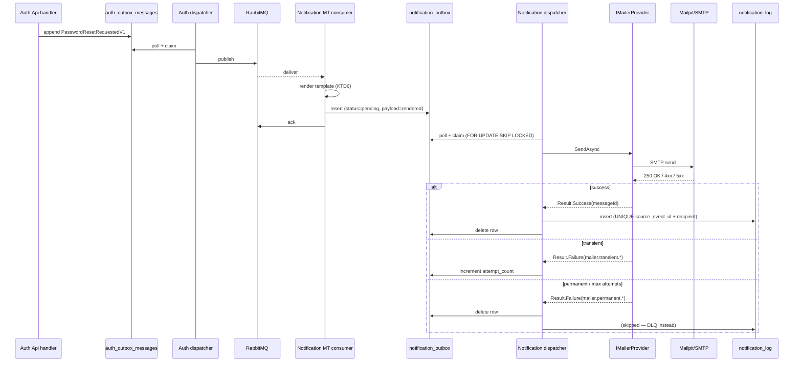
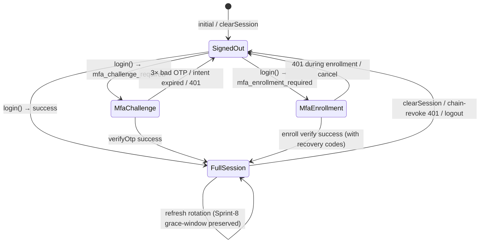

# feat: Sprint-9.5 — Notification module + frontend auth UX + cross-tenant integration tests

## Summary

Sprint-9.5 closes the six units deferred from Sprint-9 in a single tag `v0.13.0-sprint-9.5`. Three workstreams:

1. **Backend — ShopFlow.Notification module** (U1-U4): 7th business module quartet with outbox + log + DLQ persistence shape, MassTransit consumers for the four Sprint-9 cross-module events, MailKit + Mailpit dev SMTP + LoggingMailer fallback, Aspire wiring.
2. **Frontend — auth UX** (U5-U8): useAuth state machine extension (full-session / mfa-challenge / mfa-enrollment) + perm[] exposure + usePerm hook + httpClient 401/403 split + 5 new auth screens (`/forgot-password`, `/reset-password`, `/mfa/enroll`, `/mfa/challenge`, `/profile/security`) + Owner admin surface (MFA status column + locked-accounts panel + RolePermissionsEditor) + permission-based UI gating cross-cut.
3. **Tests** (U9): AuthCrossTenantTests + four KTD-pinning integration tests (KTD1 perm-array shape, KTD2 chain-aware revoke, KTD10 TOTP enroll cycle, KTD13 OwnerCritical guard) against Testcontainers Postgres + Redis.

The four Sprint-9 outbox events (`PasswordResetRequestedV1`, `RefreshReuseDetectedV1`, `AccountLockedV1`, `MfaEnrolledV1`) currently idle in RabbitMQ — Sprint-9.5 lights them up end-to-end.

---

## Problem Frame

Sprint-9 shipped the backend Auth foundation (RBAC + TOTP MFA + chain-aware refresh + lockout + reset) but stopped at a backend-only coherent tag. The four cross-module Auth events publish to RabbitMQ with no consumers; the 11 new Auth.Api endpoints (7 public + 4 admin) exist but are unreachable from the existing LoginScreen + Sidebar; Owner accounts are force-enrolled for MFA but cannot complete a successful login because no MFA branch UI exists.

Without Sprint-9.5: emails never deliver, Owners cannot log in, the admin surface stays Sprint-8-shaped, and the four cross-module contracts ship as no-op publishes that document an unfilled gap rather than a working pipeline. Beyond the immediate close, the Notification module is the natural landing slot for the 7th business module — every future cross-cutting transactional email need (order milestone alerts, channel webhook anomalies, future operator pager) would otherwise have to invent consumer + retry + template + DLQ patterns ad-hoc.

See origin: [docs/brainstorms/2026-05-20-sprint-9.5-notification-frontend-integration-tests-requirements.md](../brainstorms/2026-05-20-sprint-9.5-notification-frontend-integration-tests-requirements.md) for the full problem framing, 37 R-IDs, 6 Key Flows, and 7 Acceptance Examples.

---

## Requirements Coverage

This plan executes all 37 origin requirements (R1-R37 in the brainstorm) across 7 groups: Notification module shape (R1-R3), Email delivery semantics (R4-R10), Frontend useAuth + httpClient (R11-R15), 5 new auth screens (R16-R21), Owner admin surface (R22-R27), Permission-based UI gating (R28-R31), Integration tests (R32-R34), Cross-cutting (R35-R37). Implementation Units U1-U9 partition the requirements; U0 and U10 are branch-cut and sign-off bookends.

All 6 origin Key Flows (F1-F6) map to acceptance-test scenarios under U3 (F1, F6), U5 (F2, F3, F4), U7 (F5), and U9 (cross-tenant variants).

All 7 origin Acceptance Examples (AE1-AE7) are pinned to specific test scenarios — AE1/AE2 under U3, AE3 under U5, AE4 under U8, AE5 under U7, AE6/AE7 under U9.

---

## Scope Boundaries

### Deferred to Follow-Up Work

Items planned for separate sprints (origin "Deferred to Sprint-10+" subsection):

- Business module controller `[Authorize(Policy=...)]` migration (Inventory / Outbound / Inbound / Skus / Adjustments + AuthAdminController per-action policies). Sprint-10+.
- Per-user `preferred_locale` column on `users` + bilingual email templates. Sprint-10+. Sprint-9.5 emails are English-only.
- KMS/Vault migration of TOTP KEK (env-var Current/Previous remains).
- Affected-user email payload on chain-reuse (Sprint-9 emits Owner-only; OWASP stretch adds affected-user template).
- `/admin/notification-dlq` UI inspection tab; DLQ stays direct-DB query at Sprint-9.5 ship.
- `auth_audit_log` partitioning + archival.
- Distributed (Redis-backed) rate-limit store; in-memory `PartitionedRateLimiter` remains.
- Eager re-encrypt sweep on KEK rotation (lazy read-Current-fallback-Previous remains).

### Outside the Sprint-9.5 Scope

- No new Auth.Api endpoints. All 11 Sprint-9 endpoints unchanged.
- No new Notification REST surface beyond `/health`. Email arrives via event consumption; no synchronous send API.
- No new permission keys. The 24-key catalog from Sprint-9 U1 is stable.
- No `users.role` enum changes. RolePermissionsEditor renders exactly Owner / Picker / Dispatcher.

### Outside this product's identity

(Carried verbatim from origin)

- SMS / push / Slack / Telegram channels. Notification module is transactional auth-only.
- Generic multi-tenant SaaS-style email platform. The module owns this product's transactional emails, not a horizontal service.

---

## Key Technical Decisions

Sprint-9.5 KTDs are numbered KTD1-KTD12, separate from the 16 Sprint-9 KTDs.

- **KTD1 — Notification module follows the canonical quartet** (Domain + Application + Infrastructure + Api). `Domain` carries minimum value objects (`NotificationKind`, `Recipient`, `RenderedEmail`); `Application` owns the four consumer interfaces + `IMailerProvider` port; `Infrastructure` owns DbContext + migration + 4 consumers + `MailKitSmtpMailer` + `LoggingMailer` + `SimpleTemplateRenderer`; `Api` is a hosted-service host with only `/health` exposed.
- **KTD2 — Two-stage delivery via outbox + dispatcher**, NOT synchronous-send-in-consumer. MT consumer renders template + writes to `notification_outbox` (status=pending) + acks the message; background `MultiplexedOutboxDispatcher<NotificationDbContext>` polls + calls `IMailerProvider.SendAsync` + writes to `notification_log` on success or `notification_dead_letter` on terminal failure. Decouples MT consumer throughput from SMTP latency. Reuses the existing generic dispatcher in `ShopFlow.SharedKernel.Infrastructure` — no new dispatcher class.
- **KTD3 — Idempotency via `UNIQUE(source_event_id, recipient)` on `notification_log`**, not on the outbox. A duplicate MT redelivery races a second outbox row, but the dispatcher's `INSERT notification_log` fails on UNIQUE; the duplicate outbox row is silently dropped at debug log level. No double-send. Mirrors Channel module's `webhook_events(channel_id, provider_event_id)` UNIQUE pattern.
- **KTD4 — `IMailerProvider.SendAsync` returns `Result<MessageId>` with stable error codes** `mailer.transient.*` (retryable) vs `mailer.permanent.*` (terminal). MailKit's SMTP response codes map 4xx → transient, 5xx → permanent. Per-provider overrides via `SmtpResponseCodeMapper`.
- **KTD5 — `PasswordResetRequestedV1.ResetLinkUrl` is pre-built by the Auth handler** (not reconstructed inside Notification). The contract already carries the full URL per Sprint-9 doc-review P0 fix. `SimpleTemplateRenderer` substitutes the URL as one of its scalar tokens; the Notification module does not see plaintext tokens or compose URL templates.
- **KTD6 — `SimpleTemplateRenderer` is literal `{placeholder}` substitution only.** No conditionals, no loops, no `{{` escape sequences. The 4 templates are simple enough; recipient-supplied content (display name etc.) is HTML-escaped before substitution in the html templates to defuse injection from a hostile display name.
- **KTD7 — Mailpit pinned to a specific tag** per AGENTS.md rule 56 (no `latest`). Target: `axllent/mailpit:v1.21.0` (current stable as of plan-write; revisit at U4 implementation).
- **KTD8 — useAuth `authState` discriminator + in-memory `intentToken`.** Intent tokens for mfa-challenge / mfa-enrollment never persist to localStorage. Reload during MFA flow = fresh login from /login (acceptable; 5-min intent token TTL). Avoids a vulnerability surface where a half-completed enrollment leaks an intent token.
- **KTD9 — httpClient interceptor reads useAuth.authState before 401 decisions.** Full-session 401 → single-flight refresh + retry (Sprint-8 pattern preserved). MFA-state 401 → clear intent token + redirect /login. 403 always surfaces to caller, never refreshes, never clears session.
- **KTD10 — Permission-based UI gating ships ahead of backend `[Authorize(Policy=...)]` migration.** Frontend reads JWT `perm[]`; sets the Sprint-10+ pattern. Sidebar items, route guards, action buttons all gate on `usePerm`. Backend stays `[Authorize]` until Sprint-10+ flips both layers together.
- **KTD11 — RolePermissionsEditor renders Owner column read-only with a lock icon** (KTD13 Sprint-9 visualization). The KTD13 OwnerCritical 422 guard is server-side authoritative; the client-side lock is UX consistency.
- **KTD12 — `usePerm(...keys: string[])` fails closed.** Returns false when `useAuth.user.perm` is null/undefined. Stale Sprint-8 sessions (no perm[] claim) force a refresh-token rotation to repopulate. Acceptable because Sprint-9.5 ships after Sprint-9.
- **KTD16 — `/api/auth/mfa/enroll/begin` QR SVG response carries `Cache-Control: no-store`** per OWASP MFA enrollment guidance — prevents the otpauth-shaped shared secret from being disk-cached by the browser on public/shared machines. Carries forward Sprint-9 KTD16 (same constraint); restated here so U6's `Cache-Control honoured by backend per KTD16` reference resolves locally.

---

## High-Level Technical Design

*This illustrates the intended approach and is directional guidance for review, not implementation specification. The implementing agent should treat it as context, not code to reproduce.*

### Notification module delivery topology



### Frontend auth state machine (useAuth)



### httpClient 401/403 decision matrix

| HTTP status | authState         | Action                                                                 |
|-------------|-------------------|------------------------------------------------------------------------|
| 401         | full-session      | Single-flight refresh + retry original (Sprint-8 inflight-guard).      |
| 401         | mfa-challenge     | Clear intent token + redirect `/login` + toast "session expired".      |
| 401         | mfa-enrollment    | Clear intent token + redirect `/login` + toast "session expired".      |
| 401         | signed-out        | Redirect `/login`.                                                     |
| 403         | any               | Surface as `HttpError` to caller; no refresh; no session change.       |

---

## Output Structure

New directories created in this plan:

```text
src/Services/Notification/
├── AGENTS.md                          # ≤50 lines module-delta canon
├── ShopFlow.Notification.Domain/
│   ├── ShopFlow.Notification.Domain.csproj
│   └── ValueObjects/
│       ├── NotificationKind.cs        # enum: PasswordReset | RefreshReuse | AccountLocked | MfaEnrolled
│       ├── Recipient.cs               # email + display-name + tenant_id
│       └── RenderedEmail.cs           # subject + body_text + body_html + sourceEventId
├── ShopFlow.Notification.Application/
│   ├── ShopFlow.Notification.Application.csproj
│   ├── Ports/
│   │   ├── IMailerProvider.cs
│   │   ├── ITemplateRenderer.cs
│   │   ├── INotificationOutboxRepository.cs
│   │   └── INotificationLogRepository.cs
│   └── Consumers/
│       └── (interfaces only; impls in Infrastructure)
├── ShopFlow.Notification.Infrastructure/
│   ├── ShopFlow.Notification.Infrastructure.csproj
│   ├── NotificationServiceCollectionExtensions.cs
│   ├── NotificationDbContext.cs
│   ├── EntityConfigurations/
│   │   ├── NotificationOutboxEntryConfiguration.cs
│   │   ├── NotificationLogEntryConfiguration.cs
│   │   └── NotificationDeadLetterEntryConfiguration.cs
│   ├── Migrations/
│   │   └── 20260520000001_InitialNotificationSchema.cs
│   ├── Mailers/
│   │   ├── MailKitSmtpMailer.cs
│   │   ├── LoggingMailer.cs
│   │   ├── SmtpResponseCodeMapper.cs
│   │   └── MailerOptions.cs
│   ├── Templates/
│   │   ├── SimpleTemplateRenderer.cs
│   │   ├── password-reset.txt.tmpl    (embedded resource)
│   │   ├── password-reset.html.tmpl
│   │   ├── refresh-reuse.txt.tmpl
│   │   ├── refresh-reuse.html.tmpl
│   │   ├── account-locked.txt.tmpl
│   │   ├── account-locked.html.tmpl
│   │   ├── mfa-enrolled.txt.tmpl
│   │   └── mfa-enrolled.html.tmpl
│   ├── Consumers/
│   │   ├── PasswordResetRequestedConsumer.cs
│   │   ├── RefreshReuseDetectedConsumer.cs
│   │   ├── AccountLockedConsumer.cs
│   │   └── MfaEnrolledConsumer.cs
│   └── Repositories/
│       ├── NotificationOutboxRepository.cs
│       └── NotificationLogRepository.cs
└── ShopFlow.Notification.Api/
    ├── ShopFlow.Notification.Api.csproj
    ├── Program.cs
    ├── appsettings.json
    └── appsettings.Development.json

tests/ShopFlow.Notification.UnitTests/
├── ShopFlow.Notification.UnitTests.csproj
├── ModuleShapeSmokeTests.cs
├── SimpleTemplateRendererTests.cs
├── SmtpResponseCodeMapperTests.cs
└── Consumers/
    └── (4 consumer harness tests via MT TestHarness + NSubstitute)

tests/ShopFlow.Notification.IntegrationTests/
├── ShopFlow.Notification.IntegrationTests.csproj
├── NotificationTenantFixture.cs       # mirrors Sprint-8 AuthTenantFixture
├── HappyPathDeliveryFlowTests.cs      # AE1: dedup + AE2: retry + DLQ
└── DispatcherClaimSemanticsTests.cs   # FOR UPDATE SKIP LOCKED

web/src/components/auth/
├── MfaEnrollScreen.tsx
├── MfaEnrollScreen.test.tsx
├── MfaChallengeScreen.tsx
├── MfaChallengeScreen.test.tsx
├── ForgotPasswordScreen.tsx
├── ForgotPasswordScreen.test.tsx
├── ResetPasswordScreen.tsx
├── ResetPasswordScreen.test.tsx
├── ProfileSecurityScreen.tsx
├── ProfileSecurityScreen.test.tsx
├── RecoveryCodesDisplay.tsx
└── RecoveryCodesDisplay.test.tsx

web/src/components/admin/
├── MfaStatusBadge.tsx
├── MfaStatusBadge.test.tsx
├── LockedAccountsTable.tsx
├── LockedAccountsTable.test.tsx
├── RolePermissionsEditor.tsx
└── RolePermissionsEditor.test.tsx

web/src/routes/_auth/
├── forgot-password.tsx
├── reset-password.tsx
├── mfa/
│   ├── enroll.tsx
│   └── challenge.tsx
├── profile/
│   └── security.tsx
└── admin/
    ├── users.tsx                       (extended — MFA column + row actions)
    ├── locked-accounts.tsx
    └── role-permissions.tsx

web/src/hooks/
├── usePerm.ts
└── usePerm.test.ts

tests/ShopFlow.Auth.IntegrationTests/  (existing project — new test classes added)
├── AuthCrossTenantTests.cs            # R32
├── KtdPinningTests/
│   ├── JwtPermClaimIntegrationTests.cs        # KTD1
│   ├── ChainAwareRefreshIntegrationTests.cs   # KTD2
│   ├── TotpEnrollmentIntegrationTests.cs      # KTD10
│   └── RolePermissionsOwnerCriticalIntegrationTests.cs  # KTD13
```

The per-unit `**Files:**` sections remain authoritative for what each unit creates or modifies.

---

## System-Wide Impact

**Backend (.NET):**
- New 7th business module (`ShopFlow.Notification.*`) — 4 csproj added to `ShopFlow.sln`. Build count: 41 → 45.
- New `ShopFlow.Notification.UnitTests` + `ShopFlow.Notification.IntegrationTests` projects.
- 1 new EF migration (`20260520000001_InitialNotificationSchema`) — applies per tenant DB.
- 1 new control-plane registration (`IModuleMigrationRegistry` registers Notification).
- 4 cross-module Auth contracts (unchanged) — Notification now consumes.
- Aspire AppHost gains 1 container resource (Mailpit) + 1 project resource (notification-api).
- No changes to Auth / Inventory / Outbound / Inbound / Channel / StockSync source. Notification is purely additive.

**Frontend (Vite + React + TanStack Router):**
- 5 new auth screens, 3 new admin screens, 1 RecoveryCodesDisplay primitive, 1 new MfaStatusBadge component, 1 new LockedAccountsTable, 1 new RolePermissionsEditor.
- useAuth extended (additive — Sprint-8 fields + back-compat shims preserved per CLAUDE.md Sprint-8 trade-off #11).
- httpClient extended (additive — Sprint-8 inflight-refresh-guard preserved).
- 1 new usePerm hook + companion routing guard.
- Sidebar nav rewired with perm[] gating (existing items see no behavior change for Owner; Picker/Dispatcher lose visibility).
- TanStack Router beforeLoad guards on /admin/* routes.
- New axe smoke harness extensions (5 screens + 3 admin + RecoveryCodesDisplay = 9 new a11y cases).
- Vi/En labels via existing `labelsFor` — adds ~50 new bilingual strings for the new screens.

**Migrations:**
- 1 net-new Notification migration; no Auth/Inventory/Outbound/Inbound/Channel migrations.
- `shopflow-migrate provision --tenant=<slug>` now applies Notification schema alongside the other modules.

**Operations:**
- Mailpit dev container adds 2 ports (1025 SMTP, 8025 web UI). Local-dev surface area increase: minimal.
- Prod ops: SMTP provider credentials added to deploy-time config (`Notification:Mailer:MailKitSmtp:*`). Mailpit not deployed to prod.
- New observability surface: notification_outbox depth + notification_dead_letter count are operator-readable signals.

**CI:**
- Test count: backend ~+30 unit tests + ~+10 integration tests; frontend ~+80 Vitest cases + 9 a11y cases.
- Integration tests Skip-marked when Docker unavailable (Sprint-1+ posture preserved); CI runs the full suite.

---

## Implementation Units

### U0. Branch cut + plan landing + 12 KTDs in opening commit

**Goal:** Establish the Sprint-9.5 branch from `v0.12.0-sprint-9`, push the prior tag + branch first (per the "push before phase switch" memory rule), and land this plan + brainstorm in the opening commit body.

**Requirements:** Plan governance only (no R-ID mapping).

**Dependencies:** none.

**Files:**
- `docs/brainstorms/2026-05-20-sprint-9.5-notification-frontend-integration-tests-requirements.md` (already exists)
- `docs/plans/2026-05-20-004-feat-sprint-9.5-notification-frontend-integration-tests-plan.md` (this file)

**Approach:**
1. Verify `v0.12.0-sprint-9` tag + `feat/sprint-9-rbac-mfa-hardening` branch pushed to origin.
2. `git checkout -b feat/sprint-9.5-notification-frontend-tests v0.12.0-sprint-9`.
3. Commit brainstorm + plan + opening unit message enumerating the 12 KTDs verbatim from this plan's Key Technical Decisions section.

**Test scenarios:** none — branch-cut unit.

**Verification:** Branch exists on `origin`; tag `v0.12.0-sprint-9` reachable from `feat/sprint-9.5-notification-frontend-tests`; commit body includes the 12 KTDs.

---

### U1. Notification module quartet scaffold + 3-table schema + IModuleMigrationRegistry registration

**Goal:** Land the 7th business module skeleton with the full quartet, 3-table schema (`notification_outbox` + `notification_log` + `notification_dead_letter`), EF entity configurations, initial migration, and `IModuleMigrationRegistry` entry so `shopflow-migrate provision --tenant=<slug>` applies the new schema. Closes Sprint-9 U12 partial deferral.

**Requirements:** R1, R3, R37.

**Dependencies:** U0.

**Files:**
- `src/Services/Notification/ShopFlow.Notification.Domain/ShopFlow.Notification.Domain.csproj` (new)
- `src/Services/Notification/ShopFlow.Notification.Domain/ValueObjects/NotificationKind.cs` (new — enum: PasswordReset / RefreshReuse / AccountLocked / MfaEnrolled)
- `src/Services/Notification/ShopFlow.Notification.Domain/ValueObjects/Recipient.cs` (new — value object: email + display-name + tenant_id)
- `src/Services/Notification/ShopFlow.Notification.Domain/ValueObjects/RenderedEmail.cs` (new — value object: subject + body_text + body_html + sourceEventId Guid)
- `src/Services/Notification/ShopFlow.Notification.Application/ShopFlow.Notification.Application.csproj` (new — pure interfaces only)
- `src/Services/Notification/ShopFlow.Notification.Application/Ports/INotificationOutboxRepository.cs` (new)
- `src/Services/Notification/ShopFlow.Notification.Application/Ports/INotificationLogRepository.cs` (new)
- `src/Services/Notification/ShopFlow.Notification.Infrastructure/ShopFlow.Notification.Infrastructure.csproj` (new)
- `src/Services/Notification/ShopFlow.Notification.Infrastructure/NotificationDbContext.cs` (new)
- `src/Services/Notification/ShopFlow.Notification.Infrastructure/EntityConfigurations/NotificationOutboxEntryConfiguration.cs` (new)
- `src/Services/Notification/ShopFlow.Notification.Infrastructure/EntityConfigurations/NotificationLogEntryConfiguration.cs` (new — UNIQUE `(source_event_id, recipient)` per KTD3)
- `src/Services/Notification/ShopFlow.Notification.Infrastructure/EntityConfigurations/NotificationDeadLetterEntryConfiguration.cs` (new)
- `src/Services/Notification/ShopFlow.Notification.Infrastructure/Migrations/20260520000001_InitialNotificationSchema.cs` (new — `[Migration]` + `[DbContext]` attrs per AGENTS.md rule 23)
- `src/Services/Notification/ShopFlow.Notification.Api/ShopFlow.Notification.Api.csproj` (new — Web SDK, hosted-service host shape)
- `src/Services/Notification/AGENTS.md` (new — ≤50 lines per AGENTS.md rule 82)
- `tests/ShopFlow.Notification.UnitTests/ShopFlow.Notification.UnitTests.csproj` (new)
- `tests/ShopFlow.Notification.UnitTests/ModuleShapeSmokeTests.cs` (new — 6th `Module*Tests` smoke per Phase-0-redux U9)
- `tools/shopflow-migrate/Program.cs` (modify — chain a `.Register(new ModuleMigrationDescriptor(moduleName: "Notification", dbContextType: typeof(NotificationDbContext), ...))` onto the existing `AddSingleton<IModuleMigrationRegistry>` lambda alongside the existing Inventory + Auth registrations)
- `ShopFlow.sln` (modify — add 4 csproj + 1 test csproj)

**Approach:**
- Csproj quartet follows the canonical layout per AGENTS.md §11.76. Project references: `Api → Infrastructure + Application`, `Infrastructure → Application + Domain`, `Application → Domain`, `Domain → SharedKernel`.
- `NotificationDbContext` mirrors `AuthDbContext` shape — built per-request via `IDbContextFactory<NotificationDbContext>` registration in U3's composition extension; the U1 `services.AddScoped<NotificationDbContext>` registration follows the same per-tenant `IRequestContext.DbConnectionString` lambda Auth uses.
- Schema (per-tenant DB):
  - `notification_outbox(id uuid pk, source_event_id uuid, notification_kind text, recipient_email text, recipient_display_name text NULL, rendered_subject text, rendered_body_text text, rendered_body_html text, status text default 'pending', attempt_count int default 0, last_attempt_at timestamptz NULL, last_error_code text NULL, created_at timestamptz default now(), updated_at timestamptz default now())` + indexes `(status, created_at)` for poll + `(source_event_id)` for dedup checks.
  - `notification_log(id uuid pk, source_event_id uuid, recipient_email text, notification_kind text, message_id text, provider_response_code text, sent_at timestamptz, created_at timestamptz, updated_at timestamptz)` + `UNIQUE(source_event_id, recipient_email)` per KTD3.
  - `notification_dead_letter(id uuid pk, source_event_id uuid, recipient_email text, notification_kind text, payload_json jsonb, attempt_count int, last_error_code text, last_error_message text, dead_lettered_at timestamptz, created_at timestamptz, updated_at timestamptz)` + index `(dead_lettered_at)`.
- `IModuleMigrationRegistry` registration follows the Inventory + Auth precedent already wired in `tools/shopflow-migrate/Program.cs` — chain one more `.Register(new ModuleMigrationDescriptor(...))` call onto the existing AddSingleton lambda.

**Patterns to follow:** [src/Services/Auth/ShopFlow.Auth.Infrastructure/AuthDbContext.cs](src/Services/Auth/ShopFlow.Auth.Infrastructure/AuthDbContext.cs) (DbContext shape), [src/Services/Auth/ShopFlow.Auth.Infrastructure/Migrations/](src/Services/Auth/ShopFlow.Auth.Infrastructure/Migrations/) (migration attribute set), [src/Services/Inbound/ShopFlow.Inbound.Infrastructure/EntityConfigurations/OutboxMessageConfiguration.cs](src/Services/Inbound/ShopFlow.Inbound.Infrastructure/EntityConfigurations/OutboxMessageConfiguration.cs) (per-module outbox naming pattern from Sprint-2.5).

**Test scenarios:**
- `ModuleShapeSmokeTests`: Notification.Application marker type exists + namespace matches `ShopFlow.Notification.Application`; Notification.Infrastructure carries `NotificationDbContext`; Notification.Domain carries all 3 value object types.
- Value object construction tests for `Recipient` + `RenderedEmail`: rejects null/empty email, rejects oversized subject (>998 chars per RFC 5322), trims whitespace.

**Verification:**
- `dotnet build ShopFlow.sln` → 0 errors + 0 warnings; project count: 41 → 45.
- `dotnet test tests/ShopFlow.Notification.UnitTests/` → smoke + value-object tests green.
- `IModuleMigrationRegistry` enumeration includes Notification.

---

### U2. IMailerProvider abstraction + LoggingMailer + MailKitSmtpMailer + SimpleTemplateRenderer

**Goal:** Implement the mailer provider abstraction with stable transient/permanent error codes, the dev-default `LoggingMailer`, the prod-shaped `MailKitSmtpMailer` against SMTP servers (Mailpit in dev, real provider in prod), and the literal `{placeholder}` template renderer.

**Requirements:** R6, R8, R37.

**Dependencies:** U1.

**Files:**
- `src/Services/Notification/ShopFlow.Notification.Application/Ports/IMailerProvider.cs` (new)
- `src/Services/Notification/ShopFlow.Notification.Application/Ports/ITemplateRenderer.cs` (new)
- `src/Services/Notification/ShopFlow.Notification.Infrastructure/Mailers/MailerOptions.cs` (new — `Provider` enum {Logging, MailKitSmtp} + `MailKitSmtp: {Host, Port, Username, Password, FromEmail, FromDisplayName, UseStartTls}` block + `Mailpit: {Host=mailpit, Port=1025}` dev sub-block)
- `src/Services/Notification/ShopFlow.Notification.Infrastructure/Mailers/MailKitSmtpMailer.cs` (new)
- `src/Services/Notification/ShopFlow.Notification.Infrastructure/Mailers/LoggingMailer.cs` (new — structured log line + always returns `Result.Success(syntheticMessageId)`)
- `src/Services/Notification/ShopFlow.Notification.Infrastructure/Mailers/SmtpResponseCodeMapper.cs` (new — 4xx→transient, 5xx→permanent default + per-provider override hook)
- `src/Services/Notification/ShopFlow.Notification.Infrastructure/Templates/SimpleTemplateRenderer.cs` (new — `IDictionary<string, string>` substitution + HTML-escape on html templates)
- `tests/ShopFlow.Notification.UnitTests/SimpleTemplateRendererTests.cs` (new)
- `tests/ShopFlow.Notification.UnitTests/SmtpResponseCodeMapperTests.cs` (new)
- `tests/ShopFlow.Notification.UnitTests/Mailers/LoggingMailerTests.cs` (new)
- `tests/ShopFlow.Notification.UnitTests/Mailers/MailKitSmtpMailerTests.cs` (new — uses MailKit's `SmtpClient` mockable surface or `Fake-SMTP` Testcontainer indirectly)
- `Directory.Packages.props` (modify — add `MailKit` version pin per AGENTS.md CPM rule)

**Approach:**
- `IMailerProvider.SendAsync(RenderedEmail email, CancellationToken ct) → Task<Result<MessageId>>` per KTD4.
- `MailKitSmtpMailer` uses MailKit's `SmtpClient`. Authentication: SASL PLAIN when `Username` non-empty; anonymous otherwise (Mailpit dev). STARTTLS opportunistic per `UseStartTls`.
- `SmtpResponseCodeMapper.Map(SmtpException ex)` → `("mailer.transient.smtp_4xx", ex.StatusCode)` | `("mailer.permanent.smtp_5xx", ex.StatusCode)` | `("mailer.transient.connection", ex.Message)` for connection-level failures.
- `SimpleTemplateRenderer.RenderText(template, vars)` + `RenderHtml(template, vars)`. Html variant HTML-escapes values (System.Net.WebUtility.HtmlEncode) before substitution. Literal `{placeholder}` only — no conditionals, no escape sequences, no nested expressions.

**Patterns to follow:** [src/Services/Auth/ShopFlow.Auth.Infrastructure/Hashing/Argon2idPasswordHasher.cs](src/Services/Auth/ShopFlow.Auth.Infrastructure/Hashing/Argon2idPasswordHasher.cs) (singleton infrastructure service with options binding); [src/Shared/ShopFlow.SharedKernel/Result.cs](src/Shared/ShopFlow.SharedKernel/Result.cs) (Result<T> shape).

**Test scenarios:**
- `SimpleTemplateRendererTests`:
  - Renders `Hello {name}, your link: {url}` with `{name: "Alice", url: "https://x.com"}` to `Hello Alice, your link: https://x.com`.
  - Missing key throws `TemplateRenderException` with the missing key name.
  - HTML variant escapes `<script>` injected via display-name to `&lt;script&gt;`.
  - Text variant does NOT escape (raw passthrough).
  - Unbalanced `{` without closing `}` is treated as literal text.
- `SmtpResponseCodeMapperTests`:
  - SmtpException with status 421 → `mailer.transient.smtp_4xx`.
  - SmtpException with status 550 → `mailer.permanent.smtp_5xx`.
  - Connection refused → `mailer.transient.connection`.
  - Per-provider override via `IDictionary<int, string>` config (Sendgrid 5xx-quota → transient).
- `LoggingMailerTests`: SendAsync writes a structured log entry with the rendered subject + recipient + synthetic message_id; returns `Result.Success`.
- `MailKitSmtpMailerTests`: Connection failure maps to transient; authentication failure (535) maps to permanent; happy-path send produces a Message-Id.

**Verification:** `dotnet test tests/ShopFlow.Notification.UnitTests/` → all template + mapper + mailer tests green.

---

### U3. 4 MT consumers + 4 templates × 2 + AddNotificationModule composition root + MultiplexedOutboxDispatcher wiring

**Goal:** Land the 4 MassTransit consumers (one per Sprint-9 cross-module event), the 8 embedded template files, the `AddNotificationModule(IConfiguration)` composition extension wiring consumers + dispatcher + repositories + mailer per provider switch, and the `MultiplexedOutboxDispatcher<NotificationDbContext>` background service.

**Requirements:** R2, R4, R5, R7, R8, R10. Closes Sprint-9 trade-off #1 (Notification module not yet built).

**Dependencies:** U1, U2.

**Files:**
- `src/Services/Notification/ShopFlow.Notification.Infrastructure/NotificationServiceCollectionExtensions.cs` (new — `AddNotificationModule(this IServiceCollection, IConfiguration)`)
- `src/Services/Notification/ShopFlow.Notification.Infrastructure/Consumers/PasswordResetRequestedConsumer.cs` (new)
- `src/Services/Notification/ShopFlow.Notification.Infrastructure/Consumers/RefreshReuseDetectedConsumer.cs` (new — fan-out to Owner-role users for tenant per Sprint-9 KTD15)
- `src/Services/Notification/ShopFlow.Notification.Infrastructure/Consumers/AccountLockedConsumer.cs` (new — same Owner-fan-out shape)
- `src/Services/Notification/ShopFlow.Notification.Infrastructure/Consumers/MfaEnrolledConsumer.cs` (new — sends to the user themselves)
- `src/Services/Notification/ShopFlow.Notification.Infrastructure/Repositories/NotificationOutboxRepository.cs` (new)
- `src/Services/Notification/ShopFlow.Notification.Infrastructure/Repositories/NotificationLogRepository.cs` (new — 23505 → log-and-drop dedup path per KTD3)
- `src/Services/Notification/ShopFlow.Notification.Infrastructure/Templates/password-reset.txt.tmpl` (new embedded resource)
- `src/Services/Notification/ShopFlow.Notification.Infrastructure/Templates/password-reset.html.tmpl` (new)
- `src/Services/Notification/ShopFlow.Notification.Infrastructure/Templates/refresh-reuse.txt.tmpl` (new)
- `src/Services/Notification/ShopFlow.Notification.Infrastructure/Templates/refresh-reuse.html.tmpl` (new)
- `src/Services/Notification/ShopFlow.Notification.Infrastructure/Templates/account-locked.txt.tmpl` (new)
- `src/Services/Notification/ShopFlow.Notification.Infrastructure/Templates/account-locked.html.tmpl` (new)
- `src/Services/Notification/ShopFlow.Notification.Infrastructure/Templates/mfa-enrolled.txt.tmpl` (new)
- `src/Services/Notification/ShopFlow.Notification.Infrastructure/Templates/mfa-enrolled.html.tmpl` (new)
- `tests/ShopFlow.Notification.UnitTests/Consumers/PasswordResetRequestedConsumerTests.cs` (new — MT TestHarness + NSubstitute)
- `tests/ShopFlow.Notification.UnitTests/Consumers/RefreshReuseDetectedConsumerTests.cs` (new)
- `tests/ShopFlow.Notification.UnitTests/Consumers/AccountLockedConsumerTests.cs` (new)
- `tests/ShopFlow.Notification.UnitTests/Consumers/MfaEnrolledConsumerTests.cs` (new)

**Approach:**
- Each consumer:
  1. Resolves `Recipient` list — for `PasswordResetRequestedV1` + `MfaEnrolledV1` it's a single recipient from the event payload (the user); for `RefreshReuseDetectedV1` + `AccountLockedV1` it's all Owner-role users for the tenant via `IUserRepository.ListByRoleAsync(UserRole.Owner)` (Sprint-9 U2 port — already shipped).
  2. Renders both text + html variants via `SimpleTemplateRenderer` with a dict carrying the event's scalars (`user_email`, `reset_link_url`, `presenting_ip`, `locked_until_utc`, etc.).
  3. Writes one `notification_outbox` row per recipient via `INotificationOutboxRepository.AppendAsync`.
- `AddNotificationModule`:
  - Registers `NotificationDbContext` scoped (per-request from `IRequestContext.DbConnectionString` — same pattern as Auth).
  - Binds `MailerOptions` from `Notification:Mailer` config section.
  - Conditionally registers `IMailerProvider` based on `Notification:Mailer:Provider`:
    - `Provider=Logging` → `services.AddSingleton<IMailerProvider, LoggingMailer>();`
    - `Provider=MailKitSmtp` → `services.AddSingleton<IMailerProvider, MailKitSmtpMailer>();`
  - Registers `ITemplateRenderer` as `SimpleTemplateRenderer` singleton.
  - Registers repositories scoped.
  - Registers consumers via `AddMassTransit(...)` `.AddConsumer<T>()` calls — auto-discovered by MT scanning.
  - Registers `services.AddHostedService<MultiplexedOutboxDispatcher<NotificationDbContext>>();` — reuses generic dispatcher per KTD2.
- Template content for each:
  - **password-reset**: Subject "Reset your ShopFlow password", body refs `{reset_link_url}` + `{expires_at_utc}`.
  - **refresh-reuse**: Subject "Suspicious activity on account {affected_user_email}", body refs `{affected_user_email}` + `{presenting_ip}` + `{user_agent}` + `{occurred_at_utc}`.
  - **account-locked**: Subject "Account locked: {user_email}", body refs `{user_email}` + `{failed_login_count}` + `{locked_until_utc}` + `{source_ip}`.
  - **mfa-enrolled**: Subject "Multi-factor authentication enabled on your ShopFlow account", body refs `{user_email}` + `{occurred_at_utc}` + a reminder to keep recovery codes safe.

**Patterns to follow:** [src/Services/Outbound/ShopFlow.Outbound.Application/Consumers/OrderImportedConsumer.cs](src/Services/Outbound/ShopFlow.Outbound.Application/Consumers/OrderImportedConsumer.cs) (Sprint-4 cross-module consumer shape — though that one's in Application; Notification puts consumers in Infrastructure because they touch repositories + renderer); [src/Services/Auth/ShopFlow.Auth.Infrastructure/AuthServiceCollectionExtensions.cs](src/Services/Auth/ShopFlow.Auth.Infrastructure/AuthServiceCollectionExtensions.cs) (composition root template).

**Test scenarios:**
- `PasswordResetRequestedConsumerTests`:
  - **Covers F1, AE1.** Single delivery → 1 outbox row inserted with rendered subject/body + correct source_event_id + recipient email; consume completes; second delivery of same envelope inserts another outbox row but log UNIQUE prevents double-send (covered in `HappyPathDeliveryFlowTests` U4).
  - Unknown `TenantId` (catalog miss) → consumer logs error + does NOT insert outbox row (consumer must not silently swallow tenant-resolution failures).
  - Empty `UserEmail` → outbox row insertion fails validation upstream of consumer (defensive; contract should not allow but guards against bad upstream emit).
- `RefreshReuseDetectedConsumerTests`:
  - Tenant with 1 Owner → 1 outbox row.
  - Tenant with 3 Owners → 3 outbox rows, all carrying the same source_event_id but distinct recipient_email + dedup-safe via UNIQUE later.
  - Tenant with 0 Owners → 0 outbox rows + debug-log line.
- `AccountLockedConsumerTests`: same Owner-fan-out scenarios.
- `MfaEnrolledConsumerTests`: single recipient = `event.UserEmail`; tenant Owners NOT included (KTD R28 — different fan-out shape).
- Each consumer test verifies template rendering by snapshot-asserting subject/body substrings (not full templates — those test in U2 renderer).

**Verification:** `dotnet test tests/ShopFlow.Notification.UnitTests/Consumers/` → all 4 consumer suites green.

---

### U4. Mailpit Aspire wiring + Notification.Api Program.cs + happy-path integration test

**Goal:** Add Mailpit as an Aspire container resource, compose Notification.Api as a hosted-service host with WithReference(postgres, rabbitmq, mailpit), wire appsettings.Development.json defaults pointing at Mailpit, ship the IntegrationTests fixture pattern (mirrors Sprint-8 `AuthTenantFixture`), and land 1 happy-path delivery test covering F1 + 1 retry-then-DLQ test covering AE2.

**Requirements:** R9, R10, R34 (Skip-mark posture preserved). Closes Sprint-9 trade-off #4 (MailKit prod SMTP not exercised) via the dev Mailpit path.

**Dependencies:** U3.

**Files:**
- `src/Services/Notification/ShopFlow.Notification.Api/Program.cs` (new — `AddShopFlowDefaults` + `AddControlPlane` + `AddNotificationModule` + `MapGet("/health", () => "OK")` + minimal hosted-service shape)
- `src/Services/Notification/ShopFlow.Notification.Api/appsettings.json` (new — base provider=Logging fallback)
- `src/Services/Notification/ShopFlow.Notification.Api/appsettings.Development.json` (new — provider=MailKitSmtp + Host=mailpit + Port=1025 + anonymous auth)
- `src/AppHost/ShopFlow.AppHost/Program.cs` (modify — add `mailpit` container resource at `axllent/mailpit:v1.21.0` per KTD7; add `notification-api` project resource with `WithReference(postgres, rabbitmq, mailpit)`)
- `src/AppHost/ShopFlow.AppHost/ShopFlow.AppHost.csproj` (modify — add `ProjectReference` to Notification.Api)
- `tests/ShopFlow.Notification.IntegrationTests/ShopFlow.Notification.IntegrationTests.csproj` (new)
- `tests/ShopFlow.Notification.IntegrationTests/NotificationTenantFixture.cs` (new — Testcontainers Postgres + RabbitMQ + Mailpit; mirrors `AuthTenantFixture`)
- `tests/ShopFlow.Notification.IntegrationTests/HappyPathDeliveryFlowTests.cs` (new — F1 happy path + AE1 dedup + AE2 retry/DLQ)
- `tests/ShopFlow.Notification.IntegrationTests/DispatcherClaimSemanticsTests.cs` (new — concurrent dispatcher claim via `FOR UPDATE SKIP LOCKED`)
- `ShopFlow.sln` (modify — add IntegrationTests csproj)

**Approach:**
- Aspire wiring:
  ```csharp
  var mailpit = builder
      .AddContainer("mailpit", "axllent/mailpit", "v1.21.0")
      .WithEndpoint(port: 1025, targetPort: 1025, name: "smtp", scheme: "tcp")
      .WithEndpoint(port: 8025, targetPort: 8025, name: "web", scheme: "http");
  var notificationApi = builder
      .AddProject<Projects.ShopFlow_Notification_Api>("notification-api")
      .WithReference(postgres)
      .WithReference(rabbitmq)
      .WithReference(mailpit)
      .WaitForCompletion(migrateDev2);
  ```
  *Note: KTD7 pins `axllent/mailpit:v1.21.0` at plan-write; verify the latest stable at U4 commit time per AGENTS.md rule 56.*
- `appsettings.Development.json` carries `"Notification:Mailer:Provider": "MailKitSmtp"` + `"Notification:Mailer:MailKitSmtp": { "Host": "mailpit", "Port": 1025, "FromEmail": "no-reply@shopflow.dev", "FromDisplayName": "ShopFlow", "UseStartTls": false }`.
- `appsettings.json` (base prod-shape) carries `"Notification:Mailer:Provider": "Logging"` as a safety default — prod overrides via env-var to `MailKitSmtp` + real credentials at deploy time.
- `NotificationTenantFixture`: provisions a fresh tenant DB via `shopflow-migrate`, boots Mailpit Testcontainer + Postgres Testcontainer + RabbitMQ Testcontainer (or in-process MT transport), exposes `Sender` (publish into Auth's outbox → flows through to Notification consumer) + `MailpitClient` (HTTP GET `http://localhost:{port}/api/v1/messages` to inspect delivered emails).
- All integration tests carry `[Trait("Category", "Integration")]` + `Skip` attribute checking for Docker daemon availability per Sprint-1+ posture.

**Patterns to follow:** [src/AppHost/ShopFlow.AppHost/Program.cs](src/AppHost/ShopFlow.AppHost/Program.cs) `AddContainer` precedent (5 existing — seq, prometheus, tempo, otel-collector, minio); [tests/ShopFlow.Auth.IntegrationTests/AuthTenantFixture.cs](tests/ShopFlow.Auth.IntegrationTests/AuthTenantFixture.cs) (Sprint-8 fixture shape); [tests/ShopFlow.Migrate.IntegrationTests/MigrateTenantFixture.cs](tests/ShopFlow.Migrate.IntegrationTests/MigrateTenantFixture.cs) (Sprint-8.5 fixture pattern).

**Test scenarios:**
- `HappyPathDeliveryFlowTests`:
  - **Covers F1 + AE1.** Given Auth emits `PasswordResetRequestedV1`, when Notification consumer + dispatcher process the event, then Mailpit receives 1 email with the rendered subject + reset link + recipient; `notification_log` has 1 row with `status=sent`.
  - **Covers AE1 dedup.** Given the same `PasswordResetRequestedV1` envelope is delivered twice (forced MT redelivery), then `notification_log` has exactly 1 row; the duplicate outbox row is dropped; Mailpit receives 1 email (not 2).
  - **Covers AE2 retry + DLQ.** Given Mailpit is taken offline mid-test (or returns 500), when the dispatcher attempts send, then `attempt_count` increments per attempt; after `MaxAttempts=3` failures the row moves to `notification_dead_letter` with `last_error_code=mailer.transient.connection`; no `notification_log` row.
- `DispatcherClaimSemanticsTests`:
  - Given two dispatcher instances running concurrently against one outbox row, when both poll, then exactly one claims via `FOR UPDATE SKIP LOCKED`; the other reads the row as locked + moves on.

**Verification:**
- `dotnet aspirate up` boots without errors; Mailpit web UI reachable at `localhost:8025`; submitting a password-reset via Auth.Api results in email arriving in Mailpit within 5 seconds.
- `dotnet test tests/ShopFlow.Notification.IntegrationTests/` → 4 tests green when Docker available; Skip-marked otherwise.

---

### U5. Frontend useAuth state machine + httpClient 401/403 split + LoginScreen MFA branch + auth.ts discriminated-union

**Goal:** Extend `useAuth` with the `authState` discriminator + `intentToken` in-memory state + `user.perm[]` extraction. Extend `httpClient` interceptor to branch 401 handling on `authState` per KTD9. Extend `auth.ts` to return the Sprint-9 discriminated-union LoginResponse. Extend LoginScreen to detect mfa-challenge / mfa-enrollment responses and navigate accordingly. Closes Sprint-9 trade-off #2 (no frontend changes).

**Requirements:** R11, R12, R13, R14, R15, R31. Covers F2, F3, F4.

**Dependencies:** U0 (Sprint-9.5 branch; Notification module not required for this unit — backend Sprint-9 surface is already shipped).

**Files:**
- `web/src/hooks/useAuth.ts` (modify — extend AuthState interface + add `authState`, `intentToken`, `setMfaChallenge`, `setMfaEnrollment`, `clearIntent` methods)
- `web/src/hooks/useAuth.test.ts` (modify — add ~20 new tests for state transitions + intent token lifecycle + perm[] extraction)
- `web/src/hooks/usePerm.ts` (new — per KTD12 fail-closed)
- `web/src/hooks/usePerm.test.ts` (new — happy path + null user + missing perm[] + multi-key all-required)
- `web/src/api/auth.ts` (modify — `login()` returns `LoginResult` discriminated union per R12; add `verifyMfa()`, `beginEnroll()`, `verifyEnroll()`, `forgotPassword()`, `resetPasswordConfirm()`, `disableMfa()`, `regenerateRecoveryCodes()`)
- `web/src/api/httpClient.ts` (modify — 401/403 split per F4 + KTD9; reads `useAuth.authState` before refresh decision)
- `web/src/api/httpClient.test.ts` (modify — add ~10 new tests for 401/403 split + intent-state behavior)
- `web/src/components/auth/LoginScreen.tsx` (modify — detect 3 LoginResult variants + navigate)
- `web/src/components/auth/LoginScreen.test.tsx` (modify — add 6 new tests for the 3 happy-path branches + 3 error variants)
- `web/src/lib/jwt.ts` (modify — extend `JwtPayload` shape to include `perm?: string[]`; verify decode preserves array shape)
- `web/src/lib/jwt.test.ts` (modify — add test for `perm[]` extraction)

**Approach:**
- `useAuth.authState` field: `'full-session' | 'mfa-challenge' | 'mfa-enrollment' | 'signed-out'`. Derives from existing `isAuthenticated` + intentToken presence on initial load.
- `useAuth.intentToken: string | null` — in-memory ONLY (never `writeStored`). Cleared on auth-state transition or `clearSession`.
- `useAuth.user.perm: readonly string[]`: extracted via `userFromJwt` with explicit array-shape guard — `Array.isArray(payload.perm) ? payload.perm.filter(x => typeof x === 'string') : []`. Defensive parse defuses the case where a future JsonWebTokenHandler quirk emits `perm` as a delimited string instead of an array; falls back to empty array → KTD12 fail-closed → `usePerm` returns false. Add a `jwt.test.ts` case asserting a malformed (string-shaped) `perm` claim yields `[]`.
- Three new setter methods:
  - `setMfaChallenge(intentToken: string, mfaMethods: string[])` — transitions state to `mfa-challenge`.
  - `setMfaEnrollment(intentToken: string)` — transitions state to `mfa-enrollment`.
  - `clearIntent()` — drops intent token + transitions state to `signed-out`.
- `auth.ts` `login()` signature:
  ```typescript
  export type LoginResult =
    | { kind: 'success'; user: AuthUser; accessToken: string; refreshToken: string; ... }
    | { kind: 'mfa-challenge'; intentToken: string; mfaMethods: ('totp' | 'recovery')[] }
    | { kind: 'mfa-enrollment'; intentToken: string }
    | { kind: 'failure'; errorCode: string };
  export async function login(req: LoginRequest): Promise<LoginResult>;
  ```
- `httpClient` decision flow (pseudo):
  ```
  on response 401:
    state = useAuth.getState().authState
    if state == 'full-session': inflight-refresh + retry  (Sprint-8 path)
    elif state in ('mfa-challenge', 'mfa-enrollment'): clearIntent() + redirect /login + toast
    else: redirect /login
  on response 403:
    surface as HttpError({ status: 403, errorCode: body.error_code })  // no refresh, no session change
  ```
- `usePerm(...keys: string[])`: returns `keys.every(k => useAuth.user.perm.includes(k))`; false when user null or perm empty.
- LoginScreen post-submit:
  ```
  switch (result.kind) {
    case 'success':         useAuth.setSession(...); navigate('/dashboard');
    case 'mfa-challenge':   useAuth.setMfaChallenge(...); navigate('/mfa/challenge');
    case 'mfa-enrollment':  useAuth.setMfaEnrollment(...); navigate('/mfa/enroll');
    case 'failure':         setError(result.errorCode);
  }
  ```

**Patterns to follow:** [web/src/hooks/useAuth.ts](web/src/hooks/useAuth.ts) (Sprint-8 store shape — Sprint-9.5 is purely additive); [web/src/api/httpClient.ts](web/src/api/httpClient.ts) (Sprint-8 inflight-refresh-guard); [web/src/components/auth/LoginScreen.tsx](web/src/components/auth/LoginScreen.tsx) (Sprint-8 form shape).

**Test scenarios:**
- `useAuth.test.ts` (added):
  - `setMfaChallenge` transitions state to `mfa-challenge` + stores intent token in-memory; `localStorage` `shopflow.auth.v2` NOT written.
  - `setMfaEnrollment` same.
  - `clearIntent()` drops intent + transitions to `signed-out`.
  - Browser reload during `mfa-challenge` state → initial load reads no persisted intent → `authState='signed-out'` (intent never persisted, by design).
  - `userFromJwt` extracts `perm: string[]` from JWT payload.
  - `userFromJwt` returns `perm: []` when payload has no perm claim (fail-closed).
- `usePerm.test.ts`:
  - Single key in perm[] → returns true.
  - Single key NOT in perm[] → returns false.
  - Multi-key all-required (`usePerm('inventory.read', 'inventory.adjust')`) → returns true only when both present.
  - User is null → returns false.
  - perm is empty array → returns false.
- `httpClient.test.ts` (added):
  - **Covers F4 + AE3.** 401 in `full-session` → triggers refresh + retry with new token (Sprint-8 inflight-guard preserved).
  - 401 in `mfa-challenge` → does NOT refresh; calls `useAuth.clearIntent`; redirects `/login`.
  - 401 in `mfa-enrollment` → same.
  - 401 in `signed-out` → redirects `/login`.
  - 403 in any state → surfaces HttpError to caller; no refresh; no session change.
  - 403 problem-details JSON body's `error_code` propagated to HttpError.
- `LoginScreen.test.tsx` (added):
  - **Covers F2.** Backend returns `mfa-challenge` → useAuth state transitions; navigate fired to `/mfa/challenge`.
  - **Covers F3.** Backend returns `mfa-enrollment` → useAuth state transitions; navigate fired to `/mfa/enroll`.
  - Backend returns `failure` with `auth.invalid_credentials` → inline error displayed; no state transition.
  - Submit during pending request → button disabled.

**Verification:** `npx vitest run` → all useAuth + usePerm + httpClient + LoginScreen tests green (existing + new). No regression on Sprint-8 baseline 394 tests.

---

### U6. 5 new auth screens + RecoveryCodesDisplay + a11y harness extension

**Goal:** Ship the 5 new TanStack Router route components + RecoveryCodesDisplay primitive at Sprint-6/7 design fidelity (drawer/modal/toast primitives + tokens.css + role=switch + Vi/En labels + axe smoke). Routes gated by authState per F2/F3/F4.

**Requirements:** R16, R17, R18, R19, R20, R21. Covers F2, F3.

**Dependencies:** U5 (useAuth state machine + auth.ts discriminated union).

**Files:**
- `web/src/routes/_auth/forgot-password.tsx` (new — wraps `ForgotPasswordScreen`)
- `web/src/routes/_auth/reset-password.tsx` (new — wraps `ResetPasswordScreen`; reads `?token` from URL)
- `web/src/routes/_auth/mfa/enroll.tsx` (new — wraps `MfaEnrollScreen`; gated `beforeLoad: authState === 'mfa-enrollment'`)
- `web/src/routes/_auth/mfa/challenge.tsx` (new — wraps `MfaChallengeScreen`; gated `beforeLoad: authState === 'mfa-challenge'`)
- `web/src/routes/_auth/profile/security.tsx` (new — wraps `ProfileSecurityScreen`; gated `beforeLoad: authState === 'full-session'`)
- `web/src/components/auth/ForgotPasswordScreen.tsx` (new)
- `web/src/components/auth/ForgotPasswordScreen.test.tsx` (new)
- `web/src/components/auth/ResetPasswordScreen.tsx` (new)
- `web/src/components/auth/ResetPasswordScreen.test.tsx` (new)
- `web/src/components/auth/MfaEnrollScreen.tsx` (new — 3-step: QR + verify + RecoveryCodesDisplay)
- `web/src/components/auth/MfaEnrollScreen.test.tsx` (new)
- `web/src/components/auth/MfaChallengeScreen.tsx` (new — OTP input + recovery toggle)
- `web/src/components/auth/MfaChallengeScreen.test.tsx` (new)
- `web/src/components/auth/ProfileSecurityScreen.tsx` (new)
- `web/src/components/auth/ProfileSecurityScreen.test.tsx` (new)
- `web/src/components/auth/RecoveryCodesDisplay.tsx` (new — codes table + Download .txt + ack checkbox)
- `web/src/components/auth/RecoveryCodesDisplay.test.tsx` (new)
- `web/src/i18n/labelsFor.ts` (modify — add ~50 new bilingual strings)
- `web/src/lib/a11y.smoke.test.tsx` (modify — add 5 new screen cases + 1 RecoveryCodesDisplay case)
- `web/src/routeTree.gen.ts` (regenerated by TanStack Router build)

**Approach:**
- Each screen renders inside a centered card matching LoginScreen's existing wrapper (`<AuthCardLayout>` reuse or copy if not extracted).
- `/forgot-password`:
  - Form: workspace (subdomain auto-detect via `detectTenantFromHost` — Sprint-8 helper) + email.
  - Submit calls `forgotPassword({workspace, email})` → always 200 (R6).
  - Success state: "If your email is on file, you'll receive a reset link within 5 minutes." + "Return to sign in" link.
- `/reset-password`:
  - Reads `?token=` query param. If absent / malformed → error panel + Continue button to `/forgot-password`.
  - Form: new password + confirm + submit.
  - Submit calls `resetPasswordConfirm({token, newPassword})` → on 200 navigates `/login` with toast "Password reset"; on 422 inline error.
- `/mfa/enroll`:
  - 3 sections in vertical stepper (matches Sprint-6/7 layout idioms).
  - Step 1: useEffect calls `beginEnroll(intentToken)` → renders QR SVG (set as `` or directly inlined; Cache-Control honoured by backend per Sprint-9 KTD16) + manual secret monospace.
  - Step 2: 6-digit code input + Verify button → calls `verifyEnroll({intentToken, otp, enrollmentUuid})`.
  - Step 3: post-verify response contains recovery codes; renders `<RecoveryCodesDisplay>`.
- `/mfa/challenge`:
  - OTP input (`inputMode=numeric`, `autoComplete=one-time-code`, autoFocus).
  - "Use recovery code instead" link toggles to 8-char input.
  - Submit → `verifyMfa({intentToken, otp | recoveryCode})` → success: `useAuth.setSession(...)` + navigate `/dashboard`. After 3 bad OTPs (tracked in component state): `useAuth.clearIntent()` + redirect `/login` + toast.
- `/profile/security`:
  - 3 cards: MFA status (Enable/Disable buttons), Recovery Codes (Regenerate button → `regenerateRecoveryCodes()`), Change Password (form).
  - Disable-MFA reprompt: modal asks for current password before POST.
- `RecoveryCodesDisplay`:
  - 10-code table (5 rows × 2 cols, monospace) + "Download as .txt" button (`Blob` + `URL.createObjectURL` + invisible `<a>` click + `URL.revokeObjectURL(url)` called in the click handler's `finally` to prevent the recovery-codes blob URL from remaining reachable for the tab lifetime) + "I have saved my recovery codes" checkbox + "Continue" button disabled until checked.
  - `<Modal>` Esc capture-phase suppressed when this component is the topmost overlay per Sprint-6 KTD9.

**Patterns to follow:** [web/src/components/auth/LoginScreen.tsx](web/src/components/auth/LoginScreen.tsx) (form shape + workspace handling); [web/src/components/inventory/AdjustStockModal.tsx](web/src/components/inventory/AdjustStockModal.tsx) (Sprint-6 modal with form-validation patterns); [web/src/styles/tokens.css](web/src/styles/tokens.css) (palette + spacing).

**Test scenarios** (per screen, Vitest + Testing Library):
- `ForgotPasswordScreen.test.tsx`: renders form; submit calls API; always shows success state regardless of API response; workspace auto-detects from hostname.
- `ResetPasswordScreen.test.tsx`: invalid token → error panel; valid token + submit → API called; 422 → inline error; 200 → navigate fired.
- `MfaEnrollScreen.test.tsx`:
  - Step 1 renders QR SVG + manual secret;
  - Step 2 disabled until 6-digit input;
  - Step 3 post-verify renders RecoveryCodesDisplay with codes;
  - Continue button disabled until ack checkbox checked;
  - **Covers F3 + AE3 (partial — enrollment side).** Full flow: enrollment → verify → recovery codes → continue → useAuth transitions to full-session + navigate `/dashboard`.
- `MfaChallengeScreen.test.tsx`:
  - OTP autoFocus + numeric inputMode;
  - "Use recovery code instead" toggles input length;
  - **Covers F3.** Verify success → useAuth transitions + navigate;
  - 3 bad OTPs → clearIntent + redirect `/login`.
- `ProfileSecurityScreen.test.tsx`:
  - Enable MFA button visible when `mfaEnrolled=false`;
  - Disable button visible when `mfaEnrolled=true` and gated by password reprompt;
  - Regenerate Recovery Codes shows RecoveryCodesDisplay;
  - Change Password validates min 12 chars.
- `RecoveryCodesDisplay.test.tsx`:
  - Renders 10 codes in 5×2 grid;
  - "Download as .txt" creates blob URL;
  - Continue button disabled until checkbox checked;
  - Esc keypress does NOT close (mandatory acknowledgement).
- a11y smoke: all 5 screens + RecoveryCodesDisplay pass `vitest-axe`.

**Verification:** `npx vitest run` → all new screen tests green; `npx playwright test` (if Playwright in place) for visual smoke; manual screenshot at Sprint-6/7 design parity.

---

### U7. Owner admin surface — MFA column + locked-accounts page + RolePermissionsEditor

**Goal:** Extend existing `/admin/users` table with MFA status column + row-level Reset MFA + Unlock actions; add new `/admin/locked-accounts` page; add new `/admin/role-permissions` page with the RolePermissionsEditor. Closes Sprint-9 trade-off #5 (no admin surface).

**Requirements:** R22, R23, R24, R25, R26, R27. Covers F5 + AE5.

**Dependencies:** U5 (useAuth.user.perm + usePerm hook); U6 (Sprint-9.5 design idioms established).

**Files:**
- `web/src/routes/_auth/admin/users.tsx` (modify — add MFA column + row actions; `beforeLoad` guard `usePerm('auth.admin.users.list')`)
- `web/src/routes/_auth/admin/locked-accounts.tsx` (new — `beforeLoad` guard `usePerm('auth.admin.lockout.unlock')`)
- `web/src/routes/_auth/admin/role-permissions.tsx` (new — `beforeLoad` guard `usePerm('auth.admin.role-permissions.read')`)
- `web/src/components/admin/MfaStatusBadge.tsx` (new — Enrolled/Not enrolled/Required-not-enrolled)
- `web/src/components/admin/MfaStatusBadge.test.tsx` (new)
- `web/src/components/admin/LockedAccountsTable.tsx` (new — table + Unlock button + auto-ticking "remaining" cell)
- `web/src/components/admin/LockedAccountsTable.test.tsx` (new)
- `web/src/components/admin/RolePermissionsEditor.tsx` (new — 3-column grid: Owner read-only + Picker editable + Dispatcher editable; module-grouped rows; Save with diff confirmation)
- `web/src/components/admin/RolePermissionsEditor.test.tsx` (new)
- `web/src/api/admin.ts` (modify or new — `listLockedAccounts()`, `unlockAccount(userId)`, `adminMfaReset(userId)`, `getRolePermissions()`, `updateRolePermissions(role, permissionKeys)`)
- `web/src/lib/a11y.smoke.test.tsx` (modify — add 3 admin screen cases)

**Approach:**
- MFA column in `/admin/users`:
  - Renders `<MfaStatusBadge status={mfaStatus}>` where status derives from `(mfaEnrolled, mfaRequired)`:
    - `mfaEnrolled=true` → "Enrolled" green badge;
    - `mfaEnrolled=false && mfaRequired=true` → "Required, not enrolled" red badge (Owner row pattern);
    - `mfaEnrolled=false && mfaRequired=false` → "Not enrolled" gray badge.
- Row actions:
  - "Reset MFA" button (conditioned on `usePerm('auth.admin.mfa-reset')`) → confirmation modal → POST `/api/auth/admin/mfa-reset` with `{userId}` → on 200 toast + row badge updates.
  - "Unlock" button (conditioned on `usePerm('auth.admin.lockout.unlock')` AND `row.lockedUntil > now`) → confirmation modal → POST `/api/auth/admin/unlock` → on 200 toast + clear lockout badge.
- `/admin/locked-accounts`:
  - On mount: GET `/api/auth/admin/users?lockedOnly=true` (or filter client-side from existing list endpoint — verify shape at U7 implementation).
  - Table columns: email, role, lockedUntil, remaining (auto-tick every second), Unlock button.
  - Empty state: "No accounts are currently locked."
- `/admin/role-permissions`:
  - On mount: GET `/api/auth/admin/role-permissions` → returns `{ Owner: string[], Picker: string[], Dispatcher: string[] }`.
  - RolePermissionsEditor renders 3 columns × N rows (24 permission keys grouped by module).
  - Owner column: read-only with lock icon + tooltip "Owner permissions cannot be edited (KTD13)".
  - Picker / Dispatcher columns: editable when `usePerm('auth.admin.role-permissions.update')` is true (else read-only display).
  - Module groups (collapsible, default expanded): Auth admin / Inventory / Outbound / Inbound / Hub.
  - Save flow: diff vs initial state → confirmation modal showing per-role added + removed keys → on Continue, fire one PUT per modified role → toast "Permissions updated. Changes propagate within 15 minutes." (R5 propagation hint).
- No optimistic updates — R27 explicit.

**Patterns to follow:** [web/src/routes/_auth/admin/users.tsx](web/src/routes/_auth/admin/users.tsx) (Sprint-8 user-management page); [web/src/components/inventory/SkuTable.tsx](web/src/components/inventory/SkuTable.tsx) (Sprint-6 table-with-row-actions shape); [web/src/components/inventory/EditSkuModal.tsx](web/src/components/inventory/EditSkuModal.tsx) (Sprint-7.5 modal with diff confirmation pattern).

**Test scenarios:**
- `MfaStatusBadge.test.tsx`: renders 3 variants with correct labels + a11y-correct color contrast.
- `LockedAccountsTable.test.tsx`:
  - Renders all locked accounts;
  - Empty state when none;
  - Unlock button click → confirmation → API call → row clears;
  - Auto-tick "remaining" decreases every second.
- `RolePermissionsEditor.test.tsx`:
  - **Covers F5 + AE5.** Renders 3 columns × 24 rows grouped by module;
  - Owner column checkboxes are disabled + carry `aria-describedby` lock-icon tooltip;
  - Picker checkbox toggle updates state;
  - Save button disabled when no diff;
  - Save with Picker changes → confirmation modal lists added/removed keys → Continue fires PUT once for Picker;
  - 422 OwnerCritical (defensive — should not occur client-side since Owner column is read-only) → inline error.
- `/admin/locked-accounts.tsx` route guard test: user without `auth.admin.lockout.unlock` → `beforeLoad` redirects to `/dashboard` + toast.
- `/admin/role-permissions.tsx` route guard test: user without `auth.admin.role-permissions.read` → `beforeLoad` redirects.
- a11y smoke: all 3 admin pages pass `vitest-axe`.

**Verification:** `npx vitest run` → all admin tests green; manual screenshot of `/admin/role-permissions` showing 3-column × 5-group layout with Owner locked.

---

### U8. Permission-based UI gating cross-cut — sidebar + route guards + action button visibility

**Goal:** Apply `usePerm`-based visibility gating across the existing Sidebar + add TanStack Router `beforeLoad` guards on protected routes + hide action buttons in business pages (Inventory adjust, Orders confirm) when permission missing. Closes the cross-cut promised by R28-R31 across all 6 brainstorm flows.

**Requirements:** R28, R29, R30, R31. Covers AE4.

**Dependencies:** U5 (usePerm + useAuth.user.perm); U6 + U7 (admin routes exist so guards have targets).

**Files:**
- `web/src/components/layout/Sidebar.tsx` (modify — per-item `usePerm` gating; conditional admin section)
- `web/src/components/layout/Sidebar.test.tsx` (modify — add 3 new tests for Owner / Picker / Dispatcher visibility)
- `web/src/routes/_auth.tsx` (modify — root authenticated layout; no per-route guard change here, just gate /login redirect on session)
- `web/src/routes/_auth/inventory.tsx` (modify — `beforeLoad` guard `usePerm('inventory.read')`)
- `web/src/routes/_auth/orders/index.tsx` (modify — `beforeLoad` guard `usePerm('outbound.orders.read')`)
- `web/src/routes/_auth/inbound.tsx` (modify — `beforeLoad` guard `usePerm('inbound.pos.read')`)
- `web/src/routes/_auth/admin/users.tsx` (modify — done in U7; verified here)
- `web/src/components/inventory/AdjustStockModal.tsx` (modify — wrap trigger button with `usePerm('inventory.adjust')` gate)
- `web/src/components/inventory/FlashSaleToggle.tsx` (modify — `usePerm('inventory.skus.flash-sale.write')`)
- `web/src/components/inventory/ThresholdInlineEdit.tsx` (modify — `usePerm('inventory.skus.threshold.write')`)
- `web/src/components/inventory/EditSkuModal.tsx` (modify — `usePerm('inventory.skus.write')`)
- `web/src/components/orders/PickConfirmButton.tsx` (modify — `usePerm('outbound.orders.pick-confirm')`)
- `web/src/components/orders/PackConfirmButton.tsx` (modify — `usePerm('outbound.orders.pack-confirm')`)
- `web/src/components/orders/ShipConfirmButton.tsx` (modify — `usePerm('outbound.orders.ship-confirm')`)
- `web/src/components/orders/OrderCancelButton.tsx` (modify — `usePerm('outbound.orders.cancel')`)
- `web/src/lib/routeGuard.ts` (new — helper `requirePermission(key)` for use in `beforeLoad`)
- `web/src/lib/routeGuard.test.ts` (new)

**Approach:**
- `requirePermission(...keys)` helper:
  ```typescript
  export function requirePermission(...keys: string[]): () => void | Promise<never> {
    return () => {
      const { user } = useAuth.getState();
      if (!user) throw redirect({ to: '/login' });
      const perm = user.perm ?? [];
      if (!keys.every(k => perm.includes(k))) {
        showToast({ kind: 'error', message: 'You do not have permission to view this page.' });
        throw redirect({ to: '/dashboard' });
      }
    };
  }
  ```
- Sidebar gating: each `<NavItem>` wrapped or its render conditioned on `usePerm`:
  ```tsx
  {usePerm('inventory.read') && <NavItem to="/inventory" label={t('inventory')} />}
  {usePerm('outbound.orders.read') && <NavItem to="/orders" label={t('orders')} />}
  ...
  {(usePerm('auth.admin.users.list') || usePerm('auth.admin.lockout.unlock') || usePerm('auth.admin.role-permissions.read')) && (
    <NavSection title={t('admin')}>
      {usePerm('auth.admin.users.list') && <NavItem to="/admin/users" .../>}
      ...
    </NavSection>
  )}
  ```
- Action button gating: each conditional button hidden via `usePerm` — backend 403 fallback continues to surface as toast per R14 if the user finds an unguarded affordance.

**Patterns to follow:** [web/src/components/layout/Sidebar.tsx](web/src/components/layout/Sidebar.tsx) (Sprint-8 nav shape — Sprint-9.5 adds gating, doesn't restructure); TanStack Router `beforeLoad` precedent in existing protected routes.

**Test scenarios:**
- `Sidebar.test.tsx` (added):
  - **Covers AE4.** Owner user (perm[] = all 24) → sees Dashboard + Inventory + Orders + Inbound + Profile + Admin section.
  - Picker user (perm[] = empty) → sees only Dashboard + Profile; Admin section hidden.
  - Dispatcher user (perm[] partial — Sprint-10+ would add keys) → sees gated items per perm[].
- `routeGuard.test.ts`:
  - Authenticated user with required perm → proceeds.
  - Authenticated user without required perm → redirect `/dashboard` + toast fired.
  - Unauthenticated → redirect `/login`.
- Inventory + Orders + Admin route guard integration tests: direct URL navigation respects guard.
- Action button visibility tests (one per business component): `AdjustStockModal`'s trigger button hidden when perm missing.

**Verification:** `npx vitest run` → all gating tests green; manual smoke: log in as Owner → all visible; log in as Picker (assume Sprint-10+ seeded for testing only) → restricted view; direct-URL `/admin/users` redirects.

---

### U9. AuthCrossTenantTests + 4 KTD-pinning integration tests (KTD1 / KTD2 / KTD10 / KTD13)

**Goal:** Land the cross-tenant isolation test suite + 4 layer-spanning KTD-pinning tests against Testcontainers Postgres + Redis. Closes Sprint-9 trade-off #3 (cross-tenant integration tests deferred).

**Requirements:** R32, R33, R34. Covers AE6 + AE7.

**Dependencies:** U0 (Sprint-9.5 branch). Independent of Notification + frontend units — can run in parallel with U1-U8.

**Files:**
- `tests/ShopFlow.Auth.IntegrationTests/AuthCrossTenantTests.cs` (new — 5 scenarios per R32)
- `tests/ShopFlow.Auth.IntegrationTests/KtdPinningTests/JwtPermClaimIntegrationTests.cs` (new — KTD1)
- `tests/ShopFlow.Auth.IntegrationTests/KtdPinningTests/ChainAwareRefreshIntegrationTests.cs` (new — KTD2)
- `tests/ShopFlow.Auth.IntegrationTests/KtdPinningTests/TotpEnrollmentIntegrationTests.cs` (new — KTD10)
- `tests/ShopFlow.Auth.IntegrationTests/KtdPinningTests/RolePermissionsOwnerCriticalIntegrationTests.cs` (new — KTD13)
- `tests/ShopFlow.Auth.IntegrationTests/Fixtures/MultiTenantAuthFixture.cs` (new — extends `AuthTenantFixture` to provision N tenants concurrently)
- `tests/ShopFlow.Auth.IntegrationTests/TestControllers/PolicyGatedController.cs` (new — mock controller with `[Authorize(Policy="<test-key>")]` used by JwtPermClaimIntegrationTests; lives in test project so production Api unchanged)

**Approach:**
- All tests carry `[Trait("Category", "Integration")]` + `[Collection("Integration")]` so they share a Docker fixture lifetime where read-only state allows. Skip-mark when Docker unavailable per Sprint-1+ posture.
- `AuthCrossTenantTests`:
  - Setup: provision 2 tenant DBs (tenantA + tenantB) via `MultiTenantAuthFixture`; seed each with distinct Owner user.
  - **R32a — Same-tenant auth works.** Login against tenantA's resolved Auth.Api → JWT carries `tenant_slug=tenantA`.
  - **R32b — Cross-tenant JWT rejected.** Present tenantA's JWT to tenantB's Auth.Api (via Host header / subdomain override) → 401.
  - **R32c — Role-permission edit isolation.** Edit tenantA's `role_permissions(Picker)` → verify tenantB's `role_permissions(Picker)` unchanged via direct DB read.
  - **R32d — User list isolation.** GET tenantA's `/api/auth/admin/users` → result contains tenantA users only, no tenantB users.
  - **R32e — MFA-reset target isolation.** POST tenantA's `/api/auth/admin/mfa-reset` with a tenantB user_id → 404 (the user_id doesn't resolve in tenantA's DB).
- `JwtPermClaimIntegrationTests` (KTD1):
  - Seed tenantA with Owner user (perm[] = all 24) + Picker user (perm[] = empty).
  - Use a test-project-only `PolicyGatedController` registered in `TestStartup` carrying `[Authorize(Policy="inventory.read")]`.
  - **Test 1 — Owner JWT passes policy.** Login Owner → present JWT → 200.
  - **Test 2 — Picker JWT fails policy.** Login Picker → present JWT → 403.
  - **Test 3 — JSON-array wire shape.** Inspect raw JWT payload via base64-decode → `perm` is JSON array (`["...", "..."]`), not space-delimited string (KTD1 verbatim verification).
- `ChainAwareRefreshIntegrationTests` (KTD2):
  - Real Redis Testcontainer.
  - **Test 1 — Independent chains rotate independently.** Login same user from 3 simulated devices → 3 distinct chain_ids in Redis tombstone records. Rotate chain A → chains B + C still rotate cleanly.
  - **Test 2 — Post-grace replay revokes chain only.** Capture chain A's first refresh token. Rotate it (chain A advances). Wait 70 sec (past 60-sec grace). Present captured token → chain A revoked; chains B + C unaffected (verify by attempting refresh on B + C → both succeed).
  - **Test 3 — Within-grace replay succeeds.** Same setup but present captured token within 60 sec → grace-replay outcome returns the already-rotated token (Sprint-8 grace-window preserved).
- `TotpEnrollmentIntegrationTests` (KTD10):
  - Real Redis Testcontainer + real AES cipher.
  - **Test 1 — Full enrollment cycle.** POST `/api/auth/mfa/enroll/begin` → Redis carries the enrollment secret with 10-min TTL. POST `/api/auth/mfa/enroll/verify` with valid OTP within window → `totp_secrets` row inserted with `totp_key_id=1` (Current slot). Subsequent `/api/auth/mfa/verify` → 200.
  - **Test 2 — Enrollment expired.** Wait past TTL (or fake-time fwd) → verify rejected with `auth.mfa_enrollment_expired`.
  - **Test 3 — KEK rotation Previous fallback.** User enrolls with KEK slot 1. Bump KEK to slot 2 (override `TotpKekOptions`). Subsequent `/api/auth/mfa/verify` → still 200 (lazy Previous-slot decrypt per Sprint-9 KTD8).
- `RolePermissionsOwnerCriticalIntegrationTests` (KTD13):
  - Seed tenantA with default Owner row (24 keys).
  - **Test 1 — Owner edit that removes OwnerCritical key.** PUT `/api/auth/admin/role-permissions` with `{role: "Owner", permissionKeys: [<missing one OwnerCritical key>]}` → 422 `auth.role_permissions_owner_critical_locked` + DB row unchanged + problem-details body lists the missing keys.
  - **Test 2 — Picker edit succeeds.** Same PUT against Picker → 200 + DB row updated.
  - **Test 3 — Owner edit that preserves OwnerCritical succeeds.** PUT `{role: "Owner", permissionKeys: [<all 24>]}` → 200 (no-op semantically).

**Patterns to follow:** [tests/ShopFlow.Auth.IntegrationTests/AuthTenantFixture.cs](tests/ShopFlow.Auth.IntegrationTests/AuthTenantFixture.cs) (Sprint-8 base fixture); [tests/ShopFlow.Inventory.IntegrationTests/](tests/ShopFlow.Inventory.IntegrationTests/) (multi-tenant Postgres + Redis Testcontainer composition from Sprint-1-redux).

**Test scenarios:** see above (each KTD test class enumerates explicitly).

**Verification:** `dotnet test tests/ShopFlow.Auth.IntegrationTests/ --filter "Category=Integration"` → all green when Docker available; Skip-marked otherwise. CI runs nightly + per-PR.

---

### U10. Sprint-9.5 sign-off + CHANGELOG + README current-stage + CLAUDE.md update + tag v0.13.0-sprint-9.5

**Goal:** Publish the Sprint-9.5 sign-off doc, update CHANGELOG with the v0.13.0 entry, update README current-stage block, update CLAUDE.md current-stage section, and tag `v0.13.0-sprint-9.5` annotated.

**Requirements:** Plan governance only.

**Dependencies:** U1, U2, U3, U4, U5, U6, U7, U8, U9 (all units complete + verified).

**Files:**
- `docs/phase-gates/2026-05-20-sprint-9.5-signoff.md` (new — follows Sprint-9 sign-off template; enumerates U0-U10 + 12 KTDs + deviations + trade-offs carried forward)
- `docs/CHANGELOG.md` (modify — add `v0.13.0-sprint-9.5` entry)
- `README.md` (modify — current-stage block flips from Sprint-9 → Sprint-9.5)
- `CLAUDE.md` (modify — current-stage section updated; Sprint-9 history block compressed into "history" subsection like Sprint-8/8.5; Sprint-9.5 details added)

**Approach:**
- Sign-off follows [docs/phase-gates/2026-05-20-sprint-9-signoff.md](docs/phase-gates/2026-05-20-sprint-9-signoff.md) shape — frontmatter + What shipped table + Architecture Summary + Key Technical Decisions + Deviations from plan + Verification + Trade-offs + Operational pre-flight + Next implementation step.
- CHANGELOG entry references the tag, the brainstorm doc, the plan doc, the sign-off doc.
- README current-stage block becomes ~5 lines listing the v0.13.0 tag + sign-off link + plan link.
- CLAUDE.md "Current stage" section: Sprint-9 details collapse into the "Sprint-9 history" subsection (mirroring how Sprint-8/8.5 collapsed); Sprint-9.5 takes the top slot.
- Tag: `git tag -a v0.13.0-sprint-9.5 -m "Sprint-9.5: Notification module + Frontend auth UX + Cross-tenant integration tests"`.

**Test scenarios:** none — documentation + tag.

**Verification:**
- Sign-off doc renders correctly + cross-links work.
- CHANGELOG entry visible.
- README current-stage matches reality.
- `git tag -l v0.13.0-sprint-9.5` shows the annotated tag.
- Per memory rule "push before phase switch" — push branch + tag to origin before any further work.

---

## Risk Analysis & Mitigation

| Risk | Likelihood | Impact | Mitigation |
|------|------------|--------|------------|
| Mailpit container won't start (Aspire wiring drift) | Low | Medium — blocks U4 verification | Pin to `axllent/mailpit:v1.21.0`; if image issue, fall back to `LoggingMailer` provider; U4 integration test Skip-marks when Docker unavailable. |
| MailKit SMTP transient/permanent error mapping wrong for Sendgrid/SES | Medium | Low — emails retry past first ship, gets caught in DLQ | `SmtpResponseCodeMapper` allows per-provider override; default 4xx/5xx mapping is RFC-correct; revisit on first prod incident. |
| `notification_outbox` UNIQUE race under concurrent dispatchers (multi-instance) | Medium | Low — KTD3 handles it via UNIQUE on log table | `FOR UPDATE SKIP LOCKED` claim semantics + UNIQUE on log → dedup safe; covered by `DispatcherClaimSemanticsTests` in U4. |
| Frontend useAuth shape break for Sprint-6/7 callers | Low | High — would break Sidebar / SignalR | useAuth is extended additively; `jwt`/`logout`/`login` back-compat shims preserved per Sprint-8 trade-off #11; existing useSignalR tests covered. |
| TanStack Router `beforeLoad` perm guard timing during initial useAuth hydration | Medium | Medium — could redirect before perm[] populates | Test scenarios in `routeGuard.test.ts` cover hydration-during-load; fallback: guard returns `null` (allow) during loading state, real backend 403 catches it. |
| Cross-tenant Auth.Api host routing in tests not fully reproducible | Medium | Low — tests Skip in CI but pass nominal cases | MultiTenantAuthFixture sets `Host` header explicitly per request; documented in fixture comments. |
| Mailpit web UI port collision with existing dev tools | Low | Low — just dev annoyance | Bind to 8025 (Mailpit default); if conflict, override via Aspire endpoint config; documented in U4 commit. |
| Bilingual i18n labels diverge between UI screens (Vi/En) and emails (En only) | High | Low — known scope decision, documented | Sprint-9.5 explicit: UI bilingual, emails English-only; Sprint-10+ closes when `users.preferred_locale` lands. |
| `usePerm` returning false for stale Sprint-8 sessions causes user-visible blank UI | Medium | Medium — first-refresh after Sprint-9.5 deploy | KTD12 fail-closed accepted; refresh-token rotation repopulates perm[] within 15 min; documented as expected behavior. |
| 4 templates × 2 (text+html) all need legal/copy review before prod | High | Low — emails are user-visible but small | Sprint-9.5 ships dev-shaped templates; prod copy review is operational pre-flight item, not a code change. |

---

## Verification Strategy

**Per-unit verification** lives in each unit's `**Verification:**` block.

**Sprint-9.5 close verification (U10 sign-off gate):**
- `dotnet build ShopFlow.sln` → 0 errors + 0 warnings across 45 projects (41 + Notification quartet + 1 Notification.UnitTests).
- `dotnet test --filter "Category!=Integration"` → all green; Notification UnitTests count: +30 (templates + mailers + consumers + smoke).
- `dotnet test --filter "Category=Integration"` → all green when Docker available; +10 (Notification F1 + AE2 + KTD pinning × 4 + CrossTenant × 5).
- `dotnet test --filter "Category=Load"` → unchanged (no new Load tests).
- `npx vitest run` from `web/` → 394 + ~80 new = ~474 total green; a11y smoke +9 cases.
- Manual smoke: `dotnet aspirate up` from `src/AppHost/ShopFlow.AppHost`; navigate `localhost:<auth-api>/` flows end-to-end:
  - Owner first-login → MFA enrollment screen → scan QR → enter OTP → recovery codes screen → ack + Continue → /dashboard.
  - Owner password-reset flow: click "Forgot password?" → enter email → check Mailpit web UI at `localhost:8025` → reset email arrives → click link → reset → log in.
  - Owner clicks "Reset MFA" on another user → modal confirm → success toast.
  - Picker test user (manually seeded with empty perm[] in dev) → Sidebar shows only Dashboard + Profile.

**External pre-flight (post-tag, pre-deploy):**
- SMTP provider credentials configured in deploy-time `Notification:Mailer:MailKitSmtp:*`.
- Mailpit container NOT deployed to prod.

---

## Open Questions (Deferred to Implementation)

These items are answerable during execution but did not warrant pinning in the plan:

- [Affects U3, U4] Exact poll interval + claim batch size for `MultiplexedOutboxDispatcher<NotificationDbContext>`. Default to Auth dispatcher's values (5-second poll, 50-row batch); confirm at U3 by reading Sprint-9 U9 settings.
- [Affects U2] Exact `axllent/mailpit` tag — verify latest stable at U4 implementation; pin per AGENTS.md rule 56.
- [Affects U6] RecoveryCodesDisplay download-as-.txt file format — plain newline-delimited 10 codes vs. structured ("Generated: 2026-05-20 — KEEP THESE SAFE\n\n<codes>") — pin in U6 commit.
- [Affects U7] `RolePermissionsEditor` module-group default state — expanded vs collapsed; this plan defaults expanded per scanability, pin in U7 commit if user override.
- [Affects U5] `useAuth.user.perm` field placement — on `AuthUser` or top-level `useAuth.perm`? This plan places on AuthUser for cohesion; pin in U5 commit if SignalR integration prefers top-level.
- [Affects U9] AuthCrossTenantTests harness for `Host`-header-based tenant resolution — does the existing Sprint-8 `[SkipTenantRouting]` + subdomain resolver allow Host-spoofing? Investigate at U9; fallback is `TenantSlug` query parameter or header override.
- [Affects U4] Mailpit web UI port 8025 in CI — does the CI Testcontainers fixture need to expose the web UI port or only the SMTP port? Likely SMTP only; pin in U4 commit.
- [Affects U3] Whether `MfaEnrolledV1` consumer should also notify the tenant Owners (stretch in brainstorm) — Sprint-9.5 default: NO (only user themselves per origin R28 / contract docs); Sprint-10+ stretch may add.
- [Affects U7] Picker / Dispatcher initial-state for RolePermissionsEditor — empty (Sprint-9 U12 seed) confirmed at plan-time; verify the seed actually applies on fresh tenant provisioning during U4 fixture setup.

---

## Patterns and References

Recurring patterns this plan inherits from prior sprints:

- **Module quartet** — [src/Services/Auth/](src/Services/Auth/) (Sprint-8 reference); AGENTS.md §11.76-83.
- **Per-module outbox + multiplexed dispatcher** — [src/Services/Auth/ShopFlow.Auth.Infrastructure/AuthServiceCollectionExtensions.cs:144](src/Services/Auth/ShopFlow.Auth.Infrastructure/AuthServiceCollectionExtensions.cs#L144); Sprint-2.5 per-module table prefix.
- **`AddOutboxRoute<T>(SendKind.Publish)` cross-module routing** — Sprint-4 K13 mechanism; Sprint-9 U9 4 routes.
- **EF migration with mandatory `[Migration]` + `[DbContext]` attrs** — AGENTS.md rule 23; `docs/solutions/2026-05-10-ef-migration-needs-attributes.md`.
- **UNIQUE-23505 idempotency** — Sprint-1-redux U1 (`reservations_ledger`); Sprint-4 (`webhook_events`); Sprint-9 (`auth_outbox_messages`).
- **Testcontainers Postgres + Redis** — Sprint-1-redux U4 PropertyTests; Sprint-8 AuthTenantFixture.
- **Sprint-6/7 design system** — Drawer/Modal/Toast + tokens.css + role=switch + Vi/En labelsFor + axe smoke harness.
- **Sprint-8 useAuth + httpClient** — token-pair store + inflight-refresh-guard preserved; Sprint-9.5 extends additively.
- **TanStack Router `beforeLoad` route guards** — existing protected-route precedent in `_auth.tsx`.

---

## Operational Pre-Flight (for first prod deploy after Sprint-9.5)

Carried forward from Sprint-9 sign-off + Sprint-9.5 additions:

- (a) Generate fresh `Auth:TotpKek:Current` via `openssl rand -base64 32`.
- (b) Configure `Auth:PasswordReset:SyntheticHash` via Argon2id of a random plaintext.
- (c) Configure `Auth:ForwardedHeaders:KnownProxies` or `:KnownNetworks` with actual gateway IP/CIDR.
- (d) **NEW**: Configure SMTP provider credentials in `Notification:Mailer:MailKitSmtp:*` (`Host`, `Port`, `Username`, `Password`, `FromEmail`, `FromDisplayName`, `UseStartTls`).
- (e) **NEW**: Confirm `Notification:Mailer:Provider` is set to `MailKitSmtp` in prod (base appsettings defaults to `Logging` as safety).
- (f) **NEW**: Mailpit container NOT deployed to prod — verify docker-compose.yml / orchestrator config.
- (g) Optionally enable `CREATE INDEX CONCURRENTLY` for `auth_audit_log` (Sprint-7.5 carry-over).
- (h) **NEW**: Confirm `notification_outbox` + `notification_log` + `notification_dead_letter` migrations applied on all prod tenants via `shopflow-migrate apply`.

---

## Next implementation step (post-tag)

Cut a fresh branch from `v0.13.0-sprint-9.5` and start one of:

- **Sprint-10** — Per-permission `[Authorize(Policy=...)]` migration of business module controllers (Inventory / Outbound / Inbound / Skus / Adjustments + AuthAdminController per-action). First sprint to flip backend gating from `[Authorize]` + `[Authorize(Roles="Owner")]` to per-permission. Requires all tenants to be seeded with `role_permissions` (Sprint-9 U12 already does this).
- **Sprint-10 alt** — Picker mobile-friendly UI vertical slice — first multi-role surface that takes Sprint-9.5's `perm[]`-based gating into real production use.
- **Phase-3 polish** — Observability dashboards (auth-failures-per-tenant / refresh-rotations-per-second / chain-reuse-detected / email-delivery-success / DLQ depth); `auth_audit_log` partitioning; KMS migration of TOTP KEK.
- **Sprint-9.6 / -10 stretch** — Affected-user notification on chain-reuse (OWASP canon stretch beyond Owner-only); per-user `preferred_locale` column + bilingual email templates.
